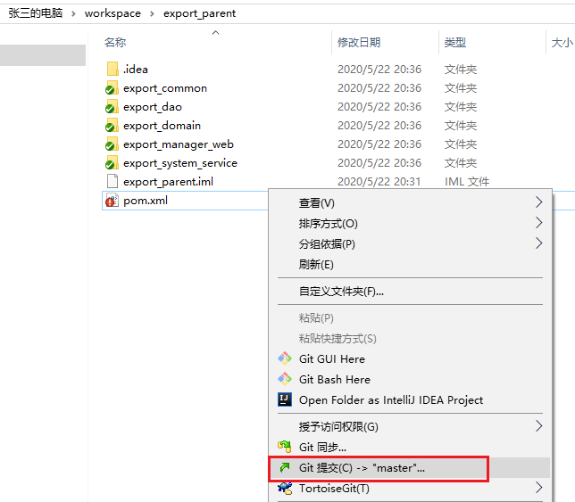
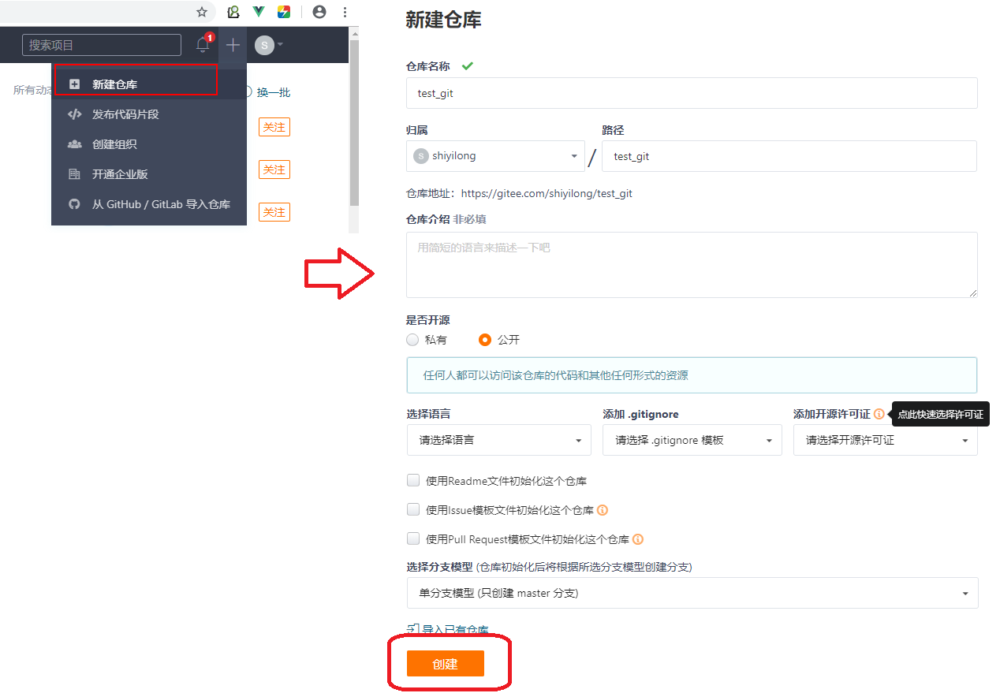
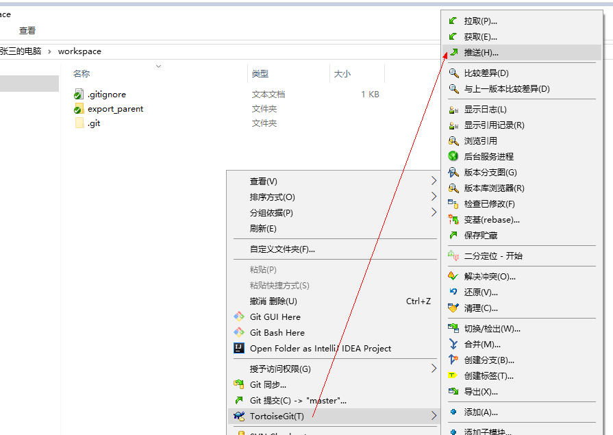
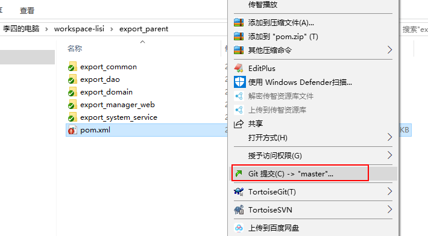
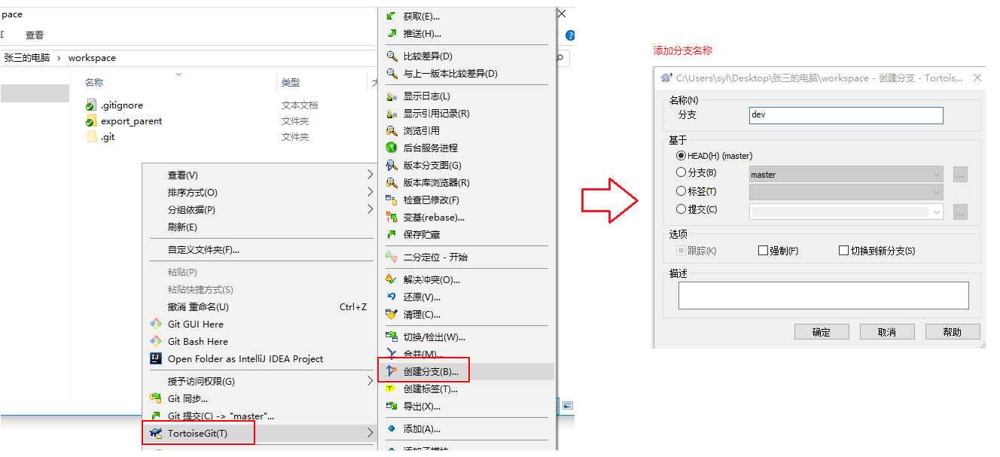
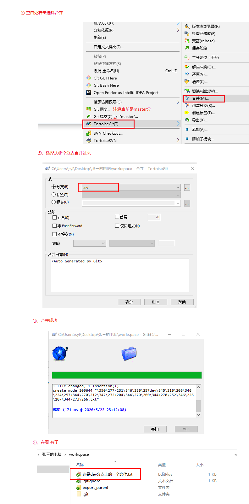
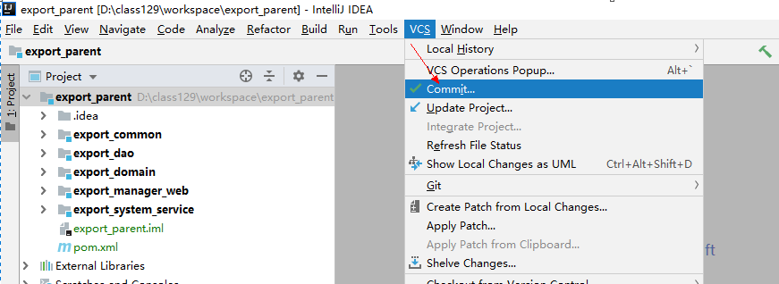
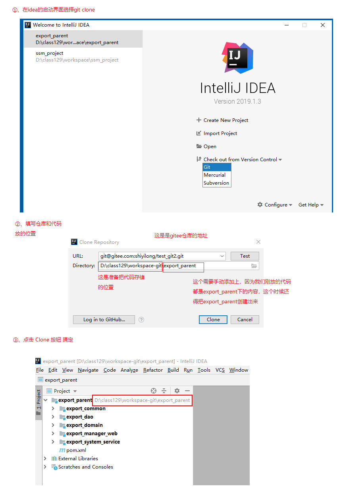

 


​                               

# 学习目标

了解git的工作流程

会使用小乌龟操作git

会在idea上操作git

使用gitlab作为git服务器


git和svn最大的区别就是 分布式

# 第1章 Git概述 

svn和git应用场景

1、多人协作

2、针对文件版本控制

## 1.1  Git历史

同生活中的许多伟大事件一样，Git 诞生于一个极富纷争大举创新的年代。Linux 内核开源项目有着为数众广的参与者。绝大多数的 Linux 内核维护工作都花在了提交补丁和保存归档的繁琐事务上（1991－2002年间）。到 2002 年，整个项目组开始启用分布式版本控制系统 BitKeeper 来管理和维护代码。

到 2005 年的时候，开发 BitKeeper 的商业公司同 Linux 内核开源社区的合作关系结束，他们收回了免费使用 BitKeeper 的权力。这就迫使 Linux 开源社区（特别是 Linux的缔造者 Linus Torvalds ）不得不吸取教训，只有开发一套属于自己的版本控制系统才不至于重蹈覆辙。他们对新的系统订了若干目标：GitHub 代码托管网站

• 速度 

• 简单的设计

• 对非线性开发模式的强力支持（允许上千个并行开发的分支）

• 完全分布式  和svn最主要的区别

• 有能力高效管理类似 Linux 内核一样的超大规模项目（速度和数据量）

  

## 1.2 Git与svn对比

### 1.2.1 Svn

SVN是集中式版本控制系统，版本库是集中放在中央服务器的，而干活的时候，用的都是自己的电脑，所以首先要从中央服务器哪里得到最新的版本，然后干活，干完后，需要把自己做完的活推送到中央服务器。集中式版本控制系统是必须联网才能工作，如果在局域网还可以，带宽够大，速度够快，如果在互联网下，如果网速慢的话，就郁闷了。

下图就是标准的集中式版本控制工具管理方式：

  

集中管理方式在一定程度上看到其他开发人员在干什么，而管理员也可以很轻松掌握每个人的开发权限。

但是相较于其优点而言，集中式版本控制工具缺点很明显：

 1、服务器单点故障

 2、容错性差

### 1.2.2  Git

Git是分布式版本控制系统，那么它就没有中央服务器的，每个人的电脑就是一个完整的版本库，这样，工作的时候就不需要联网了，因为版本都是在自己的电脑上。既然每个人的电脑都有一个完整的版本库，那多个人如何协作呢？比如说自己在电脑上改了文件A，其他人也在电脑上改了文件A，这时，你们两之间只需把各自的修改推送给对方，就可以互相看到对方的修改了。

下图就是分布式版本控制工具管理方式：

 

   

## 1.3  git工作流程

一般工作流程如下：

1．从远程仓库中克隆 Git 资源作为本地仓库。

2．从本地仓库中checkout代码然后进行代码修改

3．在提交前先将代码提交到暂存区。

4．提交修改。提交到本地仓库。本地仓库中保存修改的各个历史版本。

5．在修改完成后，需要和团队成员共享代码时，可以将代码push到远程仓库。

下图展示了 Git 的工作流程：

  

# 第2章 Git的安装

最早Git是在Linux上开发的，很长一段时间内，Git也只能在Linux和Unix系统上跑。不过，慢慢地有人把它移植到了Windows上。现在，Git可以在Linux、Unix、Mac和Windows这几大平台上正常运行了。由于开发机大多数情况都是windows，所以本教程只讲解windows下的git的安装及使用。

## 2.1     软件下载

下载地址：https://git-scm.com/download

  

 

参考资料中安装包已经下载完毕，根据不同的操作系统选择对应的安装包。

## 2.2  软件安装

### 2.2.1  安装git for windows

  

双击安装

  

一路“下一步”使用默认选项即可。注意 安装的位置先记一下

### 2.2.2  安装TortoiseGit

  

  

1、双击安装包

 

2、默认选项下会启动配置画面：

  

3、由于目前只有英文语言包，默认即可继续下一步。

配置git.exe，在2.2.1中已经安装过git-for-windows了所以在此找到git.exe所在的目录。

  

4、再下一步，配置开发者姓名及邮箱，每次提交代码时都会把此信息包含到提交的信息中。

  

  

5、使用默认配置，点击“完成”按钮完成配置。


6、完整完毕后在系统右键菜单中会出现git的菜单项。


**7、注意安装完成后重启电脑**

  

### 2.2.3  安装中文语言包

安装中文语言包并不是必选项。可以根据个人情况来选择安装。

安装时直接“下一步”完整完毕。

语言包安装完毕后可以在TortoiseGit的设置中调整语言

  

 

# 第3章 使用git管理文件版本

## 3.1 创建本地版本库两种方式

什么是版本库呢？版本库又名仓库，英文名repository，你可以简单理解成一个目录，这个目录里面的所有文件都可以被Git管理起来，每个文件的修改、删除，Git都能跟踪，以便任何时刻都可以追踪历史，或者在将来某个时刻可以“还原”。由于git是分布式版本管理工具，所以git在不需要联网的情况下也具有完整的版本管理能力。

创建一个版本库非常简单，可以使用git bash也可以使用tortoiseGit。首先，选择一个合适的地方，创建一个空目录（我在桌面上创建文件夹“张三的电脑”，里面创建workspace空文件夹）。

### 3.1.1  使用GitBash

在刚才准备好的空目录中点击右键中选择Git Bash来启动。

​    


创建仓库执行命令：

```
$ git init
```


### 3.1.2  使用TortoiseGit

1、 使用TortoiseGit时只需要在目录中点击右键菜单选择“在这里创建版本库”

 

2、

  

  

3、版本库创建成功，会在此目录下创建一个.git的隐藏目录，如下所示：

  

在windows中如何显示隐藏目录隐藏目录请自行百度o(╯□╰)o

```
概念：
版本库：“.git”目录就是版本库，将来文件都需要保存到版本库中。
工作目录：包含“.git”目录的目录，也就是.git目录的上一级目录就是工作目录。只有工作目录中的文件才能保存到版本库中。
```

## 3.2  添加项目文件

### 3.2.1 准备项目文件

我们在启动idea时选择直接打开第一天创建的父工程，因为这样产生的项目文件更全面

以下三步缺一不可


以上三个步骤做完后在export_parent中才会有 .idea文件夹和xxx.iml文件


接下来把项目放到workspace文件夹中

  

### 3.2.2 设置忽略资源


项目中有很多的文件是不需要而且是**一定不需要**提交到版本库中的，比如target文件夹、.iml文件、.idea文件夹

我们把这些文件放置到忽略配置中，放置的方式是：选中某文件 右击，

以iml文件为例


点击确定后会在workspace下产生一个 .gitionore文件


根据忽略的语法编辑


```
*.iml
target/
.idea
```


忽略文件语法规范：

```
空行或是以 # 开头的行即注释行将被忽略。
可以在前面添加正斜杠 / 来避免递归,下面的例子中可以很明白的看出来与下一条的区别。
可以在后面添加正斜杠 / 来忽略文件夹，例如 build/ 即忽略build文件夹。
可以使用 ! 来否定忽略，即比如在前面用了 *.apk ，然后使用 !a.apk ，则这个a.apk不会被忽略。
* 用来匹配零个或多个字符，如 *.[oa] 忽略所有以".o"或".a"结尾， *~ 忽略所有以 ~ 结尾的文件（这种文件通常被许多编辑器标记为临时文件）； [] 用来匹配括号内的任一字符，如 [abc] ，也可以在括号内加连接符，如 [0-9] 匹配0至9的数； ? 用来匹配单个字符。 
看了这么多，还是应该来个栗子：
# 忽略 .a 文件
*.a
# 但否定忽略 lib.a, 尽管已经在前面忽略了 .a 文件
!lib.a
# 仅在当前目录下忽略 TODO 文件， 但不包括子目录下的 subdir/TODO
/TODO
# 忽略 build/ 文件夹下的所有文件
build/
# 忽略 doc/notes.txt, 不包括 doc/server/arch.txt
doc/*.txt
# 忽略所有的 .pdf 文件 在 doc/ directory 下的
doc/**/*.pdf
```


### 3.2.1  添加项目文件过程

1、右击空白处

 


2、查看添加的内容，不用做任何操作，只是确认一下是否还有垃圾文件


 3、 完成


4、文件变为带“+”号的图标：

  

如果你的电脑重启了还不显示如上图的图标，那就参考这个帖子修改（亲测，好使）

 https://www.cnblogs.com/olive27/p/11646443.html 


5、提交文件：空白处再次点击右键，选择“提交--> "master”，此时将文件保存至版本库中。


  

  6、需要填写提交信息


7、完成


点击关闭按钮后会变成绿色对号的图标


### 3.2.2  工作区和暂存区

Git和其他版本控制系统如SVN的一个不同之处就是有暂存区的概念。

什么是工作区（Working Directory）？

工作区就是你在电脑里能看到的目录，比如我的workspace文件夹就是一个工作区。

有的同学可能会说workspace不是版本库吗怎么是工作区了？其实workspace目录是工作区，在这个目录中的“.git”隐藏文件夹才是版本库。这回概念清晰了吧。

Git的版本库里存了很多东西，其中最重要的就是称为stage（或者叫index）的暂存区，还有Git为我们自动创建的第一个分支master，以及指向master的一个指针叫HEAD。

如下图所示：

  

分支和HEAD的概念我们稍后再讲。前面讲了我们把文件往Git版本库里添加的时候，是分两步执行的：

第一步是用git add把文件添加进去，实际上就是把文件修改添加到暂存区；

第二步是用git commit提交更改，实际上就是把暂存区的所有内容提交到当前分支。 

因为我们创建Git版本库时，Git自动为我们创建了唯一一个master分支，所以，现在，git commit就是往master分支上提交更改。

你可以简单理解为，需要提交的文件修改通通放到暂存区，然后，一次性提交暂存区的所有修改。

 

## 3.3  修改文件

### 3.3.1  提交修改

被版本库管理的文件不可避免的要发生修改，此时只需要直接对文件修改即可。修改完毕后需要将文件的修改提交到版本库。

举例：修改项目的pom.xml中的内容


1、在pom.xml或者在空白处点击右键，然后选择“提交”



2、填写修改日志


3、完成


### 3.3.2  查看修改历史

在开发过程中可能会经常查看代码的修改历史，或者叫做修改日志。来查看某个版本是谁修改的，什么时间修改的，修改了哪些内容。

可以在文件上或空白处点击右键选择“显示日志”来查看文件的修改历史。

***说明：如果在文件上右击意味着只针对这个文件，如果空白处右击查看的是所有的有变更记录的文件***


  

### 3.3.3  差异比较

当文件内容修改后，需要和修改之前对比一下修改了哪些内容此时可以使用“比较差异功能”

  


  

### 3.3.4  代码恢复

当写了很多代码后发现方向错误，要恢复到以前的版本

**情况一：没有提交到master**

  举例：我修改了pom.xml中的内容，但是还没有提交，右击**还原**即可

1、右击文件 找到还原按钮


2、点击还原


3、还原成功


情况二：已经提交到master

1、先显示日志


2、选择还原的版本


3、恢复成功


3、  把恢复后的代码在提交上去


## 3.4  删除文件

需要删除无用的文件时可以使用git提供的删除功能直接将文件从版本库中删除。

  


# 第4章 远程仓库

## 4.1  添加远程库

现在我们已经在本地创建了一个Git仓库，又想让其他人来协作开发，此时就可以把本地仓库同步到远程仓库，同时还增加了本地仓库的一个备份。

常用的远程仓库就是github：https://github.com/，或者码云 [https://gitee.com](https://gitee.com/) （国内版本的GitHub）

接下来我们演示如何将本地代码同步到码云gitee。和GitHub的操作一模一样

### 4.1.1  在码云gitee上创建仓库

首先你得在gitee上注册一个账号，这个就不演示了。然后在gitee上创建一个仓库：

  

  

点击“创建”按钮仓库就创建成功了。


Github和Gitee支持两种同步方式“https”和“ssh”。如果使用https很简单基本不需要配置就可以使用，但是每次提交代码和下载代码时都需要输入用户名和密码。而且如果是公司配置的私有git服务器一般不提供https方式访问，所以我们着重将“ssh”方式。

先记录一下仓库的地址：

https （对称的加密）      https://gitee.com/shiyilong/test_git.git

ssh （非对称的加密）        git@gitee.com:shiyilong/test_git.git


### 4.1.2  ssh协议

#### 4.1.2.1   什么是ssh?

SSH是英文Secure Shell的简写形式。通过使用SSH，你可以把所有传输的数据进行加密，这样"中间人"这种攻击方式就不可能实现了，而且也能够防止DNS欺骗和IP欺骗。使用SSH，还有一个额外的好处就是传输的数据是经过压缩的，所以可以加快传输的速度。SSH有很多功能，它既可以代替Telnet，又可以为FTP、Pop、甚至为PPP提供一个安全的"通道"。

  

如果一个用户从本地计算机，使用SSH协议登录另一台远程计算机，我们就可以认为，这种登录是安全的，即使被中途截获，密码也不会泄露。

最早的时候，互联网通信都是明文通信，一旦被截获，内容就暴露无疑。1995年，芬兰学者Tatu Ylonen设计了SSH协议，将登录信息全部加密，成为互联网安全的一个基本解决方案，迅速在全世界获得推广，目前已经成为Linux系统的标准配置。

#### 4.1.2.2   ssh密钥生成

在windows下我们可以使用 Git Bash.exe来生成密钥，右键菜单打开Git Bash


git bash 执行命令,生成公钥和私钥

命令: 

```
ssh-keygen -t rsa
```

然后一路回车（意味着使用默认配置）


  

执行命令完成后,在window本地用户.ssh目录C:\Users\用户名\.ssh下面生成如下名称的公钥和私钥:

  

#### 4.1.2.3 ssh密钥配置

密钥生成后需要在gitee上配置公钥，本地才可以顺利访问。

 


  

在公钥部分将id_rsa.pub文件内容添加进去，然后点击“确定”按钮完成配置。

### 4.1.3  同步到远程仓库

1、由于TortoiseGit使用的ssh工具是“PuTTY”git Bash使用的ssh工具是“openSSH”，如果想让TortoiseGit也使用刚才生成的密钥可以做如下配置：


  

2、在“张三的电脑\workspace”文件夹下右击推送代码



3、配置远程仓库


  

Url：远程仓库的地址

推送URL：也是相同的

Putty密钥：选择刚才生成的密钥中的私钥 

添加远程仓库的分支


 

点击确定后 推送成功

 

## 4.2  从远程仓库克隆

克隆远程仓库也就是从远程把仓库复制一份到本地，克隆后会创建一个新的本地仓库。选择一个任意部署仓库的目录，然后克隆远程仓库。

我在桌面上创建文件夹“李四的电脑”，里面创建workspace-lisi空文件夹

举例：张三、李四两个人合作做项目，刚才就相当于张三把框架代码上传到了gitee了，现在张三这个人要从gitee上克隆代码，才能进行开发

李四的电脑\workspace-lisi文件夹下右击


   

  


## 4.3  从远程仓库取代码

Git中从远程的分支获取最新的版本到本地有这样2个命令：

1. git fetch：相当于是从远程获取最新版本到本地，不会自动merge（合并代码）

2. git pull：相当于是从远程获取最新版本并merge到本地

上述命令其实相当于git fetch 和 git merge

在实际使用中，git fetch更安全一些

因为在merge前，我们可以查看更新情况，然后再决定是否合并

如果使用TortoiseGit的话可以从右键菜单中点击“拉取”（pull）或者“获取”（fetch）

  


## 4.4  解决冲突

 场景介绍：张三修改了一个文件比如pom.xml，提交到gitee上后没有告诉李四，这个时候李四也修改了pom.xml，李四在推送到gitee上的时候发现推送不了，因为有代码的冲突，这个时候他只能先拉取下来然后把冲突解决后才能正常提交代码。接下来看具体操作的演示：

1、张三修改pom.xml后，提交并推送到gitee上


搞定


2、李四开始修改pom.xml，稳妥一些，先提交




提交是没有问题的


3、开始推送，就直接点击“推送”按钮即可


发现报错，推送不上去，这个时候根据 提示 直接点击家 “拉取” 按钮

4、开始先拉取，直接点击确定


5、确定后 pom.xml的图标变了


在点击如图右侧的“关闭” 按钮，会出现一个询问框 直接点击“否” 不用管它


6、开始真正的解决冲突，选择文件右击编辑冲突

 


进入到解决冲突界面


解决完成后黄色叹号的图标就没有，可以直接提交并且推送到gitee了，这个时候需要告诉张三一声，让他拉取最新的代码


# 第5章 分支管理

分支的应用场景：

1、框架上有很多的改动，可以先打出一个分支，再分支上试着框架的改动是否成功，如果成功了再把分支的代码合并到主干上

2、互联网项目打版本，每一个版本就是一个分支


## 5.1 创建合并分支

在我们每次的提交，Git都把它们串成一条时间线，这条时间线就是一个分支。截止到目前，只有一条时间线，在Git里，这个分支叫主分支，即master分支。HEAD指针严格来说不是指向提交，而是指向master，master才是指向提交的，所以，HEAD指向的就是当前分支。

一开始的时候，master分支是一条线，Git用master指向最新的提交，再用HEAD指向master，就能确定当前分支，以及当前分支的提交点：

  

每次提交，master分支都会向前移动一步，这样，随着你不断提交，master分支的线也越来越长。

当我们创建新的分支，例如dev时，Git新建了一个指针叫dev，指向master相同的提交，再把HEAD指向dev，就表示当前分支在dev上：

  

你看，Git创建一个分支很快，因为除了增加一个dev指针，改改HEAD的指向，工作区的文件都没有任何变化！ 

不过，从现在开始，对工作区的修改和提交就是针对dev分支了，比如新提交一次后，dev指针往前移动一步，而master指针不变：

  

假如我们在dev上的工作完成了，就可以把dev合并到master上。Git怎么合并呢？最简单的方法，就是直接把master指向dev的当前提交，就完成了合并：

  

所以Git合并分支也很快！就改改指针，工作区内容也不变！ 

合并完分支后，甚至可以删除dev分支。删除dev分支就是把dev指针给删掉，删掉后，我们就剩下了一条master分支：

  

## 5.2  使用TortoiseGit实现分支管理

使用TortoiseGit管理分支就很简单了。

### 5.2.1  创建分支

在张三/workspace仓库文件夹中点击右键，然后从菜单中选择“创建分支”：

  

如果想创建完毕后直接切换到新分支可以勾选“切换到新分支”选项或者从菜单中选择“切换/检出”来切换分支：

  


切换成功


### 5.2.2  合并分支

场景：分支切换到dev后就可以对工作区的文件进行新增或修改，然后提交到dev分支，原来的master分支不受影响。例如我们在的dev分支中添加一个文件，然后提交到dev分支。这个时候在切换到master分支后会发现没有刚才新增的文件，如果想出现需要合并dev分支

接下来演示：

1、确定目前是否为dev分支


2、创建一个新的文件，并且提交到dev分支上


3、切换到master分支发现没有刚才那个文件


 

 4、开始合并

如果dev上的内容要合并到master上，那么当前分支一定是master




# 第6章 在IntelliJ IDEA中使用 git

## 6.1  在Idea中配置 git

安装好 IntelliJ IDEA后，如果Git 安装在默认路径下，那么 idea 会自动找到 git 的位置，如果更改了 Git 的安装位置则需要手动配置下Git 的路径。

选择 File→Settings 打开设置窗口，找到 Version Control下的 git 选项：

  

选择 git 的安装目录后可以点击“Test”按钮测试是否正确配置。

  

 

## 6.2  将工程添加至 gitee

1）创建本地仓库

在菜单中选择“vcs”→Import into Version Control→Create Git Repository...


 


 选择工程目录，然后点击“OK”按钮，在工程的目录创建本地仓库，那么export_parent目录就是本地仓库的工作目录，此目录中的工程就可以添加到本地仓库中。也就是可以把export_parent工程添加到本地仓库中。选择之后在工具栏上就多出了 git 相关工具按钮：

  

2） 设置忽略的文件和文件夹

**1、安装 .ignore 插件**  (需要连网)

​	在Idea中选择 File -> Plugins -> 搜索插件 .ignore 。并进行安装，安装完成后，重启Idea即可。


**2、创建忽略文件**

​	插件安装完成后，在父工程下，新建文件 -> .ignore file -> .gitignore


​	同时选择当前语言，此处选择Java。点击generate即可。


​	文件创建完成后，其内部会忽略 所有的 .class 、.log 、.jar等等的文件。同时根据提示会把当前工程的目录添加到文件中。


此时注意，在最终进行提交时，对于所有的target、.idea、*.iml目录，也是无需提交的，所以需要把该目录指定到忽略文件中。

​	

​	最后提交项目到远程仓库，可以发现target下的内部不会被提交到远程仓库了。

 


3） 将工程添加至本地仓库

先添加到暂存区

  

 

然后点击 commit 按钮，将工程提交至本地仓库。



 

提交时填写提交信息，并且去掉两个代码的检查


4）推送到远程

在 github或gitee上远程仓库中上创建一个仓库然后将本地仓库推送到远程。 

我们选择在gitee上重新创建一个仓库名称为test_git2


 仓库的地址是：https://gitee.com/shiyilong/test_git2.git

​                             git@gitee.com:shiyilong/test_git2.git

 

在菜单中选择 vcs→git→push

  

 填写仓库路径，然后push

  


成功


## 6.3  从远程仓库克隆

关闭工程后，在 idea 的欢迎页上有“Check out from version control”下拉框，选择 git此处仍然推荐使用 ssh形式的 url，点击“test”按钮后显示连接成功。点击 OK按钮后根据提示将远程仓库克隆下来，然后倒入到 idea 中。

或者直接在IDEA中用以下方式克隆：




 

## 6.4 断开git

第一步：进入到项目中 直接删除   .git 文件夹


第二步：回到idea中会报错，点击错误信息


# 第7章 代码私仓GitLab(了解)

## 7.1 GitLab简介

​	在公司开发中如果代码不让暴露到外网时，可以在公司内部搭建一个只供公司内部使用的git公共服务器，这时我们可以使用GitLab，其使用与Gitee类似。

​	官方网站:https://about.gitlab.com/


## 7.2 GitLab安装

此处以centos7为例。

启动虚拟机时，网络设置成NAT模式，虚拟机的内存设置4个G


1）安装并配置依赖项，同时打开HTTP访问和SSH访问

```
sudo yum install -y curl policycoreutils-python openssh-server
sudo systemctl enable sshd
sudo systemctl start sshd
sudo firewall-cmd --permanent --add-service=http
sudo systemctl stop firewalld
```

2、安装GitLab软件包

上传今天资料中的gitlib软件包


上传完成后执行安装命令 （会持续10多秒或几十秒左右没有反应，等待一会儿即可）

```
rpm -i gitlab-ce-12.10.6-ce.0.el7.x86_64.rpm
```


3、初始化GitLab配置（这一步也需要一些时间，大概3、5分钟，甚至十来分钟）

```
sudo gitlab-ctl reconfigure
```


其他命令

```
# 启动 gitlab 服务
gitlab-ctl start

# 停止 gitlab 服务
gitlab-ctl stop
```

默认安装位置


4、访问登录

​	gitLab默认端口号是80，直接输入ip访问，首次访问时，会重定向到重置密码页面，设置初始化登录密码。默认用户名为**root**。当重置成功，跳转到登录页面，输入用户名/密码登录即可


登录成功后，进入主页


​	默认语言使用的英文，如果想修改为中文的话。操作步骤：右上角头像 -> Settings -> Preferences -> Language -> 简体中文 -> save changes。 然后刷新当前页面即可。


## 7.3 GitLab使用

### 7.3.1 创建组及组权限配置

​	在GitLab组相当于团队，在项目开发过程中，每个组有不同的组员和对应的不同的子项目,对项目组用户开放项目的访问。

​	在GitLab首页选择**Create a Group**，进入创建页面，输入群组名称，群组URL，群组描述，同时还需选择可见性级别，其相当于设置组权限。

​	在可见性级别中包含三种：

​	私有：群组及其项目只能由成员查看

​	内部：任何登录的用户都可以查看该群组和任何内部项目

​	公开：不进行身份验证，可以随意查看。


​	当输入完信息，点击创建群组即可完成组的创建。


### 7.3.2 创建用户及用户权限配置

#### 7.3.2.1 创建用户

​	组有了之后，还需要向组内添加项目组成员。


​	当点击 **新用户** 后，会进入到添加用户页面，需要输入Name、Username、和Email。最后点击create user即可。


​	接着以管理员身份，重新进入到成员列表页面，此时已经可以看到新增了一个 **member1** 用户。接着点击 **编辑**，设置该用户的登录密码。


#### 7.3.2.2 用户进组，及用户权限指定

​	现在有了组和用户后，可以将指定用户添加到组中。


​	当进入到组的详情页面中之后，即可将指定用户添加到组中。首先需要先确定当前被操作的用户。接着需要指定当前用户的身份权限。

​	身份对应权限，总共有五个选项，分别为：

- ​	Guest：可以创建issue、发表评论，不能读写版本库
- ​	Reporter：可以克隆代码，不能提交，QA、PM可以赋予这个权限
- ​	Developer：以克隆代码、开发、提交、push，RD可以赋予这个权限
- ​	Maintainer：可以创建项目、添加tag、保护分支、添加项目成员、编辑项目，核心RD负责人可以赋予这个权限
- ​	Owner：可以设置项目访问权限 - Visibility Level、删除项目、迁移项目、管理组成员，开发组leader可以赋予这个权限

可以根据实际人员情况，进行人员角色权限分配。此处选择 **Developer**（注意没有创建项目的权限，也就是说不能把项目代码初始化到gitLab中）


​	

### 7.3.3 创建项目

​	GitLab核心作用是作为代码仓库，因为它可以像GitHub一样进行代码托管。首先需要创建好项目，然后把项目指派该开发组。


​	当进入到新建项目页面，GitLab提供了三种创建方式：空白项目、从模板创建、导入项目。此处使用 **空白项目** 。对于权限仍然是三个，与组权限相同。

​	

当创建成功，即可进入到项目页面。


并且此时，进入到项目组详情页面，可以看到该项目组已经关联了一个项目


## 7.4 Idea集成GitLab

### 7.4.1 安装GitLab插件

​	选择File -> Settings -> Plugins 。搜索gitlab。


​	当安装完成并重启Idea后，选择 VCS -> Import into version control。会出现一个新的选项 **Share Project on GitLab**。

**（2）配置GitLab**（这个是SSH方式连接需要的，如果使用https访问方式，这一步不需要）

​	首先需要创建访问token令牌。


​	当点击 创建个人访问令牌后，会显示你当前的访问令牌。


**（3）将访问令牌配置到Idea中**（这个是SSH方式连接需要的，如果使用https访问方式，这一步不需要）

​	在Idea中，选择 File -> Settings -> Version Control -> GitLab -> Add a new GitLab Server


​	在页面中，配置GitLab中获取到的Token相关信息。


### 7.4.2 提交代码到GitLab远程仓库

**（1）将工程目录指定为本地仓库**

​	在Idea中，选择VCS -> import into version control -> create git repository 。接着选择当前操作的工程目录文件夹即可。

​	

(2) 创建 配置忽略资源的文件


（3）项目代码添加到暂存区


（4）、提交代码


（5）推送代码


### 7.4.3 clone、提交、合并、冲突解决

这些操作都和gitee是一样的，这里就不再演示了

### 7.4.4 代码历史追溯

​	在项目开发过程中，有时需要查看代码的提交历史，或者将当前代码回退到某一个提交历史上。

**（1）查看历史版本**

​	对于代码历史的查看，打开Idea，**右键当前项目 -> Git -> show History**。即可展示当前工程的操作历史。

​	在信息栏中会展示整个项目的提交历史过程、每个历史的提交人、提交时间、提交内容、提交备注


**（2）回退指定版本**

​	在左边选中你要回退的版本，直接复制右边的代码


记得再把代码提交+推送


## 7.5 分支管理

### 7.5.1 分支介绍

到现在为止，对于GitLab的操作，我们操作的都是主分支master。


​	但是在实际项目开发中，对于master这条主分支，一般是不会让程序员随意操作的，在master这条主分支上的代码一般都是一个项目的稳定版本的功能代码，在开发的过程中，一般会另外开启一个分支，开发人员对于功能代码的提交会提交到开发分支上，当功能开发完成，在由开发分支合并到主分支，这样既有利于多人协作开发，也可以减少冲突问题的出现。

​	在项目开发的过程中，如临时修改BUG、开发不确定是否上线的功能等，都可以创建一个分支，等待合适的时机再合并到主干master。

### 7.5.2 分支创建

​	打开Idea，选择**Git -> Repository -> Branches**。选择 **new Branch**。即可创建一个新分支。


​	在弹出页面，输入新分支名称，此处叫做 dev。默认已经勾选了 checkout branch。代表切换到这个分支。


​	当点击Create后，即可完成分支创建，并切换到该分支下。


 如果想再回到master分支上：


​	此时在该分支下，修改文件内容，并提交到GitLab远程仓库。


​	当进行push 时， 可以看到，当前正在使用dev分支。


​	当提交成功后，回到GitLab，可以看到，当前存在两个分支，dev和master


​	进入到dev分支，即可看到刚才提交的信息了。


​	当前提交的内容只会存在于dev分支，在master中不会产生更新。

### 7.5.3 分支切换

​	当存在多分支时，有时还需要去选择不同的分支进行操作，现在处于dev分支，要想重新切换回master分支，应该如何操作呢？

​	右键当前项目 -> Git -> Repository -> Branches -> 选择对应分支即可。


​	同时当从dev切换到master后，对应的文件内容也会发生变化，读取当前分支下的内容。


​	刚才添加的方法已经消失。

### 7.5.4 分支合并

​	当功能开发完毕，还需要进行分支合并的操作，此处以dev合并到master为例。同时为了演示分支合并产生的冲突，还需要在master分支下，对类中功能代码进行修改。

**1、修改master分支下的DemoController**


**2、dev合并到master**

​	在Idea中，**右键当前项目 -> Git -> Repository -> pull**。在弹出窗口中，勾选要操作的分支，此处选择dev和master


​	因为在**master**和**dev**这两个分支中的DemoController类中的内容不同，因此在 **pull** 时，会产生代码冲突。


​	此时就需要对冲突问题进行修复，思路与普通代码冲突一样，沟通协调，修改什么，保留什么等。此处全部保留下来。


​		调整完后，重新进行提交即可。


### 7.5.5 分支删除

​	当分支没有存在意义，可以选在将分支删除掉，但是这种操作一般都是由团队Leader进行的。

​	操作步骤：**右键当前项目 -> Git -> Repository -> Branches**。选择要操作的分支，执行具体操作即可。


# 第8章 🎗 经验分享

## 1 已知的操作错误

在idea中使用git完成远端push时，出现错误信息如下：


## 2 问题所在

出现此问题的原因，是当前操作人员提交版本和服务器上最新版本代码不一致.

## 3 解决办法

1、直接点击merge进入合并页面，选择文件进行冲突处理

2、右键出问题项目-->git--> Resolve Conflicts...

以上两种方式均可

**（1） Merge**

点击merge之后，对列表中出现冲突的所有文件进行依次处理


> 解决方案如下：
>
> 　　accept yours:代表以自己的为准；
>
> 　　accept theris:代表以更新下来的文件为准；
>
> 　　merge:代表手动合并
>
> 　　一般解决冲突我们都是选择merge

**（2） 选中文件，点击Merge进入手动冲突解决**


> 将需要的内容点击：">>"既可以合并内容到result中，不需要的内容点击“x”即可，合并完成后点击apply即可。
>
> 　　值得注意的是，最将所有的“x >>”符号都要处理完，不需要的点击“x”,需要的点击“>>”
>
> 　　最后，不论是什么场景下产生的冲突解决方法是一样的。

## 4 问题分析

> 1、多人协作开发的时候,如果出现了你没有改过的文件跟你冲突了,一定要去找到当事者,说清楚是如何冲突的，<font color='red'>然后协商解决,千万不要擅自拉别的分支去试图解决冲突,或找文件覆盖，更或者以自己的文件为准</font>
>
> 2、在向远端服务器push前，一定要保证代码正确性
>
> 3、git操作时，推荐通过忽略文件，将基本配置信息忽略提交
>
> 4、出现push失败，往往出现的原因是团队协作时的代码冲突，解决办法很简单，先更新。并手动merge


今天作业：


1、了解git和SVN的区别

2、安装git本地仓库软件和git小乌龟客户端软件

3、学习git小乌龟的使用，包括操作本地仓库和远端仓库（gitee）

4、学习git分支的操作

5、在idea上使用git

6、学习使用gitlab

7、可以以组为单位，多人协作使用gitee，故意造出一些冲突来练手


