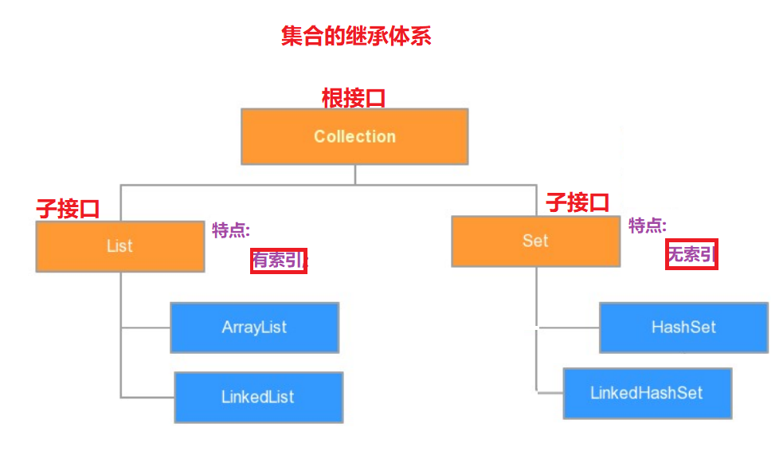
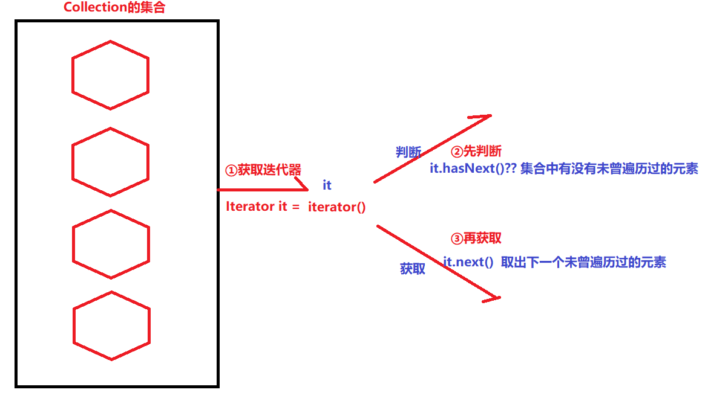
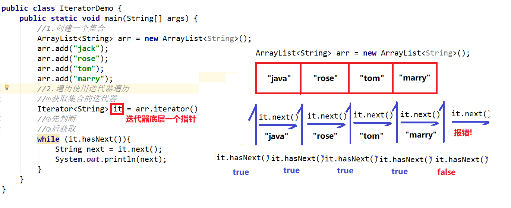
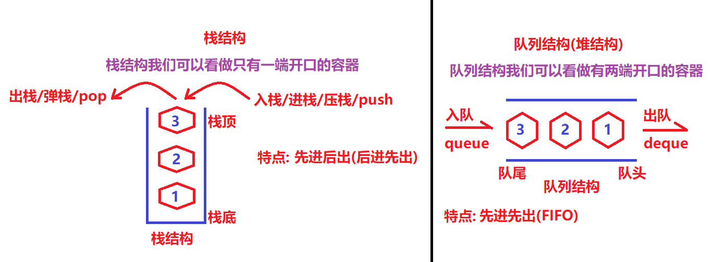
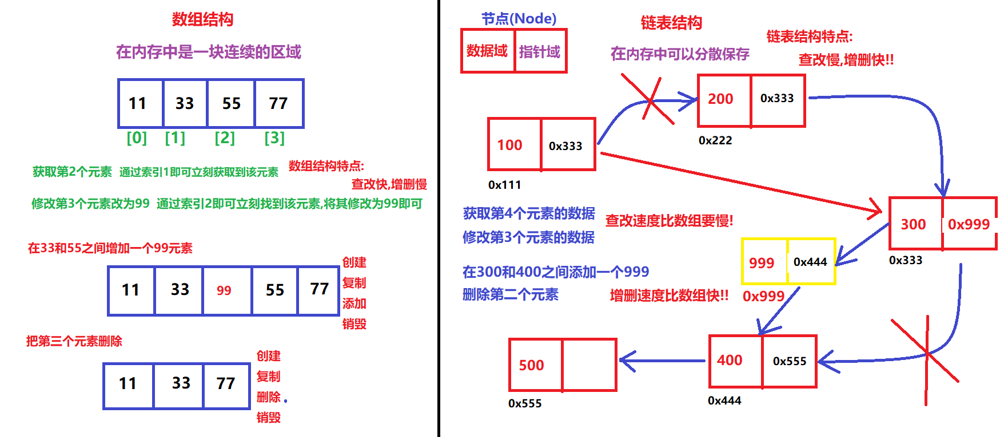

# 【Collection、泛型、数据结构】

### 第一章 Collection集合

##### 1.集合的介绍&集合和数组的区别

```java
什么是集合: 就是Java中的容器,可以保存多个元素的

集合和数组的区别是什么??
    a.集合长度是可变的,数组长度是固定的
	b.集合中只能保存引用类型的元素,数组中可以保存任意类型 
```

##### 2.集合框架的继承体系



##### 3.Collection中的通用方法

```java
增: add(E e);
删: remove(元素);
改: 无!
查: 无!
其他:
	public int size();获取集合中元素的个数
    public boolean isEmpty(); 判断集合是是否没有元素的(本身就是看集合的size是否为0)
    public boolean contains(元素); 判断集合中是否包含某个元素
    public Object[] toArray();可以集合转成数组
    public void clear(); 清空集合(把集合中所有元素删掉,本质就是把size变为0)    
        
public class CollectionDemo {
    public static void main(String[] args) {
        //1.测试一下接口中的通用方法
        Collection<String> cc = new ArrayList<String>();
        //2.测试
        //增加
        cc.add("java");
        cc.add("php");
        cc.add("c++");
        cc.add("python");
        System.out.println(cc);
        //删除
        cc.remove("php");
        System.out.println(cc);
        //其他
        System.out.println("长度:"+cc.size());
        System.out.println("是否包含:"+cc.contains("php"));
//        cc.clear();
        System.out.println("集合是否为空集合:"+cc.isEmpty());
        System.out.println(cc);
        //转成数组
        Object[] objs = cc.toArray();
        System.out.println(objs.length);
        System.out.println(objs[0]);
        System.out.println(objs[1]);
        System.out.println(objs[2]);
    }
}        
```

### 第二章 Iterator迭代器

##### 1.集合迭代器的介绍和使用

```java
迭代器:我们也可以叫"遍历器",用于遍历Collection下的所有集合
    
public class IteratorDemo {
    public static void main(String[] args) {
        //1.创建一个集合
        ArrayList<String> arr = new ArrayList<String>();
        arr.add("jack");
        arr.add("rose");
        arr.add("tom");
        arr.add("marry");
        arr.add("jerry");
        arr.add("bob");
        //2.遍历使用迭代器遍历
        //①获取集合的迭代器
        Iterator<String> it = arr.iterator();
        //②先判断
        //③后获取
        while (it.hasNext()){
            String next = it.next();
            System.out.println(next);
        }
    }
}    
```



- 迭代器的注意事项(2个异常):

  ```java
  a.NoSuchElementException:没有这样的元素异常
      	原因: it的hasNext为false后再继续调用it的next方法
  b.ConcurrentModificationException:并发修改异常
      	原因:当使用迭代器遍历集合的过程,是不允许直接向集合中添加或者删除元素的!!!
  记住: 迭代器的作用就是单纯的遍历!!!            
  ```

##### 2.迭代器的原理(画图)

```java
迭代器底层是通过一个"指针"进行的
```



##### 3.增强for循环

```java
什么是增强for循环: 对普通循环上格式的一种简化!!但是原理是不一样!!
    
格式:
	for(数据类型 变量名 : 集合/数组){
        sout(变量名);
    }

public class ForeachDemo {
    public static void main(String[] args) {
        //1.数组
        int[] arr1 = {11,22,33,44,55};
        //2.遍历
        for(int num : arr1){
            System.out.println(num);
        }
        System.out.println("-----------");
        //3.集合
        ArrayList<String> arr2 = new ArrayList<String>();
        arr2.add("java1");
        arr2.add("java2");
        arr2.add("java3");
        arr2.add("java4");
        arr2.add("java5");
        //4.遍历
        for (String name : arr2) {
            System.out.println(name);
        }
    }
}
对于集合来说: 增强for循环原理其实就是我们学的迭代器,因此不能在增强for循环直接对集合进行增删操作 
对于数组来说: 增强for循环原理也是fori循环      
```

### 第三章 泛型

##### 1.什么是泛型

```java
格式: <E> 其中E可以写一种引用类型,是JDK1.5的新特性
泛型是什么??
    是一种不确定引用类型,由程序员使用时再去确定
```

##### 2.泛型的好处

```java
a.避免了类型转换的麻烦
b.也不会出现类型转换异常,最多出现编译时类型不一致报错!
public class TestDemo {
    public static void main(String[] args) {
        //泛型的好处!
        method02();
    }
    //使用泛型
    public static void method02(){
        //1.创建集合
        ArrayList<String> arr = new ArrayList<String>();
        //2.添加数据
        arr.add("java");
        arr.add("199");
        arr.add("3.14");
        arr.add("true");
        arr.add("A");
        //3.遍历
        for (String s:arr){
            System.out.println(s.length());
        }
    }

    //不会用泛型
    public static void method01(){
        //1.创建集合
        ArrayList arr = new ArrayList();
        //2.添加数据
        arr.add("java");
        arr.add(199);
        arr.add(3.14);
        arr.add(true);
        arr.add('A');
        //3.取出
        for(Object s :arr){
            String ss = (String)s;
            int len = ss.length();
            System.out.println(len);
        }
    }
}
总结: Java从JDK1.5之后,强烈建议使用泛型(我们必须使用泛型!!)    
```

##### 3.泛型的定义和使用

- ##### 泛型类 

  ```java
  泛型类: 含有泛型的类,比如ArrayList<E>
  格式:
  	public class 类名<E>{
       	//成员变量
          //成员方法
      }
  定义:
  	public class Dog<E> {
          private E age;
  
          public E getAge() {
              return age;
          }
  
          public void setAge(E age) {
              this.age = age;
          }
      }
  
  使用:
  	public class TestDemo {
          public static void main(String[] args) {
              //1.创建对象
      //        Dog d1 = new Dog();
      //        d1.setAge("10");
              //2.再次创建对象
              Dog<String> d2 = new Dog<String>();
              d2.setAge("10");
              String age = d2.getAge();
              System.out.println(age);
  
              Dog<Integer> d3 = new Dog<Integer>();
              d3.setAge(10);
              Integer age1 = d3.getAge();
              System.out.println(age1);
          }
      }
  
  ```

- ##### 泛型方法

  ```java
  泛型方法:在方法上定义泛型
  格式:
  	public <E> 返回值类型 方法名(数据类型 变量名){
          
      }
  
  定义:
  	public class Demo {
          public static <MVP> void show(MVP age){
              System.out.println(age);
          }
      }
  
  使用:
  	public class TestDemo {
          public static void main(String[] args) {
              //1.调用方法
              Demo.<String>show("100");
              Demo.<Integer>show(100);
              Demo.<Double>show(3.14);
          }
      }
  ```

- ##### 泛型接口

  ```java
  泛型接口:接口上写泛型
  格式:
  	public interface 接口名<E>{
          //各种方法
      }
  
  定义:
  	public interface MyInterface<Q> {
          void show(Q s);
          void add(Q s);
      }
  
  使用:
  	//接口上泛型的两种确定方式
      //a.在实现类实现接口时,直接确定泛型
      class MyClass1 implements MyInterface<Integer>{
          @Override
          public void show(Integer s) {
  
          }
          @Override
          public void add(Integer s) {
  
          }
      }
  
      //b.在实现类实现接口中,泛型继续保留
      class MyClass2<Q> implements MyInterface<Q>{
          @Override
          public void show(Q s) {
  
          }
  
          @Override
          public void add(Q s) {
  
          }
      }
      //此时这个实现类其实就是泛型类,创建该类对象时确定Q即可!!!
  ```


##### 4.泛型统配符

```java
泛型通配符: <?> 表示任意泛型均可
作用:不知道使用什么类型来接收的时候,此时可以使用?,?表示未知通配符。
    
public class TestDemo {
    public static void main(String[] args) {
        //1.创建几个集合
        ArrayList<String> arr1 = new ArrayList<String>();
        ArrayList<Integer> arr2 = new ArrayList<Integer>();
        ArrayList<Double> arr3 = new ArrayList<Double>();
        //...
        //2.需求:定义一个方法,要求可以接受以上任意一个集合
        show(arr1);
        show(arr2);
        show(arr3);
    }
    //定义一个方法
    //泛型不支持多态
    //ArrayList<Animal> arr = new ArrayList<Dog>();
    //ArrayList<Object> arr = new ArrayList<String>();
    public static void show(ArrayList<?> arr){

    }
}       
```

##### 5.泛型的上下限[重点]

```java
泛型的上限:<? extends Animal>: 代表该泛型必须是Animal本类或者Animal的子类
泛型的下限:<? super Dog> : 代表该泛型必须是Dog本类或者Dog的父类    

public class TestDemo {
    public static void main(String[] args) {
        Collection<Integer> list1 = new ArrayList<Integer>();
        Collection<String> list2 = new ArrayList<String>();
        Collection<Number> list3 = new ArrayList<Number>();
        Collection<Object> list4 = new ArrayList<Object>();
        //Object
        //  Number
        //      Integer
        //  String
        //编译通过or报错
        getElement1(list1); //OK
//        getElement1(list2);  //NO
        getElement1(list3); //OK
//        getElement1(list4); //NO

//        getElement2(list1); //NO
//        getElement2(list2); //NO
        getElement2(list3); //OK
        getElement2(list4); //OK

    }
    //方法1
    //<? extends Number>: ? <= Number
    public static void getElement1(Collection<? extends Number> coll){

    }
    //方法2
    //<? super Number>: ? >=Number
    public static void getElement2(Collection<? super Number> coll){

    }
}    
```

### 第四章 数据结构

##### 1.什么是数据结构

```java
数据结构:就是容器中保存数据的结构
    案例:
		我租了一个仓库,准备卖大米,于是我们进了好多好多好多袋大米(普通米,东北米,意大利米,小米...)
    现在我们两种放大米的方案:
		a.平铺法: 
		b.堆叠法:
```

##### 2.常见的4+1种数据结构

```java
栈结构: 先进后出
队列(堆)结构: 先进先出
数组结构: 查询快,增删慢
链表结构: 查询慢,增删快

红黑树结构: 查找效率非常恐怖!
```





##### 总结

```java
能够说出集合与数组的区别
    a.长度 b.数据类型
能够使用Collection集合的常用功能(7个)
    add,remove,size,clear,isEmpty,toArray,contains
    
能够使用迭代器对集合进行取元素
    a.获取迭代器
    	Iterator<E> it = 集合对象.iterator();
	b.先判断
        while(it.hasNext()){
            c.再获取
         	String next = it.next();
            System.out.println(next);
        }
能够使用增强for循环遍历集合和数组
     for(数据类型 变量名:集合/数组){
		System.out.println(变量名);
     }
=====================    
    
能够理解泛型上下限
    <? extends 类名>: 上限
    <? super 类名>: 下限
能够阐述泛型通配符的作用
    <?> 代表任何泛型均可
        
=====================        
能够说出常见的数据结构
能够说出数组结构特点
        查询快,增删慢
能够说出栈结构特点
        先进后出
能够说出队列结构特点
        先进先出
能够说出单向链表结构特点
        查询慢,增删快
        
```

