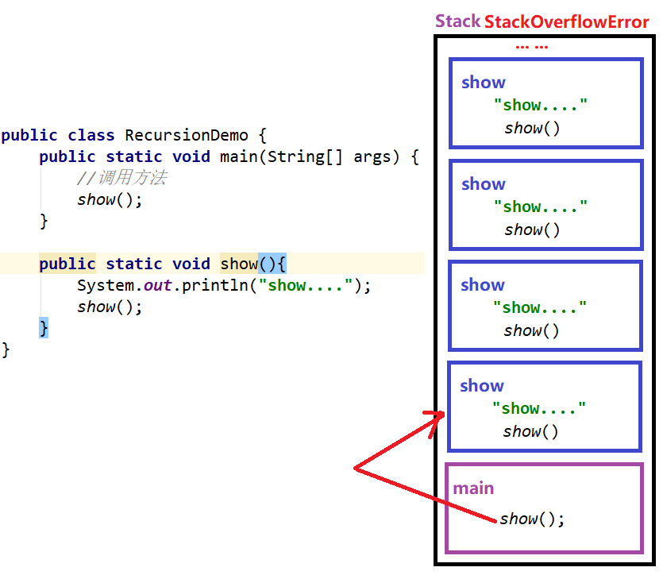
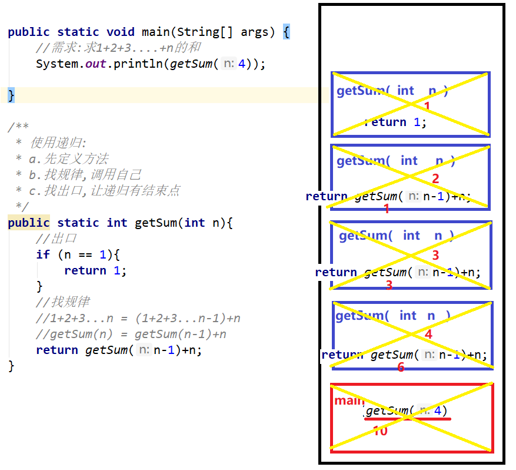
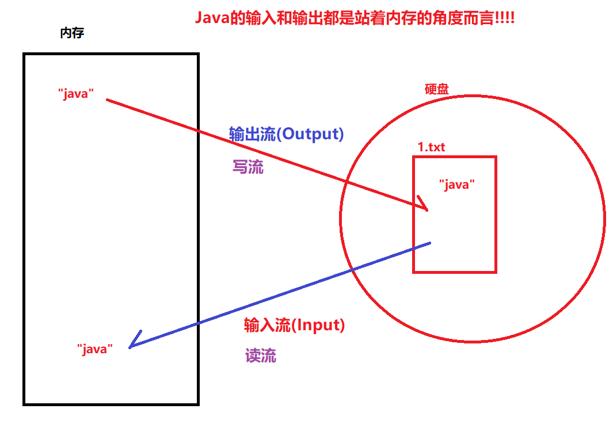
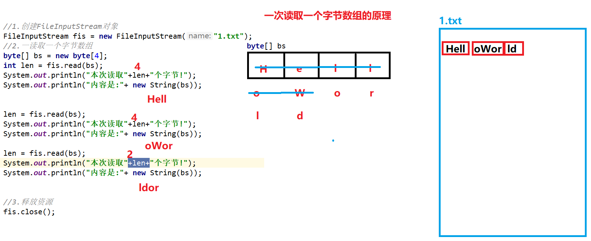

# 【File类、递归、字节流】
### 一.File类 

##### 1.File类的作用

```java
可以用来表示磁盘上的某个文件或者某个文件夹
```

##### 2.File类的构造

```java
public File(String pathname);以指定的路径创建File对象
public File(String parent,String child);以指定父路径和子路径创建File对象 
public File(File parent,String child);以指定父File对象和子路径创建File对象    
public class FileDemo01 {
    public static void main(String[] args) {
        //File类的构造方法
        //1.直接指定路径
        File f1 = new File("C:\\Users\\Administrator\\Desktop\\temp\\aaa\\1.txt");
        System.out.println(f1);
        File f2 = new File("C:\\Users\\Administrator\\Desktop\\temp\\aaa\\111");
        System.out.println(f2);
        //2.以指定父路径和子路径创建File对象
        File f3 = new File("C:\\Users\\Administrator\\Desktop","temp\\aaa\\1.txt");
        System.out.println(f3);
        //3.以指定父File对象和子路径创建File对象
        File parent = new File("C:\\Users\\Administrator\\Desktop");
        File f4 = new File(parent,"temp\\aaa\\1.txt");
        System.out.println(f4);
    }
}       
```

##### 3.File类的获取方法

```java
public String getAbsolutePath(); 获取文件的绝对路径
public String getPath(); 获取构造时传入的路径
public String getName(); 获取名字(不带路径)
public int length();获取大小(单位字节)

/**
 * File类的获取方法
 */
public class FileDemo02 {
    public static void main(String[] args) {
        //1.创建File对象
        File f1 = new File("C:\\Users\\Administrator\\Desktop\\temp\\aaa\\1.txt");
        //2.获取绝对路径(以盘符开头的路径)
        String absolutePath = f1.getAbsolutePath();
        System.out.println(absolutePath);
        //3.获取构造时传入的路径
        String path = f1.getPath();
        System.out.println(path);
        //3.获取名字
        System.out.println(f1.getName());
        //4.获取大小
        System.out.println(f1.length());
    }
}
注意事项:
	length方法只适用于获取文件的长度,不能获取文件夹的长度(获取到的是一个不确定的值)
```

##### 4.相对路径和绝对路径的概念[重点]

```java
绝对路径: 以盘符开头的全路径
    比如: "C:\\Users\\Administrator\\Desktop\\temp\\aaa\\1.txt"
        
相对路径: 相对于当前项目的根目录而言的
    比如: "111.txt"   --->  当前项目根目录/111.txt

/**
 * 相对路径和绝对路径
 */
public class FileDemo03 {
    public static void main(String[] args) {
        //1.绝对路径
        File f1 = new File("C:\\Users\\Administrator\\Desktop\\temp\\aaa\\1.txt");
        System.out.println(f1.getAbsolutePath());
        System.out.println(f1.getPath());
        //2.相对路径
        File f2 = new File("222.txt");
        System.out.println(f2.getAbsolutePath());
        System.out.println(f2.getPath());
        //绝对路径: E:\workspace\heima34\abc\222.txt
        //相对路径: abc\222.txt
    }
}        
```

##### 5.File类的判断方法

```java
public boolean isFile(); 判断是否为文件
public boolean isDirectory();判断是否为文件夹
public boolean exists();判断是否存在
    
/**
 * File类的判断方法
 */
public class FileDemo04 {
    public static void main(String[] args) {
        //1.创建File对象
        File f1 = new File("222.txt");
        //2.判断
        System.out.println(f1.isFile()); //true
        System.out.println(f1.isDirectory()); //false
        System.out.println(f1.exists());//true
        System.out.println("-------------");
        //3.创建File对象
        File f2 = new File("bbb");//不存在的bbb
        //4.判断
        System.out.println(f2.isFile()); //false
        System.out.println(f2.isDirectory()); //false
        System.out.println(f2.exists());//false
    }
}
注意:
	1.判断是文件还是文件夹不能看名字!!
        因为文件夹可能叫111.txt 文件可能叫aaa
    2.File对象所表示的文件或者文件夹不存在时,调用isFile或者isDirectory没有意义,结果均为false    
```

##### 6.File类的创建删除方法

```java
public boolean createNewFile();创建文件
    
public boolean mkdir();创建一级文件夹    
public boolean mkdirs();创建多级文件夹        
    
public boolean delete();删除文件或者"空"文件夹    
    
/**
 * File类的创建和删除
 */
public class FileDemo05 {
    public static void main(String[] args) throws IOException {
        //1.创建File对象
        File f1 = new File("111.txt");
        //2.创建文件
        boolean b = f1.createNewFile();
        System.out.println(b);
        //删除文件
        System.out.println(f1.delete());
        //3.创建File对象
        File f2 = new File("abc");
        //4.创建文件夹
        boolean b1 = f2.mkdir();
        System.out.println(b1);
        //删除文件夹
        System.out.println(f2.delete());
        System.out.println("-----------------");
        //5.mkdir和mkdirs的区别
        File f3 = new File("aaa\\bbb\\ccc");
        System.out.println(f3.mkdir()); //false 只能创建一级文件夹
        System.out.println(f3.mkdirs()); //true 可以创建多级文件夹
    }
}

注意:
	a.只有存在的情况下才能删除成功,只有不存在的情况下才能创建成功
    b.删除时如果是非空的文件夹,也会删除失败
    c.创建时如果多级文件夹,必须使用mkdirs,使用mkdir也会创建失败    
```

##### 7.File类遍历目录的方法

```java
public String[] list();列出当前目前下所有文件或者文件夹的名字
    
public File[] listFiles(); 列出当前目前下所有文件或者文件夹的File对象   
    
/**
 * File类的遍历目录
 */
public class FileDemo06 {
    public static void main(String[] args) throws IOException {
        //1.File对象
        File f = new File("C:\\Users\\Administrator\\Desktop\\temp\\aaa");
        //2.list
        String[] fileNames = f.list();
        for (String fileName : fileNames) {
            System.out.println(fileName);
        }
        System.out.println("----------");
        //3,listFiles
        File[] files = f.listFiles();
        for (File file : files) {
            System.out.println(file);
        }
    }
}    
```

### 二.递归

##### 1.什么是递归?

```java
编程技巧:
	所谓的递归是指,在方法中调用方法自己!!
        
public class RecursionDemo {
    public static void main(String[] args) {
        //调用方法
        show();
    }
    public static void show(){
        System.out.println("show....");
        show();
    }
}
    
注意:
	无限递归肯定会出错! StackOverflowError(栈溢出错误!!)
    因为:方法不断入栈执行,终有一天栈内存会满了,称为栈溢出    
```



```java
我们需要一个有限次数的递归,这才是有意义的(递归应该有一个出口/结束点)
public class RecursionDemo {
    public static void main(String[] args) {
        //调用方法
        show(10);
    }

    public static void show(int n){
        //让递归有一个出口,结束点,不再调用自己了!!
        if (n == 0) {
            return;
        }
        System.out.println("show....");
        show(n-1);
    }
}
注意:正确的使用递归,应该满足两个条件
    a.必须让递归有出口/结束点
    b.递归的次数也不能太多,必须保证到达结束点前不会栈内部溢出
```

##### 2.递归求和案例

```java
我们此处仅仅是为了练习递归,开发中建议使用循环
需求:
	求1+2+3....+n的和
        
使用循环:
	/**
     * 使用循环
     */
    public static int getSum(int n){
        int sum = 0;
        for (int i = 1; i < n+1; i++) {
            sum+=i;
        }
        return sum;
    }
    
使用递归:
	a.先定义方法
    b.找规律,调用自己
    c.找出口,让递归有结束点    
        
        /**
         * 使用递归:
         * a.先定义方法
         * b.找规律,调用自己
         * c.找出口,让递归有结束点
         */
        public static int getSum(int n){
            //出口
            if (n == 1){
                return 1;
            }
            //找规律
            //1+2+3...n = (1+2+3...n-1)+n
            //getSum(n) = getSum(n-1)+n
            return getSum(n-1)+n;
        }    
```



##### 3.递归求阶乘案例

```java
需求:
	求1*2*3..n的积(n!,n的阶乘)
        
    public class RecursionDemo03 {
        public static void main(String[] args) {
            //需求:求1*2*3..n的积(n!,n的阶乘)
            System.out.println(getJi(6));
        }

        /**
         * 使用递归:
         * a.先定义方法
         * b.找规律,调用自己
         * c.找出口,让递归有结束点
         */
        public static int getJi(int n){
            //出口
            if (n == 1){
                return 1;
            }
            //找规律
            //1*2*3...n = (1*2*3.*n-1)*n
            //getJi(n) = getJi(n-1)*n
            return getJi(n-1)*n;
        }

        /**
         * 使用循环
         */
        public static int getJi(int n){
            int ji = 1;
            for (int i = 1; i < n+1; i++) {
                ji*=i;
            }
            return ji;
        }
    }
    递归算法:
		世界著名难题
            迷宫问题,八皇后问题,汉诺塔算法,九连环算法
```

##### 4.文件搜索案例

```java
需求:
	在一个指定的目录中查找指定后缀的文件    
    指定的目录: C:\Users\Administrator\Desktop\temp\aaa
    指定的文件: xx.txt文件
        
public class RecursionDemo04 {
    public static void main(String[] args) {
        //需求:
        //在一个指定的目录中查找指定后缀的文件
        //指定的目录: C:\Users\Administrator\Desktop\temp\aaa
        //指定的文件: xx.txt文件
        File fileDir = new File("C:\\Users\\Administrator\\Desktop\\temp\\aaa");
        printTxtFile(fileDir);
    }
    //打印指定目录下的所有.txt文件
    public static void printTxtFile(File ff){
        //1.调用遍历目录的方法
        File[] files = ff.listFiles();
        //2.循环
        for (File file : files) {
            //3.判断
            if (file.isFile() && file.getName().endsWith(".txt")) {
                System.out.println(file);
            } else if (file.isDirectory()){
                //4.遍历这个文件夹,打印其中的.txt文件
                printTxtFile(file);//递归
            }
        }
    }
}        
```

### ==三.IO流的概述==

##### 1.什么是IO流

```java
什么是IO流:
	流: 一种比喻.把数据传输的过程比喻成流
	I: Input 输入流  
	O: Output 输出流
```



##### 2.IO流的分类

```java
a.根据流的流向:
	输入流
    输出流
b.根类流操作的数据类型:
	字节流 
    字符流   
```

##### 3.Java中IO的四大流

```java
字节输出流: OutputStream(抽象类)
字节输入流: InputStream(抽象类)
    
字符输出流: Writer(抽象类)
字符输入流: Reader(抽象类)   
    
Java中所有的流都是以上四种的某一种的子类,并且所有流的命名是非常规范:
	流的命名: 功能+父类名
    比如:
		FileWriter: 向文件中写以字符为单位的数据
        FileOutputStream:向文件中写以字节为单位的数据 
```

### ==四.字节流==

##### 1.万物皆对象和IO流一切皆字节

```java
在学习Java时,万物皆对象思想!
在学习IO流时,一切皆字节!!
   我们电脑上所有文件的底层最终都是字节(都是010101二进制)
   注意:
		a.为什么打开文件后看到的不是010101呢?
    		因为我们是用软件打开他的,软件会将0101进行解析,解析成对应的文字,图片,声音,画面等...
        b.能不能不用解析,就想看到0101这些数据呢?
            可以!使用二进制查看器软件即可打开!BinaryViewer!
```

##### 2.字节输出流

```java
顶层父类: OutputStream (抽象类)
    
共性方法:
	public void close();//关闭该流,释放资源
	public void flush();//刷新缓冲区(对于字节输出流来说没用!!)
	
	public void write(int b);//写一个字节
	public void write(byte[] bs);//写一堆字节
	public void write(byte[] bs,int startIndex,int length);//写一堆字节的一部分
```

##### 3.FileOutputStream类的使用

```java
文件的字节输出流:向文件中写以字节为单位的数据!!
```

- a.构造方法

  ```java
  public FileOutputStream(String filepath);//指定文件路径
  public FileOutputStream(File file);//指定文件对象
  
  /**
   * FileOutputStream的构造方法
   */
  public class FileOutputStreamDemo01 {
      public static void main(String[] args) throws FileNotFoundException {
          //1.创建FileOutputStream对象
          FileOutputStream fos = new FileOutputStream("1.txt");
  //        FileOutputStream fos = new FileOutputStream(new File("1.txt"));
          /**
           * 以上构造干了三件事!
           * a.创建对象fos
           * b.判断文件是否存在
           *      如果存在,清空文件内容
           *      如果不存在,则自动创建一个
           * c.让对象fos和文件1.txt绑定在一起
           */
      }
  }
  ```

- b.写字节数据的三个方法

  ```java
  public void write(int b);//写一个字节
  public void write(byte[] bs);//写一堆字节
  public void write(byte[] bs,int startIndex,int length);//写一堆字节的一部分
  
  /**
   * FileOutputStream的write方法
   */
  public class FileOutputStreamDemo02 {
      public static void main(String[] args) throws IOException {
          //1.创建FileOutputStream对象
          FileOutputStream fos = new FileOutputStream("1.txt");
          //2.写字节数据
          //a.写一个字节
          fos.write(97);//0110 0001
          //问题:我想打开1.txt之后看到97,怎么做??
          fos.write(57);
          fos.write(55);
          //b.写一堆字节
          byte[] bs = {106,97,118,97};
          fos.write(bs);
          //问题:我想向文件中写入 ILOVEJAVAHELLOWORLD
          byte[] bs1 = "ILoveJava!HelloWorld".getBytes();
          fos.write(bs1);
          //c.写一堆字节的一部分
          byte[] bs2 = {106,97,118,97};
          fos.write(bs2,1,2);
      }
  }
  ```

- c.如何追加续写

  ```java
  非常简单!! 只要使用下面的构造即可!!
  public FileOutputStream(String filepath,boolean append);//指定文件路径
  public FileOutputStream(File file,boolean append);//指定文件对象    
  
  /**
   * FileOutputStream的追加/续写
   */
  public class FileOutputStreamDemo03 {
      public static void main(String[] args) throws IOException {
          //1.创建FileOutputStream对象
          FileOutputStream fos = new FileOutputStream("1.txt",true);//true就代表追加
  		//追加写入
          fos.write("Java".getBytes());
      }
  }
  
  ```

- d.如何换行

  ```java
  非常简单,只需要向文件中写入代表换行的字节即可
     windows: \r\n
  			
     Linux: \n  
     mac: \r   
         
  /**
   * FileOutputStream的换行
   */
  public class FileOutputStreamDemo04 {
      public static void main(String[] args) throws IOException {
          //1.创建FileOutputStream对象
          FileOutputStream fos = new FileOutputStream("2.txt");
  
          for (int i = 0; i < 10; i++) {
              fos.write("Java\r\n".getBytes());
  //            fos.write("\r\n".getBytes());
          }
      }
  }       
  ```

- close和flush

  ```java
  close方法,称为释放资源
      注意:当某个流使用完毕之后,务必释放资源
          
  flush方法,称为刷新缓冲区,但是对于今天讲的字节流来说没用
      public void flush() throws IOException {
          什么内容都没有的空方法!!
      }
  ```

##### 4.字节输入流InputStream

```java
顶层父类:InputStream(抽象类)

共性方法:
	public void close();释放资源
    
    public int read();//读取一个字节
	public int read(byte[] bs);//读取一堆字节,返回值代表实际读取的字节个数
```

##### 5.FileInputStream类的使用

```java
文件的字节输入流:从文件中以字节为单位读取数据
```

- a.构造方法

  ```java
  public FileInputStream(String filepath);指定文件路径
  public FileInputStream(File file);指定文件对象
      
  /**
   * FileInputStream的构造方法
   */
  public class FileInputStreamDemo01 {
      public static void main(String[] args) throws FileNotFoundException {
          //1.创建FileInputStream对象
          FileInputStream fis = new FileInputStream("1.txt");
  //        FileInputStream fis = new FileInputStream(new File("1.txt"));
          /**
           * 以上构造干了三件事!!
           * a.创建对象fis
           * b.判断文件是否存在
           *      如果存在,就存在,不会清空!!!
           *      如果不存在,直接抛出FileNotFoundException异常
           * c.绑定fis和1.txt
           */
      }
  }    
  ```

- b.读取一个字节

  ```java
  /**
   * FileInputStream的read
   */
  public class FileInputStreamDemo02 {
      public static void main(String[] args) throws IOException {
          //1.创建FileInputStream对象
          FileInputStream fis = new FileInputStream("1.txt");
          //2.一次读取一个字节
          //int b = fis.read();
          //System.out.println((char)b);
          //==========一次读取一个字节的标准循环代码===========
          int b = 0;//用来保存读取的字节
          /**
           * (b = fis.read()) != -1
           * 以上代码干了三件事!!
           * a.先读 fis.read()
           * b.赋值 b = 读到的字节
           * c.判断 b != -1
           */
          while ((b = fis.read()) != -1) {
              System.out.println((char) b);
          }
  
          //3.释放资源
          fis.close();
      }
  }
  ```

- c.读取一个字节数组

  ```java
  /**
   * FileInputStream的read
   */
  public class FileInputStreamDemo03 {
      public static void main(String[] args) throws IOException {
          //1.创建FileInputStream对象
          FileInputStream fis = new FileInputStream("1.txt");
          //2.一读取一个字节数组
  //        byte[] bs = new byte[4];
  //        int len = fis.read(bs);
  //        System.out.println("本次读取"+len+"个字节!");
  //        System.out.println("内容是:"+ new String(bs,0,len));
          //=========一次读取一个字节数组的标准循环代码==========
          byte[] bs = new byte[4];
          int len = 0;
          /**
           * (len = fis.read(bs)) != -1
           * 以上代码干了三件事!
           * a.读取 fis.read(bs)
           * b.赋值 len = 实际读取的个数
           * c.判断 len != -1
           */
          while ((len = fis.read(bs)) != -1) {
              System.out.print(new String(bs,0,len));
          }
  
          //3.释放资源
          fis.close();
      }
  }
  
  ```

  

##### 6.字节流练习:复制图片

- a.复制文件的过程(画图)

  

  

- b.代码实现(代码演示)

```java
public class CopyFileDemo {
    public static void main(String[] args) throws Exception {
        //源文件:G:\\upload\\444.png
        //目标文件: copy.png
        long start = System.currentTimeMillis();
        copy02();
        long end = System.currentTimeMillis();
        System.out.println("耗时:"+(end-start)+"毫秒");
    }

    /**
     * 一次读取一个字节数组
     * 耗时:8毫秒
     */
    public static void copy02() throws IOException {
        //1.创建 两个流
        FileInputStream fis = new FileInputStream("G:\\upload\\444.png");
        FileOutputStream fos = new FileOutputStream("copy.png");
        //2.复制
        byte[] bs = new byte[1024];
        int len = 0;
        while ((len = fis.read(bs)) != -1) {
            fos.write(bs,0,len);
        }
        //3.释放资源
        fos.close();
        fis.close();
    }

    /**
     * 一次读取一个字节
     * 耗时:4401毫秒
     */
    public static void copy01() throws Exception {
        //1.创建 两个流
        FileInputStream fis = new FileInputStream("G:\\upload\\444.png");
        FileOutputStream fos = new FileOutputStream("copy.png");
        //2.复制
        int b = 0;
        while ((b = fis.read()) != -1) {
            fos.write(b);
        }
        //3.释放资源
        fos.close();
        fis.close();
    }
}
```

