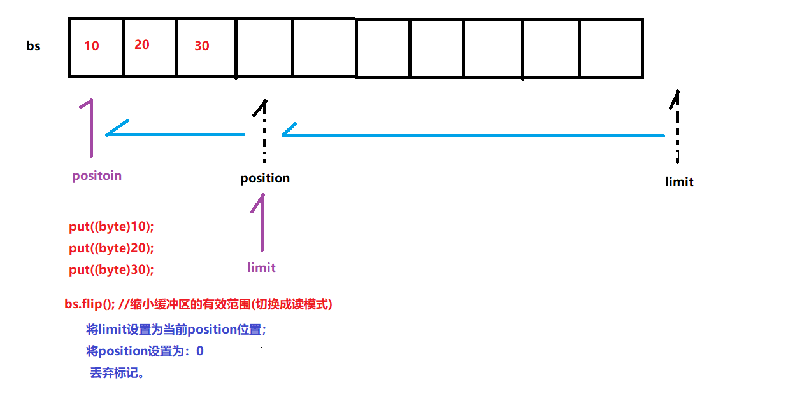
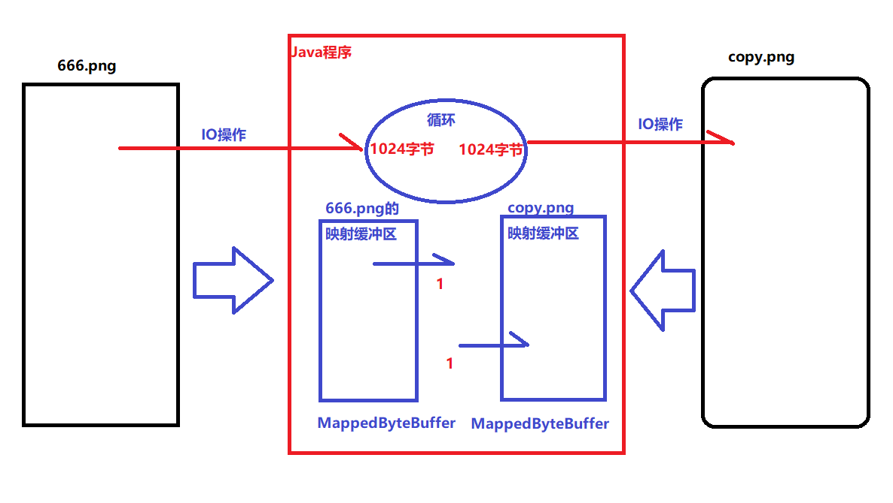

# day24【JUnit单元测试、NIO】

##### 反馈复习

```java
1.网络编程的一些概念
    IP: 每一台计算机的唯一标识
    端口号: 标识计算机上某个软件
    网络通信协议: 在网络传输数据的规则
        TCP: 面向有连接的
		UDP: 面向无连接的
2.基于TCP协议的数据交互
        客户端: Socket
            构造方法:
			public Socket("服务器的IP",服务器的端口号)
		服务器: ServerSocket
            public ServerSocket(服务器运行的端口号)
3.基于TCP的文件上传
          具体案例代码不写
4.体验BS模式!!!            
```

##### 今日内容

```java
今天和明天这两天以了解为主(演示Demo)
1.Junit单元测试[重点]
2.NIO(了解)
    缓冲区Buffer
    通道channel
    选择器Selector
3.AIO(了解)    
```

### 第一章 Junit单元测试【重点】

##### 1.什么是单元测试

```java
对我们编写的某个方法或者某个类进行测试
 Junit他一个专门用于单元测试的框架,通俗讲Junit单元测试框架可以取代码我们的main方法测试    
```

##### 2.Junit的使用步骤

- 下载

  ```java
  https://junit.org/junit5/
  现在一般来说不需要我们去下载,绝大多数的开发工具(idea)中就自带Junit的jar包
  ```


- 具体使用步骤

  ```java
  a.编写一个被测试的类(业务类)
  b.编写一个测试类.然后在测试类中使用Junit进行单元测试
  c.编写一个普通方法(不需要参数,不需要返回),在方法上加上@Test注解即可    
  ```

- 运行测试

  ```java
  右键选择一个方法即可运行
  ```

##### 3.单元测试中其他四个注解

- Junit4.x

  ```java
  @Before: 用于修饰方法,被@Before修饰的方法会在"每个"测试方法执行之前执行
  @After: 用于修饰方法,被@After修饰的方法会在"每个"测试方法执行之后执行
  @BeforeClass: 用于修饰方法,被@BeforeClass修饰的方法会在"所有"测试方法执行之前执行
  @AfterClass: 用于修饰方法,被@AfterClass修饰的方法会在"所有"测试方法执行之后执行
  注意:@BeforeClass和@AfterClass必须修饰的是静态方法!!   
  public class TestCalculate {
  
      @Before
      public void before(){
          System.out.println("111111111");
      }
  
      @After
      public void after(){
          System.out.println("222222222");
      }
      @BeforeClass
      public static void beforeClass(){
          System.out.println("11111111111");
      }
  
      @AfterClass
      public static void afterClass(){
          System.out.println("22222222222");
      }
  
      @Test
      public void test(){
          //测试代码
          Calculate cc = new Calculate();
          int sum = cc.getSum(10, 20);
          System.out.println("结果为:"+sum);
      }
      @Test
      public void test01(){
          //测试代码
          Calculate cc = new Calculate();
          int sum = cc.getSum(100, 200);
          System.out.println("结果为:"+sum);
      }
  }
      
  ```

- Junit5.x

  ```java
  @BeforeEach: 用于修饰方法,被@BeforeEach修饰的方法会在"每个"测试方法执行之前执行
  @AfterEach: 用于修饰方法,被@AfterEach修饰的方法会在"每个"测试方法执行之后执行
  @BeforeAll: 用于修饰方法,被@BeforeAll修饰的方法会在"所有"测试方法执行之前执行
  @AfterAll: 用于修饰方法,被@AfterAll修饰的方法会在"所有"测试方法执行之后执行
  ```

### 第二章 NIO介绍(了解) 

##### 1.阻塞与非阻塞

```java
阻塞: 调用某个功能时,该功能没有完成前,继续必须等待不会继续执行
非阻塞: 调用某个功能时,无论该功能是否完成,程序可以继续向下执行  
```

##### 2.同步与异步

```java
同步(阻塞): 
	调用某个功能时,该弄完没有完成前不会继续向下执行
同步(非阻塞):
	调用某个功能时,无论该功能是否完成,程序继续向下执行,当刚刚的功能完成后需要我们额外写代码获取结果!!
异步(非阻塞):
	调用某个功能时,无论该功能是否完成,程序继续向下执行,当刚刚的功能完成后他会以回调的机制通知我们!!
        
举例:
	烧水---> 普通烧水壶,响铃烧壶水
        
    普通烧水壶烧水, 烧水的过程中我在旁边等着,直到水开为止!!   ----> 同步阻塞式烧水
        
    普通烧水壶烧水, 烧水的过程中我去打游戏,打一阵子回来看看,... ----> 同步非阻塞式烧水
        
    响铃烧壶水, 烧水的过程中我去打游戏,不需要回来,直到水开了壶的铃声通知我 ---> 异步非阻塞式烧水
        
    响铃烧壶水,烧水的过程中我在旁边等着,直到壶的铃声通知我 ---> 异步阻塞式烧水(一般不会使用!!)      
```

##### 3.BIO,NIO,AIO的介绍

```java
BIO(Blocked IO):阻塞的IO,传统的IO,只能同步阻塞
NIO(New IO): 可以是同步阻塞也可以是同步非阻塞
    NIO由三部分组成:缓冲区Buffer,通道Channel,选择器Selector
AIO(Asynchronous IO):是异步非阻塞的IO    
```

### 第三章 NIO-Buffer类(了解)

##### 1.Buffer的介绍和种类

- 什么是Buffer

  ```java
  本质上就是一个数组,只是我们对数组进一步进行封装,可以有更多的方法
  ```

- Buffer的一般操作步骤

  ```java
  a.写入数据到Buffer
  b.调用flip()方法(切换读写模式)
  c.从Buffer中读取数据
  d.调用clear()方法(清空缓冲区)    
  ```

- Buffer的种类

  ```java
  ByteBuffer[最常用!!] 
  CharBuffer
  DoubleBuffer
  FloatBuffer
  IntBuffer
  LongBuffer
  ShortBuffer    
  ```

##### 2.ByteBuffer的三种创建方式

```java
public static ByteBuffer allocatDirect(int size);//直接申请,向操作系统申请
public static ByteBuffer allocat(int size);//间接申请,向JVM申请
public static ByteBuffer wrap(byte[] bs);//间接申请

间接缓冲区和直接缓冲区的区别:
	从创建和销毁的效率来看: 间接缓冲区要高于直接缓冲区
    从操作缓冲区的效率来看: 间接缓冲区要低于直接缓冲区    
```

##### 3.ByteBuffer的三种添加数据方式

```java
public ByteBuffer put(byte b);添加一个字节
public ByteBuffer put(byte[] bs);添加一个字节数组
public ByteBuffer put(byte[] bs,int startIndex,int len);添加一个字节数组的一部分 
    
public class ByteBufferDemo01 {
    public static void main(String[] args) {
        //1.创建一个ByteBuffer
        ByteBuffer b1 = ByteBuffer.allocate(10);
        System.out.println(Arrays.toString(b1.array()));
        //2.添加数据
        //a.添加一个字节
        b1.put((byte)97);
        b1.put((byte)98);
        b1.put((byte)99);
        System.out.println(Arrays.toString(b1.array()));
        //b.添加一堆字节
        byte[] bs = {100,101,102};
        b1.put(bs);
        System.out.println(Arrays.toString(b1.array()));
        //c.添加一堆字节的一部分
        byte[] bs1 = {103,104,105};
        b1.put(bs1,1,2);
        System.out.println(Arrays.toString(b1.array()));
    }
}    
```

##### 4.ByteBuffer的容量-capacity

```java
public int capacity();//获取缓冲区的容量

public class ByteBufferDemo02 {
    public static void main(String[] args) {
        //1.创建一个ByteBuffer
        ByteBuffer b1 = ByteBuffer.allocate(10);
        System.out.println(Arrays.toString(b1.array()));
        //2.容量
        int capacity = b1.capacity();
        System.out.println(capacity);
        //3.添加点数据
        b1.put((byte)100);
        b1.put((byte)101);
        //4.再次获取容量 
        capacity = b1.capacity();
        System.out.println(capacity);
    }
}
```

##### 5.ByteBuffer的限制-limit

```java
public int limit(); //获取第一个不能读写的索引
public void limit(int newLimit);//修改limit的值 
限制取值范围:  [0,capacity]
public class ByteBufferDemo03 {
    public static void main(String[] args) {
        //1.创建一个ByteBuffer
        ByteBuffer b1 = ByteBuffer.allocate(10);
        System.out.println(Arrays.toString(b1.array()));
        //2.第一个不能读写的索引
        int limit = b1.limit();
        System.out.println(limit);
        //3.修改limit
        b1.limit(3);
        System.out.println(b1.capacity());
        //4.然后添加数据
        b1.put((byte)10);
        b1.put((byte)20);
        b1.put((byte)30);
        b1.put((byte)40); //报错了,因为limit现在为3
        System.out.println(Arrays.toString(b1.array()));
    }
}
```

##### 6.ByteBuffer的位置-position

```java
public int position();//获取将要操作的元素索引
public void position(int newPosition);//修改将要操作的元素索引
position取值范围: [0,limit]
public class ByteBufferDemo04 {
    public static void main(String[] args) {
        //1.创建一个ByteBuffer
        ByteBuffer b1 = ByteBuffer.allocate(10);
        System.out.println(Arrays.toString(b1.array()));
        //2.获取将要操作的元素索引
        System.out.println("位置:"+ b1.position());
        b1.put((byte)10);
        System.out.println(Arrays.toString(b1.array()));

        System.out.println("位置:"+ b1.position());
        b1.put((byte)20);
        System.out.println(Arrays.toString(b1.array()));

        //3.修改将要操作的元素索引
        b1.position(6);
        b1.put((byte)30);
        System.out.println(Arrays.toString(b1.array()));
        b1.put((byte)40);
        System.out.println(Arrays.toString(b1.array()));
    }
}
```

##### 7.ByteBuffer的标记-mark

```java
public void mark();//在当前的position做一个标记
public void reset();//把当前的position改为mark位置

public class ByteBufferDemo05 {
    public static void main(String[] args) {
        //1.创建一个ByteBuffer
        ByteBuffer b1 = ByteBuffer.allocate(10);
        System.out.println(Arrays.toString(b1.array()));
        //2.添加元素
        b1.put((byte)10);
        b1.put((byte)20);
        b1.put((byte)30);
        System.out.println("当前位置:"+b1.position());
        //3.做一个标记
        b1.mark();//记录了当前mark = position(3)
        //4.继续添加
        b1.put((byte)40);
        b1.put((byte)50);
        b1.put((byte)60);
        System.out.println(Arrays.toString(b1.array()));
        //5.重置
        b1.reset();//position = mark(3)
        b1.put((byte)70);
        b1.put((byte)80);
        System.out.println(Arrays.toString(b1.array()));
    }
}
```

##### 8. ByteBuffer的其他方法

```java
public Buffer clear();//还原缓冲区状态(清空)
	将position设置为：0
    将限制limit设置为容量capacity；
    丢弃标记mark   
        
public class ByteBufferDemo06 {
    public static void main(String[] args) {
        //1.创建一个ByteBuffer
        ByteBuffer b1 = ByteBuffer.allocate(10);
        System.out.println(Arrays.toString(b1.array()));
        //2.添加元素
        b1.put((byte)10);
        b1.put((byte)20);
        b1.put((byte)30);
        System.out.println("当前位置:"+b1.position());
        //3.还原缓冲区状态(清空)
        b1.clear();
        System.out.println(Arrays.toString(b1.array()));
        b1.put((byte)40);
        b1.put((byte)50);
        b1.put((byte)60);
        System.out.println(Arrays.toString(b1.array()));

    }
}        
        
public Buffer flip();//缩小缓冲区到有效位置(切换模式)
	将limit设置为当前position位置；
	将position设置为：0
    丢弃标记。    
```



### 第四章 Channel（通道）(了解)

##### 1. Channel介绍和分类

```java
什么是Channel: 它是一个可以读写数据的通道,相当于IO流,但是与IO流有所不同,通道不区分输入和输出(是双向的)
    
channel的分类:
	FileChannel 文件通道(用于读写文件)
    SocketChannel TCP协议客户端通道
    ServerSocketChannel TCP协议服务器通道        
```

##### 2. FileChannel类的基本使用

```java
FileChannel的获取:
	public FileChannel getChannel();
FileChannel的成员方法:
	public int read(ByteBuffer bb);
	public void write(ByteBuffer bb);

public class FileChannelDemo {
    public static void main(String[] args) throws Exception {
        //1.创建两个流对象
        FileInputStream fis = new FileInputStream("G:\\upload\\666.png");
        FileOutputStream fos = new FileOutputStream("copy.png");
        //2.获取通道
        FileChannel inChannel = fis.getChannel();
        FileChannel outChannel = fos.getChannel();
        //3.复制文件
        ByteBuffer buffer = ByteBuffer.allocate(1024);
        int len = 0;
        //a.把数据写入buffer中
        while ((len = inChannel.read(buffer))!=-1){
            //b.切换模式
            buffer.flip();
            //c.把buffer中数据取出来,通过outChannel写入文件中
            outChannel.write(buffer);
            //d.清空缓冲区
            buffer.clear();
        }
        //4.释放资源
        outChannel.close();
        inChannel.close();
        fos.close();
        fis.close();
    }
}
```

##### 3. FileChannel结合MappedByteBuffer实现高效读写

```java
RandomAccessFile: 代表文件的File类
    public RandomAccessFile(String filepath);
    public FileChannel getChannel();
FileChannel: 有一个方法,可以获取映射缓冲区
    public MappedByteBuffer map(读写模式,起始索引,长度);
MappedByteBuffer:映射缓冲区的方法
    public byte get(int index);
	public void put(int index,byte b);

public class FileChannelDemo02 {
    public static void main(String[] args) throws Exception {
        //1.创建两个File
        RandomAccessFile srcFile = new RandomAccessFile("E:\\全国直播课\\就业班day01-day17讲义 + 作业\\23.zip","r");
        RandomAccessFile objFile = new RandomAccessFile("copy.zip","rw");
        //2.获取Channel
        FileChannel inChannel = srcFile.getChannel();
        FileChannel outChannel = objFile.getChannel();
        //3.创建映射缓冲区
        long size = inChannel.size();
        MappedByteBuffer inMap = inChannel.map(FileChannel.MapMode.READ_ONLY,0,size);
        MappedByteBuffer outMap = outChannel.map(FileChannel.MapMode.READ_WRITE, 0, size);
        //4.复制
        long start = System.currentTimeMillis();
        for (int i = 0; i < size; i++) {
            byte b = inMap.get(i);
            outMap.put(i,b);
        }
        long end = System.currentTimeMillis();
        System.out.println("耗时:" + (end - start));
        //5.释放资源
        outChannel.close();
        inChannel.close();
    }
}

注意: FileChannel结合MappedByteBuffer只能用于复制2GB一下的文件
    	如果想要复制2GB以上文件,我们可以分块映射分块复制!!(参考讲义的13G.rar复制案例)
```



##### 4. SocketChannel和ServerSocketChannel的实现连接

- ServerSocketChannel的创建(阻塞方式)

  ```java
  public class ServerSocketChannelDemo01 {
      public static void main(String[] args) throws IOException {
          //1.获取ServerSocketChannel对象
          ServerSocketChannel server = ServerSocketChannel.open();
          //2.绑定服务器端口
          server.bind(new InetSocketAddress(8888));
          System.out.println("服务器启动了...");
          //3.接收客户端通道
          System.out.println("等待客户端...");
          SocketChannel socketChannel = server.accept();//同步阻塞
          System.out.println("客户端来了...");
          //4.....
          System.out.println("后续代码....");
  
      }
  }
  ```

- ServerSocketChannel的创建(非阻塞方式)

  ```java
  ServerSocketChannel类有一个成员方法:
  	public void configureBlocking(boolean append);//设置通道为是否阻塞
  
  public class ServerSocketChannelDemo02 {
      public static void main(String[] args) throws IOException {
          //1.获取ServerSocketChannel对象
          ServerSocketChannel server = ServerSocketChannel.open();
          //2.绑定服务器端口
          server.bind(new InetSocketAddress(8888));
          System.out.println("服务器启动成功....");
          //3.设置服务器通道的是否阻塞
          server.configureBlocking(false);
          //4.接收客户端
          System.out.println("接收客户端...");
          SocketChannel socketChannel = server.accept();
          //5.后续
          System.out.println("其他操作");
      }
  }
  ```

- SocketChannel的创建

  ```java
  SocketChannel获取方式:
  	public static SocketChannel open();
  
  public class SocketChannelDemo {
      public static void main(String[] args) throws IOException {
          //1.获取SocketChannel对象
          SocketChannel socketChannel = SocketChannel.open();
          //2.去连接服务器
          System.out.println("开始连接服务器...");
          boolean b = socketChannel.connect(new InetSocketAddress("127.0.0.1", 8888));
          //3.后续操作
          System.out.println("后续代码...");
      }
  }
  
  ```

##### 5. SocketChannel和ServerSocketChannel的实现通信

```java
//客户端
public class SocketChannelDemo {
    public static void main(String[] args) throws IOException {
        //1.创建客户端通道
        SocketChannel socketChannel = SocketChannel.open();
        System.out.println("客户端创建...");
        //2.调用连接
        System.out.println("开始连接...");
        socketChannel.connect(new InetSocketAddress("127.0.0.1",8888));
        System.out.println("连接成功...");
        //3.给服务器发送信息
        ByteBuffer buffer = ByteBuffer.allocate(1024);
        buffer.put("你好,我是客户端....".getBytes());
        //切换模式
        buffer.flip();
        socketChannel.write(buffer);
        //4.读取服务器发送的数据
        ByteBuffer buffer1 = ByteBuffer.allocate(1024);
        socketChannel.read(buffer1);
        buffer1.flip();
        System.out.println("服务器说:"+new String(buffer1.array(),0,buffer1.limit()));
        //5.释放资源
        socketChannel.close();
    }
}
//服务器
public class ServerSocketChannelDemo {
    public static void main(String[] args) throws IOException {
        //1.创建服务器通道
        ServerSocketChannel serverSocketChannel = ServerSocketChannel.open();
        System.out.println("服务器启动...");
        //2.调用绑定方法
        serverSocketChannel.bind(new InetSocketAddress(8888));
        //3.接收连接
        System.out.println("等待客户端...");
        SocketChannel socketChannel = serverSocketChannel.accept();
        System.out.println("客户端来了...");
        //4.先读取客户端信息
        ByteBuffer buffer = ByteBuffer.allocate(1024);
        socketChannel.read(buffer);
        buffer.flip();
        System.out.println("客户端说:"+new String(buffer.array(),0,buffer.limit()));
        //5.给客户端发数据
        ByteBuffer buffer1 = ByteBuffer.allocate(1024);
        buffer1.put("你好,我是服务器你大爷....".getBytes());
        //切换模式
        buffer1.flip();
        socketChannel.write(buffer1);
        //6.释放资源
        socketChannel.close();
        serverSocketChannel.close();
    }
}

```

##### 总结

```java
能够使用Junit进行单元测试[必须掌握]
能够说出同步和异步的概念
    同步阻塞: 调用功能时,等待,直到功能完成
    同步非阻塞:调用功能时,不等待,程序继续向下执行,后期需要自己写代码判断功能是佛结束,是否有结果
	异步非阻塞:调用功能时,不等待,程序继续向下执行,功能完成后自动通知我们  
能够说出阻塞和非阻塞的概念
   阻塞,调用功能时,等待,直到功能完成
   非阻塞,调用功能时,不等待,程序继续向下执行 
能够创建和使用ByteBuffer
     a.ByteBuffer的创建(3种)
     b.ByteBuffer的各种(put,position,limit,capacity,clear,flip)   
        
能够使用MappedByteBuffer实现高效读写(案例练习一遍即可)
能够使用ServerSocketChannel和SocketChannel实现连接并收发信息(案例练习一遍即可)
```

