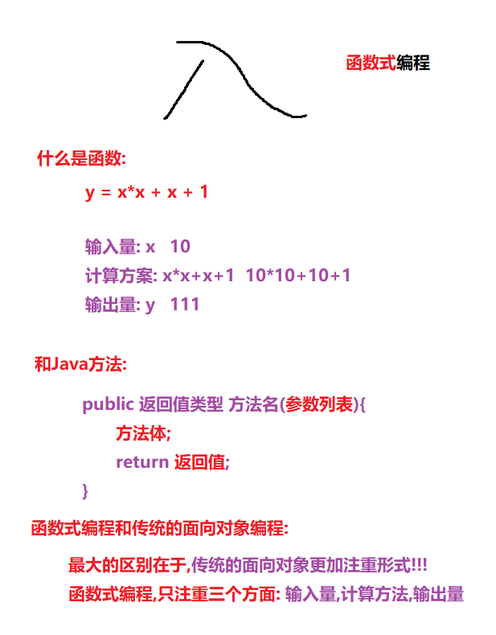
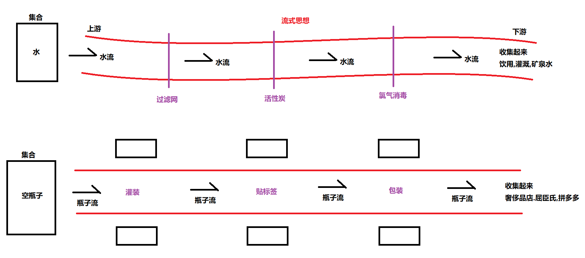

# 【Lambda表达式、Stream流】

##### 反馈和复习

```java
1.每天学习到新的单词的时候,提一下什么意思
2.老师单词发音老读错
3.建议的晚自习适当延长,可以扩展一些其他内容
复习:
	1.线程池
        ExecutorService service = Executors.newFixedThreadPool(int 线程的最大数量);
		service.submit(Runnable r);//提交无返回值的任务
		service.submit(Callable<T> c);//提交有返回值的任务
		一堆学糕
		service.shutdown();//等线程池中所有任务结束才关闭线程池
		service.shutdownNow();//立刻关闭线程池(如果有正在执行的任务,等这个任务执行完毕)
    2.线程的六大状态
        a.New 新建
        b.Runnable 可运行
        c.Terminated 终结
        d.Blocked 锁阻塞
        e.TimedWaiting 限时等待(休眠) Thread.sleep(毫秒)
        f.Waiting 无限等待 
        	如何进入Wait: a.获取到锁对象 b.锁对象.wait() c.线程会自动释放锁对象,然后进入无限等待
            如何唤醒Wait状态的线程: a.其他线程获取到锁对象 b.锁对象.notify() 
          c.被唤醒的线程先进入锁阻塞状态,直到其他线程释放锁对象,当前线程再次持有锁对象,才能进入可运行状态     
    3.等待和唤醒 
        a.等待唤醒小案例
        b.生产者消费者案例(生产者线程和消费者线程提交执行)
        面试题:
			a.线程1中循环输出1 1 1 1 1 1
            b.线程2中循环输出2 2 2 2 2 2 
            要求同时启动两个线程,交替输出1212121212121212    
                
                
```

##### 今日内容

```java
面试时+钱的东西 +2000
JDK8的新特性 JDK7
1.Lambda表达式(函数式编程)
2.Stream流(运用Lambda表达式)    
```

### 第一章 Lambda表达式

##### 1.1 函数式编程的思想

```java
只注重:输入量,计算方法,输出量这三个方面,而不注重形式的一种新的编程思想
```




##### 1.2 冗余的Runnable代码

```java
需求:使用实现方式创建一个线程
public class TestDemo {
    public static void main(String[] args) {
        //使用实现方式创建一个线程
        new Thread(new Runnable() {

            public void run() {
                System.out.println(Thread.currentThread().getName()+"执行了...");
            }
        }).start();
        //a.为了不写一个实现类,我们不得不被逼的采用匿名内部类
        //b.由于面向对象语法的束缚,我们不得不被逼的只能创建Runnable的匿名内部类
        //c.由于面向对象语法的束缚,我们不得不被逼的从写一个和run一模一样的方法
        //d.似乎只有方法体才是我们想要的心甘情愿写的
        //以上我们称为面向对象的冗余代码
    }
}    
```

##### 1.3 函数式编程Lambda的体验

```java
public class TestDemo {
    public static void main(String[] args) {
        //使用实现方式创建一个线程
        new Thread(new Runnable() {

            public void run() {
                System.out.println(Thread.currentThread().getName()+"执行了...");
            }
        }).start();
        //a.为了不写一个实现类,我们不得不被逼的采用匿名内部类
        //b.由于面向对象语法的束缚,我们不得不被逼的只能创建Runnable的匿名内部类
        //c.由于面向对象语法的束缚,我们不得不被逼的从写一个和run一模一样的方法
        //d.似乎只有方法体才是我们想要的心甘情愿写的
        //以上我们称为面向对象的冗余代码


        //使用函数式编程思想,大大简化面向对象语法
        //函数编程思想只关注三个方面: 输入量(参数) 计算方法(方法体) 输出量(返回值)
        new Thread(()->{System.out.println(Thread.currentThread().getName()+"执行了...");}).start();
    }
}
```

##### 1.4 Lambda标准格式介绍

```java
Lambda表达式(函数式编程)可以用于替代接口的匿名内部类
格式:
	(方法参数)->{方法体;return 返回值;}

比如:
	 new Thread(()->{System.out.println("执行了...");}).start();
```

##### 1.5 Lambda的参数和返回值

```java
public class LambdaDemo {
    public static void main(String[] args) {
        //1.练习1
        //比较器排序
        Integer[] arr = {445,345,346,45,764,576,5,76,8};
        //使用面向对象的匿名内部类
        Arrays.sort(arr, new Comparator<Integer>() {
            @Override
            public int compare(Integer o1, Integer o2) {
                //降序
                return o2 - o1;
            }
        });
        //使用Lambda替代上面Comparator接口的匿名内部类
        Arrays.sort(arr,(Integer o1, Integer o2)->{return o2 - o1;});
        System.out.println(Arrays.toString(arr));
        System.out.println("=====================");
        //2.练习2
        Student[] students = new Student[4];
        students[0] = new Student("jack",10,98);
        students[1] = new Student("tom",12,90);
        students[2] = new Student("marry",15,80);
        students[3] = new Student("hanmeimei",18,20);
        //排序
        Arrays.sort(students, new Comparator<Student>() {
            @Override
            public int compare(Student o1, Student o2) {
               //按照学生的名字的长度降序
               return o2.getName().length() - o1.getName().length();
            }
        });
        //使用lambda替代上面的匿名内部类
        Arrays.sort(students,(Student o1, Student o2)->{return o2.getName().length() - o1.getName().length();});

        for (Student stu : students) {
            System.out.println(stu);
        }
    }
}
```

##### 1.6 Lambda的省略格式

```java
Lambda还有三个地方可以省略:
	a.参数的数据类型可以省略
    b.如果参数只有一个,那么小括号也可以省略
    c.如果{}中方法体和返回值语句可以写成一句代码,那么{},return关键字,以及后面的分号可以同时省略    
 
案例1:
    //标准格式
    new Thread(()->{System.out.println("执行了...");}).start();
    //省略格式
    new Thread(()->System.out.println("执行了...")).start();

案例2:
    //标准格式 
    Arrays.sort(arr,(Integer o1, Integer o2)->{return o2 - o1;});
    //省略格式
    Arrays.sort(arr,(o1,o2)->o2 - o1);

案例3:
    //标准格式
    Arrays.sort(students,(Student o1, Student o2)->{return o2.getName().length() - o1.getName().length();});
    //省略格式
    Arrays.sort(students,(o1, o2)->o2.getName().length() - o1.getName().length());
```

##### 1.7 强烈注意:Lambda的使用前提

```java
a."只有"函数式接口的匿名内部类才能用Lambda来替换!!!
    	所谓函数式接口是指有且仅有一个抽象方法的接口(别的方法个数不限)
b.Lambda只有以上三种情况的省略格式,因为Lambda有一个"可推导才可省略"!  
```

### 第二章 Stream流

##### 2.1 引入:传统的集合操作

```java
List<String> list = new ArrayList<>(); 
list.add("张无忌"); 
list.add("周芷若"); 
list.add("赵敏"); 
list.add("张强"); 
list.add("张三丰");
//遍历集合:使用面向对象的方式
//fori循环,迭代器,foreach循环
for (String name : list) { 
    System.out.println(name); 
}
```

##### 2.2 循环遍历的弊端分析

```java
更加注重怎么做(形式),而我们的函数式注重做什么!!
简单讲就是,遍历在复杂了,我们需要使用函数式编程简化遍历的代码!!!    
```

##### 2.3 Stream的优雅写法

```java
public class StreamDemo01 {
    public static void main(String[] args) {
        List<String> list = new ArrayList<>();
        list.add("张无忌");
        list.add("周芷若");
        list.add("赵敏");
        list.add("张强");
        list.add("张三丰");
        //遍历集合:使用面向对象的方式
        //fori循环,迭代器,foreach循环
//        for (String name : list) {
//            System.out.println(name);
//        }
        //体验一下Stream的优雅代码
        list.stream().forEach(s-> System.out.println(s));
    }
}
```

##### 2.4 流式思想的概述



##### 2.5 两种获取流的方式

```java
public class StreamDemo02 {
    public static void main(String[] args) {
        //a.集合获取流
        ArrayList<String> arr1 = new ArrayList<String>();
        Stream<String> s1 = arr1.stream();

        HashSet<Integer> arr2 = new HashSet<Integer>();
        Stream<Integer> s2 = arr2.stream();

        //Map集合无法直接获取流
        // 但是可以先获取键的集合再获取键流
        HashMap<String,Integer> map = new HashMap<String, Integer>();
        Stream<String> keyStream = map.keySet().stream(); //获取键流
        Stream<Map.Entry<String,Integer>> entryStream = map.entrySet().stream(); //获取Entry流
        //b.数组获取流
        Stream<Integer> s3 = Stream.of(10,20,30,40);
    }
}
```

##### 2.6 Stream流中的常用方法

```java
Stream<String> s1 = Stream.of("jack","rose","marry","rom","jerry","hanny");
```

- 逐个处理:forEach(代码演示)

  ```java
  //a.foreach 逐一处理
  s1.forEach(new Consumer<String>() {
      @Override
      public void accept(String s) {
          System.out.println(s);
      }
  });
  //Lambda替代上面的匿名内部类
  s1.forEach((String s)->{System.out.println(s);});
  //省略格式(推荐)
  s1.forEach(s->System.out.println(s));
  ```


- 统计个数:count(代码演示)

  ```java
  //b.count 统计格式
  long count = s1.count();
  System.out.println("流中有:"+count+"个元素");
  
  //Java中各种获取长度的方式
  //数组.length;
  //字符串.length();
  //集合.size()
  //流.count();
  ```


- 过滤:filter(代码演示)

  ```java
  //c.filter 过滤
  Stream<String> s2 = s1.filter(new Predicate<String>() {
      //用于过滤
      public boolean test(String s) {
          //只要长度长4的字符串
          return s.length() > 4;
      }
  });
  //Lambda替代上面的匿名内部类
  Stream<String> s2 = s1.filter((String s) -> {return s.length() > 4;});
  //省略格式(推荐)
  Stream<String> s2 = s1.filter(s -> s.length() > 4); 
  ```

- 取前几个:limit(代码演示)

  ```java
  //d.limit 取前几个
  Stream<String> s3 = s1.limit(4);
  s3.forEach(s-> System.out.println(s));
  ```

- 跳过前几个:skip(代码演示)

  ```java
  //e.skip 跳过前几个
  Stream<String> s4 = s1.skip(2);
  s4.forEach(s-> System.out.println(s));
  ```

- 映射方法:map(代码演示)

  ```java
  //f.map 映射
  Stream<Integer> s5 = s1.map(new Function<String, Integer>() {
      //映射方法
      public Integer apply(String s) {
          return s.length();
      }
  });
  //Lambda替代上面的匿名内部类
  Stream<Integer> s5 = s1.map((String s)->{return s.length();});
  //省略格式
  Stream<Integer> s5 = s1.map(s->s.length());
  s5.forEach(s-> System.out.println(s));
  ```

- 静态方法合并流:concat(代码演示)

  ```java
  //g.静态方法concat 用于合并两个流
  Stream<Integer> one = Stream.of(1,2,3);
  Stream<Integer> two = Stream.of(4,5,6);
  
  Stream<Integer> all = Stream.concat(one,two);
  all.forEach(s-> System.out.println(s));
  
  注意:
  	1.如果是2个以上的流,那么2个2个慢慢合并
      2.如果2个流泛型不一致,能合并吗?? 可以,合并后的流泛型是两个流泛型的共同父类
  ```

##### 2.7 练习:集合元素的处理(Stream方式)[重点练习]

```java
public class StreamDemo04 {
    public static void main(String[] args) {
        List<String> one = new ArrayList<>();
        one.add("迪丽热巴");
        one.add("宋远桥");
        one.add("苏星河");
        one.add("老子");
        one.add("庄子");
        one.add("孙子");
        one.add("洪七公");

        List<String> two = new ArrayList<>();
        two.add("古力娜扎");
        two.add("张无忌");
        two.add("张三丰");
        two.add("赵丽颖");
        two.add("张二狗");
        two.add("张天爱");
        two.add("张三");

//        1. 第一个队伍只要名字为3个字的成员姓名；
        List<String> one1 = new ArrayList<>();
        for (String s : one) {
            if (s.length() == 3) {
                one1.add(s);
            }
        }
//        2. 第一个队伍筛选之后只要前3个人；
        List<String> one2 = new ArrayList<>();
        for (int i = 0; i < 3; i++) {
            String s = one1.get(i);
            one2.add(s);
        }

//        3. 第二个队伍只要姓张的成员姓名；
        List<String> two1 = new ArrayList<>();
        for (String s : two) {
            if (s.startsWith("张")){//
                two1.add(s);
            }
        }
//        4. 第二个队伍筛选之后不要前2个人；
        List<String> two2 = new ArrayList<>();
        for (int i = 2; i < two1.size(); i++) {
            String s = two1.get(i);
            two2.add(s);
        }

//        5. 将两个队伍合并为一个队伍；
        List<String> all = new ArrayList<>();
        for (String s : one2) {
            all.add(s);
        }
        for (String s : two2) {
            all.add(s);
        }

//        6. 根据姓名创建 Person 对象；
        List<Person> personList = new ArrayList<>();
        for (String name : all) {
            personList.add(new Person(name));
        }
//        7. 打印整个队伍的Person对象信息。
        for (Person person : personList) {
            System.out.println(person);
        }
    }
}


public class StreamDemo05 {
    public static void main(String[] args) {
        List<String> one = new ArrayList<>();
        one.add("迪丽热巴");
        one.add("宋远桥");
        one.add("苏星河");
        one.add("老子");
        one.add("庄子");
        one.add("孙子");
        one.add("洪七公");

        List<String> two = new ArrayList<>();
        two.add("古力娜扎");
        two.add("张无忌");
        two.add("张三丰");
        two.add("赵丽颖");
        two.add("张二狗");
        two.add("张天爱");
        two.add("张三");

//        1. 第一个队伍只要名字为3个字的成员姓名；
//        2. 第一个队伍筛选之后只要前3个人；
        Stream<String> oneStream = one.stream().filter(s -> s.length() == 3).limit(3);
//        3. 第二个队伍只要姓张的成员姓名；
//        4. 第二个队伍筛选之后不要前2个人；
        Stream<String> twoStream = two.stream().filter(s -> s.startsWith("张")).skip(2);
//        5. 将两个队伍合并为一个队伍；
        Stream<String> allStream = Stream.concat(oneStream, twoStream);
//        6. 根据姓名创建 Person 对象；
        //name --> Person
        Stream<Person> personStream = allStream.map(s -> new Person(s));
//        7. 打印整个队伍的Person对象信息。
        personStream.forEach(p-> System.out.println(p));
    }
}
```

##### 2.8 总结:函数拼接和终结方法

```java
函数拼接方法: 调用该方法后,返回的还是流对象
   fliter,limit,skip,map,concat,支持链式编程!!! 
终结方法: 调用该方法后,返回不是流对象或者没有返回值    
   forEach ,count 不支持链式编程!!
    
注意:无论是什么方法,对于同一个流对象来说只能调用一次    
```

##### 2.9 收集Stream的结果

```java
a.收集到集合中   
b.收集到数组中
public class StreamDemo06 {
    public static void main(String[] args) {
        //1.创建一个流
        Stream<String> s1 = Stream.of("jack", "rose", "tom");
        //2.可以对流进行一系列操作
        //3.收集流中的数据到集合中
        List<String> list = s1.collect(Collectors.toList());
        System.out.println(list);

        Set<String> set = s1.collect(Collectors.toSet());
        System.out.println(set);
        //4.收集流中的数据到数组中
        Object[] objs = s1.toArray();
        for (Object obj : objs) {
            System.out.println(obj);
        }
    }
}       
```

##### 总结:

```java
能够"掌握"Lambda表达式的标准格式与省略格式
	标准格式:
    (数据类型 参数名,数据类型 参数名,....)->{方法体;return 返回值;}
	省略格式:
	参数名->复杂的表达式(123点)
	
能够通过集合、映射Map或数组方式获取流
    集合.stream();
	map.keySet().stream();
	map.entrySet().stream();
	Stream.of(数组)
能够"掌握"常用的流操作
    foreach,count,filter,limit,skip,map,concat    
能够将流中的内容收集到集合和数组中
```

