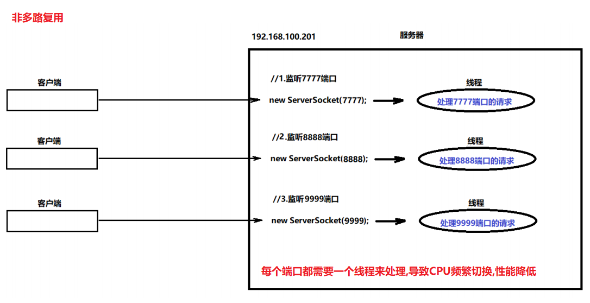
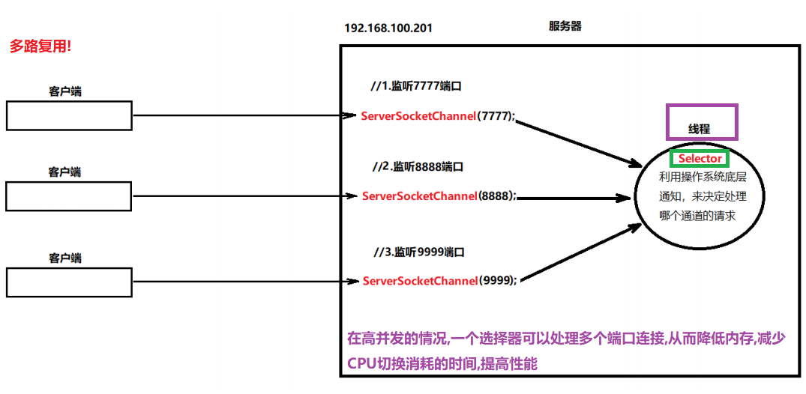

# 【NIO、AIO】

##### 反馈复习

```java
了解注意,演示案例
1.ByteBuffer 字节缓冲区(底层字节数组) put clear flip...
    构造:
		ByteBuffer buffer = ByteBuffer.allocate(int size);
	成员方法:
		put(byte[] bs);
		flip();切换读写模式
2.Channel 用于读写数据,类似于IO流的流
        FileChannel    
        SocketChannel
        ServerSockerChannel
        操作数据的四步:
		a.读数据写入到Buffer中
        b.调用buffer的flip方法,切换读写模式  
        c.将Buffer中数据读取出来
        d.调用clear方法,清空Buffer    
```

##### 今日内容

```java
了解注意,演示案例
NIO之Selector(选择器,多路复用器)
AIO(异步非阻塞的IO)       
```

### 第一章 Select(选择器)(了解)

##### 1.1 多路复用的概念

```java
多路是指多个客户端!
```





##### 1.2 选择器Selector

- 什么是Selector

  ```java
  Selector称为选择器,也叫多路复用器,可以将多个通道注册到选择器上,选择器可以监听通道的被连接事件!!
  ```

- Selector的创建API

  ```java
  Selector selector = Selector.open(); //创建一个新的选择器
  ```

- Channel注册到Selector的API

  ```java
  a.想要把通道注册到选择器上,该通道必须设置为非阻塞
      channel.configureBlocking(false);//设置为非阻塞通道
  b.将通道注册到选择器
      SelectionKey key=channel.register(selector对象,选择器要监听的事件);//将通道注册到选择器上
  	其中选择器的监听事件有多种,我们这里选择SelectionKey.OP_ACCEPT(代表服务器接收客户端连接事件)
      返回值SelectionKey是就是当前被注册的通道的封装,通过调用channel方法获取到当前的被注册通道    
  ```

- 代码演示

  ```java
  public class SelectorDemo {
      public static void main(String[] args) throws IOException {
          //1.创建多个服务通道
          //服务器通道1
          ServerSocketChannel serverSocketChannel1 = ServerSocketChannel.open();
          serverSocketChannel1.configureBlocking(false);
          serverSocketChannel1.bind(new InetSocketAddress(7777));
          //服务器通道2
          ServerSocketChannel serverSocketChannel2 = ServerSocketChannel.open();
          serverSocketChannel2.configureBlocking(false);
          serverSocketChannel2.bind(new InetSocketAddress(8888));
          //服务器通道3
          ServerSocketChannel serverSocketChannel3 = ServerSocketChannel.open();
          serverSocketChannel3.configureBlocking(false);
          serverSocketChannel3.bind(new InetSocketAddress(9999));
  
          //获取选择器对象
          Selector selector = Selector.open();
          //将多个通道注册到选择器上
          SelectionKey key1 = serverSocketChannel1.register(selector, SelectionKey.OP_ACCEPT);
          //ServerSocketChannel channel = (ServerSocketChannel)key.channel();
          SelectionKey key2 = serverSocketChannel2.register(selector, SelectionKey.OP_ACCEPT);
          SelectionKey key3 = serverSocketChannel3.register(selector, SelectionKey.OP_ACCEPT);
      }
  }
  ```

##### 1.3 Selector中的常用方法

```java
a.获取选择器已经注册的所有通道集合
    	Set<SelectionKey> keys = selector对象.keys():

b.获取选择器已经被客户端连接的所有通道集合
    	Set<SelectionKey> selectedKeys = selector对象.selectedKeys():

c.选择器的选择方法
   int count = selector.select();
	a.如果"当前所有的通道"都没有被连接,此方法会阻塞,直到至少有一个通道被连接,才能继续向下执行
    b.返回值代表"本次被连接"的通道的数量    
```

##### 1.4 Selector实现多路连接(上)

```java
public class SocketDemo {
    public static void main(String[] args) throws InterruptedException {
        //1.创建三个线程,分别模拟一个客户端
        //客户端1
        new Thread(()->{
            while (true) {
                try (SocketChannel socket = SocketChannel.open()) {

                    System.out.println("7777客户端连接服务器......");

                    socket.connect(new InetSocketAddress("127.0.0.1", 7777));

                    System.out.println("7777客户端连接成功....");

                    break;
                } catch (IOException e) {
                    System.out.println("7777异常重连");
                    try {
                        Thread.sleep(2000);
                    } catch (InterruptedException e1) {
                        e1.printStackTrace();
                    }
                }
            }
        }).start();

        //客户端2
        new Thread(()->{
            while (true) {
                try (SocketChannel socket = SocketChannel.open()) {

                    System.out.println("8888客户端连接服务器......");

                    socket.connect(new InetSocketAddress("127.0.0.1", 8888));

                    System.out.println("8888客户端连接成功....");

                    break;
                } catch (IOException e) {
                    System.out.println("8888异常重连");
                    try {
                        Thread.sleep(2000);
                    } catch (InterruptedException e1) {
                        e1.printStackTrace();
                    }
                }
            }
        }).start();

        //客户端3
        new Thread(()->{
            while (true) {
                try (SocketChannel socket = SocketChannel.open()) {

                    System.out.println("9999客户端连接服务器......");

                    socket.connect(new InetSocketAddress("127.0.0.1", 9999));

                    System.out.println("9999客户端连接成功....");

                    break;
                } catch (IOException e) {
                    System.out.println("9999异常重连");
                    try {
                        Thread.sleep(2000);
                    } catch (InterruptedException e1) {
                        e1.printStackTrace();
                    }
                }
            }
        }).start();
    }
}
public class SelectorDemo02 {
    public static void main(String[] args) throws IOException, InterruptedException {
        //1.创建多个服务通道
        //服务器通道1
        ServerSocketChannel serverSocketChannel1 = ServerSocketChannel.open();
        serverSocketChannel1.configureBlocking(false);
        serverSocketChannel1.bind(new InetSocketAddress(7777));
        //服务器通道2
        ServerSocketChannel serverSocketChannel2 = ServerSocketChannel.open();
        serverSocketChannel2.configureBlocking(false);
        serverSocketChannel2.bind(new InetSocketAddress(8888));
        //服务器通道3
        ServerSocketChannel serverSocketChannel3 = ServerSocketChannel.open();
        serverSocketChannel3.configureBlocking(false);
        serverSocketChannel3.bind(new InetSocketAddress(9999));

        //获取选择器对象
        Selector selector = Selector.open();
        //将多个通道注册到选择器上
        SelectionKey key1 = serverSocketChannel1.register(selector, SelectionKey.OP_ACCEPT);
        //ServerSocketChannel channel = (ServerSocketChannel)key.channel();
        SelectionKey key2 = serverSocketChannel2.register(selector, SelectionKey.OP_ACCEPT);
        SelectionKey key3 = serverSocketChannel3.register(selector, SelectionKey.OP_ACCEPT);


        //使用选择器
        Set<SelectionKey> keys = selector.keys();
        System.out.println("注册通道数量：" + keys.size());

        Set<SelectionKey> selectionKeys = selector.selectedKeys();
        System.out.println("已连接的通道数量：" + selectionKeys.size());

        System.out.println("---------------------------------");
        System.out.println("服务器等待客户端连接...");
        for (int i = 0; i < 3; i++) {
            int count = selector.select();
            //a.如果没有一个通道被连接,此方法会阻塞
            //b.返回值代表本次被连接的通道数量
            System.out.println("本次被连接数量：" + count);
            Thread.sleep(1000);
        }
    }
}
输出结果:
	注册通道数量：3
    已连接的通道数量：0
    ---------------------------------
    服务器等待客户端连接...
    本次被连接数量：1
    本次被连接数量：2
    本次被连接数量：0
    ....
    本次被连接数量：0    

```

##### 1.5 Selector实现多路连接(下)

```java
public class SelectorDemo03 {
    public static void main(String[] args) throws IOException, InterruptedException {
        //1.创建多个服务通道
        //服务器通道1
        ServerSocketChannel serverSocketChannel1 = ServerSocketChannel.open();
        serverSocketChannel1.configureBlocking(false);
        serverSocketChannel1.bind(new InetSocketAddress(7777));
        //服务器通道2
        ServerSocketChannel serverSocketChannel2 = ServerSocketChannel.open();
        serverSocketChannel2.configureBlocking(false);
        serverSocketChannel2.bind(new InetSocketAddress(8888));
        //服务器通道3
        ServerSocketChannel serverSocketChannel3 = ServerSocketChannel.open();
        serverSocketChannel3.configureBlocking(false);
        serverSocketChannel3.bind(new InetSocketAddress(9999));

        //获取选择器对象
        Selector selector = Selector.open();
        //将多个通道注册到选择器上
        SelectionKey key1 = serverSocketChannel1.register(selector, SelectionKey.OP_ACCEPT);
        //ServerSocketChannel channel = (ServerSocketChannel)key.channel();
        SelectionKey key2 = serverSocketChannel2.register(selector, SelectionKey.OP_ACCEPT);
        SelectionKey key3 = serverSocketChannel3.register(selector, SelectionKey.OP_ACCEPT);


        //使用选择器
        System.out.println("---------------------------------");
        System.out.println("服务器等待客户端连接...");
        while (true) {
            int count = selector.select();
            System.out.println("本次新增的连接通道个数:"+count);
            //获取所有被连接的通道
            Set<SelectionKey> selectionKeys = selector.selectedKeys();
            //遍历被连接的通道集合
            Iterator<SelectionKey> it = selectionKeys.iterator();
            //迭代器的遍历
            while (it.hasNext()){
                SelectionKey key = it.next();
                //调用SelectionKey的channel方法
                ServerSocketChannel serverSocketChannel = (ServerSocketChannel)key.channel();
                System.out.println("被连接的通道:"+serverSocketChannel);
                //获取连接到这个服务器通道的客户端
                SocketChannel socketChannel = serverSocketChannel.accept();
                System.out.println("连接到此通道的客户端是:"+socketChannel);
                //处理完该服务器和客户端的连接之后,应该从集合删除把这个服务器通道删除
                it.remove();
            }
            System.out.println("======================");
            Thread.sleep(3000);
        }
    }
}
输出结果:
	---------------------------------
    服务器等待客户端连接...
    本次新增的连接通道个数:1
    被连接的通道:sun.nio.ch.ServerSocketChannelImpl[/0:0:0:0:0:0:0:0:7777]
    连接到此通道的客户端是:java.nio.channels.SocketChannel[connected local=/127.0.0.1:7777 remote=/127.0.0.1:57992]
    ======================
    本次新增的连接通道个数:2
    被连接的通道:sun.nio.ch.ServerSocketChannelImpl[/0:0:0:0:0:0:0:0:9999]
    连接到此通道的客户端是:java.nio.channels.SocketChannel[connected local=/127.0.0.1:9999 remote=/127.0.0.1:57993]
    被连接的通道:sun.nio.ch.ServerSocketChannelImpl[/0:0:0:0:0:0:0:0:8888]
    连接到此通道的客户端是:java.nio.channels.SocketChannel[connected local=/127.0.0.1:8888 remote=/127.0.0.1:57994]
    ======================
	继续等待其他的客户端,这个方法int count = selector.select();阻塞了!!
```

##### 1.6 Selector多路信息接收测试

```java
public class SocketDemo {
    public static void main(String[] args) throws InterruptedException {
        //1.创建三个线程,分别模拟一个客户端
        //客户端1
        new Thread(()->{
            while (true) {
                try (SocketChannel socket = SocketChannel.open()) {

                    System.out.println("7777客户端连接服务器......");

                    socket.connect(new InetSocketAddress("127.0.0.1", 7777));

                    System.out.println("7777客户端连接成功....");

                    //和服务器进行通信
                    //a.先发数据
                    ByteBuffer buffer1 = ByteBuffer.allocate(1024);
                    buffer1.put("你好服务器,我是7777这个客户端!".getBytes());
                    buffer1.flip();
                    socket.write(buffer1);
                    System.out.println("7777数据成功发送....");
                    //buffer1.clear();

                    //b.再接收数据
                    ByteBuffer buffer2 = ByteBuffer.allocate(1024);
                    socket.read(buffer2);
                    buffer2.flip();
                    System.out.println("服务器说:"+new String(buffer2.array(),0,buffer2.limit()));
                    break;
                } catch (IOException e) {
                    System.out.println("7777异常重连");
                    try {
                        Thread.sleep(2000);
                    } catch (InterruptedException e1) {
                        e1.printStackTrace();
                    }
                }
            }
        }).start();

        //客户端2
        new Thread(()->{
            while (true) {
                try (SocketChannel socket = SocketChannel.open()) {

                    System.out.println("8888客户端连接服务器......");

                    socket.connect(new InetSocketAddress("127.0.0.1", 8888));

                    System.out.println("8888客户端连接成功....");

                    //a.先发数据
                    ByteBuffer buffer1 = ByteBuffer.allocate(1024);
                    buffer1.put("你好服务器,我是8888这个客户端!".getBytes());
                    buffer1.flip();
                    socket.write(buffer1);
                    System.out.println("8888数据成功发送....");
                    //buffer1.clear();

                    //b.再接收数据
                    ByteBuffer buffer2 = ByteBuffer.allocate(1024);
                    socket.read(buffer2);
                    buffer2.flip();
                    System.out.println("服务器说:"+new String(buffer2.array(),0,buffer2.limit()));

                    break;
                } catch (IOException e) {
                    System.out.println("8888异常重连");
                    try {
                        Thread.sleep(2000);
                    } catch (InterruptedException e1) {
                        e1.printStackTrace();
                    }
                }
            }
        }).start();

        //客户端3
        new Thread(()->{
            while (true) {
                try (SocketChannel socket = SocketChannel.open()) {

                    System.out.println("9999客户端连接服务器......");

                    socket.connect(new InetSocketAddress("127.0.0.1", 9999));

                    System.out.println("9999客户端连接成功....");

                    //a.先发数据
                    ByteBuffer buffer1 = ByteBuffer.allocate(1024);
                    buffer1.put("你好服务器,我是9999这个客户端!".getBytes());
                    buffer1.flip();
                    socket.write(buffer1);
                    System.out.println("9999数据成功发送....");
                    //buffer1.clear();

                    //b.再接收数据
                    //b.再接收数据
                    ByteBuffer buffer2 = ByteBuffer.allocate(1024);
                    socket.read(buffer2);
                    buffer2.flip();
                    System.out.println("服务器说:"+new String(buffer2.array(),0,buffer2.limit()));
                    break;
                } catch (IOException e) {
                    System.out.println("9999异常重连");
                    try {
                        Thread.sleep(2000);
                    } catch (InterruptedException e1) {
                        e1.printStackTrace();
                    }
                }
            }
        }).start();
    }
}
public class SelectorDemo03 {
    public static void main(String[] args) throws IOException, InterruptedException {
        //1.创建多个服务通道
        //服务器通道1
        ServerSocketChannel serverSocketChannel1 = ServerSocketChannel.open();
        serverSocketChannel1.configureBlocking(false);
        serverSocketChannel1.bind(new InetSocketAddress(7777));
        //服务器通道2
        ServerSocketChannel serverSocketChannel2 = ServerSocketChannel.open();
        serverSocketChannel2.configureBlocking(false);
        serverSocketChannel2.bind(new InetSocketAddress(8888));
        //服务器通道3
        ServerSocketChannel serverSocketChannel3 = ServerSocketChannel.open();
        serverSocketChannel3.configureBlocking(false);
        serverSocketChannel3.bind(new InetSocketAddress(9999));

        //获取选择器对象
        Selector selector = Selector.open();
        //将多个通道注册到选择器上
        SelectionKey key1 = serverSocketChannel1.register(selector, SelectionKey.OP_ACCEPT);
        //ServerSocketChannel channel = (ServerSocketChannel)key.channel();
        SelectionKey key2 = serverSocketChannel2.register(selector, SelectionKey.OP_ACCEPT);
        SelectionKey key3 = serverSocketChannel3.register(selector, SelectionKey.OP_ACCEPT);


        //使用选择器
        System.out.println("---------------------------------");
        System.out.println("服务器等待客户端连接...");
        while (true) {
            int count = selector.select();
            System.out.println("本次新增的连接通道个数:"+count);
            //获取所有被连接的通道
            Set<SelectionKey> selectionKeys = selector.selectedKeys();
            //遍历被连接的通道集合
            Iterator<SelectionKey> it = selectionKeys.iterator();
            //迭代器的遍历
            while (it.hasNext()){
                SelectionKey key = it.next();
                //调用SelectionKey的channel方法
                ServerSocketChannel serverSocketChannel = (ServerSocketChannel)key.channel();
                System.out.println("被连接的通道:"+serverSocketChannel);
                //获取连接到这个服务器通道的客户端
                SocketChannel socketChannel = serverSocketChannel.accept();
                System.out.println("连接到此通道的客户端是:"+socketChannel);
                //a.先收数据
                ByteBuffer buffer1 = ByteBuffer.allocate(1024);
                socketChannel.read(buffer1);
                buffer1.flip();
                System.out.println("接收数据:"+new String(buffer1.array(),0,buffer1.limit()));
//                buffer1.clear();
                //b.再回数据
                ByteBuffer buffer2 = ByteBuffer.allocate(1024);
                buffer2.put(("我是服务器"+System.currentTimeMillis()).getBytes());
                buffer2.flip();
                socketChannel.write(buffer2);
                System.out.println("给客户端回成功...."+socketChannel);

                //处理完该服务器和客户端的连接之后,应该从集合删除把这个服务器通道删除
                it.remove();
            }
            System.out.println("======================");
            Thread.sleep(3000);
        }
    }
}
输出结果:
客户端结果:
    9999客户端连接服务器......
    8888客户端连接服务器......
    7777客户端连接服务器......
    9999客户端连接成功....
    7777客户端连接成功....
    8888客户端连接成功....
    9999数据成功发送....
    8888数据成功发送....
    7777数据成功发送....
    服务器说:我是服务器1593745913893
    服务器说:我是服务器1593745916893
    服务器说:我是服务器1593745916893

服务器结果:
    ---------------------------------
    服务器等待客户端连接...
    本次新增的连接通道个数:1
    被连接的通道:sun.nio.ch.ServerSocketChannelImpl[/0:0:0:0:0:0:0:0:9999]
    连接到此通道的客户端是:java.nio.channels.SocketChannel[connected local=/127.0.0.1:9999 remote=/127.0.0.1:58814]
    接收数据:你好服务器,我是9999这个客户端!
    给客户端回成功....java.nio.channels.SocketChannel[connected local=/127.0.0.1:9999 remote=/127.0.0.1:58814]
    ======================
    本次新增的连接通道个数:2
    被连接的通道:sun.nio.ch.ServerSocketChannelImpl[/0:0:0:0:0:0:0:0:8888]
    连接到此通道的客户端是:java.nio.channels.SocketChannel[connected local=/127.0.0.1:8888 remote=/127.0.0.1:58816]
    接收数据:你好服务器,我是8888这个客户端!
    给客户端回成功....java.nio.channels.SocketChannel[connected local=/127.0.0.1:8888 remote=/127.0.0.1:58816]
    被连接的通道:sun.nio.ch.ServerSocketChannelImpl[/0:0:0:0:0:0:0:0:7777]
    连接到此通道的客户端是:java.nio.channels.SocketChannel[connected local=/127.0.0.1:7777 remote=/127.0.0.1:58815]
    接收数据:你好服务器,我是7777这个客户端!
    给客户端回成功....java.nio.channels.SocketChannel[connected local=/127.0.0.1:7777 remote=/127.0.0.1:58815]
    ======================
```

### 第二章 AIO(异步、非阻塞)(了解)

##### 2.1 AIO概述和分类

```java
什么是AIO:
	Asynchronous IO 称为异步非阻塞的IO操作
什么是异步非阻塞:
	调用某个功能时,不需要等待功能执行完毕,
	程序可以继续向下执行,等功能执行完毕之后会自动"方法回调机制"通知我们  
AIO的各种分类:
	AsynchronousFileChannel
    AsynchronousDatagramChannel
    AsynchronousSocketChannel
    AsynchronousServerSocketChannel    
```

##### 2.2 AIO 异步非阻塞连接的建立

- 异步非阻塞的客户端通道

  ```java
  /**
   * 异步非阻塞客户端通道
   */
  public class AsynchronousSocketChannelDemo {
      public static void main(String[] args) throws IOException, InterruptedException {
          //1.创建AsynchronousSocketChannel对象
          AsynchronousSocketChannel asynchronousSocketChannel = AsynchronousSocketChannel.open();
          //2.连接服务器
          asynchronousSocketChannel.connect( //非阻塞
                  new InetSocketAddress("127.0.0.1", 12345), //服务器的IP地址
                  null, //附件内容
                  new CompletionHandler<Void, Object>() { //回调接口
                      @Override
                      public void completed(Void result, Object attachment) {
                          //连接成功之后的回调
                          System.out.println("连接服务器成功...");
                      }
  
                      @Override
                      public void failed(Throwable exc, Object attachment) {
                          //连接过程中出异常的回调
                          System.out.println("连接过程中出现异常...");
                      }
                  }
          );
  
          //3.其他
          System.out.println("程序继续执行....");
  
          Thread.sleep(3000);
      }
  }
  
  输出结果:
  	程序继续执行....
  	连接过程中出现异常...
  ```

- 异步非阻塞的服务器通道

  ```java
  /**
   * 异步非阻塞服务器通道
   */
  public class AsynchronousServerSocketChannelDemo {
      public static void main(String[] args) throws IOException, InterruptedException {
          //1.创建AsynchronousServerSocketChannel对象
          AsynchronousServerSocketChannel asynchronousServerSocketChannel = AsynchronousServerSocketChannel.open();
          //2.绑定端口
          asynchronousServerSocketChannel.bind(new InetSocketAddress(12345));
          //3.接收客户端
          System.out.println("等待客户端连接...");
          asynchronousServerSocketChannel.accept(
                  null, //附件为null
                  new CompletionHandler<AsynchronousSocketChannel, Object>() {//回调接口
                      //客户端连接成功的回调
                      public void completed(AsynchronousSocketChannel result, Object attachment) {
                          System.out.println("客户端连接成功..."+result);
                      }
  
                      //客户端连接过程中出异常回调
                      public void failed(Throwable exc, Object attachment) {
                          System.out.println("连接过程中出异常回调....");
                      }
                  });
  
          //4.继续执行
          System.out.println("服务器继续执行....");
          Thread.sleep(50000);
      }
  }
  输出结果:
  	等待客户端连接...
      服务器继续执行....
      客户端连接成功...
  
  ```

- 异步非阻塞建立连接

  ```java
  /**
   * 异步非阻塞客户端通道
   */
  public class AsynchronousSocketChannelDemo {
      public static void main(String[] args) throws IOException, InterruptedException {
          //1.创建AsynchronousSocketChannel对象
          AsynchronousSocketChannel asynchronousSocketChannel = AsynchronousSocketChannel.open();
          //2.连接服务器
          asynchronousSocketChannel.connect( //非阻塞
                  new InetSocketAddress("127.0.0.1", 12345), //服务器的IP地址
                  null, //附件内容
                  new CompletionHandler<Void, Object>() { //回调接口
                      @Override
                      public void completed(Void result, Object attachment) {
                          //连接成功之后的回调
                          System.out.println("连接服务器成功...");
                          //发送数据
                          ByteBuffer buffer = ByteBuffer.wrap("你好,我是异步客户端".getBytes());
                          Future<Integer> future = asynchronousSocketChannel.write(buffer);
                          try {
                              System.out.println("发送数据成功,大小是:" + future.get());
                              asynchronousSocketChannel.close();
                          } catch (Exception e) {
                              e.printStackTrace();
                          }
                      }
  
                      @Override
                      public void failed(Throwable exc, Object attachment) {
                          //连接过程中出异常的回调
                          System.out.println("连接过程中出现异常...");
                      }
                  }
          );
  
          //3.其他
          System.out.println("程序继续执行....");
  
          Thread.sleep(3000);
      }
  }
  
  /**
   * 异步非阻塞服务器通道
   */
  public class AsynchronousServerSocketChannelDemo {
      public static void main(String[] args) throws IOException, InterruptedException {
          //1.创建AsynchronousServerSocketChannel对象
          AsynchronousServerSocketChannel asynchronousServerSocketChannel = AsynchronousServerSocketChannel.open();
          //2.绑定端口
          asynchronousServerSocketChannel.bind(new InetSocketAddress(12345));
          //3.接收客户端
          System.out.println("等待客户端连接...");
          asynchronousServerSocketChannel.accept(
                  null,
                  new CompletionHandler<AsynchronousSocketChannel, Object>() {
                      //客户端连接成功的回调
                      public void completed(AsynchronousSocketChannel result, Object attachment) {
                          System.out.println("客户端连接成功..."+result);
                          //接收数据
                          ByteBuffer buffer = ByteBuffer.allocate(1024);
                          Future<Integer> future = result.read(buffer);
                          try {
                              //read方法读取到数据之后必须先获取长度,然后才能取出数据,否则数据取不出来的!!
                              System.out.println("客户端说的字节数:"+future.get());
                          } catch (Exception e) {
                              e.printStackTrace();
                          }
                          buffer.flip();
                          System.out.println("客户端说:" + new String(buffer.array(), 0, buffer.limit()));
                          try {
                              result.close();
                              asynchronousServerSocketChannel.close();
                          } catch (Exception e) {
                              e.printStackTrace();
                          }
                      }
  
                      //客户端连接过程中出异常回调
                      public void failed(Throwable exc, Object attachment) {
                          System.out.println("连接过程中出异常回调....");
                      }
                  });
  
          //4.继续执行
          System.out.println("服务器继续执行....");
          Thread.sleep(50000);
      }
  }
  输出结果:
  客户端结果:
  	程序继续执行....
      连接服务器成功...
      发送数据成功,大小是:28
  
  服务器结果:
  	等待客户端连接...
      服务器继续执行....
      客户端连接成功...
      客户端说的字节数:28
      客户端说:你好,我是异步客户端
  ```

##### 2.3 AIO异步读写数据

```java
public class AsynchronousSocketChannelDemo {
    public static void main(String[] args) throws IOException, InterruptedException {
        //1.创建AsynchronousSocketChannel对象
        AsynchronousSocketChannel asynchronousSocketChannel = AsynchronousSocketChannel.open();
        //2.异步非阻塞连接服务器
        asynchronousSocketChannel.connect(
                new InetSocketAddress("127.0.0.1", 12345),
                null,
                new CompletionHandler<Void, Object>() {
                    @Override
                    public void completed(Void result, Object attachment) {
                        System.out.println("连接成功...");
                        //异步非阻塞给服务器发送数据
                        ByteBuffer buffer = ByteBuffer.wrap("我是客户端...".getBytes());
                        System.out.println("准备发送数据...");
                        asynchronousSocketChannel.write(
                                buffer, //要发送的数据
                                500, //超时时间
                                TimeUnit.MILLISECONDS, //超时时间单位
                                null,//附件
                                new CompletionHandler<Integer, Object>() {//消息发送成功与否的回调接口
                                    @Override
                                    public void completed(Integer result, Object attachment) {
                                        System.out.println("消息发送OK..."+result+"字节");
                                    }

                                    @Override
                                    public void failed(Throwable exc, Object attachment) {
                                        System.out.println("消息发送失败....");
                                    }
                                }

                        );
                        System.out.println("发数据的后续代码....");
                    }

                    @Override
                    public void failed(Throwable exc, Object attachment) {
                        System.out.println("连接失败...");
                    }
                }
        );

        //3.后续代码
        System.out.println("后续代码...");
        Thread.sleep(30000);
    }
}
public class AsynchronousServerSocketChannelDemo {
    public static void main(String[] args) throws IOException, InterruptedException {
        //1.创建AsynchronousServerSocketChannel对象
        AsynchronousServerSocketChannel asynchronousServerSocketChannel = AsynchronousServerSocketChannel.open();
        //2.绑定自己的端口
        asynchronousServerSocketChannel.bind(new InetSocketAddress(12345));
        //3.异步非阻塞接收客户端
        asynchronousServerSocketChannel.accept(
                null,
                new CompletionHandler<AsynchronousSocketChannel, Object>() {
                    @Override
                    public void completed(AsynchronousSocketChannel result, Object attachment) {
                        System.out.println("客户端来了...");
                        //异步非阻塞读取客户端发送的信息
                        ByteBuffer buffer = ByteBuffer.allocate(1024);
                        result.read(
                                buffer,//保存数据的字节缓冲区
                                500,//超时时间
                                TimeUnit.MILLISECONDS,//超时时间单位
                                null,//附件
                                new CompletionHandler<Integer, Object>() {//读取数据成功与否的回到接口
                                    @Override
                                    public void completed(Integer result, Object attachment) {
                                        System.out.println("接收数据成功..."+result+"字节");
                                        System.out.println(new String(buffer.array(),0,result));
                                    }
                                    @Override
                                    public void failed(Throwable exc, Object attachment) {
                                        System.out.println("数据接收失败....");
                                    }
                                }
                        );
                        System.out.println("接收数据代码进行执行....");
                    }

                    @Override
                    public void failed(Throwable exc, Object attachment) {
                        System.out.println("客户端连接异常了...");
                    }
                });

        //4.后续代码
        System.out.println("后续代码...");
        Thread.sleep(30000);

    }
}

输出结果:

客户端结果:
	后续代码...
    连接成功...
    准备发送数据...
    发数据的后续代码....
    消息发送OK...18字节
        
服务器结果:
	后续代码...
    客户端来了...
    接收数据代码进行执行....
    接收数据成功...18字节
    我是客户端...

```

##### 总结

```java
能够说出Selector选择器的作用
    可以让多个通道注册到其上面,然后可以监听多个通道的接收客户端事件,从减少开启线程数量,提高CPU的性能
能够使用Selector选择器
    public Set<SelectionKey> keys();//获取所有注册到当前选择器的通道
    public Set<SelectionKey> selectedKeys(); //获取被连接的通道
	public int select();
			a.获取"本次新增"的被连接通道数量
            b.当"所有的通道"没有一个被连接时,该方法会阻塞    
能够说出AIO的特点
    客户端连接服务器,服务器接收可以客户端,均可以采用异步非阻塞方式
    客户端和服务器的数据交互,读写数据也可以使用异步非阻塞方式            
```

