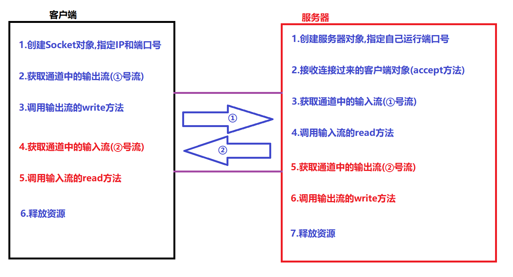
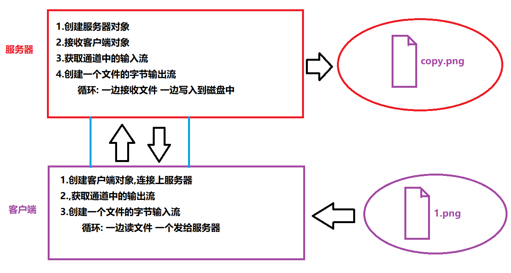

# 【Socket网络编程】
### 第一章 网络编程入门【了解】

##### 1.软件架构介绍

```java
a.CS架构: Client客户端/Server服务器
    比如: QQ,迅雷,手淘App,京东App	
b.BS架构: Browser浏览器/Server服务器
    比如: QQ,淘宝,京东 	
```

##### 2.网络通信协议

- 什么是网络通信协议

  ```java
  在互联网上进行数据交互所需要遵循的规则!
  ```

- TCP/IP协议

  ```java
  TCP协议: 传输控制协议
  	TCP主要用于数据交互,其底层有四层分层模型
  IP协议: 因特网互联协议  
  ```

##### 3.java中支持的常见协议

```java
a.TCP协议:  传输控制协议
	特点: 面向有链接(通过"三次握手"建立连接)
     	 保证数据的安全,完整,但是性能较低    
b.UDP协议:  用户数据报协议
	特点: 面向无连接
         不能保证数据的安全和完整,但是性能高 
```

##### 4.网络编程的三要素

```java
a.网络通信协议(基于TCP协议的通信)
b.IP地址: 网上计算机的唯一标识(相当于身份证号)
c.端口号: 计算机上软件的标识
    端口号一共有:0-65535这个多个,我们写的软件建议使用1024以上的,因为1024一下的被牛逼知名软件服务占用的
```

##### 5.计算机小知识

- IP地址的分类

  ```java
  IPv4: 由32个bit组成的,大概42亿种
      	01001000 01110000 10110000 01110000 
          192     .168      .110     .101
  Ipv6: 由128个bit组成的,号称可以给全世界的每一粒沙子分配个IP,且不重复
  ```

- IP地址的相关命令

  ```java
  ipconfig: 查看本机IP的命令(cmd下)
  ping 对方的IP: 查看本机和对方是否网络畅通    
  ```

- 特殊的IP地址

  ```java
  127.0.0.1(localhost): 代表本机(相当于java中this)
  ```

##### 6.InetAddress类的基本使用

```java
InetAddress: 代表IP地址的类
    静态方法:
		public static InetAddress getLocalHost();//获取本机的IP地址对象
		public static InetAddress getByName(String host);//获取其他主机的IP地址对象
	成员方法:
		public String getHostName();获得主机名 
        public String getHostAddress();获得IP地址字符串
            
public class InetAddressDemo {
    public static void main(String[] args) throws UnknownHostException {
        //1.获取InetAddress对象
        InetAddress localHost = InetAddress.getLocalHost();
        System.out.println(localHost);

        InetAddress inetAddress = InetAddress.getByName("www.baidu.com");
        System.out.println(inetAddress);

        //2.成员方法
        String hostName = inetAddress.getHostName();
        String hostAddress = inetAddress.getHostAddress();
        System.out.println(hostName);
        System.out.println(hostAddress);
    }
}            
```

### 第二章 TCP通信

##### 1.TCP通信分为客户端和服务器

```java
客户端: 一般是指个人电脑
服务器: 一般是公司用于提供服务的大型电脑    
```

##### 2.TCP中的两个重要的类

```java
Socket类,代表客户端类
ServerSocket类,代表服务器类    
```

##### 3.Socket类的介绍和使用

- 构造方法

  ```java
  public Socket(String serverIp,int serverPort);//创建客户端对象,指定要连接的服务器IP和端口
  此构造底层干了很多事!!!
      如果IP和端口号正确,且服务器可以连接,那么底层会自动通过"三次握手"建立连接!!
      如果IP或者端口号有误,或者服务器拒绝拦截,那么此构造会直接抛出异常!!!
  ```

- 常用方法

  ```java
  public OutputStream getOutputStream();//获取连接通道中的输出流
  public InputStream getInputStream();//获取连接通道中的输入流
  public void close();//关闭客户端,释放资源,断开连接
  
  public void shutdownOutput();//关闭连接通道中的输出流 
  public void shutdownInput();//关闭连接通道中的输入流 
  ```

##### 4.ServerSocket类的介绍和使用

- 构造方法

  ```java
  public ServerSocket(int port);//创建服务器,并指定其运行的端口号
  ```

- 常用的成员方法

  ```java
  public void close();//关闭服务器,释放资源
  public Socket accept();//接收连接到服务器客户端对象
  ```

##### 5.简单的TCP通信实现(单向通信)

```java
/**
 * TCP的客户端
 */
public class ClientDemo {
    public static void main(String[] args) throws IOException {
//        1.创建Socket对象,指定IP和端口号
        System.out.println("正在连接服务器...");
        Socket socket = new Socket("127.0.0.1", 8888);
        System.out.println("服务器连接成功...");
//        2.获取通道中的输出流(①号流)
        OutputStream out = socket.getOutputStream();
//        3.调用输出流的write方法
        out.write("你好,我说客户端!".getBytes());
        System.out.println("数据发送成功....");
//        4.释放资源
        out.close();
        socket.close();
        System.out.println("客户端关闭了...");
    }
}

/**
 * TCP的服务器
 */
public class ServerDemo {
    public static void main(String[] args) throws IOException {
//        1.创建服务器对象,指定自己运行端口号
        ServerSocket server = new ServerSocket(8888);
        System.out.println("服务器启动了...");
//        2.接收连接过来的客户端对象(accept方法)
        System.out.println("等待客户端连接...");
        Socket socket = server.accept();//accept方法具有阻塞功能
        System.out.println("客户端来了,他的IP是:"+socket.getInetAddress().getHostAddress());
//        3.获取通道中的输入流(①号流)
        InputStream in = socket.getInputStream();
//        4.调用输入流的read方法
        byte[] bs = new byte[1024];
        int len = in.read(bs);
        System.out.println("客户端说:"+new String(bs,0,len));
//        5.释放资源
        in.close();
        socket.close();
        server.close();
        System.out.println("服务器关闭了...");
    }
}

```
##### 6.简单的TCP通信实现(双向通信)



```java
/**
 * TCP的客户端
 */
public class ClientDemo {
    public static void main(String[] args) throws IOException {
//        1.创建Socket对象,指定IP和端口号
        System.out.println("正在连接服务器...");
        Socket socket = new Socket("127.0.0.1", 8888);
        System.out.println("服务器连接成功...");
//        2.获取通道中的输出流(①号流)
        OutputStream out = socket.getOutputStream();
//        3.调用输出流的write方法
        out.write("你好,我说客户端!".getBytes());
        System.out.println("数据发送成功....");
//      ===========================
//        4.获取通道中的输入流
        InputStream in = socket.getInputStream();
//        5.调用输入流的read方法,读数据
        byte[] bs = new byte[1024];
        int len = in.read(bs);
        System.out.println("服务器说:"+new String(bs,0,len));
//      ===========================
//        6.释放资源
        in.close();
        out.close();
        socket.close();
        System.out.println("客户端关闭了...");
    }
}

/**
 * TCP的服务器
 */
public class ServerDemo {
    public static void main(String[] args) throws IOException {
//        1.创建服务器对象,指定自己运行端口号
        ServerSocket server = new ServerSocket(8888);
        System.out.println("服务器启动了...");
//        2.接收连接过来的客户端对象(accept方法)
        System.out.println("等待客户端连接...");
        Socket socket = server.accept();//accept方法具有阻塞功能
        System.out.println("客户端来了,他的IP是:"+socket.getInetAddress().getHostAddress());
//        3.获取通道中的输入流(①号流)
        InputStream in = socket.getInputStream();
//        4.调用输入流的read方法
        byte[] bs = new byte[1024];
        int len = in.read(bs);
        System.out.println("客户端说:"+new String(bs,0,len));
//      =============================
//        5.获取通道的输出流
        OutputStream out = socket.getOutputStream();
//        6.调用输出流的write方法,把数据发送给客户端
        out.write("您的信息收到了,您可以安息了!".getBytes());
//      ==============================
//        7.释放资源
        out.close();
        in.close();
        socket.close();
        server.close();
        System.out.println("服务器关闭了...");
    }
}
```

### 第三章 综合案例:文件上传

##### 1.文件上传案例分析




##### 2.文件上传案例实现

```java
/**
 * 文件上传的客户端
 */
public class ClientDemo {
    public static void main(String[] args) throws IOException {
        //1.创建客户端对象
        System.out.println("连接服务器...");
        Socket socket = new Socket("127.0.0.1",9999);
        System.out.println("服务器连接成功...");
        //2.获取通道中的输出流
        OutputStream out = socket.getOutputStream();
        //3.创建文件的字节输入流
        FileInputStream fis = new FileInputStream("G:\\upload\\666.png");
        //4.发送文件
        System.out.println("开始发送文件...");
        int len = 0;
        byte[] bs = new byte[1024];
        while ((len = fis.read(bs)) != -1) {
            out.write(bs, 0, len);
        }
        //文件发送完毕,必须告知服务器,关闭输出流即可
        socket.shutdownOutput();//不是shutdownInput()
        System.out.println("文件发送完毕...");
        //5.获取通道中输入流
        InputStream in = socket.getInputStream();
        //6.调用输入流的read方法,读取服务器返回的信息
        len = in.read(bs);
        System.out.println("服务器说:"+new String(bs,0,len));
        //7.释放资源
        in.close();
        fis.close();
        out.close();
        socket.close();
        System.out.println("关闭客户端...");
    }
}

/**
 * 文件上传服务器
 */
public class ServerDemo {
    public static void main(String[] args) throws IOException {
        //1.创建服务器
        ServerSocket server = new ServerSocket(9999);
        System.out.println("服务器启动...");
        //2.获取客户端
        System.out.println("等待客户端...");
        Socket socket = server.accept(); //阻塞
        System.out.println("客户端来了...");
        //3.获取通道中的输入流
        InputStream in = socket.getInputStream();
        //4.创建一个文件的字节输出流
        FileOutputStream fos = new FileOutputStream("G:\\uploads\\copy.png");
        //5.接收文件
        System.out.println("开始接收文件...");
        int len = 0;
        byte[] bs = new byte[1024];
        while ((len = in.read(bs)) != -1) {
            fos.write(bs,0,len);
        }
        System.out.println("接收文件完毕...");
        //6.获取通道中的输出流
        OutputStream out = socket.getOutputStream();
        //7.调用输出流的write给客户端回信息
        out.write("您的文件收到了...".getBytes());
        System.out.println("给客户端发送回信...");
        //8.释放资源
        out.close();
        fos.close();
        in.close();
        socket.close();
        server.close();
        System.out.println("关闭服务器...");
    }
}

多线程版本的服务器:
/**
 * 文件上传多线程版本服务器
 */
public class ServerDemoGood {
    public static void main(String[] args) throws IOException, InterruptedException {
        //1.创建服务器
        ServerSocket server = new ServerSocket(9999);
        System.out.println("服务器启动...");
        //2.获取客户端
        while (true){
            System.out.println("等待客户端...");
            Socket socket = server.accept(); //阻塞
            System.out.println("客户端来了...");
            //3.创建一个新的线程,在线程中与客户端进行数据交互
            new Thread(new Runnable() {
                @Override
                public void run() {
                    //交互的代码
                    try {
                        //3.获取通道中的输入流
                        InputStream in = socket.getInputStream();
                        //4.创建一个文件的字节输出流
                        FileOutputStream fos = new FileOutputStream("G:\\uploads\\"+System.currentTimeMillis()+".png");
                        //5.接收文件
                        System.out.println("开始接收文件...");
                        int len = 0;
                        byte[] bs = new byte[1024];//
                        while ((len = in.read(bs)) != -1) {
                            fos.write(bs,0,len);
                        }
                        System.out.println("接收文件完毕...");
                        //6.获取通道中的输出流
                        OutputStream out = socket.getOutputStream();
                        //7.调用输出流的write给客户端回信息
                        out.write("您的文件收到了...".getBytes());
                        System.out.println("给客户端发送回信...");
                        //8.释放资源
                        out.close();
                        fos.close();
                        in.close();
                        socket.close();
                    }catch (Exception ie){
                        ie.printStackTrace();
                    }
                }
            }).start();
        }
//        server.close(); 服务器不关闭
//        System.out.println("关闭服务器...");
    }
}
```

##### 3.模拟BS架构服务器

```java
体验BS架构:  
	Browser/Server
public class ServerDemo {
    public static void main(String[] args) throws IOException {
        //1.创建服务器
        ServerSocket server = new ServerSocket(12345);
        System.out.println("服务器启动...");
        //2.接收浏览器端
        System.out.println("等待连接...");
        Socket socket = server.accept();
        System.out.println("连接来了...");
        //3.获取通道中输入流
        InputStream in = socket.getInputStream();
        //4.创建BufferedReader
        BufferedReader br = new BufferedReader(new InputStreamReader(in));
        String line = br.readLine();
        String[] split = line.split(" ");
        String filename = split[1].substring(1);
        System.out.println("客户端要这个文件:" + filename);
        //5.将客户端需要的文件读取出来,通过通道中的输出流发送给客户端即可
        FileInputStream fis = new FileInputStream(filename);
        OutputStream out = socket.getOutputStream();
        //----========通知浏览器文件的格式为html============---------
        out.write("HTTP/1.1 200 OK\r\n".getBytes());
        out.write("Content-Type:text/html\r\n".getBytes());
        out.write("\r\n".getBytes());
        //----====================---------

        int len = 0;
        byte[] bs = new byte[1024];
        while ((len = fis.read(bs)) != -1) {
            out.write(bs, 0, len);
        }
        //6.释放资源
        out.close();
        fis.close();
        br.close();
        in.close();
        socket.close();
        server.close();
    }
}      
```


##### 4.扩展:模拟服务器扩展_图片显示问题

```java
public class ServerDemo {
    public static void main(String[] args) throws IOException {
        //1.创建服务器
        ServerSocket server = new ServerSocket(12345);
        System.out.println("服务器启动...");
        //2.接收浏览器端
        while (true){
            System.out.println("等待连接...");
            Socket socket = server.accept();
            System.out.println("连接来了...");
            //3.获取通道中输入流
            InputStream in = socket.getInputStream();
            //4.创建BufferedReader
            BufferedReader br = new BufferedReader(new InputStreamReader(in));
            String line = br.readLine();
            String[] split = line.split(" ");
            String filename = split[1].substring(1);
            System.out.println("客户端要这个文件:" + filename);
            //5.将客户端需要的文件读取出来,通过通道中的输出流发送给客户端即可
            FileInputStream fis = new FileInputStream(filename);
            OutputStream out = socket.getOutputStream();
            //----========通知浏览器文件的格式为html============---------
            out.write("HTTP/1.1 200 OK\r\n".getBytes());
            out.write("Content-Type:text/html\r\n".getBytes());
            out.write("\r\n".getBytes());
            //----====================---------

            int len = 0;
            byte[] bs = new byte[1024];
            while ((len = fis.read(bs)) != -1) {
                out.write(bs, 0, len);
            }
            //6.释放资源
            out.close();
            fis.close();
            br.close();
            in.close();
            socket.close();
        }
//        server.close();
    }
}

```
