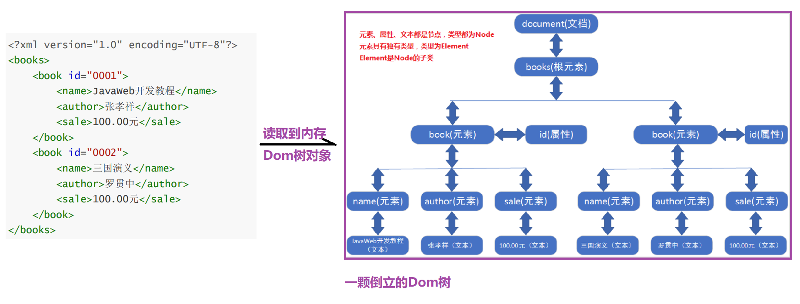

# 【XML、dom4j】
### 第一章 XML概述

##### 1.XML的初体验

- XML的介绍以及版本

  ```java
  XML: EXtensible Markup Language 可扩展标记语言 
     语言: XML也是一门语言
     标记: 也叫标签,是XML中最最最重要的组成部分,比如:<a>内容</a> 
     可扩展: 只是XML中标签可以随意书写,只要符合少量的语法要求即可    
  XML发展史:
  	XML有两个版本,1.0和1.1(基本没有人使用的)
      所以我们现在,开发中只用1.0版本    
  ```

- XML 与 HTML 的主要差异

  ```java
  XML: 主要用于存储数据(传输数据)
  HTML: 主要用于展示数据    
  ```

- XML入门小案例
  - 需求
  
    ```java
    用Java保存一个人的信息(id,姓名,年龄)
    public class Person{
        String id;
        String name;
        int age;
        //get/set 构造...
    }    
    Person p = new Person("10086","jack",20);
    
    用XML保存一个人的信息
    ```
  
  - 编写
  
    ```xml
    <?xml version="1.0" encoding="UTF-8" ?>
    <person id="10086">
        <name>jack</name>
        <age>20</age>
    </person>
    ```
  
  - 运行
  
    ```java
    直接用浏览器打开即可
    ```
  
- XML的作用

  ```java
  a.用于保存数据
  b.用于传输数据(目前很少使用XML传输数据,一般使用json数据格式来传输数据)
  c.我们以后框架的配置文件(我们学到Tomcat,Mybatis再说)    
  ```

##### 2.XML的语法学习

- ==XML的组成元素==
  
  - 文档声明
  
    ```java
    固定格式:<?xml version="1.0" encoding="UTF-8" ?> 
        		   代表XML的版本  当前文件的编码  
    ```
  
  - 元素element
  
    ```java
    元素(Element)也称为标签(Tag),标记(Node)
    a.标签的组成: <开始标签>标签体</结束标签>
    b.标签体: i.空  ii.一串文本  iii.还是标签 
    c.如果标签体为空,也称为空标签,空标签可以这么写:<标签/>(自闭合标签)  
    d.元素名:
    	i.元素名区分大小写
        ii.元素名不要使用特殊符号
        iii.不建议使用XML相关的开头    
    e.一个标准的XML应该只有一个根标签  
         <?xml version="1.0" encoding="UTF-8" ?>
            <ps>
                <person id="10086">
                    <name>jack</name>
                    <age>20</age>
                </person>
    
                <person id="10010">
                    <name>rose</name>
                    <age>30</age>
                </person>
            </ps>
    ```
  
  - 属性attribute 
  
    ```java
    1.属性是元素的一部分，它必须出现在元素的开始标签中；
    2.属性的定义格式：属性名="属性值",其中属性值必须是''或者""引起来
    3.一个标签的属性可以是任意个,多个属性直接使用空格隔开,但是不能出现同名的属性 
    4.属性名不能使用特殊符号,必须以字母开头
        格式:
    		<a id="002"></>
    ```
  
  - 注释
  
    ```java
    <!-- 
      注释内容 
      注释内容 
    -->
    ```
  
  - 转义字符
  
    ```java
    <   &lt;
    >   &gt;
    "   &quot;
    '   &apos;
    &   &amp;
    当XML中出现以上几个特殊字符时,我们建议使用转译字符代替
    ```
  
  - 字符区(了解)
  
    ```java
    假设出现了大量需要转译的字符,我们不需要挨个转译,只需要将这些内容放到CDATA区中即可
    <![CDATA[
        写大量需要转译的字符
    ]]>       
    ```

### 第二章 XML约束

##### 1.DTD约束

- 什么是DTD约束

  ```java
  DTD约束:文档类型定义约束
     该约束可以规定我们的XML根标签,子标签,标签顺序,标签嵌套等信息 
  ```

- ==DTD约束体验[重点重点重点]==

  ```java
  我们开发的重点是: 根据框架提供的DTD约束文档,编写出符合要求的XML文件!!!
  a.创建我们自己的XML,引入要约束的DTD文件
  b.根据DTD约束(idea有提示),完成我们的XML  
  c.快速开发:我们只需要写一个根标签,然后回车即可快速开发    
      
  <?xml version="1.0" encoding="UTF-8" ?>
  <!DOCTYPE 书架 SYSTEM "bookshelf.dtd">
  <书架>
      <书>
          <书名>三国演义</书名>
          <作者>罗贯中</作者>
          <售价>100</售价>
      </书>
  </书架>    
  ```

- DTD约束语法
  - DTD的引入
  
    ```java
    a.内部DTD
        直接把DTD文件的内容写到XML里面
        缺点:这种方式这个DTD只对该文件有用!
    b.外部DTD --> 本地DTD
        <!DOCTYPE 书架 SYSTEM "bookshelf.dtd">   
            
    c.外部DTD ---> 公共DTD
       <!DOCTYPE web-app PUBLIC "-//Sun Microsystems, Inc.//DTD Web Application 2.3//EN" "http://java.sun.com/dtd/web-app_2_3.dtd">     
    ```
  
  - DTD中的数量词
  
    ```java
    标签*: 表示该标签可以出现任意次
    标签+: 表示该标签可以出现1-n次
    标签?: 表示该标签可以出现0-1次
    标签1,标签2: 表示必须先写标签1,再写标签2
    标签a|标签b|标签c: 表示标签abc只能选择其中的一个出现    
    ```
  
  - 其他语法了解即可
  
    ```java
    给标签添加属性:
    <!ATTLIST 书
            id ID #REQUIRED
            编号 CDATA #IMPLIED
            出版社 (清华|北大|传智播客) "传智播客"
            type CDATA #FIXED "IT">
        
    <书 id="heima001" 编号="001" 出版社="清华" type="IT">
        <书名>三国演义</书名>
        <作者>罗贯中</作者>
        <售价>100</售价>
    </书>    
    ```

##### 2.schema约束

- 什么是Schema约束

  ```java
  也是一种XML约束,比DTD更加强大,主要表现对数据类型的约束上
  Schema本身其实也XML,但是后缀叫xsd    
  ```

- ==Schema约束体验==

  ```java
  我们开发的重点是: 根据框架提供的Schema约束文档,编写出符合要求的XML文件!!!
  a.创建自己的XML,引入Schema约束
  b.根据Schema约束(idea有提示),完成我们的XML      
  ```

- Schema的语法和命名空间(了解即可)

  ```java
  命名空间: 相当于Java中的包
  ```
### 第三章 XML解

##### 1. 什么是XML解析

```java
所谓的XML解析就是通过编写代码,将保存在XML中的数据读取出来!!
```

##### 2. 解析方式和解析器和解析开发包

```java
解析理论方式:
	a.DOM解析方式:
		 将整个XML一次性读取到内存,然后进行解析	
         优点: XML结构是完整的,可以对某些标签进行增删改查
		 缺点: 可能会导致内存溢出(大量占用内容)
    b.SAX解析方式:
		将整个XML一行一行的读取到内存,读取一行解析一行,解析完一行释放一行!
         优点: 速度快,不占用大量内存
		 缺点: XML结构是不完整的    
    c.PULL解析方式: (了解)
		小型的嵌入式系统使用(Android手机)
            
解析器: 就是对解析理论方式进行代码实践
       解析器不一定是Java写的,代码也是非常繁琐的(考虑到解析的所有细节)
    
解析开发包: 对解析器进行进一步的封装,使代码更加简单易用!!!    
    
    
常见的解析开发包有哪些:
	Dom4J解析开发包(开发中最常用的解析开发)
```

##### ==3. Dom4j的基本使用==

- DOM解析的原理

  ```java
  一次性将整个XML读取到内存,然后进行解析,返回一个解析后的Document对象(倒立的Dom树)
  ```

- DOM树的结构模型

  

- DOM4J的jar包和常用API

  ```java
  a.我们的books.xml放在src下
  b.为了方便解析,我们在books.xml中并没有引入约束
  c.要添加两个jar文件(资料中有)    
  ```

- DOM4J代码演示[重点掌握]

  ```java
  public class Dom4JDemo {
      public static void main(String[] args) throws DocumentException {
          //1.读取XML的核心类
          SAXReader reader = new SAXReader();
          Document document = reader.read(Dom4JDemo.class.getResourceAsStream("/books.xml"));
          //2.获取根元素
          Element rootElement = document.getRootElement();
          System.out.println("根元素:" + rootElement.getName());
          //3.获取根元素的子元素
          List<Element> list = rootElement.elements();
          //4.遍历集合
          for (Element element : list) {
              System.out.println("子元素:" + element.getName());
              //5.获取属性
              String id = element.attributeValue("id");
              System.out.println("属性id = " + id);
              //6.获取子子元素
              List<Element> elements = element.elements();
              //7.遍历
              for (Element ele : elements) {
                  System.out.println("子子元素名字:"+ele.getName());
                  //8.获取子子元素的文本
                  System.out.println("子子元素内容:"+ele.getText());
              }
          }
      }
  }
  ```

##### 4. Dom4J结合XPath解析XML

- 什么是XPath

  ```java
  XPath称为路径表达式,我们Dom4J可以结合Xpath,快速获取路径表达式中所指的那个元素和属性!!
  ```

- XPath使用步骤

  ```java
  a.导入jar包(2个jar包,资料中有)
  b.使用SaxReader读取xml文件
  c.使用API和Xpath结合,快速获取结点
      public List selectNodes("Xpath表达式");获取符合表达式的元素集合
      public Element selectSingleNode("Xpath表达式") 获取符合表达式的唯一元素
  ```

- XPath语法(了解)

  ```java
  1. 绝对路径表达式方式 例如: /元素/子元素/子子元素...
  2. 相对路径表达式方式 例如: 子元素/子子元素.. 或者 ./子元素/子子元素..
  3. 全文搜索路径表达式方式 例如: //子元素//子子元素
  4. 谓语（条件筛选）方式 例如: //元素[@attr1=value]
  ```

- 演示

  ```java
  //获取id为0002的指定book元素的子标签name的内容
  public class Dom4JDemo02 {
      public static void main(String[] args) throws DocumentException {
          //1.读取XML的核心类
          SAXReader reader = new SAXReader();
          Document document = reader.read(Dom4JDemo02.class.getResourceAsStream("/books.xml"));
          //2.获取id为0002的指定book元素的子标签name的内容
          Element element = (Element) document.selectSingleNode("//book[@id=0002]");
          //3.获取子标签name
          Element nameEle = element.element("name");
          System.out.println(nameEle.getText());
          //System.out.println(element.elementText("name"));
      }
  }
  ```
