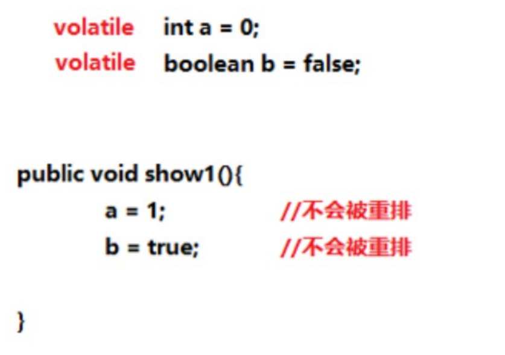
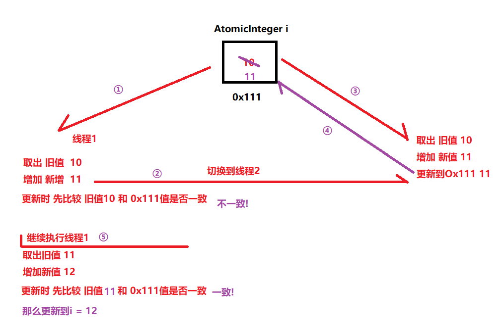
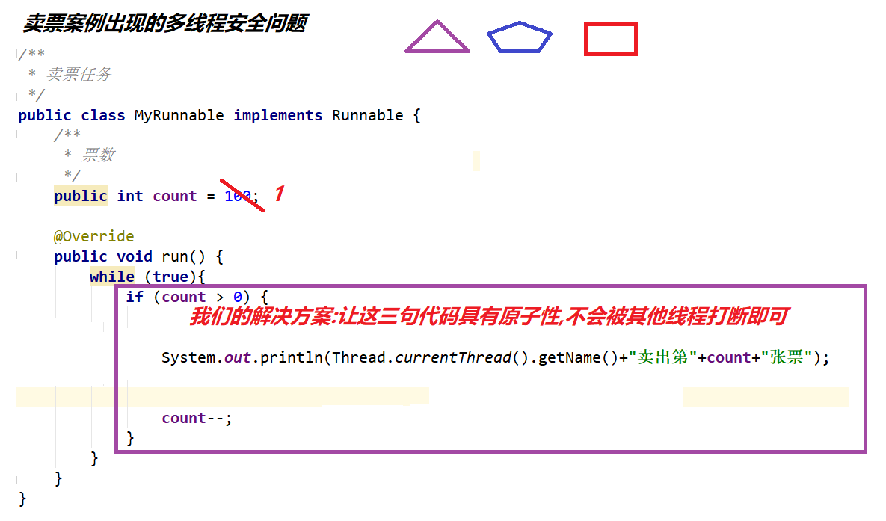

# 	【volatile关键字、原子性】
### 第一章 volatile关键字【理解】

##### **1.1** volatile是什么

```java
是一个关键字,用于修饰成员变量,主要用于解决可见性和有序性问题,但是无法解决原子性问题!!
```

##### 1.2 volatile解决可见性

```java
public class MyThread extends Thread {
    //保证所有线程每次使用a时都会强制更新
    public volatile static  int a = 0;
    @Override
    public void run() {
        System.out.println("线程启动，休息2秒...");
        try {
            Thread.sleep(1000 * 2);
        } catch (InterruptedException e) {
            e.printStackTrace();
        }
        System.out.println("将a的值改为1");
        a = 1;
        System.out.println("线程结束...");
    }
}

public class TestDemo {
    public static void main(String[] args) {
        //1.启动线程
        MyThread t = new MyThread();
        t.start();
        //2.主线程继续
        while (true) {
            if (MyThread.a == 1) {
                System.out.println("主线程读到了a = 1");
            }
        }
    }
}
输出结果:
线程启动，休息2秒...
将a的值改为1
线程结束...
主线程读到了a = 1
主线程读到了a = 1
...    
```

##### 1.3 volatile解决有序性

```java
a和b由于使用了volatile关键字修饰,那么编译器就不会进行优化,即对a和b进行赋值的代码不会进行"重排"!
```




##### 1.4 volatile不能解决原子性

```java
public class MyThread extends Thread {
    //添加了volatile关键字,也不能保证a++的操作不被其他线程打断
    public volatile static int a = 0;
    @Override
    public void run() {
        for (int i = 0; i < 10000; i++) {
            a++;//a.获取a的值 b.增加1 c.更新a的值
        }
        System.out.println("修改完毕！");
    }
}

public class AutomicDemo {
    public static void main(String[] args) throws InterruptedException {
        MyThread t1 = new MyThread();
        t1.start();

        MyThread t2 = new MyThread();
        t2.start();


        Thread.sleep(2000);
        System.out.println(MyThread.a);//20000

    }
}
输出结果:
	修改完毕！
    修改完毕！
    13752(还是小于20000的)
```

### 第二章 原子类

##### 2.1 原子类

```java
a.什么是原子类?
    在java.util.concurrent.atomic包下定义的类,基本都是原子类
b.原子类的作用?
    保证变量的操作是原子性操作(也能解决变量操作的有序性和可见性) 
c.原子类有哪些?
    AtomicInteger 对int基本类型的原子类
    AtomicLong 对long基本类型的原子类
    AtomicBoolean 对boolean基本类型的原子类
```

##### 2.2 AtomicInteger类示例

```java
a.AtomicInteger是什么?
    为基本类型int提供的原子类
b.AtomicInteger的构造方法
    public AtomicInteger(int num);
c.AtomicInteger的成员方法
    public int getAndIncrement();//相当于,变量++
	public int incrementAndget();//相当于,++变量
	也有相当于,变量--或者--变量的方法    
d.使用AtomicInteger改写案例   
    public class MyThread extends Thread {
        //AtomicInteger就能保证变量++或者++变量的原子性
        public static AtomicInteger a = new AtomicInteger(0);
        @Override
        public void run() {
            for (int i = 0; i < 10000; i++) {
                a.getAndIncrement();//相当于a++
            }
            System.out.println("修改完毕！");
        }
    }    
运行结果:
	修改完毕！
    修改完毕！
    20000(每次都是20000)
```

##### 2.3 AtomicInteger类的工作原理-CAS机制



##### 2.4 AtomicIntegerArray类示例

- 非原子类数组在多线程并发时会有问题

  ```java
  public class MyThread extends Thread {
      public static int[] arr = new int[1000];//不直接使用数组
      @Override
      public void run() {
          for (int i = 0; i < arr.length; i++) {
              arr[i]++;
          }
      }
  }
  
  public class TestDemo {
      public static void main(String[] args) throws InterruptedException {
          for (int i = 0; i < 1000; i++) {
              new MyThread().start();//创建1000个线程，每个线程为数组的每个元素+1
          }
          //结果理论上是什么:1000个1000啊!!
          Thread.sleep(1000 * 5);//让所有线程执行完毕
          System.out.println("主线程休息5秒醒来");
          for (int i = 0; i < MyThread.arr.length; i++) {
              System.out.println(MyThread.arr[i]);
          }
          //结果实际上是小于1000的(多尝试几次)
      }
  }
  运行结果:
  	有可能出现小于1000的元素
  ```

- 使用原子类数组,保证原子性,解决问题

  ```java
  使用AtomicIntegerArray解决非原子类数组的原子性问题
  public class MyThread extends Thread {
  //    public static int[] arr = new int[1000];//不直接使用数组
      public static AtomicIntegerArray arr = new AtomicIntegerArray(1000);//直接使用原子类数组
      @Override
      public void run() {
          for (int i = 0; i < arr.length(); i++) {
              arr.getAndIncrement(i);//相当于数组操作中的arr[i]++
  //            arr.incrementAndGet(i);//相当于数组操作中的++arr[i]
  //            arr.getAndAdd(i,1);
  //            arr.addAndGet(i,1);
              //以上四种方式在本题中均可
          }
      }
  } 
  
  public class TestDemo {
      public static void main(String[] args) throws InterruptedException {
          for (int i = 0; i < 1000; i++) {
              new MyThread().start();//创建1000个线程，每个线程为数组的每个元素+1
          }
          //结果理论上是什么:1000个1000啊!!
          Thread.sleep(1000 * 5);//让所有线程执行完毕
          System.out.println("主线程休息5秒醒来");
          //结果实际上是小于1000的(多尝试几次)
          System.out.println(MyThread.arr);
      }
  }
  输出结果:
  	[1000,1000,.....都是1000]
  ```

### 第三章 synchronized关键字

##### 3.1 AtomicInteger的不足之处

```java
回顾: AtomicInteger能解决什么问题?
    主要解决的变量操作的原子性问题,也能解决可见性和有序性问题
    
但是: 原子类无法解决多句代码的原子性问题
```

##### 3.2 多行代码的原子性安全问题--卖票案例

```java
/**
 * 卖票任务
 */
public class MyRunnable implements Runnable {
    /**
     * 票数
     */
    public int count = 100;
    @Override
    public void run() {
        while (true){
            if (count > 0) {
                try {
                    Thread.sleep(30);//模拟卖票掏钱消耗的时间
                } catch (InterruptedException e) {
                    e.printStackTrace();
                }
                System.out.println(Thread.currentThread().getName()+"卖出第"+count+"张票");
                count--;
            }
        }
    }
}

public class TestDemo {
    public static void main(String[] args) {
        //0.创建任务
        MyRunnable mr = new MyRunnable();
        //1.创建窗口123
        Thread t1 = new Thread(mr);
        Thread t2 = new Thread(mr);
        Thread t3 = new Thread(mr);
        t1.start();
        t2.start();
        t3.start();
        //出现多线程安全问题:
        //a.出现了重复数据
        //b.出现了0,-1非法数据
    }
}

重复数据出现的原因:
	当某个线程卖出某张后,还没来得及对票数减1,被其他线程抢走CPU,导致其他线程也卖出同张票!!
非法数据出现的原因:
	当只剩下最后一张票时,由于多线程的随机切换可能多个线程都会通过大于0的判断, 最终导致卖出的票是0,-1,-2....这些张数!!!       
```



##### 3.3 synchronized关键字介绍

```java
a.synchronized是什么??
    一个可以用于让多行代码保证原子性的关键字
b.synchronized的作用??   
    让多行代码"同步",当某个线程进入这多行代码执行时,其他线程是无法进入的,直到多行代码都运行完毕了,其他线程才能进入
```

##### 3.4 解决方案1_同步代码块

```java
格式:
	synchronized(任意对象){ //也叫做锁对象
        需要同步的代码(需要保证原子性操作的那些代码)
    }

/**
 * 卖票任务
 */
public class MyRunnable implements Runnable {
    /**
     * 票数
     */
    public int count = 100;
    /**
     * 创建一个对象
     */
    public Object obj = new Object();
    @Override
    public void run() {
        while (true){
            //同步代码块
            synchronized (obj) {//任意对象都可以作为锁对象
                if (count > 0) {
                    System.out.println(Thread.currentThread().getName() + "卖出第" + count + "张票");
                    count--;
                }
            }
        }
    }
}

public class TestDemo {
    public static void main(String[] args) {
        //0.创建任务
        MyRunnable mr = new MyRunnable();
        //1.创建窗口123
        Thread t1 = new Thread(mr);
        Thread t2 = new Thread(mr);
        Thread t3 = new Thread(mr);
        t1.start();
        t2.start();
        t3.start();
        //出现多线程安全问题:
        //a.出现了重复数据
        //b.出现了0,-1非法数据
    }
}

注意:
	a.synchronized()中的锁对象,可以是任意对象,但是必须保证多个线程使用的是同一个锁对象   
```
