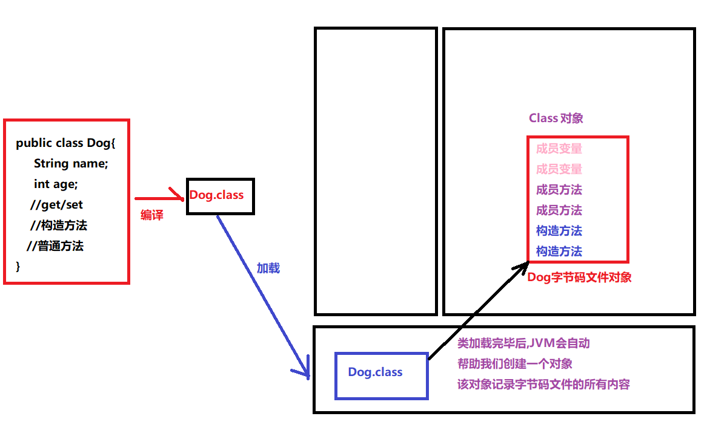

# 【反射、注解】

##### 反馈复习

```java
这两天的东西太多了,老是记不住
1.选择器:
	Selector selector = Selector.open();
	a.通道对象.register 注册到选择器
    b.keys selectedKeys select    
2.AIO   
   AsynchronousSocketChannel
   AsynchronousServerSocketChannel
   特点: 异步非阻塞     
```

##### 今日内容

```java
1.反射(非常重要,写框架必备的) 
    只学最最最基本的API
2.注解(非常重要,学习框架必备的) 
    只学最最最基本的语法
```

### 第一章 反射

##### 1.类加载器【了解】

- ##### 类的加载【重点】

  ```java
  我们的java源码--编译-->java字节码--类的加载-->JVM
  当字节码文件加载到内存之后,JVM会为它创建一个Class对象(字节码文件的对象)    
  ```

  

- 类的加载时机

  ```java
  类的字节码文件什么时候会被加载???
  a.创建类的实例。
  b.访问类的静态变量
  c.调用类的静态方法
  d.使用反射方式来强制加载某个类
  e.使用到了该类的子类,也会导致该类被加载
  f.直接使用java.exe命令运行某个测试类(含有main方法的类)
  总而言之:
  	类的字节码文件什么时候会被加载,当我们用到该类或者该类的子类时!!!
  ```

- 类加载器的作用和分类

  ```java
  类加载器(ClassLoader),将字节码文件加载到JVM的内存中
  类加载器的分类:
  	根类加载器(引导类加载器): 用于加载系统类库(比如:%JAVA_HOME%\bin下的这些类)
  	扩展类加载器: 用于加载扩展类库(比如:库<JAVA_HOME>\lib\ext目录下的类)
      应用类加载器: 用于加载我们自定义类的加载器. 
  ```

- 双亲委派机制

  ```java
  双亲委派机制:
  	主要作用就是保住一个类只会加载一次
  ```

##### 2.什么是反射

```java
反射是一种技术(Java的黑客技术) 
什么是反射: 反射就是获取到某个类的Class对象,然后解剖它,从而取出其中各种成员,进而可以使用他们!!!
```

##### 3.反射在实际开发中的应用

```java
a.开发开发工具(比如:开发idea)
b.各种框架的深入学习和自己设计    
```

##### 4.反射中万物皆对象的概念

```java
反射中万物皆对象:
	一个成员方法  --> Method类型对象
    一个成员变量  --> Field类型对象
    一个构造方法  --> Constructor类型对象

2个常见的单词:
	newInstance: 创建对象
    invoke: 执行方法/调用方法
体验一下反射的语法:
	创建对象:
		正常语法: 类名 对象名 = new 构造方法(参数);
		反射语法: 类名 对象名 = 构造方法对象.newInstance(参数);
    调用方法:
		正常语法: 对象名.方法(参数);
		反射语法: 方法对象.invoke(对象名,参数);
```

##### 5.反射的第一步获取字节码文件对象(Class对象)【重点】

```java
/**
 * 反射的第一步获取Class对象
 */
public class GetCLassDemo {
    public static void main(String[] args) throws ClassNotFoundException {
        //1.通过类的一个静态成员获取
        Class clazz1 = Dog.class;
        System.out.println(clazz1);
        //2.通过该类一个实例,获取该类的Class对象
        Dog d1 = new Dog();
        Class clazz2 = d1.getClass();
        System.out.println(clazz2);
        //3.通过Class类的静态方法,强制加载某个类,获取该类的Class对象
        Class clazz3 = Class.forName("com.itheima.demo01_GetClass.Dog");
        System.out.println(clazz3);
        //以上只是获取Class对象的三种方式,并不是获取三个对象
        System.out.println("--------------------");
        System.out.println(clazz1 == clazz2);
        System.out.println(clazz1 == clazz3);
        System.out.println(clazz2 == clazz3);
    }
}
```

##### 6.Class对象中的三个常用方法

```java
public String getName(); //获取当前Class对象所代表的类的名字(包含包名)
public String getSimpleName(); //获取当前Class对象所代表的类的名字(不包含包名)
public Object newInstance();//创建当前Class对象所代码的类的对象

System.out.println(clazz1.getName()); //com.itheima.demo01_GetClass.Dog
System.out.println(clazz1.getSimpleName());//Dog
Object obj = clazz1.newInstance(); 
System.out.println(obj);//Dog{age=0, name='null'}
```

##### 7.通过反射获取构造方法&&使用构造方法创建对象【重点】

- 反射获取构造方法

  ```java
  public Constructor getConstructor(Class... parameterTypes);//获取"public"构造    
  public Constructor getDeclaredConstructor(Class... parameterTypes);//获取"任意修饰"构造
  @Test
  public void test01() throws NoSuchMethodException {
      //1.反射第一步,获取Class对象
      Class cc = Dog.class;
      //2.获取cc对象中"public"修饰的构造方法
      Constructor con1 = cc.getConstructor();
      System.out.println(con1);
  
      Constructor con2 = cc.getConstructor(int.class,String.class);
      System.out.println(con2);
  
      Constructor con3 = cc.getConstructor(int.class);
      System.out.println(con3);
      //如果构造方法是非public,那么我们需要调用getDeclaredConstructor获取
      Constructor con4 = cc.getDeclaredConstructor(String.class);
      System.out.println(con4);
  }
  
  public Constructor[] getConstructors();//获取所有public构造 
  public Constructor[] getDeclaredConstructors();//获取所有"任意修饰"的构造
  @Test
  public void test02() throws NoSuchMethodException {
      //1.反射第一步,获取Class对象
      Class cc = Dog.class;
      //2.获取所有"public"构造
      Constructor[] cons = cc.getConstructors();
      //3.获取所有"任意修饰"构造
      Constructor[] declaredCons = cc.getDeclaredConstructors();
      for (Constructor con : declaredCons) {
          System.out.println(con);
      }
  }
  ```

- 使用构造方法创建对象

  ```java
  反射语法:
  	 constructor对象.newInstance(参数);//使用构造方法创建对象
  @Test
  public void test03() throws Exception {
      //1.反射第一步,获取Class对象
      Class cc = Dog.class;
      //2.获取cc对象中"public"修饰的构造方法
      Constructor con1 = cc.getConstructor();
      Object obj1 = con1.newInstance();
      System.out.println(obj1);
  
      Constructor con2 = cc.getConstructor(int.class,String.class);
      Object obj2 = con2.newInstance(2, "旺财");
      System.out.println(obj2);
  
      Constructor con3 = cc.getConstructor(int.class);
      Object obj3 = con3.newInstance(2);
      System.out.println(obj3);
  
  
      //如果构造方法是非public,那么我们需要调用getDeclaredConstructor获取
      Constructor con4 = cc.getDeclaredConstructor(String.class);
      //如果是私有构造,那么必须先设置暴力访问权限
      con4.setAccessible(true);
      Object obj4 = con4.newInstance("旺财");
      System.out.println(obj4);
  }
  ```

- 如果是私有构造怎么办

  ```java
  私有构造不能直接使用,必须先设置暴力访问权限,然后才能正常使用!!
  ```

##### 8.通过反射获取成员方法&&调用成员方法【重点】

- 反射获取成员方法

  ```java
  public Method getMethod(String name,Class... parameterType);
  												//获取某个"public"方法
  public Method getDeclaredMethod(String name,Class... parameterType);
  												//获取某个"任意修饰的"方法
  @Test
  public void test01() throws NoSuchMethodException {
      //1.反射第一步,获取Class对象
      Class cc = Dog.class;
      //2.获取Class对象中成员方法
      Method method1 = cc.getMethod("drink");
      Method method2 = cc.getMethod("drink",String.class);
      //如果需要获取非公有方法,需要调用getDeclaredMethod
      Method method3 = cc.getDeclaredMethod("drink", String.class, String.class);
      System.out.println(method1);
      System.out.println(method2);
      System.out.println(method3);
  }
  
  public Method[] getMethods();//获取所有"public"的成员方法(包含父类继承的)
  public Method[] getDeclaredMethods();//获取所有"任意修饰的"的成员方法(不包含父类继承的)
  
  @Test
  public void test02() throws NoSuchMethodException {
      //1.反射第一步,获取Class对象
      Class cc = Dog.class;
      //2.获取所有"public"方法(包括父类继承的)
      Method[] methods = cc.getMethods();
      //3.获取所有"任意修饰的"方法(不包含父类继承的)
      Method[] declaredMethods = cc.getDeclaredMethods();
  
      for (Method method : declaredMethods) {
          System.out.println(method);
      }
  }
  ```

- 调用成员方法

  ```java
  调用语法:
  	method对象,invoke(对象名,方法参数);//执行获取到的成员方法
  
  @Test
  public void test03() throws Exception {
      //1.反射第一步,获取Class对象
      Class cc = Dog.class;
      //2.获取Class对象中成员方法
      Method method1 = cc.getMethod("drink");
      //执行
      Dog dd = new Dog();
      method1.invoke(dd);//dd.drink();
  
      Method method2 = cc.getMethod("drink",String.class);
      method2.invoke(dd,"雪碧");
      //如果需要获取非公有方法,需要调用getDeclaredMethod
      Method method3 = cc.getDeclaredMethod("drink", String.class, String.class);
      //method3是私有方法,所需必须先设置暴力权限
      method3.setAccessible(true);
      method3.invoke(dd,"可乐","雪碧");
  }
  
  ```

- 如果是私有的成员方法怎么调用呢?

  ```java
  私有方法不能直接调用,必须先设置暴力访问权限,然后才能正常使用!!
  ```

##### 9.通过反射获取成员属性【了解,自学】

```java
开发中极少用到获取成员变量,因为所有的成员变量都有get/set方法,我们获取成员方法即可操作成员变量
```

### 第二章 注解

##### 1.什么是注解

```java
注解是JDK1.5的新特性,它是一种标记,可以标记类,方法,成员变量,局部变量,参数等....
这个标记主要是给编译器看的,或者给JVM看的    
```

##### 2.注解的三个作用

```java
a.生成帮助文档:
	@author 作者信息
    @verson 版本信息
b.编译检查:
	@Override 检查方法重写是否正确
c.给框架的作为配置使用        
    (Mybatis,Spring,SpringMVC)这些框架都会用到注解    
```

##### 3.常见的注解介绍

```java
@Override 方法重写注解
@FunctionalInterface 函数式接口注解
@Deprecated 过期注解 
@author 用来标识作者
@version 用于标识版本
@Test junit单元测试
```

##### 4.自定义注解【重点】

```java
自定义类: 
	public class 类名{}
自定义接口:
	public interface 接口名{}
自定义枚举:
	public enum 枚举名{}
自定义注解:
	public @interface 注解名{}
```

##### 5.给自定义注解添加属性【重点】

```java
格式:
	public @interface 注解名{
        //注解中只能写属性
        数据类型 属性名() [default 默认值];
    }
注解中属性的数据类型必须是以下三大类之一:
a.8种基本类型(byte,short,int,long,char,float,double,boolean)
b.4种引用类型(String,枚举类型,Class类型,其他注解类型)
c.以上12种的一维数组
```

##### 6.自定义注解练习【重点】

```java
/**
 * 自定义注解
 */
public @interface MyAnnotation {
    //给注解添加属性
    int age();// default 10;
    String name();// default "张三";
    String[] hobby();// default {"抽烟","喝酒","烫头"};
}
```

##### 7.使用注解时的注意事项【重点】

```java
@MyAnnotation(age = 10,name = "李四",hobby = {"抽烟","喝酒"})
public class Demo {

    @MyAnnotation(age = 20,name = "王五",hobby = "喝酒")
    private int a;
    private String b;

    @MyAnnotation(age = 20,name = "王五",hobby = "喝酒")
    public Demo() {
    }

    public Demo(int a, String b) {
        this.a = a;
        this.b = b;
    }

    @MyAnnotation(age = 20,name = "王五",hobby = "喝酒")
    public void show(@MyAnnotation(age = 20,name = "王五",hobby = "喝酒") String name){
        @MyAnnotation(age = 20,name = "王五",hobby = "喝酒")
        int age = 10;
        System.out.println("我的年龄是:"+age);
    }
}
注意事项:
	a.默认情况下,我们的注解可以标记在类上,方法上,成员变量上,参数上,局部变量上等...
    b.使用注解进行标记时,必须保证该注解的某个属性都有值
        即没有默认值的属性必须赋值,有默认值的属性可以赋值也可以不赋值
```

##### 8.自定义注解中的特殊属性名value【重点】

```java
a.如果注解中只有一个属性且名字叫value，则在使用该注解时可以直接给该属性赋值，而不需要 给出属性名。
/**
 * 特殊属性名value
 */
public @interface MyAnno {
    String value();
}
@MyAnno("jack") //省略"value="直接写属性值
public class Demo {
}

b.如果注解中除了value之外,其他的属性都有默认值,并且使用时只给value赋值,那么直接给该属性赋值，而不需要 给出属性名。
/**
 * 特殊属性名value
 */
public @interface MyAnno {
    String value();
    int age() default 10;
    String name() default "rose";
}
@MyAnno("jack") //省略"value="直接写属性值
public class Demo {
}    
```

##### 9.注解的注解--元注解(了解即可)

```java
元注解: 用于标记注解的注解
```

- 两个元注解

  ```java
  a.@Target元注解
      	作用: 规定我们的注解的标记目标
          属性名: value
          属性值:
  			在ElementType枚举类中的如下值:
  				TYPE，类，接口 
                  FIELD, 成员变量 
                  METHOD, 成员方法 
                  PARAMETER, 方法参数 
                  CONSTRUCTOR, 构造方法 
                  LOCAL_VARIABLE, 局部变量
         /**
           * 自定义注解
           */
          //@Target(ElementType.TYPE)
          //@Target(ElementType.FIELD)
          //@Target(ElementType.METHOD)
          //@Target(ElementType.CONSTRUCTOR)
          //@Target(ElementType.PARAMETER)
          @Target(ElementType.LOCAL_VARIABLE)
          public @interface MyAnnotation {
          }  
  
  b.@Retension元注解
      	作用:规定我们的注解的生命周期
          属性名:value
          属性值: 
  			必须是RetensionPolicy枚举类中的成员,其值如下:
  			SOURCE: 代表我们的注解只在源码阶段存在
  			CLASS: 代表我们的注解在源码中存在,编译之后也存在,但是加载到JVM中会删除
              RUNTIME:代表我们的注解 在源码中存在,编译之后也存在,加载到JVM后还是存在(一直存在)    
  
          @Rentension(RetensionPolicy.SOURCE)
          public @interface MyAnnotation {
          }                  
  ```

##### 10.注解的解析(理解)

- 什么是注解解析

  ```java
  通过编写代码,将某个注解的属性值取出来,打印到控制台
  ```

- 注解解析的步骤

  ```java
  a.获取注解所在的类的Class对象
  b.获取出注解所在的那个对象(构造,成员方法,成员变量) 
  c.判断b中获取的那个对象上是否真的有我们要注解
  d.获取到我们要的注解,再进一步获取注解的属性值即可    
  ```

- 注解解析代码实现

  ```java
  @Retention(RetentionPolicy.RUNTIME)
  public @interface Book {
      int price();
      String name();
      String[] authors();
  }
  public class Demo {
      public void show(){
      }
  
      @Book(price = 100,name = "三国演义",authors = {"罗贯中","小鹏鹏"})
      public Demo(){
  
      }
  }
  public class AnnotationParserDemo {
      public static void main(String[] args) throws NoSuchMethodException {
          //写代码,将Demo类中那个book注解属性值打印到控制
  //        a.获取注解所在的类的Class对象
          Class clazz = Demo.class;
  //        b.获取出注解所在的那个对象(构造,成员方法,成员变量)
          Constructor con = clazz.getConstructor();
  //        c.判断b中获取的那个对象上是否真的有我们要注解
          boolean b = con.isAnnotationPresent(Book.class);
          if (b) {
  //        d.获取到我们要的注解,再进一步获取注解的属性值即可
              Book book = (Book) con.getAnnotation(Book.class);
              System.out.println(book.name());
              System.out.println(book.price());
              System.out.println(Arrays.toString(book.authors()));
          } else {
              System.out.println("没有该注解存在....");
          }
      }
  }
  ```

##### 11.注解解析案例(理解)

```java
需求:使用main方法代替右键,模拟Junit的@Test注解
    
/**
 * 我们自己定义的注解,模拟Junit的@Test注解
 */
@Target(ElementType.METHOD)
@Retention(RetentionPolicy.RUNTIME)
public @interface MyTest {
    //不需要任何属性
}

public class Demo {
    @MyTest
    public void test01(){
        System.out.println("111111111");
    }

    @MyTest
    public void test02(){
        System.out.println("222222222");
    }

    public void test03(){
        System.out.println("333333333");
    }

    @MyTest
    public void test04(){
        System.out.println("444444444");
    }
}

public class TestDemo {
    public static void main(String[] args) throws Exception {
        //使用main方法代替右键
        //即,当我运行这个main方法时,要求Demo类中有@MyTest修饰的方法会自动运行
        //1.获取Demo的Class对象
        Class demoClass = Demo.class;
        //2.获取所有方法
        Method[] methods = demoClass.getMethods();
        //3.遍历
        for (Method method : methods) {
            //4.判断该方法上是否有@MyTest注解
            if (method.isAnnotationPresent(MyTest.class)) {
                //5.执行该方法
                method.invoke(new Demo());
            }
        }
    }
}
```

##### 总结

```java
能够通过反射技术获取Class字节码对象。[重点]
    三种方式: 类名.class 对象名.getClass Class.forName
能够通过反射技术获取构造方法对象，并创建对象。[重点]
    getConstructor(参数类型.class)    getConstructors(); 
    getDeclaredConstructor(参数类型.class)  getDeclaredConstructors();      
		constructor对象.newInstance(实际参数);
能够通过反射获取成员方法对象，并且调用方法.[重点]
    getMethod(方法名,参数类型.class); getMethods();
	getDeclaredMethod(方法名,参数类型.class);getDeclaredMethods();
		method对象.invoke(实际对象,实际参数);
=======================================    
能够通过反射获取属性对象，并且能够给对象的属性赋值和取值(了解)
    
=======================================    
能够说出注解的作用[重点]
    标记
能够自定义注解和使用注解[重点]
    public @interface 注解名{
    	数据类型 属性名() default 默认值;
    }
	@注解名(属性名=属性值)
========================================
能够说出常用的元注解及其作用[理解]
        @Target
        @Retension
能够解析注解并获取注解中的数据[理解]
        a.获取Class b.获取具体对象 c.判断注解是否存在 d.获取注解
能够完成注解的MyTest案例[理解,建议自己能够独立完成一遍]
```


##### 