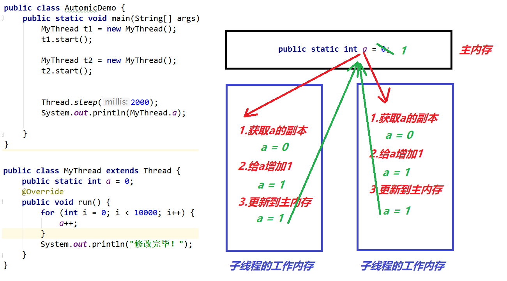

# 	【多线程】
#### 第一章 多线程

##### 	1.1 并行和并发

```java
并行: 两个事件在同一时刻都在执行(同时执行)
并发: 两个事件在同一时间段内都在执行,但是在某个时刻只有一个在执行(交替执行) 
```

##### 	1.2 进程和线程

```java
进程:正在内存中运行的程序,称为进程!!!
线程:一个进程中用于完成某个任务的执行单元!!!    

一个进程中可以有一到多个线程,如果有1个以上的线程,这种进程我们一般称为多线程进程!!    
```

- 进程和线程的一些区别

  ```java
  线程属于进程的!!! 
  
  每个进程拥有独立的内存空间,独立栈独立堆...   
  同一个进程的多个线程, 分别向进程申请独立栈空间,共享进程的堆空间    
  ```

  

- 线程调度

  ```java
  什么是线程调度:
  	是指CPU在多个线程之间进行快速的切换!!!
          
  一个Java进程,至少有3个线程:
  		a.主线程(main为入口哪些代码)
          b.垃圾回收线程(gc线程)
          c.异常线程 
              
  一个Java进程会采用何种线程调度方式:(b)
  	a.分时调度: 每个线程平均分配CPU的执行时间
      b.抢占式调用: 每个线程随机分配CPU的执行时间    
  ```

##### 1.3 Thread类的介绍

```java
a.Thread类是什么?
    它是Java中代表线程的类,创建一个该类对象就相当于创建了一个新的线程
b.Thread类的构造方法
    public Thread(); 创建一个新的线程对象,默认线程名Thread-0,Thread-1,....
    public Thread(String name);创建一个新的线程对象并指定线程的名字
    
    public Thread(Runnable target);创建一个新的线程对象并指定该线程的任务
    public Thread(Runnable target,String name);创建一个新的线程对象并指定该线程的任务和线程的名字
c.Thread类的常用方法   
    public void setName(String name);修改线程的名字
    public String getName();获取线程名字
    
    public void start();开启线程(线程只创建是不会执行的,必须开启后才会执行)
    public void run();这方法是线程的任务方法,我们要把线程需要执行的代码写到该方法中 
    
    public static void sleep(long millis);让当前线程"休眠"millis毫秒
    		这里的"当前线程"是指: Thread.sleep(1000)这句代码所在的线程
    public static Thread currentThread();获取当前线程对象
            这里的"当前线程"是指: Thread.currentThread()这句代码所在的线程      
```

##### 1.4 创建新的线程方式一_继承方式

```java
API描述:
	第一种方式是:
		将类声明为 Thread 的子类。
        该子类应重写 Thread 类的 run 方法。
        接下来可以分配并启动该子类的实例
翻译步骤:
	a.创建一个子类继承Thread
    b.子类中重写run方法(在run方法中写你这个线程要执行的代码)
    c.创建子类对象(实际上就创建了一个新的线程)
    d.开启线程(调用start方法)    

/**
 * a.创建一个子类继承Thread
 */
public class MyThread extends Thread {

    /**
     * b.子类中重写run方法(在run方法中写你这个线程要执行的代码)
     */
    public void run() {
        //线程要执行的任务代码
        //2.循环2
        for (int i = 0; i < 100; i++) {
            System.out.println("吃饭"+i);
        }
    }
}
public class TestThreadDemo {
    public static void main(String[] args) {

        //c.创建子类对象(实际上就创建了一个新的线程)
        MyThread mt = new MyThread();
        // d.开启线程(调用start方法)
        mt.start();

        //1.循环1
        for (int i = 0; i < 100; i++) {
            System.out.println("听歌"+i);
        }
    }
}
执行结果:(一种可能)
吃饭0
吃饭1
吃饭2
听歌0
听歌1
吃饭3
吃饭4
吃饭5
....    

扩展1:
	获取线程名字:
		如果当前线程继承Thread,那么我们可以直接调用getName()获取线程的名字
        如果是主线程,我们调用Thread.currentThread().getName()获取线程的名字[通用方法] 
    设置线程名字:
		我们可以获取对象后调用setName方法
        通过构造方法,在创建线程时指定线程名字,但是构造方法我们要自己添加,因为父类的构造子类无法继承
        public class MyThread extends Thread {
            //构造方法子类无法继承
            public MyThread(){}
            public MyThread(String name){
                super(name);
            }     
        }    
```

##### 1.5 创建新的线程方式二_实现方式

```java
API描述:
	创建线程的第二种方式:
		声明实现 Runnable 接口的类。
        该类然后实现 run 方法。
        然后可以分配该类的实例，
        在创建 Thread 时作为一个参数来传递并启动
翻译步骤:
	a.创建一个实现类实现Runnable接口
    b.重写run方法(写需要执行的任务代码)
    c.创建这个实现类对象(这个对象我们称为任务对象)
    d.创建Thread对象时把任务对象作为参数传入
    e.启动这个Thread对象
        
/**
 * a.创建一个实现类实现Runnable接口
 */
public class MyRunnable implements Runnable {
    /**
     * b.重写run方法(写需要执行的任务代码)
     */
    public void run() {
        for (int i = 0; i < 100; i++) {
            System.out.println(Thread.currentThread().getName()+"吃饭"+i);
        }
    }
}
public class TestThreadDemo {
    public static void main(String[] args) {
        // c.创建这个实现类对象(这个对象我们称为任务对象)
        MyRunnable mr = new MyRunnable();
        //d.d.创建Thread对象时把任务对象作为参数传入
        Thread t = new Thread(mr,"来福");
        //e.启动这个Thread对象
        t.start();
        for (int i = 0; i < 100; i++) {
            System.out.println(Thread.currentThread().getName()+"听歌"+i);
        }
    }
}
执行结果:(一种可能)
来福吃饭0
来福吃饭1
来福吃饭2
main听歌0
main听歌1
来福吃饭3
来福吃饭4
来福吃饭5
....  
```

###### 1.5.1 两种方式的优劣比较

```java
Java强烈建议使用第二种方式,优点:
a.我们的任务可以给多个线程共享
b.实现方式避免了单继承的局限性
c.继承方式线程和任务是紧耦合的,实现方式线程是线程,任务是任务,他们是松耦合,由程序员自由组合
d.线程池中能提交Runnable/Callable形式的任务[多线程第3-4天]    
```

##### 1.6 匿名内部类简化线程创建方式

```java
public class TestThreadDemo {
    public static void main(String[] args) {
        //1.继承方式
        new Thread(){
            @Override
            public void run() {
                for (int i = 0; i < 100; i++) {
                    System.out.println("吃饭"+i);
                }
            }
        }.start();
        //2.实现方式
        new Thread(new Runnable(){
            @Override
            public void run() {
                for (int i = 0; i < 100; i++) {
                    System.out.println("听歌"+i);
                }
            }
        }).start();
        //3.继续写代码
        for (int i = 0; i < 100; i++) {
            System.out.println("看书"+i);
        }
    }
}
```

### 第二章 高并发和线程安全

##### 2.1 高并发及线程安全的介绍

```java
高并发: 是指在某个时间点上，有大量的用户(线程)同时访问同一资源
线程安全:在某个时间点上，当大量用户(线程)访问同一资源时，由于多线程运行机制的原因，
    可能会导致被访问的资源出现"数据污染"的问题    	
```

##### 2.2 多线程的运行机制【内存方面】


##### 2.3 多线程安全性问题-可见性

```java
多个线程拥有独立的栈,但是堆是共享的
我们一般称为独立的栈是线程的工作内存,共享的堆一般称为主内存
结论: 成员变量和共享变量保存主内存的,局部变量保存到工作内存中的    
```


##### 2.4 多线程的安全性问题-有序性


##### 2.5 多线程的安全性问题-原子性


