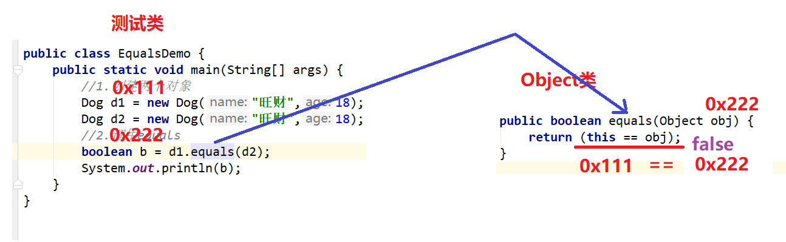

# 【常用API】

##### 反馈和复习

```java
ArrayList<E>类
   构造:
	ArrayList<引用类型> arr = new ArrayList<引用类型>();
   方法:
	增: 
		排队: add(E e); 插队:add(int index,E e);
	删:
		根据元素删除:remove(要删除的元素); 根据索引删除元素: remove(int index);
	改:
		set(int index,E e);
	查:
		size() get(int index);
```

##### 今日内容

```java
1.Object[必须掌握!!]
2.Date[日期类/时间类,必须掌握] 显示时间
3.DateFormat[日期格式化,必须掌握]
========================    
4.Calendar[日历类/时间类,比较重点]
5.Math[数学计算的相关类,重点但是简单]
6,System类[重在理解]    
```

#### 第一章 Object类

##### 1.1 Object类的介绍

```java
java.lang.Object类是所有类的父类,所有对象(包括数组)都有拥有Object类中的方法!
其中我们今天学习两个方法:
	public String toString();
	public boolean equals(Object obj);
```

##### 1.2 toString方法

```java
方法:
	public String toString();返回"该对象"的字符串表示
    a.默认情况下,返回的字符串格式: 包名.类名@该对象的地址值
    b.在开发中,我们经常会重写该方法, 不要返回地址值而要返回对象的属性值(内容)  
    c.注意事项: 其实我们连toString方法都不需要调用,即可得到对象的所有属性值
        因为我们输出对象名时,其实Java会自动调用对象的toString方法
        System.out.println(对象名);
		和
        System.out.println(对象名.toString());
		是等价的
            
 public class Dog {
    private String name;
    private int age;
    //idea重写toString快捷键 alt+insert
    @Override
    public String toString() {
        return "Dog{" +
                "name='" + name + '\'' +
                ", age=" + age +
                '}';
    }
	//省略get/set和构造方法
}

public class ToStringDemo {
    public static void main(String[] args) {
        //1.创建Dog对象
        Dog d1 = new Dog("旺财",18);
        //2.调用toString
        String s1 = d1.toString();
        //com.itheima.demo01_toString.Dog@4554617c
        System.out.println(s1);
        //3.再搞一个对象
        Dog d2 = new Dog("来福",20);
        String s2 = d2.toString();
        //com.itheima.demo01_toString.Dog@74a14482
        System.out.println(s2);
        //4.直接打印对象名
        System.out.println(d1);
        System.out.println(d2);
    }
}
```

##### 1.3 equals方法



```java
方法:
	public boolean equals(Object obj);判断"其他某个对象"是否与"此对象"相等。 
    a.默认情况下,equals方法比较的是两个对象的地址值
    b.在开发中,我们通常也会重写equals方法,不比较两个对象的地址而两个对象的内容(属性)    
        
public class Dog {
    private String name;
    private int age;
    //idea重写equals快捷键 alt+insert
    @Override
    public boolean equals(Object o) {
        if (this == o) return true;
        if (o == null || getClass() != o.getClass()) return false;
        Dog dog = (Dog) o;
        return age == dog.age &&
                Objects.equals(name, dog.name);
    }
    //省略get/set和构造方法
}
    
public class EqualsDemo {
    public static void main(String[] args) {
        //1.创建两个对象
        Dog d1 = new Dog("旺财",18);
        Dog d2 = new Dog("旺财",18);
        //2.调用equals,比较两个对象的内容(因为我们在Dog类中重写了equals方法)
        boolean b = d1.equals(d2);
        System.out.println(b);
    }
}

```

##### 1.4 扩展(equals和==的区别)

```java
对于引用类型:
	== 比较地址值
    equals 默认比较的也是地址值,但是如果重写了比较的是内容 
对于基本类型: 
	== 比较基本类型的值
    equals  没有equals方法!!!
```

##### 1.5 native方法(了解)

```java
没有方法体的方法
    抽象方法和native方法
什么就native方法:
	称为本地方法,由c/c++语言编写的方法
```

##### 1.6 Objects类(了解)

```java
Objects类我们称为工具类,特点其中所有的方法都行静态的
   其中有一个静态方法方法,叫做equals(空指针容忍的比较方法)
    public static boolean equals(Object a, Object b) { 
    	return (a == b) || (a != null && a.equals(b)); 
	}
	其实就是比较a和b,即 a.equals(b)
    这个方法的好处其实就是在于避免空指针异常
```

#### 第二章 Date类

##### 2.1 Date类的介绍

```java
java.util.Date类,代表某个时间点!!
```

##### 2.2 Date类的构造方法

```java
public Date();创建一个日期对象,代表当前的系统时间
public Date(long millis); 创建一个日期对象,代表距离标准时间millis毫秒后的那个时间
    			标准时间是指:
					(英国): 1970-01-01 00:00:00
                    (中国): 1970-01-01 08:00:00    
                        
public class DateDemo01 {
    public static void main(String[] args) {
        //1.无参构造
        Date d1 = new Date();
        System.out.println(d1);//Tue Jun 09 10:44:31 CST 2020
        //2.有参构造
        Date d2 = new Date(1000L);//Thu Jan 01 08:00:01 CST 1970
        System.out.println(d2);
    }
}                    
```

##### 2.3 Date类的常用方法

```java
public long getTime(); 获取当前Date对象距离标准时间的毫秒值
public void setTime(long millis);修改当前Date对象距离标准时间的毫秒值 
    
public class DateDemo02 {
    public static void main(String[] args) {
        //1.创建一个Date对象
        Date now = new Date();
        //2.获取距离标准时间的毫秒值
        long time = now.getTime();
        System.out.println(time);//1591670871090
        System.out.println("============");
        //2.修改距离标准时间的毫秒值
        now.setTime(10000L);
        System.out.println(now);//Thu Jan 01 08:00:10 CST 1970
    }
}
```

#### 第三章 DateFormat类

##### 3.1 DateFormat类的作用

```java
java.text.DateFormat类,用于格式化日期/时间的(抽象类)
我们实际上用的是他的子类: SimpleDateFormat  
    
格式化: 把Date对象 转成一个 字符串的格式
解析: 把字符串格式的时间 转成一个 Date对象
```

##### 3.2 SimpleDateFormat类的构造方法

```java
public SimpleDateFormat(String pattern); 以指定的模式创建一个日期格式化对象
    模式:其实就是我们希望的时间的格式
        	比如: 2020年10月10日 11:11:11 
            模式: yyyy年MM月dd日 HH:mm:ss    
                
public class SimpleDateFormatDemo01 {
    public static void main(String[] args) {
        //1.创建一个SimpleDateFormat对象
        //希望时间是这种格式: 1999-11-11 10点20分30秒
        SimpleDateFormat sdf = new SimpleDateFormat("yyyy-MM-dd HH点mm分ss秒");
        
    }
}                
```

##### 3.3 SimpleDateFormat类的成员方法

```java
格式化:
	public String format(Date date);
解析:
	public Date parse(String time);

public class SimpleDateFormatDemo01 {
    public static void main(String[] args) throws ParseException {
        //1.创建一个SimpleDateFormat对象
        //希望时间是这种格式: 1999-11-11 10点20分30秒
        SimpleDateFormat sdf = new SimpleDateFormat("yyyy-MM-dd HH点mm分ss秒");
        //2.创建一个Date对象,并格式化
        Date now = new Date();
        String format = sdf.format(now);
        System.out.println(format);
        //3.解析
        Date date = sdf.parse("3000-10-10 10点10分10秒");//强调
        System.out.println(date);
    }
}
```

#### 第四章 Calendar类

4.1 Calendar类的介绍

```java
java.util.Calendar类也是代表某个时间点(和Date是一样)
注意:Calendar他是一个抽象类    
```

4.2 Calendar类对象创建

```java
a.找到他的子类GregorianCalendar,创建这个子类对象
b.调用Calendar类的一个静态方法,getInstance,获取到他的子类对象[我们今天就是用这种方式]

/**
 * YEAR=2020,
 * MONTH=5, //常识:在Calendar类中月是0-11 代表我们的1-12
 * DAY_OF_MONTH=9,
 * HOUR_OF_DAY=11,
 * MINUTE=30,
 * SECOND=28
 */
public class CalendarDemo01 {
    public static void main(String[] args) {
        //1.创建一个Calendar的子类对象
        Calendar cc = Calendar.getInstance();
        System.out.println(cc);

    }
}    
```

4.3 Calendar类的常用方法

```java
public int get(int field);根据字段的编号,从日历对象中获取该字段的值
    
public class CalendarDemo01 {
    public static void main(String[] args) {
        //1.创建一个Calendar的子类对象
        Calendar cc = Calendar.getInstance();
        System.out.println(cc);
        //2.获取字段的值
        int year = cc.get(Calendar.YEAR);
        System.out.println(year);

        int month = cc.get(Calendar.MONTH);
        System.out.println(month);

        int day = cc.get(Calendar.DAY_OF_MONTH);
        System.out.println(day);

        int week = cc.get(Calendar.DAY_OF_WEEK);
        String w = weekToChinese(week);
        System.out.println(w);
        //我们的星期和外国人的星期不一样
        //中国 1 2 3 4 5 6 7
        //外国 2 3 4 5 6 7 1

    }
    //把外国人的星期几 变成中国人的星期几,并且返回中文字符串
    public static String weekToChinese(int week){
        String[] weeks = {"星期天","星期1","星期2","星期3","星期4","星期5","星期六"};
        String w = weeks[week - 1];
        return w;
    }
}
    
public void add(int field,int value);根据字段的编号,给日历对象中某个字段增加/减少值
    
public class CalendarDemo02 {
    public static void main(String[] args) {
        //1.创建一个Calendar的子类对象
        Calendar cc = Calendar.getInstance();
        System.out.println(cc);
        //2.增强字段的值
        cc.add(Calendar.YEAR,10);
        cc.add(Calendar.MONTH,2);
        cc.add(Calendar.DAY_OF_MONTH,3);

        //3.获取字段的值
        int year = cc.get(Calendar.YEAR);
        System.out.println(year);

        int month = cc.get(Calendar.MONTH);
        System.out.println(month);

        int day = cc.get(Calendar.DAY_OF_MONTH);
        System.out.println(day);

        int week = cc.get(Calendar.DAY_OF_WEEK);
        String w = weekToChinese(week);
        System.out.println(w);
        //我们的星期和外国人的星期不一样
        //中国 1 2 3 4 5 6 7
        //外国 2 3 4 5 6 7 1

    }
    //把外国人的星期几 变成中国人的星期几,并且返回中文字符串
    public static String weekToChinese(int week){
        String[] weeks = {"星期天","星期1","星期2","星期3","星期4","星期5","星期六"};
        String w = weeks[week - 1];
        return w;
    }
}

public void set(int field,int value);根据字段的编号,给日历对象中某个字段修改值

public class CalendarDemo03 {
    public static void main(String[] args) {
        //1.创建一个Calendar的子类对象
        Calendar cc = Calendar.getInstance();
        System.out.println(cc);
        //2.修改字段的值
        cc.set(Calendar.YEAR,2000);
        cc.set(Calendar.MONTH,2);
        cc.set(Calendar.DAY_OF_MONTH,3);

        //3.获取字段的值
        int year = cc.get(Calendar.YEAR);
        System.out.println(year);

        int month = cc.get(Calendar.MONTH);
        System.out.println(month);

        int day = cc.get(Calendar.DAY_OF_MONTH);
        System.out.println(day);

        int week = cc.get(Calendar.DAY_OF_WEEK);
        String w = weekToChinese(week);
        System.out.println(w);
        //我们的星期和外国人的星期不一样
        //中国 1 2 3 4 5 6 7
        //外国 2 3 4 5 6 7 1

    }
    //把外国人的星期几 变成中国人的星期几,并且返回中文字符串
    public static String weekToChinese(int week){
        String[] weeks = {"星期天","星期1","星期2","星期3","星期4","星期5","星期六"};
        String w = weeks[week - 1];
        return w;
    }
}
 
其他方法:
	public boolean after(Calendar when);判断当前时间是否在指定的时间之后
	public boolean before(Calendar when);判断当前时间是否在指定的时间之前
```

#### 第五章 Math类

```java
Math称为数学工具类,其中包含了很多和数学相关的静态方法
    
public static int abs(int num);//求绝对值(正数的绝对值就是本身,负数的绝对值把负号去掉)
public static double ceil(double d);// 向上取整(进1法)
public static double floor(double d);// 向下取整(去尾法)
public static double pow(double d1,double d2);//求次方(求d1的d2次方)
public static long round(double d);//四舍五入

public class MathDemo {
    public static void main(String[] args) {
        //1.绝对值
        int abs1 = Math.abs(123);
        System.out.println(abs1);
        int abs2 = Math.abs(-111);
        System.out.println(abs2);
        //2.向上/下取整
        double ceil = Math.ceil(3.001); //向上取整
        double floor = Math.floor(3.998);//向下取整
        System.out.println(ceil);
        System.out.println(floor);
        //3.求次方
        double pow = Math.pow(3, 4);//3的4次方 3*3*3*3
        System.out.println(pow); //81.0
        //4.四舍五入
        long round1 = Math.round(3.567);
        long round2 = Math.round(4.432);
        System.out.println(round1); //4
        System.out.println(round2); //4
        
        //面试题(有兴趣研究一下)
        double ceil1 = Math.ceil(-3.55);
        double floor1 = Math.floor(-2.78);
        System.out.println(ceil1); // -3.0
        System.out.println(floor1); // -3.0

        double pow1 = Math.pow(2, -4);
        System.out.println(pow1); // 1/16

        double pow2 = Math.pow(4, 0.5);
        System.out.println(pow2); //2
    }
}

```

#### 第六章 System

```java
java.lang.System类,包含一些静态方法,并且她不能创建对象
  
public static void exit(int status); //让JVM结束,参数写0.表示正常终止

public class SystemDemo {
    public static void main(String[] args) {
        //1.创建System对象,报错,因为System的构造方法私有了
//        System s = new System();
        //2.exit方法
        method();
        System.out.println(".........");
    }
    public static void method(){
        for (int i = 0; i < 10; i++) {
            System.out.println(i);
            if (i == 5) {
//                System.exit(0);//终止JVM
//                break; //结束当前循环
//                return; //结束当前方法
            }
        }
    }
} 

public static long currentTimeMillis(); 获取当前时间距离标准的毫秒值
    
public class SystemDemo02 {
    public static void main(String[] args) {
        //1.获取当前时间距离标准时间的毫秒值
        long start = System.currentTimeMillis();
        //求1-10000
        int sum = 0;
        for (int i = 1; i < 10001; i++) {
            sum+=i;
        }
        long end = System.currentTimeMillis();
        System.out.println("一共耗时:"+(end-start)+"毫秒");
    }
}

public static void arraycopy(源数组,起始索引,目标数组,起始索引,复制的个数);

public class SystemDemo03 {
    public static void main(String[] args) {
        //数组复制
//        System.arraycopy(源数组,起始索引,目标数组,起始索引,复制的个数);
        int[] nums1 = {11,22,33,44,55,66,77,88,99};
        int[] nums2 = new int[9];

        //复制数组
        System.arraycopy(nums1,2,nums2,1,5);

        for (int i = 0; i < nums2.length; i++) {
            System.out.print(nums2[i]+" ");
        }

    }
}
```

##### 总结

```java
能够说出Object类的特点
    所有类的父类,所有对象都拥有该类中方法
能够重写Object类的toString方法
    该方法的作用:获取当前对象的字符串表示
        a.默认情况下,字符串的格式:包名.类名@该对象的地址值
        b.我们一般会重写toString,返回的字符串是该对象的属性值(alt+insert-->toString)
        c.我们实际上连toString方法也不需要调用,直接打印对象名即可!    
            
能够重写Object类的equals方法
     该方法的作用:比较当前对象和指定对象是否相等
         a.默认情况下比较两个对象的地址值
         b.我们一般也会重写equals,比较两个对象的属性值(alt+insert-->equals and hashCode)
         

能够使用日期类输出当前日期
    Date now = new Date(); //当前日期   
	SimpleDateFormat sdf = new SimpleDateFormat("yyyy年MM月dd日 HH时mm分ss秒");
能够使用将日期格式化为字符串的方法
    String time = sdf.format(Date对象);
能够使用将字符串转换成日期的方法
    Date date = sdf.parse("3000年10月10日 10时10分10秒")
         
=====================以上API重点掌握====================         
=====================以下API理解即可====================          
能够使用Calendar类的get、set、add方法计算日期
    a.获取Calendar的子类对象
    	Calendar cc = Calendar.getInstance();
	b.对时间进行增加/减少/修改/查询
        cc.get(Calendar.YEAR);
		cc.add(Calendar.YEAR,int value);
		cc.set(Calendar.YEAR,int value);
能够使用Math类对某个浮点数进行四舍五入取整
    Math的常用静态方法;
		abs,ceil,floor,pow,round
能够使用System类获取当前系统毫秒值
     System的常用静态方法;
		currentTimeMillis 获取当前时间的毫秒值
        exit(0) 结束JVM
        arraycopy(源,起始,目标,起始,个数)    
```

