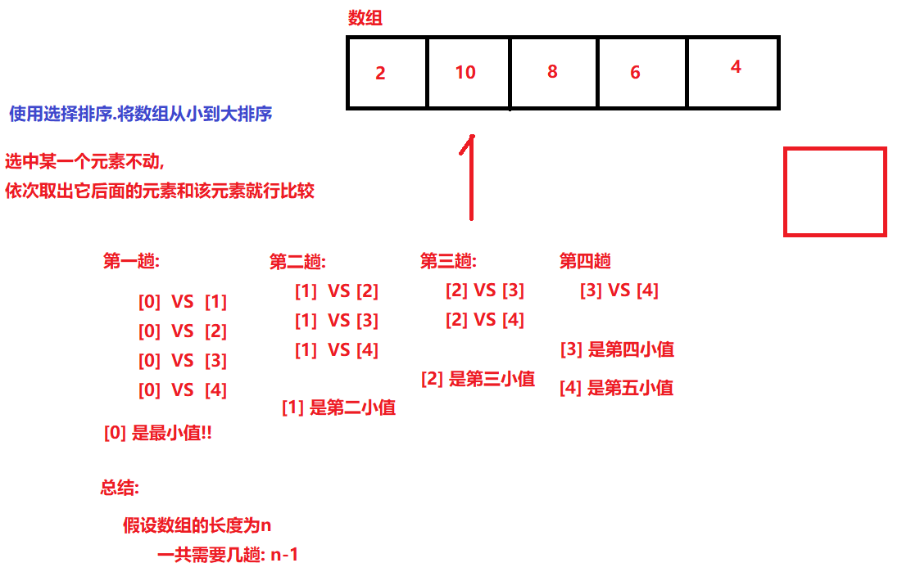
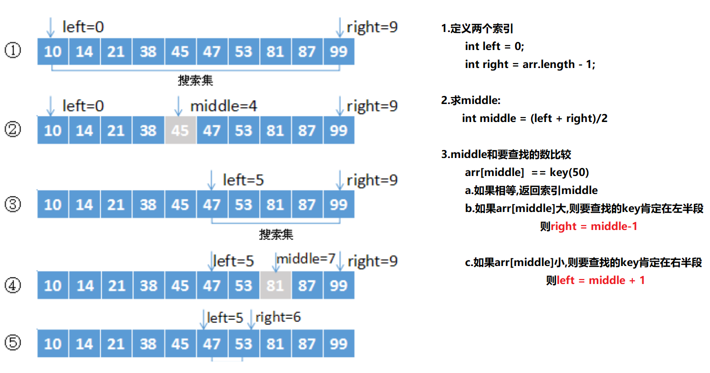
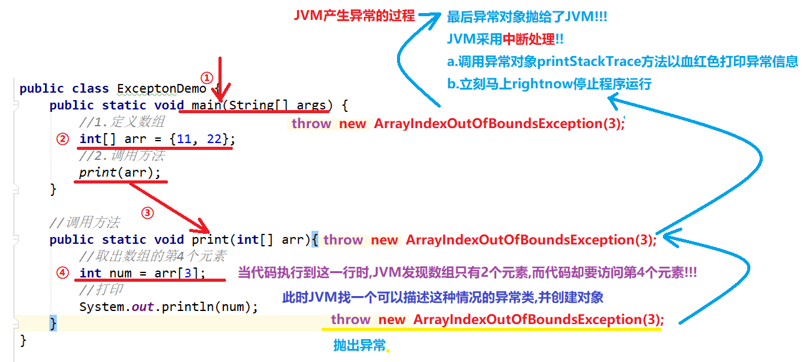

# 【排序算法、异常】

##### 昨天反馈

```java
1.上课听的没问题,不太熟练,多练习
回顾:
1.Map双列集合
    根接口:Map
        实现类:
		HashMap: 无序
        LinkedHashMap: 有序
        TreeMap: 无序(会按照键的自然升序排序)  
    共性方法:
		put(K 键,V 值); //当键在Map中不存在时
		put(K 键,V 值); //当键在Map中已存在时
		remove(键);//删除
		get(键);//以键找值

		size();
		containsKey(键);
		containsValue(值);

2.Map遍历:
		以键找值: keySet()
        键值对:  entrySet();  

3.综合练习
4.斗地主案例
5.冒泡排序
    依次从头到尾比较相邻的两个元素,如果前面>后面元素,交换两个元素值
    假设数组的长度为length
    一共需要比较多少趟: length - 1
    第一趟需要比较多少次: length - 1 - 0
    第二趟需要比较多少次: length - 1 - 1
    第三趟需要比较多少次: length - 1 - 2  
    ...
    //控制需要几趟    
    for(int i = 0; i < length - 1;i++){
        //控制需要几次
        for(int j = 0;j < length - 1 - i){
            //比较
            if(arr[j] > arr[j+1]){
                int temp = arr[j+1];
                arr[j+1] = arr[j];
                arr[j] = temp;
            }
        }
    }
	//打印数组
```

##### 今日内容

```java
1.选择排序[理解]
2.二分查找[理解]
3.异常(要么throws,要么trycatch)[重点]    
```

### 第一章 选择排序

##### 1.1 选择排序介绍

```java
选中某一个元素不动,依次取出它后面的元素和该元素就行比较,大的元素交换到后面,小的元素交换到前面!!
```

##### 1.2 选择排序图解



##### 1.3 选择排序代码实现

```java
public class SelectionSortDemo {
    public static void main(String[] args) {
        //选择排序中,如果数组的长度是length,一共需要length-1趟
        int[] arr = {34,576,344,64,645,347,657,34,6547,2345};
        //外层循环控制选中的索引
        for(int i = 0;i < arr.length - 1;i++){
            //内层循环控制和选中元素比较的元素
            for(int j = i+1;j < arr.length;j++){
                //比较
                if(arr[i] > arr[j]){
                    int temp = arr[i];
                    arr[i] =  arr[j];
                    arr[j] = temp;
                }
            }
        }
        //打印结果
        System.out.println(Arrays.toString(arr));
    }
}
```

### 第二章 二分查找

##### 2.1 普通查找和二分查找

```java
普通查找: 在一个数组中查找指定元素出现的索引, 如果找到了返回该索引,如果找不到返回-1
   
二分查找:
	前提: 这个数组必须是排好序的(从大到小或者从小到大)       
```

##### 2.2 二分查找图解



##### 2.3 二分查找代码实现

```java
public class BinarySearchDemo {
    public static void main(String[] args) {
        //1.创建一个数组
        int[] arr = {2,5,8,10,15,19,22,30,67,89,100};
        //2.调用方法
        System.out.println(binarySearch(arr, 50));
    }

    public static int binarySearch(int[] arr,int key){
        //2.定义两个索引
        int left = 0;
        int right = arr.length - 1;

        while (left <= right) {
            //3.求中间索引
            int middle = (left + right) / 2;
            //4.取出中间索引和要查找的有元素比较
            if (arr[middle] == key) {
                //找到了
                return middle;
            } else if (arr[middle] > key) {
                //中间值:arr[middle]大,则我们查找middle左半段
                right = middle - 1;
            } else {
                //中间值:arr[middle]小,则我们查找middle右半段
                left = middle + 1;
            }
        }
        //如果left都大于right都没有找到元素,说明没有该元素
        return -1;
    }
}
```

### 第三章 异常【重点】

##### 	3.1 什么是异常

```java
所谓的异常就是程序在编译过程中或者运行过程中出现的问题!! 
```

##### 	3.2 异常的继承体系

```java
根类:Throwable
    子类: Exception(异常类) 一般是程序编写不当造成的
	子类: Error(错误类) 一般是由系统引起/硬件问题
```

##### 	3.3 异常类中常用的三个方法

```java
public void printStackTrace();打印当前异常对象的详细信息(异常的类型,异常的原因,异常的位置)[只用这个]
public String getMessage(); 获取异常的部分信息(异常的原因) 
public String toString(); 获取异常的类型和异常描述信息   
```

##### 	3.4 异常的分类

- 编译时异常

  ```java
  在编译时期报错了,提示可能有异常!
  Exception以及其子类(RuntimeException除外)都属于编译时异常   
  比如: SimpleDateFormat的parse方法    
  ```


- 运行时异常

  ```java
  在编译时期不报错,运行时期才出现异常!
  RuntimeException以及其子类都属于运行时异常    
  比如: 空指针异常,数组越界异常,类型转换异常    
  ```

##### 3.5 JVM异常产生过程(画图演示)【理解】




### 第四章 异常处理【理解】

##### Java中异常相关的五个关键字

```java
throw,throws,try,catch,finally
```

##### 	4.1 抛出异常throw

```java
a.throw是什么?
    throw是一个关键字
b.什么时候使用到throw
    当我们需要抛出一个异常对象时,我们可以使用throw就行抛出操作
c.使用格式
    throw new XxxException();
	或者
	XxxException xe = new XxxException();
	throw xe;
d.案例演示   
    public class ThrowDemo {
        public static void main(String[] args) {
            int[] arr = {11,22};
            show(arr);
        }
        public static void show(int[] arr){
            //1.判断arr是否为null
            if (arr == null) {
                throw new NullPointerException("哥们数组不能为null");
            }
            //2.判断arr是否长度大于2
            if (arr.length < 3){
                throw new ArrayIndexOutOfBoundsException("哥们数组长度不太够...");
            }
            //对数组进行模型操作....
            int num = arr[2];
            System.out.println(num);
        }
    }
```

##### 	4.2 Objects中非空判断方法

```java
非空判断方法(空指针容忍方法)
public static <T> T requireNonNull(T obj) {
    if (obj == null)
        throw new NullPointerException();
    return obj;
}
```

##### 4.4 遇到异常的2种处理方式【重点掌握】

###### 4.4.1 throws声明抛出异常

```java
a.声明异常的格式
    throws给方法做声明用的,表示该方法内部可能抛出某种异常,要求该方法的调用者必须处理这种异常
    格式:
	public 返回值类型 方法名(参数列表)throws XxxException,OooException{
     	//方法体   
    }
b.案例演示
    public class ThrowsDemo {
        public static void main(String[] args) throws FileNotFoundException {
            //调用方法
            readFile("1.txt");
        }
        //定义一个方法.读取某个文件
        public static void readFile(String filename) throws FileNotFoundException {
            //假设:硬盘只有一个文件叫做1.txt
            if ("1.txt".equals(filename)) {
                System.out.println("读取文件成功...");
            }else{
                //抛出异常
                throw new FileNotFoundException("您要的文件"+filename+"没有找到..");
            }
        }
    }
```

###### 4.4.2 try..catch捕获异常【重点掌握】

```java
a.捕获异常的格式
    try{
        可能出现异常的代码
    }catch(XxxException e){
        e.printStackTrace();
    }
b.案例演示    
    public class TryCatchDemo {
        public static void main(String[] args){
            //调用方法
            try {
                readFile("11.txt");
            }catch (FileNotFoundException e){
                e.printStackTrace();
            }
            System.out.println("程序继续执行..");
        }
        //定义一个方法.读取某个文件
        public static void readFile(String filename) throws FileNotFoundException {
            //假设:硬盘只有一个文件叫做1.txt
            if ("1.txt".equals(filename)) {
                System.out.println("读取文件成功...");
            }else{
                //抛出异常
                throw new FileNotFoundException("您要的文件"+filename+"没有找到..");
            }
        }
    }

c.捕获到异常之后,如何查看异常的信息  
    都用异常对象的printStackTrace方法即可
```

##### 	4.5 finally代码块【理解,IO流时使用】

```java
a.finally代码块的格式
	try{
        可能有异常的代码
    }catch(XxxException e){
     	e.printStackTrace()   
    }finally{
        
    }
b.finally代码块的作用
    finally中写一定要执行的代码,释放资源相关的代码
    
c.案例演示    
   public class FinallyDemo {
        public static void main(String[] args){
            //调用方法
            try {
                readFile("11.txt");
            }catch (FileNotFoundException e){
                e.printStackTrace();
            }finally {
                System.out.println("这里我要释放资源...");
            }
        }
        //定义一个方法.读取某个文件
        public static void readFile(String filename) throws FileNotFoundException {
            //假设:硬盘只有一个文件叫做1.txt
            if ("1.txt".equals(filename)) {
                System.out.println("读取文件成功...");
            }else{
                //抛出异常
                throw new FileNotFoundException("您要的文件"+filename+"没有找到..");
            }
        }
    }
```

##### 7.异常的注意事项【理解】

```java
a.运行时异常被抛出可以不处理。即不捕获也不声明抛出。[非常重要!!]
b.如果父类的方法声明抛出了多个异常,子类覆盖(重写)父类方法时,只能声明抛出相同的异常或者是他的子集。
c.如果父类的方法没有声明抛出异常,子类覆盖(重写)父类方法时,也不能声明抛出异常(多线程中就会用到)
d.多个异常我们如何捕获处理??[非常重要!!]
    	代码1; //声明抛出OneException 
		代码2; //声明抛出TwoException
		代码3; //声明抛出ThreeException
i.分开捕获分开处理
    	try{
           代码1; //声明抛出OneException 
        }catch(OneException e){
         	e.printStackTrace();   
        }
		try{
           代码2; //声明抛出TwoException
        }catch(TwoException e){
         	e.printStackTrace();   
        }
		try{
           代码3; //声明抛出ThreeException
        }catch(ThreeException e){
         	e.printStackTrace();   
        }
ii.一起捕获,分开处理
    	try{
            代码1; //声明抛出OneException  extends TwoException 
			代码2; //声明抛出TwoException
			代码3; //声明抛出ThreeException
        }catch(OneException e){
         	e.printStackTrace();   
        }catch(TwoException e){
         	e.printStackTrace();   
        }catch(ThreeException e){
         	e.printStackTrace();   
        }

iii.一起获取一起处理[最常用的!!]
    	try{
            代码1; //声明抛出OneException 
			代码2; //声明抛出TwoException
			代码3; //声明抛出ThreeException
        }catch(Exception e){
         	e.printStackTrace();   
        }

e.当选择ii中处理多个异常时,如果这些异常有子父类关系,那么必须先处理子类异常,再父类异常
f.在try/catch后可以追加finally代码块，其中的代码一定会被执行，通常用于资源回收(IO流的关系,网络连接关闭)  
```

### 第五章 自定义异常[理解]

##### 	1.为什么要定义异常

```java
虽然Java中有很多很多异常类,但是不可能可以描述开发中所有可能出现的异常情况,这使用我们需要自定义异常类!
```

##### 	2.自定义异常的步骤

```java
a.创建一个类,类名必须叫XxxException
b.继承Exception或者RuntimeException    
c.必须提供至少两个构造: 无参构造+带有String异常信息的构造   
    
/**
 * 自定义异常
 */
public class MyException extends /*Exception*/RuntimeException {
    /**
     * 无参构造
     */
    public MyException() {
    }
    /**
     * 带有异常信息的构造
     * @param message 异常信息
     */
    public MyException(String message) {
        super(message);
    }
}    
```

##### 	3.自定义异常的练习(代码演示)

```java
要求：我们模拟注册操作，如果用户名已存在，则抛出异常并提示：亲，该用户名已经被注册。
    
/**
 * 注册异常:用来描述用户名已经存在这种情况的异常   
 */
public class RegisterException extends Exception{
    public RegisterException() {
    }
    public RegisterException(String message) {
        super(message);
    }
}
 
public class TestDemo {
    public static void main(String[] args) {
        //1.提示
        System.out.println("请输入您注册的用户名:");
        String name = new Scanner(System.in).nextLine();
        //2.调用方法
        try {
            register(name);
        } catch (RegisterException e) {
            e.printStackTrace();
        }
    }
    //定义方法,用户注册
    public static void register(String username) throws RegisterException{
        //假设"rose"已经被注册
        if ("rose".equals(username)) {
            throw new RegisterException("您要注册的"+username+"已经存在...");
        }else{
            System.out.println("恭喜您"+username+"注册成功~~");
        }
    }
}
```

##### 总结

```java
能够理解选择排序的执行原理[理解]
能够理解二分查找的执行原理[理解]
======================
能够辨别程序中异常和错误的区别[理解]     
===================================     
说出异常的分类[掌握]
    Throwable
    	Error
    	Exception
    		编译时异常: Exception以及其子类(RuntimeException除外)
    		运行时异常: RuntimeException以及其子类
列举出常见的三个运行期异常
    空指针异常,数组越界异常,类型转换异常, 并发修改异常, NoSuchElementException        
===================================    
    写代码过程中,如果没有遇到异常或者遇到运行时异常,编译时期都不要管他们   
               只有遇到编译时异常了,要么throws,要么trycatch 
能够使用try...catch关键字处理异常[重点]
能够使用throws关键字处理异常[重点]
===================================                 
能够自定义并使用异常类[理解]
```

