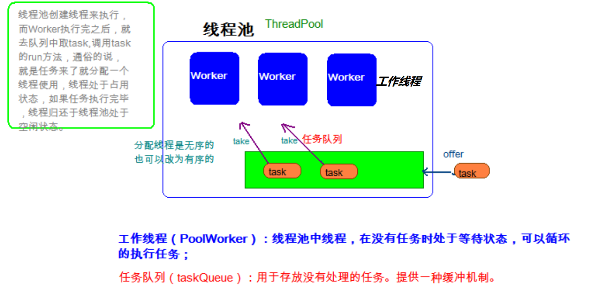
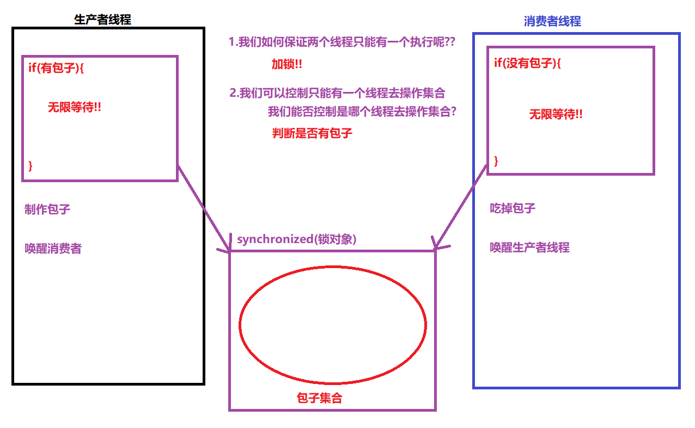

# 	【线程池、死锁、线程状态、等待与唤醒】

反馈和回顾

```java
反馈:
	不要老是CV
回顾:
	1.保证多句代码的原子性方案:
	同步代码块:
		synchronized(任意对象){//但是多个线程使用同一个对象
            
        }
	同步方法:
		public synchronized void 方法名(){
            
        }
	Lock锁:
		Lock lock = new ReentrantLock();
		lock.lock();
			执行同步代码
        lock.unlock();        
	2.并发包下的类
        CopyOnWriteArrayList --> ArrayList
        CopyOnWriteArraySet --> HashSet
        ConcurrentHashMap --> HashMap
        CountDownLatch --> 让某个线程等待另外线程执行完毕
        CyclicBarrier --> 让一组线程到达某个点后,才继续执行某个任务
        Semaphore --> 控制线程并发的最大数量
        Exchanger --> 用于线程间数据交互      
```

##### 今天内容

```java
1.线程池(重点)
2.死锁(了解)
3.线程状态(非常重点),一共有6种状态(熟悉各种状态之间的转换)
    等待唤醒机制(非常重点)
4,定时器(闹钟)(理解,Java界面开发用的很多,Java服务器开发用的甚少) 
```

### 第一章 线程池

##### 5.1 线程池的思想

```java
我们平时使用线程时,都现场创建,执行任务,执行完毕之后销毁线程,这样的大量时间浪费在线程的创建和销毁上了!!
我们提出了一种方式: 创建线程,执行任务之后不销毁,继续使用这个线程执行下一个任务,这就是线程池的思想!
```

##### 5.2 线程池介绍



##### 5.3 线程池的使用[掌握]

```java
线程池的顶层接口: java.util.concurrent.Executor
线程池的子接口:   java.util.concurrent.ExecutorService   
线程池的工具类:   java.util.concurrent.Executors
    其中有一个静态方法,用于创建线程池的实现类对象:
	public static ExecutorService newFixedThreadPool(int nThreads);
										创建一个具有指定线程数量的线程池对象	
ExecutorService线程池接口中定义了一个提交任务的方法:
	public Future<?> submit(Runnable r);向当前的线程池中提交某个"无返回值"任务
    public Future<T> submit(Callable<T> r);向当前的线程池中提交某个"有返回值"任务    
```

##### 5.4 线程池的练习

```java
public class TestDemo {
    public static void main(String[] args) throws ExecutionException, InterruptedException {
        //1.获取一个线程池对象
        ExecutorService service =
                Executors.newFixedThreadPool(3);
        //2.提交无返回值任务
        for (int i = 0; i < 10; i++) {
            service.submit(new Runnable() {
                @Override
                public void run() {
                    System.out.println(Thread.currentThread().getName()+"执行了...");
                }
            });
        }
        //3.提交有返回值任务
        //a.submit方法提交任务后,立即返回Future
        System.out.println("开始提交任务....");
        Future<Integer> future = service.submit(new Callable<Integer>(){
            @Override
            public Integer call() throws InterruptedException {
                //计算1+2....100的和
                int sum = 0;
                for (int i = 1; i < 101; i++) {
                    Thread.sleep(30);
                    sum+=i;
                }
                return sum;
            }
        });
        System.out.println("任务提交完毕.....");
        //b.调用get方法时,如果任务没有执行完毕,该方法会阻塞(等待)
        //直到任务执行完毕,才能获取任务的结果
        System.out.println("开始获取结果:=....");
        Integer result = future.get();
        System.out.println("结果是:"+result);
    }
}
```

### 第二章 死锁

##### 6.1 什么是死锁

```java
两个线程,两个锁对象
    线程A获取锁对象1,线程B获取锁对象2,
	线程A还需要锁对象2,才能执行
    线程B还需要锁对象1,才能执行
线程A和B就相互等待对象释放锁对象,这种情况称为死锁!        
```

##### 6.2 产生死锁的条件

```java
a.至少有两个线程
b.至少有两个锁对象
c.需要反向嵌套获取锁对象    
```

##### 6.3 死锁演示

```java
public class DeadLockDemo {
    public static void main(String[] args) {
        //1.两个锁对象
        Object obj1 = new Object();
        Object obj2 = new Object();
        //2.两个线程
        //线程A
        new Thread(new Runnable() {
            @Override
            public void run() {
                //3.需要反向嵌套获取锁对象
                synchronized (obj1) {
                    System.out.println("线程A获取锁对象1,还需要获取锁对象2....");
                    try {
                        Thread.sleep(20);
                    } catch (InterruptedException e) {
                        e.printStackTrace();
                    }
                    synchronized (obj2) {
                        System.out.println("线程A的任务执行了...");
                    }
                }
            }
        }).start();

        //线程B
        new Thread(new Runnable() {
            @Override
            public void run() {
                //3.需要反向嵌套获取锁对象
                synchronized (obj2) {
                    System.out.println("线程B获取锁对象2,还需要获取锁对象1....");
                    try {
                        Thread.sleep(20);
                    } catch (InterruptedException e) {
                        e.printStackTrace();
                    }
                    synchronized (obj1) {
                        System.out.println("线程B的任务执行了...");
                    }
                }
            }
        }).start();

    }
}
注意:死锁只能进行避免,一旦出现死锁无法解决!!
```

### 第三章 线程的状态(必须掌握)

##### 1.线程的六种状态

- 新建状态(New)

  ```java
  刚刚创建的并且未调用start方法的线程
  ```

- 可运行状态(Runnable)

  ```java
  只有新建状态下的线程才能调用start方法,然后线程由新建状态进入可运行状态
  ```

- 锁阻塞状态(Blocked)

  ```java
  当前线程运行到需要锁对象时,当前锁对象已经被其他线程持有,那么当前线程进入锁阻塞状态!
  ```

- 限时等待状态(Timed_waiting)

  ```java
  当前线程执行到Thread.sleep(毫秒)时,当前线程进入限时等待状态!
  ```

- 无限等待状态(Waiting)
  - 线程如何进入Waiting(无线等待状态)
  
    ```java
    1.该线程首先要持有锁对象
    2.调用锁对象的wait方法
    3.该线程会自动释放锁对象,然后进入无限等待状态 
    ```
  
  - 其他线程如何唤醒Waiting状态的线程
  
    ```java
    1.其他线程首先也要持有锁对象
    2.调用锁对象的notify方法 
    3.被唤醒的线程进入锁阻塞状态,直到其他线程释放锁对象,被唤醒线程再次抢到对象才能进入可运行状态     
    ```
  
- 消亡状态(Terminated)

  ```java
  当前线程的任务执行完毕,线程默认进入总结状态
  ```

### 第四章 等待唤醒机制

##### 1.等待唤醒机制(Wait和Notify)

```java
public class TestDemo01 {
    public static void main(String[] args) throws InterruptedException {
        //1.让线程进入无限等待
        //锁对象
        Object obj = new Object();
        //线程1
        new Thread(new Runnable() {
            @Override
            public void run() {
                //1.抢到锁
                synchronized (obj) {
                    System.out.println("线程1抢到锁对象了,准备进入无限等待....");
                    //2.调用锁对象的wait方法
                    try {
                        obj.wait();//3.自动释放obj锁对象
                    } catch (InterruptedException e) {
                        e.printStackTrace();
                    }
                    System.out.println("线程1继续执行...");
                }
            }
        }).start();


        //线程2
        new Thread(new Runnable() {
            @Override
            public void run() {
                //1.抢到锁
                synchronized (obj) {
                    System.out.println("线程2也抢到锁对象了,准备进入无限等待....");
                    //2.调用锁对象的wait方法
                    try {
                        obj.wait();//3.自动释放obj锁对象
                    } catch (InterruptedException e) {
                        e.printStackTrace();
                    }
                    System.out.println("线程2继续执行...");
                }
            }
        }).start();

        //这个循环目的就是为了线程1先执行,抢到锁对象进入无限等待
        for (int i = 0; i < 10; i++) {
            Thread.sleep(500);
            System.out.println(i);
        }

        //线程3
        new Thread(new Runnable() {
            @Override
            public void run() {
                //1.持有锁,并且必须也是obj
                synchronized (obj) {
                    System.out.println("线程3抢到锁对象了,准备唤醒线程...");
                    //2.调用锁对象的notify方法
                    obj.notify(); //但是锁对象并没有释放
                    //以下代码必须使用完毕,释放锁对象,线程1才能再次持有锁对象,才能往下执行
//                    for (int i = 0; i < 100; i++) {
//                        System.out.println("线程3..."+i);
//                    }
                }
            }
        }).start();
    }
}
```

##### 2.生产者与消费者问题(代码演示)

```java
创建两个线程,生产者线程负责做包子,消费者线程负责吃包子,要求两个线程交替执行
public class TestDemo {
    public static void main(String[] args) {
        //1.集合
        ArrayList<String> arr = new ArrayList<String>();
        arr.add("猪肉大葱包子");
        Object obj = new Object();
        //2.创建两个线程
        //生产者线程
        new Thread(new Runnable() {
            @Override
            public void run() {
                while (true){
                    synchronized (obj){
                        //判断
                        if (arr.size() == 1) {
                            //有包子,那么生产者线程无限等待
                            try {
                                obj.wait();
                            } catch (InterruptedException e) {
                                e.printStackTrace();
                            }
                        }
                        //没有包子,做包子
                        arr.add("牛肉大葱包子");
                        System.out.println("吃货,包子做好了....");

                        //唤醒消费者
                        obj.notify();
                    }
                }
            }
        }).start();

        //消费者线程
        new Thread(new Runnable() {
            @Override
            public void run() {
                while (true){
                    synchronized (obj){
                        //判断
                        if (arr.size() == 0) {
                            //如果没有包子
                            try {
                                obj.wait();
                            } catch (InterruptedException e) {
                                e.printStackTrace();
                            }
                        }
                        //如果有包子,吃包子
                        String remove = arr.remove(0);
                        System.out.println("你做的"+remove+"真好吃...");

                        //唤醒生产者线程
                        obj.notify();
                    }
                }
            }
        }).start();
    }
}       
```



### 第五章 定时器

##### 5.1 什么是定时器

```java
我们可以想象为闹钟,在指定的时间做指定的事情!!
```

##### 5.2 定时器Timer的使用

- 构造方法

  ```java
  public Timer()：构造一个定时器
  ```

- 成员方法

  ```java
  public void schedule(TimerTask task,Date time);
  public void schedule(TimerTask task,long millis);
  
  public void schedule(TimerTask task,Date time,long period);
  public void schedule(TimerTask task,long millis,long period);
  ```

- 案例演示

```java
public class TestTimerDemo {
    public static void main(String[] args) {
        //1.创建定时器
        Timer timer = new Timer();
        //2.布置任务
        //一次性定时器
        timer.schedule(new TimerTask() {
            @Override
            public void run() {
                System.out.println("时间到了下课...");
            }
        },5000);

        Calendar cc = Calendar.getInstance();
        cc.add(Calendar.SECOND,5);
        Date time = cc.getTime();
        timer.schedule(new TimerTask() {
            @Override
            public void run() {
                System.out.println("时间到了下课...");
            }
        },time);

        //周期定时器
        timer.schedule(new TimerTask() {
            @Override
            public void run() {
                System.out.println("时间到了下课...");
            }
        },5000,2000);

        Calendar cc1 = Calendar.getInstance();
        cc1.add(Calendar.SECOND,5);
        Date time1 = cc1.getTime();
        timer.schedule(new TimerTask() {
            @Override
            public void run() {
                System.out.println("时间到了下课...");
            }
        },time1,1000);
    }
}

```

##### 总结

```java
能够描述Java中线程池运行原理
    重复利用线程池中的某个线程,从而减少频繁创建和销毁线程消耗的性能
能够描述死锁产生的原因
    a.2个锁2个线程
    b.线程A获取锁1等待锁2,线程B获取锁2等待锁1
能够说出线程6个状态的名称(描述他们的相互转换)
    新建New,可运行Runnable,终结Terminated,锁阻塞Block,休眠TIMEDWAITING,无限等待WAITING
    
    作业:能够说出线程6个状态的名称(描述他们的相互转换)
        用文字把你的答案描述一遍
能够理解等待唤醒案例(2个案例必须搞懂)
        
```

