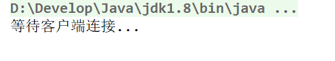
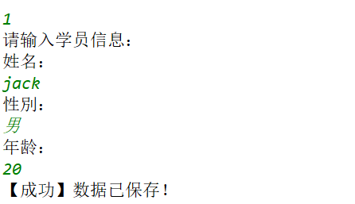

# 综合案例-学员管理系统【C/S版】

##### 反馈复习

```java
1.每天知识点是分散,希望每天搞一套题
复习:
1.枚举
    格式:
	public enum Sex{
     	BOY,GIRL;   
    }
	使用:
	Sex s = Sex.BOY;
	
	本质:
	public final class Sex extends java.lang.Enum<Sex>{
     	public static final Sex BOY = new Sex();
        public static final Sex GIRL = new Sex();
    }
2.JDK8的新特性
    Lambda,StreamAPI,默认方法
    方法引用:
		对象名::成员方法, System.out::println
        类名::静态方法    
	Base64编码(了解)
3.正则表达式  
    作用: 正则表达式是一个字符串,代表某种规则的字符串 
    具体规则:
		字符类: [a-z] [0-9] [m-px-y] [ace]
        逻辑运算符类: && |  [^abc]
        数量词: ? * + {n} {n,} {n,m}
        预定义字符: "\\d" "\\w" 
        分组: ()
	跟正则有关的方法;
		普通字符串.matches("正则表达式");
		String[] split("正则表达式");
		String replaceAll("正则表达式","替换后的字符串")
```

##### 今日内容

```java
学生管理系统(3遍)
1.学生端(客户端)    
2.服务器(Server) 
3.主要功能;
	增,删,改,查(查询一个学生,查询所有学生信息)    
```

### 一 项目演示

##### 1.1 打开项目


##### 1.2 运行项目

- 运行服务器

  

- 运行客户端

  

##### 1.3 增删改查演示

- 添加学生

  

- 根据id查询学生(此功能实际上在修改和删除中已经存在了!)

- 查询所有学生

  

- 修改学生

  

- 删除学生

  

### 二 项目说明

##### 2.1 所采用的知识点要求

- IO流技术

  ```java
  服务器读写本地文件时,我们采用普通字符流/缓冲流技术,
  要求一个学生一行,并且学生的属性之间使用","间隔
  比如:
  1,张三,男,18
  2,李四,女,28    
  ```

- 网络编程TCP技术

  ```java
  客户端和服务器采用TCP"短连接",每个功能当需要与服务器连接时，才建立连接，功能完毕，连接立即 断开,
  即客户端使用一个功能连接服务器一次,使用完毕断开连接
  ```

- 多线程技术

  ```java
  为了同时支持多个客户端,可以连接服务器,要求每个客户端开启一个线程处理
  ```

- 序列化和反序列化技术

  ```java
  服务器给客户端返回一个学生对象或者一个学生集合时,我们采用序列化流发送给客户端,客户端采用反序列化流读取数据
  ```

##### 2.2 客户端与服务器交互

- 交互过程图解

  

- ***数据格式说明***

  ```java
  客户端增删改查发送数据格式说明:(格式不是唯一的,只要客户端和服务器都承认即可)
  添加："[1]数据", 比如"[1]张三,男,22" 
  根据id查询一条数据："[2]id",比如"[2]10" 
  查询所有数据："[4]",比如"[4]"
  修改一条数据："[3]新数据",比如:"[3]1,张三2,女,19" 
  删除一条数据："[5]id" ,比如:"[5]6"    
  ```

### 三 客户端代码实现

##### 3.1 学生类和打印学生信息的工具类介绍

```java
public class Student implements Serializable{
    private int id;
    private String name;
    private String sex;
    private int age;
	//省略get/set,构造,toString
}

public class StudentUtils {
    //打印ArrayList<Student>的方法
    public static void printStudentList(ArrayList<Student> stuList) {
        System.out.println("--------------------------------------------------");
        System.out.println("编号\t\t姓名\t\t\t性别\t\t年龄");
        for (int i = 0; i < stuList.size(); i++) {
            Student stu = stuList.get(i);
            System.out.println(stu.getId() + "\t\t" + stu.getName() + "\t\t\t" + stu.getSex() + "\t\t" + stu.getAge());

        }
        System.out.println("--------------------------------------------------");
    }
    //打印单个学生的方法
    public static void printStudent(Student stu) {
        System.out.println("--------------------------------------------------");
        System.out.println("编号\t\t姓名\t\t\t性别\t\t年龄");
        System.out.println(stu.getId() + "\t\t" + stu.getName() + "\t\t\t" + stu.getSex() + "\t\t" + stu.getAge());
        System.out.println("--------------------------------------------------");
    }
}
```

##### 3.2 编写客户端主程序

```java
/**
 * 学生管理系统客户端的主类
 */
public class MainApp {
    public static void main(String[] args) {
        //1.打印菜单
        System.out.println("欢迎来到学生管理系统客户端~~");

        while (true) {
            System.out.println("--------------------------------------------------------------");
            System.out.println("1.添加学生  2.根据ID查询学生  3.修改学生  4.查询所有学生    5.删除学生  6.退出系统");
            System.out.println("--------------------------------------------------------------");
            //2.用户输入
            Scanner sc = new Scanner(System.in);
            int user = sc.nextInt();
            //3.判断
            switch (user) {
                case 1:
                    addStudent();
                    break;
                case 2:
                    findStudentById();
                    break;
                case 3:
                    updateStudent();
                    break;
                case 4:
                    findAllStudent();
                    break;
                case 5:
                    deleteStudent();
                    break;
                case 6:
                    System.out.println("欢迎下次继续使用本系统`~");
                    return;//System.exit(0)
                default:
                    System.out.println("您输入的功能有误,请确认后输入~~");
                    break;
            }
        }
    }

    /**
     * 删除学生
     */
    private static void deleteStudent() {
        System.out.println("【删除成功】");
    }

    /**
     * 查询所有学生
     */
    private static void findAllStudent() {
        System.out.println("【查询所有成功】");
    }

    /**
     * 修改学生
     */
    private static void updateStudent() {
        System.out.println("【修改成功】");
    }

    /**
     * 根据ID查询
     */
    private static void findStudentById() {
        System.out.println("【查询成功】");
    }

    /**
     * 添加学生
     */
    public static void addStudent() {
        System.out.println("【添加成功】");
    }
}

客户端每个功能基本上有一下步骤:
        //1.用户输入
        //2.建立TCP连接
        //3.发送指定格式的数据
        //4.接收服务器反馈的数据
        //5.展示结果
        //6.释放资源 
```

##### 3.3 添加学生功能

```java
/**
  * 添加学生
  */
public static void addStudent() throws IOException {
    //1.用户输入
    System.out.println("请输入学生信息");
    System.out.println("姓名:");
    String name = sc.next();

    System.out.println("性别:");
    String sex = sc.next();

    System.out.println("age:");
    int age = sc.nextInt();
    //2.建立TCP连接
    Socket socket = getSocket();
    if (socket == null) {
        System.out.println("无法和服务器建立连接,请联系服务器管理员..");
        return;
    }
    //3.发送指定格式的数据
    OutputStream out = socket.getOutputStream();
    //添加的格式:"[1]张三,男,22"
    String data = "[1]" + name + "," + sex + "," + age;
    out.write(data.getBytes());
    //4.接收服务器反馈的数据
    InputStream in = socket.getInputStream();
    int result = in.read();
    //5.展示结果
    if (result == 1) {
        System.out.println("【添加成功】");
    }else{
        System.out.println("【添加失败】");
    }
    //6.释放资源
    in.close();
    out.close();
    socket.close();
}
```

##### 3.4 修改学生功能

```java
/**
  * 修改学生
  */
private static void updateStudent() throws Exception {
    //1.用户输入
    System.out.println("请输入您要修改的学生ID:");
    int updateID = sc.nextInt();
    //2.建立TCP连接
    Socket socket = getSocket();
    if (socket == null) {
        System.out.println("无法和服务器建立连接,请联系服务器管理员..");
        return;
    }
    //3.发送指定格式的数据
    OutputStream out = socket.getOutputStream();
    //根据ID查询的格式:"[2]10"
    String data = "[2]" + updateID;
    out.write(data.getBytes());
    //4.接收服务器反馈的数据
    ObjectInputStream ois = new ObjectInputStream(socket.getInputStream());
    Object obj = ois.readObject();
    //5.展示结果
    if (obj == null || !(obj instanceof Student)) {
        System.out.println("【查询失败】没有此ID的学生,无法修改!");
    } else {
        System.out.println("【查询成功】您要修改的学生信息如下:");
        StudentUtils.printStudent((Student) obj);
        //修改
        //1.用户输入
        System.out.println("请输入新的姓名(如果保持不变输入0)");
        String newName = sc.next();

        System.out.println("请输入新的性别(如果保持不变输入0)");
        String newSex = sc.next();

        System.out.println("请输入新的年龄(如果保持不变输入0)");
        int newAge = sc.nextInt();

        //进行判断
        Student s =(Student) obj;
        if (!newName.equals("0")){
            s.setName(newName);
        }
        if (!newSex.equals("0")){
            s.setSex(newSex);
        }
        if (newAge != 0) {
            s.setAge(newAge);
        }
        //2.建立TCP连接
        Socket updateSocket = getSocket();
        if (updateSocket == null) {
            System.out.println("无法和服务器建立连接,请联系服务器管理员..");
            return;
        }
        //3.发送指定格式的数据
        OutputStream updateOut = updateSocket.getOutputStream();
        //修改学生格式: "[3]1,张三2,女,19"
        String updateData = "[3]"+updateID+","+s.getName()+","+s.getSex()+","+s.getAge();
        updateOut.write(updateData.getBytes());
        //4.接收服务器反馈的数据
        InputStream updateIn = updateSocket.getInputStream();
        int result = updateIn.read();
        //5.展示结果
        if (result == 1) {
            System.out.println("【修改成功】");
        }else{
            System.out.println("【修改失败】");
        }
        //6.释放资源
        updateIn.close();
        updateOut.close();
        updateSocket.close();
    }
    //6.释放资源
    ois.close();
    out.close();
    socket.close();
}
```


##### 3.5 根据id查询学生功能

```java
/**
  * 根据ID查询
  */
private static void findStudentById() throws Exception {
    //1.用户输入
    System.out.println("请输入要查询的学生的ID:");
    int id = sc.nextInt();
    //2.建立TCP连接
    Socket socket = getSocket();
    if (socket == null) {
        System.out.println("无法和服务器建立连接,请联系服务器管理员..");
        return;
    }
    //3.发送指定格式的数据
    OutputStream out = socket.getOutputStream();
    //根据ID查询的格式:"[2]10"
    String data = "[2]"+id;
    out.write(data.getBytes());
    //4.接收服务器反馈的数据
    ObjectInputStream ois = new ObjectInputStream(socket.getInputStream());
    Object obj = ois.readObject();
    //5.展示结果
    if (obj == null || !(obj instanceof Student)) {
        System.out.println("【查询失败】没有此ID的学生");
    }else{
        System.out.println("【查询成功】");
        StudentUtils.printStudent((Student) obj);
    }
    //6.释放资源
    ois.close();
    out.close();
    socket.close();
}
```

##### 3.6 查询所有学生功能

```java
/**
  * 查询所有学生
  */
private static void findAllStudent() throws Exception {
    //1.用户输入
    //不需要输入
    //2.建立TCP连接
    Socket socket = getSocket();
    if (socket == null) {
        System.out.println("无法和服务器建立连接,请联系服务器管理员..");
        return;
    }
    //3.发送指定格式的数据
    OutputStream out = socket.getOutputStream();
    //查询所有学生格式:"[4]"
    String data = "[4]";
    out.write(data.getBytes());
    //4.接收服务器反馈的数据
    ObjectInputStream ois = new ObjectInputStream(socket.getInputStream());
    Object obj = ois.readObject();
    //5.展示结果
    if (obj == null || !(obj instanceof List)){
        System.out.println("【系统中暂时没有学生,亲添加后在查看!】");
    }else{
        System.out.println("【查询所有成功】");
        StudentUtils.printStudentList((ArrayList<Student>) obj);
    }
    //6.释放资源
    ois.close();
    out.close();
    socket.close();
}
```

##### 3.6 删除学生功能

```java
/**
  * 删除学生
  */
private static void deleteStudent() throws Exception {
    //1.用户输入
    System.out.println("请输入要删除学生的ID:");
    int deleteID = sc.nextInt();
    //2.建立TCP连接
    Socket socket = getSocket();
    if (socket == null) {
        System.out.println("无法和服务器建立连接,请联系服务器管理员..");
        return;
    }
    //3.发送指定格式的数据
    OutputStream out = socket.getOutputStream();
    String data = "[2]"+deleteID;
    out.write(data.getBytes());
    //4.接收服务器反馈的数据
    ObjectInputStream ois = new ObjectInputStream(socket.getInputStream());
    Object obj = ois.readObject();
    //5.展示结果
    if (obj == null || !(obj instanceof Student)) {
        System.out.println("【查询失败】没有此ID的学生,无法删除");
    }else{
        System.out.println("【您要删除的学生信息如下】");
        StudentUtils.printStudent((Student) obj);
        //1.用户输入
        System.out.println("您确定要删除以上这个学生吗y/n?");
        String user = sc.next();
        //判断
        if (user.equals("y")) {
            //2.建立TCP连接
            Socket deleteSocket = getSocket();
            if (deleteSocket == null) {
                System.out.println("无法和服务器建立连接,请联系服务器管理员..");
                return;
            }
            //3.发送指定格式的数据
            OutputStream deleteOut = deleteSocket.getOutputStream();
            //删除学生的格式:"[5]id"
            String deleteData = "[5]"+deleteID;
            deleteOut.write(deleteData.getBytes());
            //4.接收服务器反馈的数据
            InputStream deleteIn = deleteSocket.getInputStream();
            int result = deleteIn.read();
            //5.展示结果
            if (result == 1) {
                System.out.println("【删除成功】");
            }else {
                System.out.println("【删除失败】");
            }
            //6.释放资源
            deleteIn.close();
            deleteOut.close();
            deleteSocket.close();
        }else{
            System.out.println("删除操作已经取消,没删除你放心!");
        }
    }
    //6.释放资源
    ois.close();
    out.close();
    socket.close();
}
```

### 四 服务器代码实现

##### 4.1 学生类和保存学生数据的工具类介绍

```java
学生类必须和客户端一模一样(类的名字,类的内容,类所在的包名也要一样),只要这样客户端服务器才能序列化和反序列化
    
操作学生数据的工具类
public class StudentDao {
    //将集合中所有学生对象,写入到文件中
    public static void writeAll(ArrayList<Student> stuList) {
        try (FileWriter out = new FileWriter("student.txt")) {
            for (Student stu : stuList) {
                //格式: id,姓名,性别,年龄
                out.write(stu.getId() + "," + stu.getName() + "," + stu.getSex() + "," + stu.getAge());
                //换行
                out.write("\r\n");
            }
        } catch (IOException e) {
            e.printStackTrace();
        }
    }
    //从文件中读取所有学生的信息,返回学生集合
    public static ArrayList<Student> readAll() {
        ArrayList<Student> stuList = new ArrayList<>();
        //1.创建File对象
        File file = new File("student.txt");
        //3.读数据,一次一行 格式: id,姓名,性别,年龄
        try (BufferedReader bufIn = new BufferedReader(
                new FileReader("student.txt"))) {
            String line = null;
            while ((line = bufIn.readLine()) != null) {
                //4.一行切割成一个数组,[id,姓名,性别,年龄]
                String[] rowArray = line.split(",");
                //5.创建学生对象,封装数据
                Student stu = new Student();
                stu.setId(Integer.parseInt(rowArray[0]));
                stu.setName(rowArray[1]);
                stu.setSex(rowArray[2]);
                stu.setAge(Integer.parseInt(rowArray[3]));
                //6.添加到集合中
                stuList.add(stu);
            }
        } catch (IOException e) {
            return null;
        }
        //7.返回整个集合
        return stuList;
    }

    //添加一个学生,返回boolean代表是否添加成功
    public static boolean addStudent(Student student) {
        //1.先读取所有学生
        ArrayList<Student> stuList = readAll();
        if (stuList == null) {//说明读取文件出错
            return false;
        }

        //2.获取最后一个学生的id,加1后作为新学生的id  ID自动增长
        if (stuList.size() != 0) {  // 1 2 3 4 5 6 7
            student.setId(stuList.get(stuList.size() - 1).getId() + 1);//取最后一个对象的id + 1
        } else {
            //3.如果没有学生,说明是第一个,则id设置为1
            student.setId(1);//第一次添加，文件中没有内容
        }
        //4.添加到集合中
        stuList.add(student);
        //5.把集合重写写入到文件中
        writeAll(stuList);
        //6.返回添加成功
        return true;
    }
    //根据id删除一个学生,返回boolean代表是否删除成功
    public static boolean deleteById(int id) {
        //1.先读取所有学生
        ArrayList<Student> stuList = readAll();
        if (stuList == null) {//说明读取文件出错
            return false;
        }
        //2.遍历集合
        for (int i = 0; i < stuList.size(); i++) {
            Student stu = stuList.get(i);
            //3.判断学生的id是否和要删除的id相等
            if (stu.getId() == id) {
                //4.从集合中删除学生
                stuList.remove(i);
                //5.重写写入到文件中
                writeAll(stuList);
                //6.返回成功
                return true;
            }
        }
        //7.如果没找到学生返回失败
        return false;
    }
    //修改学生,返回boolean代表是否修改成功
    public static boolean updateStudent(Student student) {
        //1.先读取所有学生
        ArrayList<Student> stuList = readAll();
        if (stuList == null) {//说明读取文件出错
            return false;
        }
        System.out.println("修改的数据：" + student);
        //2.遍历集合
        for (int i = 0; i < stuList.size(); i++) {
            Student stu = stuList.get(i);
            //3.判断哪个学生id和要修改的学生id相同
            if (stu.getId() == student.getId()) {
                //4.将学生改为新的学生
                stuList.set(i, student);
                //5.重写将集合写入到文集中
                writeAll(stuList);//写回文件
                //6.返回成功
                return true;
            }
        }
        //7.返回失败
        return false;//没找到
    }
    //根据id查询学生,返回查询到的学生
    public static Student findById(int id) {
        //1.先读取所有学生
        ArrayList<Student> stuList = readAll();
        if (stuList == null) {//说明读取文件出错
            return null;
        }
        //2.遍历集合
        for (int i = 0; i < stuList.size(); i++) {
            Student stu = stuList.get(i);
            //3.比较id
            if (stu.getId() == id) {
                //4.找到返回学生对象
                return stu;
            }
        }
        //5.找不到返回null
        return null;
    }
}    
```

##### 4.2 编写服务器主程序

```java
注意我们的需求: 每个客户端连接后要开启一个线程来处与这个客户端的数据交互!!
/**
 * 服务器主程序
 */
public class MainApp {
    public static void main(String[] args) throws IOException {
        //1.创建服务器
        ServerSocket server = new ServerSocket(8888);
        System.out.println("服务器启动...");
        while (true) {
            //2.等待客户端连接
            System.out.println("等待客户端连接...");
            Socket socket = server.accept();
            System.out.println("客户端来了...");
            //3.开启一个线程,在线程中与客户端进行数据交互
            new ServerThread(socket).start();
        }
    }
}    
```

##### 4.3 编写线程的任务代码

```java
/**
 * 每个客户端进行数据交互的线程
 */
public class ServerThread extends Thread {
    private Socket socket;

    //添加一个构造方法
    public ServerThread(Socket socket) {
        this.socket = socket;
    }

    //与传递进来客户端对象进行数据交互
    public void run() {
        try {
            //1.读取客户端发送的指令
            InputStream in = socket.getInputStream();
            byte[] bs = new byte[1024];
            int len = in.read(bs);
            String data = new String(bs, 0, len);
            System.out.println("客户端的指令:" + data);
            //2.判断data中是哪种指令
            String index = data.substring(1, 2);
            switch (index){
                case "1":
                    addStudent(data.substring(3));
                    break;
                case "2":
                    findStudentById(data.substring(3));
                    break;
                case "3":
                    updateStudent(data.substring(3));
                    break;
                case "4":
                    findAllStudent();
                    break;
                case "5":
                    deleteStudent(data.substring(3));
                    break;
                default:
                    System.out.println("客户端指令有误~~");
                    break;
            }
        } catch (IOException ie) {
            ie.printStackTrace();
        }
    }

    /**
     * 添加学生 "[1]张三,男,22"，
     */
    private void addStudent(String substring) {
    }
    /**
     * 根据ID查询学生 "[2]1"，
     */
    private void findStudentById(String substring) {
    }
    /**
     * 修改学生 "[3]1,张三2,女,19"
     */
    private void updateStudent(String substring) {
    }
    /**
     * 删除学生  "[5]1"，
     */
    private void deleteStudent(String substring) {
    }
    /**
     * 查询所欲学生 "[4]"
     */
    private void findAllStudent() {
    }
}

```

##### 4.4 线程中的增删改查实现

- 添加学生

  ```java
  /**
    * 添加学生 "[1]张三,男,22"，
    */
  private void addStudent(String substring) throws IOException {
      //1.处理数据
      String[] nameSexAge = substring.split(",");
      Student s = new Student();
      s.setName(nameSexAge[0]);
      s.setSex(nameSexAge[1]);
      s.setAge(Integer.parseInt(nameSexAge[2]));
      //2.调用数据操作工具类的添加学生方法
      boolean b = StudentDao.addStudent(s);
      //3.反馈给客户端
      OutputStream out = socket.getOutputStream();
      if (b){
          out.write(1);
      }else{
          out.write(0);
      }
      //4.释放资源
      out.close();
      socket.close();
  }
  ```

- 查询所有学生

  ```java
  /**
    * 查询所欲学生 "[4]"
    */
  private void findAllStudent() throws IOException {
      //1.处理数据(无)
      //2.调用工具类
      ArrayList<Student> arrayList = StudentDao.readAll();
      //3.反馈给客户端
      ObjectOutputStream oos = new ObjectOutputStream(socket.getOutputStream());
      oos.writeObject(arrayList);
      //4.释放资源
      oos.close();
      socket.close();
  }
  ```

  

- 根据id查询

  ```java
  /**
    * 根据ID查询学生 "[2]1"，
    */
  private void findStudentById(String strId) throws IOException {
      //1.处理数据
      int id = Integer.parseInt(strId);
      //2.调用工具类
      Student student = StudentDao.findById(id);
      //3.反馈给客户端
      ObjectOutputStream oos = new ObjectOutputStream(socket.getOutputStream());
      oos.writeObject(student);
      //4.释放资源
      oos.close();
      socket.close();
  }
  
  ```

- 修改学生

  ```java
  /**
    * 修改学生 "[3]1,张三2,女,19"
    */
  private void updateStudent(String substring) throws IOException {
      //1.处理数据
      String[] idNameSexAge = substring.split(",");
  
      Student s = new Student();
      s.setId(Integer.parseInt(idNameSexAge[0]));
      s.setName(idNameSexAge[1]);
      s.setSex(idNameSexAge[2]);
      s.setAge(Integer.parseInt(idNameSexAge[3]));
      //2.调用工具类的方法
      boolean b = StudentDao.updateStudent(s);
      //3.反馈给客户端
      OutputStream out = socket.getOutputStream();
      if (b) {
          out.write(1);
      }else{
          out.write(0);
      }
      //4.释放资源
      out.close();
      socket.close();
  }
  ```

- 根据id删除

  ```java
  /**
    * 删除学生  "[5]1"，
    */
  private void deleteStudent(String strId) throws IOException {
      //1.处理数据
      int id = Integer.parseInt(strId);
      //2.调用工具类
      boolean b = StudentDao.deleteById(id);
      //3.反馈给客户端
      OutputStream out = socket.getOutputStream();
      if (b) {
          out.write(1);
      }else{
          out.write(0);
      }
      //4.释放资源
      out.close();
      socket.close();
  }
  ```

##### 总结

```java
能够完成客户端添加功能
能够完成客户端修改功能
能够完成客户端删除功能
能够完成客户端获取功能
    客户端的增删改查,只是向服务器发送不同的指令而已
    然后客户端会等待服务器的反馈信息
==================    
能够完成服务端增删改查功能
    服务器的增删改查,根据客户端的指令真的进行本地文件的增删改查
    然后给客户端发送反馈信息

```


