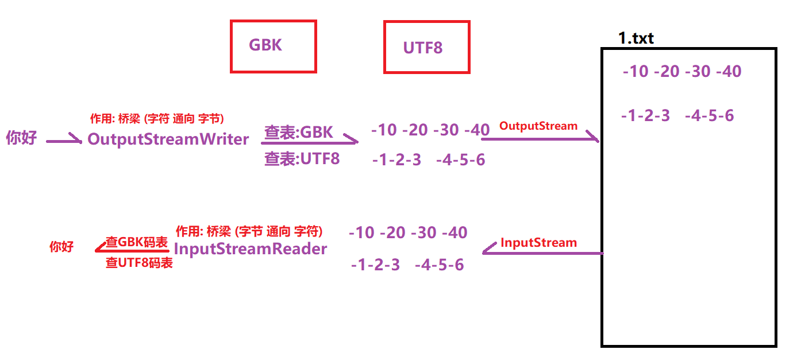
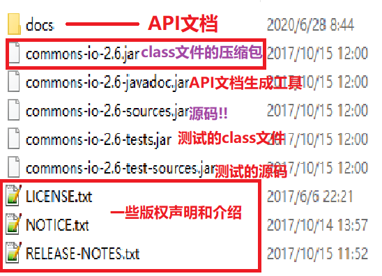

# 【缓冲流、转换流、序列化流】

##### 反馈复习

```java
1.字符流(重点)
    字符输入流:Reader(抽象类)-->FileReader
        public void close();
		public int read();//读一个字符
		public int read(char[] chs);//读一堆字符,返回实际读取的字符个数
    字符输出流:Writer(抽象类)-->FileWriter 
        public void close();
		public void flush();//刷新缓冲区
		public void write(int ch);
		public void write(char[] chs);
		public void write(char[] chs,int startIndex,int length);
		public void write(String str);
		public void write(String str,int startIndex,int length);
2.IO流异常处理
    	JDK7之前,try..catch..finally
        JDK7,try-with-resource try(需要释放的资源){}catch(){...}    
3.Properties
    	public void store(OutputStream/Writer out,String 注释内容);//保存数据
		public void load(InputStream/Reader in);//读取数据
4.ResourceBundle 
    	专门用于读取src目录下的xx.properties这种文件的数据
    	a.获取ResourceBundle对象
    		ResourceBundle bundle = ResourceBundle.getBundle("xx"); 
		b.获取文件中的属性值
            String value = bundle.getString(String key);
         
```

##### 今日内容

```java
1.缓冲流(高效流)
2.转换流(转换的文字的编码)
3.序列化流(对象流)
4.打印流(专门用于打印数据)
5.设计模式(模板设计模式,装饰设计模式)
6.commons-io工具包(很多用于简单IO流操作的工具类)        
```

### 第一章 缓冲流

##### 1.缓冲流的介绍

```java
缓冲流也称为高效流,对普通流的性能方面增强(方法上基本和普通流是一模一样的)
```

##### 2.缓冲流的分类

```java
字节输出流: OutputStream  ---> BufferedOutputStream 缓冲字节输出流
字节输入流: InputStream   ---> BufferedInputStream 缓冲字节输入流
字符输出流: Writer        ---> BufferedWriter 缓冲字符输出流
字符输入流: Reader        ---> BufferedReader 缓冲字符输入流
```

##### 3.字节缓冲流的介绍和使用【重点】

- 字节缓冲流的构造

  ```java
  public BufferedOutputStream(OutputStream out);//创建缓冲流需要传入普通流
  public BufferedInputStream(InputStream in);//创建缓冲流需要传入普通流
  ```

- 字符缓冲流的高效测试

  ```java
  public class BufferedStreamDemo {
      public static void main(String[] args) throws Exception {
          long start = System.currentTimeMillis();
          copy03();
          long end = System.currentTimeMillis();
          System.out.println(end - start);
      }
      /**
       * 复制文件:使用缓冲流 39
       */
      public static void copy03() throws Exception {
          //1.创建两个流
          BufferedInputStream bis = new BufferedInputStream(new FileInputStream("G:\\upload\\666.png"));
          BufferedOutputStream bos = new BufferedOutputStream(new FileOutputStream("copy.png"));
          //2.复制代码(一个一个字节数组复制)
          byte[] bs = new byte[1024 * 128];
          int len = 0;
          while ((len = bis.read(bs)) != -1) {
              bos.write(bs,0,len);
          }
          //3.释放资源
          bos.close();
          bis.close();
      }
      /**
       * 复制文件:使用缓冲流 1312
       */
      public static void copy02() throws Exception {
          //1.创建两个流
          BufferedInputStream bis = new BufferedInputStream(new FileInputStream("G:\\upload\\666.png"));
          BufferedOutputStream bos = new BufferedOutputStream(new FileOutputStream("copy.png"));
          //2.复制代码(一个一个字节慢慢复制)
          int b = 0;
          while ((b = bis.read()) != -1) {
              bos.write(b);
          }
          //3.释放资源
          bos.close();
          bis.close();
      }
      /**
       * 复制文件:使用普通流 222882
       */
      public static void copy01() throws Exception {
          //1.创建两个流
          FileInputStream fis = new FileInputStream("G:\\upload\\666.png");
          FileOutputStream fos = new FileOutputStream("copy.png");
          //2.复制(一个一个字节慢慢复制)
          int b = 0;
          while ((b = fis.read()) != -1) {
              fos.write(b);
          }
          //3.释放资源
          fos.close();
          fis.close();
      }
  }
  ```

##### 4.字符缓冲流的介绍和使用【重点】

- a.字符缓冲流的构造

  ```java
  public BufferedWriter(Writer w);//创建字符的缓冲流需要传入普通的字符流
  public BufferedReader(Reader r);//创建字符的缓冲流需要传入普通的字符流
  ```

- b.字符缓冲流的2个特有方法

  ```java
  BufferedWriter 相比于 FileWriter 有一个特有方法:
  	public void newLine();//写入一个换行符
  
  public class BufferedWriterDemo {
      public static void main(String[] args) throws IOException {
          //1.创建一个字符缓冲流
          FileWriter fw = new FileWriter("1.txt");
          BufferedWriter bw = new BufferedWriter(fw);
          //2.研究bw的特有方法,newLine
          for (int i = 0; i < 10; i++) {
              bw.write("java");
              //使用newLine,写入一个跨平台的换行符
              bw.newLine();
          }
          //3.释放资源
          bw.close();
          fw.close();
      }
  }
  
  BufferedReader 相比于 FileReader 有一个特有方法:
  	public String readLine();
  
  public class BufferedReaderDemo {
      public static void main(String[] args) throws IOException {
          //1.创建一个字符缓冲流
          FileReader fr = new FileReader("2.txt");
          BufferedReader br = new BufferedReader(fr);
          //2.读取数据
          //String line = br.readLine();
          //System.out.println(line);
          //=========一次读取一行的标准循环代码=========
          String line = "";
          while ((line = br.readLine()) != null) {
              System.out.println(line);
          }
          //3.释放资源
          br.close();
          fr.close();
      }
  }
  ```

##### 5.综合练习:文本排序

```java
需求:
	1.将文件中文本一行一行的读取出来
    2.要求对每一行文本按照序号排序
    3.将每一行写入到另外一个文件中,一行文本后面需要换行

public class BufferedTestDemo {
    public static void main(String[] args) throws Exception {
//        需求:
        ArrayList<String> arr = new ArrayList<String>();
//        1.将文件中文本一行一行的读取出来
        BufferedReader br = new BufferedReader(new FileReader("csb.txt"));
        String line = "";
        while ((line = br.readLine()) != null) {
            arr.add(line);
        }
        br.close();
//        2.要求对每一行文本按照序号排序
        Collections.sort(arr, new Comparator<String>() {
            @Override
            public int compare(String o1, String o2) {
                //按照首字母升序
                return o1.charAt(0) - o2.charAt(0);
            }
        });
//        3.将每一行写入到另外一个文件中,一行文本后面需要换行
        BufferedWriter bw = new BufferedWriter(new FileWriter("newcsb.txt"));
        for (String s : arr) {
            bw.write(s);
            bw.newLine();//换行
        }
        bw.close();
    }
}        
```

### 第二章 转换流

##### 1.编码和解码

```kava
编码: 把字符 --转成--> 对应的码值  比如: a ---> 0110 0001
解码: 把码值 --解析--> 对应的字符  比如: 0110 0010 ---> b
```

##### 2.字符编码

```java
什么是字符编码: 一套规则,字符和其码值之间对应的规则
    比如:  字符a ---> 97
          字符A ---> 65
          字符0 ---> 48
```

##### 3.字符集

```java
什么是字符集: 是指一个系统上支持的所有字符的集合,包括文字,文字、标点符号、图形符号、数字等
    
    
常见的字符集和常见的字符编码有哪些:
	a."ASCII字符集": 包括英文字母,符号,阿拉伯数字等
        	其对应的字符编码,"ASCII编码",在这个编码中所有的字符是占"一个字节"
    b."GBxxxx"字符集
         GB2312字符集: 包括常见简体汉字,大概7000多个
		 GBK字符集:包含常见的汉字(简体+繁体+日韩文字),大概20000多个 
         GBK18030字符集(最新字符集):包含各种汉字,少数民族的文字,大概70000多个    
         	其对应的字符编码,"GBK编码",在这个编码中一个中文占"两个字节"
    c."Unicode"字符集(统一字符集)
          其对应的字符编码,UTF-8,UTF-16,UTF-32,...   
          在"UTF-8"中一个中文占"三个字节" 
        
    d.ISO-8859-1字符集(拉丁字符集,西欧国家的字符集)
          我们以后的服务器Tomcat7以前默认使用的就是ISO-8859-1   
```

##### 4.编码引出的问题

```java
idea工具默认使用的UTF-8编码,认为一个中文三个字节
这时候如果我们用idea读取一个GBK编码的文件,就会出现乱码!!
    
public class LuanMaDemo {
    public static void main(String[] args) throws Exception {
        //1.创建一个字符输入流
        FileReader fr = new FileReader("3.txt"); //3.txt 使用GBK编码 你好 4个字节
        //2.读取一个字符
        int ch = fr.read();
        System.out.println((char)ch);
        //3.释放资源
        fr.close();
    }
}   

由于编码不同(文件的编码和读取时的编码不同),引起了乱码问题
怎么解决这个问题呢????
    a.文件也使用UTF-8编码
    b.将idea的默认编码改成GBK
    c.我们能否在读取文件时通过代码去指定使用何种编码呢?? 可以!!!(推荐的方式!!)
```

##### 4.使用转换流InputStreamReader解决读取中文的问题【重点】

```java
InputStreamReader 转换输入流
    作用:可以在读取文件时,指定编码! 
```

- 构造方法

  ```java
  public InputStreamReader(InputStream in,String charsetName);//创建一个转换输入流,底层需要一个普通的字节流,charsetName表示指定的字符编码名字
  
  public InputStreamReader(InputStream in);//创建一个转换输入流,底层需要一个普通的字节流,默认使用idea的默认字符编码!
  ```

- 使用InputStreamReader读取不同编码的文件(代码演示)

  ```java
  public class InputStreamReaderDemo {
      public static void main(String[] args) throws Exception {
          //1.使用转换输入流读取文件
  //        InputStreamReader isr = new InputStreamReader(new FileInputStream("gbk.txt"),"GBK");
          InputStreamReader isr = new InputStreamReader(new FileInputStream("utf8.txt"),"UTF-8");
          //2.读数据
          int ch = isr.read();
          System.out.println((char) ch);
  
          ch = isr.read();
          System.out.println((char) ch);
          //3.释放资源
          isr.close();
      }
  }
  ```

##### 5.使用转换流OutputStreamWriter写不同编码的中文【重点】

```java
OutputStreamWriter 转换输出流
    作用:可以在写文件,指定编码!!
```

- 构造方法

  ```java
  public OutputStreamWriter(OutputStream out,String charsetName);//创建转换输出流,底层需要一个字节输出流,参数charsetName表示指定的编码名字
  public OutputStreamWriter(OutputStream out);//创建转换输出流,底层需要一个字节输出流,默认使用idea的默认字符编码!
  ```

- 输出指定编码的中文

  ```java
  public class OutputStreamWriterDemo {
      public static void main(String[] args) throws Exception {
          //1.创建一个OutputStreamWriter对象
  //        OutputStreamWriter osw = new OutputStreamWriter(new FileOutputStream("g.txt"),"GBK");
          OutputStreamWriter osw = new OutputStreamWriter(new FileOutputStream("u.txt"),"UTF-8");
          osw.write("你好");
          //3.释放资源
          osw.close();
      }
  }
  ```

##### 6.转换流的理解




##### 7.练习:转换文件编码【重点】

```java
转换文件编码
	需求: 现有一个文件,编码为UTF-8,请编码将它转为GBK编码
    分析:
		a.使用UTF-8编码将文件读取出来
        b.使用GBK编码写入到另外一个文件中    
public class TestDemo {
    public static void main(String[] args) throws Exception {
//        转换文件编码
//        需求: 现有一个文件,编码为UTF-8,请编码将它转为GBK编码
//        分析:
//        a.使用UTF-8编码将文件读取出来
        InputStreamReader isr = new InputStreamReader(new FileInputStream("11.txt"),"UTF-8");
//        b.使用GBK编码写入到另外一个文件中
        OutputStreamWriter osw = new OutputStreamWriter(new FileOutputStream("22.txt"),"GBK");
//        c.复制文件
        int ch = 0;
        while ((ch = isr.read()) != -1) {
            osw.write(ch);
        }
//        d.释放资源
        osw.close();
        isr.close();
    }
}        
```

### 第三章 序列化流

##### 1.什么是序列化流

```java
序列化流,就是操作对象的流
分类:
	序列化流: 对象的输出流,写对象
    反序列化流: 对象的输入流,读对象   
```

##### 2.ObjectOutputStream的介绍和使用【重点】

```java
对象的字节输出流,写对象
```

- 构造方法

  ```java
  public ObjectOutputStream(OutputStream out);
  ```

- 序列化操作的前提

  ```java
  被序列化的那个类必须实现java.io.Serializable接口,开启序列化功能
      根接口没有任何方法,这种接口我们称为标记接口!!
  ```

- ==序列化操作(代码演示)==

  ```java
  public class ObjectOutputStreamDemo {
      public static void main(String[] args) throws IOException {
          //1.创建ObjectOutputStream对象
          ObjectOutputStream oos = new ObjectOutputStream(new FileOutputStream("1.txt"));
          //2.写对象
          Dog dd = new Dog(2,"旺财");
          oos.writeObject(dd);//NotSerializableException
          //3.释放资源
          oos.close();
      }
  }
  ```

##### 3.ObjectInputStream的介绍和使用【重点】

```java
对象的输入流,读对象!
```

- 构造方法

  ```java
  public ObjectInputStream(InputStream in);
  ```

- ==反序列操作(正常演示)==

  ```java
  public class ObjectInputStreamDemo {
      public static void main(String[] args) throws Exception {
          //1.创建ObjectInputStream对象
          ObjectInputStream ois = new ObjectInputStream(new FileInputStream("1.txt"));
          //2.读对象
          Object obj = ois.readObject();
          System.out.println(obj);
          //3.释放资源
          ois.close();
      }
  }
  ```

##### 4.反序列化操作的两种异常演示【了解】

```java
a.ClassNotFoundException 找不到类异常
    原因: 序列化之后,将被序列化的类删除了,然后进行反序列化即可出现这个异常
        
b.InvalidClassException  无效类异常 
    原因:序列化之后,将被序列化的类进行修改,然后进行反序列化即可出现这个异常
        
    扩展:反序列化流如何判断类是否有效呢???
        通过serialVersionUID(序列化版本号)来判断,而serialVersionUID通过类的成员内容计算而来的
        也就是只要类的内容没变,那么版本号也不会改变,只要内容改变那么版本号也会跟着改变!
```

##### 5.练习:如果需要序列化多个对象怎么操作?

```java
需求:要向文件中序列化多个对象
    
public class TestDemo {
    public static void main(String[] args) throws Exception {
        readArrayList();
    }
    public static void readArrayList() throws Exception {
        //1.反序列化流
        ObjectInputStream ois = new ObjectInputStream(new FileInputStream("dogs.txt"));
        //2.读对象
        ArrayList<Dog> arrayList = (ArrayList<Dog>)ois.readObject();
        for (Dog dog : arrayList) {
            System.out.println(dog);
        }
        //3.释放资源
        ois.close();
    }

    public static void writeArrayList() throws IOException {
        //需求:要向文件中序列化多个对象
        //方案:创建一个容器,将要序列化的所有对象保存到这个容器中
        ObjectOutputStream oos = new ObjectOutputStream(new FileOutputStream("dogs.txt"));

        ArrayList<Dog> dogs = new ArrayList<Dog>();
        dogs.add(new Dog("旺小财",1,4));
        dogs.add(new Dog("旺中财",2,3));
        dogs.add(new Dog("旺大财",3,5));
        dogs.add(new Dog("旺老财",4,4));
        //把这个集合当做一个对象
        oos.writeObject(dogs);

        oos.close();
    }
}  
注意:多个对象的话，保证只写一次，才能正确读出来
```

### 第四章 打印流

##### 1.打印流的介绍

```java
PrintStream:打印流,可以方便的输出各种数据类型的数据
特点:
	a.打印流永远不会抛出IOException
    b.所见即所得!    
```

##### 2.PrintStream的构造和常用方法【重点】

```java
构造方法:
	public PrintStream(String path);
	public PrintStream(File file);
	public PrintStream(OutputStream out); 
成员方法:
	public void print(各种数据类型均可);//打印数据,但是不带换行
	public void println(各种数据类型均可);//打印数据,末尾自动带换行

public class PrintStreamDemo {
    public static void main(String[] args) throws Exception {
        //1.创建PrintStream对象
        PrintStream ps = new PrintStream("p.txt");
//        PrintStream ps = new PrintStream(new File("p.txt"));
//        PrintStream ps = new PrintStream(new FileOutputStream("p.txt"));
        //2.打印数据
        ps.println('a');
        ps.println(97);
        ps.println(',');
        ps.println('K');
        ps.println(12.34);
        ps.println(true);
        //3.释放资源
        ps.close();
    }
}
```

##### 3.修改打印流的流向【了解】

```java
public class PrintStreamDemo {
    public static void main(String[] args) throws Exception {
        //=====================
        //打印流我们基础班其实一直在使用
        System.out.println("HelloWorld");
        //有趣的事: 修改System.out这个打印流目的地
        PrintStream ps1 = new PrintStream("ps.txt");
        System.setOut(ps1);

        System.out.println("java");
        System.out.println("php");
        System.out.println("ios");
    }
}
```

### 第五章 装饰设计

##### 1.装饰模式作用 

```java
在不改变原来类,也不使用继承的基础上增强类的某个功能!!
```

##### 2.装饰者设计模式的4个基本步骤

- 装饰类和被装饰类必须实现相同的接口
- 在装饰类中必须传入被装饰类的引用
- 在装饰类中对需要扩展的方法进行扩展
- 在装饰类中对不需要扩展的方法调用被装饰类中的同名方法

##### 3.代码实现

```java
/**
 * 装饰类和被装饰类需要实现的接口
 */
public interface Star {
    /**
     * 唱歌
     */
    void sing();

    /**
     * 跳舞
     */
    void dance();
}
/**
 * 原有类,被装饰类,需要实现star接口
 */
public class LiuDeHua implements Star{

    public void sing(){
        System.out.println("啊哈,给我一杯忘情水...");
    }

    public void dance(){
        System.out.println("蹦恰恰...蹦恰恰...");
    }
}

/**
 * 装饰类,也需要实现Star接口
 */
public class LiuDeHuaWrapper implements Star {

    private LiuDeHua ldh;

    public LiuDeHuaWrapper(LiuDeHua ldh){
        this.ldh = ldh;
    }

    @Override
    public void sing() {
        System.out.println("唱歌前喝口水...");
        ldh.sing();
        System.out.println("唱歌后吃个糖...");
    }

    @Override
    public void dance() {
        ldh.dance();
    }
}
public class TestDemo {
    public static void main(String[] args) {
        //1.创建一个被装饰类对象
        LiuDeHua ldh = new LiuDeHua();
        //2.创建一个装饰类对象
        LiuDeHuaWrapper wrapper = new LiuDeHuaWrapper(ldh);
        //3.调用方法
        wrapper.sing();
        wrapper.dance();

    }
}
```

### 第六章 commons-io工具包

##### 1.commons-io的介绍和下载

```java
commons-io是第三方提供一个专门用于IO操作的工具包
下载: http://commons.apache.org/proper/commons-io/
目录介绍:
```



##### 2.常用API介绍

```java
使用步骤:
a.在当前模块下创建一个文件夹,起名lib
b.将commons-io-2.6.jar拷贝到模块的lib文件夹下
c.将这个jar包右键添加到模块中(Add as Library..),然后才能使用   
```

- 复制文件API

  ```java
  public class CommonsIODemo {
      public static void main(String[] args) throws IOException {
          //1.使用工具类IOUtils
          IOUtils.copy(new FileInputStream("copy.png"),new FileOutputStream("cc.png")); //建议复制2G一下文件
          IOUtils.copyLarge(new FileInputStream("copy.png"),new FileOutputStream("cc1.png"));//建议复制2G以上文件
      }
  }
  
  ```

- 复制文件夹API

  ```java
  public class CommonsIODemo {
      public static void main(String[] args) throws IOException {
          //2.使用工具类FileUtils
          FileUtils.copyFileToDirectory(new File("copy.png"),new File("H:\\360Downloads"));
          FileUtils.copyDirectoryToDirectory(new File("C:\\Users\\Administrator\\Desktop\\temp\\aaa"),new File("H:\\360Downloads"));
      }
  }
  ```

##### 总结

```java
能够使用字节缓冲流读取数据到程序
能够使用字节缓冲流写出数据到文件
    字节缓冲流没有特有方法,只是性能比普通字节流要高
能够明确字符缓冲流的作用和基本用法
    符缓缓冲流有特有方法,性能比普通字符流要高 
能够使用缓冲流的特殊功能
    BufferedWriter: public void newLine();
    BufferedReader: public String readLine();
=======================     
能够阐述编码表的意义
    提供一个规则,a ---> 97 
能够使用转换流读取指定编码的文本文件
    OutputStreamWriter 指定编码写文件
    InputStreamReader 指定编码读文件
能够使用转换流写入指定编码的文本文件
=======================    
能够使用序列化流写出对象到文件
    ObjectOutputStream 将对象写入到文件中
    ObjectInputStream 将文件中的对象读取出来
能够使用反序列化流读取文件到程序中
========================    
能够理解装饰模式的实现步骤
    装饰设计模式的四步:
		a.装饰类和被装饰类实现同一个接口
        b.装饰类中要传入被装饰类的引用
        c.在装饰类中对需要扩展的方法进行扩展
        d.在装饰类对象不需要扩展的方法,调用被装饰类对象的同名方法    
========================    
能够使用commons-io工具包
    IOUtils 复制文件
    FileUtils 复制文件和文件夹        
```

