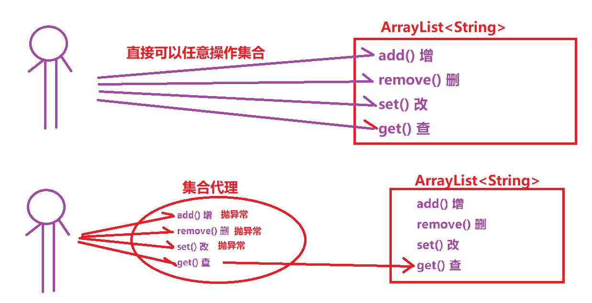

# 【设计模式】
### 第一章 单例设计模式

##### 1. 单例设计模式介绍

```java
什么叫单例??
   就是保证一个类只有一个对象   
```

##### 2. 单例设计模式实现步骤

```java
a.将构造方法设置成私有方法
b.在类内部自己创建一个静态的本类对象
c.提供一个静态方法用于获取该对象
d.别的类中想要获取对象可以通过调用这个类的静态方法获取    
```

##### 3 单例设计模式的分类

```java
饿汉式单列设计模式
    定义本类对象是直接创建
懒汉式单列设计模式
    定义类型对象的变量,而是等静态方法被调用时再创建对象
    
你今天不上课,早上9点起来,中午吃啥呢??
    懒汉式: 不着急吃,等中午到了饿了再去做
    饿汉式: 先把吃的做好了,等饿了可以立刻开吃
```

##### 4, 饿汉单例设计模式

```java
/**
 *  单例设计模式(饿汉式)
 */
public class Girl {
    private String name;
    private int age;

    //b.在类内部自己创建一个静态的本类对象
    private static Girl gg = new Girl("rose",5);

    //a.将构造方法设置成私有方法
    private Girl() {
    }
    //a.将构造方法设置成私有方法
    private Girl(String name, int age) {
        this.name = name;
        this.age = age;
    }

    //c.提供一个静态方法用于获取该对象
    public static Girl getInstance(){
        return gg;
    }
}
public class TestGirl {
    public static void main(String[] args) {
        //1.Girl对象
        for (int i = 0; i < 10; i++) {
            Girl g1 = Girl.getInstance();
            System.out.println(g1);
        }
    }
}
```

##### 5. 懒汉单例设计模式

```java
/**
 *  单例设计模式(懒汉式)
 */
public class Boy {
    //a.将构造方法设置成私有方法
    private Boy(){
    }
    //b.在类内部只定义一个本类的对象名,但是不赋值
    private static Boy boy;

    //c.提供一个静态方法用于获取该对象
    public synchronized static Boy getInstance(){
        //直到别人调用该方法,我们才赋值
        if (boy == null) {
            boy = new Boy();
        }
        return boy;
    }
}
public class TestBoy {
    public static void main(String[] args) {
        //1.获取Boy
        for (int i = 0; i < 10; i++) {
            Boy boy = Boy.getInstance();
            System.out.println(boy);
        }
    }
}
```

### 第二章 多例设计模式

##### 1. 多例设计模式的介绍

```java
什么多例:
	就是保证一个类只有指定个数的对象   
```

##### 2. 多例设计模式的实现步骤

```java
a.将构造方法设置成私有方法
b.在本类的内部创建一个静态集合,保存多个对象
c.在本类中提供一个静态方法,随机返回集合中某个对象
d.在测试类中调用静态方法获取对象  
```

##### 3. 多例设计模式的代码实现

```java
public class Dog {
    //定义一个常量,用于指定多例具体的个数
    private static final int COUNT = 3;

    //a.将构造方法设置成私有方法
    private Dog() {
    }

    //b.在本类的内部创建一个静态集合,保存多个对象
    private static ArrayList<Dog> arr = new ArrayList<Dog>();

    //使用静态代码块给集合添加多个对象,保证这些对象一定且只会执行一次
    static {
        for (int i = 0; i < COUNT; i++) {
            arr.add(new Dog());
        }
    }
    //c.在本类中提供一个静态方法,随机返回集合中某个对象
    public static Dog getInstance(){
//        int index = new Random().nextInt(arr.size());//0- (size-1)
//        Dog dd = arr.get(index);
//        return dd;
        //可以写成以下一句代码!!
        return arr.get(new Random().nextInt(arr.size()));
    }
}
public class TestDog {
    public static void main(String[] args) {
        //1.获取Dog对象
        for (int i = 0; i < 20; i++) {
            Dog dog = Dog.getInstance();
            System.out.println(dog);//只有三种不同的对象地址,因为集合中只要3个对象
        }
    }
}
```

### **第三章 动态代理设计模式**

##### **3.1** 代理模式介绍

- 什么是代理

  ```java
  当我们想要去做某件事,但是能力不够或者不愿意去做,我们可以找一个代理帮助我们去完成!!
  ```

- 生活中的代理

  ```java
  我租房,找代理(中介)
  我出国旅游,找代理(旅行社)    
  ```

- 代码中的代理案例

  ```java
  现在有一个集合ArrayList,保存了一些用户的重要信息,我们要求,只能对集合进行查询操作,不能对集合进行增删改操作!!
  怎么操作?? 使用代理!
      
  实现步骤:
  a.让被代理对象和代理对象实现相同的接口
  b.在代理对象中保存被代理对象的引用
  c.代理对象重写接口的方法,如果增删改相关方法,直接抛出异常,如果查询方法调用被代理对象的方法操作即可!   /**
   * ArrayList集合的代理类 限制
   */
  //a.让被代理对象和代理对象实现相同的接口
  public class ArrayListProxy implements List<String>{
      //b.在代理对象中保存被代理对象的引用
      private ArrayList<String> arr;
      public ArrayListProxy(ArrayList<String> arr) {
          this.arr = arr;
      }
  
      //c.代理对象重写接口的方法,如果增删改相关方法,直接抛出异常,如果查询方法调用被代理对象的方法操作即可!
      @Override
      public int size() {
          return arr.size();
      }
  
      @Override
      public boolean isEmpty() {
          return arr.isEmpty();
      }
  
      @Override
      public boolean add(String s) {
          //抛出异常
          throw new UnsupportedOperationException("add方法不支持!");//不支持这种操作异常
      }
  
      @Override
      public boolean remove(Object o) {
          //抛出异常
          throw new UnsupportedOperationException("该方法不支持!");//不支持这种操作异常
      }
  
      @Override
      public void clear() {
          //抛出异常
          throw new UnsupportedOperationException("该方法不支持!");//不支持这种操作异常
      }
  
      @Override
      public String get(int index) {
          return arr.get(index);
      }
  
      @Override
      public String set(int index, String element) {
          //抛出异常
          throw new UnsupportedOperationException("该方法不支持!");//不支持这种操作异常
      }
  
      @Override
      public void add(int index, String element) {
          //抛出异常
          throw new UnsupportedOperationException("该方法不支持!");//不支持这种操作异常
      }
  
      @Override
      public String remove(int index) {
          //抛出异常
          throw new UnsupportedOperationException("该方法不支持!");//不支持这种操作异常
      }
  	//其他方法省略.....
  }
  /**
   * 测试类
   */
  public class ProxyDemo {
      public static void main(String[] args) {
          //1.创建一个集合
          ArrayList<String> arr = new ArrayList<String>();
          //2.保存一些重要信息
          arr.add("jack");
          arr.add("13838385438");
          arr.add("北京市顺义区xx路");
          //....
          //3.创建一个arr的代理对象
          ArrayListProxy arrProxy = new ArrayListProxy(arr);
          //4.调用方法
          method(arrProxy);
      }
      //调用方法,把集合传递过去
      //保证方法中只能对集合进行查询操作,不能增删改操作
      public static void method(List<String> arr){
  //        arr.add("520");
  //        arr.remove(1);
  //        arr.set(2,"北京市海淀区");
          System.out.println(arr.get(1));
      }
  } 
  ```

  

##### **3.2** 动态代理概述

```java
动态代理的作用:拦截对真实对象方法的直接访问，增强真实对象方法的功能(和上面讲解的静态代理作用是一样)
动态代理好静态代理区别在于:
	静态代理我们事先需要把代理类编写出来,才能编译运行
    动态代理我们不需要事先把代理类编写出来,在程序运行阶段动态生成的对象
```

**3.3** **案例引出**

```java
List<String> arrProxy = Collections.unmodifiableList(List集合);
这句其实就已经完成了,对普通LIst集合创建代理对象的功能了!!但是他并不是我们上面用的静态方法,而是用了动态代理技术!
```

**3.4** **重点类和方法**[难点]

```java
Proxy(Java提供的用于生成动态代理对象的类)
//动态生成一个类的代理类的对象
public static Object newProxyInstance(
    ClassLoader loader,
    //参数1,称为类加载,给当前类的类加载器即可,当前类名.class.getClassLoader()
    Class[] classes,
    //参数2,给代理类和被代理类要共同实现的接口的字节码文件, 被代理对象.getClass().getInterfaces()
    InvocationHandler handler
    //参数3.处理实现类对象
);

接口InvocationHandler的抽象方法:
	//处理方法,拦截方法
	public Object invoke(Object proxy, Method method, Object[] args);
						    代理对象     被懒拦截主方法对象    前面这个方法的参数
```

**3.5** **动态代理综合案例**

```java
/**
 * 测试类
 */
public class ProxyDemo {
    public static void main(String[] args) {
        //1.创建一个集合
        ArrayList<String> arr = new ArrayList<String>();
        //2.保存一些重要信息
        arr.add("jack");
        arr.add("13838385438");
        arr.add("北京市顺义区xx路");
        //3.给arr创建一个代理对象
        List<String> arrProxy = (List<String>) Proxy.newProxyInstance(
                ProxyDemo.class.getClassLoader(), //类加载器
                arr.getClass().getInterfaces(), //接口的字节码文件数组
                new InvocationHandler() {
                    //拦截方法,当我们调用arrProxy代理对象的任务方法时,都会被拦截住
                    public Object invoke(Object proxy, Method method, Object[] args) throws Throwable {
//                        System.out.println("被拦截的方法:" + method.getName());
//                        System.out.println("方法参数:" + Arrays.toString(args));
                        //如果和get有关方法,就调用真实对象的方法
                        String name = method.getName();
                        if (name.startsWith("get")) {
                            //如果和get有关方法,就调用真实对象的方法
                            return method.invoke(arr, args);
                        } else {
                            //如果其他方法,直接抛出异常
                            throw new UnsupportedOperationException("方法"+name+"不支持...");
                        }
                    }
                }
        );
        //4.操作代理对象
        method(arrProxy);
    }

    //调用方法,把集合传递过去
    //保证方法中只能对集合进行查询操作,不能增删改操作
    public static void method(List<String> arr) {
//        arr.add("520");
//        arr.remove(1);
//        arr.set(2,"北京市海淀区");
        System.out.println(arr.get(1));
    }
}
```

**3.6** **动态代理的优缺点总结**

```java
a.优点: 可以给任意的接口实现类创建一个动态代理对象
b.缺点: 只能给接口实现类创建动态代理,不能给普通类创建动态代理   
```

### **第四章** Lombok

```java
a.添加jar包
b.添加插件
c.启动注解处理器
d.在要生成的类上使用Lombok各种注解
e.测试即可(如果以上都OK,但是测试出不来结果,重启idea)  
```

### 第五章 工厂设计模式

##### 1.工厂模式概述

```java
工厂设计模式专门用于创建不同的对象
```

##### 2.工厂模式作用

```java
解耦:减少类与类之间的紧密关系的
```

##### 3.工厂模式实现步骤

```java
1.创建接口Runnable
2.创建各种汽车类实现Runnable接口,重写run方法
3.创建CarFactory工厂,用于获取汽车对象
4.测试类测试工厂    
```

##### 4.工厂模式实现代码

```java
/**
 * 可行驶的
 */
public interface Runnable {
    public abstract void run();
}
/**
 * 奥拓
 */
public class AoTuo implements Runnable {
    @Override
    public void run() {
        System.out.println("奥拓汽车,百公里加速需要5.0秒~~~");
    }
}
/**
 * 奥迪
 */
public class AoDi implements Runnable{
    @Override
    public void run() {
        System.out.println("奥迪汽车,百公里加速需要3.5秒~~~");
    }
}
/**
 *  法拉利
 */
public class FaLaLi implements Runnable{
    @Override
    public void run() {
        System.out.println("法拉利跑车,百公里加速需要1.0秒~~~");
    }
}
/**
 * 汽车工厂
 */
public class CarFactory {
    /**
     * 获取的方法
     * @return
     */
    public static Runnable getInstance(int id){
        if (id == 1) {
            //1.返回一辆奥拓
            return new AoTuo();
        }else if (id==2) {
            //2.返回一辆奥迪
            return new AoDi();
        }else if (id == 3) {
            //3.返回一辆法拉利
            return new FaLaLi();
        }else {
            System.out.println("您要的汽车没有...默认给奥拓了");
            return new AoTuo();
        }
    }

}
public class TestDemo {
    public static void main(String[] args) {
        //1.买奥拓
//        AoTuo at1 = new AoTuo();
//        at1.run();
        //2.有钱了,买奥迪
//        AoDi ad1 = new AoDi();
//        ad1.run();
        //3.更有钱
//        FaLaLi fll = new FaLaLi();
//        fll.run();
        //4.使用工厂获取汽车
        Runnable at1 = CarFactory.getInstance(1);
        at1.run();
    }
}
```
