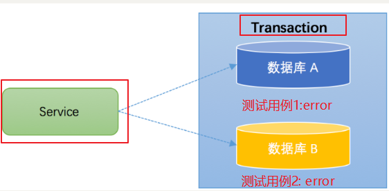
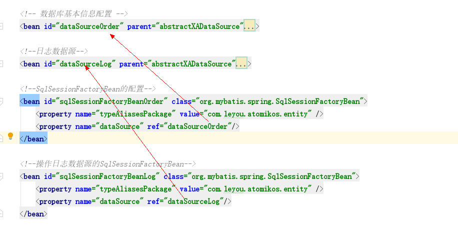
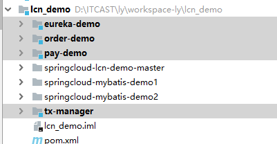
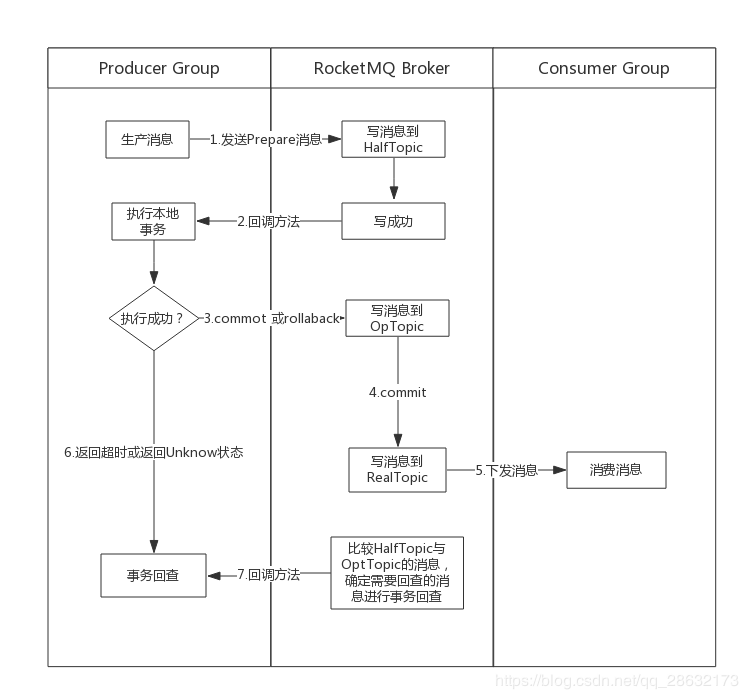
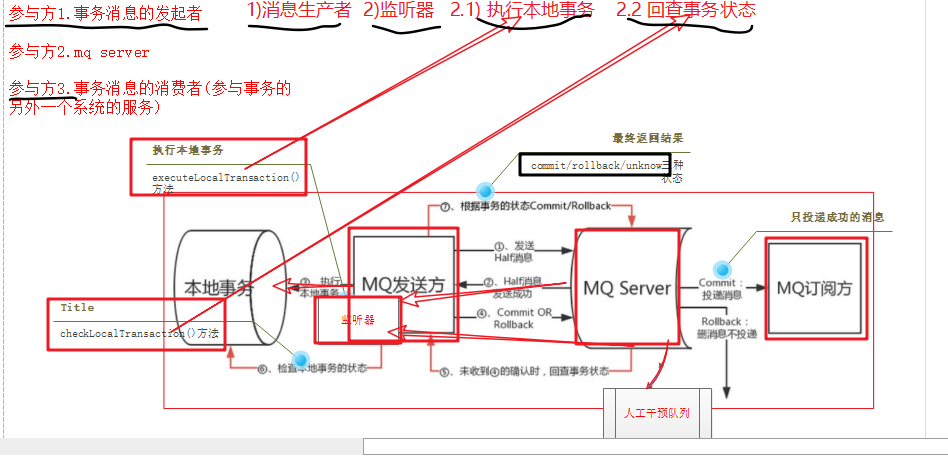

# 学习目标

目标1  理解本地事务和分布式事务的概念和区别(理解) 

目标2  分布式事务的理论基础 CAP  BASE(了解)

目标3  各分布式事务方案的优缺点及适用场景(了解)

目标4  Atomikos+jta实现分布式事务(掌握)

**目标5 TX-LCN解决分布式事务(重点掌握)**

**目标6 RocketMQ事务消息(重点掌握)**


# 第1章 本地事务和分布式事务

## 1.1什么是本地事务

对**同一个**数据源,进行一组相关的sql操作(至少2个,增删改),要么全部成功,要么全部失败(原子性).

### 1.1.1 事务的四个特性ACID

**原子性(Atomicity)**:==同生共死==(要么全部成功,要么全部失败)

**一致性(Consistency):** ==相互匹配==(卖方+200元和买方-200元)

**隔离性(Isolation)**：==并行不扰==:理论上,并行的两个事务,相互之间是不干扰的.

**持久性(Durability)**：==落子无悔==(不可逆)

### 1.1.2  事务的隔离级别

**目标** 

1.知道两组事务并发时产生的问题,及隔离级别如何解决这些问题

隔离性:并行事务互相不干扰,a-独占库,独占表;b独占库,独占表.     a和b同时操作数据库中某一个表.

2.事务的隔离级别

​        根据两个事务之间的干扰性强弱,划分为几个级别

​         读未提交 、读已提交 、可重复读、串行化

**脏读**：事务a,读到了事务b未提交的数据.  如果事务a读到了事务b的一些中间数据

**不可重复读**：事务a在读数据时事务b对数据产生了修改，导致事务a读到的数据不一致.  

**幻读、虚读**：一个事务在查询,另一个事务在做插入或者删除,此时就会出现幻读.

例子:用户a,要给价格>100更新状态,若在第一时间查到10条数据;

​          用户b,在同一时间删除了一条数据,

​          此时用户a,再对数据更新时,就只能更新9条数据,此时便出现了幻读.


**脏读和幻读的区别**：

脏读:一个事务更新,另一个事务在读取

幻读:一个事务在做插入或者删除,另一个事务在做读取时.


**四种隔离级别起的作用,如何解决隔离性问题:**


**隔离级别与性能的关系**

隔离级别越高,性能越低.

## 1.2 什么是分布式事务

目标：

* 知道三种分布式服务架构
* 知道每种分布式服务架构的解决方案
* 知道柔性事务和刚性事务的区别

那什么是分布式事务呢？看图说话:

事务的参与者、服务器、数据源、事务管理器,分布在不同的节点上.原子性操作,要么全部成功,要么全部失败.


本质:

* 对于不同数据库,要求达到最终的一致性。

| 事务类别   | 数据库   | 会话     | 举例     | 事务管理器     |
| ---------- | -------- | -------- | -------- | -------------- |
| 本地事务   | 单数据库 | 单会话   | 单机游戏 | 本地事务管理器 |
| 分布式事务 | 多数据源 | 多个会话 | 斗地主   | 全局事务管理器 |

配图分析解决办法:

本地事务


那么分布式事务是什么架构呢？

### 1.2.1 分布式事务应用架构

##### 1.2.1.1 单一服务分布式事务(重点) 

单服务-多库。   Automikos框架解决


解决方案:(全局事务管理器TM) Transaction Manager 


##### 1.2.1.2 分库分表(不做重点讨论)

数据量大时,分库分表

解决方案:中间件+数据库同步技术

分库分表中间件:mycat  \shardingdb 


##### 1.2.1.3 多服务多数据源分布式事务(重点)

多服务-多数据库:    LCN框架解决

解决方案:全局TM\(数据库) 和 服务协调者(服务),共同协调\数据库资源\服务


总结：分布式事务架构有三种

  1、一个service有多个数据源

  2、使用数据库的中间件解决分库分表（本质上不涉及分布式事务）

  3、多个service多个数据源


### 1.2.2 解决方案的分类

刚性事务:ACID(本地事务)

柔性事务:(CAP\BASE)(分布式事务管理)

比较:

| 事务类型 | 时间要求   | 一致性要求 | 应用类型        | 场景                             |      |
| -------- | ---------- | ---------- | --------------- | -------------------------------- | ---- |
| 刚性事务 | 立刻\马上  | 强一致性   | 局域网\企业应用 | 银行转账（同行转账A--B）         |      |
| 柔性事务 | 有时间弹性 | 最终一致性 | 互联网应用      | 滴滴打车，中间有过滤状态：待付款 |      |

  

## 1.3 CAP理论

一、什么是CAP

CAP是 Consistency一致性、Availability可用性、Partition tolerance分区容错（容忍）性三个词语的缩写，分别表示一致性、可用性、分区容忍性。

下边我们分别来解释：

为了方便对CAP理论的理解，我们结合电商系统中的一些业务场景来理解CAP。

如下图，是商品信息管理的执行流程：


整体执行流程如下：                                               CP放弃A       10s  20s

​                                                                                 AP放弃C        短时没有数据一致

​                                                                                 CA放弃P       没有用到分布式事务

1、商品服务请求主数据库写入商品信息（添加商品、修改商品、删除商品）

2、主数据库向商品服务响应写入成功。

3、商品服务请求从数据库读取商品信息。

### C - Consistency

一致性是指写操作后的读操作可以读取到最新的数据状态，当数据分布在多个节点上，从任意结点读取到的数据都是最新的状态。

上图中，商品信息的读写要满足一致性就是要实现如下目标：

1、商品服务写入主数据库成功，则向从数据库查询新数据也成功。

2、商品服务写入主数据库失败，则向从数据库查询新数据也失败。

 

### A - Availability ：

可用性是指任何事务操作都可以得到响应结果，且不会出现响应超时或响应错误。在允许的时间返回数据

上图中，商品信息读取满足可用性就是要实现如下目标：

1、从数据库接收到数据查询的请求则立即能够响应数据查询结果。

2、从数据库不允许出现响应超时或响应错误。

 

### P - Partition tolerance ：

通常分布式系统的各各结点部署在不同的子网，这就是网络分区，不可避免的会出现由于网络问题而导致结点之间通信失败，此时仍可对外提供服务，这叫分区容忍性。

上图中，商品信息读写满足分区容忍性就是要实现如下目标：

1、主数据库向从数据库同步数据失败不影响读写操作。

2、其一个结点挂掉不影响另一个结点对外提供服务。

 

二、CAP组合方式

P必须满足

CAP有哪些组合方式呢？

所以在生产中对分布式事务处理时要根据需求来确定满足CAP的哪两个方面。

1）AP：

放弃一致性，追求分区容忍性和可用性。这是很多分布式系统设计时的选择。

例如：

上边的商品管理，完全可以实现AP，前提是只要用户可以接受所查询的到数据在一定时间内不是最新的即可。

通常实现AP都会保证最终一致性，后面讲的BASE理论就是根据AP来扩展的，一些业务场景 比如：订单退款，今日退款成功，明日账户到账，只要用户可以接受在一定时间内到账即可。

2）CP

放弃可用性，追求一致性和分区容错性，我们的zookeeper其实就是追求的强一致，又比如跨行转账，一次转账请求要等待双方银行系统都完成整个事务才算完成。

3）CA：

放弃分区容忍性，即不进行分区，不考虑由于网络不通或结点挂掉的问题，则可以实现一致性和可用性。那么系统将不是一个标准的分布式系统，我们最常用的关系型数据就满足了CA。

上边的商品管理，如果要实现CA则架构如下：

主数据库和从数据库中间不再进行数据同步，数据库可以响应每次的查询请求，通过事务隔离级别实现每个查询请求都可以返回最新的数据。

三、总结
通过上面我们已经学习了CAP理论的相关知识，CAP是一个已经被证实的理论：一个分布式系统最多只能同时满足一致性（Consistency）、可用性（Availability）和分区容忍性（Partition tolerance）这三项中的两项。它可以作为我们进行架构设计、技术选型的考量标准。对于多数大型互联网应用的场景，结点众多、部署分散，而且现在的集群规模越来越大，所以节点故障、网络故障是常态，而且要保证服务可用性达到N个9（99.99…%），并要达到良好的响应性能来提高用户体验，因此一般都会做出如下选择：保证P和A，舍弃C强一致，保证最终一致性


简单来说：P是大前提，如果P发生了（两个数据库无法通信），必须要满足A或C


## 1.4 BASE理论

目标:

* 1.什么是BASE理论

* 2.什么是柔性事务

核心思想:分布式事务,只需达到最终一致性（Eventual Consitency）即可，实际上是参考了CAP理论。

- Basically Available（基本可用）  允许有很小错误率
- Soft state（软状态）:比如订单状态:(待付款\已付款\发货\已签收\已结束)
- Eventually consistent（最终一致性）

## 1.5 柔性事务解决方案

概念:符合BASE理论的分布式解决方案,就叫做柔性事务

典型的柔性事务方案如下:(重点)

```
1) TCC（两阶段型2pc的中实现）  案例:(锁定库存---下单)  订婚---结婚
2) 可靠消息最终一致性（异步确保型）消息队列来保证事务的一致性
- 非事务型消息中间件(activimq\rabbitmq\kafka)
- 事务性消息rocketmq(阿里的消息队列)
- 案例:(在线下棋)
3) 最大努力通知（非可靠消息、定期校对）
- 案例:滴滴打车有未付款的订单,每个一段时间滴滴都会通知我们付款.
      滴滴最大努力通知用户;用户定期校验.如果未付款,则执行付款,付款后滴滴不再重复通知.数据状态保持一致.
```

# 第2章 分布式事务解决方案

目标：

理解  **模型--->规范--->接口--->方案**  的关系

​          DTP--->TCC---->XA----->JTA-->atomikos

​	DTP：表示有哪些部分组成

​    TCC：都采用2阶段  有过渡阶段，有延迟

​    XA： 用到资源管理器和事务管理器之间的通信接口

​    JTA：是XA接口的java的接口

​    atomikos :具体的java实现框架

​          课桌的模型（有腿儿、有面儿）

​         4个腿儿 一个面儿  分两个阶段

​         4个角的桌面+菱形的桌腿儿

​         使用木头、使用铁

## 2.1 分布式事务处理模型(DTP) 标准的提供者.

谁提出来的?  x/open,open group.是一个独立的组织，主要负责制定各种行业技术标准


### 2.1.1  **DTP模型**

####  1. 模型元素( 5个)

* **应用程序(Application Program ，简称AP)：**

* **资源管理器(Resource Manager，简称RM)：**==如数据库、文件系统==等，并提供访问资源的方式。

* **事务管理器(Transaction Manager ，简称TM)：**负责分配事务唯一标识，监控事务的执行进度，并负责事务的提交、回滚等。

* **通信资源管理器(Communication Resource Manager，简称CRM)：**控制一个TM域(TM domain)内或者跨TM域的分布式应用之间的通信。

* **通信协议(Communication Protocol，简称CP)：**


#### 2.**模型实例(Instance of the Model)**

3部分：


### 2.1.2 **XA规范**


 定义:XA规范描述如下:XA规范的最主要的作用是，就是定义了RM-TM的交互接口，

下图更加清晰了演示了XA规范在DTP模型中发挥作用的位置


### 2.1.3 XA规范与二阶段协议TCC的关系

协议与接口(XA)

  二阶段提交协议并非在XA规范中提出来的。但XA规范定义了两阶段提交协议中需要使用到的接口 .


  

###  2.1.4 JTA与XA及atomikos的关系

 概念:（JTA：Java  Transaction Api）xa的java实现版

 某种程度上，可以认为JTA规范是XA规范的Java版 ，在JTA 中， 事务管理器抽象为javax.transaction.TransactionManager接口 ，并通过底层事务服务（即JTS）实现。

 JTA仅仅定义了接口 

实现:

* J2EE容器所提供的JTA实现(JBoss)
* Atomikos  JTA的实现,用于tomcat等容器

总结: JTA  是xa的java实现; Atomikos是JTA的一种实现

## 2.2 补偿事务（TCC）

tcc是二阶段（2pc）协议的一种,(优化:锁定了一部分资源,剩余的资源,其他的事务可以使用)

TCC 其实就是采用的补偿机制，其核心思想是：针对每个操作，都要注册一个与其对应的确认和==补偿（撤销）==操作。它分为三个阶段：

- Try 阶段主要是对业务系统做检测及资源预留
- ==Confirm 阶段主要是对业务系统做确认提交，Try阶段执行成功并开始执行 Confirm阶段时，默认 Confirm阶段是不会出错的。即：只要Try成功，Confirm一定成功==。
- ==Cancel== 阶段主要是在业务执行错误，需要回滚的状态下执行的业务取消，预留资源释放。


例如： A要向 B 转账，思路大概是： 

```properties
我们有一个本地方法，里面依次调用 
1、首先在Try 阶段，要先调用远程接口把 B和 A的钱给冻结起来。 
2、在 Confirm 阶段，执行远程调用的转账的操作，转账成功进行解冻。 
3、如果第2步执行成功，那么转账成功，如果第二步执行失败，则调用远程冻结接口对应的解冻方法 (Cancel)。 
```

**优点：** 跟2PC比起来，实现以及流程相对简单了一些，但数据的一致性比2PC也要差一些

**缺点：** 缺点还是比较明显的，在2,3步中都有可能失败。TCC属于应用层的一种补偿方式，所以需要程序员在实现的时候多写很多补偿的代码，在一些场景中，一些业务流程可能用TCC不太好定义及处理。在代码无法完成事务时,可以通过手工干预

总结:

   1.TCC  (TRY-CONMIT 或者 TRY-CANCEL)

2. 优点:可以再try阶段,预留一部分资源,使剩余的资源得到释放(与二阶段做比较,二阶段在第一阶段锁定资源,所以二阶段的效率低)
3. 缺点:2 和3 步都可能失败,需要些更多的补偿代码


## 2.3 通过消息队列保证事务的一致性

#### 本地消息表（异步确保）

本地消息表这种实现方式应该是业界使用最多的，其核心思想是将分布式事务拆分成本地事务进行处理，这种思路是来源于ebay。我们可以从下面的流程图中看出其中的一些细节： 


具体保存一致性的容错处理如下：

- **当步骤 1 处理出错，**事务回滚，相当于什么都没发生。
- **当步骤 2、步骤 3 处理出错，**由于未处理的事务消息还是保存在事务发送方，事务发送方可以定时轮询为超时消息数据，再次发送到消息中间件进行处理。事务被动方消费事务消息重试处理。
- **如果是业务上的失败，**事务被动方可以发消息给事务主动方进行回滚。
- **如果多个事务被动方已经消费消息，**事务主动方需要回滚事务时需要通知事务被动方回滚。

基本思路就是：

消息生产方，需要额外建一个消息表，并记录消息发送状态。消息表和业务数据要在一个事务里提交，也就是说他们要在一个数据库里面。然后消息会经过MQ发送到消息的消费方。如果消息发送失败，会进行重试发送。

消息消费方，需要处理这个消息，并完成自己的业务逻辑。此时如果本地事务处理成功，表明已经处理成功了，如果处理失败，那么就会重试执行。如果是业务上面的失败，可以给生产方发送一个业务补偿消息，通知生产方进行回滚等操作。

生产方和消费方定时扫描本地消息表，把还没处理完成的消息或者失败的消息再发送一遍。如果有靠谱的自动对账补账逻辑，这种方案还是非常实用的。

这种方案遵循BASE理论，采用的是最终一致性，笔者认为是这几种方案里面比较适合实际业务场景的，即不会出现像2PC那样复杂的实现(当调用链很长的时候，2PC的可用性是非常低的)，也不会像TCC那样可能出现确认或者回滚不了的情况。

**优点：** 一种非常经典的实现，避免了分布式事务，实现了最终一致性。

**缺点：** 消息表会耦合到业务系统中，如果没有封装好的解决方案，会有很多杂活需要处理。


## 2.4 MQ 事务消息(rocketMQ)

有一些第三方的MQ是支持事务消息的，比如RocketMQ，他们支持事务消息的方式也是类似于采用的二阶段提交，但是市面上一些主流的MQ都是不支持事务消息的，比如 RabbitMQ 和 Kafka 都不支持。

以阿里的 RocketMQ 中间件为例，其思路大致为：

第一阶段Prepared消息，会拿到消息的地址。
第二阶段执行本地事务，第三阶段通过第一阶段拿到的地址去访问消息，并修改状态。

也就是说在业务方法内要想消息队列提交两次请求，一次发送消息和一次确认消息。如果确认消息发送失败了RocketMQ会定期扫描消息集群中的事务消息，这时候发现了Prepared消息，它会向消息发送者确认，所以生产方需要实现一个check接口，RocketMQ会根据发送端设置的策略来决定是回滚还是继续发送确认消息。这样就保证了消息发送与本地事务同时成功或同时失败。


**异常情况：事务主动方消息恢复**


**容错处理**

如果事务被动方消费消息异常，需要不断重试，业务处理逻辑需要保证幂等。 

如果是事务被动方业务上的处理失败，可以通过 MQ 通知事务主动方进行补偿或者事务回滚。

**优点：** 实现了最终一致性，不需要依赖本地数据库事务。

**缺点：** 目前主流MQ中只有RocketMQ支持事务消息。

共同点:

特点:都需要自己写业务补偿代码(cancel代码)

(优点)用消息队列的方式实现分布式事务,效率较高

缺点:实现难度较大,和业务耦合比较紧密


#                        以下开始代码实践


# 第3章 分布式事务实战--Atomikos

 目标:

1.知道atomikos适合什么样的分布式场景

2.了解案例的业务场景和数据库表结构

3.了解测试用例

## 3.1 案例说明:

适合:单服务,多数据源


我们这里准备2个数据库，分别是订单数据库和日志数据库，订单数据库用于接收用户订单，日志数据库用于记录用户的订单创建操作。 

创建order数据库 ，创建order_info表

```sql
CREATE DATABASE  `order_db`  DEFAULT CHARACTER SET utf8 ;
USE `order_db`;
CREATE TABLE `order_info` (
  `id` int(11) NOT NULL,
  `money` double NOT NULL,
  `userid` varchar(20) DEFAULT NULL,
  `address` varchar(200) DEFAULT NULL,
  `createTime` datetime DEFAULT NULL,
  PRIMARY KEY (`id`)
) ENGINE=InnoDB DEFAULT CHARSET=utf8;
```

创建log数据库 ，创建log_info表

```sql
CREATE DATABASE  `log_db`  DEFAULT CHARACTER SET utf8 ;
USE `log_db`;
CREATE TABLE `log_info` (
  `id` int(11) NOT NULL,
  `createTime` datetime DEFAULT NULL,
  `content` longtext,
  PRIMARY KEY (`id`)
) ENGINE=InnoDB DEFAULT CHARSET=utf8;
```

 测试用例说明:




## 3.2 核心步骤:

```text
Atomikos步骤分析:
1.公共数据源代理的配置
   1)配置两个数据源
   2)xa数据源统一管理
   3)分别配置两个sessionFactoryBean
   4)管理各自的mapper
2.配置全局事务管理器
3.将全局事务管理器集成到spring之中
4.切面管理配置和事务通知管理
5.将切入点和事务通知关联起来
```

## 3.3 代码实现:

pojo--->dao层--->interface接口层--->实现类层---->controller层（junit测试，不用controller）

#### 1.导入半成品项目与说明


#### 2.业务实现:

* 业务分析与测试用例:
* 业务代码:

下订单,在另一个数据库中写日志.

```java
package com.leyou.atomikos.service.impl;

import com.leyou.atomikos.entity.LogInfo;
import com.leyou.atomikos.entity.OrderInfo;
import com.leyou.atomikos.mapper.log.LogInfoMapper;
import com.leyou.atomikos.mapper.order.OrderInfoMapper;
import com.leyou.atomikos.service.OrderInfoService;
import org.springframework.beans.factory.annotation.Autowired;
import org.springframework.stereotype.Service;

import java.util.Date;

/**
 * @version 1.0
 * @Author
 **/
@Service
public class OrderInfoServiceImpl implements OrderInfoService {
    @Autowired
    private OrderInfoMapper orderInfoMapper;

    @Autowired
    private LogInfoMapper logInfoMapper;

    public int add(OrderInfo orderInfo) {

        //测试用例1:此处发生异常(不用测) TODO
        //保存orderInfo到 order库中order_info表
        int i1 = orderInfoMapper.add(orderInfo);
        System.out.println("orderInfo表受影响行数"+i1);

        //测试用例2:此处发生异常,orderInfo已经保存到 order库中order_info表中,但是前面的保存要做要做回滚  TODO
//        System.out.println("发生异常:测试用例1...............................");
//        int i=10/0;
        //保存logInfo到log库中log_info表
        LogInfo logInfo = new LogInfo();
        logInfo.setId((int) (Math.random()*1000));
        logInfo.setCreateTime(new Date());
        logInfo.setContent(orderInfo.toString());
        int i2 = logInfoMapper.add(logInfo);

        System.out.println("loginfo表受影响行数"+i2);
        //测试用例3:此处发生异常,orderInfo已经保存到 order库中order_info表中,  TODO
        // 保存logInfo到log库中log_info表,但是前面的保存的orderinfo和loginfo要做要做回滚
//        System.out.println("发生异常:测试用例2...............................");
//        int i=10/0;
        return 0;
    }
}

```


#### 3.测试代码:

```java
package com.leyou.atomikos.test;

import com.leyou.atomikos.entity.OrderInfo;
import com.leyou.atomikos.service.OrderInfoService;
import org.springframework.context.support.ClassPathXmlApplicationContext;

import java.util.Date;

/**
 * @version 1.0
 * @Author syl
 **/
public class AtomikosTest02 {

    public static void main(String[] args) {
        ClassPathXmlApplicationContext cat = new ClassPathXmlApplicationContext("spring.xml");
        OrderInfoService orderInfoService = cat.getBean(OrderInfoService.class);
        OrderInfo orderInfo = new OrderInfo();
        orderInfo.setId((int) (Math.random()*1000));
        orderInfo.setAddress("顺义黑马训练营");
        orderInfo.setCreateTime(new Date());
        orderInfo.setUserid("zhangxiaoliu");
        orderInfo.setMoney(666d);
        orderInfoService.add(orderInfo);
    }
}
```

## 3.4 atomikos的核心配置步骤实现(重点)

```text
Atomikos步骤分析:
1.公共数据源代理的配置
   1)配置两个数据源
   2)xa数据源统一管理
   3)分别配置两个sessionFactoryBean
   4)管理各自的mapper
2.配置全局事务管理器(atomikos提供)
3.将全局事务管理器集成到spring之中
4.切面管理配置和事务通知管理
5.将切入点和事务通知关联起来
```

引入相关jar包,maven(pom配置jar包依赖)

改造一些配置文件

#### 1.导入atomikos的jar(pom)

```xml
<!--JTA atomikos-->
        <dependency>
            <groupId>javax.transaction</groupId>
            <artifactId>jta</artifactId>
            <version>${jta.version}</version>
        </dependency>
        <dependency>
            <groupId>com.atomikos</groupId>
            <artifactId>atomikos-util</artifactId>
            <version>${atomikos.version}</version>
        </dependency>
        <dependency>
            <groupId>com.atomikos</groupId>
            <artifactId>transactions</artifactId>
            <version>${atomikos.version}</version>
        </dependency>
        <dependency>
            <groupId>com.atomikos</groupId>
            <artifactId>transactions-jta</artifactId>
            <version>${atomikos.version}</version>
        </dependency>
        <dependency>
            <groupId>com.atomikos</groupId>
            <artifactId>transactions-jdbc</artifactId>
            <version>${atomikos.version}</version>
        </dependency>
        <dependency>
            <groupId>com.atomikos</groupId>
            <artifactId>transactions-api</artifactId>
            <version>${atomikos.version}</version>
        </dependency>
        <dependency>
            <groupId>cglib</groupId>
            <artifactId>cglib-nodep</artifactId>
            <version>${cglib.nodep.version}</version>
        </dependency>

```


#### 2 配置多个数据源:(有区别)

1)需要配置两个数据源 jdbc.properties

```properties
#订单数据库
jdbc.driver=com.mysql.jdbc.Driver
jdbc.url=jdbc:mysql://127.0.0.1:3306/order_db?useUnicode=true&characterEncoding=utf8&autoReconnect=true
jdbc.username=root
jdbc.pwd=123456


#日志数据库
jdbc.log.driver=com.mysql.jdbc.Driver
jdbc.log.url=jdbc:mysql://127.0.0.1:3306/log_db?useUnicode=true&characterEncoding=utf8&autoReconnect=true
jdbc.log.username=root
jdbc.log.pwd=123456
```

2) spring.xml中配置两个数据源

```xml


    <!--数据源基础配置-->
    <bean id="abstractXADataSource" class="com.atomikos.jdbc.AtomikosDataSourceBean" init-method="init" destroy-method="close" abstract="true">
        <property name="xaDataSourceClassName" value="com.mysql.jdbc.jdbc2.optional.MysqlXADataSource"/>
        <property name="poolSize" value="10"/>
        <property name="minPoolSize" value="10"/>
        <property name="maxPoolSize" value="30"/>
        <property name="borrowConnectionTimeout" value="60"/>
        <property name="reapTimeout" value="20"/>
        <property name="maxIdleTime" value="60"/>
        <property name="maintenanceInterval" value="60"/>
        <property name="testQuery">
            <value>SELECT 1</value>
        </property>
    </bean>


    <!-- 数据库基本信息配置 -->
    <bean id="dataSourceOrder" parent="abstractXADataSource">
        <property name="uniqueResourceName">
            <value>dataSourceOrder</value>
        </property>
        <!--数据库驱动-->
        <property name="xaDataSourceClassName" value="com.mysql.jdbc.jdbc2.optional.MysqlXADataSource"/>
        <property name="xaProperties">
            <props>
                <prop key="URL">${jdbc.url}</prop>
                <prop key="user">${jdbc.username}</prop>
                <prop key="password">${jdbc.pwd}</prop>
            </props>
        </property>
    </bean>

    <!--日志数据源-->
    <bean id="dataSourceLog" parent="abstractXADataSource">
        <property name="uniqueResourceName">
            <value>dataSourceLog</value>
        </property>
        <property name="xaDataSourceClassName" value="com.mysql.jdbc.jdbc2.optional.MysqlXADataSource"/>
        <property name="xaProperties">
            <props>
                <prop key="URL">${jdbc.log.url}</prop>
                <prop key="user">${jdbc.log.username}</prop>
                <prop key="password">${jdbc.log.pwd}</prop>
            </props>
        </property>
    </bean>


    <!--SqlSessionFactoryBean的配置-->
    <bean id="sqlSessionFactoryBeanOrder" class="org.mybatis.spring.SqlSessionFactoryBean">
        <property name="typeAliasesPackage" value="com.leyou.atomikos.entity" />
        <property name="dataSource" ref="dataSourceOrder"/>
    </bean>

    <!--操作日志数据源的SqlSessionFactoryBean-->
    <bean id="sqlSessionFactoryBeanLog" class="org.mybatis.spring.SqlSessionFactoryBean">
        <property name="typeAliasesPackage" value="com.leyou.atomikos.entity" />
        <property name="dataSource" ref="dataSourceLog"/>
    </bean>
```




#### 3.配置公共事务管理器


```xml
<!--
        配置事务管理器atomikos事务管理器
     -->
    <bean id="atomikosTransactionManager" class="com.atomikos.icatch.jta.UserTransactionManager" init-method="init" destroy-method="close">
        <property name="forceShutdown" value="false"/>
    </bean>
    <!--
        本地事务管理器
    -->
    <bean id="atomikosLocalTransaction" class="com.atomikos.icatch.jta.UserTransactionImp">
        <property name="transactionTimeout" value="300000"/>
    </bean>

    <!--JTA事务管理器-->
    <bean id="springTransactionManager" class="org.springframework.transaction.jta.JtaTransactionManager">
        <property name="transactionManager">
            <ref bean="atomikosTransactionManager"/>
        </property>
        <property name="userTransaction">
            <ref bean="atomikosLocalTransaction"/>
        </property>
        <property name="allowCustomIsolationLevels" value="true"/>
    </bean>
```

#### 4.配置事务通知

```xml
   <!--@Aspect-->
    <aop:aspectj-autoproxy/>
<!--配置事务的通知-->
    <!-- the transactional advice (what 'happens'; see the <aop:advisor/> bean
        below) 事务传播特性配置 -->
    <tx:advice id="txAdvice" transaction-manager="springTransactionManager">
        <tx:attributes>
            <tx:method name="add*" propagation="REQUIRED" isolation="DEFAULT"
                       rollback-for="java.lang.Exception" />
            <tx:method name="update*" propagation="REQUIRED" isolation="DEFAULT"
                       rollback-for="java.lang.Exception" />
            <tx:method name="delete*" propagation="REQUIRED" isolation="DEFAULT"
                       rollback-for="java.lang.Exception" />
            <!-- 查询方法 -->
            <tx:method name="query*" read-only="true" />
            <tx:method name="select*" read-only="true" />
            <tx:method name="find*" read-only="true" />
        </tx:attributes>
    </tx:advice>

```

#### 5.织入业务(关联切入点和事务通知给服务service的impl层)

```xml
  <!-- 声明式事务AOP配置,配置aop切入点表达式 -->
    <aop:config>
        <aop:pointcut expression="execution(* com.leyou.atomikos.service.impl.*.*(..))" id="tranpointcut" />
        <!--声明式事务通知,配置切入点表倒是-->
        <aop:advisor advice-ref="txAdvice" pointcut-ref="tranpointcut" />
    </aop:config>
```

#### 6.测试结果 

 


数据库数据 

order_info表的数据为空 

 

log_info表的数据为空 


从上面结果我们可以看得到，分布式事务成功了！  

# 第4章  Lcn分布式事务框架介绍

##  **1、什么是LCN框架**

锁定事务单元（lock）
确认事务模块状态(confirm)
通知事务(notify) 

LCN可以解决的是多服务多数据源

LCN分布式事务框架,最新版本v5.0   [https://www.txlcn.org](https://www.txlcn.org/)，适用于多服务多数据源分布式事务

本次实例,是基于4.0

注意点:

1、lcn5.0 是使用的注解是@LcnTransaction,  4.0 使用的是 TxTransaction

2、springboot的版本,4.0 使用的是1.5.4 ,  springcloud版本号和lcn版本号要相对应的版本.

## **2、框架特点**

1) 支持各种基于spring的db框架  mybatis hibernate

2) 兼容SpringCloud、Dubbo

3) 使用简单，低依赖，代码完全开源

4) 基于切面的强一致性事务框架

5) 高可用，模块可以依赖Dubbo或SpringCloud的集群方式做集群化，TxManager也可以做集群化

6) 支持本地事务和分布式事务共存

7) 事务补偿机制，服务故障或挂机再启动时可恢复事务

## **3、LCN框架原理**

参考网站 

[https://github.com/codingapi/tx-lcn/wiki/LCN%E5%8E%9F%E7%90%86](https://github.com/codingapi/tx-lcn/wiki/LCN原理)

 

1) LCN事务控制原理是由事务模块TxClient下的代理连接池与TxManager的协调配合完成的事务协调控制。 

2) TxClient的代理连接池实现了javax.sql.DataSource接口，并重写了close方法，事务模块在提交关闭以后TxClient连接池将执行"假关闭"操作，等待TxManager协调完成事务以后在关闭连接。

**核心步骤**

**创建事务组**是指在事务发起方开始执行业务代码之前先调用TxManager创建事务组对象，然后拿到事务标示GroupId的过程。

**添加事务组**添加事务组是指参与方在执行完业务方法以后，将该模块的事务信息添加通知给TxManager的操作。

**关闭事务组**是指在发起方执行完业务代码以后，将发起方执行结果状态通知给TxManager的动作。当执行完关闭事务组的方法以后，TxManager将根据事务组信息来通知相应的参与模块提交或回滚事务。

 

 


若参与方B出现异常，那么他们的业务时序图为：


 

## **4、准备的软件环境**

下载LCN源码： https://github.com/codingapi/tx-lcn/releases 


1) TX-LCN4.0.1、springcloud   版本、spring boot1.5.4【注意】

2) Tx-LCN项目案例、tx-manager （注意：lcn版本和springboot 及springcloud要匹配）

3) JRE1.8+, Mysql5.6+, Redis3.2+   redis是用于存储tx-manager创建的事务组

4) 注册中心eureka

5) 项目A

 pay-demo ,所需的数据库pay_db  数据库下的表 paytable

6) 项目B

 order-demo  所需的数据库order_db  数据库下的表 ordertable

 案例分析: 更新支付表,更新订单表,

7）启动redis，记录groupId


7)执行sql脚本

```sql
#创建pay_db数据库
CREATE DATABASE  `pay_db`  DEFAULT CHARACTER SET utf8 ;
USE `pay_db`;
SET FOREIGN_KEY_CHECKS=0;

DROP TABLE IF EXISTS `paytable`;
CREATE TABLE `paytable` (
  `id` int(11) NOT NULL,
  `ispay` int(11) DEFAULT NULL
) ENGINE=InnoDB DEFAULT CHARSET=utf8mb4;

INSERT INTO `paytable` VALUES ('1234', '0');

#在atomikos时已经创建order_db数据库，所以直接使用
USE `order_db`;

SET FOREIGN_KEY_CHECKS=0;

DROP TABLE IF EXISTS `ordertable`;
CREATE TABLE `ordertable` (
  `id` int(11) NOT NULL,
  `status` int(11) DEFAULT NULL,
  PRIMARY KEY (`id`)
) ENGINE=InnoDB DEFAULT CHARSET=utf8mb4;


INSERT INTO `ordertable` VALUES ('1111', '0');

```


## 5、lcn框架集成实战

###  5.1 下载源码和示例 LCN

（1）源码已经下载，在今天的资料中


（2）导入准备好的项目


 （3）解压后导入到idea中



### 5.2 修改tx-manager项目的eureka地址和redis配置

此时我们使用默认就行，不用修改


### **5.3 启动redis** (linux或win版本都可)


### 5.4  运行eureka注册中心


### **5.5 启动tx-manager**

成功后，可以看到tx-manager的客户端界面。

1) 启动路径：http://localhost:8899


2) 界面


更新paytable后更新ordertable

### 5.6 发起事务组的项目配置与开发（pay-demo配置）**

（1）修改application.properties文件

​		重点:配置tx-manager地址


```properties
#txmanager地址
tm.manager.url=http://127.0.0.1:8899/tx/manager/
```

 2) 启动类中加入自动配置注解并返回dataSource


```java
@Autowired
private Environment env;

@Bean
public DataSource dataSource() {
   DruidDataSource dataSource = new DruidDataSource();
   dataSource.setUrl(env.getProperty("spring.datasource.url"));
   dataSource.setUsername(env.getProperty("spring.datasource.username"));//用户名
   dataSource.setPassword(env.getProperty("spring.datasource.password"));//密码
   dataSource.setInitialSize(2);
   dataSource.setMaxActive(20);
   dataSource.setMinIdle(0);
   dataSource.setMaxWait(60000);
   dataSource.setValidationQuery("SELECT 1");
   dataSource.setTestOnBorrow(false);
   dataSource.setTestWhileIdle(true);
   dataSource.setPoolPreparedStatements(false);
   return dataSource;
}
```

4) 添加依赖

```xml
<!--引入lcn的jar包到pom文件中来-->
<dependency>
    <groupId>com.codingapi</groupId>
    <artifactId>transaction-springcloud</artifactId>
    <version>${lcn.last.version}</version>
    <exclusions>
        <exclusion>
            <groupId>org.slf4j</groupId>
            <artifactId>*</artifactId>
        </exclusion>
    </exclusions>
</dependency>

<dependency>
    <groupId>com.codingapi</groupId>
    <artifactId>tx-plugins-db</artifactId>
    <version>${lcn.last.version}</version>
    <exclusions>
        <exclusion>
            <groupId>org.slf4j</groupId>
            <artifactId>*</artifactId>
        </exclusion>
    </exclusions>
</dependency>
```


5) 拷贝文件到实现类到现有项目中

 


6) 业务方法上加上TxTransaction（isStart=true）注解


 

7) 主要业务代码 

```java
package com.itheima.pay.service.impl;

//import com.codingapi.tx.annotation.TxTransaction;
import com.codingapi.tx.annotation.TxTransaction;
import com.itheima.pay.client.FeignOrderClient;
import com.itheima.pay.mapper.PaytableMapper;
import com.itheima.pay.service.PayService;
import org.springframework.beans.factory.annotation.Autowired;
import org.springframework.stereotype.Service;
import org.springframework.transaction.annotation.Transactional;

import javax.annotation.Resource;

@Service
public class PayServiceImp implements PayService {
    /**
     *1.注入支付表的mapper
     *2. 远程调用订单表的服务,这里使用feign转化为本地服务
     *3.更新支付表   payMapper
     *4.更新订单表的服务
     *5.开启本地事务
     *6.整合lcn框架,实现分布式事务
     *  加入tc模块:
     *  加入lcn的jar包
     *  与tm通信,需要通讯模块
     *  接管数据源
     *  添加lcn注解开启分布式事务
     */

    @Autowired
    private PaytableMapper paytableMapper;

    @Autowired
    private FeignOrderClient orderClient;

    @Override
    @Transactional
    @TxTransaction(isStart = true)  // lcn全局事务管理器的发起方法,想tm发起全局事务管理的请求
    public Integer updatePayTable(Integer id, Integer ispay) {
        Integer status;

        //更新paytable的数据
       status  = paytableMapper.update(id, ispay);
        //通过feign远程调用order-demo的保存订单的方法

        status=orderClient.updateOrder();

        int i=1/0;
        return status;
    }
}

```


### 5.7 Order-demo的全局事务配置与开发

1) Pom文件添加相应的jar包

```xml
<!--引入lcn的jar包到pom文件中来-->
<dependency>
    <groupId>com.codingapi</groupId>
    <artifactId>transaction-springcloud</artifactId>
    <version>${lcn.last.version}</version>
    <exclusions>
        <exclusion>
            <groupId>org.slf4j</groupId>
            <artifactId>*</artifactId>
        </exclusion>
    </exclusions>
</dependency>

<dependency>
    <groupId>com.codingapi</groupId>
    <artifactId>tx-plugins-db</artifactId>
    <version>${lcn.last.version}</version>
    <exclusions>
        <exclusion>
            <groupId>org.slf4j</groupId>
            <artifactId>*</artifactId>
        </exclusion>
    </exclusions>
</dependency>
<!--引入lcn的jar包到pom文件中来    完毕-->
```

2) 修改Application.properties文件 添加txmanager地址

```properties
#txmanager地址    lcn配置文件
tm.manager.url=http://127.0.0.1:8899/tx/manager/
```

 3) 启动类中加入自动配置注解并返回dataSource

```java
@Autowired
private Environment env;

@Bean
public DataSource dataSource() {
   DruidDataSource dataSource = new DruidDataSource();
   dataSource.setUrl(env.getProperty("spring.datasource.url"));
   dataSource.setUsername(env.getProperty("spring.datasource.username"));//用户名
   dataSource.setPassword(env.getProperty("spring.datasource.password"));//密码
   dataSource.setInitialSize(2);
   dataSource.setMaxActive(20);
   dataSource.setMinIdle(0);
   dataSource.setMaxWait(60000);
   dataSource.setValidationQuery("SELECT 1");
   dataSource.setTestOnBorrow(false);
   dataSource.setTestWhileIdle(true);
   dataSource.setPoolPreparedStatements(false);
   return dataSource;
}
```

4) 拷贝文件到实现类所在的目录中


 5) 业务方法上加上注解


### 5.8 测试

测试用例:

post请求： http://localhost:1003/pay/updateOrder?payid=1234&ispay=1 

在postman或在idea中发起请求


当paytable和ordertable表各自都提交了本地事务后,发生了异常,此时两遍的数据应该都回滚.


测试前数据状态:


测试发生500异常


测试后数据状态:


### 通讯模块说明:

​	通过TxManagerTxUrlServiceImpl类获取tx-manager的通讯地址

​    通过TxManagerHttpRequestServiceImpl与tx-manager通信

```java
@Service
public class TxManagerHttpRequestServiceImpl implements TxManagerHttpRequestService {

	@Override
	public String httpGet(String url) {
		System.out.println("httpGet-start");
		String res = HttpUtils.get(url);
		System.out.println("httpGet-end");
		return res;
	}

	@Override
	public String httpPost(String url, String params) {
		System.out.println("httpPost-start");
		String res = HttpUtils.post(url, params);
		System.out.println("httpPost-end");
		return res;
	}
}
```


 ```java
@Service
public class TxManagerTxUrlServiceImpl implements TxManagerTxUrlService {

	@Value("${tm.manager.url}")
	private String url;

	@Override
	public String getTxUrl() {
		System.out.println("load tm.manager.url ");
		return url;
	}
}
 ```

 

# 第五章 RocketMQ事务消息

RocketMq的简介:

目标:

* rocketmq特点
* 事务消息的概念

出身:阿里巴巴,消息中间件.高性能

特点:

* **支持事务消息**
* 顺序消息
* 定时消息
* 批量消息

事务消息的概念:执行本地事务（Bob账户扣款）和发送异步消息应该保证同时成功或者同时失败

* 首先看下先发送消息的情况，大致的示意图如下：

  存在的问题是：如果消息发送成功，但是扣款失败，消费端就会消费此消息，进而向Smith账户加钱。


* 先发消息不行，那就先扣款吧，大致的示意图如下：

  如果扣款成功，发送消息失败，就会出现Bob扣钱了，但是Smith账户未加钱。


解决办法:


## 5.1 RocketMQ事务消息流程

目标:了解事务消息的核心原理

RocketMQ的事务消息，主要是通过消息的异步处理，可以保证本地事务和消息发送同时成功执行或失败，从而保证数据的最终一致性，这里我们先看看一条事务消息从诞生到结束的整个时间线流程： 





```properties
事务消息的成功投递是需要经历三个Topic的，分别是：
	Half Topic：用于记录所有的prepare消息
	Op Half Topic：记录已经提交了状态的prepare消息
	Real Topic：事务消息真正的Topic,在Commit后会才会将消息写入该Topic，从而进行消息的投递
```


## 5.2 事务消息编写核心步骤

目标1.知道事务消息编程涉及到的几个角色:



 ```text
1.消息发送者
2.监听器(给发送者用的)
	执行本地事务方法
	回查本地事务状态
3.消息的订阅者
 ```

 目标2.掌握事务消息编程的核心步骤.(重点)

核心步骤:

### 1.消息生产者(即事务发起者)代码编写

### 2.编写监听者代码

* 执行本地事务函数executeLocalTransaction()代码编写
* 回查本地事务状态函数checkLocalTransaction()代码编写

### 3.消息消费者代码编写


## 5.3 案例说明:

只有支付状态变更为“已付款时(paytable表ispay由0变为1时),mq才发送消息”,消息的订阅方才可以接受到消息


数据库和表: 数据库还是用pay_db，表还是用paytable


项目结构:支付系统和订单系统


## 5.4 消息生产者:PayController中创建消息发送对象 

jar包依赖的引入

生产者(事务消息生产者)

监听器

事务id

消息体

消息生产者,将监听器装配到消息生产者中.

生成消息体,通过发送方法,将消息体发送出去.

1.引入rocketmq的jar包

```xml
<!--整合rokectmq-->
<dependency>
    <groupId>org.apache.rocketmq</groupId>
    <artifactId>rocketmq-spring-boot-starter</artifactId>
    <version>2.0.3</version>
</dependency>
```

2.代码编写

上图代码如下：

```java
package com.itheimabk04.controller;

import com.itheimabk04.mq.MyTransactionListener;
import com.itheimabk04.service.PayService;
import org.apache.rocketmq.client.exception.MQClientException;
import org.apache.rocketmq.client.producer.LocalTransactionState;
import org.apache.rocketmq.client.producer.TransactionListener;
import org.apache.rocketmq.client.producer.TransactionMQProducer;
import org.apache.rocketmq.common.message.Message;
import org.apache.rocketmq.remoting.common.RemotingHelper;
import org.springframework.beans.factory.annotation.Autowired;
import org.springframework.web.bind.annotation.RequestMapping;
import org.springframework.web.bind.annotation.RequestMethod;
import org.springframework.web.bind.annotation.RequestParam;
import org.springframework.web.bind.annotation.RestController;

import javax.annotation.Resource;
import java.util.HashMap;
import java.util.Map;
import java.util.concurrent.*;

@RestController
public class PayController {
    @Resource
    private TransactionListener transactionListener;
    @RequestMapping(value = "/pay/updateOrder", method = RequestMethod.POST)
    public String payOrder(@RequestParam("payid") int id, @RequestParam("ispay") int ispay) {
        try {
            //创建事务消息消费者
            TransactionMQProducer transactionMQProducer = new TransactionMQProducer("trans_producer_group_test");
            //指定链接的服务器地址(nameserver)
            transactionMQProducer.setNamesrvAddr("127.0.0.1:9876");
            //创建消息回查的类,我们自己的监听器
            transactionMQProducer.setTransactionListener(transactionListener);
            //创建发送的消息
            Message message = new Message(
                    "one_topic", "one_tags",  "一个测试的消息".getBytes(RemotingHelper.DEFAULT_CHARSET)
            );
            //启动发送者
            transactionMQProducer.start();
            //发送消息
            //传递参数is和ispay
            Map payAgrs=new HashMap();
            payAgrs.put("id", id);
            payAgrs.put("ispay",ispay);
            transactionMQProducer.sendMessageInTransaction(message,payAgrs );
            //关闭消息的发送者
            transactionMQProducer.shutdown();
        } catch (Exception e) {
            e.printStackTrace();
            return "发送消息给mq失败!";
        }
        //如果没有问题,
        return "发送消息给mq成功";
    }

}

```

## 5.5监听器编写

我们创建一个事务消息生产者TransactionProducer,事务消息发送消息对象是TransactionMQProducer，为了实现本地事务操作和回查，我们需要创建一个监听器，监听器需要实现TransactionListener接口，实现代码如下：

监听器TransactionListenerImpl，代码如下：


2.代码如下

```java
package com.itheimabk04.mq;

import com.itheimabk04.service.PayService;
import org.apache.rocketmq.client.producer.LocalTransactionState;
import org.apache.rocketmq.client.producer.TransactionListener;
import org.apache.rocketmq.common.message.Message;
import org.apache.rocketmq.common.message.MessageExt;
import org.springframework.stereotype.Component;

import javax.annotation.Resource;
import java.util.Map;
import java.util.concurrent.ConcurrentHashMap;

@Component
public class MyTransactionListener implements TransactionListener {

    //记录对应事务消息的执行状态   1:正在执行，2：执行成功，3：失败了
    //对于mq来说,正在事务发起方正在执行查询结果,只要未收到明确的commit或者rollback,都是未知结果unknow
    //对于mq来说,commit执行成功,才发送消息
    //对于mq来说,事务执行失败了将不再发送消息,并且将消息队列中的half消息干掉,以免再次扫描到再次回查
    //通过事务的id来辨别不同的事务

    private ConcurrentHashMap<String,Integer> transMap = new ConcurrentHashMap<String,Integer>();
    //注入payService
    @Resource
    private PayService payService;
    /**
     * 消息发送方执行自身业务操作的方法
     * @param msg 发送方发送的东西
     * @param arg 额外的参数
     * @return
     */
    public LocalTransactionState executeLocalTransaction(Message msg, Object arg) throws RuntimeException {
            //业务代码写这里
        String transactionId = msg.getTransactionId();
        //设置执行状态为正在执行,state=1
        transMap.put(transactionId, 1);
        //取id和ispay参数
        Map payArgs= (Map) arg;
        Integer id= (Integer) payArgs.get("id");
        Integer ispay= (Integer) payArgs.get("ispay");

        try {
            //控制本地事务
            System.out.println("支付表更新开始");
            payService.updatePayTable(id, ispay);
            System.out.println("支付表更新成功");
            //测试用例1
//            int i=1/0;
           // 测试用例2 测试网络超时状态
//            Thread.sleep(70000);
            System.out.println("更新订单状态");
            System.out.println("订单已更新");
            //执行成功时,返回提交事务消息成功的标识
            transMap.put(transactionId, 2);
//            if(1==1){
//                return  LocalTransactionState.UNKNOW;
//            }


        }catch (Exception e){
            //发生异常时，返回回滚事务消息
            //执行成功时,返回提交事务消息成功的标识
            transMap.put(transactionId, 3);
            System.out.println("事务执行失败,事务执行状态为:"+ LocalTransactionState.ROLLBACK_MESSAGE);
            return  LocalTransactionState.ROLLBACK_MESSAGE;
        }
        System.out.println("事务执行成功,事务执行状态为:"+ LocalTransactionState.COMMIT_MESSAGE);
        return LocalTransactionState.COMMIT_MESSAGE;

    }


    /***
     * 事务超时，回查方法
     * @param msg:携带要回查的事务ID
     * @return
     */
    @Override
    public LocalTransactionState checkLocalTransaction(MessageExt msg) {
        //根据transaction的id回查该事务的状态,并返回给消息队列
        //未知状态:查询事务状态,但始终无结果,或者由于网络原因发送不成功,对mq来说都是未知状态,LocalTransactionState.UNKNOW
        //正确提交返回LocalTransactionState.COMMIT_MESSAGE
        //事务执行失败返回LocalTransactionState.ROLLBACK_MESSAGE
        String transactionId = msg.getTransactionId();
        Integer state = transMap.get(transactionId);
        System.out.println("回查的事务id为:"+transactionId+",当前的状态为"+state);

        if (state==2){
            //执行成功,返回commit
            System.out.println("回查结果为事务正确提交,返回状态为:"+ LocalTransactionState.COMMIT_MESSAGE);
            return  LocalTransactionState.COMMIT_MESSAGE;

        }else if(state==3){
            //执行失败,返回rollback
            System.out.println("回查结果为事务回滚,返回状态为:"+ LocalTransactionState.ROLLBACK_MESSAGE);
            return  LocalTransactionState.ROLLBACK_MESSAGE;
        }

            //正在执行
            System.out.println("回查正在执行,返回状态为:"+ LocalTransactionState.UNKNOW);
            return  LocalTransactionState.UNKNOW;

    }
}

```


## 5.6 事务消息消费

事务消息的消费者和普通消费者一样，这里我们就不做介绍了，直接贴代码： 

```java
package com.itheima.mq;

import org.apache.rocketmq.client.consumer.DefaultMQPushConsumer;
import org.apache.rocketmq.client.consumer.listener.ConsumeConcurrentlyContext;
import org.apache.rocketmq.client.consumer.listener.ConsumeConcurrentlyStatus;
import org.apache.rocketmq.client.consumer.listener.MessageListenerConcurrently;
import org.apache.rocketmq.common.consumer.ConsumeFromWhere;
import org.apache.rocketmq.common.message.MessageExt;
import org.apache.rocketmq.remoting.common.RemotingHelper;

import java.io.UnsupportedEncodingException;
import java.util.List;

public class TransactionConsumer {
    public static void main(String[] args) throws Exception{
        //创建消息的消费者
        DefaultMQPushConsumer consumer = new DefaultMQPushConsumer("zhb_trans-client-group");
        //设置要链接的服务器地址(nameserver)
        consumer.setNamesrvAddr("127.0.0.1:9876");
        //设置单次消费的消息的数量
        consumer.setConsumeMessageBatchMaxSize(5);
        //设置消息消费的顺序
        consumer.setConsumeFromWhere(ConsumeFromWhere.CONSUME_FROM_FIRST_OFFSET);
        //设置消费者监听哪些消息
        consumer.subscribe("one_topic", "one_tags");
        //进行消息的接收，并返回接收消息的结果
        consumer.registerMessageListener(new MessageListenerConcurrently() {
            @Override
            public ConsumeConcurrentlyStatus consumeMessage(List<MessageExt> list, ConsumeConcurrentlyContext consumeConcurrentlyContext) {

                try {
                    for(MessageExt mes :list){
                        String topic = mes.getTopic();
                        String tags = mes.getTags();
                        String keys = mes.getKeys();
                        String s = new String(mes.getBody(), "utf-8");
                        String transactionId = mes.getTransactionId();
                        System.out.println("接收到的transactionid:"+transactionId+", topic:"+topic+",tags:"+tags+",消息:"+s);
                    }
                }catch( Exception e){
                    e.printStackTrace();
                }

                return ConsumeConcurrentlyStatus.CONSUME_SUCCESS;
            }
        });
        //启动消费者
        System.out.println("启动完成");
        consumer.start();
    }
}

```

## 5.7测试

测试用例:

正常:


事务失败


网络原因,超时


如果事务的执行结果始终不明确(由于网络的原因)


## 测试结果:

* 执行超时后,mq调用回查方法.返回为未知状态unk

* mq继续调用回查方法,此时网络问题解决,事务执行成功,mq收到事务commit消息

* mq发送消息带订阅者.


消费者读取消息:


事务消息参考地址：http://rocketmq.apache.org/docs/transaction-example/ 