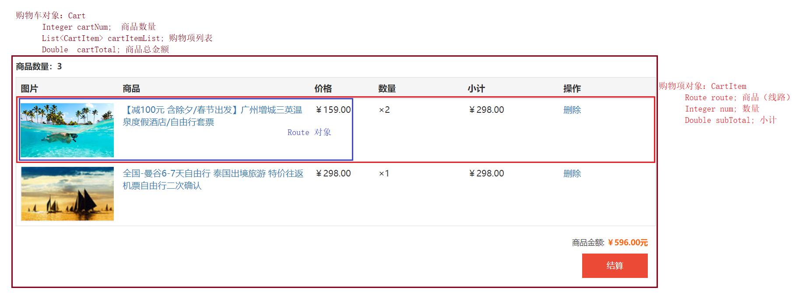
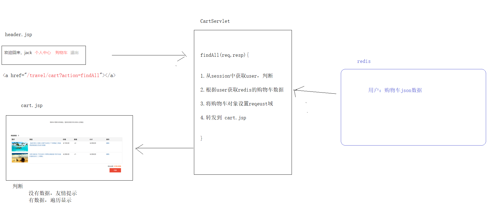
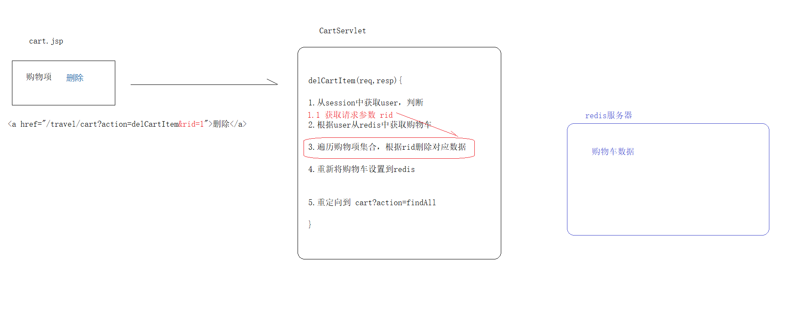

# 购物车功能&订单功能

## 思考：购物车的数据在哪里？

redis: 用来购物车的数据    key:  登录用户名       value:  Cart--json字符串

一个登录用户只能有一个购物车

购物车：Class  Cart{......}

## 购物流程

**消费者购物流程**

1. 浏览商品

2. 加入购物车

   ​        没登录：提示先登录

   ​	登录了：添加数据到购物车（跳转添加成功页面）

3. 查询购物车页面

4. 结算（收货地址、支付方式、商品清单）

5. 下单（生成订单、微信支付）

6. 支付状态（成功、失败）


## 1.购物车功能分析

### 我们在java中怎么来表示一个购物车呢？

 

本次项目中使用的redis来存储购物车数据

好处：用户在退出后，再次登录，还可以查看购物车信息......


## 2.设计购物车的实体类

**Cart.java 购物车对象**

```java
/**
 * 购物车对象
 */
@Data
public class Cart {

    private Integer cartNum;  // 购物车商品数量

    private List<CartItem> cartItemList = new ArrayList<>(); // 购物项列表

    private Double cartTotal; // 购物车总金额

    public Integer getCartNum() {
        cartNum = 0;
        // 计算数量
        for (CartItem cartItem : cartItemList) {
            cartNum += cartItem.getNum();
        }
        return cartNum;
    }

    public Double getCartTotal() {
        cartTotal = 0.0;
        // 计算总金额
        for (CartItem cartItem : cartItemList) {
            cartTotal += cartItem.getSubTotal();
        }
        return cartTotal;
    }
}
```


**CartItem.java 购物项对象**

```java
/**
 * 购物项对象
 */
@Data
public class CartItem {

    private Route route; // 商品（线路）

    private Integer num; // 购买数量

    private Double subTotal; // 小计

    public Double getSubTotal() {
        // 计算小计（单价 × 数量）
        return route.getPrice() * num;
    }
}
```


## 案例一 加入购物数据购物车

### 3.1 需求分析

 

### 3.2 代码实现

#### 1）route_detail.jsp

```jsp
<span class="collect">
    <a class="btn" href="javascript:" id="addCart"><i class="glyphicon glyphicon-heart-empty"></i>加入购物车</a>
</span>
<script>
                    $(function(){
                        $("#addCart").click(function(){
                            // 判断当前用户是否登录
                            var flg=${empty user};
                            if(flg){
                                // 没登录 --模拟 点击登录超链接 弹出登录框
                                $("#loginBtn").click();
                            }else {
                                // 登录了
                                location.href="${pageContext.request.contextPath}/cart?action=addCart&rid=${route.rid}&num="+$("#qty_item_1").val();
                            }
                        })
                    })
</script>
```

#### 2）CartServlet

```java

	// 添加商品到购物车
    private void addCart(HttpServletRequest request, HttpServletResponse response) throws ServletException, IOException {
        // 1 获取商品数量
        int num =Integer.parseInt(request.getParameter("num"));
        // 2 获取商品的rid
        String rid = request.getParameter("rid");
        // 3 根据rid查找route对象
        RouteServiceImpl routeService = new RouteServiceImpl();
        Route route = routeService.findByRoute(rid);
        // 4 获取购物车（从redis中获取）
        User user =(User)request.getSession().getAttribute("user");
        Cart cart=getCartToRedis(user);
                //细节：先判断购物车中是否有该购物项
                                // 1 有：给购物项添加数量即可
                                // 2 没有：放入新的购物项
        CartItem cartItem=cart.findCartItem(Integer.parseInt(rid));
        if(cartItem!=null){
            // 1 有：给购物项添加数量即可
            cartItem.setNum(cartItem.getNum()+num);
        }else{
            // 2 没有：放入新的购物项
            // 5 封装数据到购物项中
            cartItem = new CartItem();
            cartItem.setNum(num);
            cartItem.setRoute(route);
            // 6 封装购物项数据到购物车中
            cart.getCartItemList().add(cartItem);
        }
        // 7 将购物车放入redis中 (key:当前用户的用户名  value:字符串格式的json数据--购物车)
        setCarToRedis(user,cart);
        // 8 将添加的购物项放入request域中带到cart_success.jsp页面展示添加的购物项数据
        request.setAttribute("cartItem",cartItem);
        request.getRequestDispatcher("/cart_success.jsp").forward(request,response);
    }

	// 从redis中获取购物车---可以放入baseServlet中
    public Cart getCartToRedis(User user) throws IOException {
        Jedis jedis = JedisUtils.getJedis();
        String value=jedis.get(user.getUsername());
        if(value!=null){
            // 将value的json数据转换成Cart对象
            ObjectMapper objectMapper = new ObjectMapper();
            Cart cart = objectMapper.readValue(value, Cart.class);
            return cart;
        }else {
            // 创建一个购物车返回
            Cart cart = new Cart();
            return cart;
        }
    }

    // 将购物车放入redis---可以放入baseServlet中
    public void setCarToRedis(User user, Cart cart) throws JsonProcessingException {
        Jedis jedis = JedisUtils.getJedis();
        ObjectMapper objectMapper = new ObjectMapper();
        String value = objectMapper.writeValueAsString(cart);
        jedis.set(user.getUsername(),value);  //luqing  {购物车车}
        jedis.close();
    }
```

#### 3) Cart.java

~~~java
// 查找购物项集合中是否有重复的购物项
public CartItem findCartItem(int rid) {
  for (CartItem cartItem : cartItemList) {
    // 判断
    if(rid==cartItem.getRoute().getRid()){
      // 有购物项
      return cartItem;
    }
  }

  return null;
}
~~~


#### 4）cart_success.jsp

```jsp
<div class="container">
    <div style="margin:0 auto; margin-top:20px">
        <div style="font-weight: bold;font-size: 15px;margin-bottom: 10px">添加购物车成功...</div>
        <table class="table">
            <tbody>
                <tr bgcolor="#f5f5f5" class="table-bordered">
                    <th>图片</th>
                    <th>商品</th>
                    <th>价格</th>
                    <th>数量</th>
                    <th>小计</th>
                </tr>
                <tr class="table-bordered">
                    <td width="180" width="40%">
                        <input type="hidden" name="id" value="22">
                        
                    </td>
                    <td width="30%">
                        <a target="_blank">${cartItem.route.rname}</a>
                    </td>
                    <td width="10%">
                        ￥${cartItem.route.price}
                    </td>
                    <td width="14%">
                        ×${cartItem.num}
                    </td>
                    <td width="15%">
                        <span class="subtotal">￥${cartItem.subTotal}</span>
                    </td>
                </tr >

            </tbody>
        </table>
    </div>
```


## 案例二 查看购物车

### 4.1 需求分析

 


### 4.2 代码实现

#### 1）header.jsp

```jsp
 <a href="${pageContext.request.contextPath}/cart?action=findCart" class="collection">购物车</a>
```


#### 2）CartServlet

```java
// 查看购物车
    private void findCart(HttpServletRequest request, HttpServletResponse response) throws ServletException, IOException {

        //1 获取购物车
        User user =(User) request.getSession().getAttribute("user");
        Cart cart = getCartToRedis(user);
        //2 将购物车保存到request域中
        request.setAttribute("cart",cart);
        //3 请求转发到页面（cart.jsp）展示购物车的数据
        request.getRequestDispatcher("/cart.jsp").forward(request,response);
    }
```


#### 3）cart.jsp

```jsp
<%@ taglib prefix="c" uri="http://java.sun.com/jsp/jstl/core" %>

---------------------------------------------


<div class="container">
    <c:if test="${empty cart.cartItemList}">
        <div class="row" style="margin: 100px 200px;text-align: center">
            购物车内暂时没有商品，登录后将显示您之前加入的商品
        </div>
    </c:if>

    <c:if test="${not empty cart.cartItemList}">
        <div class="row">

            <div style="margin:0 auto; margin-top:20px">
                <div style="font-weight: bold;font-size: 15px;margin-bottom: 10px">商品数量：${cart.cartNum}</div>
                <table class="table">
                    <tbody>
                        <tr bgcolor="#f5f5f5" class="table-bordered">
                            <th>图片</th>
                            <th>商品</th>
                            <th>价格</th>
                            <th>数量</th>
                            <th>小计</th>
                            <th>操作</th>
                        </tr>

                        <c:forEach items="${cart.cartItemList}" var="cartItem">
                            <tr class="table-bordered">
                                <td width="180" width="40%">
                                    <input type="hidden" name="id" value="22">
                                    
                                </td>
                                <td width="30%">
                                    <a target="_blank"> ${cartItem.route.rname}</a>
                                </td>
                                <td width="10%">
                                    ￥${cartItem.route.price}
                                </td>
                                <td width="14%">
                                    ×${cartItem.num}
                                </td>
                                <td width="15%">
                                    <span class="subtotal">￥${cartItem.subTotal}</span>
                                </td>
                                <td>
                                    <a href="javascript:;" class="delete">删除</a>
                                </td>
                            </tr >
                        </c:forEach>
                    </tbody>
                </table>
            </div>
        </div>

        <div>
            <div style="text-align:right;">
                商品金额: <strong style="color:#ff6600;">￥${cart.cartTotal}元</strong>
            </div>
            <div style="text-align:right;margin-top:10px;margin-bottom:10px;">
                <a href="order_info.jsp">
                    <input type="button" width="100" value="结算" name="submit" border="0" style="background-color: #ea4a36;
                                                                                                height:45px;width:120px;color:white;font-size: 15px">
                </a>
            </div>
        </div>
    </c:if>

</div>
```


## 案例三 删除购物项

### 5.1 需求分析

 

### 5.2 代码实现

#### 1）cart.jsp

```jsp
<a href="${pageContext.request.contextPath}/cart?action=delCartItem&rid=${item.route.rid}" class="delete">删除</a>
```


#### 2）CartServlet

```java
// 删除购物车中指定的购物项 展示最新购物车数据
    private void delCartItem(HttpServletRequest request, HttpServletResponse response) throws ServletException, IOException {
        // 1 获取要删除商品的rid
        int rid =Integer.parseInt(request.getParameter("rid"));
        // 2 redis中获取购物车
        User user =(User) request.getSession().getAttribute("user");
        Cart cart = getCartToRedis(user);
        //3 获取购物车中的购物项集合
        List<CartItem> cartItemList = cart.getCartItemList();
        //4 遍历循环购物项
        for (CartItem cartItem : cartItemList) {
             // 5 判断
            if(rid==cartItem.getRoute().getRid()){
                // 6 存在 删除该购物项
                cartItemList.remove(cartItem);
                break;
            }
        }
        //5 将购物车重新放入redis中
        setCarToRedis(user,cart);

        //6 重新展示最新的购物车数据
        response.sendRedirect(request.getContextPath()+"/cart?action=findCart");

    }
```

## 案例四 商品结算

### 6.1 需求分析

**页面所需的数据** 


### 6.2 代码实现

#### 1）cart.jsp

```jsp
<div style="text-align:right;margin-top:10px;margin-bottom:10px;">
                <a href="${pageContext.request.contextPath}/cart?action=createOrder">
					<input type="button" width="100" value="结算" name="submit" border="0" style="background-color: #ea4a36;
						height:45px;width:120px;color:white;font-size: 15px">
            </a>
        </div>
```

#### 2）CartServlet

```java
//创建订单 显示地址 支付方式 购物车的商品清单
    private void createOrder(HttpServletRequest request, HttpServletResponse response) throws ServletException, IOException {

        // 当前用户的地址
        User user =(User)request.getSession().getAttribute("user");
        UserService userService = new UserService();
        List<Address> addList = userService.userAdd(user);
        // 获取购物车
        Cart cart = getCartToRedis(user);
        // 保存地址和购物车
        request.setAttribute("addList",addList);
        request.setAttribute("cart",cart);
        // 到页面展示地址和购物车的数据(order_info.jsp)
        request.getRequestDispatcher("/order_info.jsp").forward(request,response);

    }
```

#### 3）order_info.jsp

```jsp
<div class="container-fluid">
    <form action="pay.jsp" method="post">
        <!-- 头部 end -->
        <div class="cart py-container">
            <!--主内容-->
            <div class="checkout py-container">
                <div class="step-tit">

                    <h4 style="font-weight: bold">填写并核对订单信息</h4>
                </div>
                <div class="checkout-steps">
                    <!--收件人信息-->
                    <div class="step-tit">
                        <h5>收件人信息</h5>
                    </div>
                    <div class="step-cont">
                        <div class="addressInfo">
                            <ul class="addr-detail">
                                <li class="addr-item">

                                    <div>
                                        <c:if test="${not empty addList}">
                                            <c:forEach items="${addList}" var="add">
                                                <div class="con address"><input type="radio" name="addressId" value="1"> ${add.contact}
                                                    ${add.address} <span>${add.telephone}</span></div>
                                            </c:forEach>
                                        </c:if>
                                    </div>
                                </li>
                            </ul>
                        </div>
                        <div class="hr"></div>

                    </div>
                    <div class="hr"></div>
                    <!--支付和送货-->
                    <div class="payshipInfo">
                        <div class="step-tit">
                            <h5>支付方式</h5>
                        </div>
                        <div class="step-cont">
                            <ul class="payType">
                                <li class="selected">微信付款</li>
                            </ul>
                        </div>
                        <div class="hr"></div>
                        <div class="step-tit">
                            <h5>送货清单</h5>
                        </div>
                        <div class="step-cont">
                            <ul class="send-detail">

                                <c:if test="${not empty cart.cartItemList}">
                                    <c:forEach items="${cart.cartItemList}" var="item">
                                        <li>
                                            <div class="sendGoods">
                                                <ul class="yui3-g">
                                                    <li class="yui3-u-1-6">
                                                        <span></span>
                                                    </li>
                                                    <li class="yui3-u-7-12">
                                                        <div class="desc">${item.route.rname}</div>
                                                        <div class="seven">7天无理由退货</div>
                                                    </li>
                                                    <li class="yui3-u-1-12">
                                                        <div class="price">￥${item.subTotal}</div>
                                                    </li>
                                                    <li class="yui3-u-1-12">
                                                        <div class="num">${item.num}</div>
                                                    </li>
                                                    <li class="yui3-u-1-12">
                                                        <div class="exit">有货</div>
                                                    </li>
                                                </ul>
                                            </div>
                                        </li>
                                    </c:forEach>
                                </c:if>
                                <li></li>
                                <li></li>
                            </ul>
                        </div>
                        <div class="hr"></div>
                    </div>
                </div>
            </div>
            <div class="clearfix trade">
                <div class="fc-price">
                   <span class="number">${cart.cartNum}</span>件商品，应付金额:　<span class="price">¥${cart.cartTotal}</span>
                </div>
            </div>
            <div class="submit">
                <button class="sui-btn btn-danger btn-xlarge" >提交订单</button>
            </div>
        </div>
    </form>
</div>
```


## 案例五 生成订单

#### 需求


#### 代码实现

1）order_info.jsp

~~~jsp
<div class="container-fluid">
    <form action="${pageContext.request.contextPath}/order?action=sumOrder" method="post">
    ....
~~~

2) OrderServlet

~~~java
@WebServlet(name = "OrderServlet",urlPatterns = "/order")
public class OrderServlet extends BaseServlet {
    //下单
    private void sumOrder(HttpServletRequest request, HttpServletResponse response) throws ServletException, IOException {

        // 获取地址对象用来封装数据
        String addressId = request.getParameter("addressId");
        AddressService addressService=new AddressServiceImpl();
        // 根据地址id获取地址对象
        Address address=addressService.findAddById(addressId);

        // 创建订单实体进行数据封装（保存）
        Order order = new Order();
        order.setOid(UUID.randomUUID().toString().replace("-", ""));
        order.setOrdertime(new Date());
        //获取购物车封装订单总金额
        User user =(User)request.getSession().getAttribute("user");
        Cart cart = getCartToRedis(user);
        order.setTotal(cart.getCartTotal());
        order.setState(0); //代表未支付
        order.setContact(address.getContact());
        order.setAddress(address.getAddress());
        order.setTelephone(address.getTelephone());
        order.setUser(user);

        // 创建订单下的商品实体进行数据封装（保存）
        List<OrderItem> orderItems=new ArrayList<>(); //订单下的商品集合
        for (CartItem cartItem : cart.getCartItemList()) {
            // 有一个购物项就相当于有一个订单的商品对象
            OrderItem orderItem = new OrderItem();
            orderItem.setItemtime(new Date());
            orderItem.setNum(cartItem.getNum());
            orderItem.setSubtotal(cartItem.getSubTotal());
            orderItem.setRoute(cartItem.getRoute());
            //添加所属的订单
            orderItem.setOrder(order);
            orderItems.add(orderItem);
        }
        //将订单的商品集合放入订单中
        order.setOrderItemList(orderItems);

        // 调用service进行订单的保存和订单下的商品保存
        OrderService orderService = new OrderServiceImpl();
        orderService.save(order);

        // 清空购物车
        Jedis jedis = JedisUtils.getJedis();
        jedis.del(user.getUsername());
        jedis.close();
        // 到支付页面做二维码的扫描支付
        response.sendRedirect(request.getContextPath()+"/pay.jsp");
    }
~~~


3） AddressService和OrderService

~~~java
public interface AddressService {
    // 根据地址id获取地址对象
    Address findAddById(String addressId);
}
~~~

~~~java
public interface OrderService {
    //保存订单及订单下的商品数据
    void save(Order order);
}
~~~

4）AddressServiceImpl和OrderServiceImpl

~~~java
public class AddressServiceImpl implements AddressService {

    // 根据地址id获取地址对象
    public Address findAddById(String addressId) {
        SqlSession sqlSession = MyBatisUtils.openSession();
        AddressDao addressDao = sqlSession.getMapper(AddressDao.class);
        Address address=addressDao.findAddById(addressId);
        sqlSession.close();
        return address;
    }
}
~~~

~~~java
public class OrderServiceImpl implements OrderService {
    //保存订单及订单下的商品数据
    public void save(Order order) {

        SqlSession sqlSession = MyBatisUtils.openSession();
        OrderDao orderDao = sqlSession.getMapper(OrderDao.class);
        // 保存订单
        orderDao.saveOrder(order);

        // 保存订单下的商品
        List<OrderItem> orderItemList = order.getOrderItemList();
        for (OrderItem orderItem : orderItemList) {
            orderDao.saveOrderItem(orderItem);
        }

        sqlSession.commit();
        sqlSession.close();
    }
}
~~~

5） AddressDao和OrderDao

~~~java
public interface AddressDao {

    // 根据地址id获取地址对象
    Address findAddById(String addressId);
}

~~~

~~~java
public interface OrderDao {

    // 保存订单
    void saveOrder(Order order);

    // 保存订单下的商品
    void saveOrderItem(OrderItem orderItem);
}
~~~

7）AddressDao.xml和OrderDao.xml

~~~xml
<mapper namespace="cn.itcast.dao.AddressDao">
    <!--根据地址id获取地址对象-->
    <select id="findAddById" parameterType="string" resultType="address">
        select * from tab_address where aid=#{aid}
    </select>
</mapper>
~~~

~~~xml
<mapper namespace="cn.itcast.dao.OrderDao">
   <!--保存订单-->
    <insert id="saveOrder" parameterType="order">
        INSERT INTO tab_order(oid,ordertime,total,state,address,contact,telephone,uid)
        VALUES(#{oid},#{ordertime},#{total},#{state},#{address},#{contact},#{telephone},#{user.uid})
    </insert>

    <!--保存订单下的商品-->
    <insert id="saveOrderItem" parameterType="orderItem">
      INSERT INTO tab_orderitem(itemtime,num,subtotal,rid,oid)
      VALUES(#{itemtime},#{num},#{subtotal},#{route.rid},#{order.oid})
    </insert>
</mapper>
~~~
