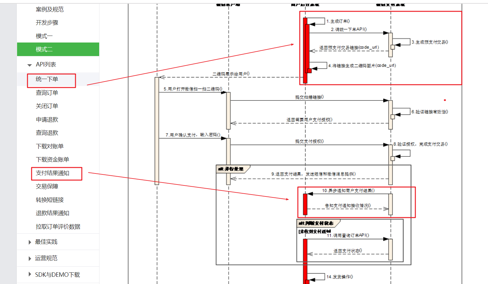
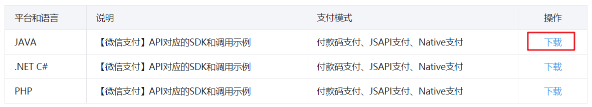
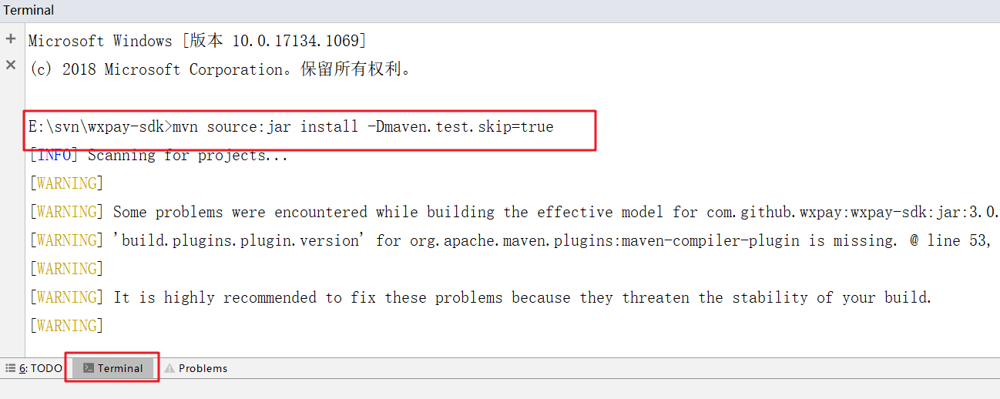
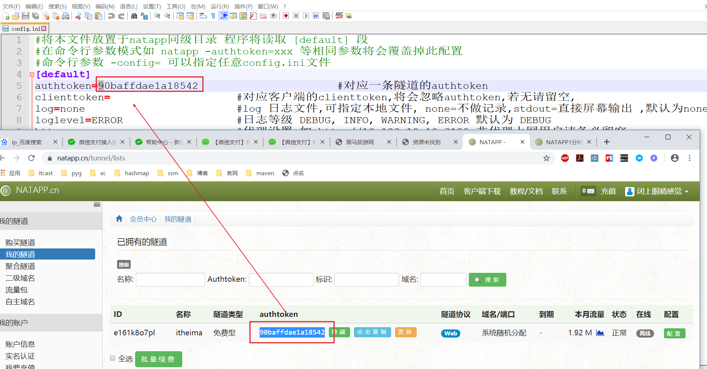

# 微信支付&linux基础

**今日目标**

```markdown
微信支付
linux命令
```


## 一: 二维码

### 1.1 什么是二维码

​	二维码又称QR Code，QR全称Quick Response，是一个近几年来移动设备上超流行的一种编码方式，它比传统的Bar Code条形码能存更多的信息，也能表示更多的数据类型。

​	


### 1.2 二维码优势

- 信息容量大, 可以容纳多达1850个大写字母或2710个数字或500多个汉字
- 应用范围广, 支持文字,声音,图片等等...
- 容错能力强, 即使图片出现部分破损也能使用
  - L级（低） 7％的码字可以被容错。
  - M级（中） 15％的码字可以容错。
  - Q级（四分）25％的码字可以被容错。
  - H级（高）30％ 的码字可以被容错。
- 成本低, 容易制作


### 1.3 二维码生成插件qrious

qrious是一款纯JS二维码生成插件。通过qrious.js可以快速生成各种二维码，你可以控制二维码的尺寸颜色，还可以将生成的二维码进行Base64编码。[官网](https://github.com/davidshimjs/qrcodejs)

qrious.js二维码插件的可用配置参数如下：

| 参数         | 类型     | 默认值         | 描述                      |
| ---------- | ------ | ----------- | ----------------------- |
| background | String | "white"     | 二维码的背景颜色。               |
| foreground | String | "black"     | 二维码的前景颜色。               |
| level      | String | "L"         | 二维码的误差校正级别(L, M, Q, H)。 |
| mime       | String | "image/png" | 二维码输出为图片时的MIME类型。       |
| size       | Number | 100         | 二维码的尺寸，单位像素。            |
| value      | String | ""          | 需要编码为二维码的值              |

**插件qrious快速入门**

```markdown
1. 找到今天资料，qrious插件  /dist/umd/qrious.js

2. 定位到index.html，翻看源码

3. 页面引入 qrious.jsp 脚本

4. 创建
       var qr = window.qr = new QRious({
           element: document.getElementById('id'),
           size: 250,
           value: 'http://down.admin5.com'
       });
       
5. 注意我们生成二维码的 标签是
```

```html
<!DOCTYPE html>
<html lang="zh-CN">
<head>
    <meta charset="UTF-8">
    <title>二维码生成的小demo</title>

</head>
<body>

<script src="js/qrious.js"></script>
<script>
    var qr = new QRious({
        element:document.getElementById('qrious'),
        size:250,
        value:'http://www.itcast.cn'
    });
</script>
</body>
</html>
```


## 二: 微信扫码支付简介 （商家二维码）

### 2.1微信扫码支付申请【了解】

微信扫码支付是商户系统按微信支付协议生成支付二维码，用户再用微信“扫一扫”完成支付的模式。该模式适用于PC网站支付、实体店单品或订单支付、媒体广告支付等场景。

申请步骤：（了解）

**第一步：注册公众号（类型须为：服务号）**

请根据营业执照类型选择以下主体注册：[个体工商户](http://kf.qq.com/faq/120911VrYVrA151009JB3i2Q.html)| [企业/公司](http://kf.qq.com/faq/120911VrYVrA151013MfYvYV.html)| [政府](http://kf.qq.com/faq/161220eaAJjE161220IJn6zU.html)| [媒体](http://kf.qq.com/faq/161220IFBJFv161220YnqAbQ.html)| [其他类型](http://kf.qq.com/faq/120911VrYVrA151013nYFZ7Z.html)。

**第二步：认证公众号**

公众号认证后才可申请微信支付，认证费：300元/次。

**第三步：提交资料申请微信支付**

登录公众平台，点击左侧菜单【微信支付】，开始填写资料等待审核，审核时间为1-5个工作日内。

**第四步：开户成功，登录商户平台进行验证**

资料审核通过后，请登录联系人邮箱查收商户号和密码，并登录商户平台填写财付通备付金打的小额资金数额，完成账户验证。

**第五步：在线签署协议**

本协议为线上电子协议，签署后方可进行交易及资金结算，签署完立即生效。

#### 结论：本课程已经提供好“传智播客”的微信支付账号，学员无需申请。


### 2.2 开发文档

在线微信支付开发文档：

<https://pay.weixin.qq.com/wiki/doc/api/index.html>

扫码支付的流程图

**微信支付接口调用的整体思路：**

- 1、商户生成订单
- 2、商户调用微信下单接口，获取预交易的链接
- 3、商户将链接生成二维码图片，展示给用户；
- 4、等待微信返回支付结果通知：
  - 微信异步通知商户支付结果，商户告知微信支付接收情况
- 5、如果支付成功，发货，修改订单状态


**在前面的业务中，我们已经完成了：**

- 1、生成订单

**接下来，我们需要做的是：**

- 2、调用微信下单接口，生成链接。
- 3、根据链接生成二维码图片
- 4、支付成功后修改订单状态


关注点：

1. 如何下单完调用微信生成支付的URL
2. 如何接受微信返回的支付结果



### 2.3 API【了解】

#### 1）统一下单

**请求路径**

调用微信支付

**请求参数**

| 字段名    | 变量名              | 必填   | 类型          | 示例值                                    | 描述                                       |
| :----- | ---------------- | ---- | ----------- | -------------------------------------- | ---------------------------------------- |
| 公众账号ID | appid            | 是    | String(32)  | wxd678efh56                            | 微信支付分配的公众账号ID                            |
| 商户号    | mch_id           | 是    | String(32)  | 1230000109                             | 微信支付分配的商户号                               |
| 随机字符串  | nonce_str        | 是    | String(32)  | 5K8264ILT                              | 随机字符串，长度要求在32位以内                         |
| 签名     | sign             | 是    | String(32)  | C380BEC2B                              | 通过签名算法计算得出的签名值                           |
| 商品描述   | body             | 是    | String(128) | 乐优手机                                   | 商品简单描述                                   |
| 商户订单号  | out_trade_no     | 是    | String(32)  | 20150806125                            | 商户系统内部订单号                                |
| 标价金额   | total_fee        | 是    | Int         | 88                                     | 订单总金额，单位为分                               |
| 终端IP   | spbill_create_ip | 是    | String(16)  | 123.12.12.123                          | APP和网页支付提交用户端ip，Native支付填调用微信支付API的机器IP。 |
| 通知地址   | notify_url       | 是    | String(256) | http://www.weixin.qq.com/wxpay/pay.php | 异步接收微信支付结果通知的回调地址，通知url必须为外网可访问的url，不能携带参数。 |
| 交易类型   | trade_type       | 是    | String(16)  | JSAPI                                  | JSAPI 公众号支付；NATIVE 扫码支付                  |

**这些参数大致分成3类：**

- appid、mch_id、spbill_create_ip、notify_url、trade_type：是商家自己的信息或固定数据，可以提前配置，因此无需每次请求单独配置，而是统一设置好即可，
- nonce_str、sign：是为了保证数据安全而添加的验证数据，根据算法去生成，每次请求自动生成即可。
- notify_url、out_trade_no、total_fee：订单相关信息，需要我们自己填写。


注意：请求完毕之后，微信会将支付连接给我们，我们只需要生成二维码展示给用户即可

### 2.4 SDK

虽然请求参数比较复杂，但官方已经提供了SDK，供我们使用；

 

但是微信没有提供maven仓库坐标，因此我们必须下载使用，建议使用资料中提供给大家的SDK

**把提供的SDK打包并安装到本地的maven仓库：**

```mvn
mvn source:jar install -Dmaven.test.skip=true
```



**在travel中引入坐标【已完成】：**

```xml
<dependency>
    <groupId>com.github.wxpay</groupId>
    <artifactId>wxpay-sdk</artifactId>
    <version>3.0.9</version>
</dependency>
```


**为了简化API参数的封装，提前准备了工具类：**

 


## 三: 下单实现

### 3.1 需求分析


### 3.2 代码实现

#### 1）OrderServlet

```java
// 生成订单
protected void subOrder(HttpServletRequest request, HttpServletResponse response) throws ServletException, IOException {
    // 订单代码省略
    ................
      	//调用微信支付，带着支付地址到页面生成二维码
        String wxUrl = PayUtils.createOrder(order.getOid(), 1);//1分
        request.setAttribute("wxUrl",wxUrl);
        request.setAttribute("oid",order.getOid());
        request.getRequestDispatcher("/pay.jsp").forward(request,response);
}
```

#### 2）pay.jsp

```jsp

<script src="js/qrious.js"></script>
<script>
    // 生成二维码
    new QRious({
        element: document.getElementById('qrious'),
        level: 'L', 
        size: 300,
        value: '${wxUrl}'
    })
</script>
```

## 四: 支付结果通知实现（修改订单支付状态）

### 4.1 notify_url

统一下单请求参数中有一个非常重要的，叫做notify_url的：

  

基于上文的介绍我们知道，这个地址是在支付成功后的异步结果通知。官网介绍如下：

支付完成后，微信会把相关支付结果和用户信息发送给商户，商户需要接收处理（修改订单状态），并返回应答。

所以，此处的地址必须是一个外网可访问地址，而且我们要定义好回调的处理接口。

http://localhost:8080/travel/pay

**注意：通知url必须为直接可访问的url，不能携带参数**


### 4.2  内网穿透

此处我们肯定不能写：http://localhost:8080/travel/pay，这个域名是本地，是不被外网识别的。如何才能获取一个能够外网访问的域名呢？

我们可以通过内网穿透来实现，那么什么是内网穿透呢？ 

**简单来说内网穿透：让外网能访问你本地的应用，例如在外网打开你本地http://127.0.0.1的指向Web站点。** 

在这里有一篇播客，详细介绍了几种内网穿透策略：[一分钟了解内网穿透](https://blog.csdn.net/zhangguo5/article/details/77848658?utm_source=5ibc.net&utm_medium=referral)

在这里我们使用一个免费的内网穿透工具：Natapp：[NATAPP官网](https://natapp.cn)

在这里有详细教程：[一分钟的natapp快速新手教程](https://natapp.cn/article/natapp_newbie)

 


**PayUtils中配置url回调地址**

```java
/**
 * 微信支付工具类
 */
public class PayUtils {

    private static WXPay wxPay;

    // 支付成功回调地址
    private static String notifyUrl = "http://netapp生成的外网地址/travel_demo/pay";
}
```

#### 支付结果通知

支付完成后，微信会把相关支付结果和用户信息发送给商户，商户需要接收处理，并返回应答。

微信服务会自动向`notify_url`地址发起POST请求：

------

通信成功，会返回下面信息：

| 字段名   | 变量名          | 必填   | 类型         | 示例值     | 描述                 |
| :---- | :----------- | :--- | :--------- | :------ | :----------------- |
| 商户订单号 | out_trade_no | 是    | String(32) | 1212321 | 商户系统内部订单号，要求32个字符内 |
| 业务结果  | result_code  | 是    | String(16) | SUCCESS | SUCCESS/FAIL       |

**我们需要返回给微信的参数**

| 字段名   | 变量名         | 必填   | 类型          | 示例值     | 描述      |
| :---- | :---------- | :--- | :---------- | :------ | :------ |
| 返回状态码 | return_code | 是    | String(16)  | SUCCESS | 请按示例值填写 |
| 返回信息  | return_msg  | 是    | String(128) | OK      | 请按示例值填写 |

~~~xml
<xml>
  <return_code><![CDATA[SUCCESS]]></return_code>
  <return_msg><![CDATA[OK]]></return_msg>
</xml>
~~~

### 4.4 代码实现

#### 1）PayServlet

```java
// 支付结果通知servlet
@WebServlet(name = "PayServlet",urlPatterns = "/pay")
public class PayServlet extends HttpServlet {
    protected void doPost(HttpServletRequest request, HttpServletResponse response) throws ServletException, IOException {
        // 接受返回的内容
        ServletInputStream inputStream = request.getInputStream();
        // 将请求流中的xml转换成map数据
        XmlMapper xmlMapper = new XmlMapper();
        Map<String,String> map = xmlMapper.readValue(inputStream, Map.class);
        // 校验是否确定付款
        String result = map.get("result_code");
        if("FAIL".equals(result)){
            response.getWriter().print("微信支付失败...");
            return;
        }
        // 获取返回的订单号
        String orderId = map.get("out_trade_no");
        PayService payService=new PayServiceImpl();
        // 根据订单号修改订单支付状态
        payService.updateState(orderId);

        // 给微信回信息
        Map<String,String> responseMap=new HashMap();
        responseMap.put("return_code","SUCCESS");
        responseMap.put("return_msg","OK");
        // 转换为xml数据给微信
        String xml = xmlMapper.writeValueAsString(responseMap);
        response.getWriter().print(xml);

    }

    protected void doGet(HttpServletRequest request, HttpServletResponse response) throws ServletException, IOException {
        doPost(request,response);
    }
}
```

#### 2）导入 jack家族xml解析坐标

```xml
<dependency>
    <groupId>com.fasterxml.jackson.dataformat</groupId>
    <artifactId>jackson-dataformat-xml</artifactId>
    <version>2.9.9</version>
</dependency>
```

#### 3）PayServiceImpl

```java
@Override
public void updateState(String orderId) {
        SqlSession sqlSession = MyBatisUtils.openSession();
        PayDao payDao = sqlSession.getMapper(PayDao.class);
  		// 根据订单id修改订单状态
        payDao.updateState(orderId);
        sqlSession.commit();
        sqlSession.close();
    }
```

#### 4）PayDao

```java
void updateState(String orderId);
```

#### 5）PayDao.xml

~~~xml
<update id="updateState" parameterType="string">
        update tab_order set state=1 where oid=#{oid}
 </update>
~~~

## 五: 支付状态查询

### 5.1 需求分析


### 5.2 代码实现

#### 1）pay.jsp

```jsp
<%--定时器5秒钟查询是否支付成功跳到支付成功页面--%>
<script>
    $(function(){
        setInterval(function(){
            var url="${pageContext.request.contextPath}/order";
            var data="action=isPay&oid=${oid}";
            $.post(url,data,function(d){
                if(d==1){
                    //支付完成
                    location.href="${pageContext.request.contextPath}/pay_success.jsp";
                }
            })
        },5000);
    })
</script>

<%--一次性定时器10分钟后查询是否支付，没支付跳到支付失败页面--%>
<script>
   $(function(){
       setTimeout(function(){
           location.href="${pageContext.request.contextPath}/pay_fail.jsp";
       },15000);
   })
</script>
```

#### 2）OrderServlet

```java
// 查询支付状态
    private void isPay(HttpServletRequest request, HttpServletResponse response) throws ServletException, IOException {
        //获取订单id
        String oid = request.getParameter("oid");
        PayService payService=new PayServiceImpl();
        // 查询订单支付状态
        int state=payService.isPay(oid);
        // 返回支付状态
        response.getWriter().print(state);

    }
```

#### 3）PayServiceImpl

```java
@Override
    public int isPay(String oid) {
        SqlSession sqlSession = MyBatisUtils.openSession();
        PayDao payDao = sqlSession.getMapper(PayDao.class);
        return payDao.isPay(oid);
    }
```

#### 4）PayDao

```java
int isPay(String oid);
```

#### 5)  PayDao.xml

~~~xml
 <select id="isPay" parameterType="string" resultType="int">
        select state from tab_order where oid=#{oid}
 </select>
~~~


