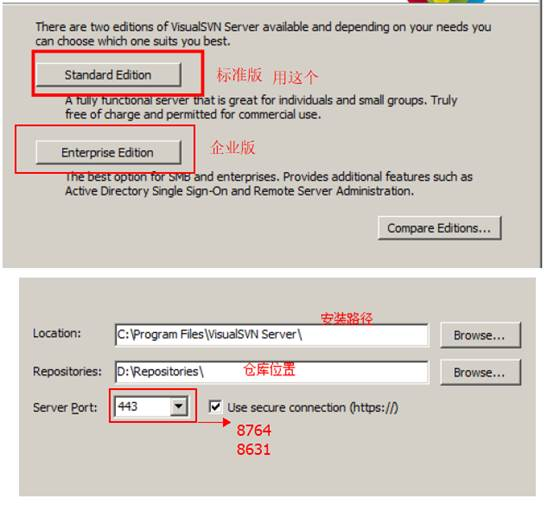
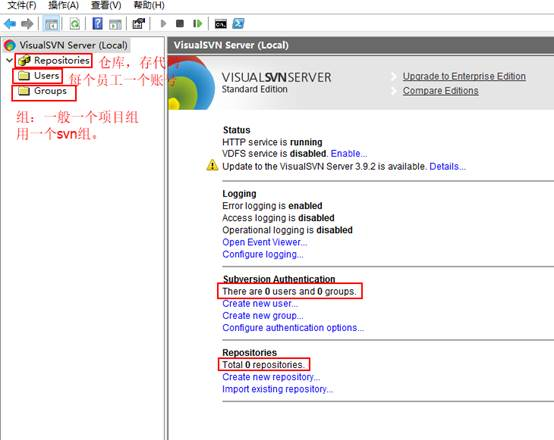
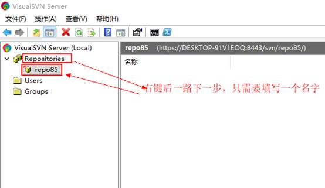
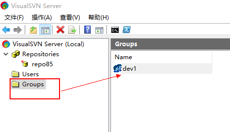
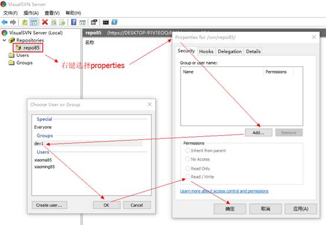
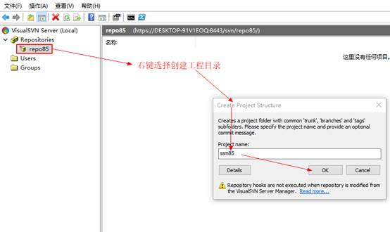
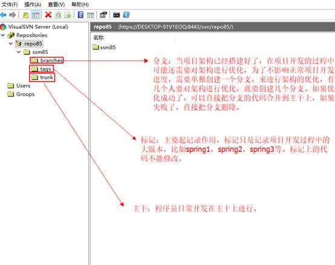
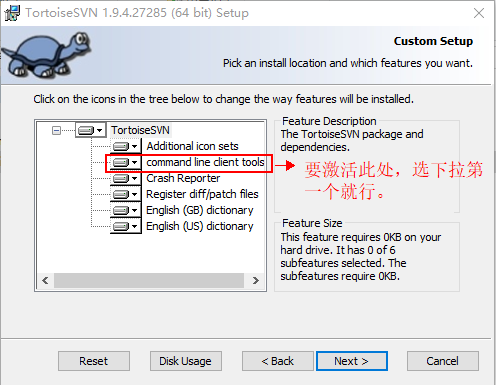
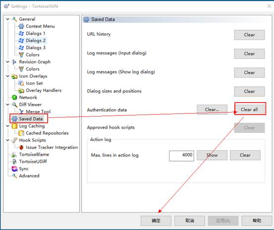

# SVN的概述

~~~
Svn是一个项目版本管理工具，可以用于项目分享，项目合并，代码回溯的管理工具
~~~

## 1.1 Svn的使用流程图

## 1.2   Svn相关资料说明

今日资料中--svn资料--（服务端  客户端）

## 1.3   安装svn服务器（需要关注点）

## 1.4   Svn服务器查看界面

# 2 Svn服务器相关操作

## 2.1   创建仓库

## 2.2   创建用户

## 2.3   创建组

## 2.4   给仓库授权

## 2.5 工程目录说明

### 2.5.1 创建工程目录

### 2.5.2 工程目录中三个文件夹说明

# 3 桌面客户端操作

## 3.1   安装客户端（关注的点）

除了下面这一个界面需要注意，其余都是下一步，安装完后要重启电脑。

## 3.2   桌面客户端操作代码【了解】

### 3.2.1      清理所有之前svn登录的信息

右键电脑空白处，选择svn，选择settings，出现如下界面：

