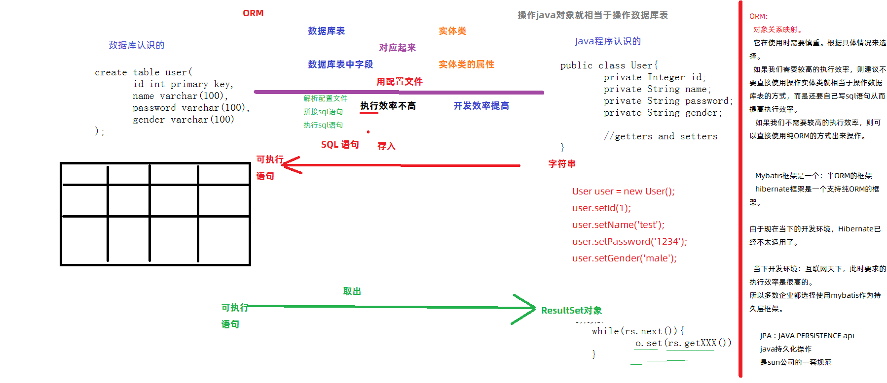
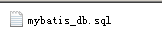
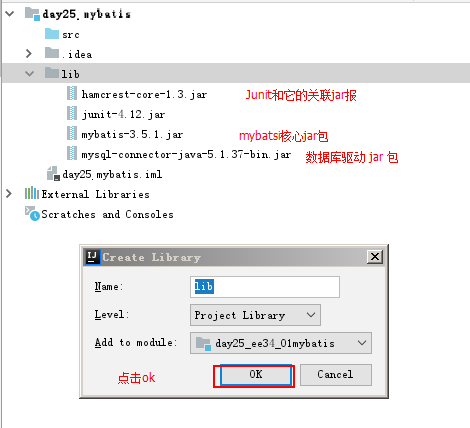

# Mybatis-入门

# 1 概念部分

## 1.1 三层架构和框架

### 1.1.1 三层架构

​    三层架构是我们开发中使用的软件设计结构，它由表现层，业务层和持久层组成。

​	其中表现层，用于接收和响应来自客户端的请求

​	业务层，用于处理实际开发需求。

​	持久层，用于和数据库交互，实现对数据的CRUD操作。

### 1.1.2 框架

​	它封装了一些繁琐的重复性的代码，让我们的开发更加聚焦具体的业务功能。简化我们的开发

## 1.2 mybatis简介

### 1.2.1 ORM详述



### 1.2.2 mybatis介绍

​          mybatis是apache开发的一套持久层框架，用于简化我们数据库操作的。

# 2 入门案例

## 2.1 准备阶段

### 2.1.1 创建数据库和导入数据表



### 2.1.2 创建工程和导入jar包



## 2.2 开发阶段

### 2.2.1 编写实体类

```java
/**
 * 实体类
 * @author 黑马程序员
 * @Company http://www.itheima.com
 * 1.类都是public的
 * 2.类中成员变量都是private的
 * 3.私有成员变量都提供public的get和set方法
 * 4.要有默认构造函数
 * 5.一般都需要实现Serializable接口。
 */
public class User implements Serializable {

    private Integer id;
    private String username;
    private Date birthday;
    private String sex;
    private String address;


    public Integer getId() {
        return id;
    }

    public void setId(Integer id) {
        this.id = id;
    }

    public String getUsername() {
        return username;
    }

    public void setUsername(String username) {
        this.username = username;
    }

    public Date getBirthday() {
        return birthday;
    }

    public void setBirthday(Date birthday) {
        this.birthday = birthday;
    }

    public String getSex() {
        return sex;
    }

    public void setSex(String sex) {
        this.sex = sex;
    }

    public String getAddress() {
        return address;
    }

    public void setAddress(String address) {
        this.address = address;
    }

    @Override
    public String toString() {
        return "User{" +
                "id=" + id +
                ", username='" + username + '\'' +
                ", birthday=" + birthday +
                ", sex='" + sex + '\'' +
                ", address='" + address + '\'' +
                '}';
    }
}
```

### 2.2.2 编写dao接口

```java
/**
 * 用户的持久层接口
 * @author 黑马程序员
 * @Company http://www.itheima.com
 */
public interface UserDao {

    /**
     * 查询所有用户
     * @return
     */
    List<User> findAll();
}
```

### 2.2.3 编写mybatis核心配置文件

```xml
<?xml version="1.0" encoding="UTF-8" ?>
<!DOCTYPE configuration PUBLIC "-//mybatis.org//DTD Config 3.0//EN" "http://mybatis.org/dtd/mybatis-3-config.dtd">
<!--配置mybatis的核心部分：包括连接数据库的信息，事务相关信息和映射配置相关信息-->
<configuration>
    <!--配置mybatis的环境-->
    <environments default="mysql">
        <!--配置mysql的环境-->
        <environment id="mysql">
            <!--配置事务  本地JDBC事务和分布式事务（我们目前还不太了解什么是分布式，所以此时我们只写固定的本地事务配置）-->
            <transactionManager type="JDBC"></transactionManager>
            <!--配置连接数据库的信息和是否使用连接池，它的取值：POOLED(使用连接池)和UNPOOLED(不使用连接池)-->
            <dataSource type="POOLED">
                <!--配置连接数据库的基本信息-->
                <property name="driver" value="com.mysql.jdbc.Driver"></property>
                <property name="url" value="jdbc:mysql://localhost:3306/mybatis_db"></property>
                <property name="username" value="root"></property>
                <property name="password" value="1234"></property>
            </dataSource>
        </environment>
    </environments>

    <!--配置映射文件的位置：映射文件中配置的是具体的操作内容-->
    <mappers>
        <mapper resource="com/itheima/dao/UserDao.xml"></mapper>
    </mappers>
</configuration>
```

### 2.2.4 编写mybatis映射配置文件

```xml
<?xml version="1.0" encoding="UTF-8" ?>
<!DOCTYPE mapper PUBLIC "-//mybatis.org//DTD Mapper 3.0//EN" "http://mybatis.org/dtd/mybatis-3-mapper.dtd">
<mapper namespace="com.itheima.dao.UserDao">
    <!--配置查询所有-->
    <select id="findAll" resultType="com.itheima.domain.User">
        select * from user;
    </select>
</mapper>
```

## 2.3 测试阶段-编写测试类

```java
/**
 * 测试mybatis的入门案例环境
 * @author 黑马程序员
 * @Company http://www.itheima.com
 */
public class UserTest {

    /**
     * mybatis的编码步骤
     *   1.读取配置文件
     *   2.创建Mybatis的SqlSession工厂的构建对象：SqlSessionFactoryBuilder
     *   3.构建SqlSession工厂
     *   4.生产SqlSession对象
     *   5.创建dao接口的代理实现类
     *   6.执行dao接口中的方法：查询所有
     *   7.输出结果集
     *   8.释放资源
     *
     *   ===========================================
     *   构建者设计模式：
     *        也叫Build模式，它是通过构建对象来去创建我们的想要对象，从而把构建过程和核心对象的功能分开。
     *        使构建过程更加独立。在升级时，可以提升代码的灵活度。
     *        构建对象在当前案例中就是：SqlSessionFactoryBuilder
     *
     * @param args
     */
    public static void main(String[] args)throws Exception {
        //1.读取配置文件
        InputStream in = Resources.getResourceAsStream("SqlMapConfig.xml");
        //2.创建SqlSessionFactoryBuilder
        SqlSessionFactoryBuilder builder = new SqlSessionFactoryBuilder();//施工单位:关注建造工厂
        //3.创建SqlSessionFactory
        SqlSessionFactory factory = builder.build(in);//工厂：关注生产的对象
        //4.创建SqlSession
        SqlSession sqlSession = factory.openSession();
        //5.创建Dao接口的代理对象
        UserDao proxyUserDao = sqlSession.getMapper(UserDao.class);
        //6.执行查询所有方法
        List<User> users = proxyUserDao.findAll();
        //7.输出查询结果
        for(User user : users){
            System.out.println(user);
        }
        //8.释放资源
        sqlSession.close();
        in.close();
    }
}
```

# 3 mybatis基于传统dao实现类的开发

> 可以创建一个工程，把入门案例的代码拷贝进去

## 3.1 编写dao接口

```java
/**
 * 用户的持久层接口
 * @author 黑马程序员
 * @Company http://www.itheima.com
 */
public interface UserDao {

    /**
     * 查询所有用户
     * @return
     */
    List<User> findAll();
}
```

## 3.2 编写dao实现类

```java
/**
 * 用户的持久层实现类
 * @author 黑马程序员
 * @Company http://www.itheima.com
 */
public class UserDaoImpl implements UserDao {

    private SqlSessionFactory factory;

    public void setFactory(SqlSessionFactory factory) {
        this.factory = factory;
    }

    public UserDaoImpl(SqlSessionFactory factory){
        this.factory = factory;
    }

    public UserDaoImpl(){

    }

    @Override
    public List<User> findAll() {
        //1.使用工厂获取SqlSession对象
        SqlSession sqlSession = factory.openSession();
        //2.执行查询所有的方法
        List<User> list = sqlSession.selectList("com.itheima.dao.UserDao.findAll");
        //3.关闭sqlSession
        sqlSession.close();
        //4.返回
        return list;
    }
}
```

## 3.3 编写测试类

```java
/**
 * 测试编写dao实现类方式的环境
 * @author 黑马程序员
 * @Company http://www.itheima.com
 */
public class UserTest {

    public static void main(String[] args) throws Exception{
        //1.读取配置文件
        InputStream in = Resources.getResourceAsStream("SqlMapConfig.xml");
        //2.创建SqlSessionFactoryBuilder
        SqlSessionFactoryBuilder builder = new SqlSessionFactoryBuilder();//施工单位:关注建造工厂
        //3.创建SqlSessionFactory
        SqlSessionFactory factory = builder.build(in);//工厂：关注生产的对象
        //4.创建dao的实现类
        UserDao userDao = new UserDaoImpl(factory);
        //5.执行查询所有
        List<User> users = userDao.findAll();
        //6.输出查询结果
        for(User user : users){
            System.out.println(user);
        }
        //7.释放资源
        in.close();
    }
}
```

> 其余代码和入门案例相同。

# 4 mybatis基于代理dao的CRUD操作

> 可以创建一个工程，拷贝入门案例中的dao接口和domain，以及mybatis核心配置文件

## 4.1 编写dao接口方法

```java
/**
 * 用户的持久层接口
 * @author 黑马程序员
 * @Company http://www.itheima.com
 */
public interface UserDao {

    /**
     * 查询所有用户
     * @return
     */
    List<User> findAll();

    /**
     * 根据id查询
     * @param id
     * @return
     */
    User findById(Integer id);

    /**
     * 保存
     * @param user
     */
    int save(User user);

    /**
     * 更新
     * @param user
     */
    int update(User user);

    /**
     * 根据id删除
     * @param id
     */
    int delete(Integer id);
}

```

## 4.2 编写dao的映射配置

```xml
<?xml version="1.0" encoding="UTF-8" ?>
<!DOCTYPE mapper PUBLIC "-//mybatis.org//DTD Mapper 3.0//EN" "http://mybatis.org/dtd/mybatis-3-mapper.dtd">
<mapper namespace="com.itheima.dao.UserDao">
    <!--查询所有-->
    <select id="findAll" resultType="User">
        select * from user
    </select>
    
    
    <!--根据id查询-->
    <select id="findById" resultType="user">
        <!--在mybatis框架的sql语句中，占位符不再是?的形式，而是#{}的形式-->
        select * from user where user_id = #{id}
    </select>


    <!--保存-->
    <insert id="save" parameterType="User">
        <!--参数的名称必须和实体类中属性的名称一致（属性名称指的是get/set方法后面的部分，并且要把首字母改成小写）-->
        insert into user(username,birthday,sex,address)values(#{username},#{birthday},#{sex},#{address});
    </insert>


    <!--更新-->
    <update id="update" parameterType="User">
        update user set username=#{username},sex=#{sex},birthday=#{birthday},address=#{address} where id = #{id} ;
    </update>


    <!--删除-->
    <delete id="delete" parameterType="INT">
        delete from user where id = #{id};
    </delete>
</mapper>
```

## 4.3 编写测试方法

```java
/**
 * 测试方法
 * @author 黑马程序员
 * @Company http://www.itheima.com
 */
public class UserTest {

    /**
     * 测试查询所有
     */
    @Test
    public void testFindAll() throws Exception{
        //1.执行查询所有方法
        List<User> users = proxyUserDao.findAll();
        //2.输出查询结果
        for(User user : users){
            System.out.println(user);
        }
    }

    /**
     * 测试查询一个
     */
    @Test
    public void testFindById()throws Exception{
        //1.执行根据id查询的方法
        User user = proxyUserDao.findById(1);
        //2.输出结果
        System.out.println(user);

    }

    /**
     * 测试保存
     * 实际开发中，都是要考虑事务的。
     * Mybatis的事务默认是手动提交的。
     */
    @Test
    public void testSave(){
        User user = new User();
        user.setUserName("ee34_test");
        user.setAddress("北京市顺义区");
        user.setSex("男");
        user.setBirthday(new Date());
        proxyUserDao.save(user);
        System.out.println(user.getId());
    }


    /**
     * 测试更新
     */
    @Test
    public void testUpdate(){
        //1.根据id查询 一个用户出来
        User user = proxyUserDao.findById(41);
        //2.设置数据
        user.setBirthday(new Date());
        user.setSex("女");
        //3.执行更新
        proxyUserDao.update(user);

    }

    /**
     * 测试删除
     */
    @Test
    public void testDelete(){
        int res = proxyUserDao.delete(53);
        System.out.println(res);
    }


    private UserDao proxyUserDao;
    private InputStream in;
    private SqlSession sqlSession;
    /**
     * 前期准备
     */
    @Before//测试方法执行执行执行
    public void init() throws  Exception{
        //1.读取配置文件
        in = Resources.getResourceAsStream("SqlMapConfig.xml");
        //2.创建SqlSessionFactoryBuilder
        SqlSessionFactoryBuilder builder = new SqlSessionFactoryBuilder();//施工单位:关注建造工厂
        //3.创建SqlSessionFactory
        SqlSessionFactory factory = builder.build(in);//工厂：关注生产的对象
        //4.创建SqlSession
        sqlSession = factory.openSession();
        //5.创建Dao接口的代理对象
        proxyUserDao = sqlSession.getMapper(UserDao.class);
    }


    /**
     * 释放资源
     * @throws Exception
     */
    @After//测试方法执行之后执行
    public void destroy()throws Exception {
        //事务提交
        sqlSession.commit();
        //释放资源
        sqlSession.close();
        in.close();
    }
}
```

# 5 mybatis中配置项

## 5.1 返回保存时id的值

```xml
<!--保存-->
    <insert id="save" parameterType="User">
        <!--配置保存时获取id的信息，通常情况下都是在自增长时使用-->
        <selectKey keyColumn="id" keyProperty="id" resultType="int">
            select last_insert_id();
        </selectKey>
        <!--参数的名称必须和实体类中属性的名称一致（属性名称指的是get/set方法后面的部分，并且要把首字母改成小写）-->
        insert into user(username,birthday,sex,address)values(#{username},#{birthday},#{sex},#{address});
    </insert>
```

## 5.2 配置别名

```xml
 <!--配置实体类的别名，当配置了别名之后，映射配置文件中ResultType和ParameterType就可以只写实体类的短类名，同时忽略大小写-->
<typeAliases>
    <!--配置单个类的别名
        <typeAlias type="com.itheima.domain.User" alias="user"></typeAlias>-->

    <!--指定实体类所在的包-->
    <package name="com.itheima.domain"></package>
</typeAliases>
```

## 5.3 配置实体类属性和数据库列名的对应关系

### 5.3.1 创建一个新的数据库表

```sql
CREATE TABLE `user` (
  `user_id` int(11) NOT NULL AUTO_INCREMENT,
  `user_name` varchar(32) NOT NULL COMMENT '用户名称',
  `user_birthday` datetime DEFAULT NULL COMMENT '生日',
  `user_sex` varchar(10) DEFAULT NULL COMMENT '性别',
  `user_address` varchar(256) DEFAULT NULL COMMENT '地址',
  PRIMARY KEY (`user_id`)
) ENGINE=InnoDB AUTO_INCREMENT=2 DEFAULT CHARSET=utf8;
```

### 5.3.2 编写新的实体类

```java
public class User implements Serializable {

    private Integer userId;
    private String userName;
    private String userSex;
    private String userAddress;
    private Date userBirthday;

    public Integer getUserId() {
        return userId;
    }

    public void setUserId(Integer userId) {
        this.userId = userId;
    }

    public String getUserName() {
        return userName;
    }

    public void setUserName(String userName) {
        this.userName = userName;
    }

    public String getUserSex() {
        return userSex;
    }

    public void setUserSex(String userSex) {
        this.userSex = userSex;
    }

    public String getUserAddress() {
        return userAddress;
    }

    public void setUserAddress(String userAddress) {
        this.userAddress = userAddress;
    }

    public Date getUserBirthday() {
        return userBirthday;
    }

    public void setUserBirthday(Date userBirthday) {
        this.userBirthday = userBirthday;
    }

    @Override
    public String toString() {
        return "User{" +
                "userId=" + userId +
                ", userName='" + userName + '\'' +
                ", userSex='" + userSex + '\'' +
                ", userAddress='" + userAddress + '\'' +
                ", userBirthday=" + userBirthday +
                '}';
    }
}

```

### 5.3.3 编写映射配置文件中的对应关系

```xml
<!--建立实体类和数据库表的对应关系
        id属性：用于提供一个唯一标识
        type属性：用于指定封装的实体类名称
-->
    <resultMap id="userMap" type="user">
        <!--建立对应关系-->
        <id property="userId" column="user_id"></id>
        <result property="userName" column="user_name"></result>
        <result property="userSex" column="user_sex"></result>
        <result property="userAddress" column="user_address"></result>
        <result property="userBirthday" column="user_birthday"></result>
    </resultMap>
```

### 5.3.4 引用resultType

```xml
<!--根据id查询-->
    <select id="findById" resultMap="userMap">
        select * from user where user_id = #{id}
    </select>
```

## 5.4 配置读取properties文件的位置

```xml
<!--指定连接数据库信息文件的位置-->
<properties resource="jdbc.properties"></properties>
```

