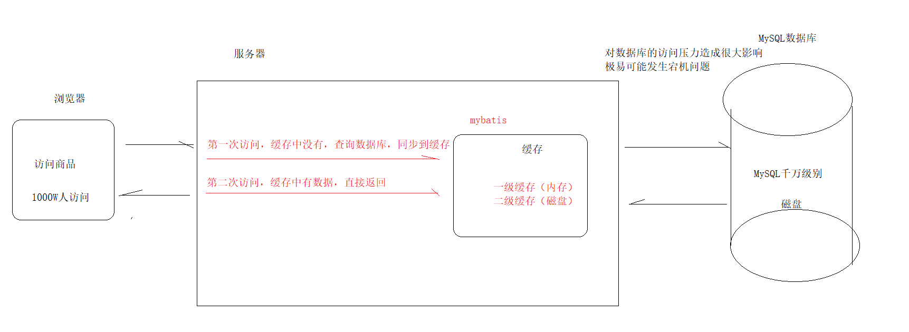
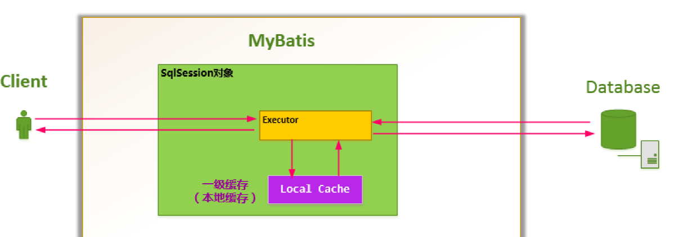
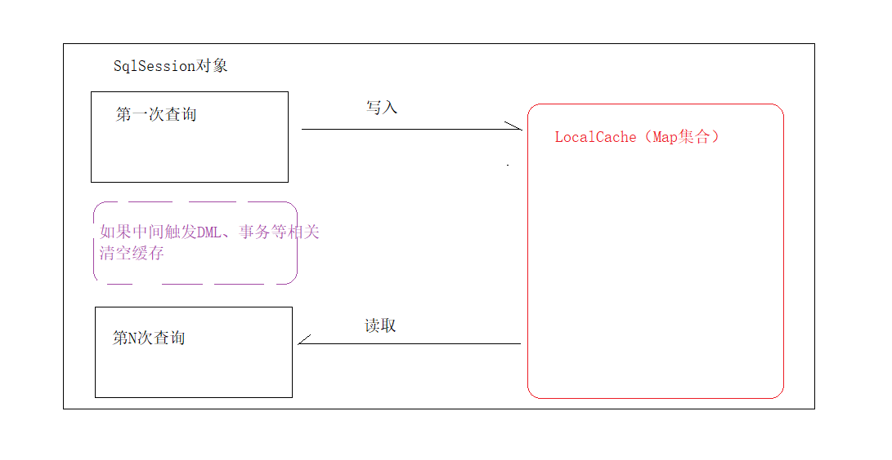
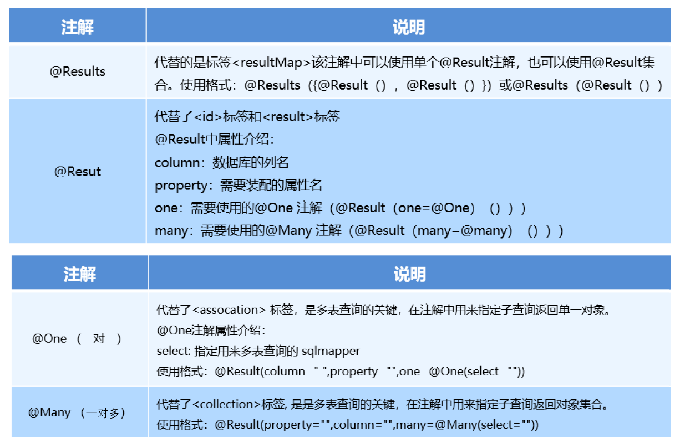

#  MyBatis03

**今日目标**

```markdown
1 MyBatis的缓存
		自带的一级缓存
		配置装载二级缓存
1 MyBatis的注解开发
		单表
		多表
		    ----配置文件方式
		    ---了解注解方式
2 案例demo
		员工的crud
		员工信息的分页展示
```


## MyBatis缓存

### 1.1 缓存介绍



**什么是缓存？**

> 服务器内存的一块区域

**什么样的数据适合使用缓存？**

> 经常访问但又不会时时发生变化的数据

**缓存的设计目的**？

> mybatis也支持缓存：提高查询速度，减轻数据库访问压力

 


### 1.2 一级缓存

MyBatis自带一级缓存且不可卸载

特点：随着sqlSession的创建而存在，随着SqlSession的销毁而销毁

简称：sqlSession级别的缓存

 

**演示一级缓存**

```java
// 测试一级缓存
@Test
public void testOneCache() throws Exception {
    SqlSession sqlSession = MybatisUtils.openSession();
    // 创建
    UserMapper userMapper1 = sqlSession.getMapper(UserMapper.class);
    User user1 = userMapper1.findById(41);
    System.out.println("第一次查询：" + user1);

    // 创建
    UserMapper userMapper2 = sqlSession.getMapper(UserMapper.class);
    User user2 = userMapper2.findById(41);
    System.out.println("第二次查询：" + user2);

    sqlSession.close();
}
```


**一级缓存执行流程**



 

### 1.3 二级缓存（了解）

SqlSessionFactory级别的缓存，可以被多个sqlSession共用

注意：不是程序自带的，配置

配置流程

1**需要在核心配置文件中开启二级缓存**（可以省略）

```
<!--开启对二级缓存的支持 默认是支持的可以不用配置-->
<setting name="cacheEnabled" value="true"/>

```

 2**需要在mapper配置文件中开启使用二级缓存**

```
<!--声明使用二级缓存-->
<cache/>

```

3 **实体类对象需要实现序列化接口**

```
public class User implements Serializable

```

4 **操作的过程中需要提交之后才会存入到二级缓存**

```
查询数据提交到二级缓存中：sqlsession.commit | sqlsession.close

```

**测试二级缓存**

```java
// 测试二级缓存
@Test
public void testSecondCache() throws Exception {
    // 模拟第一个用户
    SqlSession sqlSession1 = MybatisUtils.openSession();
    UserMapper userMapper1 = sqlSession1.getMapper(UserMapper.class);
    User user1 = userMapper1.findById(41);
    System.out.println("第一个用户查询："+user1);
    sqlSession1.close();

    // 模拟第二个用户
    SqlSession sqlSession2 = MybatisUtils.openSession();
    UserMapper userMapper2= sqlSession2.getMapper(UserMapper.class);
    User user2 = userMapper2.findById(41);
    System.out.println("第二个用户查询："+user2);
    sqlSession2.close();
}
```


**后期我们缓存技术使用：Redis**


## MyBatis注解

> mybatis单表的注解使用【掌握】
>
> mybatis多表的注解使用【了解】


> 注释：是给程序员看的
>
> 注解：是给程序看的


### 2.1 单表注解介绍

```markdown
* @Insert：实现新增，代替了<insert></insert>

* @Update：实现更新，代替了<update></update>

* @Delete：实现删除，代替了<delete></delete>

* @Select：实现查询，代替了<select></select>

* @Result：实现结果集封装，代替了<result></result>

* @Results：可以与@Result 一起使用，封装多个结果集，代替了<resultMap></resultMap>
```

**注解对用户表实现增删改查操作**

```java
package cn.itcast.mapper;

import cn.itcast.doman.User;
import org.apache.ibatis.annotations.*;

import java.util.List;

//注解的单表crud操作
public interface UserMapper {

    //1 根据id做查询
    /*
    * 配置文件：<select id="findById" parameterType="int" resultType="cn.itcast.domain.User">
                    select * from user where id=#{id}
                </select>
    *
    * */
    @Select("select * from user where id =#{id}")
    public User findById(int id);


    //2 全查
    @Select("SELECT id AS iid,username AS name,birthday AS bir,sex AS se,address AS addr FROM USER")
    @Results({
            /*column:字段
            * property：对象属性
            * id:默认是false 代表当前不是主键
            * */
            @Result(column = "iid",property = "id",id=true),
            @Result(column = "name",property = "username"),
            @Result(column = "bir",property = "birthday"),
            @Result(column = "se",property = "sex"),
            @Result(column = "addr",property = "address")
    })
    public List<User> findAll();


    //3 新增
    @Insert("insert into user(username,birthday,sex,address) values(#{username},#{birthday},#{sex},#{address})")
    public void save(User user);
    //4 修改
    @Update("update user set username=#{username},birthday=#{birthday},sex=#{sex},address=#{address} where id=#{id}")
    public void update(User user);
    //5 删除
    @Delete("delete from user where id=#{id}")
    public void delete(int id);
}
```

**sqlMapConfig.xml中进行包扫描**

~~~xml
<mappers>
      <package name="cn/itcast/mapper"></package>
</mappers>
~~~

**测试代码**

~~~java
package cn.itcast.demo;

import cn.itcast.doman.User;
import cn.itcast.mapper.UserMapper;
import cn.itcast.utils.MybatisUtils;
import org.apache.ibatis.session.SqlSession;
import org.junit.Test;

import java.util.Date;
import java.util.List;

@SuppressWarnings("all")
public class MybatisTest {

    @Test //id查
    public void test1(){
        SqlSession sqlSession = MybatisUtils.openSession();
        UserMapper userMapper = sqlSession.getMapper(UserMapper.class);
        User user = userMapper.findById(41);
        System.out.println(user);
        sqlSession.close();
    }


    @Test //全查
    public void test2(){
        SqlSession sqlSession = MybatisUtils.openSession();
        UserMapper userMapper = sqlSession.getMapper(UserMapper.class);
        List<User> list = userMapper.findAll();
        for (User user : list) {
            System.out.println(user);
        }
        sqlSession.close();
    }

    @Test //新增
    public void test3(){
        SqlSession sqlSession = MybatisUtils.openSession();
        UserMapper userMapper = sqlSession.getMapper(UserMapper.class);
        User user = new User();
        user.setUsername("jackssss");
        user.setBirthday(new Date());
        user.setSex("男");
        user.setAddress("aaaa");
        userMapper.save(user);
        sqlSession.commit();
        sqlSession.close();
    }

    @Test //修改
    public void test4(){
        SqlSession sqlSession = MybatisUtils.openSession();
        UserMapper userMapper = sqlSession.getMapper(UserMapper.class);

        User user = new User();
        user.setId(56);
        user.setUsername("rosessssssss");
        user.setBirthday(new Date());
        user.setSex("女");
        user.setAddress("bbb");
        userMapper.update(user);


        sqlSession.commit();
        sqlSession.close();
    }


    @Test //删除
    public void test5(){
        SqlSession sqlSession = MybatisUtils.openSession();
        UserMapper userMapper = sqlSession.getMapper(UserMapper.class);

        userMapper.delete(56);

        sqlSession.commit();
        sqlSession.close();
    }
}

~~~


### 2.2 多表注解介绍【了解】

 


**注解开发的多表查询是嵌套查询方式**


#### 1）一对一

**需求：查询一个订单，与此同时查询出该订单所属的用户**

```sql
-- 1.先根据订单id，查询订单表
  SELECT * FROM orders WHERE id=1;
-- 2.再根据订单uid外键，查询用户表	
   SELECT * FROM USER WHERE id=41;
```

```markdown
1. 编写OrderMapper接口

2. 编写UserMapper接口

3. mybatis进行嵌套组合
```

**订单接口注解配置**

```java
package cn.itcast.mapper;

import cn.itcast.doman.Orders;
import cn.itcast.doman.User;
import org.apache.ibatis.annotations.One;
import org.apache.ibatis.annotations.Result;
import org.apache.ibatis.annotations.Results;
import org.apache.ibatis.annotations.Select;

public interface OrdersMapper {

    // 查询订单
    @Select("select * from orders where id=#{id}")
    @Results({
            @Result(column = "id",property = "id",id = true),
            @Result(column = "ordertime",property = "ordertime"),
            @Result(column = "money",property = "money"),
            /*组装用户
            *    一对一 one=@one
            *    select:代表要封装的数据方法来源
            *    column：方法需要的参数
            *    property：要封装的对象属性名
            *    javaType：对象属性名的字节码（.class）类型
            * */
            @Result(one=@One(select = "cn.itcast.mapper.UserMapper.findById"),property = "user",javaType = User.class,
            column = "uid")
    })
    public Orders findOrders(int id);
}


```

**用户接口注解配置**

```java
public interface UserMapper {

    //1 根据id做查询
    /*
    * 配置文件：<select id="findById" parameterType="int" resultType="cn.itcast.domain.User">
                    select * from user where id=#{id}
                </select>
    *
    * */
    @Select("select * from user where id =#{id}")
    public User findById(int id);
}
```

**测试代码**

~~~java
@Test //查询订单及用户信息（一对一）
    public void test1(){
        SqlSession sqlSession = MybatisUtils.openSession();
        OrdersMapper ordersMapper = sqlSession.getMapper(OrdersMapper.class);
        Orders orders = ordersMapper.findOrders(1);
        System.out.println(orders);
        sqlSession.close();
    }
~~~


#### 2）一对多

**需求：查询一个用户，与此同时查询出该用户具有的订单**

```sql
-- 1.先根据用户id，查询用户表
SELECT * FROM USER WHERE id=41;
-- 2.再根据用户id，查询订单表
SELECT * FROM orders WHERE uid=41;

```

```markdown
1. 编写UserMapper接口

2. 编写OrderMapper接口

3. mybatis进行嵌套组合
```

**用户接口注解配置**

~~~java
public interface UserMapper {

    //1 根据id做查询
    @Select("select * from user where id =#{id}")
    @Results({
            @Result(column = "id",property = "id",id=true),
            @Result(column = "username",property = "username"),
            @Result(column = "birthday",property = "birthday"),
            @Result(column = "sex",property = "sex"),
            @Result(column = "address",property = "address"),
            /*组装订单orders
            *     一对多
            *     many=@many
             *     select:代表要封装的数据方法来源
             *     column：方法需要的参数
             *     property：要封装的对象属性名
             *     javaType：对象属性名的字节码（.class）类型
            * */
            @Result(many = @Many(select = "cn.itcast.mapper.OrdersMapper.findOrdersList"),
                    property = "ordersList",javaType =List.class,column = "id")
    })
    public User findById(int id);
}    
~~~

**订单接口注解配置**

~~~java
public interface OrdersMapper {
	/*根据用户id获取订单集合*/
    @Select("select * from orders where uid=#{用户的id}")
    public List<Orders> findOrdersList(int id);
}
~~~

**测试**

~~~java
@Test //查询用户及订单信息（一对多）
    public void test2(){
        SqlSession sqlSession = MybatisUtils.openSession();
        UserMapper userMapper = sqlSession.getMapper(UserMapper.class);
        User user = userMapper.findById(41);
        System.out.println(user);
        sqlSession.close();
    }
~~~


#### 3）多对多

**需求：查询用户同时查询出该用户的所有角色**

```sql
-- 1.先根据用户id，查询用户表
SELECT * FROM USER WHERE id=41;

-- 2.再根据用户id，查询角色表
SELECT * FROM user_role ur INNER JOIN role r ON ur.rid=r.id
WHERE ur.uid=41;
```

```markdown
1. 编写UserMapper接口

2. 编写RoleMapper接口

3. mybatis进行嵌套组合
```

**用户接口注解配置**

~~~java
public interface UserMapper {

    //1 根据id做查询
    @Select("select * from user where id =#{id}")
    @Results({
            @Result(column = "id",property = "id",id=true),
            @Result(column = "username",property = "username"),
            @Result(column = "birthday",property = "birthday"),
            @Result(column = "sex",property = "sex"),
            @Result(column = "address",property = "address"),
            /*组装订单orders
            *     一对多
            *     many=@many
             *     select:代表要封装的数据方法来源
             *     column：方法需要的参数
             *     property：要封装的对象属性名
             *     javaType：对象属性名的类型
            * */
            @Result(many = @Many(select = "cn.itcast.mapper.OrdersMapper.findOrdersList",fetchType = FetchType.LAZY),
                    property = "ordersList",javaType =List.class,column = "id"),
            /*
            *  组装角色
            *    many=@many
             *     select:代表要封装的数据方法来源
             *     column：方法需要的参数
             *     property：要封装的对象属性名
             *     javaType：对象属性名的类型
            *
            * */
            @Result(many = @Many(select = "cn.itcast.mapper.RoleMapper.findRoles"),property = "roleList",javaType = List.class,
            column = "id")
    })
    public User findById(int id);
}       
~~~

**角色接口注解配置**

~~~java
public interface RoleMapper {

    /*查询指定用户的角色*/
    @Select("SELECT * FROM user_role ur INNER JOIN role r ON ur.rid=r.id WHERE ur.uid=#{id}")
    @Results({
            @Result(column = "id",property = "id",id=true),
            @Result(column = "role_name",property = "roleName"),
            @Result(column = "role_desc",property = "roleDesc")
    })
    public List<Role> findRoles(int id);
}
~~~

**测试代码**

~~~java
@Test //查询用户及角色信息
    public void test2(){
        SqlSession sqlSession = MybatisUtils.openSession();
        UserMapper userMapper = sqlSession.getMapper(UserMapper.class);
        User user = userMapper.findById(41);
        System.out.println(user);
        sqlSession.close();
    }
~~~