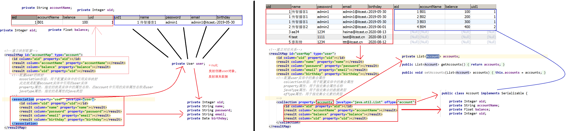

# 1 mybatis中的条件查询

> 前期准备：需要搭建 一个mybatis的开发环境。

## 1.1 单条件查询

### 1.1.1 dao接口

```java
/**
 * 根据条件查询
 * @return
 */
List<User> findByCondition(String password);
```

### 1.1.2 映射配置

```xml
<select id="findByCondition" parameterType="java.util.Map" resultType="user">
        select * from user where password = #{password}
    </select>
```

### 1.1.3 测试类

```java
/**
 *  根据条件查询
 */
@Test
public void testFindByCondition(){
    List<User> users = proxyUserDao.findByCondition("1111");
    for(User user : users){
        System.out.println(user);
    }
}
```

## 1.2 模糊查询

### 1.2.1 dao接口

```java
/**
 * 模糊查询
 * @return
 */
List<User> findLike(String password);
```

### 1.2.2 映射配置

```xml
<!--模糊查询-->
    <select id="findLike" resultType="user" parameterType="string">
        select * from user where password like "%"#{password}"%"
    </select>
```

### 1.2.3 测试类

```java
/**
     * 模糊查询
     */
    @Test
    public void testFindLike(){
        List<User> users = proxyUserDao.findLike("admin");
        for(User user : users){
            System.out.println(user);
        }
    }
```

### 1.2.4 使用细节

```xml
<!--
 第一种方式：是在调用模糊查询的方法处，传参时就加上%
 List<User> users = proxyUserDao.findLike("%admin%");
-->

<!--
第二种方式：是在sql语句中使用双引号拼接查询条件（单引号不行）
select * from user where password like "%"#{password}"%"
-->

<!--
	第三种方式：在sql语句中使用数据库的字符串拼接函数实现%的拼接  concat函数
	select * from user where password like concat(concat'%',#{password}),'%');
-->
<!--
	第四种方式：在like后面使用${}拼接查询条件。
	它是使用Statement的方式进行的字符串拼接，而不是使用PreparedStatement的占位符方式，所以有注入问题。
	当使用${}时，里面的内容是固定的，只能写value
	select * from user where password like '%${value}%'  
-->
```

### 1.3 多条件查询

### 1.3.1 参数为基本类型（包装类）或者String时

#### 1）dao接口

```java
/**
     * 根据条件查询
     * @return
     */
    List<User> findByCondition(String name, String password);
```

#### 2）映射配置

```xml
 <!--多条件查询 -->
<select id="findByCondition" parameterType="java.util.Map" resultType="user">
        select  * from user   where name=#{param1} and password = #{param2}
    </select>
```

#### 3）测试类

```java
 /**
     *  根据条件查询
     */
    @Test
    public void testFindByCondition(){
        List<User> users = proxyUserDao.findByCondition("test","1111");
        for(User user : users){
            System.out.println(user);
        }
    }
```

#### 4）细节

```xml
 <!--多条件查询
    当有多个条件时，mybatis会把条件组装成一个map，如果不指定map的key时，
     获取map中的值，就是param1,param2......
           Map map = new HashMap();
           map.put("param1",name);
           map.put("param2",password);
      第一种方式：直接使用#{param1},#{param2}....获取

       mybatis支持指定存入map的key,但是需要借助一个注解来完成。
        @Param注解就是指定存入map时，使用的key。
           属性：
                value：指定key的值。
  		例如：
  		 List<User> findByCondition(@Param("name") String name, @Param("password") String password);
        通常当涉及多表中的字段作为查询条件时使用，最经典的使用场景就是分页（开始记录索引，查询的记录条数）
-->
```

### 1.3.2 参数为实体类类型时

#### 1）dao接口

```
/**
     * 根据user中提供的条件查询
     *      user中提供name和password
     * @param user
     * @return
     */
    List<User> findByUser(User user);
```

#### 2）映射配置

```xml
<!--根据传入的对象作为条件查询
            通常查询条件为一个实体类中的属性时使用
    -->
    <select id="findByUser" resultType="user" parameterType="user">
        select * from user where name = #{name} and password = #{password}
    </select>
```

#### 3）测试类

```java
/**
     * 使用User作为查询条件
     */
    @Test
    public void testFindByUser(){
        //创建查询条件对象
        User user = new User();
        user.setName("test");
        user.setPassword("1111");
        //执行查询
        List<User> users = proxyUserDao.findByUser(user);
        //输出
        for(User u : users){
            System.out.println(u);
        }
    }
```

#### 4）细节

```xml
<!--
在使用实体对象作为查询条件时，#{}中提供的占位符名称必须是实体类的属性名称。
-->
```

# 2 mybatis中的动态SQL

## 2.1 动态查询条件

### 2.1.1 dao接口

```java
/**
     * 动态SQL查询
     * @param user
     * @return
     */
    List<User> findByDynamicSql(User user);
```

### 2.1.2 映射配置

```xml
<!--动态SQL查询-->
    <select id="findByDynamicSql" resultType="user" parameterType="user">
        select * from user <!--where 1=1-->
        <where>
            <if test="name != null and name != '' ">
                and name = #{name}
            </if>
            <if test="password != null and password != '' ">
                and password = #{password}
            </if>
            <if test="email != null and email != '' ">
                and email = #{email}
            </if>
        </where>
    </select>
```

### 2.1.3 测试类

```java
/**
     * 测试动态SQL查询
     */
    @Test
    public void testFindByDynamicSql(){
        User user = new User();
        user.setPassword("1234");
        user.setEmail("ttt@itcast.cn");
        List<User> users = proxyUserDao.findByDynamicSql(user);
        for(User u : users){
            System.out.println(u);
        }
    }
```

#### 2.1.4 细节说明

```xml
<!--
  where标签：
		用于拼接where查询条件
  if标签：
		用于判断是否添加标签体中的内容
		属性：
			test：编写条件。需要注意的是，它不支持…&& || 符号，请用and or not。
-->
```

## 2.2 动态遍历集合拼接条件

### 2.1.1 List集合作为参数

#### 1） dao接口

```java
/**
     * 根据id的集合，查询用户列表
     * @param ids
     * @return
     */
    List<User> findByCollection(List<Integer> ids);
```

#### 2） 映射配置

```xml
<!--使用集合作为查询条件-->
    <select id="findByCollection" resultType="user" parameterType="java.util.List">
        select * from user where
       
        <foreach collection="collection" item="id" open="uid in (" close=")" separator="," >
            #{id}
        </foreach>
    </select>
```

#### 3） 测试类

```java
/**
     * 使用集合作为查询条件
     */
    @Test
    public void testFindByCollection(){
        List<Integer> ids = new ArrayList<>();
        ids.add(2);
        ids.add(3);
        ids.add(4);
        List<User> users = proxyUserDao.findByCollection(ids);
        for(User user : users){
            System.out.println(user);
        }
    }
```

### 2.1.2 数组作为参数

#### 1）dao接口

```java
    /**
     * 根据id的数组，查询用户列表
     * @param ids
     * @return
     */
    List<User> findByArray(int[] ids);
```

#### 2）映射配置

```xml
<!--使用数组作为查询条件-->
    <select id="findByArray" resultType="user" parameterType="int[]">
        select * from user where
        <foreach collection="array" item="id" open="uid in (" close=")" separator="," >
            #{id}
        </foreach>
    </select>
```

#### 3）测试类

```java
 /**
     * 使用数组作为查询条件
     */
    @Test
    public void testFindByArray(){
        int[] ids = new int[]{3,4,5};
        List<User> users = proxyUserDao.findByArray(ids);
        for(User user : users){
            System.out.println(user);
        }
    }
```

### 2.1.3 实体类中的集合作为参数

#### 1）dao接口

```java
 /**
     * 根据用户中的id集合进行查询
     * @return
     */
    List<User> findByUserIds(User user);
```

#### 2）映射配置

```xml
<!--使用用户对象中的集合作为查询条件-->
    <select id="findByUserIds" resultType="user" parameterType="user">
        select * from user where
        <foreach collection="ids" item="id" open="uid in (" close=")" separator="," >
            #{id}
        </foreach>
    </select>
```

#### 3）测试类

```java
/**
     * 使用用户实体中的ids集合查询
     */
    @Test
    public void testFindByUserIds(){
        List<Integer> ids = new ArrayList<>();
        ids.add(1);
        ids.add(2);
        ids.add(3);

        User user = new User();
        user.setIds(ids);

        List<User> users = proxyUserDao.findByUserIds(user);

        for(User u : users){
            System.out.println(u);
        }
    }
```

### 2.2.4 细节说明

```xml
 <!--使用foreach标签对集合进行遍历
            collection指定集合名称
					当集合作为参数时，其名称必须是collection
					当数组作为参数时，其名称必须是array
					当实体类中集合作为参数时，其名称必须是实体类集合属性名称
            item指定遍历项的名称
            open开始
            close结束
            separator遍历项的分隔符
            index当前遍历项索引
        -->
```

## 2.3 动态拼接update语句

### 2.3.1 为什么会出现动态更新语句


### 2.3.2 动态更新语句的使用

#### 1）dao接口

```java
/**
     * 动态SQL更新
     * @param user
     * @return
     */
    int updateForDynamicSql(User user);


    /**
     * 根据id查询
     * @param uid
     * @return
     */
    User findById(Integer uid);
```

#### 2）映射配置

```xml
<!--动态SQL更新
            当表单提供的更新字段数据不是覆盖了数据库表中全部字段时，就需要使用动态更新
    -->
    <update id="updateForDynamicSql" parameterType="user">
        update user
        <set>
          <if test="name != null and name != '' ">
            name = #{name},
          </if>
          <if test="password != null and password != '' ">
            password = #{password},
          </if>
          <if test="email != null and email != '' ">
            email = #{email},
          </if>
          <if test="birthday != null">
            birthday = #{birthday}
          </if>

        </set>
        where
          uid = #{uid}
    </update>

    <!--根据id查询-->
    <select id="findById" parameterType="int" resultType="user">
        select * from user where uid = #{uid}
    </select>
```

#### 3）测试类

```java

    /**
     * 动态SQL更新
     */
    @Test
    public void testUpdateForDynamicSql(){
        //1.根据id查询用户
        User user = proxyUserDao.findById(3);
        //2.设置数据
        user.setName("ee34");
        user.setPassword(null);//模拟表单没有提供密码信息
        //3.更新
        proxyUserDao.updateForDynamicSql(user);
        //4.提交事务
        sqlSession.commit();
    }
```

#### 4）使用细节

```xml
<!--
	在我们使用set标签做动态更新语句生成时，不需要在语句中再写set关键字了
-->
```

# 3 mybatis中的多表

## 3.1 表关系分类

```
四种：一对多  多对一  一对一  多对多
```

## 3.2 数据库中的表关系实现

### 3.2.1 表关系的实现方式

#### 1）一对多和多对一 实现方式：靠外键


#### 2）一对一 实现方式：靠外键（需要同时具备非空和唯一约束）


#### 3）多对多 实现方式：靠中间表

​		  任意一张表和中间表都是一对多
​		  没有中间表后，其余两张表没有关系

​		

### 3.2.2 如何快速确定表关系

```java
如何确定两张表的关系：
		找外键
		有外键的一定是从表
		外键字段引用的表一定是主表
		它们之间的关系就是：
			看外键字段有没有非空唯一约束，有的话，就是一对一，没有就是一对多。

如果出现了第三张表，且里面包含两个外键字段，此时就是两个多对一。他所引用的两张表关系一定是多对多。
```

## 3.3 实体类中描述表关系

用户实体和账户实体  一对多（多对一）
		一的一方，包含的是多的一方的一个集合属性
		多的一方，包含的是一的一方的一个对象属性


用户实体和角色实体  多对多
	各自包含对方的一个集合属性

一对一的情况：
	各自包含对方一个对象属性

## 3.4 mybatis多表查询配置

### 3.4.1 配置一个对象的方式

#### 1）实体类

```java
public class Account implements Serializable {

    private Integer aid;
    private String accountName;
    private Float balance;
    private Integer uid;

    private User user;
    //getters and setters
}
```

#### 2）映射配置(只保留了映射配置)

```xml
<!--建立映射配置-->
    <resultMap id="accountMap" type="account">
        <id column="aid" property="aid"></id>
        <result column="accountName" property="accountName"></result>
        <result column="balance" property="balance"></result>
        <result column="uid" property="uid"></result>
        <!--配置user的映射 -->
        <association property="user" javaType="user">
            <id column="uid" property="uid"></id>
            <result column="name" property="name"></result>
            <result column="password" property="password"></result>
            <result column="email" property="email"></result>
            <result column="birthday" property="birthday"></result>
        </association>
    </resultMap>
```

#### 3）测试类(只保留了测试方法)

```java
 /**
 * 根据id查询
 */
@Test
public void testFindById(){
    Account account = proxyAccountDao.findById(1);
    System.out.println(account);
    System.out.println(account.getUser());
}
```

#### 4）细节说明

```xml
<!--
association标签：
		用于配置实体中的引用实体映射。此处就是配置account实体中引用的user实体
        property属性，指定的就是实体中的属性名称，在account中引用的实体属性名称是user
        javaType属性，指定的是属性的java类型
-->
```

### 3.4.1 配置一个集合的方式

#### 1）实体类

```java
public class User implements Serializable {

    private Integer uid;
    private String name;
    private String password;
    private String email;
    private Date birthday;

    private List<Account> accounts;
    //getters and setters
}
```

#### 2）映射配置(只保留了映射配置)

```xml
<!--建立对应关系-->
    <resultMap id="userMap" type="user">
        <id column="uid" property="uid"></id>
        <result column="name" property="name"></result>
        <result column="password" property="password"></result>
        <result column="email" property="email"></result>
        <result column="birthday" property="birthday"></result>
        <!--配置user实体中的集合属性-->
        <collection property="accounts" javaType="java.util.List" ofType="account">
            <id column="aid" property="aid"></id>
            <result column="accountName" property="accountName"></result>
            <result column="balance" property="balance"></result>
            <result column="uid" property="uid"></result>
        </collection>
    </resultMap>
```

#### 3）测试类(只保留了测试方法)

```java
    /**
     * 查询所有用户
     */
    @Test
    public void testFindAll(){
        List<User> users = proxyUserDao.findAll();
        for(User user : users){
            System.out.println("------------------------");
            System.out.println(user);
            System.out.println(user.getAccounts());
        }
    }
```

#### 4）细节说明

```xml
<!--
 collection标签：
		用于配置实体中的集合属性
        property属性：用于指定集合属性名称
        javaType属性：用于指定集合的数据类型
        ofType属性：用于指定集合元素的类型
-->
```


### 3.4.3 查询封装过程分析



## 3.5 多表操作分析

```
多表操作：
		保存：
			主表：相当于单表操作。
			从表：需要得到所属的主表信息。
		更新：
			主表：通常情况下，外键字段都是不允许更新的。其余字段更新就是单表更新
			从表：通常情况下，是允许从新选择主表信息。
		删除：	
			主表：
			      需要考虑有从表引用
			      通常的做法是看从表数据和主表数据是否具备父子关系，
					具备父子关系的特点：用户和订单，用户和银行卡。当把用户删除之后，订单信息（银行卡信息）没有存在的意义了。
				  如果是具备父子关系的特点，在删除主表时，可以同时删除从表信息。
				  如果不是具备父子关系的特点，删除主表信息时，不能同时删除从表信息，需要单独先处理从表数据，然后再来删除主表信息。
				  例如，员工和部门的关系，一个员工只能属于一个部门。每个部门可以有多个员工。
			从表：单表操作
多表查询：
		查询主表数据时，同时获取出从表数据
		查询从表数据时，同时获取出主表数据
```
