# 1 今日内容

```
mybatis中的嵌套查询（讲义中写的名称），也可以称为：关联查询

加载策略（查询策略）：立即和延迟

mybatis的缓存：一级缓存和二级缓存

mybatis中的配置文件内容的回顾和完善

mybatis的源码分析 || mybatis的注解开发  (征求同学们的意见)

```

# 2 回顾

## 2.1 mybatis中的条件查询

```
单条件： 
	需要在<select>标签上使用parameterType属性指定参数的类型，参数是什么类型就写什么类型
	参数占位符使用#{}即可，大括号中的内容可以任意，建议和形参变量名一致。					
多条件：
	条件是多个参数：
		需要在<select>标签上使用parameterType属性指定参数的类型，类型是java.util.Map
		参数占位符使用#{}即可，大括号中的内容在没有指定参数名称时，需要使用param1，param2.....，如果需要指定参数名称，要借助@Param注解来实现，注解的value属性就是用于指定参数名称的。
		条件是一个实体对象中的多个属性,需要在<select>标签上使用parameterType属性指定参数的类型，类型是实体类类型, 参数占位符使用#{}即可，大括号中的内容需要使用实体类中的属性名称
```

## 2.2 mybatis的模糊查询

```
sql中的模糊查询是需要使用like关键字，同时模糊的条件上要使用%。
	在mybatis中%可以写在调用方法的参数中，可以写在SQL语句中（但是需要使用双引号连接），也可以在SQL语句中使用concat函数拼接。
	mybatis还提供了'%${value}%'此种形式的写法，但是它用的是字符串拼接，实际开发中不建议使用。
```

## 2.3 mybatis的动态查询

```
查询条件的动态拼接
		<where>
查询条件的判断
		<if test='条件'>
查询条件的遍历拼接
		<foeach collection='遍历的集合' item='遍历项的名称' open='拼接条件的开始' close='拼接条件的结束' speartor='条件的分隔符' index='当前遍历项的索引' >
mybatis的动态语句更新：
	  为什么会有动态语句更新，什么时候用：
      		当表单中的数据不是数据库的全部字段信息时，就建议使用动态语句更新。
	  动态更新语句生成：
			<set>标签用于拼接更新的字段内容
			<if test='条件'>用于提供条件
```

## 2.4 mybatis的多表

```
表关系：
	四种
如何确定表关系：
	依靠外键
如何在实体中描述表关系：
	建立对方的引用。
	如果是一的一方，它关联的就是对方的集合（建立集合引用）
	如果是多的一方，它关联的就是对方的对象（建立对象引用）
	mybatis中配置关联查询：
		配置集合时：
			<collection>标签
					属性：
						property：指定集合的名称
						javaType：指定集合的类型
						ofType：指定集合元素的类型

		配置对象时：
			 association标签
					属性：
						property：指定对象的名称
						javaType：指定对象的类型
```

# 3 加载时机

前提：

​	用户和账户的关系：一对多
​	用户：一的一方
​	账户：多的一方

## 3.1 延迟加载

### 3.1.1 分析

```
查询用户的时候要不要同时查询账户?

引申：查询一的一方时，要不要同时把多的一方查询出来

答案：不要！
     因为关联对象是一个集合，当不需要使用时把它查出来就是对内存浪费。造成系统运行效率不高。

什么时候查询关联的对象：
     在真正需要使用的时候，再去查询关联对象。不用的时候不要去查询。
```

### 3.1.2 特点

​	懒加载，延迟加载，按需加载，惰性加载
​	特点：什么时候用，什么时候查，不用的时候不查。

## 3.2 立即加载	

### 3.2.1 分析	

```
查询账户的时候要不要同时查询用户？

引申：查询多的一方时，要不要同时把一的一方查询出来

答案：要！
     因为关联对象是一个对象引用，它本身所占的资源较少，而我们通常查询从表信息时，是需要看到引用的主表内容的。所以，通常情况下是应该同时查询出主表信息的。

什么时候查询关联的对象：
     在每次查询从表信息时，都需要得到主表信息，也就是查询从表信息时，立即马上查询主表信息。
     但是，我们也可以采取用的时候再查的思想来编写代码。		
```

### 3.2.2 特点

​	立即加载
​		特点：不管用不用，只要触发方法里面查询关联对象。

## 3.3 配置延迟加载

### 3.3.1 改造关联查询（以查询账户同时查询用户为例）

#### 第一步：把一条查询语句改为分为两次查询

如下图所示：

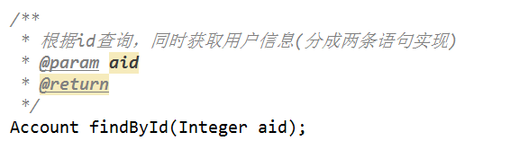

​			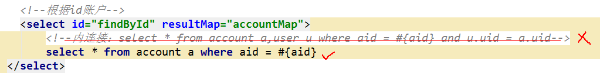

#### 第二步：在AccountDao.xml中配置映射ResultMap

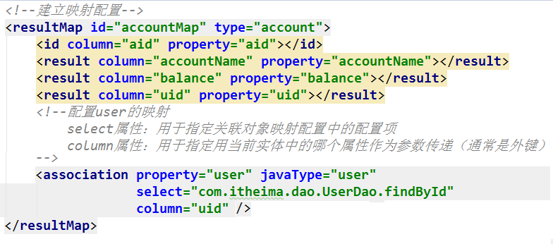

#### 第三步：在UserDao.xml中提供对应的方法配置

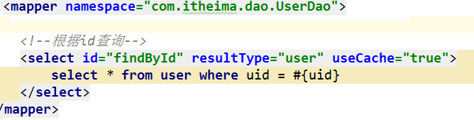

### 3.3.2 开启延迟加载配置

#### 第一步：前往mybatis官网，按下图查找配置项：

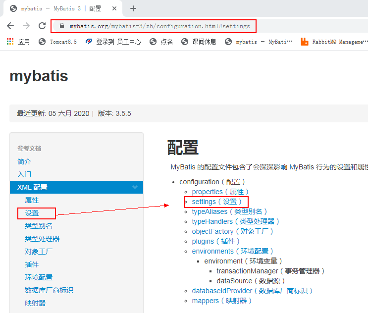

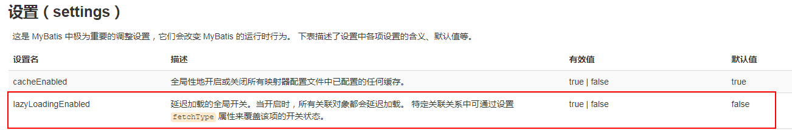

#### 第二步：打开工程的主配置文件添加全局延迟加载配置

添加下图中的配置内容：

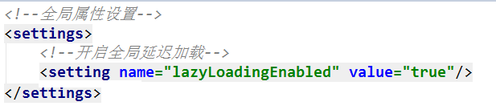

注意：`<settings>`标签的出现位置

#### 第三步：针对每个查询操作配置加载时机

打开映射配置文件，按下图配置:

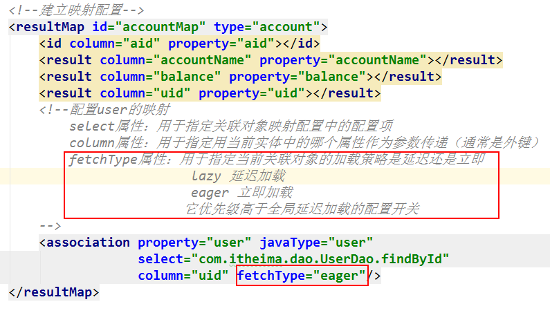

# 4 缓存

## 4.1 缓存基础知识

```
1.什么是缓存？
	内存中的临时数据
2.为什么用缓存？
	减少和数据库的交互，缓存中有数据时，可以先从缓存中获取，从而提高查询效率，降低数据库的访问压力。
3.什么样的数据适用于缓存，什么样数据不适用？
	经常查询，较少修改的数据以及非敏感数据，适用于缓存
	修改频繁的数据以及敏感数据，不适用于缓存

	敏感数据：例如 银行的汇率，股市牌价，商品的库存等等。
```

## 4.2 mybatis中的缓存

### 4.2.1 简介

```
	mybatis框架为我们在内存中开辟的临时数据空间（基于内存的）它分为了一级缓存和二级缓存
	
		一级缓存是SqlSession级别的，同一个SqlSession触发两次相同的查询，当缓存中有数据时，不会再次发起查询。SqlSession的关闭，一级缓存随之消失。
		
		二级缓存是SqlSessionFactory级别的，同一个SqlSessionFactory生产的SqlSession对象共享二级缓存。
		在实际开发中，基于框架的缓存机制在当下的开发中较少使用，大部分都会使用单独的缓存中间件（缓存软件，缓存服务器）来解决缓存问题。	常用的就是redis。

```

### 4.2.2 使用要求和步骤

```
mybatis的二级缓存默认是关闭状态的，需要我们通过配置手动开启二级缓存。
开启二级缓存的顺序是：
	主配置文件配置开启全局二级缓存
	映射配置文件配置开启当前实体支持二级缓存
	具体操作配置当前操作支持二级缓存
```

#### 第一步：在主配置文件中开启二级缓存支持（因为默认值是开启，不写也行）

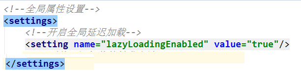

#### 第二步：在映射配置文件中使用`<cache/>`标签

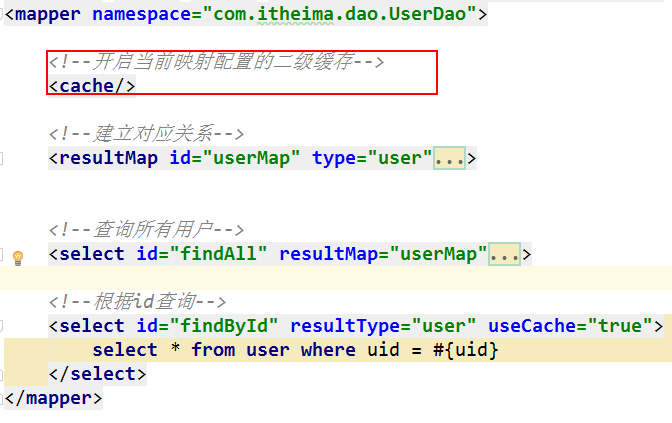

#### 第三步：在具体查询操作的`<select>`标签使用useCache属性

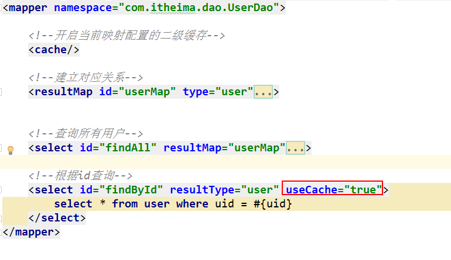

### 4.2.3 使用细节

```
	mybatis在存入一级缓存时，是把整个对象存入了。所以无论进行几次查询，取到的对象都是同一个。
	但是，在存入二级缓存时，它不是把对象存入了，而是存入对象的散装数据（json格式的数据）
		{uid=1, name='传智播客1', password='admin1', email='admin1@itcast.cn',
        		birthday=Thu May 30 00:00:00 CST 2019}
	当获取时，是把数据拿出来，并且创建一个新的对象，用数据给对象赋值，并返回对象。所以每次获取都不是同一个。
```


