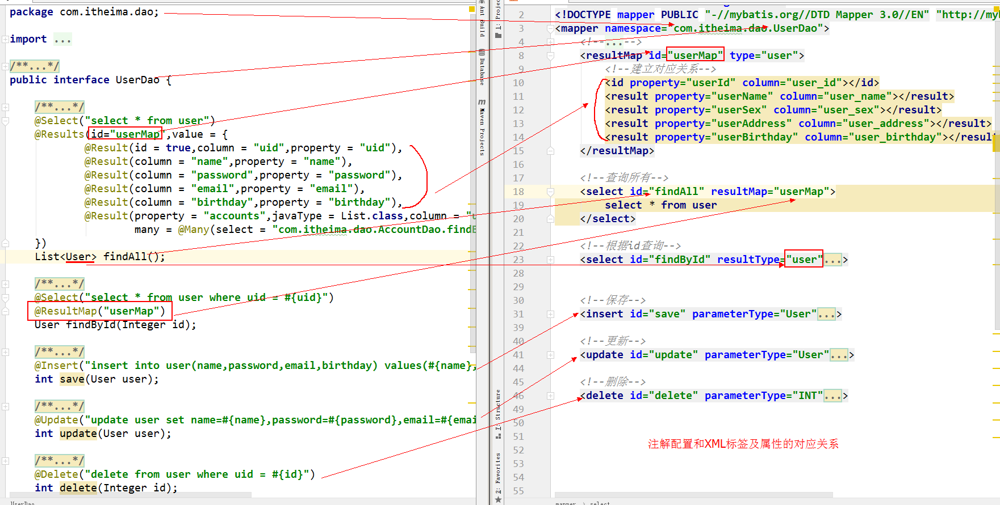
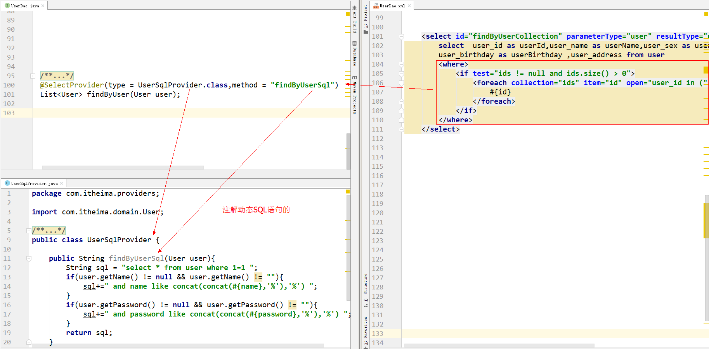
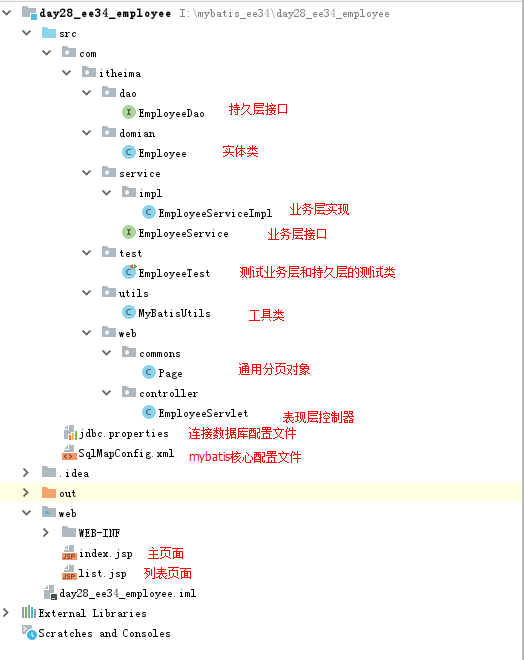

# 1 今日课程内容

## 1.1 mybatis的注解开发

​	   就是把我们前面用xml的实现的配置，改用注解实现

## 1.2 mybatis的综合案例

​	  实现对员工表的查询列表操作（课上），课后同学们完成增删改。

## 1.3 mybatis的源码分析

### 1.3.1 创建代理对象的执行过程图


### 1.3.2 执行增删改查方法的执行过程图


# 2 回顾

## 2.1 mybatis的加载时机问题

### 2.1.1 加载时机的分析

#### 1）延迟加载

​		概念：什么时候用，什么时候发起查询。

​		针对关联对象的使用场景：

​			当有一的一方时，关联查询多的一方时，采用延迟加载

#### 2）立即加载

​		概念：不管用不用，只要触发方法就发起查询。

​		针对关联对象的使用场景：

​				当有多的一方时，关联查询一的一方时，采用立即加载（它可以使用延迟）

### 2.1.2 立即加载实现：

#### 1）通过SQL语句实现：

​		通过一条sql语句，查询两张数据库表，即可把所有需要的数据全部查询出来。

#### 2）通过配置实现

​						 使用`<association>`的featchType属性，让他的取值的eager，实现立即加载。

### 2.1.3 延迟加载实现

​		首先需要把查询语句分开，让查询对象各自查自己的表。

​		 通过配置`<association>`和`<collection>`的select标签指定查询关联对象的操作标识符（namespace+id），同时配置featchType=lazy。

​		 注意：要想使用延迟加载，需要在主配置文件中开启。开启的方式是配置settings标签的属性。

属性的取值可以通过mybatis的官方文档查找。

## 2.2 mybatis的缓存问题

### 2.2.1 缓存的基本知识

​				缓存的概念

​				缓存的意义

​				缓存的场景

### 2.2.2 mybatis中的缓存

​		一级缓存：SqlSession级别

​		二级缓存：SqlSessionFactory级别

​		mybatis的二级缓存，默认是关闭的，需要手动开启。

​		开启的顺序是：

​				主配置文件中配置开启二级缓存

​				映射配置文件中开启二级缓存（此时已经可以保证，当前映射配置中的所有查询支持二级缓存）

​				在对应的操作中开启二级缓存（此时可以灵活的控制当前查询操作是否使用二级缓存

# 3 注解开发mybatis

## 3.1 明确

### 3.1.1 注解配置说明

​		注解配置mybatis，就是把用xml的配置，改用注解实现

### 3.1.2 注解配置能替代哪些，不能替代哪些

​		基于注解的mybatis配置，在只有mybatis框架时，只能替代映射配置文件，而主配置文件（核心配置文件）是不能替代的。（后面学习了spring框架之后，主配置文件也可以省略）

### 3.1.3 注解配置的注意事项

​	 注解配置和xml配置只能出现一个。当有两个都存在时，会报错。

## 3.2  注解和xml对应关系

### 3.1.1  对应表格

```markdown
* @Insert：实现新增，代替了<insert></insert>
	属性：
		value：用于指定sql语句
 
* @Update：实现更新，代替了<update></update>
	属性：
		value：用于指定sql语句

* @Delete：实现删除，代替了<delete></delete>
	属性：
		value：用于指定sql语句

* @Select：实现查询，代替了<select></select>
	属性：
		value：用于指定sql语句

* @Result：实现结果集封装，代替了<result></result>
	属性：
		id: 用于指定是否为主键
    	column: 用于指定数据库列名
		property: 用于指定实体类属性名称
		javaType: 用于指定java中的数据类型
		jdbcType: 用于指定数据库中的数据类型
		typeHandler: 用于指定类型转换器
		one: 当有关联对象时，用于指定关联对象封装相关配置，详见@One注解
		many:：当有关联对象时，用于指定关联集合封装的相关配置，详见@Many注解
	
* @Results：可以与@Result 一起使用，封装多个结果集，代替了<resultMap></resultMap>
	属性：
		id:用于指定应用时的id。
		value：用于指定多个Result

* @One：实现一对一结果集封装，代替了<association></association>
	属性：
		value：用于指定获取关联对象操作的唯一标识。
		fetchType：用于指定关联对象查询的时机是立即还是延迟
 
* @Many：实现一对多结果集封装，代替了<collection></collection>
	属性：
		value：用于指定获取关联对象操作的唯一标识。
		fetchType：用于指定关联对象查询的时机是立即还是延迟

* @ResultMap:实现引用映射配置，代替了<select></select>标签中的resultMap属性。
	属性：
		value：用于指定引用的映射配置。取值是@Results注解的id属性的值。
	
* @SelectProvider：实现了动态SQL语句在注解开发的使用
	属性：
		type：用于指定生成动态SQL类的字节码
		method：用于指定生成动态SQL的方法名
	
* @CacheNameSpace：实现了二级缓存的注解配置，代替了<cache/>
```

### 3.1.2 说明图





# 4 mybatis综合练习

## 4.1 思路分析

### 4.1.1 准备工作

#### 	1）看看提供的素材

​		明确哪些是已经准备好的

#### 	2）读懂需求

​		需求：实现基于三层架构的员工列表展示
​		技术要求：持久层使用mybatis框架

#### 	3）编码之前

​		数据库和表的准备
​		工程的准备
​		jar包的导入
​		导入素材(如果提供了的话）

### 4.1.2 编写步骤的思路分析

​		第一步：员工的实体（实体类的创建）
​		第二步：编写业务层（编写service接口和实现类）
​		第三步：编写持久层（持久层接口和其相关的配置）
​		第四步：测试（测试持久层和业务层的组合使用）
​		第五步：编写表现层
​		第六步：组合测试（三层一起测试）

## 4.2 编码实现

​	详见：

## 4.3 分页

### 4.3.1 分页的基础知识回顾

```
1.Mysql的分页关键字
	limit
2.limit中两个参数的含义
	第一个：开始记录索引，从0开始
	第二个：查询的结果集条数。每页显示的条数是固定的（除最后一页因条数不够时）
3.在程序中，我们无法自己得知的分页信息
	当前页			需要使用者提供的
	每页显示的条数		需要在系统中设定好的
	总记录条数		需要查询出来的
4.在程序中，我们可以自己计算出来的内容
	开始记录索引
		（当前页-1）* 每页显示的条数
	总页数
		总记录条数%每页显示的条数 == 0 ？总记录条数/每页显示的条数 ： 总记录条数/每页显示的条数+1
	上一页
		当前页-1
	下一页
		当前页+1
```

### 4.3.2 分页引发的思考

```
分页是什么？
	把大的结果集，分批次查询出来。
分页的优势？
	通过多次和数据库的交互，来减少对内存的消耗。
为什么要使用分页？
	优势：
		通过多次查询，减少结果量级的获取，从而提高服务器内存的使用。
	弊端：
		带来了和数据库的多次交互，让数据库的访问压力变大。
	由分页引发的思想：
		如果不使用分页，一次性就可以把所有数据查询出来，此时对时间的消耗少，但是由于数据量大，会对内存空间的消耗多
		如果使用了分页，多次去数据库查询，此时对内存空间的消耗变少了，但是由于交互次数的增加，会延长查询时间。

		换的思想。

		拿空间换时间

		拿时间换空间

		懒加载是拿时间换空间
```

