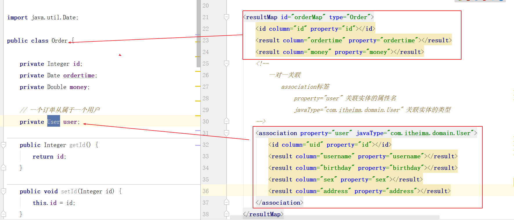

#  MyBatis

**今日目标**

```markdown

1 动态sql
			if标签
			choose标签
			foreach标签
			set标签
			sql片段（sql工具）
		     
2 mybatis操作多表
			关联方式  --掌握
			嵌套方式  --掌握
				延迟加载方案
			大量标签只能多写多练	

```


### 动态sql

**1）if标签**

```markdown
* 需求：根据id和username查询，但是不确定两个都有值。判断有值查询内容 没值不查询内容
```

```java
public List<User> findByIdAndUsernameIf(User user);
```

```xml
<!--
        if 和 where 标签
        where 标签 相当于 where 1 = 1 功能，但是如果没有条件 where将不会拼接在sql语句中
            可以去掉前 and 或者 or
    -->
<select id="findByIdAndUsernameIf" parameterType="user" resultType="user">
    select * from user 
  	<where>
        <if test="id != null">
            and id = #{id}
        </if>
        <if test="username != null">
            and username like concat('%',#{username}),'%')
        </if>
    </where>
</select>
```


**2）choose标签**

相当于java中的switch语句

```markdown
* 需求：如果有id只使用id做查询，没有id的话看是否有username，有username就根据username做查询，如果都没有，就不带条件。
```

```java
  public List<User> findByIdAndUsernameChoose(User user);
```

```xml
<!--
        choose标签 相当于 switch语句
        when标签 相当于 case+break语句
        otherwise 相当于 default语句

    -->
<select id="findByIdAndUsernameChoose" parameterType="user" resultType="user">
    select * from user
    <where>
        <choose>
            <when test="id != null">
                and id = #{id}
            </when>
            <when test="username != null">
                 and username like concat(concat('%',#{username}),'%')
            </when>
            <otherwise>
                and 1 = 1
            </otherwise>
        </choose>
    </where>
</select>
```


**3）set标签**

```markdown
* 需求：动态更新user表数据，如果该属性有值就更新，没有值不做处理。
```

```java
public void updateIf(User user);
```

```xml
<!--
        set标签：将set最后一个条件的 逗号 擦除
            问题：用户没有传递值，数据库不会发生修改
    -->
<update id="updateIf" parameterType="user">
    update user 
    <set>
        <if test="username != null">
            username=#{username},
        </if>
        <if test="birthday != null">
            birthday=#{birthday},
        </if>
        <if test="sex != null">
            sex = #{sex},
        </if>
        <if test="address != null">
            address = #{address},
        </if>
    </set>
    where id = #{id}
</update>
```


**4）foreach标签**

```markdown
* 功能：是用来做数据的循环遍历
* 例如：
	select * from user where id in (1,2,3)
	在这样的语句中，传入的参数部分必须依靠 foreach遍历才能实现。
	
	<foreach>标签
		collection：被遍历的容器（list、array）
		
		open：遍历前拼接值
		
		close：遍历后拼接的值
		
		item：当前变的临时元素
		
		sperator：分隔符

* 练习
	普通类型list集合
			collection="list"
	普通类型array数组
			collection="array"
	引用类型对象，list集合或array数组属性
			collection="属性名"
```


```java
// foreach标签 遍历
public List<User> findByList(List<Integer> ids);

public List<User> findByArray(Integer[] ids);

// 传递引用数据类型 list属性或者array属性
public List<User> findByPojo(QueryVo queryVo);
```


```xml
<!--
        foreach标签
            传递 普通类型list集合  collection="" 取值：collection 、 list

    -->
<select id="findByList" parameterType="list" resultType="user">
    select * from user where
    <foreach collection="list" open="id in (" close=")" item="id" separator=",">
        #{id}
    </foreach>
</select>

<!--
        foreach标签
            传递 普通类型array数组  collection="" 取值：array
    -->
<select id="findByArray" parameterType="int[]" resultType="user">
    select * from user where
    <foreach collection="array" open="id in (" close=")" item="id" separator=",">
        #{id}
    </foreach>
</select>

<!--
        foreach标签
            传递 引用数据类型list集合属性  collection="" 取值 集合或数组的 属性名
    -->
<select id="findByPojo" parameterType="QueryVo" resultType="user">
    select * from user where
    <foreach collection="ids" open="id in (" close=")" item="id" separator=",">
        #{id}
    </foreach>
</select>
```


### 11.3 sql片段【了解】

```xml
<!--
        可以将公共部分进行抽取
    -->
<sql id="userSelect">
    select * from user
</sql>

<!--
        引入sql片段
    -->
<select id="findByArray" parameterType="int[]" resultType="user">
    <include refid="userSelect"></include> where
    <foreach collection="array" open="id in (" close=")" item="id" separator=",">
        #{id}
    </foreach>
</select>

<select id="findByPojo" parameterType="QueryVo" resultType="user">
    <include refid="userSelect"></include> where
    <foreach collection="ids" open="id in (" close=")" item="id" separator=",">
        #{id}
    </foreach>
</select>
```


## 一 MyBatis多表查询

### 1.1 表关系介绍  

```html
一对多   用户和订单
多对多   用户和角色
多对一  订单和用户
   查询站在订单角度：  一个订单只能属于一个用户    一对一
 
细节
表： 表关系使用外键来维护的

mybatis:一个表是一个实体的映射（user  orders）
实体： 实体属性、集合属性
1v1: 实体属性
1vN: 1的一方有多的一方的集合属性  多的一方有一的一方的实体对象
```

-----------------------------------------------------------------------------------------------------------------------------------------------------------


### 1.2 一对一（多对一）

**一对一查询的需求：查询一个订单，与此同时查询出该订单所属的用户**

~~~
在订单的角度上：查询一个订单，就是查询这一个订单所属的是哪一个用户   1vs1
~~~

**sql语句和实体**

```sql
#查询订单号为1的订单以及这个订单所属的用户信息  1vs1
select *from orders o left join user u
on o.uid=u.id where o.id=1;
#返回的实体：订单Oders
```

**数据封装步骤分析**

```markdown
1 编写orders实体（有用户实体）        
2 编写映射文件ordersMapper.xml
3 在sqlMapConfig.xml中引入ordersMapper.xml
4 编写dao接口和方法
5 编写service调用dao
```

1. 编写Order实体

   ~~~java
   public class Orders {

       private Integer id;
       private Date ordertime;
       private Double money;
       // 订单所属的用户
       private User user;

       public Integer getId() {
           return id;
       }

       public void setId(Integer id) {
           this.id = id;
       }

       public Date getOrdertime() {
           return ordertime;
       }

       public void setOrdertime(Date ordertime) {
           this.ordertime = ordertime;
       }

       public Double getMoney() {
           return money;
       }

       public void setMoney(Double money) {
           this.money = money;
       }

       public User getUser() {
           return user;
       }

       public void setUser(User user) {
           this.user = user;
       }

       @Override
       public String toString() {
           return "Orders{" +
                   "id=" + id +
                   ", ordertime=" + ordertime +
                   ", money=" + money +
                   ", user=" + user +
                   '}';
       }
   }
   ~~~

   

2. 编写OrdersMapper接口

   ~~~java
   package cn.itcast.mapper;

   import cn.itcast.domain.Orders;

   public interface OrdersMapper {

       //查询当前订单以及所属用户的信息
       public Orders findOrderwithUser(Integer id);
   }
   ~~~

   

3.  编写OrdersMapper.xml映射文件(一对一映射关系)

   

   

4. 修改SqlMapConfig.xml(添加OrdersMapper接口映射关系配置)

   ~~~xml
   <mappers>
           <mapper resource="cn/itcast/mapper/OrdersMapper.xml"></mapper> <!--订单的映射文件-->
   </mappers>
   ~~~

   

5. 编写测试代码

   ~~~java
   package cn.itcast.demo;

   import cn.itcast.domain.Orders;
   import cn.itcast.mapper.OrdersMapper;
   import cn.itcast.utils.MybatisUtils;
   import org.apache.ibatis.session.SqlSession;
   import org.junit.Test;

   public class MyBatisTest02 {

       @Test
       public void test1(){
           SqlSession sqlSession = MybatisUtils.openSession();
           OrdersMapper ordersMapper = sqlSession.getMapper(OrdersMapper.class);
           //查询为1的订单及用户信息
           Orders orders = ordersMapper.findOrderwithUser(1);
           System.out.println(orders);
           sqlSession.close();
       }
   }

   ~~~

   -----------------------------------------------------------------------------------------------------------------------------------------------------

   

   ### 1.3 一对多

**一对多查询的需求：查询一个用户，与此同时查询出该用户具有的订单**


~~~
在用户的角度上：查询一个用户，就是查询这个用户所属的所有订单  1vN
~~~

**sql语句和实体**

```sql
select * from user u left join orders o
on u.id=o.uid where u.id=41
```


**数据封装步骤分析**

~~~
1 在user实体类中添加订单的对象集合属性 
2 在userDao接口中添加查询方法  返回的是一个User实体
3 在userMapper映射文件中实现sql语句
4 在sqlMapConfig中引入userMapper映射文件
5 编写service进行方法调用
~~~

1. 修改User实体

   ~~~java
   package cn.itcast.domain;

   import java.util.Date;
   import java.util.List;

   public class User {
       private Integer id;
       private String username;
       private Date birthday;
       private String sex;
       private String address;

       // 一个用户有多个订单
       private List<Orders> orders;

       public List<Orders> getOrders() {
           return orders;
       }

       public void setOrders(List<Orders> orders) {
           this.orders = orders;
       }

       public Integer getId() {
           return id;
       }

       public void setId(Integer id) {
           this.id = id;
       }

       public String getUsername() {
           return username;
       }

       public void setUsername(String username) {
           this.username = username;
       }

       public Date getBirthday() {
           return birthday;
       }

       public void setBirthday(Date birthday) {
           this.birthday = birthday;
       }

       public String getSex() {
           return sex;
       }

       public void setSex(String sex) {
           this.sex = sex;
       }

       public String getAddress() {
           return address;
       }

       public void setAddress(String address) {
           this.address = address;
       }

       @Override
       public String toString() {
           return "User{" +
                   "id=" + id +
                   ", username='" + username + '\'' +
                   ", birthday=" + birthday +
                   ", sex='" + sex + '\'' +
                   ", address='" + address + '\'' +
                   ", orders=" + orders +
                   '}';
       }
   }

   ~~~

2. 编写UserMapper接口

   ~~~java
   public interface UserMapper {   
       // 查询一个用户及订单的信息
       public User findUserwithOrders(Integer id);
   }
   ~~~

3. 编写UserMapper.xml映射文件

   **一对多映射关系**

   

   

4. 修改SqlMapConfig.xml

   ~~~~xml
   <mappers>
           <mapper resource="cn/itcast/mapper/UserMapper.xml"></mapper> <!--用户的映射文件-->
           <mapper resource="cn/itcast/mapper/OrdersMapper.xml"></mapper> <!--订单的映射文件-->
       </mappers>
   ~~~~

5. 编写测试代码

   ~~~java
   @Test
   public void test1(){
       SqlSession sqlSession = MybatisUtils.openSession();
       UserMapper userMapper = sqlSession.getMapper(UserMapper.class);
       //查询为41的用户及订单信息
       User user = userMapper.findUserwithOrders(41);
       System.out.println(user);
       sqlSession.close();
   }
   ~~~

   -----------------------------------------------------------------------------------------------------------------------------------------------------

   

### 1.4 多对多（由二个一对多组成）

~~~~
站在用户角度，一个用户可以拥有多个角色
站在角色角度，一个角色可以被多个用户拥有
所以mybatis框架多对多的实现，跟一对多的步骤是一样的，区别点在于sql语句
~~~~


**多对多的查询需求： 查询某个用户的所有角色或者是某个角色的所有用户**

**sql语句**

```sql
select * from user u left join user_role ur
on u.id=ur.uid left join role r on r.id=ur.rid
where u.id=41
// 返回的是用户User实体
```

 


**数据封装步骤分析**

```markdown
1 创建角色实体
2 需要在用户实体中放入角色集合
3 在UserDao中编写查询方法
4 在UserMapper.xml映射文件中实现sql语句
5 编写service调用dao
```

1. 编写Role实体

   ~~~java
   package cn.itcast.domain;

   public class Role {
       private Integer id;
       private String roleName;
       private String roleDesc;

       public Integer getId() {
           return id;
       }

       public void setId(Integer id) {
           this.id = id;
       }

       public String getRoleName() {
           return roleName;
       }

       public void setRoleName(String roleName) {
           this.roleName = roleName;
       }

       public String getRoleDesc() {
           return roleDesc;
       }

       public void setRoleDesc(String roleDesc) {
           this.roleDesc = roleDesc;
       }

       @Override
       public String toString() {
           return "Role{" +
                   "id=" + id +
                   ", roleName='" + roleName + '\'' +
                   ", roleDesc='" + roleDesc + '\'' +
                   '}';
       }
   }

   ~~~

2. 修改User实体

   ~~~java
   package cn.itcast.domain;

   import java.util.Date;
   import java.util.List;

   public class User {
       private Integer id;
       private String username;
       private Date birthday;
       private String sex;
       private String address;
       
       // 一个用户有多个角色
       private List<Role> roleList;

       // 一个用户有多个订单
       private List<Orders> orders;

       public List<Role> getRoleList() {
           return roleList;
       }

       public void setRoleList(List<Role> roleList) {
           this.roleList = roleList;
       }

       public List<Orders> getOrders() {
           return orders;
       }

       public void setOrders(List<Orders> orders) {
           this.orders = orders;
       }

       public Integer getId() {
           return id;
       }

       public void setId(Integer id) {
           this.id = id;
       }

       public String getUsername() {
           return username;
       }

       public void setUsername(String username) {
           this.username = username;
       }

       public Date getBirthday() {
           return birthday;
       }

       public void setBirthday(Date birthday) {
           this.birthday = birthday;
       }

       public String getSex() {
           return sex;
       }

       public void setSex(String sex) {
           this.sex = sex;
       }

       public String getAddress() {
           return address;
       }

       public void setAddress(String address) {
           this.address = address;
       }

       @Override
       public String toString() {
           return "User{" +
                   "id=" + id +
                   ", username='" + username + '\'' +
                   ", birthday=" + birthday +
                   ", sex='" + sex + '\'' +
                   ", address='" + address + '\'' +
                   ", roleList=" + roleList +
                   ", orders=" + orders +
                   '}';
       }
   }

   ~~~

3. 编写UserMapper接口

   ~~~java
   public interface UserMapper {  
       // 查询某个用户及角色信息
       public User findUserwithRole(Integer id);
   }

   ~~~

4. 编写UserMapper.xml映射文件

   **多对多映射关系**

> mybatis实现多对多和一对多的方式是一样的，区别在sql语句
>
> 

5. 编写测试代码

   ~~~~java
   @Test
       public void test1(){
           SqlSession sqlSession = MybatisUtils.openSession();
           UserMapper userMapper = sqlSession.getMapper(UserMapper.class);
           //查询为41的用户及订单信息
           User user = userMapper.findUserwithRole(41);
           System.out.println(user);
           sqlSession.close();
       }
   ~~~~

### 1.5 知识小结

```markdown
* 一对一配置：使用<resultMap>+<association>做配置
	association:
    	property：关联的实体属性名
    	javaType：关联的实体类型（使用别名）

* 一对多配置：使用<resultMap>+<collection>做配置
	collection：
		property：关联的集合属性名
		ofType：关联的集合泛型类型（使用别名）

* 多对多配置：使用<resultMap>+<collection>做配置
	collection：
		property：关联的集合属性名
		ofType：关联的集合泛型类型（别名）
		
* 多对多的配置跟一对多很相似，区别在于SQL语句的编写。
```


## 二 MyBatis嵌套查询

### 2.1 嵌套查询介绍

~~~
将多表查询的复杂sql语句拆分多个单表查询，再由mybatis框架进行嵌套组合
~~~

**例子**

```markdown
* 需求：查询一个订单，与此同时查询出该订单所属的用户  1v1

#关联查询
select * from orders o left join user u on o.uid=u.id where o.id=1;

#嵌套查询 将一条sql语句能完成的事情拆分成多条单表查询去完成
#1 查询订单号为1的订单
#2 在根据查询的订单的uid去查用户表

#3 mybatis进行组装（映射文件中组装） 最终要返回的是订单 所以我们去订单映射文件中组装
	
* 优点：减少sql复杂性
* 缺点：需要编写多次sql和多个配置，代码麻烦
```


### 2.2 一对一（多对一）

**需求：查询一个订单，与此同时查询出该订单所属的用户**

**sql语句**

```sql
-- 1.根据订单id主键查询订单表
	select * from orders where id = 1;
	
-- 2.再根据订单uid外键查询用户表
	select * from user where id = 41;
```

**数据封装步骤分析**

```markdown
1 编写orders实体
2 编写ordersMapper.xml文件
3 编写ordersDao接口和方法
4 在sqlMapperConfig.xml加载ordersMapper.xml
5 编写orderService调用dao

1 编写user实体
2 编写userMapper.xml文件
3 编写userDao接口和方法
4 在sqlMapperConfig.xml加载userMapper.xml
5 编写userService调用dao

7 核心 mybatis进行组装返回订单orders

```

1. 编写orders实体类

   ~~~java
   package cn.itcast.domain;

   import java.util.Date;

   public class Orders {

       private Integer id;
       private Date ordertime;
       private Double money;
       // 订单所属的用户
       private User user;

       public Integer getId() {
           return id;
       }

       public void setId(Integer id) {
           this.id = id;
       }

       public Date getOrdertime() {
           return ordertime;
       }

       public void setOrdertime(Date ordertime) {
           this.ordertime = ordertime;
       }

       public Double getMoney() {
           return money;
       }

       public void setMoney(Double money) {
           this.money = money;
       }

       public User getUser() {
           return user;
       }

       public void setUser(User user) {
           this.user = user;
       }

       @Override
       public String toString() {
           return "Orders{" +
                   "id=" + id +
                   ", ordertime=" + ordertime +
                   ", money=" + money +
                   ", user=" + user +
                   '}';
       }
   }
   ~~~

2. 编写OrdersMapper接口

   ~~~java
   public interface OrdersMapper {
       //查询当前订单
       public Orders findOrderById(Integer id);
   }
   ~~~

3.  编写OrdersMapper.xml映射文件

   ~~~xml
   <?xml version="1.0" encoding="UTF-8" ?>
   <!DOCTYPE mapper PUBLIC "-//mybatis.org//DTD Mapper 3.0//EN" "http://mybatis.org/dtd/mybatis-3-mapper.dtd">
   <mapper namespace="cn.itcast.mapper.OrdersMapper">
       <!--查询当前订单-->
       <resultMap id="ordersResultMap" type="orders">
           <id column="id" property="id"></id>
           <result column="ordertime" property="ordertime"></result>
           <result column="address" property="address"></result>
           <!--一对一映射
                   association标签
                       property：要封装的对象属性名
                       select：数据来源的方法名
                       column：方法需要的参数（uid）
           -->
           <association property="user" select="cn.itcast.mapper.UserMapper.findUserById" column="uid"></association>
       </resultMap>
       <select id="findOrderById" parameterType="int" resultMap="ordersResultMap">
           select * from orders where id=#{id}
       </select>
   </mapper>
   ~~~

   

4. 编写User实体类

   ~~~java
   package cn.itcast.domain;

   import java.util.Date;
   import java.util.List;

   public class User {
       private Integer id;
       private String username;
       private Date birthday;
       private String sex;
       private String address;

       // 一个用户有多个角色
       private List<Role> roleList;

       // 一个用户有多个订单
       private List<Orders> orders;

       public List<Role> getRoleList() {
           return roleList;
       }

       public void setRoleList(List<Role> roleList) {
           this.roleList = roleList;
       }

       public List<Orders> getOrders() {
           return orders;
       }

       public void setOrders(List<Orders> orders) {
           this.orders = orders;
       }

       public Integer getId() {
           return id;
       }

       public void setId(Integer id) {
           this.id = id;
       }

       public String getUsername() {
           return username;
       }

       public void setUsername(String username) {
           this.username = username;
       }

       public Date getBirthday() {
           return birthday;
       }

       public void setBirthday(Date birthday) {
           this.birthday = birthday;
       }

       public String getSex() {
           return sex;
       }

       public void setSex(String sex) {
           this.sex = sex;
       }

       public String getAddress() {
           return address;
       }

       public void setAddress(String address) {
           this.address = address;
       }

       @Override
       public String toString() {
           return "User{" +
                   "id=" + id +
                   ", username='" + username + '\'' +
                   ", birthday=" + birthday +
                   ", sex='" + sex + '\'' +
                   ", address='" + address + '\'' +
                   ", roleList=" + roleList +
                   ", orders=" + orders +
                   '}';
       }
   }

   ~~~

5. 编写UserMapper接口

   ~~~java
   public interface UserMapper {
       /*查询当前用户*/
       public User findUserByUId(Integer id);
   }

   ~~~

6. 编写UserMapper.xml映射文件

   ~~~xml
   <?xml version="1.0" encoding="UTF-8" ?>
   <!DOCTYPE mapper PUBLIC "-//mybatis.org//DTD Mapper 3.0//EN" "http://mybatis.org/dtd/mybatis-3-mapper.dtd">
   <mapper namespace="cn.itcast.mapper.UserMapper">
       <!--查询当前用户-->
       <select id="findUserByUId" parameterType="int" resultType="user">
           select * from user where id=#{id}
       </select>
   </mapper>
   ~~~

7. 修改SqlMapConfig.xml添加映射文件

   ~~~xml
   <mappers>
           <mapper resource="cn/itcast/mapper/UserMapper.xml"></mapper> <!--用户的映射文件-->
           <mapper resource="cn/itcast/mapper/OrdersMapper.xml"></mapper> <!--订单的映射文件-->
    </mappers>
   ~~~

8. 通过mybatis框架嵌套查询

   ~~~xml
   已在ordersMapper.xml映射文件中体现出来了，重点关注以下内容：
   <resultMap id="ordersResultMap" type="orders">
           <id column="id" property="id"></id>
           <result column="ordertime" property="ordertime"></result>
           <result column="address" property="address"></result>
           <!--一对一映射
                   association标签
                       property：要封装的对象属性名
                       select：数据来源的方法名
                       column：方法需要的参数（uid）
           -->
           <association property="user" select="cn.itcast.mapper.UserMapper.findUserByUId" column="uid"></association>
       </resultMap>
   ~~~

9. 编写测试代码

   ~~~~java
    @Test
       public void test1(){
           SqlSession sqlSession = MybatisUtils.openSession();
           OrdersMapper mapper = sqlSession.getMapper(OrdersMapper.class);
           Orders orders = mapper.findOrderById(1);
           System.out.println(orders);
           sqlSession.close();
       }
   ~~~~

**一对一嵌套关系查询的流程**

 


----------------------------------------------------------------------------------------------------------------------------------------------------------


### 2.3 一对多

**需求：查询一个用户，与此同时查询出该用户具有的订单**

**sql语句**

```sql
#1 根据用户id查询用户
select * from user where id=41;
#2 根据用户的id去订单表中查uid
select * from orders where uid=41;
# mybatis嵌套组合（用户方做组装配置）
```

**步骤分析**

```markdown
1 编写用户实体
2 编写用户接口 定义查询方法
3 编写用户的映射文件

4 编写订单的实体
5 编写订单的接口 定义查询方法
6 编写订单的映射文件

7 在用户映射文件中嵌套组装
8 编写测试代码
```

1. 编写UserMapper接口

   ~~~java
   public interface UserMapper {
       /*查询当前用户*/
       public User findUserById(Integer id);
   }

   ~~~

2. 编写UserMapper.xml映射文件

   ~~~xml
   <?xml version="1.0" encoding="UTF-8" ?>
   <!DOCTYPE mapper PUBLIC "-//mybatis.org//DTD Mapper 3.0//EN" "http://mybatis.org/dtd/mybatis-3-mapper.dtd">
   <mapper namespace="cn.itcast.mapper.UserMapper">
       <!--查询当前用户-->
       <resultMap id="userResultMap" type="user">
           <id column="id" property="id"></id>

           <result column="username" property="username"></result>
           <result column="birthday" property="birthday"></result>
           <result column="sex" property="sex"></result>
           <result column="address" property="address"></result>
           <!--一对多的映射
                   collection标签
                       property；要封装的对象集合属性
                       ofType：泛型类型
   				   select:数据的来源方法	
   				   column：方法需要的参数数据（用户的id）	
           -->
           <collection property="orders" ofType="orders" select="cn.itcast.mapper.OrdersMapper.findBylist" column="id"></collection>

       </resultMap>
       <select id="findUserById" parameterType="int" resultMap="userResultMap">
           select * from user where id=#{id}
       </select>
   </mapper>
   ~~~

3. 编写OrderMapper接口

   ~~~java
   public interface OrdersMapper {
       // 查询多个订单
       public List<Orders> findBylist(Integer id);
   }
   ~~~

4.  编写OrderMapper.xml映射文件

   ~~~xml
   	<!--查询多个订单-->
       <select id="findBylist" parameterType="int" resultType="Orders">
           select * from orders where uid=#{id}
       </select>
   ~~~

5. 最后由mybatis嵌套组合

   ~~~xml
   关注点：
   <!--一对多的映射
                   collection标签
                       property；要封装的对象集合属性
                       ofType：泛型类型
   				   select:数据的来源方法	
   				   column：方法需要的参数数据（用户的id）	
           -->
           <collection property="orders" ofType="orders" select="cn.itcast.mapper.OrdersMapper.findBylist" column="id"></collection>
   ~~~

6. 编写测试代码

   ~~~java
   @Test
       public void test1(){
           SqlSession sqlSession = MybatisUtils.openSession();
           UserMapper mapper = sqlSession.getMapper(UserMapper.class);
           User user = mapper.findUserById(41);
           System.out.println(user);
           sqlSession.close();
       }
   ~~~


-----------------------------------------------------------------------------------------------------------------------------------------------------------


### 2.4 多对多（由二个一对多组成）

**需求：查询用户同时查询出该用户的所有角色**

**sql语句**

```sql
# 1 根据用户id查询用户
SELECT * FROM USER WHERE id=41 
# 2 根据用户查询角色
SELECT * FROM user_role ur INNER JOIN role r ON ur.rid=r.id
WHERE ur.uid=41
```

**步骤分析**

```markdown
1.编写用户实体
2.编写用户接口 定义查询方法
3.编写用户的映射文件

4.编写角色实体
5.编写角色接口 定义查询方法
6.编写角色的映射文件

7.mybatis做嵌套组合（用户方的映射文件中组装）
8.SqlMapConfig.xml引入映射文件
9.编写测试代码
```

1. 编写 UserMapper 接口

   ~~~~java
   /*查询当前用户*/
   public User findUserById(Integer id);
   ~~~~

2. 编写 UserMapper.xml 映射文件

   ~~~xml
   <!--查询当前用户-->
       <resultMap id="userResultMap" type="user">
           <id column="id" property="id"></id>

           <result column="username" property="username"></result>
           <result column="birthday" property="birthday"></result>
           <result column="sex" property="sex"></result>
           <result column="address" property="address"></result>
           <!--一对多的映射
                   collection标签
                       property；要封装的对象集合属性
                       ofType：泛型类型
                       select:数据的来源方法	
   				   column：方法需要的参数数据（用户的id）

           -->
           <collection property="roleList" ofType="role" select="cn.itcast.mapper.RoleMapper.findRoles" column="id"></collection>
       </resultMap>
       <select id="findUserById" parameterType="int" resultMap="userResultMap">
           select * from user where id=#{id}
       </select>
   ~~~

   

3. 编写 RoleMaper 接口

   ~~~java
   public interface RoleMapper {

       //查询用户的多个角色
       public List<Role> findRoles(int id);
   }
   ~~~

4. 编写 RoleMaper.xml 映射文件

   ~~~xml
   <?xml version="1.0" encoding="UTF-8" ?>
   <!DOCTYPE mapper PUBLIC "-//mybatis.org//DTD Mapper 3.0//EN" "http://mybatis.org/dtd/mybatis-3-mapper.dtd">
   <mapper namespace="cn.itcast.mapper.RoleMapper">
       <!--查询当前用户的角色-->
       <resultMap id="RoleResultMap" type="role">
           <id column="id" property="id"></id>
           <result column="role_name" property="roleName"></result>
           <result column="role_desc" property="roleDesc"></result>
       </resultMap>
       <select id="findRoles" resultMap="RoleResultMap" parameterType="int">
           SELECT * FROM user_role ur INNER JOIN role r ON ur.rid=r.id WHERE ur.uid=#{id}
       </select>
   </mapper>
   ~~~

5. 修改SqlMapConfig.xml(添加RoleMaper映射关系配置)

   ~~~xml
   <mappers>
           <mapper resource="cn/itcast/mapper/RoleMapper.xml"></mapper> <!--角色的映射文件-->
   </mappers>
   ~~~

6. mybatis嵌套组合

   ~~~xml
   关注点：
   <!--一对多的映射
                   collection标签
                       property；要封装的对象集合属性
                       ofType：泛型类型
                       select:数据的来源方法	
   				   column：方法需要的参数数据（用户的id）

           -->
           <collection property="roleList" ofType="role" select="cn.itcast.mapper.RoleMapper.findRoles" column="id"></collection>
   ~~~

7. 编写测试代码

   ~~~java
   @Test
       public void test1(){
           SqlSession sqlSession = MybatisUtils.openSession();
           UserMapper mapper = sqlSession.getMapper(UserMapper.class);
           User user = mapper.findUserById(41);
           System.out.println(user);
           sqlSession.close();
       }
   ~~~

 

### 2.5 知识小结

```markdown
一对一配置：使用<resultMap>+<association>做配置，通过column条件，执行select查询

一对多配置：使用<resultMap>+<collection>做配置，通过column条件，执行select查询

多对多配置：使用<resultMap>+<collection>做配置，通过column条件，执行select查询

优点：简化多表查询操作
缺点：执行多次sql语句，浪费数据库性能
```


## 三 MyBatis延迟加载

### 3.1 延迟加载介绍

指的是：什么时候需要用关联的数据，什么时候进行查询，称为延迟加载（懒加载）

~~~markdown
例子：
在一对多中，当我们有一个用户，它有个100个订单
在查询用户的时候，要不要把关联的订单查出来？
在查询订单的时候，要不要把关联的用户查出来？

~~~

场景：

```markdown
* 什么场景使用延迟加载？
	一对多、多对多的场景
	
* 不推荐使用延迟加载（立即加载）
	一对一场景
	
* 注意：延迟加载是基于嵌套查询组合使用
```

### 3.2 实现

#### 1）局部延迟加载

```markdown
* 需要手动在每一个select相关标签中单独配置
	<association> <collection>
		fetchType="lazy"  懒加载
		fetchType="eager" 立即加载
```


#### 2）全局延迟加载

```markdown
* 需要在SqlMapConfig.xml核心配置文件，设置全局参数
    <settings>
        <!--开启懒加载-->
        <setting name="lazyLoadingEnabled" value="true"/>
    </settings>
```

 

注意：如果全局配置了延迟加载，那么一对一也会起作用

我们可以为一对一设置局部的立即加载，因为局部优先级高于全局延迟加载

~~~xml
<association property="user" javaType="User" column="uid" select="com.itheima.mapper.UserMapper.findById" fetchType="eager"> </association>
~~~


#### 3）指定触发延迟加载的方法配置

```markdown
* 需要在SqlMapConfig.xml核心配置文件，设置全局参数
<settings>
        <setting name="lazyLoadTriggerMethods" value=""/>
</settings>
```


