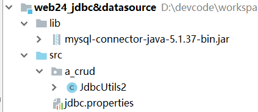
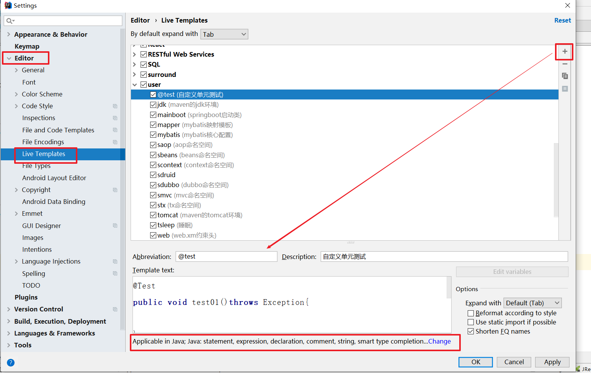
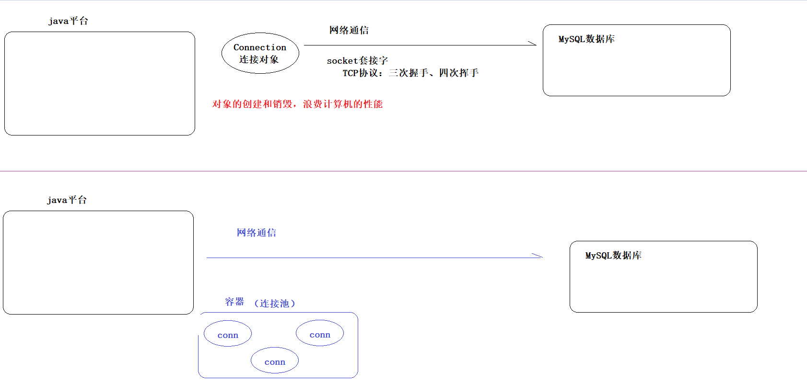
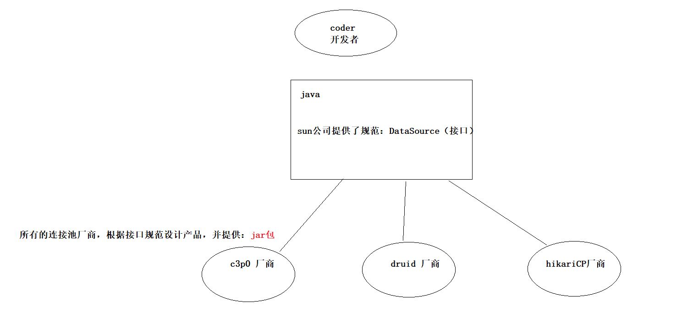
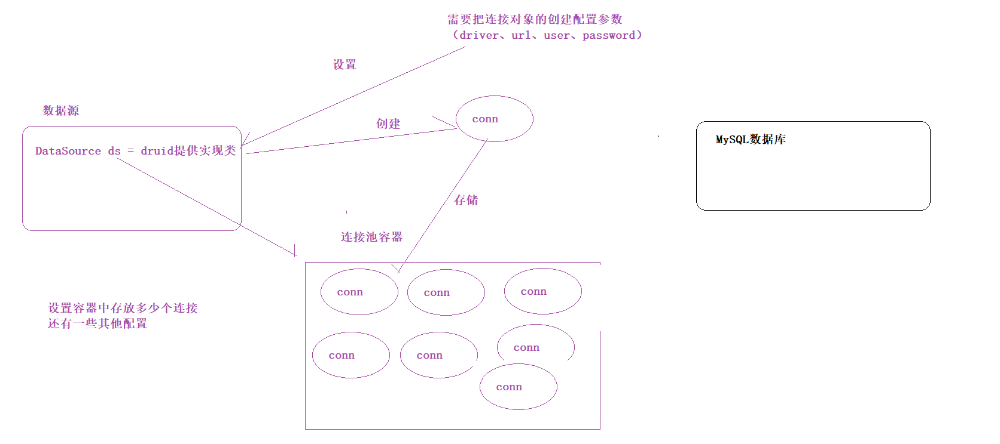
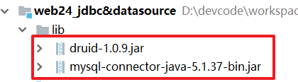
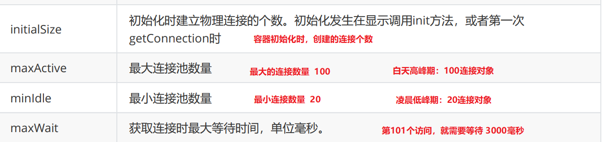
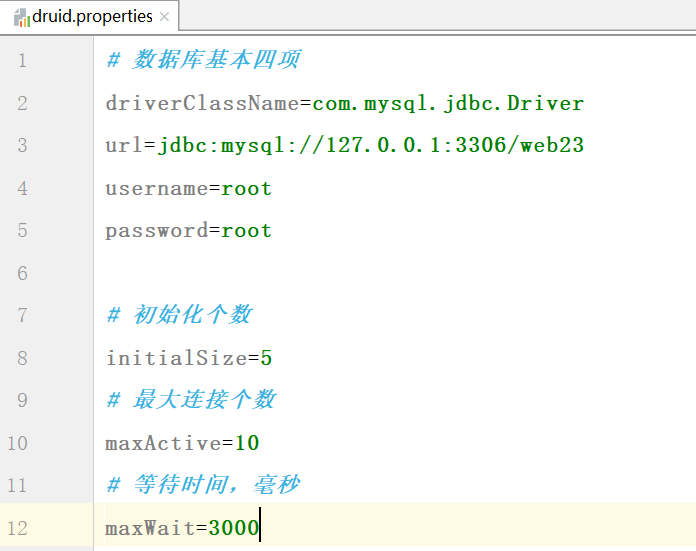
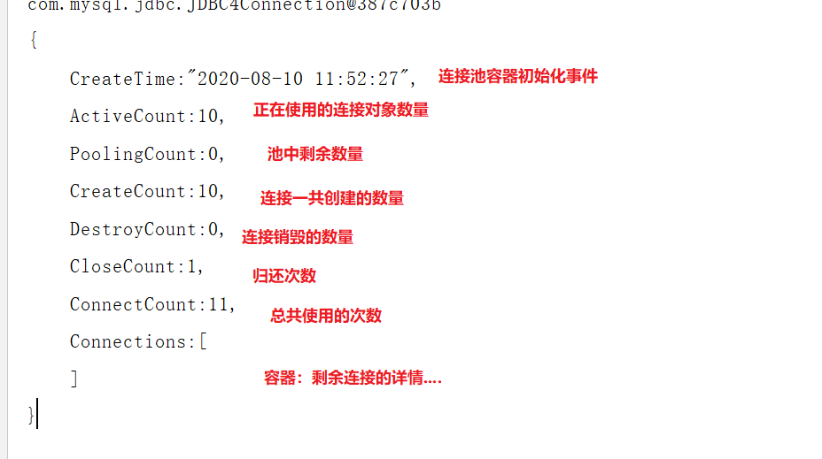
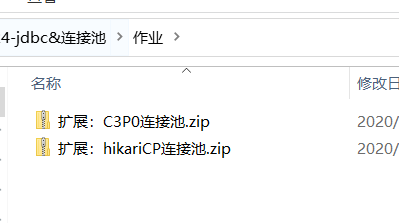

# PreparedStatement【重点】

## 1.1 概述

**SQL注入问题**

​	我们让用户输入的信息和SQL语句进行字符串拼接。用户输入的内容作为了SQL语句语法的一部分，改变了原有SQL真正的意义，以上问题称为SQL注入。 

```sql
-- 原本定义sql的时候，要求根据用户名和密码查询数据库
SELECT * FROM USER WHERE username = 'jack' AND PASSWORD = '123';

-- 刚才帅哥在用户输入的部分添加了一些特殊字符，就改变了sql原有的含义了 （sql注入）
SELECT * FROM USER WHERE username = 'admin' #' and password = '';
```


**解决sql注入问题**

我们就不能让用户输入的信息和SQL语句进行字符串拼接。需要使用PreparedSatement对象解决SQL注入。 

```sql
-- 在java中解决sql注入问题，通过占位符代替实际参数
SELECT * FROM `user` WHERE username = ? AND `password` = ?;

-- 模拟占位符的解决思想
SELECT * FROM `user` WHERE username = "admin' #" AND `password` = "";
```


**PreparedSatement基础语法**

```java
// 1.获取连接

// 2.编写sql（通过？占位符代替实际参数拼接）
String sql = "SELECT * FROM `user` WHERE username = ? AND `password` = ?";

// 3.获取sql预编译执行对象
PreparedSatement pstmt = conn.prepareStatement(sql);

// 4.设置占位符实际参数
pstmt.setString(1,"admin' #");
pstmt.setObject(2,"");

// 5.执行sql并返回结果
ResultSet resultSet = pstmt.executeQuery();

// 6.处理结果

// 7.释放资源
```


**优点**

1. 防止sql注入，提高程序的安全性
2. 参数与sql分离，使用 ？占位符，提高sql可读性
3. 减少编译次数，批量操作时（插入），提高程序高性能
   1. statement对象每次执行sql语句时，都需要进行编译
   2. PreparedSatement对象，只需要预编译一次，相同的sql语句，可以执行多次


**用户登录案例**

> 修改 web24_login 模块中的 LoginServlet

```java
@WebServlet("/LoginServlet")
public class LoginServlet extends HttpServlet {

    protected void doGet(HttpServletRequest request, HttpServletResponse response) throws ServletException, IOException {
        this.doPost(request, response);
    }

    protected void doPost(HttpServletRequest request, HttpServletResponse response) throws ServletException, IOException {
        // 统一编码
        request.setCharacterEncoding("utf-8");

        // 1.接收请求
        String username = request.getParameter("username");
        String password = request.getParameter("password");

        // 解决问题...
        // int i = 1/0;

        try {
            // 2.操作jdbc
            // 2.1 获取连接
            Connection connection = JdbcUtils2.getConnection();
            // 2.2 编写sql
            String sql = "select * from user where username = ? and password = ?";
            // 2.3 获取sql预编译执行对象
            PreparedStatement pstmt = connection.prepareStatement(sql);
            // 2.4 给？占位符设置实际参数
            pstmt.setObject(1, username);
            pstmt.setObject(2, password);

            // 2.5 执行sql并返回结果
            ResultSet resultSet = pstmt.executeQuery();

            // 3.判断结果集
            if (resultSet.next()) { // 如果用户名密码正确，最多返回一条
                String loginUsername = resultSet.getString("username");
                request.getSession().setAttribute("loginUsername", loginUsername);
                response.sendRedirect(request.getContextPath() + "/list.jsp");

            } else { // 如果用户名密码错误，啥也不返回
                request.setAttribute("error", "用户名或密码错误");
                request.getRequestDispatcher("/login.jsp").forward(request, response);
            }

        } catch (SQLException e) {
            e.printStackTrace();
        }
    }

}
```


```java
// 1.获取连接
// 2.编写sql（？占位符）
// 3.获取sql预编译执行对象
// 4.设置实际参数（可省略...）
// 5.执行sql并返回结果
// 6.处理结果
// 7.释放资源
```


**重写添加一条记录**

> 环境搭建



> 代码编写 

```java
    // 新增
    @Test
    public void testInsert() throws Exception {
        // 1.获取连接（使用昨天的数据库）
        Connection connection = JdbcUtils2.getConnection();
        // 2.编写sql（？占位符）
        String sql = "insert into user values(null,?,?)";
        // 3.获取sql预编译执行对象
        PreparedStatement pstmt = connection.prepareStatement(sql);

        // ---插入第一条记录
        // 4.设置实际参数（可省略...）
        pstmt.setString(1, "樱木花道");
        pstmt.setString(2, "333");
        // 5.执行sql并返回结果
        int i = pstmt.executeUpdate();
        // 6.处理结果
        if (i > 0) {
            System.out.println("第一条记录添加成功...");
        }
        // ---插入第二条记录
        pstmt.setString(1, "流川枫");
        pstmt.setString(2, "111");
        i = pstmt.executeUpdate();
        if (i > 0) {
            System.out.println("第二条记录添加成功...");
        }

        // 7.释放资源
        JdbcUtils2.release(pstmt, connection);
    }
```


**重写更新一条记录**

```java
    // 修改
    @Test
    public void testUpdate() throws Exception {
        // 1.获取连接
        Connection connection = JdbcUtils2.getConnection();
        // 2.编写sql（？占位符）
        String sql = "update user set password  = ? where id = ?";
        // 3.获取sql预编译执行对象
        PreparedStatement pstmt = connection.prepareStatement(sql);
        // 4.设置实际参数（可省略...）
        pstmt.setString(1, "555");
        pstmt.setInt(2, 9);
        // 5.执行sql并返回结果
        int i = pstmt.executeUpdate();
        // 6.处理结果
        if (i > 0) {
            System.out.println("修改成功");
        }
        // 7.释放资源
        JdbcUtils2.release(pstmt, connection);
    }
```


**重写删除一条记录**

```java
    // 删除
    @Test
    public void testDelete()throws Exception{
        // 1.获取连接
        Connection connection = JdbcUtils2.getConnection();
        // 2.编写sql（？占位符）
        String sql = "delete from user where id = ?";
        // 3.获取sql预编译执行对象
        PreparedStatement pstmt = connection.prepareStatement(sql);
        // 4.设置实际参数（可省略...）
        pstmt.setObject(1, 7);
        // 5.执行sql并返回结果
        int i = pstmt.executeUpdate();
        // 6.处理结果
        if (i>0) {
            System.out.println("删除成功");
        }
        // 7.释放资源
        JdbcUtils2.release(pstmt, connection);
    }
```


```java
// 1.获取连接
// 2.编写sql（？占位符）
String sql = "select * from user";
// 3.获取sql预编译执行对象
// 4.设置实际参数（可省略...）
// 5.执行sql并返回结果
// 6.处理结果
// 7.释放资源
```


## 1.3 自定义模板

```java
    @Test
    public void test01()throws Exception{
    
    }
```

 


# 二 连接池【使用】

## 2.1 概述

连接池其实就是一个容器(集合)，存放数据库连接的容器。

​	当系统初始化好后，容器被创建，容器中会申请一些连接对象，当用户来访问数据库时，从容器中获取连接对象，用户访问完之后，会将连接对象归还给容器。

 


**优点**

- 节约资源，减轻服务器压力
- 提高连接复用性，用户访问高效


**常见连接池**

```markdown
* DBCP：Apache提供的数据库连接池技术。

* C3P0：数据库连接池技术，目前使用它的开源项目有Hibernate等。

---------------------------------------------------------------

* HikariCP：小日本开发的连接池技术，性能之王,目前使用它的开源项目有SpringBoot等。

* Druid（德鲁伊）：阿里巴巴提供的数据库连接池技术，是目前最好的数据库连接池。
	600+项目中使用，支持sql日志监控
```


**实现**

Java为数据库连接池提供了公共的接口: <span style="color:red">DataSource </span>，各个连接池厂商去实现这套接口，提供jar包。

```markdown
1. DataSource
	功能
		* 获取连接：
				Connection getConnection()  
		* 归还连接：
				connction.close()
			连接池厂商对connection对象的close()方法进行（增强），执行该方法时不是销毁对象，而是归还到连接池中
				使用的动态代理技术进行增强的....
					web综合案例会给大家复习动态代理
					ssm框架中继续给大家复习动态代理
					saas项目还会给大家复习动态代理
```

 


## 2.2 Druid连接池

 

### 2.2.1 快速入门

#### ① 导入druid相关jar包

 

#### ② 初始化连接池【硬编码问题】

 


```java
public class DruidDemo1 {

    public static void main(String[] args)throws Exception {
        // 1.创建druid数据源（连接池）对象
        DruidDataSource dataSource = new DruidDataSource();
        // 2.配置数据库基本四项，创建连接，初始化连接池容器
        dataSource.setDriverClassName("com.mysql.jdbc.Driver");
        dataSource.setUrl("jdbc:mysql://localhost:3306/web23");
        dataSource.setUsername("root");
        dataSource.setPassword("root");

        // 指定初始化个数
        dataSource.setInitialSize(5);
        // 指定最大个数
        dataSource.setMaxActive(100);
        // 指定低峰期个数
        dataSource.setMinIdle(20);
        // 指定等待时间
        dataSource.setMaxWait(3000);

        // 3.从连接池中获得连接对象
        Connection connection = dataSource.getConnection();
        System.out.println(connection);

        // 4.归还到连接池
        connection.close(); // 此对象是druid提供的子类，实现了对close方法的增强，不再是销毁对象，而是归还到连接池
    }
}
```


### 2.2.2 配置文件

#### ① 配置文件编写

> key都是与定义好的，大家不要动，只需要修改对应的value参数即可

 


#### ② 加载配置文件，初始化连接池

```java
public class DruidDemo2 {

    public static void main(String[] args) throws Exception {

        // 通过类加载器，加载 druid.properties文件，获取io流
        InputStream in = DruidDemo2.class.getClassLoader().getResourceAsStream("druid.properties");
        Properties properties = new Properties();
        properties.load(in);

        // 通过druid工厂，创建druid连接池对象
        DataSource dataSource = DruidDataSourceFactory.createDataSource(properties);

        // 从连接池获取连接
        for (int i = 1; i <= 11; i++) {
            Connection connection = dataSource.getConnection();

            // 进行jdbc的 crud操作
            System.out.println(connection);

            // 模拟归还
            if(i== 10){
                connection.close();
            }
            // 连接池使用详情
            System.out.println(dataSource);
        }

        // 归还到连接
        //  connection.close();

    }
}
```


 


## 2.3 连接池工具类

​	我们每次操作数据库都需要创建连接池，获取连接，关闭资源，都是重复的代码。我们可以将创建连接池和获取连接池的代码放到一个工具类中。

> 连接池对象在项目启动时创建，初始化一次

**目的**：简化书写，提高效率


**步骤分析**

```java
public class JdbcUtils {
    
  	// 1. 初始化连接池容器  static{}
    
    // 2. 提供获取连接池对象的静态方法
    
    // 3. 提供获取连接对象的静态方法
    
    // 4. 提供释放资源的方法（conn对象是归还到连接池）
    
    
}
```


**代码实现**

```java
// 自定义连接池工具类
/*
    mybatis内置连接初始化代码....
 */
public class JdbcUtils {

    // 声明连接池对象
    private static DataSource dataSource;

    // 1. 初始化连接池容器  static{}
    static {
        try {
            // 1.加载druid.properties 配置文件
            InputStream in = JdbcUtils.class.getClassLoader().getResourceAsStream("druid.properties");
            Properties properties = new Properties();
            properties.load(in);

            // 2.通过druid的工厂，创建连接池对象
            dataSource = DruidDataSourceFactory.createDataSource(properties);
        } catch (Exception e) {
            throw new RuntimeException("druid连接池初始化失败...");

        }
    }

    // 2. 提供获取连接池对象的静态方法
    public static DataSource getDataSource() {
        return dataSource;
    }

    // 3. 提供获取连接对象的静态方法
    public static Connection getConnection() throws Exception {
        return dataSource.getConnection();
    }

    // 4. 提供释放资源的方法（conn对象不是销毁，而是归还到连接池）
    public static void release(ResultSet resultSet, Statement statement, Connection connection) {
        // 关闭ResultSet
        if (resultSet != null) {
            try {
                resultSet.close();
            } catch (SQLException e) {
                e.printStackTrace();
            }
        }

        // 关闭Statement
        if (statement != null) {
            try {
                statement.close();
            } catch (SQLException e) {
                e.printStackTrace();
            }
        }
        // 关闭Connection
        if (connection != null) {
            try {
                statement.close();
            } catch (SQLException e) {
                e.printStackTrace();
            }
        }

    }

    // 方法重载
    public static void release(Statement statement, Connection connection) {
        release(null, statement, connection);
    }


}
```


# 三 扩展内容

 
