# 一 JDBC基础

## 1.1 概述

Java 数据库连接（Java DataBase Connectivity）

**作用**：通过Java语言操作数据库，对记录进行增删改查

**本质**：是官方（sun公司）定义的一套操作所有关系型数据库的规则（接口）。各个数据库厂商去实现这套接口，提供数据库驱动jar包。我们可以使用这套接口（JDBC）编程，运行时的代码其实是驱动jar包中的实现类。

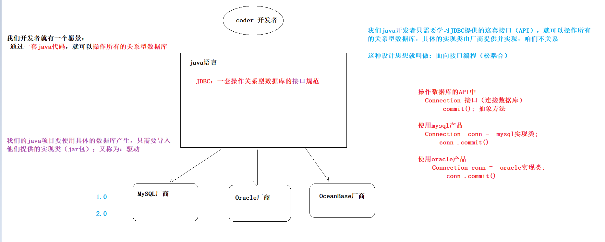 


## 1.2 快速入门

**需求**

通过java代码向数据库user表插入一条记录


#### ① 创建数据库和表

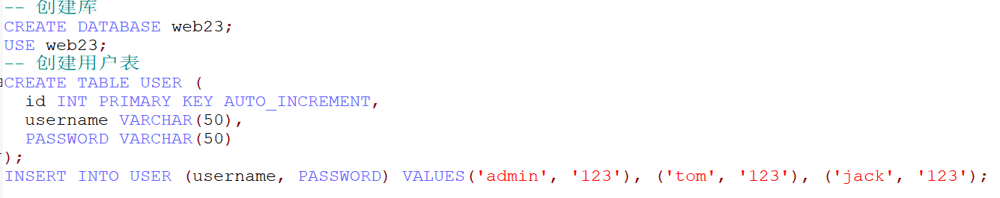 


#### ② 创建java工程，导入mysql驱动

 


#### ③ 编写java代码，插入记录

```java
// 1.注册驱动
// 2.建立连接
// 3.编写sql
// 4.获取sql执行对象
// 5.发送（执行）sql并返回结果
// 6.处理结果
// 7.释放资源
```

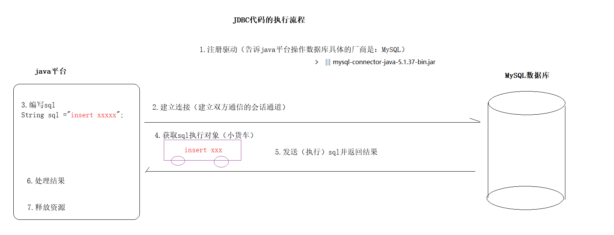 


```java
public class JdbcQuick {

    public static void main(String[] args) throws Exception {
        // 1.注册驱动
        DriverManager.registerDriver(new Driver());
        // 2.建立连接
        Connection connection = DriverManager.getConnection("jdbc:mysql://localhost:3306/web23", "root", "root");
        // 3.编写sql （在java中编写sql语句，结尾可以不加分号）
        String sql = "insert into user values(null,'lucy','666')";
        // 4.获取sql执行对象（小货车）
        Statement statement = connection.createStatement();
        // 5.发送（执行）sql并返回结果
        int i = statement.executeUpdate(sql);
        // 6.处理结果
        if (i > 0) {
            System.out.println("新增成功");
        } else {
            System.out.println("新增失败");
        }
        // 7.释放资源
        statement.close();
        connection.close();
    }
}
```


## 1.3 API介绍

> sun公司提供的：java.sql包下

**DriverManager：驱动管理对象【工具类】**

```markdown
1. 注册驱动
	a）【了解】
		static void registerDriver(Driver driver)  
		我们通过翻看mysql Driver驱动实现类的源码发现了，内部静态代码块已经实现注册驱动功能
		    static {
                try {
                    DriverManager.registerDriver(new Driver());
                } catch (SQLException var1) {
                    throw new RuntimeException("Can't register driver!");
                }
            }
    b)反射【掌握】
    	Class.forName("com.mysql.jdbc.Driver");
	
2. 建立连接
		static Connection getConnection(String url, String user, String password)  
	参数说明
		url：建立指定数据库连接的URL地址【固定格式】
			格式：jdbc:mysql://ip地址:端口/数据库名称
			实例：
				jdbc:mysql://localhost:3306/web23
				jdbc:mysql:///web23
		user：用户名
		password：密码
```

**Connection：数据库连接对象**

```markdown
1. 获取sql执行对象【小货车】
		Statement createStatement()  【今天】
		PreparedStatement prepareStatement(String sql)  【明天】

2. 事务管理
	a）开启事务（关闭自动提交）
		void setAutoCommit(boolean autoCommit)  
			参数：
				true：自动提交sql【mysql默认值】
				false：手动提交
	b）提交事务
		void commit()  
	c）回滚事务
		void rollback()  
```

**Statement：执行（发送）sql语句的对象**

```markdown
1. 执行所有类型（DDL、DML、DQL）的sql语句 【了解】
		boolean execute(String sql)  
------------------------------------------

2. 用于执行DML类型的sql语句
		int executeUpdate(String sql)  
			参数：insert、delete、update的sql语句
			返回：影响行数
			
3. 用于执行DQL类型的sql语句
		ResultSet executeQuery(String sql)  
			参数：select的sql语句
			返回：结果集（集合对象）
```

**ResultSet：结果集对象,封装查询结果**

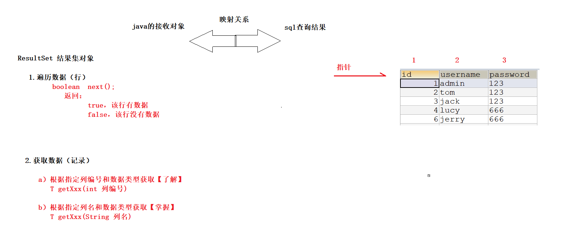 


```markdown
1. 指针下移
		boolean	next()
			返回
				true，此行有数据
				flase，表示此行没数据
			通常与while循环结合使用，遍历数据
			
2. 获取数据（key-value）
		T getXxx(int 列编号)
		T getXxx(String 列名)
		
		补充：获取所有的数据类型
			Object getObject(String 列名)
			String getString(String 列名)
```


## 1.4 CRUD操作【作业】

> 帮助大家去理解jdbc的执行步骤....

```java
// 1.注册驱动
// 2.建立连接
// 3.编写sql
// 4.获取sql执行对象
// 5.发送sql并返回结果
// 6.处理结果
// 7.释放资源
```


**user表 添加一条记录**

```java
// 新增：课下作业
@Test
public void testInsert() throws Exception {

}
```

**user表 修改一条记录**

```java
// 修改
@Test
public void testUpdate() throws Exception {
    // 1.注册驱动
    Class.forName("com.mysql.jdbc.Driver");
    // 2.建立连接
    Connection connection = DriverManager.getConnection("jdbc:mysql://localhost:3306/web23", "root", "root");
    // 3.编写sql
    String sql = "update user set password = '999' where id = 6";
    // 4.获取sql执行对象
    Statement statement = connection.createStatement();
    // 5.发送sql并返回结果
    int i = statement.executeUpdate(sql);
    // 6.处理结果
    if (i>0) {
        System.out.println("修改成功");
    }else{
        System.out.println("修改失败");
    }
    // 7.释放资源
    statement.close();
    connection.close();
}
```

**user表 删除一条记录**

```java
// 删除
@Test
public void testDelete() throws Exception {
    // 1.注册驱动
    Class.forName("com.mysql.jdbc.Driver");
    // 2.建立连接
    Connection connection = DriverManager.getConnection("jdbc:mysql://localhost:3306/web23", "root", "root");
    // 3.编写sql
    String sql = "delete from user where id = 4";
    // 4.获取sql执行对象
    Statement statement = connection.createStatement();
    // 5.发送sql并返回结果
    int i = statement.executeUpdate(sql);
    // 6.处理结果
    if (i>0) {
        System.out.println("删除成功");
    }else{
        System.out.println("删除失败");
    }
    // 7.释放资源
    statement.close();
    connection.close();
}
```

**user表 查询所有记录**

```java
// 查询
@Test
public void testSelect() throws Exception {
    // 1.注册驱动
    Class.forName("com.mysql.jdbc.Driver");
    // 2.建立连接
    Connection connection = DriverManager.getConnection("jdbc:mysql://localhost:3306/web23", "root", "root");
    // 3.编写sql
    String sql = "select * from user";
    // 4.获取sql执行对象
    Statement statement = connection.createStatement();
    // 5.发送sql并返回结果
    ResultSet resultSet = statement.executeQuery(sql);
    // 6.处理结果
    while (resultSet.next()) {
        // 遍历行 （根据列名获取该行的值）
        int id = resultSet.getInt("id");
        String username = resultSet.getString("username");
        String password = resultSet.getString("password");
        System.out.println("id:" + id + ",username:" + username + ",password:" + password);
    }
    // 7.释放资源
    resultSet.close();
    statement.close();
    connection.close();
}
```


## 1.5 工具类【抄一遍，理解思想】

​	通过上面案例需求我们会发现每次去执行SQL语句都需要注册驱动，获取连接，得到Statement，以及释放资源。发现很多重复的劳动，我们可以将重复的代码定义到一个工具类中。 

**目的**：简化书写，一劳永逸

> 工具类设计的越复杂，代码写起来就越轻松


**步骤分析**

```java
public class JdbcUtils{
    
    // 1.注册驱动【保证只注册一次】
    static{
        
    }
    
    // 2.获取连接
    public static Connection getConnection(){
        return null;
    }
    
    // 3.释放资源
    public static void release(){
        // 关闭ResultSet
        // 关闭Statement
        // 关闭Connection
    }
    
}
```


### 1.5.1 版本一

```java
public class JdbcUtils1 {

    // 1.注册驱动【保证只注册一次】
    static {
        try {
            Class.forName("com.mysql.jdbc.Driver");
        } catch (ClassNotFoundException e) {
            throw new RuntimeException("注册驱动失败...");
        }
    }

    // 2.获取连接
    public static Connection getConnection() throws SQLException {
        return DriverManager.getConnection("jdbc:mysql://localhost:3306/web23", "root", "root");
    }

    // 3.释放资源
    public static void release(ResultSet resultSet, Statement statement, Connection connection) {
        // 关闭ResultSet
        if (resultSet != null) {
            try {
                resultSet.close();
            } catch (SQLException e) {
                e.printStackTrace();
            }
        }

        // 关闭Statement
        if (statement != null) {
            try {
                statement.close();
            } catch (SQLException e) {
                e.printStackTrace();
            }
        }
        // 关闭Connection
        if (connection != null) {
            try {
                statement.close();
            } catch (SQLException e) {
                e.printStackTrace();
            }
        }

    }

    // 方法重载
    public static void release(Statement statement, Connection connection) {
        release(null, statement, connection);
    }

}
```


### 1.5.2 版本二

> 版本一工具类的代码有没有什么缺点？

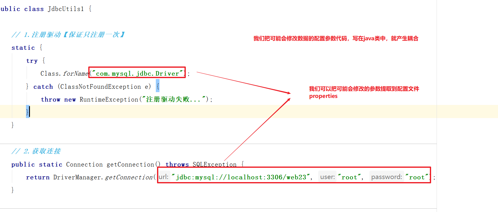 


**抽取jdbc配置文件**

```properties
# jdbc配置文件格式 key=value
jdbc.driver=com.mysql.jdbc.Driver
jdbc.url=jdbc:mysql://localhost:3306/web23
jdbc.username=root
jdbc.password=root
```

**修改工具类**

```java
public class JdbcUtils2 {

    // 声明数据库配置变量
    private static String driver;
    private static String url;
    private static String username;
    private static String password;
    
    // 加载jdbc.properties配置文件，给变量赋值
    static {
        // SE阶段 new Properties.load();

        // sun公司提供，专门加载src目录下的properties类型文件，不需要手写扩展名
        ResourceBundle jdbc = ResourceBundle.getBundle("jdbc");
        driver=jdbc.getString("jdbc.driver");
        url=jdbc.getString("jdbc.url");
        username=jdbc.getString("jdbc.username");
        password=jdbc.getString("jdbc.password");
    }
    
    

    // 1.注册驱动【保证只注册一次】
    static {
        try {
            Class.forName(driver);
        } catch (ClassNotFoundException e) {
            throw new RuntimeException("注册驱动失败...");
        }
    }

    // 2.获取连接
    public static Connection getConnection() throws SQLException {
        return DriverManager.getConnection(url, username, password);
    }

    // 3.释放资源
    public static void release(ResultSet resultSet, Statement statement, Connection connection) {
        // 关闭ResultSet
        if (resultSet != null) {
            try {
                resultSet.close();
            } catch (SQLException e) {
                e.printStackTrace();
            }
        }

        // 关闭Statement
        if (statement != null) {
            try {
                statement.close();
            } catch (SQLException e) {
                e.printStackTrace();
            }
        }
        // 关闭Connection
        if (connection != null) {
            try {
                statement.close();
            } catch (SQLException e) {
                e.printStackTrace();
            }
        }

    }

    // 方法重载
    public static void release(Statement statement, Connection connection) {
        release(null, statement, connection);
    }

}
```


## 1.6 事务操作

```markdown
* 事务
	如果一个包含多个步骤的业务操作，被事务管理，那么这些操作要么同时成功，要么同时失败。
	
* MySQL操作
	1.开启事务
		begin | start transaction
	2.提交事务
		commit
	3.回顾事务
		rollback
	
* java操作（使用Connection对象）
	1.关闭自动提交（开启事务）
		void setAutoCommit(false);
	2.提交事务
		void commit();
	3.回顾事务
		void rollback();
```

**需求**

通过java代码模拟转账案例，进行事务控制


#### ① 创建账户表

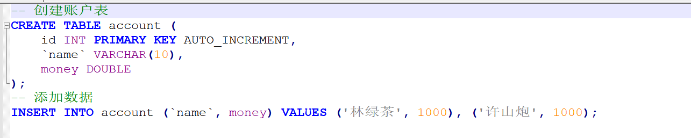 


#### ② 转账代码

```java
public class TXDemo{
    
    @Test
    public void testTX(){
        try{
            // 1.获取连接【JdbcUtils2】
            // 2.开启事务
            
            // 3.许山炮扣钱
            // 4.林绿茶加钱
            
            // 5.提交事务 
        }catch(Exception e){
            // 6.回滚事务
            
        }finally{
            // 7.释放资源
        }
       
    }
}
```


```java
public class TXDemo {

    @Test
    public void testTX() {
        // 声明对象
        Connection connection =null;
        Statement statement = null;

        try {
            // 1.获取连接【JdbcUtils2】
            connection = JdbcUtils2.getConnection();
            // 2.开启事务
            connection.setAutoCommit(false);

            // 3.许山炮扣钱
            // 4.林绿茶加钱

            // 5.提交事务
            connection.commit();
        } catch (Exception e) {
            // 6.回滚事务
            try {
                connection.rollback();
            } catch (SQLException e1) {
                e1.printStackTrace();
            }

        } finally {
            // 7.释放资源
            JdbcUtils2.release(statement, connection);
        }

    }
}
```


```java
public class TXDemo {

    @Test
    public void testTX() {
        // 声明对象
        Connection connection = null;
        Statement statement = null;

        try {
            // 1.获取连接【JdbcUtils2】
            connection = JdbcUtils2.getConnection();
            // 2.开启事务
            connection.setAutoCommit(false);
            // 获取sql执行对象
            statement = connection.createStatement();

            // 3.许山炮扣钱
            String xuSql = "update account set money = money - 100 where id = 2";
            int xuResult = statement.executeUpdate(xuSql);
            if (xuResult > 0) {
                System.out.println("许山炮支付成功....");
            }

            // 模拟错误
            int i = 1 / 0;

            // 4.林绿茶加钱
            String linSql = "update account set money = money + 100 where id = 1";
            int linResult = statement.executeUpdate(linSql);
            if (linResult > 0) {
                System.out.println("林绿茶收款成功...");
            }

            // 5.提交事务
            connection.commit();
        } catch (Exception e) {
            System.out.println("机器故障啦....");
            // 6.回滚事务
            try {
                connection.rollback();
            } catch (SQLException e1) {
                e1.printStackTrace();
            }

        } finally {
            // 7.释放资源
            JdbcUtils2.release(statement, connection);
        }

    }
}
```


# 二 案例：用户登录【大作业】

**需求**

用户输入账号和密码，实现登录网站功能


## 2.1 需求分析

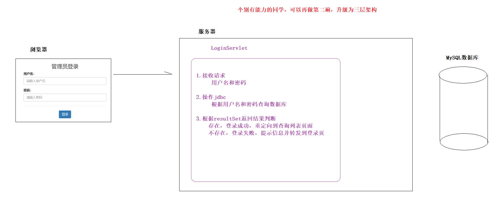 


## 2.2 代码实现

#### ① 创建web工程，导入jar包

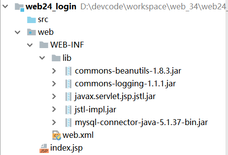 


#### ② 导入页面资源

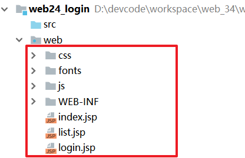 


#### ③ 导入JdbcUtils工具类

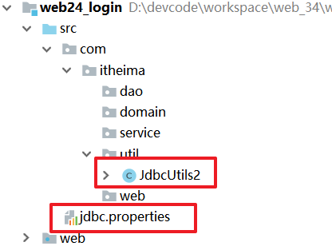 

> 做到这里，先测试环境是否可以正常运行


#### ④ LoginServlet

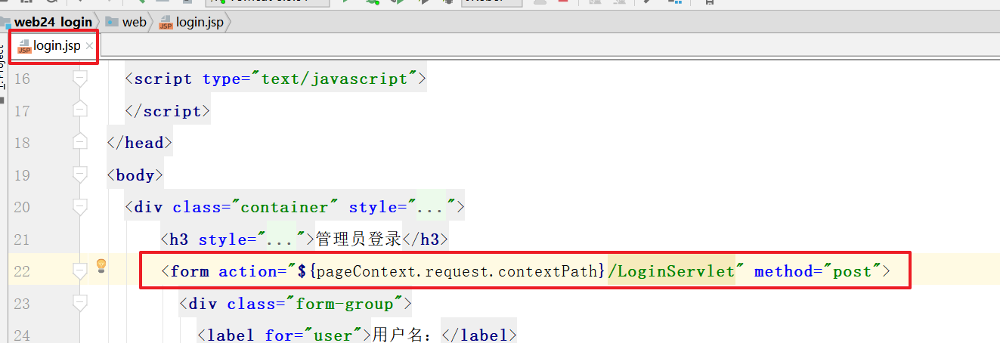 


```java
@WebServlet("/LoginServlet")
public class LoginServlet extends HttpServlet {

    protected void doGet(HttpServletRequest request, HttpServletResponse response) throws ServletException, IOException {
        this.doPost(request, response);
    }

    protected void doPost(HttpServletRequest request, HttpServletResponse response) throws ServletException, IOException {
        // 统一编码
        request.setCharacterEncoding("utf-8");

        // 1.接收请求
        String username = request.getParameter("username");
        String password = request.getParameter("password");

        try {
            // 2.操作jdbc
            // 2.1获取连接
            Connection connection = JdbcUtils2.getConnection();
            // 2.2编写sql
            // String sql = "select * from user where username = 'jack' and password = '123'";
            String sql = "select * from user where username = '" + username + "' and password = '" + password + "'";
            System.out.println(sql);
            // 2.3获取sql执行对象
            Statement statement = connection.createStatement();
            // 2.4执行sql并返回结果
            ResultSet resultSet = statement.executeQuery(sql);

            // 3.判断结果集
            if (resultSet.next()) { // 如果用户名密码正确，最多返回一条
                String loginUsername = resultSet.getString("username");
                request.getSession().setAttribute("loginUsername", loginUsername);
                response.sendRedirect(request.getContextPath() + "/list.jsp");

            } else { // 如果用户名密码错误，啥也不返回
                request.setAttribute("error", "用户名或密码错误");
                request.getRequestDispatcher("/login.jsp").forward(request, response);
            }

        } catch (SQLException e) {
            e.printStackTrace();
        }
    }

}
```


#### ⑤ list.jsp

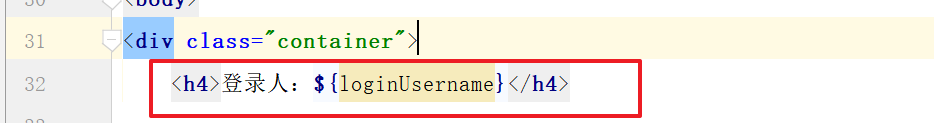 


#### ⑥ login.jsp

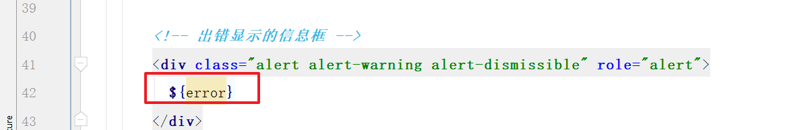 


## 2.3 代码调试技巧

> debug....
>
> web项目中所有的入口都是浏览器，发送的请求
> 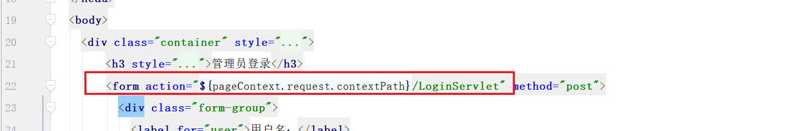 


> 确定了请求入口的访问地址，就可找到代码的servlet，代码第一行打上断点

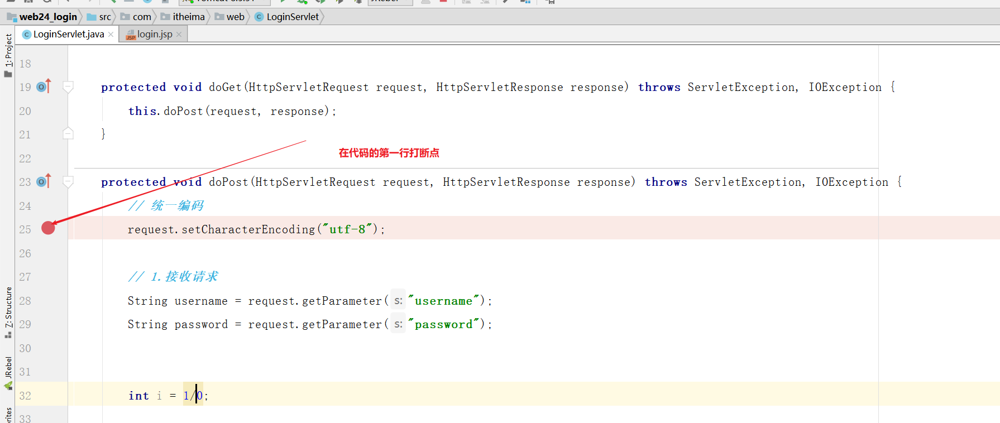 


**步骤**

1.找到请求入口

2.找到对应servlet

3.在代码的第一行打上断点，F8下一步跟进，定位问题

4.解决后放行断点，取消断点，进行测试...