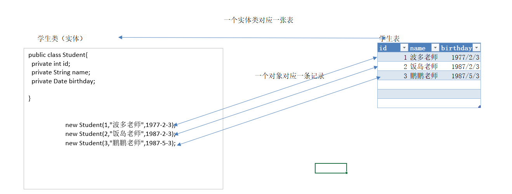

# 一 数据库介绍

## 1.1 什么是数据库？

存储数据的仓库,本质上就是存储数据的文件系统，方便我们管理数据。


## 1.2 数据库管理系统

数据库管理系统（DataBase Management System，DBMS）：指一种操作和管理数据库的大型软件。

数据库管理系统-> mysql软件 -> 多个仓库 --> 多张表 --> 多条记录（数据）

 


## 1.3 实体（java类）和表关系【重点】

- 一个实体类对应一张表
- 一个对象对应一条记录
- 对象和数据产生映射关系【ORM：Object Relational Mapping】

  


## 1.4 常见关系型数据库

```markdown
1. MYSQL：开源免费的数据库，小型的数据库.已经被Oracle收购了.MySQL6.x版本（社区、商业）也开始收费。

2. Oracle：收费的大型数据库，Oracle公司的产品。Oracle收购SUN公司，收购MYSQL。

3. DB2：IBM公司的数据库产品,收费的。常应用在银行系统中。

4. OceanBase：阿里的大型数据库，性能已超越Oracle全球第一

------------------------------------------------------

5. SQLServer：MicroSoft 公司收费的中型的数据库。C#、.net等语言常使用。

6. SyBase：已经淡出历史舞台。提供了一个非常专业数据建模的工具PowerDesigner。

7. SQLite: 嵌入式的小型数据库，应用在手机端。
```


# 二 MySQL安装和使用

## 2.1 安装

**参考《mysql5.7绿色版安装.pdf》**


 


## 2.2 配置

```markdown
* 开启自启动mysql软件

1. 登录
	a.dos命令窗口
		1）本地登录
			mysql -u用户名 -p密码
		2）远程登录
			mysql -h主机ip地址 -u用户名 -p密码
	b.图形化界面（sqlyog）

2. 退出
	exit
	quit
```


 


# 三 SQL

## 3.1 概述

### 3.1.1 什么是SQL？

结构化查询语言（Structured Query Language）

> 通过sql指令，可以实现对数据的增删改查
>
> 【CRUD】：create 创建、retrieve（read）检索、update 修改、delete 删除


### 3.1.2 SQL方言

SQL是一套标准，所有的数据库厂商都实现了此标准；但是各自厂商在此标准上增加了特有的语句，这部分内容我们称为方言。

- 我们在学习sql时，需要关注每一家数据库厂商特有的方言
- 例如：MySQL方言注释 #


### 3.1.3 SQL书写规范

```markdown
1. sql语句可以单行或多行书写，最后以分号结尾

2. sql语句（在windows平台）不去分大小写，建议关键字大写
	SELECT * FROM student;
	
3. 注释
	单行
		-- 所有数据库厂商支持的注释 
		#  mysql特有的方言
	多行
		/*  注释内容 */
```


### 3.1.4 SQL分类

```markdown
1. DDL(Data Definition Language)数据定义语言 
		用来定义数据库对象：数据库，表，列等。关键字：create,drop,alter等
	
2. DML(Data Manipulation Language)数据操作语言 
		用来对数据库中表的数据进行增删改。关键字：insert,delete, update等
	
3. DQL(Data Query Language) 数据查询语言
		用来查询数据库中表的记录(数据)。关键字：select, where等
		
----------------------------------------------------

4. DCL(Data Control Language)数据控制语言
		用来定义数据库的访问权限和安全级别，及创建用户。关键字：grant,revoke等

5. TCL(Transaction Control Language) 事务控制语言
		用于控制数据库的事务操作，关键字; commit,savepoint,rollback等
```


# 四 SQL基础操作

## 4.1 DDL【课下抄一遍】

- 进入公司后，数据库和表一个项目只创建一次，通常DBA 数据库管理员（DataBase  Adminisitrator）
- 下节课帅哥就讲解图形化工具，可以简化DDL这部分操作（10分钟掌握...）

### 4.1.1 操作数据库

- 创建库，显示库，修改库，删除库操作

**C：创建**

```markdown
1. 直接创建一个数据库【掌握】
	语法：
		create database 数据库名;
	实例：
		create database web18;
		
2. 创建数据库时指定字符集【了解】
	语法：
		create database 数据库名 charset 字符集;
	实例：
		create database web18_1 charset gbk;
```


**R：查询**

```markdown
1. 查看所有数据库
	语法：
		show databases;
		
2. 查看建库语句
	语法：
		show create database 数据库名;
	实例：
		show create database web18_1;
```


**U：修改**

```markdown
1. 修改数据库字符集
	语法：
		alter database 数据库名 charset 新字符集;
	实例：
		alter database web18_1 charset utf8;
```


**D：删除**

```markdown
1. 直接删除数据库
	语法：
		drop database 数据库名;
	实例：
		drop database web18_1;
```


**使用数据库**

```markdown
1. 进入/切换到某一个指定数据库
	语法：
		use 数据库名;
	实例：
		use web18;
		
2. 查看你当前所在的位置（哪个数据库中）
	语法：
		select database();
```


### 4.1.2 操作表

- 创建表，显示表，修改表，删除表操作

**C：创建**

```markdown
1. 创建表（掌握）
	语法：
		create table 表名(
			列名（字段名） 数据类型,
			列名（字段名） 数据类型,
			列名（字段名） 数据类型
			...
		);
	实例：
		create table student(
			id int,
			name varchar(32),
			birthday date
		);
		
2. 常用的数据类型
	int：整型
	float：单精度浮点型
	double：双精度浮点型
	decimal：大数据的浮点型（保留精准度）
		decimal(m,n) 指定范围
			m:总长度
			n：小数位长度
		例如：
			decimal(5,2)
				999.99 最大值
				0.01   最小值
	varchar：字符串
		varchar(n) 指定字符串最大的长度 n：1~65535
			包含字母、符号、汉字
	text：文本型
	date：日期型 （年月日）
	datetime：日期时间型 （年月日时分秒）
	
3. 克隆表
	创建新表时可以克隆旧表的数据结构（字段和类型）
	语法：
		create table 新表 like 旧表;
	实例：
		create table teacher like student;
```


**R：查询**

```markdown
1. 查看所有表
	语法：
		show tables;
		
2. 查看建表语句
	语法：
		show create table 表名;
	实例：
		show create table teacher;
		
3. 查看表结构
	语法：
		desc 表名;
	实例：
		desc teacher;
```


**U：修改**

```markdown
1. 添加一列
	语法：
		alter table 表名 add 列名 数据类型;
	实例：
		alter table teacher add xinzi int;
		
2. 修改列数据类型
	语法：
		alter table 表名 modify 指定列 新类型;
	实例：
		alter table teacher modify xinzi float;
		
3. 修改列名
	语法：
		alter table 表名 change 旧列名 新列名 新类型;
	实例：
		alter table teacher change xinzi salary decimal(5,2);
		
4. 删除指定列
	语法：
		alter table 表名 drop 列名;
	实例：
		alter table teacher drop salary;
		
5. 修改表字符集
	语法：
		alter table 表名 charset 字符集;
	实例：
		alter table teacher charset gbk;

--------------------------

6. 修改表名
	语法：
		rename table 旧表名 to 新表名;
    实例：
    	rename table teacher to tch;
```


**D：删除**

```markdown
1. 直接删除表
	语法：
		drop table 表名;
	实例：
		drop table tch;
```


### 4.1.3 图形化工具

- 在企业开发时，我们一般不会使用dos窗口进行sql编辑，推荐第三方的图形化工具提高效率（sqlyog）

- > 帅哥在今天的资料中提供了这个软件...解压即用版本

 


 


## 4.2 DML

### 4.2.1 添加记录

```markdown
1. 语法：
		insert into 表名(列名1,列名2,....) values(值1,值2,...);
		insert into 表名 values(值1,值2,....);
			要求：值插入的顺序跟表结构一致
            查看：desc 表名
		
2. 注意：
	列名和值要求类型要求对应
	字符串类型数据可以使用单双引，推荐单引号
	字符串可以插入一切（任意）类型，MySQL底层实现隐式转换
	如果添加的字段与关键字冲突了，可以使用反引号包裹起来
		例如：`name` `order` `user`
	
3. 练习
		insert into student(id,name)values(1,'tom');
		insert into student values(4,'王健林',null);
		
		insert into student(id,`name`,birthday)values(2,'jerry','1940-2-10');
		insert into student values(3,'杰克马','1970-1-1');		
4. 补充
	同时添加多条记录
		insert into student values(5,'刘强东',null),(6,'王思聪',null);
```


**蠕虫复制【了解】**

```markdown
1. 作用：将一张表的记录，快速复制到另外一张表

2. 应用场景：数据迁移，开发中很少使用...

3. 需求：创建一张stu新表，表结构需要跟student一张，实现数据的迁移

4. 步骤：
	1.克隆表
		create table stu like student;
	2.蠕虫复制
		insert into stu select * from student;
```


### 4.2.2 修改记录

```markdown
1. 语法：
		update 表名 set 列名1=新值1,列名2=新值2 ... [where条件]
		
2. 解释
		[] 里面的内容可写可不写...
		
3. 实例：
		update stu set birthday = '1975-1-1';
		update stu set birthday = '1977-1-1' where id = 5;
```


### 4.2.3 删除记录

```markdown
1. 语法：
		delete from 表名 [where条件]
		
2. 解释
		[] 里面的内容可写可不写...
		
3. 实例
		delete from stu; 【开发中杜绝使用...】
		delete from student where id = 4;
		
4. 摧毁表，重构表【了解】
	先把这张表删除，再创建相同结构的新表
		truncate table 表名;
		truncate table student;
```


### 4.2.4 知识小结

> - 新增记录：insert into 表名
> - 修改记录：update 表名
> - 删除记录：delete from 表名


## 4.3 DQL简单查询

**导入数据**

```sql
-- 创建表
create table student1(
	id int,
	name varchar(20),
	chinese double,
	english double,
	math double
);
-- 插入记录
insert into student1(id,name,chinese,english,math) values(1,'tom',89,78,90);
insert into student1(id,name,chinese,english,math) values(2,'jack',67,98,56);
insert into student1(id,name,chinese,english,math) values(3,'jerry',87,78,77);
insert into student1(id,name,chinese,english,math) values(4,'lucy',88,NULL,90);
insert into student1(id,name,chinese,english,math) values(5,'james',82,84,77);
insert into student1(id,name,chinese,english,math) values(6,'jack',55,85,45);
insert into student1(id,name,chinese,english,math) values(7,'tom',89,65,30);
```


**语法**

```markdown
1. 语法：
		select * from 表名;
		select 列名1,列名2.... from 表名;
		
2. 去重关键字
		select distinct 列名 from 表名;
			注意：多列去重，要求内容完全一致...
			
3. 在查询语句中进行运算，不会影响原表中的数据..

4. null值参数学运算结果还是null
	ifnull() 函数
		ifnull(列名,默认值) 如果该有字段为null，就可以指定你自定义的默认值
		
5. 设置别名
		select 列名 [as] 列别名 from 表名 [as] 表别名;
		
6. 解释
		[] 里面内容可写可不写
```


**练习**

```sql
-- 查询表中所有学生的信息
SELECT * FROM student1;
-- 查询表中所有学生的姓名和对应的语文成绩
SELECT `name`,chinese FROM student1;
-- 查询表中学生姓名（去重）
SELECT `name` FROM student1;
SELECT DISTINCT `name` FROM student1;
SELECT DISTINCT `name`,chinese FROM student1;

-- 在所有学生数学分数上加10分特长分
SELECT `name`,math+10 FROM student1;

-- 统计每个学生的总分
SELECT IFNULL(english,0) FROM student1;
SELECT `name`,chinese+IFNULL(english,0)+math FROM student1;


-- 使用别名表示学生总分
SELECT `name` AS 姓名 ,chinese+IFNULL(english,0)+math AS 总分 FROM student1;

SELECT s.name FROM student1 AS s;
```


## 4.4 DQL条件查询【单表】

**导入数据**

```sql
-- 创建表
CREATE TABLE student2 (
  id int,
  name varchar(20),
  age int,
  sex varchar(5),
  address varchar(100),
  math int,
  english int
);
-- 插入记录
INSERT INTO student2(id,NAME,age,sex,address,math,english) VALUES 
(1,'马云',55,'男','杭州',66,78),
(2,'马化腾',45,'女','深圳',98,87),
(3,'马景涛',55,'男','香港',56,77),
(4,'柳岩',20,'女','湖南',76,65),
(5,'柳青',20,'男','湖南',86,NULL),
(6,'刘德华',57,'男','香港',99,99),
(7,'马德',22,'女','香港',99,99),
(8,'德玛西亚',18,'男','南京',56,65);
```


**语法**

```markdown
1. 语法
		select ... from 表名 where 条件;
		
2. 关系（比较）运算符
		= != > < >= <=
		
3. 逻辑运算符
		&&	and（条件同时成立）
		||	or（条件满足一个）
		!	not（条件取反）
	
4. in关键字（某一列，查询多个值）
		select ... from 表名 where 列名 in (值1,值2,值3....);
		
5. between关键字（范围查询）
		select ... from 表名 where 列名 between 较小的值 and 较大的值;
		
6. null值判断
	is null 查询null值数据
	is not null 查询非null值数据
	
7. like关键字（模糊匹配）
		select ... from 表名 where 列名 like '通配符字符串';
		_ 单个任意字符
		% 多个任意字符	
```


**练习**

```sql
# 关系运算符
-- 查询math分数大于80分的学生
SELECT * FROM student2 WHERE math > 80;
-- 查询english分数小于或等于80分的学生
SELECT * FROM student2 WHERE english <= 80;
-- 查询age等于20岁的学生
SELECT * FROM student2 WHERE age = 20;
-- 查询age不等于20岁的学生
SELECT * FROM student2 WHERE age != 20;

# 逻辑运算符
-- 查询age大于35 且 性别为男的学生(两个条件同时满足)
SELECT * FROM student2 WHERE age > 35 AND sex = '男';
-- 查询age大于35 或 性别为男的学生(两个条件其中一个满足)
SELECT * FROM student2 WHERE age > 35 OR sex = '男';
-- 查询id是1或3或5的学生
SELECT * FROM student2 WHERE id = 1 OR id = 3 OR id = 5;
-- in关键字
-- 再次查询id是1或3或5的学生
SELECT * FROM student2 WHERE id IN (1,3,5);

-- 查询id不是1或3或5的学生
SELECT * FROM student2 WHERE id NOT IN (1,3,5);

-- 查询english成绩大于等于77，且小于等于87的学生
SELECT * FROM student2 WHERE english >=77 AND english <=87;

SELECT * FROM student2 WHERE english BETWEEN 77 AND 87;

-- 查询英语成绩为null的学生
SELECT * FROM student2 WHERE english IS NULL;

-- 查询英语成绩为非null的学生
SELECT * FROM student2 WHERE english IS NOT NULL;


# like模糊匹配
-- 查询姓马的学生
SELECT * FROM student2 WHERE  `name` LIKE '马%';
-- 查询姓名中包含'德'字的学生
SELECT * FROM student2 WHERE  `name` LIKE '%德%';
-- 查询姓马，且姓名有三个字的学生
SELECT * FROM student2 WHERE  `name` LIKE '马__';

```


