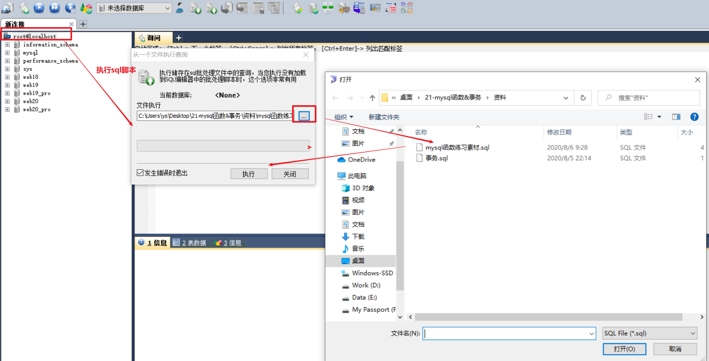
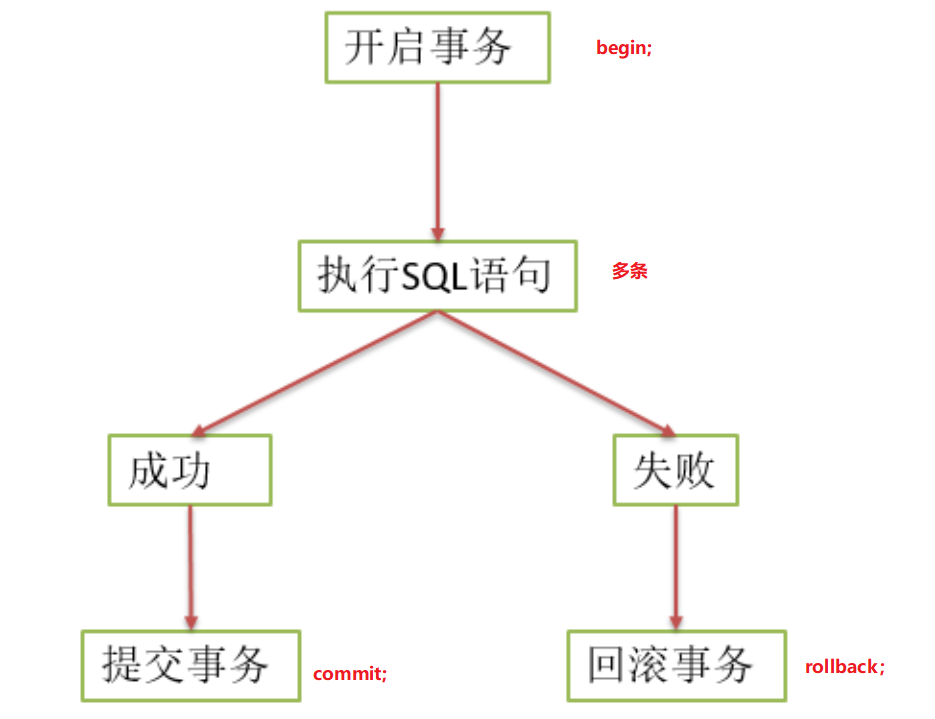
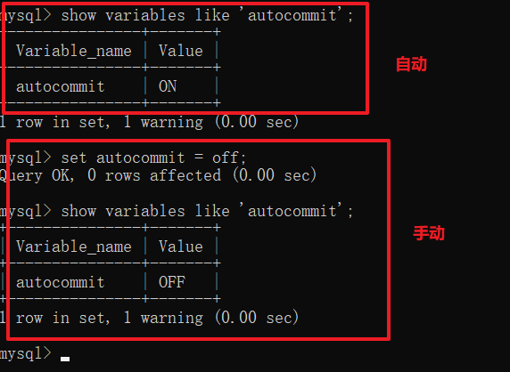
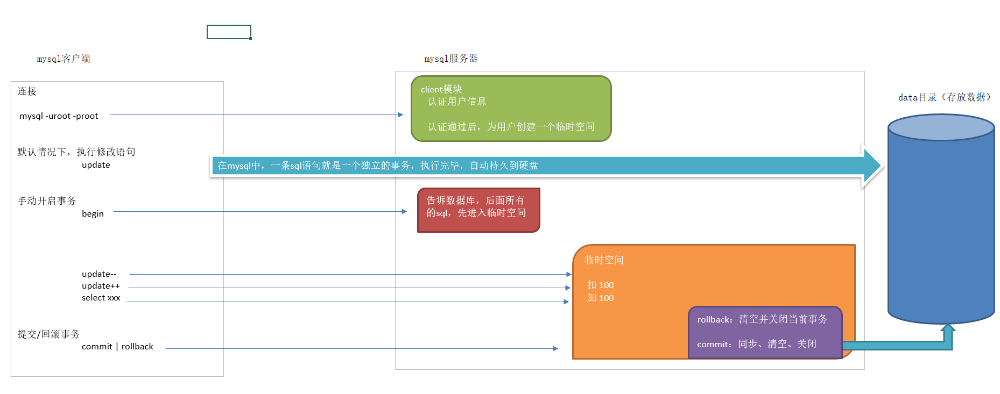
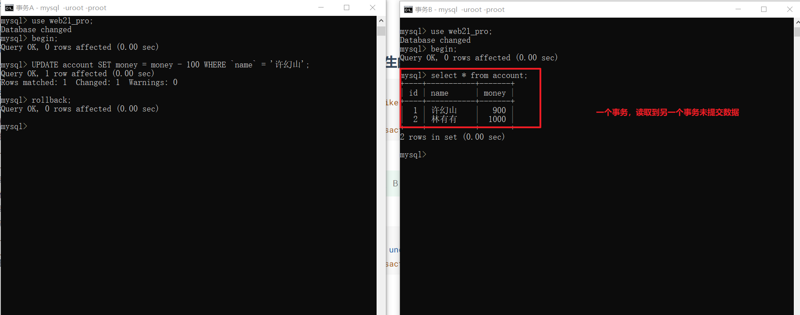
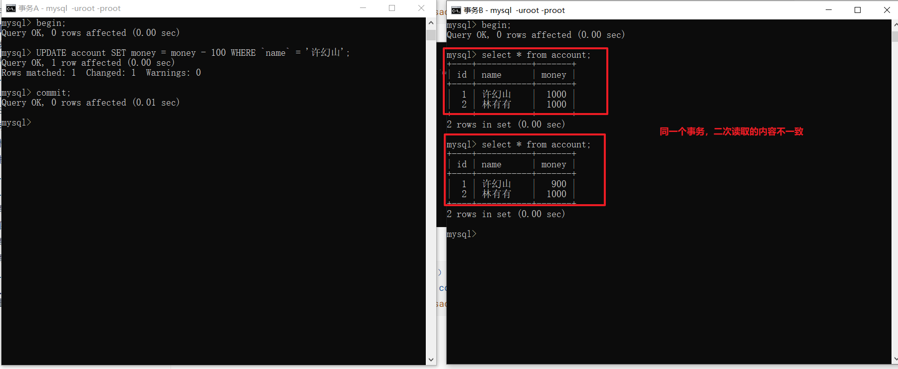
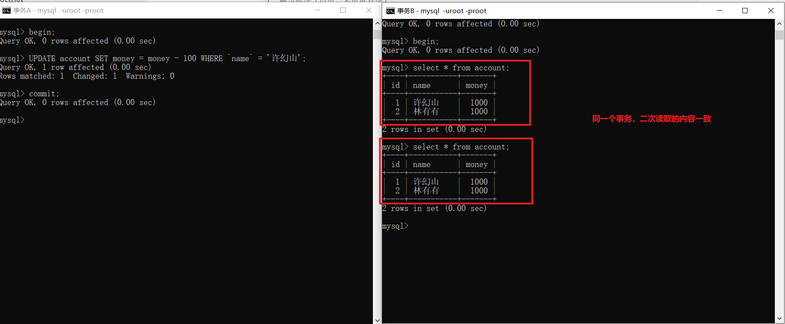
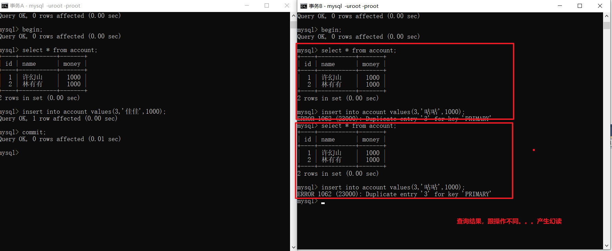
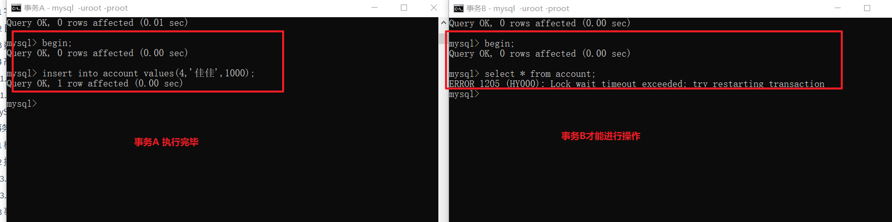

# 一 MySQL函数

为了简化操作，**mysql提供**了大量的函数给程序员使用（比如你想输入当前时间，可以调用now()函数）

函数可以出现的位置：插入语句的values()中，更新语句中，删除语句中，查询语句及其子句中。

菜鸟教程：<https://www.runoob.com/mysql/mysql-functions.html>


## 1.1 字符串函数

**常用**

```markdown
1.  函数：CONCAT(s1,s2...sn)
	描述：字符串 s1,s2 等多个字符串合并为一个字符串
	实例：select concat('传智','播客');
	
2.  函数：CHAR_LENGTH(str)
	描述：返回字符串 str 的字符数
	实例：select char_length('你好，hello');
	
3.  函数：LENGTH(str)
	描述：返回字符串 s 的字节数
	字符集：UTF8（一个中文字符占3个字节）
	实例：select length('你好，hello');
	
4.  函数：LCASE(s) | UCASE(s)
	描述：将字符串英文字母转换为大小写
	实例：select ucase('itcast');
	
5.  函数：LOCATE(s1,str)
	描述：从字符串 str 中获取 s1 的开始位置
	注意：位置从1开始
	实例：select locate('he','itheima');
	
6.  函数：TRIM(str) | LTRIM(str) | RTRIM(str)
	描述：字符串去空格
	实例：select trim('  哈哈，呵呵  ');
	
7.  函数：REPLACE(str,s1,s2)
	描述：将字符串 s2 替代字符串 str 中的字符串 s1
	实例：select replace('abc','b','x');
	
8.  函数：SUBSTR(s, start, length)
	描述：从字符串 s 的 start 位置截取长度为 length 的子字符串
	注意：从1开始截取
	实例：select substr('itheima','2','3');
	
9. 函数：STRCMP(str1,str2)
	描述：比较字符串大小,左大于右时返回1，左等于右时返回0，，左小于于右时返回-1，
	实例：select strcmp('z','b');
```


> 在今天的资料中，帅哥准备的数据库sql脚本，大家可以通过图形化工具导入

 


**练习**

```sql
-- 1.将所有员工的昵称改为大写
SELECT UCASE(nickname) FROM emp;


-- 2.显示所有员工的姓氏，截取
SELECT ename,SUBSTR(ename,1,1) FROM emp;


-- 3.显示所有员工姓名字符长度
SELECT ename,CHAR_LENGTH(ename) FROM emp;


-- 4.显示所有员工姓名字节长度
SELECT ename,LENGTH(ename) FROM emp;

-- 5.将所有姓李的员工，姓氏替换为li
SELECT REPLACE(ename,'李','li') FROM emp;


-- 6.将所有员工的姓名和昵称拼接在一起
SELECT CONCAT(ename,'-',nickname) FROM emp;
-- mysql的concat函数可以传递多个参数，oracle数据库只能传递二个参数
SELECT CONCAT(CONCAT(ename,'-'),nickname) FROM emp;

```


## 1.2 日期函数

**常用**

```markdown
1.  函数：NOW() | CURDATE() | CURTIME()
	描述：获取系统当前日期时间、日期、时间
	实例：select now();
	
2.  函数：YEAR(DATE) | MONTH(DATE) | DAY(DATE)
	描述：从日期中选择出年、月、日
	实例：select year(now());
	
3.  函数：LAST_DAY(DATE)
	描述：返回月份的最后一天
	实例：select last_day(now());
	
4.  函数：ADDDATE(DATE,n) | SUBDATE(DATE,n)
	描述：计算起始日期 DATE 加（减） n 天的日期
	实例：select subdate(now(),10);
	
5.  函数：QUARTER(DATE)
	描述：返回日期 DATE 是第几季节，返回 1 到 4
	实例：select quarter(now());
	
6.  函数：DATEDIFF(d1,d2)
	描述：计算日期 d1->d2 之间相隔的天数
	实例：select datediff(now(),'1999-3-6');
	
7.  函数：DATE_FORMAT(d,f)
	描述：按表达式 f的要求显示日期 d
	实例：select date_format(now(),'%Y年%m月%d日');
```

**练习**

```sql
-- 1.统计每个员工入职的天数
SELECT ename,DATEDIFF(NOW(),joindate) FROM emp;

-- 2.统计每个员工的工龄
SELECT ename,DATEDIFF(NOW(),joindate)/365 FROM emp;

-- 3.查询2011年入职的员工
SELECT * FROM emp WHERE YEAR(joindate) = '2011';


-- 4.统计入职10年以上的员工信息
SELECT * FROM emp WHERE DATEDIFF(NOW(),joindate)/365 > 10;

```


## 1.3 数字函数

**常用**

```markdown
1.  函数：ABS(x)
	描述：返回 x 的绝对值　　
	实例：select abs(-10);
	
2.  函数：CEIL(x) | FLOOR(x)
	描述：向上（下）取整
	实例：select ceil(1.5);
	
3.  函数：MOD(x,y)
	描述：返回x mod y的结果，取余
	实例：select mod(5,4);
	
4.  函数：RAND()
	描述：返回 0 到 1 的随机数
	实例：select rand();
	
5.  函数：ROUND(x)
	描述：四舍五入
	实例：select round(1.49999);
	
6.  函数：TRUNCATE(x,y)
	描述：返回数值 x 保留到小数点后 y 位的值
	实例：select truncate(1.49999,2);
```

**练习**

```sql
-- 1.统计每个员工的工龄，超过一个月的算一年
SELECT ename,CEIL(DATEDIFF(NOW(),joindate)/365) FROM emp;

-- 2.统计每个部门的平均薪资,保留2位小数
SELECT dept_id,TRUNCATE(AVG(salary),2) FROM emp GROUP BY dept_id;

-- 3.统计每个部门的平均薪资,小数向上取整
SELECT dept_id,CEIL(AVG(salary)) FROM emp GROUP BY dept_id;

-- 4.统计每个部门的平均薪资,小数向下取整
SELECT dept_id,FLOOR(AVG(salary)) FROM emp GROUP BY dept_id;

```


## 1.4 高级函数

### 1.4.1  CASE表达式

> 相当于java中的switch语句

**语法** 

```sql
	SELECT 
		CASE [字段,值] 
			WHEN 判断条件1 
				THEN 希望的到的值1
			WHEN 判断条件2 
				THEN 希望的到的值2
			ELSE 前面条件都没有满足情况下得到的值 
		END
	FROM
		table_name;
```

**练习**

```sql
-- 查询每个员工的工资等级并排序
	-- 工资等级在1显示为 '努力赚钱'
	-- 工资等级在2显示为 '小康生活'
	-- 工资等级在3显示为 '可以娶媳妇'
	-- 工资等级在4显示为 '可以买车'
	-- 工资等级在5显示为 '可以买房'
	-- 工资等级不在以上列表中显示为  '土豪'
	
-- 1.确定几张表和连接条件
SELECT * FROM emp e
	INNER JOIN salarygrade s ON e.`salary` BETWEEN s.`losalary` AND s.`hisalary`;
	
-- 2.确定显示字段
SELECT e.`ename`,e.`salary`,s.`grade` FROM emp e
	INNER JOIN salarygrade s ON e.`salary` BETWEEN s.`losalary` AND s.`hisalary` 
	ORDER BY s.`grade` DESC;
	
-- 3.确定业务条件
SELECT e.`ename`,e.`salary`,
	CASE s.`grade`  
		WHEN 1 THEN '努力赚钱' 
		WHEN 2 THEN '小康生活' 
		WHEN 3 THEN '可以娶媳妇' 
		WHEN 4 THEN '可以买车' 
		WHEN 5 THEN '可以买房' 
		ELSE '土豪'
	END AS '生活状态'
	FROM emp e
	INNER JOIN salarygrade s ON e.`salary` BETWEEN s.`losalary` AND s.`hisalary` 
	ORDER BY s.`grade` DESC;
```


### 1.4.2 IF表达式

> 相当于java中的三元运算符

**语法**

```sql
SELECT IF(1 > 0,'真','假') from 表名;
```

**练习**

```sql
-- 工资+奖金大于20000的员工 显示家有娇妻，否则显示单身狗
SELECT ename,IF(salary+IFNULL(bonus,0)>20000,'家有波多','盲僧..') FROM emp;
```


# 二 MySQL综合练习【大作业】

> 至少2遍....

```sql
-- 1.计算员工的日薪(按30天)，保留二位小数

-- 2.计算出员工的年薪，并且以年薪排序 降序

-- 3.找出奖金少于5000或者没有获得奖金的员工的信息

-- 4.返回员工职务名称及其从事此职务的最低工资

-- 5.返回工龄超过10年，且2月份入职的员工信息

-- 6.返回与 林冲 同一年入职的员工

-- 7.返回每个员工的名称及其上级领导的名称

-- 8.返回工资为二等级（工资等级表）的职员名字（员工表）、部门名称（部门表）

-- 9.涨工资：董事长2000 经理1500 其他800

```


```sql
-- 1.计算员工的日薪(按30天)，保留二位小数
SELECT ename,TRUNCATE(salary/30,2) FROM emp;

-- 2.计算出员工的年薪（12薪），并且以年薪排序 降序
SELECT ename, (salary + IFNULL(bonus,0)) * 12 AS 年薪 FROM emp ORDER BY 年薪 DESC;


-- 3.找出奖金少于5000包含没有获得奖金的员工的信息
SELECT * FROM emp WHERE IFNULL(bonus,0) < 5000;


-- 4.返回员工职务名称及其从事此职务的最低工资
-- 4.1 确定几张表和连接条件
SELECT * 
	FROM emp e
	INNER JOIN job j ON e.`job_id` = j.`id`;
-- 4.2 确定显示字段
SELECT j.`jname` 
	FROM emp e
	INNER JOIN job j ON e.`job_id` = j.`id`;
-- 4.3 确定业务条件
SELECT j.`jname` ,MIN(e.`salary`)
	FROM emp e
	INNER JOIN job j ON e.`job_id` = j.`id`
	GROUP BY j.`jname`;


-- 5.返回工龄超过10年，且2月份入职的员工信息
SELECT * FROM emp WHERE DATEDIFF(NOW(),joindate) / 365 > 10 AND MONTH(joindate) = 2

 
-- 6.返回与 林冲 同一年入职的员工 子查询
-- 6.1 先求出林冲工作年份
SELECT YEAR(joindate) FROM emp WHERE ename = '林冲';
-- 6.2 根据林冲年份，查询对应员工
SELECT * FROM emp WHERE YEAR(joindate) = (SELECT YEAR(joindate) FROM emp WHERE ename = '林冲');


-- 7.返回每个员工的名称及其上级领导的名称 复习自关联
SELECT e.`ename`,m.`ename` FROM emp e LEFT OUTER JOIN emp m ON e.`mgr` = m.`id`;


-- 8.返回工资为二等级（工资等级表）的职员名字（员工表）、部门名称（部门表）
-- 8.1 确定表和连接条件
SELECT * FROM
	 emp e
	INNER JOIN salarygrade s  ON e.`salary` BETWEEN s.`losalary` AND s.`hisalary`
	INNER JOIN dept d ON e.`dept_id` = d.`id`;
	
-- 8.2 确定显示字段
SELECT s.`grade`,e.`ename`,d.`dname` FROM
	 emp e
	INNER JOIN salarygrade s  ON e.`salary` BETWEEN s.`losalary` AND s.`hisalary`
	INNER JOIN dept d ON e.`dept_id` = d.`id`;
	
-- 8.3 确定业务条件
SELECT s.`grade`,e.`ename`,d.`dname` FROM
	 emp e
	INNER JOIN salarygrade s  ON e.`salary` BETWEEN s.`losalary` AND s.`hisalary`
	INNER JOIN dept d ON e.`dept_id` = d.`id`
	WHERE s.`grade` = 2;
	


-- 9.涨工资：董事长2000 经理1500 其他800
-- 9.1 确定表和连接条件
SELECT * FROM emp e
	INNER JOIN job j ON e.`job_id` = j.`id`;
-- 9.2 确定显示字段
SELECT e.`ename`, e.`salary` AS 涨前, j.`jname` FROM emp e
	INNER JOIN job j ON e.`job_id` = j.`id`;
-- 9.3 确定业务条件（case 表达式）
SELECT e.`ename`,j.jname, e.`salary` AS 涨前, 
	CASE j.`jname` 
		WHEN '董事长' THEN e.`salary` + 2000
		WHEN '经理' THEN e.`salary` + 1500
		ELSE e.`salary` + 800	
	END AS 涨后
	FROM emp e
	INNER JOIN job j ON e.`job_id` = j.`id`;
```


# 三 事务安全 TCL

## 3.1 概述

如果一个包含多个步骤的业务操作，被事务管理，那么这些操作要么同时成功，要么同时失败。

应用场景：用户转账


**准备数据**

```sql
-- 创建库
create database web21_pro;
use web21_pro;

-- 创建数据表
CREATE TABLE account (  -- 账户表
	id INT PRIMARY KEY AUTO_INCREMENT,
	`name` VARCHAR(32),
	money DOUBLE 
);

-- 添加数据
INSERT INTO account (`name`, money) VALUES ('许幻山', 1000), ('林有有', 1000);
```

**模拟转账**

```sql
-- 许幻山 扣100
UPDATE account SET money = money - 100 WHERE `name` = '许幻山';

-- 机器等网络故障...

-- 林有有 加100
UPDATE account SET money = money + 100 WHERE `name` = '林有有';
```


## 3.2 操作事务

### 3.2.1 手动提交事务【mysql】

```markdown
1. 开启事务
		begin;
		
2. 提交事务
		commit;

3. 回滚事务
		rollback;
```

 


**转账成功**

```sql
-- 1.开启事务
begin;

-- 2.许幻山 扣100
UPDATE account SET money = money - 100 WHERE `name` = '许幻山';

-- 3.林有有 加100
UPDATE account SET money = money + 100 WHERE `name` = '林有有';

-- 4.提交事务
commit;
```


**转账失败**

```sql
-- 1.开启事务
begin;

-- 2.许幻山 扣100
UPDATE account SET money = money - 100 WHERE `name` = '许幻山';

-- 3. 机器网络故障

-- 4.回滚事务
rollback;
```


### 3.2.2 自动提交事务【jdbc】

> 在java中操作复杂业务场景，需要改为手动提交...

```markdown
* 默认情况下，mysql中一条sql语句，就是一个独立的事务

* 查看mysql是否开启自动提交
		show variables like 'autocommit';
		
* 临时关闭自动提交（）
		set autocommit = off;
```

 


**模拟转账**

```sql
-- 许幻山 扣100
UPDATE account SET money = money - 100 WHERE `name` = '许幻山';


-- 手动提交/回滚
commit | rollback;
```


## 3.3 事务工作原理【了解】

 


## 3.4 保存（回滚）点

​	当事务开启后，一部分sql执行成功，添加一个保存点，后续操作报错了，回滚到保存点，保证之前的操作可以成功提交

```markdown
1. 设置保存点
		savepoint 保存点名称;
		
2. 代码报错，回滚到保存点
		rollback to 保存点名称;
```


> 模拟：许幻山同时约了5个小姐姐，如果前二个小姐姐扣钱成功，设置保存点，保证及时代码报错，前二位小姐姐也能上门服务...

```sql
 -- 1.开启事务
begin;

-- 2.许幻山扣钱（石榴姐）
UPDATE account SET money = money - 100 WHERE `name` = '许幻山';

-- 3.许幻山扣钱（凤姐）
UPDATE account SET money = money - 100 WHERE `name` = '许幻山';

-- 4. 设置保存点
savepoint ol;

-- 5.许幻山扣钱（芙蓉姐姐）
UPDATE account SET money = money - 100 WHERE `name` = '许幻山';

-- 6.机器故障

-- 7.回滚
rollback to ol;

-- 8.提交部分事务
commit;
```


## 3.5 事务特性 ACID【面试题】

```markdown
1. 原子性: A atomicity
		如果一个包含多个步骤的业务操作，被事务管理，那么这些操作要么同时成功，要么同时失败。
		
2. 一致性：C consistency
		事务在执行前后，数据完整性必须保持一致。
	
3. 隔离性：I isolation【重点】
		多个事务，相互独立，互补干扰...

4. 持久性：D durability
		事务一旦提交，同步到磁盘，即使数据库出现了也不会产生影响
```


## 3.6 事务隔离性【并发问题】

> 等大家项目二结束后，再回头看这端文字描述，就比较清晰....


​	多个事务之间隔离的，相互独立的。但是如果多个事务操作同一批数据，则会引发一些问题，设置不同的隔离级别就可以解决这些问题。

> 事务A、事务B，同时操作同一批数据

```markdown
1. 脏读【实际环境中，绝对不允许发生...】
		事务A读取到事务B更新的数据，然后事务B回滚，事务A读取的这部分就是脏数据...
		事务A读取了事务B未提交的数据，就称为脏读

2. 不可重复读
		事务A中多次读取同一个数据，在此期间事务B对数据做了修改并提交，事务A多次读取同一个数据，出现了不一致
		事务A读取到事务B更新后并提交的数据，就称为不可重复读

3. 幻读
		事务A和事务B同时添加一条记录，发现id为10可以用，此时事务A插入id10并保存提交，事务B插入式报错了，难道我刚才这次查询产生了幻觉吗？
```


### 3.6.1 MySQL数据库隔离级别

| 级别 | 名字     | 隔离级别         | 脏读 | 不可重复读 | 幻读 | 数据库默认隔离级别 |
| ---- | -------- | ---------------- | ---- | ---------- | ---- | ------------------ |
| 1    | 读未提交 | read uncommitted | 是   | 是         | 是   |                    |
| 2    | 读已提交 | read committed   | 否   | 是         | 是   | Oracle和SQL Server |
| 3    | 可重复读 | repeatable read  | 否   | 否         | 是   | MySQL              |
| 4    | 串行化   | serializable     | 否   | 否         | 否   |                    |


> 安全： 4 > 3 > 2 > 1
>
> 性能： 1 > 2 > 3 >4
>
> 综合： 2 | 3


### 3.6.2 演示隔离级别产生的问题 【仅在上课看】

```markdown
1. 查看当前数据库隔离级别
		show variables like '%isolation%';
2. 临时修改隔离级别
		set session transaction isolation level 级别字符串;
```


> 准备二个事务窗口：A 窗口、B 窗口


```markdown
1. 演示脏读
	设置数据库隔离级别 read uncommitted
		set session transaction isolation level read uncommitted;
```

 


```markdown
2. 解决脏读（引出：不可重复读）
	设置数据库隔离级别 read committed
		set session transaction isolation level read committed;
```

 

```markdown
3. 解决不可重复读（引出幻读的问题）
	设置数据库隔离级别 repeatable read
		set session transaction isolation level repeatable read;
```

 


 


```markdown
4. 解决幻读问题
	设置数据库隔离级别 serializable
		set session transaction isolation level serializable;
```

 