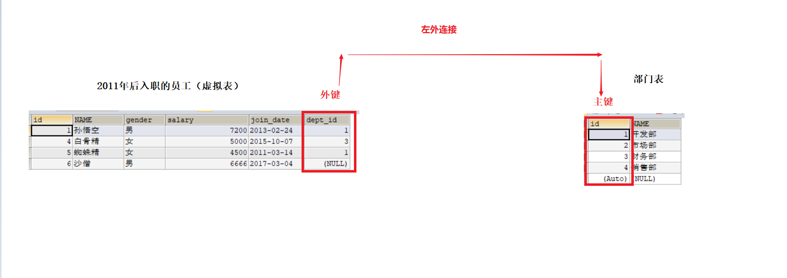

# 一 多表查询

同时查询多张表获取到需要的数据组成完整的信息返回给用户。

**准备数据**

```sql
-- 多表查询
create database web20;
use web20;
-- 创建部门表（主表）
CREATE TABLE dept (
  id INT PRIMARY KEY AUTO_INCREMENT,
  NAME VARCHAR(20)
);

INSERT INTO dept (NAME) VALUES ('开发部'),('市场部'),('财务部'),('销售部');

-- 创建员工表（从表）
CREATE TABLE emp (
  id INT PRIMARY KEY AUTO_INCREMENT,
  NAME VARCHAR(10),
  gender CHAR(1),   -- 性别（sex）
  salary DOUBLE,   -- 工资
  join_date DATE,  -- 入职日期
  dept_id INT -- 外键字段
);

INSERT INTO emp(NAME,gender,salary,join_date,dept_id) VALUES('孙悟空','男',7200,'2013-02-24',1);
INSERT INTO emp(NAME,gender,salary,join_date,dept_id) VALUES('猪八戒','男',3600,'2010-12-02',2);
INSERT INTO emp(NAME,gender,salary,join_date,dept_id) VALUES('唐僧','男',9000,'2008-08-08',2);
INSERT INTO emp(NAME,gender,salary,join_date,dept_id) VALUES('白骨精','女',5000,'2015-10-07',3);
INSERT INTO emp(NAME,gender,salary,join_date,dept_id) VALUES('蜘蛛精','女',4500,'2011-03-14',1);
INSERT INTO emp(NAME,gender,salary,join_date,dept_id) VALUES('沙僧','男',6666,'2017-03-04',null);
```


 


## 1.1 笛卡尔积【了解】

```markdown
* 功能
		多张表记录进行乘积组合，这种现象称为笛卡尔积（交叉连接）
* 语法
		select ... from 左表,右表;
```

 


```sql
-- 笛卡尔积
SELECT * FROM dept,emp;

SELECT COUNT(*) FROM dept,emp;
```


## 1.1 内连接

```markdown
* 功能
		拿左表的记录去匹配右表的记录，若符合条件就显示（二张表交集部分）
* 语法
	1）隐式内连接
		select ... from 左表,右表 where 连接条件;
	2）显示内连接【推荐】
		select ... from 左表 [inner] join 右表 on 连接条件;
```


```sql
-- 内连接

-- 隐式
SELECT * FROM dept d,emp e WHERE d.id = e.dept_id AND d.name = '开发部';
-- 显示
SELECT * FROM dept d INNER JOIN emp e ON d.id = e.dept_id WHERE d.name = '开发部';

-- 查询唐僧的 id，姓名，性别，工资和所在部门名称
-- 1.1 确定查询几张表
SELECT * FROM emp e INNER JOIN dept d;
-- 1.2 确定表的连接条件
SELECT * FROM emp e INNER JOIN dept d ON e.dept_id = d.id;
-- 1.3 确定显示的字段
SELECT e.id,e.name,e.gender,e.salary,d.name FROM emp e INNER JOIN dept d ON e.dept_id = d.id;
-- 1.4 确定业务条件
SELECT e.id,e.name,e.gender,e.salary,d.name FROM emp e INNER JOIN dept d ON e.dept_id = d.id AND e.name ='唐僧'; -- 错误语法
SELECT e.id,e.name,e.gender,e.salary,d.name FROM emp e INNER JOIN dept d ON e.dept_id = d.id WHERE e.name ='唐僧'; -- 正确语法
```


## 1.3 外连接

```markdown
1. 左外连接【推荐】
	功能
		展示左表全部，再去匹配右表，若符合条件显示数据，不符合显示null
	语法
		select ... from 左表 left [outer] join 右表 on 连接条件;
	
2. 右外连接
	功能
		展示右表全部，再去匹配左表，若符合条件显示数据，不符合显示null
	语法
		select ... from 左表 right [outer] join 右表 on 连接条件;
```


```sql
# 左外连接
-- 查询所有员工信息及对应的部门名称
SELECT * FROM emp e LEFT OUTER JOIN dept d ON e.dept_id = d.id;
-- 查询所有部门及对应的员工信息
SELECT * FROM dept d LEFT OUTER JOIN emp e ON e.dept_id = d.id;


# 右外连接
-- 查询所有部门及对应的员工信息
SELECT * FROM emp e RIGHT OUTER JOIN dept d ON e.dept_id = d.id;
```


## 1.4 子查询（嵌套）

```markdown
* 功能
		一条select查询结果，作为另一条select语法的一部分
* 语法
	1）查询结果单值（使用=）
		SELECT MAX(salary) FROM emp;
	2）查询结果单列（使用in）
		SELECT salary FROM emp;
	3）查询结果多列
		SELECT * FROM emp;
		
* 规律
	子查询结果单列或单值，一般作为条件在where后面使用
		select ... from 表名 where 字段 in|= (子查询);
	子查结果为多列，一般作为虚拟表在from后面使用
		select ... from (子查询) [as] 表别名;
		
```

 

```sql
-- 子查询
# 子查询结果为单值
-- 1 查询工资最高的员工是谁？ 
SELECT * FROM emp WHERE salary = (SELECT MAX(salary) FROM emp);

-- 2 查询工资小于平均工资的员工有哪些？
-- 2.1 查询平均工资
SELECT AVG(salary) FROM emp;
-- 2.2 查询小于平均工资的
SELECT * FROM emp WHERE salary < (SELECT AVG(salary) FROM emp);


# 子查询结果为单列多行
-- 1 查询工资大于5000的员工，来自于哪些部门的名字  
-- 1.1 查询工资大于5000的员工
SELECT dept_id FROM emp WHERE salary > 5000;
-- 1.2 来自于哪些部门的名字  
SELECT * FROM dept WHERE id IN(SELECT dept_id FROM emp WHERE salary > 5000);

-- 2 查询开发部与财务部所有的员工信息
-- 2.1 查询开发部和财务部的部门主键
SELECT id FROM dept WHERE `name` IN('开发部','财务部'); 
-- 2.2 根据部门主键查询对应的员工信息
SELECT * FROM emp WHERE dept_id IN (SELECT id FROM dept WHERE `name` IN('开发部','财务部'));


# 子查询结果为多列多行
-- 1 查询出2011年以后入职的员工信息，包括部门名称
-- 1.1 查询出2011年以后入职的员工信息
SELECT * FROM emp WHERE join_date >= '2011-1-1';
-- 1.2 表关联
SELECT * FROM (SELECT * FROM emp WHERE join_date >= '2011-1-1') e LEFT OUTER JOIN dept d ON e.dept_id = d.id;

---------------------------------
-- 2 查询出2011年以后入职的员工信息，包括部门名称
-- 2.1 表关联
SELECT * FROM emp  e LEFT OUTER JOIN dept d ON e.dept_id = d.id ;

-- 2.2 业务条件
SELECT * FROM emp  e LEFT OUTER JOIN dept d ON e.dept_id = d.id  WHERE e.join_date >= '2011-1-1';
```


# 二 多表案例【大作业】

​	我们在企业开发时，根据不同的业务需求往往需要通过2张及以上的表中去查询需要的数据。其实不管是几张表的查询，都是有规律可循的。 

**准备数据**

```sql
-- 多表案例
create database web20_pro;
use web20_pro;
-- 部门表
CREATE TABLE dept (
  id INT PRIMARY KEY auto_increment, -- 部门id
  dname VARCHAR(50), -- 部门名称
  loc VARCHAR(50) -- 部门位置
);

-- 添加4个部门
INSERT INTO dept(id,dname,loc) VALUES 
(10,'教研部','北京'),
(20,'学工部','上海'),
(30,'销售部','广州'),
(40,'财务部','深圳');

-- 职务表
CREATE TABLE job (
  id INT PRIMARY KEY,
  jname VARCHAR(20), -- 职务名称
  description VARCHAR(50) -- 职务描述
);

-- 添加4个职务
INSERT INTO job (id, jname, description) VALUES
(1, '董事长', '管理整个公司，接单'),
(2, '经理', '管理部门员工'),
(3, '销售员', '向客人推销产品'),
(4, '文员', '使用办公软件');

-- 员工表
CREATE TABLE emp (
  id INT PRIMARY KEY, -- 员工id
  ename VARCHAR(50), -- 员工姓名
  job_id INT, -- 职务id  外键
  mgr INT , -- 上级领导（自关联）
  joindate DATE, -- 入职日期
  salary DECIMAL(7,2), -- 工资 99999.99
  bonus DECIMAL(7,2), -- 奖金 99999.99
  dept_id INT, -- 所在部门编号  外键
  CONSTRAINT emp_jobid_ref_job_id_fk FOREIGN KEY (job_id) REFERENCES job (id),
  CONSTRAINT emp_deptid_ref_dept_id_fk FOREIGN KEY (dept_id) REFERENCES dept (id)
);

-- 添加员工
INSERT INTO emp(id,ename,job_id,mgr,joindate,salary,bonus,dept_id) VALUES 
(1001,'孙悟空',4,1004,'2000-12-17','8000.00',NULL,20),
(1002,'卢俊义',3,1006,'2001-02-20','16000.00','3000.00',30),
(1003,'林冲',3,1006,'2001-02-22','12500.00','5000.00',30),
(1004,'唐僧',2,1009,'2001-04-02','29750.00',NULL,20),
(1005,'李逵',4,1006,'2001-09-28','12500.00','14000.00',30),
(1006,'宋江',2,1009,'2001-05-01','28500.00',NULL,30),
(1007,'刘备',2,1009,'2001-09-01','24500.00',NULL,10),
(1008,'猪八戒',4,1004,'2007-04-19','30000.00',NULL,20),
(1009,'罗贯中',1,NULL,'2001-11-17','50000.00',NULL,10),
(1010,'吴用',3,1006,'2001-09-08','15000.00','0.00',30),
(1011,'沙僧',4,1004,'2007-05-23','11000.00',NULL,20),
(1012,'李逵',4,1006,'2001-12-03','9500.00',NULL,30),
(1013,'小白龙',4,1004,'2001-12-03','30000.00',NULL,20),
(1014,'关羽',4,1007,'2002-01-23','13000.00',NULL,10);

-- 工资等级表
CREATE TABLE salarygrade (
  grade INT PRIMARY KEY,  -- 等级
  losalary INT, -- 最低工资
  hisalary INT -- 最高工资
);

-- 添加5个工资等级
INSERT INTO salarygrade(grade,losalary,hisalary) VALUES 
(1,7000,12000),
(2,12010,14000),
(3,14010,20000),
(4,20010,30000),
(5,30010,99990);

```

 


```sql
-- 1 查询所有员工信息。显示员工编号，员工姓名，工资，职务名称，职务描述
-- 1.1 确定几张表？
SELECT * FROM emp e INNER JOIN job j;
-- 1.2 确定连接条件
SELECT * FROM emp e INNER JOIN job j ON e.job_id = j.id;
-- 1.3 确定显示字段
SELECT e.id,e.ename,e.salary,j.jname,j.description FROM emp e INNER JOIN job j ON e.job_id = j.id;
```


```sql
-- 2 查询所有员工信息。显示员工编号，员工姓名，工资，职务名称，职务描述，部门名称，部门位置
-- 2.1 确定几张表？
SELECT * FROM emp e
	INNER JOIN job j 
	INNER JOIN dept d;
-- 2.2 确定连接条件
SELECT * FROM emp e
	INNER JOIN job j  ON  e.job_id = j.id 
	INNER JOIN dept d ON  e.dept_id = d.id;
-- 2.3 确定显示字段
SELECT e.id,e.ename,e.salary,j.jname,j.description,d.dname,d.loc FROM emp e
	INNER JOIN job j  ON  e.job_id = j.id 
	INNER JOIN dept d ON  e.dept_id = d.id;

```


```sql
-- 3 查询所有员工信息。显示员工姓名，工资，职务名称，职务描述，部门名称，部门位置，工资等级
-- 3.1 确定几张表
SELECT * FROM emp e 
	INNER JOIN job j
	INNER JOIN dept d 
	INNER JOIN salarygrade s;
-- 3.2 确定连接条件
SELECT * FROM emp e 
	INNER JOIN job j ON e.job_id = j.id
	INNER JOIN dept d  ON e.dept_id = d.id
	INNER JOIN salarygrade s ON e.salary BETWEEN s.losalary AND s.hisalary;
-- 3.2 确定显示字段
SELECT 
  e.id, -- 员工编号
  e.ename, -- 员工姓名
  e.salary, -- 员工工资
  j.jname, -- 职务名称
  j.description,
  d.dname,
  d.loc,
  s.grade 
FROM
  emp e 
  INNER JOIN job j 
    ON e.job_id = j.id  -- 员工关联职务
  INNER JOIN dept d 
    ON e.dept_id = d.id  -- 员工关联部门
  INNER JOIN salarygrade s 
    ON e.salary BETWEEN s.losalary  -- 员工关联工资等级
    AND s.hisalary ;
```


```sql
-- 4 查询经理的信息。显示员工姓名，工资，职务名称，职务描述，部门名称，部门位置，工资等级
-- 直接将第三题代码粘过来
SELECT 
  e.id, -- 员工编号
  e.ename, -- 员工姓名
  e.salary, -- 员工工资
  j.jname, -- 职务名称
  j.description,
  d.dname,
  d.loc,
  s.grade 
FROM
  emp e 
  INNER JOIN job j 
    ON e.job_id = j.id  -- 员工关联职务
  INNER JOIN dept d 
    ON e.dept_id = d.id  -- 员工关联部门
  INNER JOIN salarygrade s 
    ON e.salary BETWEEN s.losalary  -- 员工关联工资等级
    AND s.hisalary 
  WHERE j.jname = '经理';

```


**规律**

```markdown
* 多表查询会产生笛卡尔积

* 消除笛卡尔积
		连接条件= 表个数-1
		
* 步骤
		1）确定几张表
		2）确定连接条件
		3）确定显示字段
		4）确定业务条件
```


 


```sql
-- 5 查询出部门编号、部门名称、部门位置、部门人数 （结合画图至少敲三遍）
-- 5.1 查询出部门编号、部门名称、部门位置
SELECT * FROM dept;
-- 5.2 查询部门人数（员工表：分组+聚合）
SELECT dept_id,COUNT(*) total FROM emp GROUP BY dept_id;
-- 5.3 部门表左外关联虚拟表
SELECT 
	d.id,d.dname,d.loc,e.total
    FROM dept d 
	LEFT OUTER JOIN (SELECT dept_id,COUNT(*) total FROM emp GROUP BY dept_id) e
	ON d.id = e.dept_id;
```


 


```sql
-- 6 查询每个员工的名称及其上级领导的名称（表自关联查询）
SELECT 
	e.id, -- 员工id
	e.ename, -- 员工姓名
	m.id, -- 领导id
	m.ename -- 领导姓名
	
 FROM emp e
	LEFT OUTER JOIN emp m ON e.mgr = m.id;
```


# 三 用户权限 DCL【了解】

> 我们入职后，一般DBA会给我们项目组分配一个数据库的账户....

```markdown
1. 创建用户
	语法：
		create user '用户名'@'主机名' identified by '密码';
	注意：
		主机名：限定客户端登录ip
			指定：127.0.0.1（localhost）
			任意：%
2. 授权用户
	语法：
		grant 权限1,权限2... on 数据库名.表名 to '用户名'@'主机名';
	注意：
		权限
			select、insert、delete、create....
			all 所有权限
		数据库名.*  指定该库所有的表
		
3. 查看权限
	语法：
		show grants for '用户名'@'主机名'; 
		
4. 撤销授权
	语法：
		revoke 权限1,权限2... on 数据库名.表名 from '用户名'@'主机名'; 
	注意：
		权限
			select、insert、delete、create....
			all 所有权限
		数据库名.*  指定该库所有的表
		
5. 删除用户
	语法：
		drop user '用户名'@'主机名';
		
6. 密码管理
	1.超级管理员
		set password for '用户名'@'主机名'=password('新密码');
	2.普通用户
		set password=password('新密码');
```


```sql
-- 创建一个用户
CREATE USER 'tom'@'%' IDENTIFIED BY '123';

-- 授权
GRANT SELECT ON web20_pro.emp TO 'tom'@'%';

-- 查看权限
SHOW GRANTS FOR 'tom'@'%';

-- 撤销授权
REVOKE SELECT ON web20_pro.`emp` FROM 'tom'@'%';

-- 密码管理

-- 加密函数
SELECT PASSWORD('123');

-- 修改自身密码（在dos窗口个执行）
SET PASSWORD = PASSWORD('666');


-- 超级管理员密码找回
SET PASSWORD FOR 'tom'@'%' = PASSWORD('999');

-- 删除用户
DROP USER  'tom'@'%';
```


# 四 数据库备份（导出）与还原（导入）

需求：将今天 web20_pro 数据库导出、模拟导入（先删除，后导入）


**DOS命令行【了解】**

```markdown
1. 导出（备份）
	语法：
		mysqldump -u用户名 -p密码 导出的数据库名 > 导出文件路径(*.sql)
	实例：
		mysqldump -uroot -proot web20_pro > d:/bak.sql
	缺点：
		只有建表语句，没有建库语句


2. 导入（还原）
	语法：
		mysql -u用户名 -p密码 < 导入文件路径(*.sql)
	实例：
		mysql -uroot -proot <	d:/bak.sql
```


**图形化工具【掌握】**

> 1. 导出（备份）


  

> 2. 导入（还原）

 