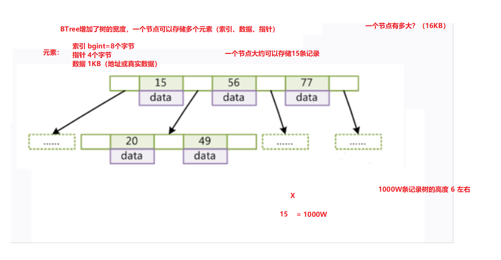

# 一 MySQL性能

## 1.1 分析-数据库查询效率低下

​	我们进入公司往往关注业务需求和功能实现，但是随着公司服务器运行，时间积累，数据慢慢递增，这时就会影响我们的查询性能

> 硬件优化、软件优化（重点）


## 1.2 分析-执行次数比较多的语句

```markdown
* 查询密集型
	就可以使用索引进行优化

* 增删改密集型
	分库分片概念
```


```sql
-- 查询累计插入和返回数据条数
show global status like 'Innodb_rows%';
```

 


## 1.3 查看-sql语句的执行效率

**插入千万条记录**

```sql
create database web22;

use web22;

-- 1. 准备表
CREATE TABLE `user`(
	id INT,
	username VARCHAR(32),
	`password` VARCHAR(32),
	sex VARCHAR(6),
	email VARCHAR(50)
);

-- 2. 创建存储过程，实现批量插入记录
DELIMITER $$ -- 声明存储过程的结束符号为$$
CREATE PROCEDURE auto_insert()
BEGIN
    DECLARE i INT DEFAULT 1;
	START TRANSACTION; -- 开启事务
    WHILE(i<=10000000)DO
        INSERT INTO `user` VALUES(i,CONCAT('jack',i),MD5(i),'male',CONCAT('jack',i,'@itcast.cn'));
        SET i=i+1;
    END WHILE;
	COMMIT; -- 提交
END$$ -- 声明结束
DELIMITER ; -- 重新声明分号为结束符号

-- 3. 查看存储过程
SHOW CREATE PROCEDURE auto_insert;

-- 4. 调用存储过程
CALL auto_insert();
```

 


**慢查询日志**

```sql
-- 查看慢查询日志开启情况
show variables like '%query%';
```

 


**开启慢查询**

```sql
set global slow_query_log = on;
```

 


**修改监控sql的时间（阈值）**

```sql
-- 临时修改变量参数
set session long_query_time = 3;

-- 永久修改（下次生效）
set global long_query_time = 3;
```

 


**测试慢查询监控**

 


**对慢查询日志文件分析**

 


# 二 MySQL索引

## 2.1 什么是索引

将一堆数据进行排序整理的过程就称为 <span style="color:red">索引</span>


 


## 2.2 MySQL索引分类

```markdown
* 主键（约束）索引
		主键约束+提高查询效率
	
* 唯一（约束）索引
		唯一约束+提高查询效率

* 普通索引
		仅提高查询效率
		
---------------------------------------

* 组合（联合）索引
		多个字段组成一个索引，提高查询效率

* 全文索引
		了解（es）

* hash索引
		了解（key-value 查询速度非常高效）
```

 


## 2.3 MySQL索引语法

### 2.3.1 创建索引

#### ① 直接创建【了解】

```sql
-- 创建普通索引
create index 索引名 on 表名(字段);

-- 创建唯一索引
create unique index 索引名 on 表名(字段);

-- 创建普通组合索引
create index 索引名 on 表名(字段1,字段2);

-- 创建唯一组合索引
create unique index 索引名 on 表名(字段1,字段2);
```

```sql
-- 创建学生表
CREATE TABLE student(
 id INT,
 `name` VARCHAR(32),
 telephone VARCHAR(32)
);

-- `name`添加普通索引
CREATE INDEX name_idx ON student(`name`);

-- telephone 添加唯一索引
CREATE UNIQUE INDEX telephone_un_idx ON student(telephone);
```


#### ② 修改表时指定【知道】

```sql
-- 添加一个主键，这意味着索引值必须是唯一的，且不能为NULL
alter table 表名 add primary key(字段); -- 默认索引名：primary

-- 添加唯一索引（除了NULL外，NULL可能会出现多次）
alter table 表名 add unique(字段); -- 默认索引名：字段名

-- 添加普通索引，索引值可以出现多次。
alter table 表名 add index(字段); -- 默认索引名：字段名
```

```sql
-- id 添加主键索引
ALTER TABLE student ADD PRIMARY KEY(id);

-- `name`添加普通索引
ALTER TABLE student ADD INDEX(`name`);

-- telephone 添加唯一索引
ALTER TABLE student ADD UNIQUE(telephone);
```


#### ③ 创建表时指定【重点】

```sql
-- 创建教师表并指定相关索引
CREATE TABLE teacher(
 id INT PRIMARY KEY AUTO_INCREMENT, -- 主键索引
 `name` VARCHAR(32),
 telephone VARCHAR(11) UNIQUE, -- 唯一索引
 sex VARCHAR(5),
 birthday DATE,
 INDEX(`name`)  -- 普通索引
);
```


### 2.3.2 删除索引

```sql
-- 直接删除
drop index 索引名 on 表名;

-- 修改表时删除 【掌握】
alter table 表名 drop index 索引名;
```

```sql
-- `name` 删除普通索引
DROP INDEX name_idx ON student;

-- telephone 删除唯一索引
ALTER TABLE student DROP INDEX telephone_un_idx;
```


## 2.4 索引效果演示

> 先来测试没有索引效率

```sql
-- 1.根据id查询
select * from user where id = 8888888;

-- 2.根据username查询
select * from user where username = 'jack8888888';

-- 3.根据email模糊
select * from user where email like 'jack888888%';
```

 


> 给这三个字段添加索引，提高效率

```sql
-- id 主键索引
ALTER TABLE `user` ADD PRIMARY KEY (id);
-- username 普通索引
ALTER TABLE `user` ADD INDEX(username);
-- email 唯一索引
ALTER TABLE `user` ADD UNIQUE(email);
```


> 添加了索引，再次测试

```sql
-- 1.根据id查询
select * from user where id = 8888888;

-- 2.根据username查询
select * from user where username = 'jack8888888';

-- 3.根据email模糊
select * from user where email like 'jack888888%';
```


 


## 2.5 索引的优缺点

```markdown
* 优点
		减少磁盘IO，提高查询效率

* 缺点
		索引也会占用磁盘空间
		索引字段在增删改，会增加维护成本..降低服务器性能
```


## 2.6 索引创建原则

```markdown
1. 经常使用 where 查询字段

2. 经常使用 group by having | order by 字段

3. 经常使用 多表连接字段（主外键） 内连接 | 外连接
```


## 2.7 常见索引失效情况

> 测试时，一定要在黑窗口中....

```sql
-- 1.使用like模糊匹配，%通配符在最左侧使用时
select * from user where username like '%jack88';
```

```sql
-- 2.尽量避免使用or，如果条件有一个没有索引，那么会进行全表扫描
select * from user where id = 1 or sex ='male';
```

```sql
-- 3.在索引列上进行计算
select * from user where id + 1 = 2;
```

```sql
-- 4.使用 !=、 not in、is not null时
select * from user where sex != 'male';

select * from user where id not in( 1, 3 ,5);
```


## 2.8 索引的数据结构【了解】

### 2.8.1 概述

我们知道**索引**是帮助MySQL高效获取**排好序**的**数据结构**。

为什么使用索引后查询效率提高很多呢？接下来我们来了解下。


​	在没有索引的情况下我们执行一条sql语句，那么是表进行全局遍历，磁盘寻址（注意逻辑上相邻的记录在磁盘上也并不是一定物理相邻的）。

```sql
select  * from user where col1=6;
```

​	

​	为了加快的查找效率，可以维护一个右边所示的二叉查找树，每个节点分别包含索引键值和一个指向对应数据记录物理地址的指针，这样就可以运用二叉查找快速获取到相应数据。

```sql
select  * from user where col2=89;
```


### 2.8.2 索引的数据结构

1. 二叉树：左边子节点比父节点小，右边的子节点比父节点大
    

2. 红黑树：平衡二叉树（左旋、右旋）
    

3. BTree：多路平衡搜索树（缺点：范围查询、排序查询 索引失效....）

    

4. B+Tree：优化BTree （非叶子节点：索引+指针、叶子节点：索引+数据 ）

    

5. Hash：通过散列算法，查询速度是最快...（缺点：无序，不支持范围排序等功能....）


**数据结构学习网站**

```http
https://www.cs.usfca.edu/~galles/visualization/Algorithms.html
```


### 2.8.3  MySQL中的B+Tree

```sql
-- 查看mysql索引节点大小
show global status like 'innodb_page_size';
```

> mysql会将所有的默认根节点加载到内存中.... 减少磁盘IO 


MySQL中的 B+Tree 索引结构示意图：


## 2.9 数据库的存储引擎【面试之前看一看...】

MySQL存储引擎的不同，那么索引文件保存的方式也有所不同，常见的有二种存储引擎**MyISAM**和**InnoDB**。


## 2.9.1 **MyISAM（非聚集索引）**

> MySQL在5.5版本之前，使用的存储引擎
>
> 特点：不支持事务，不支持外键约束

```sql
CREATE DATABASE web22_pro;

USE web22_pro;

-- 创建myisam存储引擎表
CREATE TABLE tab_myisam(
 id INT,
 `name` VARCHAR(32)
)ENGINE=MYISAM;
```

 

> 保存数据查询磁盘IO<=3

 


## 2.9.2 **InnoDB（聚集索引）**

> MySQL在5.5版本之后，使用的存储引擎
>  
>
> 特点：支持事务、支持外键约束

```sql
-- 创建innodb存储引擎表
CREATE TABLE tab_innodb(
  id INT,
 `name` VARCHAR(32)
)ENGINE=INNODB;
```

 

 


## 2.10 面试题【毕业前...】

**innodb存储引擎，为什么官网建议：创建表时指定主键而且是整型且自增...**

```sql
create table xxx(
	-- id int primary key auto_increment,
    id varchar(32) primary key , -- 注意字符串无法自增
    xxxxx
);
```


innodb是聚集索引（索引和文件在一起）