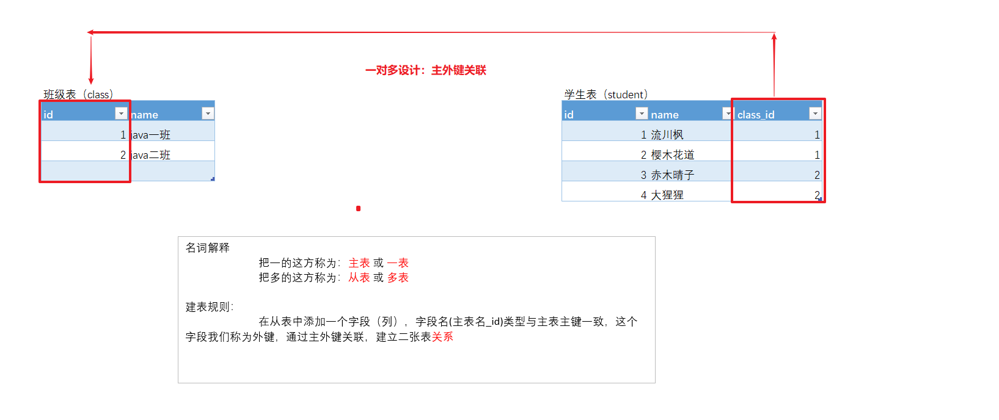
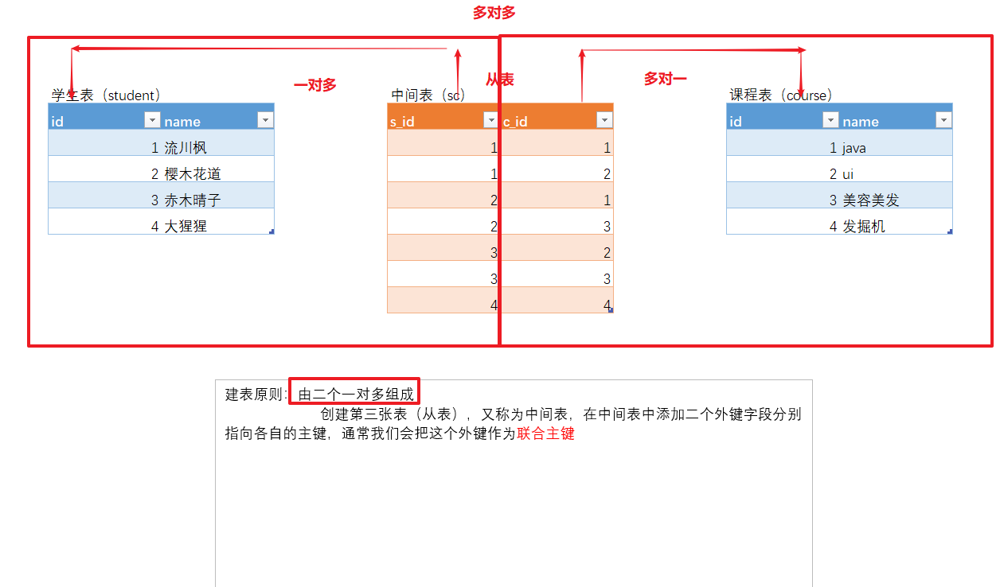
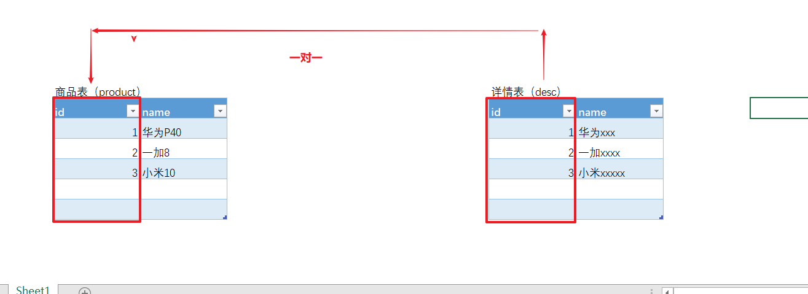

# 一 DQL高级查询

**准备数据**

```sql
-- DQL语句 单表查询
create database web19;

use web19;

-- 创建表
CREATE TABLE student (
  id int,
  name varchar(20),
  age int,
  sex varchar(5),
  address varchar(100),
  math int,
  english int
);
-- 插入记录
INSERT INTO student(id,NAME,age,sex,address,math,english) VALUES 
(1,'马云',55,'男','杭州',66,78),
(2,'马化腾',45,'女','深圳',98,87),
(3,'马景涛',55,'男','香港',56,77),
(4,'柳岩',20,'女','湖南',76,65),
(5,'柳青',20,'男','湖南',86,NULL),
(6,'刘德华',57,'男','香港',99,99),
(7,'马德',22,'女','香港',99,99),
(8,'德玛西亚',18,'男','南京',56,65),
(9,'唐僧',25,'男','长安',87,78),
(10,'孙悟空',18,'男','花果山',100,66),
(11,'猪八戒',22,'男','高老庄',58,78),
(12,'沙僧',50,'男','流沙河',77,88),
(13,'白骨精',22,'女','白虎岭',66,66),
(14,'蜘蛛精',23,'女','盘丝洞',88,88);
```


## 1.1 排序

```markdown
1. 语法
		select ... from 表名 order by 排序列 [asc |desc],排序列 [asc |desc]
			asc 升序（默认值）
			desc 降序
			
2. 注意
		多字段（列）排序，后面的排序结构是在前面排序的基础之上
```


```sql
# 排序
-- 查询所有数据,使用年龄降序排序
SELECT * FROM student ORDER BY age DESC;
-- 查询所有数据,在年龄降序排序的基础上，如果年龄相同再以数学成绩降序排序
SELECT * FROM student ORDER BY age DESC, math DESC;
```


## 1.2 聚合（分组）函数

> 作用：对一列数据进行计算，返回一个结果，不包含null值

```markdown
1. 语法
		count(*)：统计个数
		max(列名)：最大值
		min(列名)：最小值
		sum(列名)：求和
		avg(列名)：平均值
```


```sql
# 聚合函数
-- 查询学生总数（null值处理）
SELECT COUNT(*) FROM student;
-- 查询年龄大于40的总数
SELECT COUNT(*) FROM student WHERE age > 40;
-- 查询数学成绩总分
SELECT SUM(math) FROM student;

-- 查询数学成绩平均分
SELECT AVG(math) FROM student;
-- 查询数学成绩最高分
SELECT MAX(math) FROM student;
-- 查询数学成绩最低分
SELECT MIN(math) FROM student;
```


## 1.3 分组

> 对用：对一列数据进行分组，相同的内容分为一组，通常与聚合函数一起使用，完成统计工作

```markdown
1. 语法
		select 分组列 from 表名 group by 分组列 having 分组后条件筛选
		
2. where 和 having 区别
		where在分组前进行条件筛选，不支持聚合函数
		having在分组后进行条件筛选，支持聚合函数
```

```sql
-- 统计男生
SELECT COUNT(*) FROM student WHERE sex ='男';

-- 统计女
SELECT COUNT(*) FROM student WHERE sex ='女';

# 分组
-- 统计男生女生各多少人，在同一条sql实现...
SELECT sex,COUNT(*) FROM student GROUP BY sex;
-- 查询年龄大于25岁的人,按性别分组,统计每组的人数
-- 1.1 查询年龄大于25岁的人
SELECT * FROM student WHERE age > 25;
-- 1.2 按性别分组
SELECT sex FROM student WHERE age > 25 GROUP BY sex;
-- 1.3 统计每组的人数
SELECT sex,COUNT(*) FROM student WHERE age > 25 GROUP BY sex;
-- 查询年龄大于25岁的人,按性别分组,统计每组的人数,并只显示性别人数大于2的数据
SELECT sex,COUNT(*) FROM student WHERE age > 25 AND COUNT(*) >2 GROUP BY sex; -- 经验值：报错

SELECT sex,COUNT(*) FROM student WHERE age > 25 GROUP BY sex HAVING COUNT(*)> 2; -- 正确
```


## 1.4 分页（mysql方言）

```markdown
1. 语法
		select ... from 表名 limit 开始索引，每页显示个数;
		
2. 索引特点
		索引起始值是0；可以省略，默认值也是0
		
3. 分页索引公式
		开始索引 = (当前页-1) × 每页个数
```


```sql
# 分页
-- 查询学生表中数据，显示前6条
SELECT * FROM student LIMIT 0,6;
SELECT * FROM student LIMIT 6; -- 公司个别人会这么写..

-- 查询学生表中数据，从第三条开始显示，显示6条
SELECT * FROM student LIMIT 2,6;
-- 模拟百度分页，一页显示5条
-- 第一页
SELECT * FROM student LIMIT 0,5;
-- 第二页
SELECT * FROM student LIMIT 5,5;
-- 第三页
SELECT * FROM student LIMIT 10,5;
```


# 二 数据库约束

### 2.1 概述

**作用**

对表中的数据进行限定，保证数据的正确性、有效性和完整性。	

**分类**

```markdown
1. primary key：主键约束【掌握】  要求表中有一个列 唯一 且 非空，通常我们使用id作为主键

2. unique：唯一约束

3. not null：非空约束

4. default：默认值

5. foreign key：外键约束
```


### 2.2 实现

#### 2.2.1 主键约束

 作用：限定某一列的值非空且唯一， 主键就是表中记录的唯一标识（类似于人类的身份证号码）。

```markdown
1. 语法
	a）创建表
		create table 表名(
			id int primary key,
			...
			...
		);
	b）已有表
		alter table 表名 add primary key(id);
		
2. 特点
		一张表只能有一个主键约束，但可以设置联合主键（包含多个字段）
		
		
3. 自增器
	a）创建表
		create table 表名(
			id int primary key auto_increment,
			...
			...
		);		
	b）指定自增器起始值
		alter table 表名 auto_increment=起始值;
		
4. 删除主键约束【了解】
		alter table 表名 drop primary key;
		
	注意：如果该主键有自增器，那么不能直接删除主键约束功能...
	解释：只有主键约束的字段，才能使用自增器...
```


```sql
-- 主键约束

-- 给student表添加主键约束
ALTER TABLE student ADD PRIMARY KEY(id);

-- 创建表，指定主键约束
CREATE TABLE stu1(
 id INT PRIMARY KEY,
 `name` VARCHAR(32)
);
-- 测试
INSERT INTO stu1 VALUES(1,'jack');
-- Duplicate entry '1' for key 'PRIMARY' 错误：主键不能重复
INSERT INTO stu1 VALUES(1,'lucy');
-- Column 'id' cannot be null 错误：主键不能为空
INSERT INTO stu1 VALUES(NULL,'lucy');

-- 指stu1表，name字段也设置为主键约束
-- Multiple primary key defined 错误：主键定义多值
ALTER TABLE stu1 ADD PRIMARY KEY(`name`);


-- 创建表时，可以指定主键约束（多个字段）  给下午的课程铺垫...
CREATE TABLE stu2(
 id INT,
 `name` VARCHAR(32),
 PRIMARY KEY(id,`name`)
);
-- 测试
INSERT INTO stu2 VALUES(1,'jack');
-- ??? 居然没报错？？
INSERT INTO stu2 VALUES(1,'lucy');
-- Duplicate entry '1-jack' for key 'PRIMARY'  错误
INSERT INTO stu2 VALUES(1,'jack');


-- 创建表指定主键约束和自增器
CREATE TABLE stu3(
  id INT PRIMARY KEY AUTO_INCREMENT,
  `name` VARCHAR(32)
);

-- 测试
INSERT INTO stu3 VALUES(1,'jack');

INSERT INTO stu3 VALUES(NULL,'jack');

-- 修改自增器起始值...（了解）
ALTER TABLE stu3 AUTO_INCREMENT=10000;

-- 演示前天的内容
DELETE FROM stu3; -- 类似于橡皮擦
INSERT INTO stu3 VALUES(NULL,'jack');
TRUNCATE TABLE stu3 ; -- 删掉表，重构表
INSERT INTO stu3 VALUES(NULL,'jack');

-- 先移除自增器
ALTER TABLE stu3 MODIFY id INT;

-- 再移除主键约束
ALTER TABLE stu3 DROP PRIMARY KEY;
```


#### 2.2.2 唯一约束

作用：限定某一列的值不能重复，不能限定NULL

```markdown
1. 创建表时指定字段为唯一约束
		create table 表名(
			列名 数据类型 unique,
			...
			...
		);
```

```sql
-- 唯一约束
CREATE TABLE stu4(
 id INT PRIMARY KEY AUTO_INCREMENT,
 `name` VARCHAR(32) UNIQUE
);

-- 测试
INSERT INTO stu4 VALUES(1,'jack');
-- Duplicate entry 'jack' for key 'name' 错误：用户名不能重复
INSERT INTO stu4 VALUES(2,'jack');
INSERT INTO stu4 VALUES(3,NULL);
INSERT INTO stu4 VALUES(4,NULL);
```


#### 2.2.3 非空约束

> 作用：限定某一列的值不能为null
>

```markdown
1. 创建表时指定字段为非空约束
		create table 表名(
			列名 数据类型 not null, -- 非空约束
			列名 数据类型 unique not null -- （唯一+非空） 约束
		);
	
```

```sql
-- 唯一 + 非空  
CREATE TABLE stu5(
  id INT PRIMARY KEY AUTO_INCREMENT,
  `name` VARCHAR(32) UNIQUE NOT NULL
);

-- 测试
INSERT INTO stu5 VALUES(1,'jack');
-- 错误 Duplicate entry 'jack' for key 'name'
INSERT INTO stu5 VALUES(2,'jack');
-- 错误 Column 'name' cannot be null
INSERT INTO stu5 VALUES(3,NULL);
```


> 疑问：唯一 + 非空  != 主键
>
> 因为：一张表只能有一个主键，但是 唯一+非空 可以设置多个...


#### 2.2.4 默认值

> 作用：限定某一列的默认值，再没有指定的情况下所有列的默认值为null
>

```markdown
1. 创建表时指定字段默认值
		create table 表名(
			列名 数据类型 default 默认值,
			...
			...
		);
```

```sql
-- 默认值
CREATE TABLE stu6(
  id INT PRIMARY KEY AUTO_INCREMENT,
  `name` VARCHAR(32) DEFAULT NULL,
  sex VARCHAR(5)  DEFAULT '男'
);

-- 测试
INSERT INTO stu6(id,`name`) VALUES(1,'小张');
INSERT INTO stu6(id,`name`,sex) VALUES(2,'小宋','女');

-- 我们指定了默认值为男，在插入NULL时，会覆盖指定的默认值....
INSERT INTO stu6 VALUES(3,'小北',NULL);

```


# 三 表关系【重点】

## 3.1 概述

​	现实生活中，（班级）实体与（学生）实体之间肯定是有关系的，那么我们在设计表的时候，就应该体现出（班级）表与（学生）表之间的这种关系！

> 关系型数据库：（Relation DBMS）

```markdown
1. 一对多
	应用场景：
		班级和学生、部门和员工
	解释：
		一个班级内有多名学生，多名学生属于某一个班级

2. 多对多
	应用场景：
		老师和学生、学生和课程
	解释：
		一名老师可以教授多名同学，一名同学可以被多个老师教学

3. 一对一
	应用场景：
		公民和身份证号、公司和注册地
	解释：
		一个公民只能有一个身份证号，一个身份证号对应一个公民
```


## 3.2 实现

#### 3.2.1 一对多

```markdown
* 举例：班级和学生
```

 

```sql
-- 创建数据库
CREATE DATABASE web19_pro;
USE web19_pro;

-- 一对多


-- 主表（班级）
CREATE TABLE class(
  id INT PRIMARY KEY AUTO_INCREMENT,
  `name` VARCHAR(32)
);

INSERT INTO class VALUES(1,'java一班');
INSERT INTO class VALUES(2,'java二班');

-- 从表（学生）
CREATE TABLE student(
   id INT PRIMARY KEY AUTO_INCREMENT,
   `name` VARCHAR(32),
   class_id INT
);

INSERT INTO student VALUES(1,'流川枫',1);
INSERT INTO student VALUES(2,'樱木花道',1);
INSERT INTO student VALUES(3,'赤木晴子',2);
INSERT INTO student VALUES(4,'大猩猩',2);

-- 根据班级查询学生，语法明天详细介绍，大家现在先做一个整体感知...
SELECT * FROM class c  INNER JOIN student s ON c.id = s.class_id WHERE c.id = 1;


-- 给学生表外键添加约束
ALTER TABLE student ADD CONSTRAINT class_id_fk FOREIGN KEY(class_id) REFERENCES class(id);

-- 删除外键约束
ALTER TABLE student DROP FOREIGN KEY class_id_fk;
```


#### 3.2.2 多对多

```markdown
* 举例：学生和课程
```

  


```sql
-- 多对多
-- 主表（学生，上午已创建，可以直接使用...）

-- 主表（课程）
CREATE TABLE course(
 id INT PRIMARY KEY AUTO_INCREMENT,
 `name` VARCHAR(32)
);
INSERT INTO course VALUES(1,'java');
INSERT INTO course VALUES(2,'ui');
INSERT INTO course VALUES(3,'美容美发');
INSERT INTO course VALUES(4,'挖掘机');

-- 从表（中间表）
CREATE TABLE sc(
 s_id INT,
 c_id INT,
 PRIMARY KEY (s_id,c_id)
);
INSERT INTO sc VALUES(1,1);
INSERT INTO sc VALUES(1,2);
INSERT INTO sc VALUES(2,1);
INSERT INTO sc VALUES(2,3);
INSERT INTO sc VALUES(3,2);
INSERT INTO sc VALUES(3,3);
INSERT INTO sc VALUES(4,4);

-- 模拟多表查询，根据流川枫姓名查询 选修的课程 （了解）
SELECT * FROM student s 
	INNER JOIN sc ON s.`id` = sc.s_id 
	INNER JOIN course c ON sc.c_id = c.id 
	WHERE s.`name` = '樱木花道';
	
	
-- 测试联合主键
-- Duplicate entry '1-1' for key 'PRIMARY'
INSERT INTO sc VALUES(1,1);

-- 中间表添加外键约束
ALTER TABLE sc ADD FOREIGN KEY(s_id) REFERENCES student(id);
ALTER TABLE sc ADD FOREIGN KEY(c_id) REFERENCES course(id);

-- 流川枫选修一个不存在的课程
INSERT INTO sc VALUES(1,10);
```


#### 3.2.3 一对一

> 在实际开发中使用场景不多，因为可以设计到同一张表中简化....

```markdown

* 商品和详情
```

 


```sql
-- 商品（主表）
CREATE TABLE product(
 id INT PRIMARY KEY AUTO_INCREMENT,
 `name` VARCHAR(32)
);
INSERT INTO product VALUES(1,'华为p40');
INSERT INTO product VALUES(2,'一加8');
INSERT INTO product VALUES(3,'小米10');

-- 详情（从表）
CREATE TABLE `desc`(
  id INT PRIMARY KEY AUTO_INCREMENT,
   `name` VARCHAR(32),
   FOREIGN KEY(id) REFERENCES product(id)
);
INSERT INTO `desc` VALUES(1,'华为xxx');
INSERT INTO `desc` VALUES(2,'一加xxx');
INSERT INTO `desc` VALUES(3,'小米xxx');
```


## 3.3 外键（从表）约束【了解】

作用：限定二张表有关系的数据，保证数据的正确性、有效性和完整性

```markdown
1. 在从表中添加外键约束
	a）创建表
		create table 表名(
			外键列 数据类型,
			[constraint] [约束名] foreign key(外键列) references 主表(主键列)
		);
	b）已有表
		alter table 表名 add [constraint] [约束名] foreign key(外键) references 主表(主键);
		
2. 特点
	1）主表不能删除从表已引入的数据
	2）从表不能添加主表未拥有的数据
	3）先删除从表数据在删除主表数据
	4）先添加主表数据在添加从表数据
	5）外键约束字段可以为空但不能错
	
3. 补充在企业开发时，我们现在很少使用外面约束，影响数据库性能..
	我们是java工程师，可以在java中进行校验判断...

4. 删除外键约束
		alter table 表名 drop foreign key 约束名;
```


## 3.4 综合练习

> 在web结束后我们为期10天学习一个黑马旅游网综合案例，拿出部分业务，突出表关系的设计
>
> - 分类和线路（一对多）
>   - tab_category 分类
>   - tab_route 线路
> - 用户和线路（多对多）
>   - tab_user 用户
>   - tab_route 线路
>   - tab_favorite 收藏（中间表）


要求先画图，搞清楚关系。再去编写sql