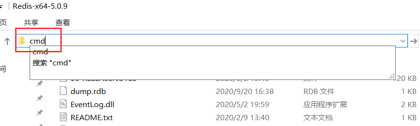
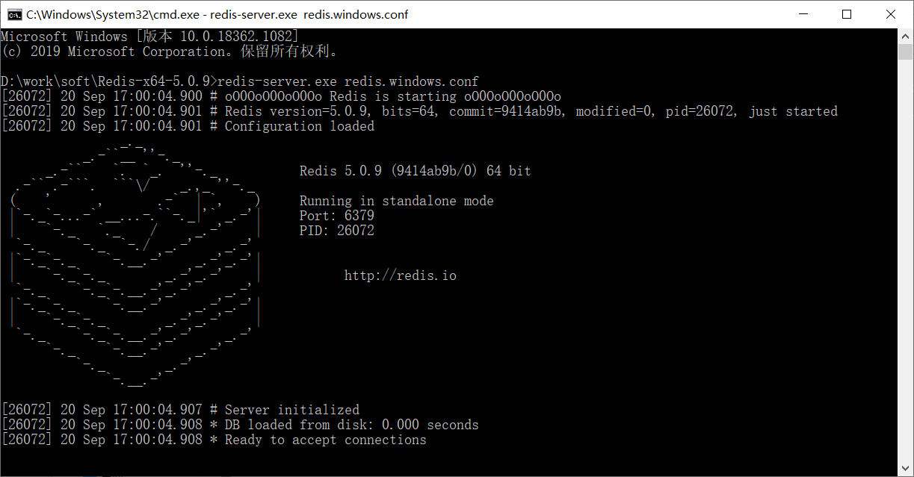
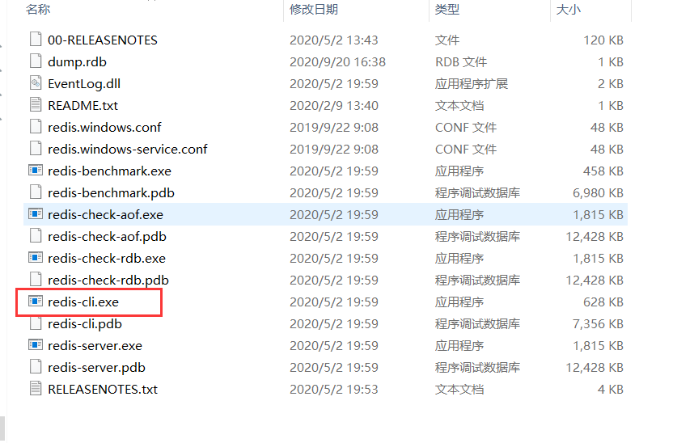
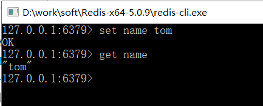

# Redis服务端配置

解压Redis-x64-5.0.9.zip

在解压后的目录打开命令行窗口



在控制台输入启动命令:

```shell
redis-server.exe redis.windows.conf
```

看到下面界面说明启动成功



# Redis客户端

使用redis-cli连接

直接双击



输入命令进行测试


```shell
# 设置
set name tom
# 获取
get name
```

