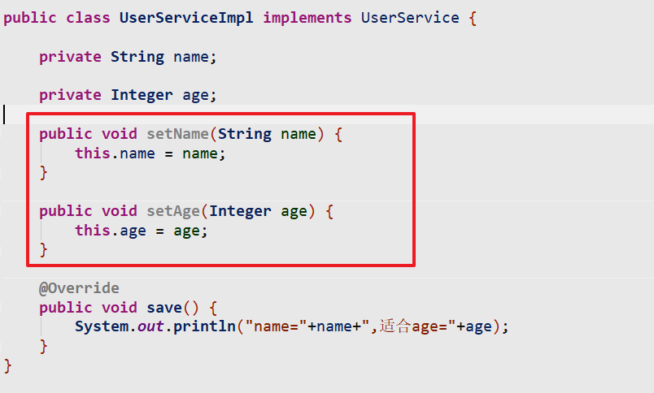
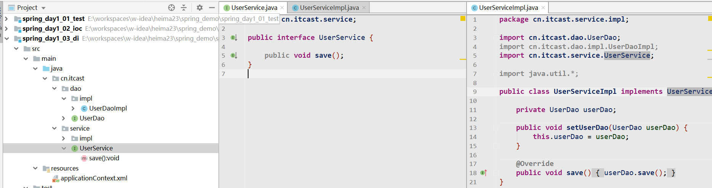

Spring：

1、Spring中的IOC和基于XML的ioc<font color=red>配置</font>

2、Spring中的IOC基于注解的<font color=red>配置</font>

3、spring中的AOP基于XML和注解的<font color=red>配置</font>

4、Spring中的事务管理基于XML和注解的<font color=red>配置</font>

SpringMVC：

1、SpringMVC的入门和请求参数封装

2、SpringMVC中的页面跳转和响应

3、SSM整合

# 1、JaveEE三层结构

java web工程三层结构： web层，service层，dao层


# 2、IOC思想推导（难点）

之前的代码逻辑

* servlet中需要调用service ： UserService userService = new UserServiceImpl()

**耦合关系：**代码片段中的依赖关系

解耦：

​	反射，配置文件，面向接口编程

## **2.1 简化版本**

（1） 创建工程导入依赖

```xml
<dependencies>
    <dependency>
        <groupId>dom4j</groupId>
        <artifactId>dom4j</artifactId>
        <version>1.6</version>
    </dependency>
</dependencies>
```

（2） 配置Service接口实现类


（3） 创建BeanFactory工具类

```java
public class BeanFactory {

    private static Map<String,String> map =  new HashMap<>();

    //静态代码块（第一次会执行static中的方法）
    static {
        //解析XML配置文件
        //1、通过类加载器获取配置文件输入流
        InputStream is = BeanFactory.class.getClassLoader().getResourceAsStream("bean.xml");
        //2、创建SaxReader对象
        SAXReader reader = new SAXReader();
        try {
            //3、创建document对象
            Document document = reader.read(is);
            //4、获取根节点
            Element root = document.getRootElement();
            //5、获取所有的bean子节点
            List<Element> elements = root.elements("bean");
            for (Element element : elements) {
                String id = element.attributeValue("id").toString();
                String className = element.attributeValue("class").toString();
                map.put(id, className);
            }
        } catch (Exception e) {
            e.printStackTrace();
        }
    }

    /**
     * 根据对象的全类名，反射创建对象
     *  返回值：Object
     *  参数：全类名（String）
     */
    public static Object getBean(String id) throws Exception {
        //1、获取classname
        String className = map.get(id);
        //2、反射创建对象
        Class<?> aClass = Class.forName(className);
        return aClass.newInstance();
    }
}
```

（4） 测试

```java
//模拟servlet
public class UserServiceTest {

    /**
     * 错误（异常）：
     *  1、运行期异常
     *  2、编译器异常（影响工程编写）
     *  servlet和UserServiceImpl存在紧密耦合关系
     * 解耦：
     *  1、配置文件
     *  2、反射
     */
    public static void main(String[] args) throws Exception {
//        UserService userService = new UserServiceImpl();
//        userService.save();

        UserService userService = (UserService) BeanFactory.getBean("userService");
        userService.save();
    }
}

```

## 2.2 版本升级

（1） 创建配置文件


（2） 在BeanFactory解析配置文件

```java
package cn.itcast.utils;

import cn.itcast.service.UserService;
import org.dom4j.Document;
import org.dom4j.Element;
import org.dom4j.io.SAXReader;

import java.io.InputStream;
import java.util.HashMap;
import java.util.List;
import java.util.Map;

/**
 * 单例工厂：多次调用getBean方法，获取的对象是同一个
 *  1、当程序第一次访问BeanFactory，解析Bean.xml配置文件，创建对象
 *  2、当调用getBean方法的时候，从map集合中直接获取目标对象
 */
public class BeanFactory {

    /**
     * map存放：
     *      userDao = UserDaoImpl对象
     */
    private static Map<String,Object> map = new HashMap<>();


    static {
        try {
            //1.获取配置文件的输入流
            InputStream is = BeanFactory.class.getClassLoader().getResourceAsStream("bean.xml");
            //2.创建SAXReader对象
            SAXReader reader = new SAXReader();
            //3.获取Document对象
            Document document = reader.read(is);
            //4.获取所有的bean节点
            Element root = document.getRootElement(); //获取跟节点
            List<Element> bean = root.elements("bean");
            //5.解析bean节点，获取id和class属性
            for (Element element : bean) {
                String id = element.attributeValue("id");  //userDao
                String cls = element.attributeValue("class");  //全限定类名
                Class<?> aClass = Class.forName(cls);
                Object obj = aClass.newInstance();
                //6.存入map集合
                map.put(id,obj);
            }
        }catch (Exception e){

        }
    }


    /**
     * 根据传入的参数名，反射创建对象
     */
    public static Object getBean(String key) throws Exception {
        return map.get(key);
    }
}

```

## 2.3 总结


通过两种方式完成了对象的对象（userDaoImpl）

* 最简单的版本：通过手动反射创建对象 （手动new对象）

* 第二个版本：所需的目标对象，从map集合(容器)中获取（控制反转：IOC）

ioc：对象的获取方式，由传统的主动实例化对象（new 对象），变为从容器（map）集合中获取

# 3、Spring概述和控制反转（面试题）

## 3.1 什么是Spring

* spring是于2003 年兴起的一个full-stack轻量级的Java 开源框架，由Rod Johnson创建
* Spring以IOC（控制反转）和AOP （面向切面编程）为核心
* Spring提供了展现层Spring MVC、持久层Spring JDBC、业务层事务管理等众多的企业级应用技术
* Spring还能整合开源世界众多的第三方框架和类库，逐渐成为使用最多的Java EE企业应用开源框架

## 3.2 认识IOC

IOC(控制反转)不是什么技术，而是一种设计思想。它的目的是指导我们设计出更加松耦合的程序。

* 控制：指的是对象控制权，在java中可以简单理解为 对象的控制权限(比如对象的创建、销毁等权限)
* 反转：指的是将对象的控制权由原来的 程序员在类中主动控制 反转到 由Spring容器来控制。
* **对象的创建交由Spring容器管理，需要对象从容器中获取即可**
* 主要功能<font color="red">解耦</font>
* IOC的底层原理：<font color="red">反射</font>

举个例子：找对象

* 传统方式：自己找，想要啥样的自己去大街上找（new），主动出击
* IOC方式 ：婚介所，首先人们将自己的信息注册到婚介所。然后，等你想要对象的时候，婚介所就会帮你找
  到，然后给你送来。

# 4、SpringIOC的入门案例（重点）

案例：通过Spring中内置的容器获取对象

操作步骤：

* 创建工程导入依赖
* 配置接口和实现类
* 编写Spring的配置文件
* 测试：从容器中获取对象

## 4.1 入门案例

### 创建工程导入依赖

```xml
    <dependencies>
        <!--spring的坐标-->
        <dependency>
            <groupId>org.springframework</groupId>
            <artifactId>spring-context</artifactId>
            <version>5.1.6.RELEASE</version>
        </dependency>
        <!--单元测试-->
        <dependency>
            <groupId>junit</groupId>
            <artifactId>junit</artifactId>
            <version>4.12</version>
        </dependency>
    </dependencies>
```

### 创建Dao接口和实现类


### 创建Spring配置文件

* spring配置文件约定俗称：applicationContext.xml
* spring配置文件放置到：resource目录下
* spring配置文件，需要引入名称空间（约束）
  * 直接COPY讲师的代码
* 在spring的配置文件中通过 <bean>标签，定义对象id和实现类全类名

在resource目录下创建applicationContext.xml配置文件

```xml
<?xml version="1.0" encoding="UTF-8"?>
<beans xmlns="http://www.springframework.org/schema/beans"
       xmlns:xsi="http://www.w3.org/2001/XMLSchema-instance"
       xmlns:p="http://www.springframework.org/schema/p"
       xsi:schemaLocation="http://www.springframework.org/schema/beans
        https://www.springframework.org/schema/beans/spring-beans.xsd">

    <!--
        定义配置信息
            id：唯一标志（获取的时候，调用容器的getBean("id")）
            class：实现类的全限定类名
    -->
    <bean id="userDao" class="cn.itcast.dao.impl.UserDaoImpl"></bean>

</beans>
```

### 测试

```java
package cn.itcast.test;

import cn.itcast.dao.UserDao;
import org.springframework.context.ApplicationContext;
import org.springframework.context.support.ClassPathXmlApplicationContext;

/**
 * 测试从容器中获取对象
 */
public class UserDaoTest {

    public static void main(String[] args) {
        //1、根据配置文件获取容器
        ApplicationContext ac = new ClassPathXmlApplicationContext("applicationContext.xml");
        //2、调用容器的方法，获取对象
        UserDao userDao = (UserDao)ac.getBean("userDao");
        //3、测试
        userDao.save();
    }
}
```


## 4.2 执行过程分析


## 4.3 Spring的API介绍（面试题）


Spring的API体系异常庞大，我们现在只关注两个BeanFactory和ApplicationContext:
**BeanFactory**

* BeanFactory是 Spring 的"心脏"。
* BeanFactory是 IOC 容器的核心接口，它定义了IOC的基本功能。
* Spring使用它来配置文档，管理bean的加载，实例化并维护bean之间的依赖关系，负责bean的声明周期

**ApplicationContext**

* ApplicationContext由BeanFactory派生而来，可以比喻为Spring的躯体。
* ApplicationContext在BeanFactory的基础上添加了很多功能：
  * 支持了aop功能和web应用
  * MessageSource, 提供国际化的消息访问
  * 通过配置来实现BeanFactory中很多编码才能实现的功能

* ApplicationContext的常用实现类
  * ClassPathXmlApplicationContext: 从classpath目录读取配置文件
  * FileSystemXmlApplicationContext: 从文件系统或者url中读取配置文件
  * AnnotationConfigApplicationContext：当我们使用注解配置容器对象时，需要使用此类来创建 spring
    容器。它用来读取注解。

**两者区别:**

* beanFactory主要是面向Spring框架的基础设施，也就是供spring自身内部调用，
* 而Applicationcontext 主要面向Spring的使用者。
* <font color="red">**BeanFactroy在第一次使用到某个Bean时(调用getBean())，才对该Bean进行加载实例化，**</font>
* <font color="red">而ApplicationContext是在容器启动时，一次性创建并加载了所有的Bean</font>

## 4.4 初始化Bean对象

### 默认无参构造函数（重点）

它会根据默认无参构造函数来创建类对象。如果 bean 中没有默认无参构造函数，将会创建失败。

```xml
<bean id="userDao" class="cn.itcast.dao.impl.UserDaoImpl"></bean>
```

### 工厂模式创建对象(不用练)

在Spring中还可以通过工厂模式来创建对象。工厂模式又分两种：

* 静态工厂：不产生工厂的实例，直接调用工厂的静态方法创建对象。
* 实例工厂：先产生工厂的实例，再调用工厂实例的方法创建对象。

使用工厂初始化对象，又可以根据工厂的性质分为使用静态工厂和实例化工厂，但是都很简单。

```java
public class FactroyCreateBean {
    //静态工厂
    public static UserDao createUserDao(){
    	return new UserDaoImpl();
    }
    //实例工厂
    public UserDao createUserDaoSimple(){
    	return new UserDaoImpl();
    }
}
```

```xml
<!--使用静态工厂创建对象-->
<bean id="userDao1" class="cn.itcast.factory.FactroyCreateBean" factory-method="createUserDao"/>
<!--使用实例工厂创建对象-->
<bean id="factroyCreateBean" class="cn.itcast.factory.FactroyCreateBean"/>
<bean id="userDao2" factory-bean="factroyCreateBean" factory-method="createUserDaoSimple"/>
```

# 5、对象的生命周期（了解）

## 5.1 对象作用域（重点）

```xml
    <!--
        定义配置信息
            id：唯一标志（获取的时候，调用容器的getBean("id")）
            class：实现类的全限定类名
            scope：对象作用域
                singleton : 单例（默认）
                prototype ：多例
                request
                session
                global-session
         原理：
            通过反射调用，无参构造方法创建对象
    -->
    <bean id="userDao" class="cn.itcast.dao.impl.UserDaoImpl" scope="prototype" </bean>
```

## 5.2 生命周期

```xml
    <!--
        定义配置信息
            id：唯一标志（获取的时候，调用容器的getBean("id")）
            class：实现类的全限定类名
            scope：对象作用域
                singleton : 单例（默认）
                prototype ：多例
                request
                session
                global-session
            init-method：对象创建成功之后，指定的初始化方法
            destroy-method：容器关闭对象销毁之前，执行的销毁方法
                只有在scope=singleton的时候，才有效
                单例对象（对象是委托给荣容器管理）：
                    容器创建之后，创建对象，存入容器
                多例对象（调用getBean，创建一次对象）
         原理：
            通过反射调用，无参构造方法创建对象
    -->
    <bean id="userDao" class="cn.itcast.dao.impl.UserDaoImpl" scope="prototype" init-method="init" destroy-method="destory"></bean>
```


# 6、<font color='red'>依赖注入(重点)</font>

**依赖注入**：Dependency Injection (DI)。 它是 spring 框架核心 ioc 的具体实现。我们的程序在编写时， 通过控制反转，把对象的创建交给了 spring，但是代码中不可能出现没有依赖的情况。比如我们的Book中可能引入一个Publish类，在使用了Spring之后，它会为我们解决这些依赖对象的注入。

ioc 具有两个功能：依赖查找，依赖注入

本质：想对象中的私有属性赋值

* 构造方法
* set方法调用

## 6.1 构造方法注入

* 向对象添加有参构造方法

```java
public class UserServiceImpl implements UserService {

    private String name;
    private Integer age;

    public UserServiceImpl(String name, Integer age) {
        this.name = name;
        this.age = age;
    }

    @Override
    public void save() {
        System.out.println(name + age);
    }
}

```


* 在spring的配置文件中，通过bean标签配置对象创建（需要添加构造方法参数）

```xml
    <!--
        constructor-arg 设置对象的构造方法参数 （一个参数配置一个constructor-arg标签）
            name：构造参数名
            type：构造参数类型
            index：构造参数，参数索引位置（从0开始）
         以上三个属性，用于定位构造方法参数位置(三选一即可)
            value： 对基本数据类型的参数赋值（8大数据类型 + String）
            ref: 对对象属性的参数赋值
         以上两个属性，用于对构造参数赋值
     -->
    <bean id="userService" class="cn.itcast.service.impl.UserServiceImpl">
        <constructor-arg name="age" value="12"></constructor-arg>
        <constructor-arg name="name" value="王者荣耀"></constructor-arg>
    </bean>

```


## 6.2 set方法注入

* 提供属性的set方法



* 在spring配置文件中，通过bean结合property配置set方法调用


## 6.3 注入复杂类型（集合）

**（1） 注入数组数据**

配置set方法

```java

public class UserServiceImpl implements UserService {

    /**
     * 注入数组（array数组，list集合，set集合）
     *
     */
    private String [] names;
    private List<String> lists;
    private Set<String> sets;

    public void setNames(String[] names) {
        this.names = names;
    }

    public void setLists(List<String> lists) {
        this.lists = lists;
    }

    public void setSets(Set<String> sets) {
        this.sets = sets;
    }

    @Override
    public void save() {

        System.out.println("---names");
        for (String name : names) {
            System.out.println(name);
        }

        System.out.println("---lists");
        for (String name : lists) {
            System.out.println(name);
        }

        System.out.println("---sets");
        for (String name : sets) {
            System.out.println(name);
        }
    }
}
```

spring配置


**（2） 注入kv数据**

java对象

```java
public class UserServiceImpl implements UserService {

    /*
    * 注入 key-value类型的数据
    *      map集合
    *      Properties对象
    * */
    private Map<String,String> maps;

    private Properties pros;

    public void setMaps(Map<String, String> maps) {
        this.maps = maps;
    }

    public void setPros(Properties pros) {
        this.pros = pros;
    }

    @Override
    public void save() {
        maps.forEach((key,value)->
                System.out.println(key+"---"+value));

        System.out.println("------------------------------");

        Enumeration<Object> elements = pros.keys();

        while(elements.hasMoreElements()) {
            String key = (String)elements.nextElement();
            String value = pros.getProperty(key);
            System.out.println(key + "--" + value);
        }
    }
}

```

配置文件

```xml
    <bean id="userService" class="cn.itcast.service.impl.UserServiceImpl">
        <property name="maps">
            <map>
                <entry key="s12" value="王者荣耀"></entry>
                <entry key="s15" value="LOL"></entry>
            </map>
        </property>

        <property name="pros">
            <props>
                <prop key="p1">英雄联盟</prop>
                <prop key="p2">刺激战场</prop>
            </props>
        </property>
    </bean>
```


## 6.4 注入对象（重点）

（1） 对象准备

  创建UserDao 和 UserService




（2） 在userService中添加userDao的set方法


（3）在spring配置文件中，配置set方法注入


# 7、DBUtils工具类

## 7.1 DbUtils介绍

DbUtils是Apache的一款用于简化Dao代码的工具类，它底层封装了JDBC技术。

**核心类：**

* QueryRunner   用于执行增删改查的SQL语句
* ResultSetHandler 这是一个接口，主要作用是将数据库返回的记录封装进实体对象
  * 查询数据封装，结果集处理器
  * BeanHandler：将查询数据封装为对象
  * BeanListHandler：将查询数据封装为对象list集合

**核心方法：**

* update() 用来执行增、删、改语句 executeUpate
* query() 用来执行查询语句 executeQuery

```java
//1、创建datasource
xxx
//2.创建QueryRunner
QueryRunner queryRunner = new QueryRunner(dataSource);
//update方法，用于执行增删改语句
//第一个参数:sql语句   后面的参数:sql语句中的所需要的的值
queryRunner.update("insert into account value(null,?,?)",1,2);
//query方法，用于执行查询语句
//第一个参数:sql语句   第一个参数:封装返回值   后面的参数:sql语句中的所需要的的值
//BeanHandler用于将一条返回数据封装成一个JavaBean,  类似的子类还有BeanListHandler等
queryRunner.query("select * from account where aid = ?",  new BeanHandler<Account>(Account.class),  1); 
```

## 7.2 DbUtils基本使用

完成数据库的基本CRUD

### 7.2.1 准备数据库环境

```sql
create table account(
	id int primary key auto_increment,
	name varchar(100) not null unique,
	money float(10,2)
)
```

### 7.2.2 创建工程导入依赖

```xml

    <dependencies>
        <dependency>
            <groupId>org.springframework</groupId>
            <artifactId>spring-context</artifactId>
            <version>5.1.6.RELEASE</version>
        </dependency>
        <dependency>
            <groupId>mysql</groupId>
            <artifactId>mysql-connector-java</artifactId>
            <version>5.1.6</version>
        </dependency>
        <!--druid-->
        <dependency>
            <groupId>com.alibaba</groupId>
            <artifactId>druid</artifactId>
            <version>1.1.15</version>
        </dependency>
        <!--dbutils-->
        <dependency>
            <groupId>commons-dbutils</groupId>
            <artifactId>commons-dbutils</artifactId>
            <version>1.7</version>
        </dependency>
    </dependencies>
```

### 7.2.3 创建实体类

```java
package cn.itcast.domain;

public class Account {

    private Integer id;

    private String name;//账户名称

    private Float money;//账户金额

    public Integer getId() {
        return id;
    }

    public void setId(Integer id) {
        this.id = id;
    }

    public String getName() {
        return name;
    }

    public void setName(String name) {
        this.name = name;
    }

    public Float getMoney() {
        return money;
    }

    public void setMoney(Float money) {
        this.money = money;
    }

    @Override
    public String toString() {
        return "Accout{" +
                "id=" + id +
                ", name='" + name + '\'' +
                ", money=" + money +
                '}';
    }
}

```

### 7.2.4 保存

```java
public class DbUtilsTest {

    public static void main(String[] args) throws Exception {
        //1、创建datasource
        DruidDataSource dataSource = new DruidDataSource();
        dataSource.setUsername("root");
        dataSource.setPassword("root");
        dataSource.setUrl("jdbc:mysql:///heima23");
        dataSource.setDriverClassName("com.mysql.jdbc.Driver");
        //2、根据dataSource创建QueryRunner对象
        QueryRunner queryRunner = new QueryRunner(dataSource);
        //3、调用QueryRunner对象的query或者update方法完成数据库查询或者增，删改操作

        //保存
        queryRunner.update("insert into account(name,money) values (?,?)", "张三",100); //sql语句，占位符的值
    }
}
```

### 7.2.5 数据查询

```java
public class DbUtilsTest {

    public static void main(String[] args) throws Exception {
        //1、创建datasource
        DruidDataSource dataSource = new DruidDataSource();
        dataSource.setUsername("root");
        dataSource.setPassword("root");
        dataSource.setUrl("jdbc:mysql:///heima23");
        dataSource.setDriverClassName("com.mysql.jdbc.Driver");
        //2、根据dataSource创建QueryRunner对象
        QueryRunner queryRunner = new QueryRunner(dataSource);
        //3、调用QueryRunner对象的query或者update方法完成数据库查询或者增，删改操作
        //查询1号账户
        Account account = queryRunner.query("select * from account where id=?", new BeanHandler<Account>(Account.class), 1);
        System.out.println(account);
    }
}
```

### 7.2.6 查询所有

```java
    public static void main(String[] args) throws Exception {
        //1、创建datasource
        DruidDataSource dataSource = new DruidDataSource();
        dataSource.setUsername("root");
        dataSource.setPassword("root");
        dataSource.setUrl("jdbc:mysql:///heima23");
        dataSource.setDriverClassName("com.mysql.jdbc.Driver");
        //2、根据dataSource创建QueryRunner对象
        QueryRunner queryRunner = new QueryRunner(dataSource);
        //3、调用QueryRunner对象的query或者update方法完成数据库查询或者增，删改操作

        //保存
        //queryRunner.update("insert into account(name,money) values (?,?)", "张三",100); //sql语句，占位符的值

        //更新: 更新1号账户的金额为200
        //queryRunner.update("update account set money=? where id=?", 200,1);

        //删除：删除1号账户
        queryRunner.update("delete from account where id=?",1);

        //查询1号账户
        //Account account = queryRunner.query("select * from account where id=?", new BeanHandler<Account>(Account.class), 1);
        //System.out.println(account);

        //查询所有账户
        //List<Account> list = queryRunner.query("select * from account", new BeanListHandler<Account>(Account.class));
        //for (Account account : list) {
        //    System.out.println(account);
        //}
    }
```

# 8、综合案例

## 8.1 案例介绍

使用Spring配置Dbutils完成增删改查操作

## 8.2 环境搭建

### 8.2.1 创建工程导入坐标

```xml
    <dependencies>
        <!--mysql-->
        <dependency>
            <groupId>mysql</groupId>
            <artifactId>mysql-connector-java</artifactId>
            <version>5.1.6</version>
        </dependency>
        <!--druid-->
        <dependency>
            <groupId>com.alibaba</groupId>
            <artifactId>druid</artifactId>
            <version>1.1.15</version>
        </dependency>
        <!--dbutils-->
        <dependency>
            <groupId>commons-dbutils</groupId>
            <artifactId>commons-dbutils</artifactId>
            <version>1.7</version>
        </dependency>
        <!--junit-->
        <dependency>
            <groupId>junit</groupId>
            <artifactId>junit</artifactId>
            <version>4.12</version>
        </dependency>
        <!--spring-->
        <dependency>
            <groupId>org.springframework</groupId>
            <artifactId>spring-context</artifactId>
            <version>5.1.6.RELEASE</version>
        </dependency>


        <!--spring-junit-->
        <dependency>
            <groupId>org.springframework</groupId>
            <artifactId>spring-test</artifactId>
            <version>5.1.6.RELEASE</version>
        </dependency>
    </dependencies>
```

### 8.2.2 创建实体类

```java
package cn.itcast.domain;

public class Account {

    private Integer id;

    private String name;//账户名称

    private Float money;//账户金额
    
    //getter,setter 略
}
```


### 8.2.3 创建dao接口

```java

public interface AccountDao {

    void save(Account account);

    Account findById(Integer id);
}

```

### 8.2.4 创建dao接口实现类

```java
package cn.itcast.dao.impl;

import cn.itcast.dao.AccountDao;
import cn.itcast.domain.Account;
import com.alibaba.druid.pool.DruidDataSource;
import org.apache.commons.dbutils.QueryRunner;
import org.apache.commons.dbutils.handlers.BeanHandler;

import java.sql.SQLException;

public class AccountDaoImpl implements AccountDao {

    private QueryRunner qr;

    public void setQr(QueryRunner qr) {
        this.qr = qr;
    }

    @Override
    public void save(Account account) {
        try {
            qr.update("insert into account(name,money) values (?,?)", account.getName(),account.getMoney());
        } catch (SQLException e) {
            e.printStackTrace();
        }
    }

    @Override
    public Account findById(Integer id) {
        Account account = null;
        try {
            account = qr.query("select * from account where id=?", new BeanHandler<Account>(Account.class),id);
        } catch (SQLException e) {
            e.printStackTrace();
        }
        return account;
    }
}

```

### 8.2.5 创建service接口

```java

public interface AccountService {

    //保存账户
    void save(Account account);

    //根据id查询账户
    Account findById(Integer id);
}

```

### 8.2.6 创建service接口实现类

```java
public class AccountServiceImpl implements AccountService {

    private AccountDao accountDao;

    public void setAccountDao(AccountDao accountDao) {
        this.accountDao = accountDao;
    }

    @Override
    public void save(Account account) {
        accountDao.save(account);
    }

    @Override
    public Account findById(Integer id) {
        return accountDao.findById(id);
    }
}

```

## 8.3 Spring配置(重点)

配置spring，先写测试类。通过测试类创建所需的对象，在spring中进行配置

```xml
<?xml version="1.0" encoding="UTF-8"?>
<beans xmlns="http://www.springframework.org/schema/beans"
       xmlns:xsi="http://www.w3.org/2001/XMLSchema-instance"
       xmlns:p="http://www.springframework.org/schema/p"
       xsi:schemaLocation="http://www.springframework.org/schema/beans
        https://www.springframework.org/schema/beans/spring-beans.xsd">

    <!--创建dataSource存入容器-->
    <bean id="dataSource" class="com.alibaba.druid.pool.DruidDataSource">
        <property name="username" value="root"></property>
        <property name="password" value="root"></property>
        <property name="url" value="jdbc:mysql:///heima23"></property>
        <property name="driverClassName" value="com.mysql.jdbc.Driver"></property>
    </bean>

    <!--创建queryRunner交给容器管理-->
    <bean id="queryRunner" class="org.apache.commons.dbutils.QueryRunner">
        <constructor-arg name="ds"  ref="dataSource"></constructor-arg>
    </bean>
    
    <!--创建Dao交给容器管理-->
    <bean id="accountDao" class="cn.itcast.dao.impl.AccountDaoImpl">
        <property name="qr" ref="queryRunner"></property>
    </bean>

    <!--创建AccoutService-->
    <bean id="accountService" class="cn.itcast.service.impl.AccountServiceImpl">
        <!--set注入accountDao-->
        <property name="accountDao" ref="accountDao"></property>
    </bean>
</beans>
```

## 8.4 测试

```java
/**
 * 模拟web层
 */
public class WebTest {

    /**
     * 从容器中获取AccountService对象，完成数据库CRUD操作
     */
    public static void main(String[] args) {
        //1、获取spring容器
        ApplicationContext ac = new ClassPathXmlApplicationContext("applicationContext.xml");
        //2、从容器中获取QueryRunner
        AccountService accountService = (AccountService) ac.getBean("accountService");
        //3、测试
        Account account = new Account();
        account.setMoney(999f);
        account.setName("小王1");
        accountService.save(account);
    }
}

```

# 9、配置文件的模块化（了解）

我们现在的配置都集中配在了一个applicationContext.xml文件中，当开发人员过多时， 如果所有bean都配置到同一个配置文件中，会使这个文件巨大，而且也不方便维护。针对这个问题，Spring提供了多配置文件的方式，也就是所谓的配置文件模块化。

1. 并列的多个配置文件
    直接编写多个配置文件，比如说beans1.xml，beans2.xml......, 然后在创建ApplicationContext的时候，直接
    传入多个配置文件。

  ```java
  ApplicationContext act = new ClassPathXmlApplicationContext("beans1.xml","beans2.xml","...");
  ```

2. 主从配置文件
    先陪一个主配置文件，然后在里面导入其它的配置文件。

  ```xml
  <import resource="beans1.xml" />
  <import resource="beans2.xml" />
  ```

**注意事项：**

* 同一个xml文件中不能出现相同名称的bean,如果出现会报错
* 多个xml文件如果出现相同名称的bean，不会报错，但是后加载的会覆盖前加载的bean，所以企业开发中尽
  量保证bean的名称是唯一的。


作业：

* 完成IOC的入门案例
* 完成依赖注入的两种方式

* 完成综合案例，通过dbutils完成数据库的CRUD