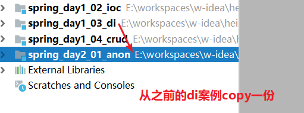
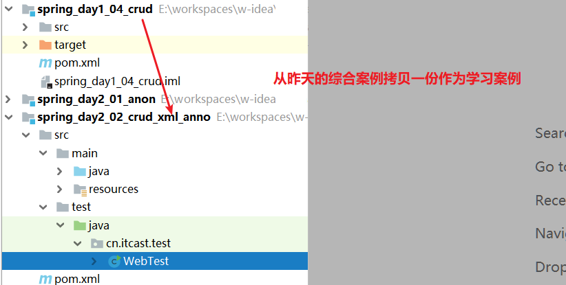
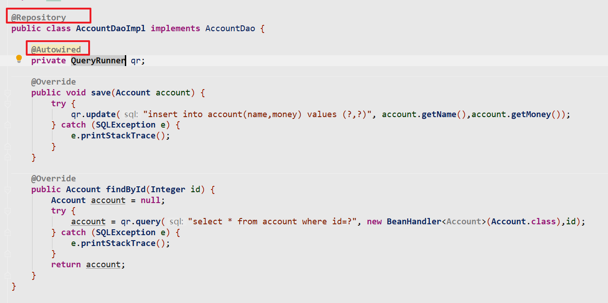
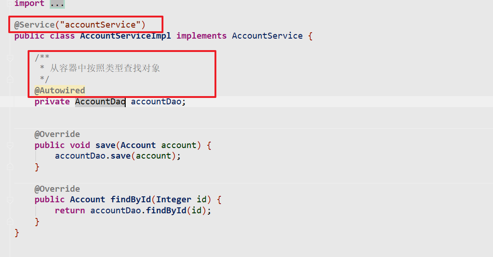
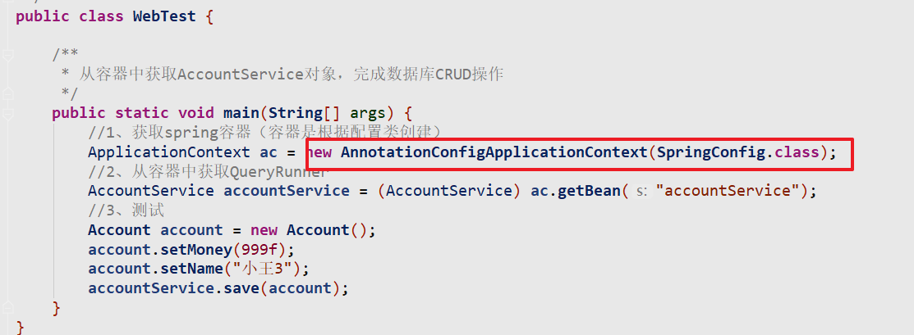
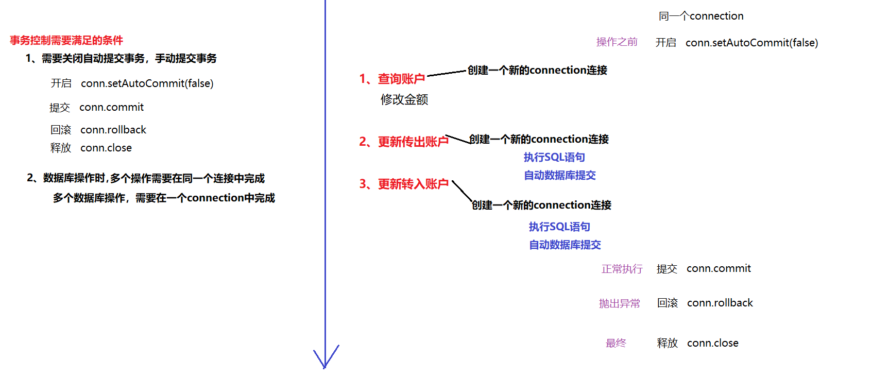
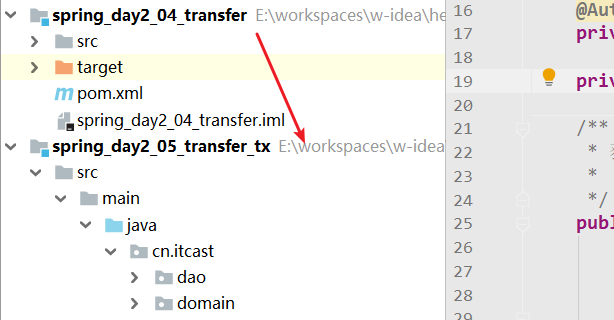

# 1 Spring中的常见注解

Spring中注解配置（<font color="red">1、注解 + xml配置 </font>，2、纯注解（Springboot + cloud））

注解就是对xml格式的一种替换,二者的功能是完全一样的

**在spring中使用注解开发，需要开启注解的功能支持（ioc注解，aop注解，事务注解）**

## 1.1 环境搭建

**（1）  案例拷贝**

从昨天的代码中copy一份作为今日的案例，完成Spring常见注解的功能



**（2） xml配置文件删除bean配置**

使用注解替换bean标签的配置，我们将applicationContext.xml中的bean标签删除。

```xml
<?xml version="1.0" encoding="UTF-8"?>
<beans xmlns="http://www.springframework.org/schema/beans"
       xmlns:p="http://www.springframework.org/schema/p"
       xmlns:xsi="http://www.w3.org/2001/XMLSchema-instance"
       xmlns:context="http://www.springframework.org/schema/context"
       xsi:schemaLocation="http://www.springframework.org/schema/beans
			    http://www.springframework.org/schema/beans/spring-beans.xsd
			    http://www.springframework.org/schema/context
			    http://www.springframework.org/schema/context/spring-context.xsd">
</beans>
```

**（3）xml中加入包扫描**

```xml
<?xml version="1.0" encoding="UTF-8"?>
<beans xmlns="http://www.springframework.org/schema/beans"
       xmlns:p="http://www.springframework.org/schema/p"
       xmlns:xsi="http://www.w3.org/2001/XMLSchema-instance"
       xmlns:context="http://www.springframework.org/schema/context"
       xsi:schemaLocation="http://www.springframework.org/schema/beans
			    http://www.springframework.org/schema/beans/spring-beans.xsd
			    http://www.springframework.org/schema/context
			    http://www.springframework.org/schema/context/spring-context.xsd">

    <!--
        开启对IOC注解的支持
            开启包扫描：当容器启动，自动扫描指定包下的所有IOC注解。
            base-package:包名（自动扫描此包以及此包下的所有子包）
    -->
    <context:component-scan base-package="cn.itcast"></context:component-scan>
</beans>
```

* 包扫描：扫描指定包下的所有java类，扫描类中的Spring注解，帮助我们自动的创建对象存入容器

## 1.2 对象创建的注解

**语法规则**

```
创建对象交给spring容器管理，语义话的形式代码分层
  <bean id="userDao" class="cn.itcast.dao.impl.UserDaoImpl"></bean>
  @Component （组件）：
  @Controller ：在web层使用
  @Service    ：在service层
  @Repository ：在dao层使用
      * 当spring容器启动时，根据包扫描配置自动的扫描到@Component注解，反射创建注解标注的对象，存入容器
      * 默认存入容器的id（唯一标识） = 当前类名首字母小写（userDaoImpl）
      * value属性 ：自定义容器中对象的唯一标识
```

**java代码如下**

```java
/**
 * 对象创建的注解：相当于xml中的如下配置
 *      <bean id="userDaoImpl" class="cn.itcast.dao.impl.UserDaoImpl"></bean>
 * 创建对象的注解：通过语义话的形式，进行模块开发
 *      @Component
 *      @Controller：web层
 *      @Service：service层
 *      @Repository:dao层
 *          * 配置到实现类上，表明创建对象交给容器管理
 *          * 默认的唯一标志：当前类名首字母小写（userDaoImpl）
 *          * 在其中通过value属性指定，存入容器的对象唯一标志 
 */
@Service(value="userDao")
public class UserDaoImpl implements UserDao {
    @Override
    public void save() {
        System.out.println("调用dao保存数据");
    }
}

```

## 1.3 生命周期的注解

**语法规则**

```
对象的生命周期的注解
  @Scope : 配置到类上，对象作用域
      singleton：单例(默认)
      prototype：多例
  @PostConstruct: 相当于xml中的init-method
      对象初始化方法：配置到对象的方法上
  @PreDestory：相当于xml中的destory-method
      对象的销毁方法：配置到对象的方法上
```

**java代码如下**

```java
/**
 * 对象创建的注解：相当于xml中的如下配置
 *      <bean id="userDaoImpl" class="cn.itcast.dao.impl.UserDaoImpl" scope="" init-method="" destory-method=""></bean>
 * 1、创建对象的注解：通过语义话的形式，进行模块开发
 *      @Component
 *      @Controller：web层
 *      @Service：service层
 *      @Repository:dao层
 *          * 配置到实现类上，表明创建对象交给容器管理
 *          * 默认的唯一标志：当前类名首字母小写（userDaoImpl）
 *          * 在其中通过value属性指定，存入容器的对象唯一标志
 * 2、生命周期注解
 *    @Scope ： 配置对象的作用域
 *          * 配置到类上
 *          * 通过value属性指定作用范围（singleton|prototype）
 *     @PostConstruct ： 配置初始化方法
 *          * 当对象创建完成之后，自动执行的方法
 *     @PreDestroy：配置销毁方法
 *          * 仅在Scope = singleton时有效
 *          * 容器关闭，对象销毁之前执行的方法
 */
@Repository(value="userDao")
@Scope(value="singleton")
public class UserDaoImpl implements UserDao {

    public UserDaoImpl() {
        System.out.println("创建UserDaoImpl");
    }

    @Override
    public void save() {
        System.out.println("调用dao保存数据");
    }


    //初始化方法：在对象创建完成之后执行
    @PostConstruct
    public void init() {
        System.out.println("执行init方法");
    }

    //销毁方法：在容器关闭对象销毁之前执行
    @PreDestroy
    public void destory() {
        System.out.println("执行destory方法");
    }
}

```

## 1.4 依赖注入的注解

### 1.4.1 @Autowired

**语法规则**

```
 @Autowired
     1、配置到依赖关系的属性上（通过Autowired依赖注入，不需要配置set方法）
     2、默认按照对象类型（接口类型）从容器中查找对象并注入赋值 ：byType
     3、如果按照类型查询出多个对象，按照属性名作为id从容器中查找对象并注入赋值 ： byName
 对于 @Autowired注解，大部分情况只需要此注解配置到属性上，即可完成依赖注入
 但是对于容器中存在多个同类型对象时（一个接口有多个实现类）
     1、修改属性名称（不常用）
     2、@Autowired结合@Qualifier共同使用,配置到属性上
         * 在@Qualifier中可以指定容器中对象的id
```

**java代码**

```java
/**
 *     <bean id="userService" class="cn.itcast.service.impl.UserServiceImpl">
 *         <property name="userDao" ref="userDaoImpl"></property>
 *     </bean>
 * 3、依赖注入的注解
 *   @Autowired：配置到依赖关系的属性上
 *      1、通过@Autowired进行依赖注入，不需要配置set方法
 *      2、@Autowired进行依赖注入，默认是通过byType的形式从容器中查找对象并注入
 *              byType：根据类型（接口类型）
 *      3、如果@Autowired按照类型查找到多个对象，按照对象属性名作为唯一标志（byName）再去筛选。
 *      4、通过@Autowired结合@Qualifier,指定容器中对象的id：根据id从容器中获取对象并注入
 *  @Qualifier: 只能结合@Autowired一起使用
 *      value: 指定唯一标志
 *  @Resource：是jdk提供的依赖注入的注解（在jdk1.9及以后版本淘汰）
 *      根据指定的唯一标志，从容器中查找对象并注入
 */
@Service("userService")
public class UserServiceImpl implements UserService {

    @Autowired
    @Qualifier(value = "userDao2")
    private UserDao userDao;


    @Override
    public void save() {
        userDao.save();
    }
}

```

### 1.4.2 @Reource（了解）

 @Reource：jdk提供的依赖注入的注解

**语法规则**

```
@Resource：
    * 是jdk提供的依赖注入的注解，此注解在jdk9及以上版本已经移除
    * 配置到依赖对象的属性上，可以通过name属性，根据id从容器中查找对象，并注入
```

**java代码如下**

```java
@Service("userService")
public class UserServiceImpl implements UserService {
    @Resource(name = "userDao1")
    private UserDao userDao;

    @Override
    public void save() {
        userDao.save();
    }
}
```

### 1.4.3 @value

@value：注入基本类型属性

**语法规则**

```
@Value：配置到属性上
    1、注入基本数据类型的常量
    2、被Spring容器管理的properties文件中的内容
        i、配置文件交给Spring容器管理
        ii、通过@Value，从容器中得到配置项，并注入 ：
        	语法规则：@Value(value="${properties文件中的key}")
```

**java代码如下**

**（1） 配置jdbc.properties文件**

```properties
jdbc.username=root
jdbc.password=root
jdbc.driver=com.mysql.jdbc.Driver
jdbc.url=jdbc:mysql:///heima23
```

**（2） 配置文件交给Spring**

修改spring配置文件applicationContext.xml

```xml
    <!--将properties文件，交给spring管理-->
    <context:property-placeholder location="jdbc.properties"></context:property-placeholder>
```

**（3） 属性注入**

```java
@Repository(value = "userDao")
public class UserDaoImpl implements UserDao {

    @Value("${jdbc.username}")
    private String username;
    @Value("${jdbc.password}")
    private String password;
    @Value("${jdbc.driver}")
    private String driver;
    @Value("${jdbc.url}")
    private String url;

    public void save() {
        System.out.println(username);
        System.out.println(password);
        System.out.println(driver);
        System.out.println(url);
        System.out.println("调用dao11111完成保存");
    }
}
```

## 1.5 注解总结

* <font color="blue">使用注解编程之前，必须执行包扫描！！！</font>
* <font color="blue">使用注解编程之前，必须执行包扫描！！！</font>
* <font color="blue">使用注解编程之前，必须执行包扫描！！！</font>

| **xml**配置                                              | **注解配置**                                      | **说明**                             |
| -------------------------------------------------------- | ------------------------------------------------- | ------------------------------------ |
| < bean id=""  class="" >                                 | @Component  @Controller   @Service    @Repository | bean的实例化                         |
| < property name=""  ref="">                              | @Autowired  @Qualifier    @Resource               | bean的对象属性注入                   |
| < property name=""  value="">                            | @Value                                            | bean的简单属性注入                   |
| < bean scope="">                                         | @Scope                                            | 控制bean的作用范围                   |
| < bean init-method="init"  destroy   method="destory" /> | @PostConstruct  @PreDestroy                       | bean创建之后和销毁之前分别调用的方法 |

@Component @Controller @Service  @Repository  向Spring容器中放入对象

@Autowired  从Spring容器中获取对象              

#  <font color='red'>2 注解结合XML完成案例</font>（重点）

注解结合XML：

* **开启包扫描：Spring的配置文件中**
* **自定义的java对象：通过注解完成对象创建和依赖注入**
  * **@Controller，@Service，@Repository，@Component创建对象**
  * **@Autowired进行对象的依赖注入**
  * **@Value注入被Spring管理的properties文件**
* **对于第三方jar包中提供的对象：使用xml的形式配置**

## 2.1 环境搭建

从之前账户操作的代码，拷贝一份作为学习案例



## 2.2 持久层代码



## 2.3 业务层代码



## 2.4 XML配置

```xml
<?xml version="1.0" encoding="UTF-8"?>
<beans xmlns="http://www.springframework.org/schema/beans"
       xmlns:p="http://www.springframework.org/schema/p"
       xmlns:xsi="http://www.w3.org/2001/XMLSchema-instance"
       xmlns:context="http://www.springframework.org/schema/context"
       xsi:schemaLocation="http://www.springframework.org/schema/beans
			    http://www.springframework.org/schema/beans/spring-beans.xsd
			    http://www.springframework.org/schema/context
			    http://www.springframework.org/schema/context/spring-context.xsd">

    <!--开启包扫描-->
    <context:component-scan base-package="cn.itcast"></context:component-scan>


    <!--使用xml结合注解配置-->

    <!--1、自定义的java对象通过注解完成对象创建和依赖注入-->
    <!--2、对于第三方jar包中的对象，只能使用XML完成对象创建和依赖注入-->
    <bean id="queryRunner" class="org.apache.commons.dbutils.QueryRunner">
        <constructor-arg name="ds" ref="dataSource"></constructor-arg>
    </bean>

    <!--配置DataSource-->
    <bean id="dataSource" class="com.alibaba.druid.pool.DruidDataSource">
        <property name="username" value="root"></property>
        <property name="password" value="root"></property>
        <property name="url" value="jdbc:mysql:///heima23"></property>
        <property name="driverClassName" value="com.mysql.jdbc.Driver"></property>
    </bean>
</beans>
```


# 3 Spring案例之纯注解版(了解)

纯注解版：替换XML的所有配置

* 配置包扫描
* 使用注解配置第三方对象交给spring容器管理

## 3.1 开发步骤

### 3.1.1 环境搭建

从XML结合注解的案例代码copy一份作为学习案例


### 3.1.2 删除XML配置文件

略

java世界中：描述配置信息（1.配置文件，2.java类描述配置）

xml文件 ： spring的相关配置信息

### 3.1.3 新建配置类

配置类：替换xml中配置信息的

```java
/**
 * 配置类：替换XML配置信息
 * 1、声明配置类
 *      @Configuration
 * 2、开启包扫描
 * 3、配置第三方对象交给容器管理
 */
@Configuration
@ComponentScan(basePackages = "cn.itcast")
public class SpringConfig {

    /**
     * 配置第三方对象交给容器管理
     * @Bean注解
     *   a、配置到方法上
     *   b、此方法需要返回值
     *   c、执行过程：
     *      1、容器启动的时候，加载所有被@Bean标注的方法
     *      2、执行方法并获取方法返回值
     *      3、将返回值存入Spring容器
     *   d、依赖注入而言
     *      可以将需要用到的参数，配置到方法参数上
     *      自动的从容器中获取到对象，调用方法
     */
    @Bean
    public DataSource getDataSource() {
        DruidDataSource dataSource = new DruidDataSource();
        dataSource.setUsername("root");
        dataSource.setPassword("root");
        dataSource.setUrl("jdbc:mysql:///heima23");
        dataSource.setDriverClassName("com.mysql.jdbc.Driver");
        return dataSource;
    }


    /**
     * 1、容器启动的时候，加载所有被@Bean标注的方法
     * 2、由于@Bean方法上有参数，从容器中根据类型获取到对象
     * 3、在调用此方法，获取返回值
     * 4、存入容器
     */
    @Bean
    public QueryRunner getQueryRunner(DataSource dataSource) {
        QueryRunner qr = new QueryRunner(dataSource);
        return qr;
    }
}

```

### 3.1.4  新的注解

@Configuration ：声明配置

@ComponentScan ：指定包扫描

@Bean ： 创建第三方jar包中的对象

```markdown

@Bean : 创建第三方jar包对象，交给容器管理
语法：
	1、@Bean注解需要配置到方法上
	2、方法需要返回值
	3、在Spring容器启动的时候，自动的扫描所有配置了@Bean的方法
	4、自动执行被@Bean扫描的方法，将返回值存入Spring容器
	5、如果方法需要参数，Spring会从容器中根据类型获取对象，再调用
在@Bean标注的方法中，可以配置依赖的属性参数
spring会从容器中获取到依赖的对象，自动调用方法
```

### 3.1.4 测试



## 3.2 案例优化

### 3.2.1 加载外部配置文件

**（1） 准备properties文件**

```properties
jdbc.username=root
jdbc.password=root
jdbc.driver=com.mysql.jdbc.Driver
jdbc.url=jdbc:mysql:///heima23
```

**（2） 通过注解将此文件交给spring容器管理**

```
@PropertySource(value="jdbc.properties")
```

**（3） 通过@Value，获取文件中的属性，赋值到变量中**

```java

/**
 * 配置类：替换XML配置信息
 * 1、声明配置类
 *      @Configuration
 * 2、开启包扫描
 * 3、配置第三方对象交给容器管理
 * 4、将properties文件，交给spring容器
 */
@Configuration
@ComponentScan(basePackages = "cn.itcast")
@PropertySource(value="db.properties")
public class SpringConfig {

    @Value("${jdbc.username}")
    private String username;

    @Value("${jdbc.password}")
    private String password;

    @Value("${jdbc.url}")
    private String url;

    @Value("${jdbc.driver}")
    private String driver;

    /**
     * 配置第三方对象交给容器管理
     * @Bean注解
     *   a、配置到方法上
     *   b、此方法需要返回值
     *   c、执行过程：
     *      1、容器启动的时候，加载所有被@Bean标注的方法
     *      2、执行方法并获取方法返回值
     *      3、将返回值存入Spring容器
     *   d、依赖注入而言
     *      可以将需要用到的参数，配置到方法参数上
     *      自动的从容器中获取到对象，调用方法
     */
    @Bean
    public DataSource getDataSource() {
        DruidDataSource dataSource = new DruidDataSource();
        dataSource.setUsername(username);
        dataSource.setPassword(password);
        dataSource.setUrl(url);
        dataSource.setDriverClassName(driver);
        return dataSource;
    }


    /**
     * 1、容器启动的时候，加载所有被@Bean标注的方法
     * 2、由于@Bean方法上有参数，从容器中根据类型获取到对象
     * 3、在调用此方法，获取返回值
     * 4、存入容器
     */
    @Bean
    public QueryRunner getQueryRunner(DataSource dataSource) {
        QueryRunner qr = new QueryRunner(dataSource);
        return qr;
    }
}
```

### 3.2.2 模块化

配置类臃肿，Spring支持多配置类（配置类的模块）

拆分配置类SpringConfig，添加一个新的子配置类DataSourceConfig

```java
package cn.itcast.config;

import com.alibaba.druid.pool.DruidDataSource;
import org.springframework.beans.factory.annotation.Value;
import org.springframework.context.annotation.Bean;

import javax.sql.DataSource;

public class DataSourceConfig {

    @Value("${jdbc.username}")
    private String username;

    @Value("${jdbc.password}")
    private String password;

    @Value("${jdbc.url}")
    private String url;

    @Value("${jdbc.driver}")
    private String driver;

    /**
     * 配置第三方对象交给容器管理
     * @Bean注解
     *   a、配置到方法上
     *   b、此方法需要返回值
     *   c、执行过程：
     *      1、容器启动的时候，加载所有被@Bean标注的方法
     *      2、执行方法并获取方法返回值
     *      3、将返回值存入Spring容器
     *   d、依赖注入而言
     *      可以将需要用到的参数，配置到方法参数上
     *      自动的从容器中获取到对象，调用方法
     */
    @Bean
    public DataSource getDataSource() {
        DruidDataSource dataSource = new DruidDataSource();
        dataSource.setUsername(username);
        dataSource.setPassword(password);
        dataSource.setUrl(url);
        dataSource.setDriverClassName(driver);
        return dataSource;
    }
}

```

在主配置类中，通过Import引入其他的配置类

```java
package cn.itcast.config;

import com.alibaba.druid.pool.DruidDataSource;
import org.apache.commons.dbutils.QueryRunner;
import org.springframework.beans.factory.annotation.Value;
import org.springframework.context.annotation.*;

import javax.sql.DataSource;


@Configuration
@ComponentScan(basePackages = "cn.itcast")
@PropertySource(value="db.properties")
@Import(value=DataSourceConfig.class)
public class SpringConfig {

    @Bean
    public QueryRunner getQueryRunner(DataSource dataSource) {
        QueryRunner qr = new QueryRunner(dataSource);
        return qr;
    }
}

```

## 3.3 新注解总结

**@ComponentScan**

组件扫描注解。 相当于xml配置文件中的< context:component-scan base-package=""/> 

**<font color='red'>@Bean(重点)</font>**

该注解只能写在方法上，表明使用此方法创建一个对象，并且放入 spring 容器。

它支持一个name属性，用于给生成的bean取一个id。

**@PropertySource**

用于引入其它的properties配置文件

**@Import**

在一个配置类中导入其它配置类的内容

<font color='red'>**@Configuration**</font>

被此注解标注的类,会被Spring认为是配置类

Spring在启动的时候会自动扫描并加载所有配置类,然后将配置类中bean放入容器

# 4 Spring整合单元测试(会用)

当在单元测试中,点击run的时候,底层工作的其实是一个运行器,默认是ParentRunner.这个运行器是junit提供的,它是不认识Spring的环境.这也就意味着,它无法从spring的容器中获取bean.

如果想要从Spring的容器中获取对象,那就必须先认识Spring环境.这时候,Spring提供了一个运行器,这个运行器就认识Spring环境,也就可以获取对象了

## 4.1 导入坐标

```xml
<dependency>
    <groupId>junit</groupId>
    <artifactId>junit</artifactId>
    <version>4.12</version>
</dependency>

<!--spring-junit 整合单元测试-->
<dependency>
    <groupId>org.springframework</groupId>
    <artifactId>spring-test</artifactId>
    <version>5.1.6.RELEASE</version>
</dependency>
```

## 4.2 配置注解

```java
/**
 * 1、指定单元测试环境：指定spring提供的单元测试环境
 *      @RunWith(SpringJUnit4ClassRunner.class)
 * 2、指定spring的容器配置信息
 *      @ContextConfiguration
 *          locations : 配置文件路径
 *          classes ： 配置类
 */
@RunWith(SpringJUnit4ClassRunner.class)
@ContextConfiguration(locations = "classpath:applicationContext.xml")
public class AccountJunitTest {

    @Autowired
    private AccountService accountService;

    //测试保存
    @Test
    public void testInsert() {
        //3、调用方法保存
        Account account = new Account();
        account.setMoney(100f);
        account.setName("小李1");
        accountService.saveAccount(account);
    }
}
```


## 4.3 总结

1、引入依赖

2、@RunWith(SpringJUnit4ClassRunner.class) 指定单元测试环境

3、@ContextConfiguration指定容器的配置信息	

​	localtions：配置文件

​	classes：配置类

4、注入需要测试的对象

5、通过junit进行测试


# 5 转账案例

介绍：通过spring结合serivce，dao，dbuitils完成转账工程

spring管理对象：采用xml + 注解的方式配置

* 开启包扫描
* 对于自定义的java对象：通过注解完成配置
* 对于第三方jar包中的java对象：通过XML完成配置

## 5.1. 代码开发

### 5.1.1.   准备数据环境(略)

### 5.1.2.   创建工程,导入坐标

```xml
    <dependencies>
        <dependency>
            <groupId>org.springframework</groupId>
            <artifactId>spring-context</artifactId>
            <version>5.1.6.RELEASE</version>
        </dependency>
        <dependency>
            <groupId>mysql</groupId>
            <artifactId>mysql-connector-java</artifactId>
            <version>5.1.6</version>
        </dependency>
        <!--druid-->
        <dependency>
            <groupId>com.alibaba</groupId>
            <artifactId>druid</artifactId>
            <version>1.1.15</version>
        </dependency>
        <!--dbutils-->
        <dependency>
            <groupId>commons-dbutils</groupId>
            <artifactId>commons-dbutils</artifactId>
            <version>1.7</version>
        </dependency>

        <dependency>
            <groupId>junit</groupId>
            <artifactId>junit</artifactId>
            <version>4.12</version>
        </dependency>

        <!--spring-junit 整合单元测试-->
        <dependency>
            <groupId>org.springframework</groupId>
            <artifactId>spring-test</artifactId>
            <version>5.1.6.RELEASE</version>
        </dependency>
    </dependencies>
```

### 5.1.3.   编写domain

```java
public class Account {

    private Integer id;
    private String name;
    private Float money;

    public Integer getId() {
        return id;
    }

    public void setId(Integer id) {
        this.id = id;
    }

    public String getName() {
        return name;
    }

    public void setName(String name) {
        this.name = name;
    }

    public Float getMoney() {
        return money;
    }

    public void setMoney(Float money) {
        this.money = money;
    }

    @Override
    public String toString() {
        return "Account{" +
                "id=" + id +
                ", name='" + name + '\'' +
                ", money=" + money +
                '}';
    }
}

```

### 5.1.4.   编写dao接口

* 根据名称查询账户
* 根据id更新账户

```java
package cn.itcast.dao;

import cn.itcast.domain.Account;

public interface AccountDao {

    //根据账户名称查询账户
    Account findByName(String name);

    //更新账户
    void update(Account account);
}

```

### 5.1.5.   编写dao实现

```java
@Repository
public class AccountDaoImpl implements AccountDao {

    @Autowired
    private QueryRunner qr;

    //根据名称查询账户
    public Account findByName(String name) {
        Account account = null;
        try {
            account = qr.query("select * from account where name=?",new BeanHandler<Account>(Account.class),name);
        } catch (SQLException e) {
            e.printStackTrace();
        }
        return account;
    }

    //更新
    public void update(Account account) {
        try {
            qr.update("update account set money = ? where id=? " , account.getMoney(),account.getId());
        } catch (SQLException e) {
            e.printStackTrace();
        }
    }
}
```

### 5.1.6.   编写service接口

```java
public interface AccountService {

    /**
     * 转账
     *    从 a账户 转给 B账户  一定的金额
     *  sourceName : 转出账户
     *  targetName : 转入账户
     *  money：转账金额
     */
    void transfer(String sourceName,String targetName,float money);
}
```

### 5.1.7.   编写service实现

```java
@Service
public class AccountServiceImpl implements AccountService {

    @Autowired
    private AccountDao accountDao;

    /**
     * 转账
     *    从 a账户 转给 B账户  一定的金额
     *  sourceName : 转出账户
     *  targetName : 转入账户
     *  money：转账金额
     */
    public void transfer(String sourceName, String targetName, float money) {
        //1、根据账户名称查询两个账户
        Account sourceAccount = accountDao.findByName(sourceName); //转出账户
        Account targetAccount = accountDao.findByName(targetName); //转入账户
        //2、操作金额转换（转出账户扣除金额，转入账户添加金额）
        sourceAccount.setMoney(sourceAccount.getMoney() - money);
        targetAccount.setMoney(targetAccount.getMoney() + money);
        //3、更新账户
        accountDao.update(sourceAccount);
        accountDao.update(targetAccount);
    }
}
```

### 5.1.8.   加入spring的配置文件

```xml
<?xml version="1.0" encoding="UTF-8"?>
<beans xmlns="http://www.springframework.org/schema/beans"
       xmlns:p="http://www.springframework.org/schema/p"
       xmlns:xsi="http://www.w3.org/2001/XMLSchema-instance"
       xmlns:context="http://www.springframework.org/schema/context"
       xsi:schemaLocation="http://www.springframework.org/schema/beans
			    http://www.springframework.org/schema/beans/spring-beans.xsd
			    http://www.springframework.org/schema/context
			    http://www.springframework.org/schema/context/spring-context.xsd">

    <!--开启IOC包扫描-->
    <context:component-scan base-package="cn.itcast"></context:component-scan>

    <!--第三方jar包中对象-->

    <!--创建queryrunner-->
    <bean id="queryRunnner" class="org.apache.commons.dbutils.QueryRunner">
        <constructor-arg name="ds" ref="dataSource"></constructor-arg>
    </bean>

    <!--配置DataSource-->
    <bean id="dataSource" class="com.alibaba.druid.pool.DruidDataSource">
        <property name="username" value="root"></property>
        <property name="password" value="root"></property>
        <property name="url" value="jdbc:mysql:///heima23"></property>
        <property name="driverClassName" value="com.mysql.jdbc.Driver"></property>
    </bean>
</beans>
```

### 5.1.9.   测试

```java
package cn.itcast.test;

import cn.itcast.service.AccountService;
import org.junit.Test;
import org.junit.runner.RunWith;
import org.springframework.beans.factory.annotation.Autowired;
import org.springframework.test.context.ContextConfiguration;
import org.springframework.test.context.junit4.SpringJUnit4ClassRunner;

/**
 * web层
 */
@RunWith(SpringJUnit4ClassRunner.class)
@ContextConfiguration(locations = "classpath:applicationContext.xml")
public class AccountServiceTest {

    @Autowired
    private AccountService accountService;

    @Test
    public void testTransfer() {
        accountService.transfer("张三", "李四", 1f);
    }
}

```

## 5.2. 问题分析

代码存在事务问题 

事务问题原因是: 每执行完一条sql语句后, jdbc会自动提交事务

想要控制事务就要: 关闭事务的自动提交, 而选择手动提交事务

要手动提交事务,就要保证执行多条sql语句的是同一个connection



## 5.3. 解决思路

1 想办法让同一个业务中的所有sql使用同一个connection

2 想办法禁止自动提交, 然后手动控制事务的提交和回滚

## 5.4 传统解决方案

### **service层代码**

```java
@Service
public class AccountServiceImpl implements AccountService {

    @Autowired
    private AccountDao accountDao;

    @Autowired
    private DataSource dataSource;

    /**
     * 转账
     *    从 a账户 转给 B账户  一定的金额
     *  sourceName : 转出账户
     *  targetName : 转入账户
     *  money：转账金额
     */
    public void transfer(String sourceName, String targetName, float money) throws Exception {

        //获取一个数据库连接对象 Connection
        Connection conn = dataSource.getConnection();
        //i、开启事务（关闭自动提交）
        conn.setAutoCommit(false);
        try {
            //1、根据账户名称查询两个账户
            Account sourceAccount = accountDao.findByName(conn,sourceName); //转出账户
            Account targetAccount = accountDao.findByName(conn,targetName); //转入账户
            //2、操作金额转换（转出账户扣除金额，转入账户添加金额）
            sourceAccount.setMoney(sourceAccount.getMoney() - money);
            targetAccount.setMoney(targetAccount.getMoney() + money);
            //3、更新账户
            accountDao.update(conn,sourceAccount);
            int i = 1/0;
            accountDao.update(conn,targetAccount);
            //ii.提交事务
            conn.commit();
        }catch (Exception e) {
            e.printStackTrace();
            //iii.回滚事务
            conn.rollback();
        }finally {
            //iiii.释放资源
            conn.close();
        }
    }
}
```

### **dao层代码**

**dao接口**

```java
public interface AccountDao {

    //根据账户名称查询账户
    Account findByName(Connection conn,String name);

    //更新账户
    void update(Connection conn,Account account);
}
```

**dao实现类**

```java
@Repository
public class AccountDaoImpl implements AccountDao {

    @Autowired
    private QueryRunner qr;

    //根据名称查询账户
    public Account findByName(Connection conn,String name) {
        Account account = null;
        try {
            account = qr.query(conn,"select * from account where name=?",new BeanHandler<Account>(Account.class),name);
        } catch (SQLException e) {
            e.printStackTrace();
        }
        return account;
    }

    //更新
    public void update(Connection conn,Account account) {
        try {
            qr.update(conn,"update account set money = ? where id=? " , account.getMoney(),account.getId());
        } catch (SQLException e) {
            e.printStackTrace();
        }
    }
}
```

<font color=red>传统的解决方法，随着业务代码的不断增多，参数会越来越多且传递复杂</font >

## 5.5  **Threadlocal**

Threadlocal ： 将数据绑定到当前线程上，同一个线程中。同一线程中经过的不同方法都可以从Threadlocal 获取数据，并且获取的数据是同一个对象。

**大致意思就是ThreadLocal提供了线程内存储变量的能力，这些变量不同之处在于每一个线程读取的变量是对应的互相独立的。通过get和set方法就可以得到当前线程对应的值。**

Threadlocal使用方法很简单

```java
ThreadLocal<T> sThreadLocal = new ThreadLocal<T>();
sThreadLocal.set() //将数据绑定到当前线程
sThreadLocal.get() //从当前线程中获取数据
```

# 6 开发事务管理器

## 6.1. 代码开发

### 6.1.1.   复制一个工程



### 6.1.2.   编写事务管理器(copy)

```java
//事务管理器
@Component
public class TxManager {

    @Autowired
    private DataSource dataSource;

    //准备好本地存储Connection对象的ThreadLocal
    private ThreadLocal<Connection> th = new ThreadLocal<Connection>();

    //获取Connection对象
    public Connection getConnection() throws SQLException {
        Connection connection = th.get();
        if (connection == null){
            connection = dataSource.getConnection();
            th.set(connection);
        }
        return connection;
    }

    //开启
    public void begin(){
        try {
            getConnection().setAutoCommit(false);
        } catch (SQLException e) {
            e.printStackTrace();
        }
    }

    //提交
    public void commit(){
        try {
            getConnection().commit();
        } catch (SQLException e) {
            e.printStackTrace();
        }
    }

    //回滚
    public void rollback(){
        try {
            getConnection().rollback();
        } catch (SQLException e) {
            e.printStackTrace();
        }
    }

    //关闭
    public void close(){
        try {
            getConnection().close();
            th.remove();
        } catch (SQLException e) {
            e.printStackTrace();
        }
    }
}
```

### 6.1.3.   修改dao

```java
@Repository
public class AccountDaoImpl implements AccountDao {

    @Autowired
    private QueryRunner qr;

    @Autowired
    private TxManager txManager;

    //根据名称查询账户
    public Account findByName(String name) {
        Account account = null;
        try {
            account = qr.query(txManager.getConnection(),"select * from account where name=?",new BeanHandler<Account>(Account.class),name);
        } catch (SQLException e) {
            e.printStackTrace();
        }
        return account;
    }

    //更新
    public void update(Account account) {
        try {
            qr.update(txManager.getConnection(),"update account set money = ? where id=? " , account.getMoney(),account.getId());
        } catch (SQLException e) {
            e.printStackTrace();
        }
    }
}
```

### 6.1.4.   修改service

```java
@Service
public class AccountServiceImpl implements AccountService {

    @Autowired
    private AccountDao accountDao;

    @Autowired
    private TxManager txManager;

    /**
     * 转账
     *    从 a账户 转给 B账户  一定的金额
     *  sourceName : 转出账户
     *  targetName : 转入账户
     *  money：转账金额
     */
    public void transfer(String sourceName, String targetName, float money) throws Exception {


        //i、开启事务（关闭自动提交）
        txManager.begin();
        try {
            //1、根据账户名称查询两个账户
            Account sourceAccount = accountDao.findByName(sourceName); //转出账户
            Account targetAccount = accountDao.findByName(targetName); //转入账户
            //2、操作金额转换（转出账户扣除金额，转入账户添加金额）
            sourceAccount.setMoney(sourceAccount.getMoney() - money);
            targetAccount.setMoney(targetAccount.getMoney() + money);
            //3、更新账户
            accountDao.update(sourceAccount);
            int i = 1/0;
            accountDao.update(targetAccount);
            //ii.提交事务
            txManager.commit();
        }catch (Exception e) {
            e.printStackTrace();
            //iii.回滚事务
            txManager.rollback();
        }finally {
            //iiii.释放资源
            txManager.close();
        }
    }
}
```


### 6.1.5.   测试(略)

## 6.2. 问题分析

现在的事务代码和业务代码严重耦合在一起了,我们希望的是这样

在不改动原来业务代码的前提下, 给代码添加事务管理功能

即:在不修改源代码的情况下,给代码增强功能

## 6.3. 解决思路

动态代理
