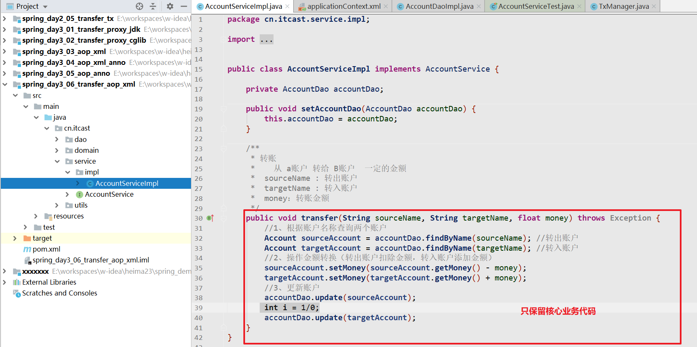

* 基于注解的形式配置IOC
  * 创建对象的注解：@Component，@Controller，@Service，@Repository
  * 依赖注入的注解：@Autowired，@Value
  * 生命周期的注解：@Scope
  * 纯注解编程：@Configuration，@Bean
* 整合junit单元测试
* 事务管理（ThreadLocal）

# 1 动态代理优化转账

动态代理：在不改变源代码的前提下，对功能进行增强（对指定类中方法进行业务增强）

* java代码中只需要重点关注业务逻辑即可
* 增强部分内容，通过动态代理添加

动态代理在目前两种实现方式

* jdk动态代理 
* cglib动态代理

## 1.1. jdk动态代理

* jdk动态代理：基于接口的动态代理（生成的代理对象和被代理对象实现了同一个接口）
* 

### 1.1.1.   复制工程

目标对象（被代理对象）       +   代理逻辑(增强)  =   代理对象

AccountServiceImpl   +   TxManager     =   具有事务控制的转账功能


### 1.1.2.   制作被代理对象


### 1.1.3.   制作增强功能

略（之前写好的TxManager）

### 1.1.4.   产生代理对象(JDK)

```java
@RunWith(SpringJUnit4ClassRunner.class)
@ContextConfiguration("classpath:applicationContext.xml")
public class AccountServiceTest {

    @Autowired
    private AccountService accountService;

    @Autowired
    private TxManager txManager;

    @Test
    public void testTransfer() {
        // 产生目标对象(注入)

        // 编写代理逻辑
        InvocationHandler invocationHandler = new InvocationHandler() {
            public Object invoke(Object proxy, Method method, Object[] args) throws Throwable {
                Object obj = null;
                try {
                    //开启事务
                    txManager.begin();

                    //调用目标对象的方法
                    obj = method.invoke(accountService, args);

                    //提交事务
                    txManager.commit();
                } catch (Exception e) {
                    e.printStackTrace();
                    //回滚事务
                    txManager.rollback();
                } finally {
                    txManager.close();
                }

                return obj;
            }
        };

        // 创建代理对象
        AccountService instance = (AccountService) Proxy.newProxyInstance(
                accountService.getClass().getClassLoader(),
                accountService.getClass().getInterfaces(),
                invocationHandler
        );

        //让代理对象去工作
        instance.transfer("B01", "B02", 10f);
    }
}
```

## 1.2. cglib动态代理(了解)

cglib: 基于子类的动态代理


### 1.2.1.   复制工程


### 1.2.2.   去掉接口相关所有代码(略)

只需要删除AccountService接口即可（注意修改实现类）

### 1.2.3.   使用cglib的方式创建代理对象

```java
@RunWith(SpringJUnit4ClassRunner.class)
@ContextConfiguration("classpath:applicationContext.xml")
public class AccountServiceTest {

    @Autowired
    private AccountServiceImpl accountService;

    @Autowired
    private TxManager txManager;

    @Test
    public void testTransfer() {
        // 产生目标对象(注入)

        // 编写代理逻辑
        InvocationHandler invocationHandler = new InvocationHandler() {
            public Object invoke(Object proxy, Method method, Object[] args) throws Throwable {
                Object obj = null;
                try {
                    //开启事务
                    txManager.begin();

                    //调用目标对象的方法
                    obj = method.invoke(accountService, args);

                    //提交事务
                    txManager.commit();
                } catch (Exception e) {
                    e.printStackTrace();
                    //回滚事务
                    txManager.rollback();
                } finally {
                    txManager.close();
                }

                return obj;
            }
        };

        // 使用cglib的方式创建代理对象
        // 1 创建增强器
        Enhancer enhancer = new Enhancer();

        // 2 设置父类
        enhancer.setSuperclass(AccountServiceImpl.class);

        // 3  设置代理逻辑
        enhancer.setCallback(invocationHandler);

        // 4 产生代理对象
        AccountServiceImpl instance = (AccountServiceImpl) enhancer.create();

        //5 让代理对象去工作
        instance.transfer("B01", "B02", 10f);
    }
}
```

## 1.3. jdk和cglib两种代理方式的选择(面试)

首先明确在创建代理实现类时, jdk的速度要高于cglib,所以选择的时候:

当被代理类有接口的时候,使用jdk动态代理, 因为它的效率高

当被代理类没有接口的时候,使用cglib动态代理, 因为没办法

## 1.4. 总结

当核心业务（转账）和增强业务（事务）同时出现时，我们可以在开发时对他们分别开发，运行时再组装在一起（使用动态代理的方式）。这样做的好处是：
        1. 逻辑清晰，开发核心业务的时候，不必关注增强业务的代码
                2. 代码复用性高：增强代码不用重复书写
                    这就是一种 AOP 的思想。

我的总结:

**开发阶段分离开发,** **运行阶段组装运行**

# 2 AOP介绍(面试)

## 2.1. 概念

AOP( 面向切面编程 )是一种思想, 它的目的就是在不修改源代码的基础上,对原有功能进行增强.

Spring AOP是对AOP思想的一种实现,Spring底层同时支持jdk和cglib动态代理.

Spring会根据被代理的类是否有接口自动选择代理方式:

如果有接口,就采用jdk动态代理(当然,也可以强制使用cglib)

没有接口就采用cglib的方式

## 2.2. 术语(难点)

### 2.2.1.   目标对象

target ：被代理对象

### 2.2.2.   连接点

jointPoint：被代理对象中的所有方法

### 2.2.3.   切入点

pointCut:  被增强的方法

### 2.2.4.   增强(通知)

advice：一个具体的增强功能

通知分为5种类型：

前置通知，后置通知，异常通知，最终通知，环绕通知

### 2.2.5.   代理对象

proxy ：生成的动态代理对象

### 2.2.6.   切面

aspect

切面是一种描述,描述了一件事: 一个什么样的功能添加到了哪个切入点的什么位置上

切面 = 切点 + 增强

# 3 SpringAOP的入门案例(重点)

**重点练习：环绕通知**

案例：在AccountDaoImpl类中的方法上打印日志

## 3.1. 思路分析

目标对象（target）----AccountDaoImpl类

被增强方法（pointcut） --- AccountDaoImpl类中的方法

增强功能（advice）----打印日志

切面配置（aspect）----切点 + 增强  日志在目标对象中的哪个方法的哪个位置上执行

## 3.2. 代码开发

### 3.2.1.   创建工程,引入坐标

```xml
    <dependencies>
        <!--spring aop-->
        <dependency>
            <groupId>org.springframework</groupId>
            <artifactId>spring-context</artifactId>
            <version>5.1.6.RELEASE</version>
        </dependency>

        <!--切点表达式的解析坐标-->
        <dependency>
            <groupId>org.aspectj</groupId>
            <artifactId>aspectjweaver</artifactId>
            <version>1.8.7</version>
        </dependency>

        <!--test-->
        <dependency>
            <groupId>junit</groupId>
            <artifactId>junit</artifactId>
            <version>4.12</version>
        </dependency>
    </dependencies>
```

### 3.2.2.   创建AccountDao的接口和实现类


### 3.2.3.   开发增强功能

在SpringAOP中，需要增强的功能需要配置到类中方法上

```java
package cn.itcast.utils;

/**
 * 切面类：此类中具有所有的增强代码逻辑
 */
public class Logger {

    /**
     * 前置通知：执行被代理对象方法之前执行
     * 方法：无参数，无返回值
     */
    public void before() {
        System.out.println("执行前置通知");
    }

    /**
     * 后置后置：正常执行被代理对象方法获取返回值之后执行
     */
    public void afterReturning() {
        System.out.println("执行后置通知");
    }

    /**
     * 异常通知：执行代码抛出异常的时候执行
     */
    public void afterThrowing() {
        System.out.println("执行异常通知");
    }


    /**
     * 最终通知：finally代码块中执行的逻辑
     */
    public void after() {
        System.out.println("执行最终通知");
    }
}
```

### 3.2.4.   基于XML配置切面

* 切面类需要交给Spring容器管理
* 通过`<aop:config>` 开启AOP配置
  * 配置切入点（被增强的类和方法）
  * 配置切面
    * 配置通知类型

```xml
<?xml version="1.0" encoding="UTF-8"?>
<beans xmlns="http://www.springframework.org/schema/beans"
       xmlns:xsi="http://www.w3.org/2001/XMLSchema-instance"
       xmlns:context="http://www.springframework.org/schema/context"
       xmlns:aop="http://www.springframework.org/schema/aop"
       xsi:schemaLocation="http://www.springframework.org/schema/beans
             http://www.springframework.org/schema/beans/spring-beans.xsd
             http://www.springframework.org/schema/context
             http://www.springframework.org/schema/context/spring-context.xsd
             http://www.springframework.org/schema/aop
             http://www.springframework.org/schema/aop/spring-aop.xsd">

    <bean id="accountDao" class="cn.itcast.dao.impl.AccountDaoImpl"></bean>


    <!--切面类需要交给容器管理-->
    <bean id="logger" class="cn.itcast.utils.Logger"></bean>

    <!--
        配置AOP
            1、导入aop的名称空间（约束）
            2、切面类需要交给容器管理
    -->

    <!--声明AOP配置-->
    <aop:config>
        <!--
            配置切入点（被增强的方法）
                    id:唯一标志
                    expression：切入点表达式
        -->
        <aop:pointcut id="pt" expression="execution(public void cn.itcast.dao.impl.AccountDaoImpl.save())"/>

        <!--配置切面-->
        <aop:aspect ref="logger">
            <!--配置通知类型
                method ： 切面类中的增强方法名
                pointcut-ref：切入点的ID
            -->
            <aop:before method="before" pointcut-ref="pt"></aop:before>
        </aop:aspect>
    </aop:config>
</beans>
```

### 3.2.5.   测试

略

# 4 SpringAOP配置详解

## 4.1. 切入点表达式

切点表达式的作用: 定义一组规则,用于在连接点（所有方法）中挑选切入点（被增强方法）

```xml
<!--
    配置切入点（被增强的方法）
            id:唯一标志
            expression：切入点表达式
   切入点表达式 :  execution(方法的修饰符 返回值类型 包名.类名.方法名(参数))
         支持通配符
            * ：一个或多个任意字符
            ..：配置到参数上，标识任意参数
         1、方法修饰符可以省略
         2、方法返回值可以通过 * ，标识任务返回值类型
         3、可以通过 * 标识任意包
         4、类名可以通过* 标识任意类
         5、方法名可以通过* 标识任意方法
         6、参数可以通过 .. 标识任意参数
-->
<aop:pointcut id="pt" expression="execution(* cn.itcast.dao.impl.*.*(..))"/>
```

## 4.2. 四大通知

四大通知描述的就是增强方法在切点方法的什么位置上执行

前置通知(before) : 在切点运行之前执行

后置通知(after-returning): 在切点正常运行结束之后执行

异常通知(after-throwing): 在切点发生异常的时候执行

最终通知(after): 在切点的最终执行

```markdown
try {
	前置通知(before) : 在切点运行之前执行
   
    //切点执行 ，被代理对象方法调用
       
	后置通知(after-returning): 在切点正常运行结束之后执行
}catch (Exception e){
    
    异常通知(after-throwing): 在切点发生异常的时候执行
}finally {
    最终通知(after): 在切点的最终执行
    
    
}
```

### 4.2.1.   方法

```java
/**
 * 后置后置：正常执行被代理对象方法获取返回值之后执行
 */
public void afterReturning() {
    System.out.println("执行后置通知");
}

/**
 * 异常通知：执行代码抛出异常的时候执行
 */
public void afterThrowing() {
    System.out.println("执行异常通知");
}


/**
 * 最终通知：finally代码块中执行的逻辑
 */
public void after() {
    System.out.println("执行最终通知");
}
```

### 4.2.2.   配置


* 由于多个通知类的配置顺序不同，导致不一样样的执行效果！！！

## 4.3. <font color='red'>环绕通知</font>

它是一种特殊的通知,他允许你以编码的形式实现四大通知（和手动定义动态代理类似）

### 4.3.1.   方法


### 4.3.2.   配置


## 4.4 AOP工作原理

开发阶段分别开发  运行阶段组装运行

### 4.4.1 开发阶段

开发共性功能，制作成增强

开发非共性功能，制作成切点

在配置文件中，声明切点与增强间的关系，即切面

### 4.4.2 容器启动阶段

Spring读取配置文件中的切面信息，根据切面中的描述, 

将 增强功能 增加在 目标对象 的 切点方法 上，动态创建代理对象

最后将经过代理之后对象放入容器中 (存入容器的是动态代理对象！！！！！！！)

#  5 SpringAOP注解版

AOP注解版 

* 基于XML 结合 注解的配置方式 （重点）
* 基于纯注解的配置方式（了解）

## 5.1 基于XML结合注解的配置（重点）

* IOC的注解：包扫描
* AOP的注解：开启aop注解支持
* 开启对注解的支持

### 5.1.1 环境准备

从之前的XML案例中COPY一份作为新案例

### 5.1.2 XML配置文件

* 开启注解支持
  * IOC的包扫描
  * AOP的自动代理
  * 自定义的对象，通过IOC注解进行对象创建和依赖注入
  * 第三方的对象，通过XML配置对象创建和依赖注入

```xml
<?xml version="1.0" encoding="UTF-8"?>
<beans xmlns="http://www.springframework.org/schema/beans"
       xmlns:xsi="http://www.w3.org/2001/XMLSchema-instance"
       xmlns:context="http://www.springframework.org/schema/context"
       xmlns:aop="http://www.springframework.org/schema/aop"
       xsi:schemaLocation="http://www.springframework.org/schema/beans
			    http://www.springframework.org/schema/beans/spring-beans.xsd
			    http://www.springframework.org/schema/context
			    http://www.springframework.org/schema/context/spring-context.xsd
			    http://www.springframework.org/schema/aop
			    http://www.springframework.org/schema/aop/spring-aop.xsd">

    <!--开启包扫描-->
    <context:component-scan base-package="cn.itcast"></context:component-scan>

    <!--开启对AOP注解的支持-->
    <aop:aspectj-autoproxy></aop:aspectj-autoproxy>


    <!--在切面类中通过注解完成AOP配置-->
</beans>
```

### 5.1.3  修改dao

通过注解创建对象，交给容器管理


### 5.1.4 修改Logger切面类

* 交给Spring容器管理
* 在类上声明切面类 ： @Aspect
* 在类中的通知方法上：通过@Before，@After，@AfterReturning，@AfterThrowing,@Around配置通知类型


```java
**
 * 切面类：此类中具有所有的增强代码逻辑
 *  1、声明切面类
 *      @Aspect
 *  2、在方法上通过注解配置通知类型
 *       @Before：前置通知
 *       @AfterReturning : 后置通知
 *       @AfterThrowing ：异常通知
 *       @After ：最终通知
 *        @Around：环绕通知
 *         value：属性接受切入点表达式
 */
@Component
@Aspect
public class Logger {

    /**
     * 前置通知：执行被代理对象方法之前执行
     * 方法：无参数，无返回值
     */
    //@Before(value="execution( * cn.itcast.dao.impl.*.*(..) )")
    public void before() {
        System.out.println("执行前置通知");
    }

    /**
     * 后置通知：正常执行被代理对象方法获取返回值之后执行
     */
    //@AfterReturning(value="execution( * cn.itcast.dao.impl.*.*(..) )")
    public void afterReturning() {
        System.out.println("执行后置通知");
    }

    /**
     * 异常通知：执行代码抛出异常的时候执行
     */
   // @AfterThrowing("execution( * cn.itcast.dao.impl.*.*(..) )")
    public void afterThrowing() {
        System.out.println("执行异常通知");
    }


    /**
     * 最终通知：finally代码块中执行的逻辑
     */
    //@After("execution( * cn.itcast.dao.impl.*.*(..) )")
    public void after() {
        System.out.println("执行最终通知");
    }

    /**
     * 环绕通知：
     *  特殊的增强机制，在一个方法中定义多个增强逻辑
     *  和手动编写动态代理的思路一致
     *     1、执行被代理对象方法
     *     2、增强
     * 方法：
     *    1、参数 （被代理对象的方法）
     *          ProceedingJoinPoint
     *    2、返回值 （被增强方法的返回值）
     */
    @Around("execution( * cn.itcast.dao.impl.*.*(..) )")
    public Object around(ProceedingJoinPoint pjp) throws Throwable {
        Object obj = null;

        try {
            System.out.println("1执行前置通知");
            //执行被代理对象方法
            obj = pjp.proceed();
            System.out.println("2执行后置通知");
        }catch (Exception e){
            System.out.println("3执行异常通知");
        }finally {
            System.out.println("4执行最终通知");
        }
        return obj;
    }
}
```


### 5.1.5 四大通知类型的问题

通过注解配置四大通知类型，存在小BUG。执行顺序和XML配置不一致。在正常企业开发中不用。

### 5.1.6 环绕通知（重点）

    @Around("execution( * cn.itcast.dao.impl.*.*(..) )")
    public Object around(ProceedingJoinPoint pjp) throws Throwable {
        Object obj = null;
    
        try {
            System.out.println("1执行前置通知");
            //执行被代理对象方法
            obj = pjp.proceed();
            System.out.println("2执行后置通知");
        }catch (Exception e){
            System.out.println("3执行异常通知");
        }finally {
            System.out.println("4执行最终通知");
        }
        return obj;
    }
## 5.2 基于纯注解的配置（了解）

### 5.2.1 环境准备


### 5.2.2 编写配置类

* 删除`applicationContext.xml`配置文件
* 编写配置类：SpringConfig.java
* 在配置类中替换xml中的配置内容
* 由于工程拷贝，所以基础的配置（对象创建，AOP的切面配置）等都已经配置好了


# 6 SpringAOP实现事务管理(作业)

SpringAOP实现事务管理 : 基于AOP完成转账案例，通过AOP配置事务增强

## 6.1 基于XML的AOP事务配置

### 6.1.1 四个通知类型配置

#### 工程准备，导入依赖

```xml
    <dependencies>
        <!--mysql-->
        <dependency>
            <groupId>mysql</groupId>
            <artifactId>mysql-connector-java</artifactId>
            <version>5.1.6</version>
        </dependency>
        <!--druid-->
        <dependency>
            <groupId>com.alibaba</groupId>
            <artifactId>druid</artifactId>
            <version>1.1.15</version>
        </dependency>
        <!--dbutils-->
        <dependency>
            <groupId>commons-dbutils</groupId>
            <artifactId>commons-dbutils</artifactId>
            <version>1.7</version>
        </dependency>
        <!--junit-->
        <dependency>
            <groupId>junit</groupId>
            <artifactId>junit</artifactId>
            <version>4.12</version>
        </dependency>
        <!--spring ioc依赖-->
        <dependency>
            <groupId>org.springframework</groupId>
            <artifactId>spring-context</artifactId>
            <version>5.1.6.RELEASE</version>
        </dependency>

        <!--spring-junit 整合单元测试-->
        <dependency>
            <groupId>org.springframework</groupId>
            <artifactId>spring-test</artifactId>
            <version>5.1.6.RELEASE</version>
        </dependency>

        <!--切点表达式的解析坐标-->
        <dependency>
            <groupId>org.aspectj</groupId>
            <artifactId>aspectjweaver</artifactId>
            <version>1.8.7</version>
        </dependency>
    </dependencies>
```

#### 修改AccoutServiceImpl



**只保留业务逻辑即可，将通知的内容。编写到对应的切面类中！！！**

#### 修改AccoutDaoImpl


#### 配置切面类

TxManager 就是事务增强的切面类

* begin：开启事务（前置通知）
* commit：提交事务（后置通知）
* rollback：回滚事务（异常通知）
* close：释放资源（最终通知）

```java
package cn.itcast.utils;

import org.aspectj.lang.ProceedingJoinPoint;
import org.springframework.beans.factory.annotation.Autowired;
import org.springframework.stereotype.Component;

import javax.sql.DataSource;
import java.sql.Connection;
import java.sql.SQLException;

/**
 * 通过ThreadLocal完成数据库连接从存取
 */

public class TxManager {


    private DataSource dataSource;

    public void setDataSource(DataSource dataSource) {
        this.dataSource = dataSource;
    }

    private ThreadLocal<Connection> threadLocal = new ThreadLocal<>();

    /**
     * 获取连接：从当前线程中（threadLocal）获取连接
     *     1、第一次访问此访问
     */
    public Connection getConnection() {
        //1、从threadLocal中获取连接
        Connection connection = threadLocal.get();
        //2、没有连接数据，从datasource中获取一个新的连接
        if(connection == null) {
            try {
                connection = dataSource.getConnection();
            } catch (SQLException e) {
                e.printStackTrace();
            }
            //存入threadLocal
            threadLocal.set(connection);
        }
        //3、有连接，直接返回
        return connection;
    }


    //开启事务：前置通知
    public void begin() throws SQLException {
        getConnection().setAutoCommit(false);
    }

    //提交事务：后置通知
    public void commit() throws SQLException {
        getConnection().commit();
    }

    //回滚事务：异常通知
    public void rollback()  throws SQLException {
        getConnection().rollback();
    }


    //释放资源：最终通知
    public void close()  throws SQLException {
        getConnection().close();
    }
}

```

#### 配置AOP

* 基于xml的配置方式
* IOC配置 ： 对象的创建和依赖注入
* AOP配置
  * 切面类交给容器管理
  * 通过`<aop:config>`开启配置

```xml
<?xml version="1.0" encoding="UTF-8"?>
<beans xmlns="http://www.springframework.org/schema/beans"
       xmlns:p="http://www.springframework.org/schema/p"
       xmlns:xsi="http://www.w3.org/2001/XMLSchema-instance"
       xmlns:context="http://www.springframework.org/schema/context"
       xmlns:aop="http://www.springframework.org/schema/aop"
       xsi:schemaLocation="http://www.springframework.org/schema/beans
			    http://www.springframework.org/schema/beans/spring-beans.xsd
			    http://www.springframework.org/schema/context
			    http://www.springframework.org/schema/context/spring-context.xsd http://www.springframework.org/schema/aop http://www.springframework.org/schema/aop/spring-aop.xsd">

    <!--对象创建IOC-->
    <bean id="accountService" class="cn.itcast.service.impl.AccountServiceImpl">
        <property name="accountDao" ref="accountDao"></property>
    </bean>

    <bean id="accountDao" class="cn.itcast.dao.impl.AccountDaoImpl">
        <property name="queryRunner" ref="queryRunner"></property>
        <property name="txManager" ref="txManager"></property>
    </bean>

    <bean id="txManager" class="cn.itcast.utils.TxManager">
        <property name="dataSource" ref="dataSource"></property>
    </bean>


    <bean id="queryRunner" class="org.apache.commons.dbutils.QueryRunner">
        <constructor-arg name="ds" ref="dataSource"></constructor-arg>
    </bean>

    <bean id="dataSource" class="com.alibaba.druid.pool.DruidDataSource">
        <property name="username" value="root"></property>
        <property name="password" value="root"></property>
        <property name="driverClassName" value="com.mysql.jdbc.Driver"></property>
        <property name="url" value="jdbc:mysql:///heima23"></property>
    </bean>


    <!--AOP配置-->
    <aop:config>
        <!--切入点表达式 : 查找需要增强的方法-->
        <aop:pointcut id="pt" expression="execution(* cn.itcast.service.impl.*.*(..))"/>
        <!--配置切面-->
        <aop:aspect ref="txManager">
            <!--前置通知-->
            <aop:before method="begin" pointcut-ref="pt"></aop:before>
            <!--后置通知-->
            <aop:after-returning method="commit" pointcut-ref="pt"></aop:after-returning>
            <!--异常通知-->
            <aop:after-throwing method="rollback" pointcut-ref="pt"></aop:after-throwing>
            <!--最终通知-->
            <aop:after method="close" pointcut-ref="pt"></aop:after>
        </aop:aspect>
    </aop:config>
</beans>
```

### 6.1.2 借助环绕通知配置（重点）

#### 切面类添加环绕通知方法


#### XML中配置环绕通知


## 6.2 基于XML结合注解的AOP事务配置

### 6.2.1 搭建环境

**复制工程**


#### Dao层代码


#### Service层代码


### 6.2.2 配置

* 开启对注解的支持（ioc包扫描，aop的自动代理）
* 通过IOC注解创建对象和依赖注入
  * 注解：替换自动的对象创建
  * XML：第三方jar包对象
* 通过AOP注解完成切面配置
  * 声明切面类
  * 通过AOP注解配置通知类型

#### XML配置文件

```xml
<?xml version="1.0" encoding="UTF-8"?>
<beans xmlns="http://www.springframework.org/schema/beans"
       xmlns:xsi="http://www.w3.org/2001/XMLSchema-instance"
       xmlns:context="http://www.springframework.org/schema/context"
       xmlns:aop="http://www.springframework.org/schema/aop"
       xsi:schemaLocation="http://www.springframework.org/schema/beans
             http://www.springframework.org/schema/beans/spring-beans.xsd
             http://www.springframework.org/schema/context
             http://www.springframework.org/schema/context/spring-context.xsd
             http://www.springframework.org/schema/aop
             http://www.springframework.org/schema/aop/spring-aop.xsd">

    <!--开启包扫描-->
    <context:component-scan base-package="cn.itcast"></context:component-scan>

    <!--开启对AOP注解的支持 : 开启自动代理-->
    <aop:aspectj-autoproxy></aop:aspectj-autoproxy>


    <!--第三方jar对象交给容器管理-->
    <bean id="queryRunner" class="org.apache.commons.dbutils.QueryRunner">
        <constructor-arg name="ds" ref="dataSource"></constructor-arg>
    </bean>

    <bean id="dataSource" class="com.alibaba.druid.pool.DruidDataSource">
        <property name="username" value="root"></property>
        <property name="password" value="root"></property>
        <property name="driverClassName" value="com.mysql.jdbc.Driver"></property>
        <property name="url" value="jdbc:mysql:///heima23"></property>
    </bean>


</beans>
```

#### 切面类配置

```java
@Component
@Aspect
public class TxManager {

    @Autowired
    private DataSource dataSource;

    private ThreadLocal<Connection> threadLocal = new ThreadLocal<>();

    /**
     * 获取连接：从当前线程中（threadLocal）获取连接
     *     1、第一次访问此访问
     */
    public Connection getConnection() {
        //1、从threadLocal中获取连接
        Connection connection = threadLocal.get();
        //2、没有连接数据，从datasource中获取一个新的连接
        if(connection == null) {
            try {
                connection = dataSource.getConnection();
            } catch (SQLException e) {
                e.printStackTrace();
            }
            //存入threadLocal
            threadLocal.set(connection);
        }
        //3、有连接，直接返回
        return connection;
    }


    //开启事务：前置通知
    public void begin() throws SQLException {
        getConnection().setAutoCommit(false);
    }

    //提交事务：后置通知
    public void commit() throws SQLException {
        getConnection().commit();
    }

    //回滚事务：异常通知
    public void rollback()  throws SQLException {
        getConnection().rollback();
    }


    //释放资源：最终通知
    public void close()  throws SQLException {
        getConnection().close();
    }

    /**
     * 环绕通知：特殊的通知机制。允许自定义执行顺序
     *
     */
    @Around("pt()")
    public Object aroud(ProceedingJoinPoint pjp) throws Throwable {

        Object obj = null;

        try {
            begin();
            //执行被代理对象的方法
            obj = pjp.proceed(); //转账
            commit();
        }catch (Exception e) {
            e.printStackTrace();
            rollback();
        }finally {
            close();
        }
        return obj;
    }

    /**
     * @Pointcut ：
     *    抽取公共的切入点表达式：在注解配置时使用
     *    1、需要配置到一个空的方法上
     *    2、在@Pointcut上配置公共的切入点表达式
     *    3、其他的地方引入的时候语法 ： 方法名()
     */
    @Pointcut(value="execution(* cn.itcast.service.impl.*.*(..))")
    public void pt() {}

}

```


# 7 JdbcTemplate（会用）

## 7.1. JdbcTemplate介绍

JdbcTemplate是Spring提供的持久层技术，用于操作数据库，它底层封装了JDBC技术。

JdbcTemplate使用方式和DbUtils基本类似

**核心类：**

* JdbcTemplate  用于执行增删改查的SQL语句 (QueryRunner)

  * 创建过程和QueryRunner一模一样，构造方法传入DataSource
  * 调用JdbcTemplate  中的方法完成数据库操作

  RowMapper  这是一个接口，主要作用是将数据库返回的记录封装进实体对象(BeanHandler)
  
  * BeanPropertyRowMapper  == BeanHandler (BeanListHandler)

**核心方法：**

​     update()  用来执行增、删、改语句，和QueryRunner一模一样

​     query()  用来执行查询语句，查询数据列表

​	 queryForObject，查询单一对象

```java
  //创建一个JdbcTemplate对象，用来执行增删改查, 需要给一个数据源   
JdbcTemplate  jdbcTemplate = new JdbcTemplate(dataSource);  
//update方法，用于执行增删改语句  
//**第一个参数**:sql语句  **后面的参数**:sql语句中的所需要的的值   
jdbcTemplate.update("insert into account value(null,?,?)",1,2);  
//query或者queryForObject方法，用于执行查询语句 
//query 用于查询多条记录,返回一个集合  queryForObject用于查询一条记录,返回一个实体``
//**第一个参数**:sql语句  **第二个参数**:封装返回值  **后面的参数**:sql语句中的所需要的的值  
jdbcTemplate.query("select * from account", new BeanPropertyRowMapper<Account>(Account.class)); ` jdbcTemplate.queryForObject("select * from account where  aid = ?", new  BeanPropertyRowMapper<Account>(Account.class), 1);   
```

**方法介绍**

```java
public class JdbcTemplateTest {

    /**
     * 练习JdbcTemplate的基本使用
     */
    public static void main(String[] args) {
        //1、创建DataSource
        DruidDataSource dataSource = new DruidDataSource();
        dataSource.setUsername("root");
        dataSource.setPassword("root");
        dataSource.setDriverClassName("com.mysql.jdbc.Driver");
        dataSource.setUrl("jdbc:mysql:///heima31");
        //2、创建JdbcTemplate对象
        JdbcTemplate jdbcTemplate = new JdbcTemplate(dataSource);
        //3、调用方法完成数据库操作
        //3.1 保存，删除(update)
        //jdbcTemplate.update("insert into account (name,money) values (?,?)" ,"小王",100f);

        //3.2 查询数据列表(query)
        //BeanPropertyRowMapper : 结果集处理器 （查询列表和唯一的时候，都使用同一个）
//        List<Account> list = jdbcTemplate.query("select * from account", new BeanPropertyRowMapper<Account>(Account.class));
//        for (Account account : list) {
//            System.out.println(account);
//        }

        //3.3 根据id查询唯一的对象( queryForObject)
        Account account = jdbcTemplate.queryForObject("select * from account where id=?", new BeanPropertyRowMapper<Account>(Account.class), 1);
        System.out.println(account);
    }
}
```

## 7.2. JdbcTemplate案例（作业）

使用JdbcTemplate完成一个crud和转账的案例 , 使用xml结合注解的形式配置

### 7.2.1.   准备数据环境

和之前的数据库一模一样，账户操作

### 7.2.2.   创建工程,导入坐标

```xml
 <dependencies>
        <!--mysql-->
        <dependency>
            <groupId>mysql</groupId>
            <artifactId>mysql-connector-java</artifactId>
            <version>5.1.6</version>
        </dependency>
        <!--druid-->
        <dependency>
            <groupId>com.alibaba</groupId>
            <artifactId>druid</artifactId>
            <version>1.1.15</version>
        </dependency>
        <!--spring-jdbc-->
        <dependency>
            <groupId>org.springframework</groupId>
            <artifactId>spring-jdbc</artifactId>
            <version>5.1.6.RELEASE</version>
        </dependency>
        <!--spring-context-->
        <dependency>
            <groupId>org.springframework</groupId>
            <artifactId>spring-context</artifactId>
            <version>5.1.6.RELEASE</version>
        </dependency>
        <!--junit-->
        <dependency>
            <groupId>junit</groupId>
            <artifactId>junit</artifactId>
            <version>4.12</version>
        </dependency>
        <!--spring-test-->
        <dependency>
            <groupId>org.springframework</groupId>
            <artifactId>spring-test</artifactId>
            <version>5.1.6.RELEASE</version>
        </dependency>

        <!--添加切点表达式-->
        <dependency>
            <groupId>org.aspectj</groupId>
            <artifactId>aspectjweaver</artifactId>
            <version>1.8.7</version>
        </dependency>
    </dependencies>
```

### 7.2.3.   创建实体类

```java
public class Account {

    private Integer id;
    private String name;
    private Float money;

    public Integer getId() {
        return id;
    }

    public void setId(Integer id) {
        this.id = id;
    }

    public String getName() {
        return name;
    }

    public void setName(String name) {
        this.name = name;
    }

    public Float getMoney() {
        return money;
    }

    public void setMoney(Float money) {
        this.money = money;
    }

    @Override
    public String toString() {
        return "Account{" +
                "id=" + id +
                ", name='" + name + '\'' +
                ", money=" + money +
                '}';
    }
}
```

### 7.2.4.   创建dao接口

```java
public interface AccountDao {

    //根据账户名称查询账户
    Account findByName(String name);

    //更新账户
    void update(Account account);
}
```

### 7.2.5.   创建dao实现

```java
package cn.itcast.dao.impl;

import cn.itcast.dao.AccountDao;
import cn.itcast.domain.Account;
import org.springframework.beans.factory.annotation.Autowired;
import org.springframework.jdbc.core.BeanPropertyRowMapper;
import org.springframework.jdbc.core.JdbcTemplate;
import org.springframework.stereotype.Repository;

import java.sql.SQLException;

@Repository
public class AccountDaoImpl implements AccountDao {

    @Autowired
    private JdbcTemplate jdbcTemplate;


    //根据名称查询账户
    public Account findByName(String name) {
        return jdbcTemplate.queryForObject("select * from account where name=?",
                new BeanPropertyRowMapper<Account>(Account.class),name);
    }

    //根据id更新
    public void update(Account account) {
        jdbcTemplate.update("update account set money=? where id=?",account.getMoney(),account.getId());
    }
}
```

### 7.2.6.   创建service接口

```java
public interface AccountService {

    /**
     * 转账
     *    从 a账户 转给 B账户  一定的金额
     *  sourceName : 转出账户
     *  targetName : 转入账户
     *  money：转账金额
     */
    void transfer(String sourceName, String targetName, float money) throws Exception;
}
```

### 7.2.7.   创建service实现

```java
package cn.itcast.service.impl;

import cn.itcast.dao.AccountDao;
import cn.itcast.domain.Account;
import cn.itcast.service.AccountService;
import org.springframework.beans.factory.annotation.Autowired;
import org.springframework.stereotype.Service;

@Service
public class AccountServiceImpl implements AccountService {

    @Autowired
    private AccountDao accountDao;


    /**
     * 转账
     *    从 a账户 转给 B账户  一定的金额
     *  sourceName : 转出账户
     *  targetName : 转入账户
     *  money：转账金额
     */
    public void transfer(String sourceName, String targetName, float money) throws Exception {
        //1、根据账户名称查询两个账户
        Account sourceAccount = accountDao.findByName(sourceName); //转出账户
        Account targetAccount = accountDao.findByName(targetName); //转入账户
        //2、操作金额转换（转出账户扣除金额，转入账户添加金额）
        sourceAccount.setMoney(sourceAccount.getMoney() - money);
        targetAccount.setMoney(targetAccount.getMoney() + money);
        //3、更新账户
        accountDao.update(sourceAccount);
        accountDao.update(targetAccount);
    }
}
```

### 7.2.8.   加入Spring的配置文件

* 不涉及AOP，只有IOC
  * 开启IOC的包扫描
  * 自定义的java对象：注解
  * 第三方jar包的对象：xml

```xml
<?xml version="1.0" encoding="UTF-8"?>
<beans xmlns="http://www.springframework.org/schema/beans"
       xmlns:xsi="http://www.w3.org/2001/XMLSchema-instance"
       xmlns:context="http://www.springframework.org/schema/context"
       xmlns:aop="http://www.springframework.org/schema/aop"
       xsi:schemaLocation="http://www.springframework.org/schema/beans
             http://www.springframework.org/schema/beans/spring-beans.xsd
             http://www.springframework.org/schema/context
             http://www.springframework.org/schema/context/spring-context.xsd
             http://www.springframework.org/schema/aop
             http://www.springframework.org/schema/aop/spring-aop.xsd">

    <!--包扫描-->
    <context:component-scan base-package="cn.itcast"></context:component-scan>

    <!--自定义的java对象：注解-->

    <!--第三方jar包中的对象：xml-->
    <bean id="jdbcTemplate" class="org.springframework.jdbc.core.JdbcTemplate">
        <property name="dataSource" ref="dataSource"></property>
    </bean>

    <bean id="dataSource" class="com.alibaba.druid.pool.DruidDataSource">
        <property name="username" value="root"></property>
        <property name="password" value="root"></property>
        <property name="driverClassName" value="com.mysql.jdbc.Driver"></property>
        <property name="url" value="jdbc:mysql:///heima23"></property>
    </bean>
</beans>
```

### 7.2.9.   测试

```java
@RunWith(SpringJUnit4ClassRunner.class)
@ContextConfiguration(locations = "classpath:applicationContext.xml")
public class AccountServiceTest {

    @Autowired
    private AccountService accountService;

    @Test
    public void testTransfer() throws Exception {
        accountService.transfer("张三", "李四", 1f);
    }
}
```

 