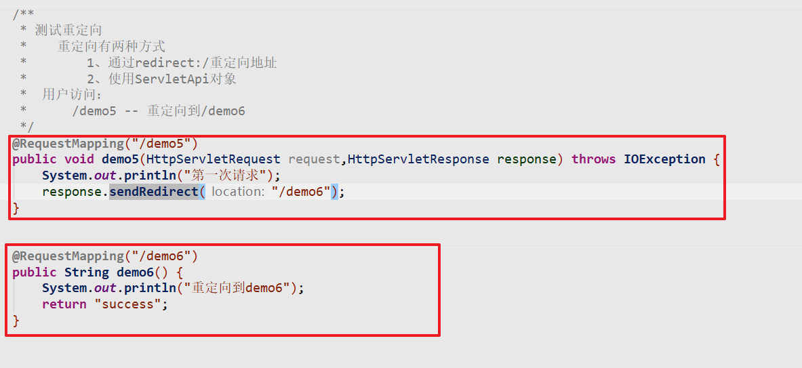

回顾：

* spring中的声明式事务
* SpringMVC的入门
  * 开发步骤（springmvc配置，web.xml配置，控制器Controller）
  * 内置的四大组件（核心控制器，处理器映射器，处理器适配器，视图解析器）
  * Springmvc的工作流程
  * @RequestMapping
* SpringMVC中的参数封装

# 1 处理请求参数

## 1.1 文件上传（重点）

文件上传的三要素

* form表单的method = post
* form表单的enctype=“multipart/form-data”
* from表单中的input的type = file

springmvc中服务端

* 需要在springmvc的配置文件中，添加文件解析器（自动的将上传的内容，转化为MultipartFile对象）
* 在控制器方法上，直接使用MultipartFile对象标识上传的文件

### 1.1.1.   页面


### 1.1.2.   加入文件上传的包

```xml
<dependency>
  <groupId>commons-fileupload</groupId>
  <artifactId>commons-fileupload</artifactId>
  <version>1.4</version>
</dependency>
```
### 1.1.3.   配置文件上传解析器

```xml
<!--
    文件解析器
        id:固定值(multipartResolver)
        其中指定上传文件的大小规则
-->
<bean id="multipartResolver" class="org.springframework.web.multipart.commons.CommonsMultipartResolver">
    <!--文件的大小规则  5M = 1024 * 1024 * 5 -->
    <property name="maxUploadSize" value="5242880"></property>
</bean>
```
### 1.1.4.   后台

通过SpringMVC提供 MultipartFile对象，表示上传的文件


## 1.2 @RequestParam

@RequestParam标注在方法参数之前，用于对传入的参数做一些限制, 支持三个属性:
     value：默认属性，用于指定前端传入的参数名称
     required：用于指定此参数是否必传
     **defaultValue**：当参数为非必传参数且前端没有传入参数时，指定一个默认值


## 1.3 接受请求头（了解）

```java
  /**
     * 在控制器中获取，当前请求的请求头
     *      1、@RequestHeader配置到方法参数上 ： 前端控制器自动获取头信息
     *          @RequestHeader Map map ： 获取所有的请求头
     *          @RequestHeader("cookie") String cookie : 根据key从所有头信息中获取指定头信息
     *      2、@CookieValue("key"):
     *          从cookie中根据key获取指定value数据
     *
     */
    @RequestMapping(value="/demo12")
    public String demo12(@RequestHeader Map map,
                         @RequestHeader("cookie") String cookie,
                         @CookieValue("JSESSIONID") String sessionId) {
        System.out.println(map);
        System.out.println(cookie);
        System.out.println(sessionId);
        return "success";
    }
```


# 2 页面跳转之转发(重点)

请求转发：只发送一起请求，不会丢失数据（SpringMVC的默认页面跳转形式）

## 2.1 获取Servlet原生API

Servlet原生API对象：HttpServletRequest，HttpSevletResponse，HttpSession

语法规则：

**1、将对象已方法参数的形式配置到controller方法中**

**2、将需要的API对象通过@Autowired的方式注入进来**

### 2.1.1 环境准备

### 2.1.2 练习获取Servlet对象

**方式一：通过参数获取**


**方式二：注入API对象**


## 2.2. 方式一:简单方式(推荐***)

之前练习的内容


简单方式：直接返回逻辑视图，背后通过视图解析器，添加前后缀组成物理视图渲染并跳转

物理视图：页面的完成路径

## 2.3. 方式二:使用forward转发(推荐**)

### 2.3.1.   页面

```html
<a href="${pageContext.request.contextPath}/demo3">请求转发</a>
```

### 2.3.2.   后台

语法规则（返回值）： forward: 物理视图


## 2.4. 方式三:使用servlet原生api(了解)

* 通过request，和response对象完成请求转发


## 2.5. 转发时携带数据（重点）

* 转发时携带数据：返回响应数据。

* 将数据绑定到request域中，在页面通过el表达式获取响应数据并展示

### 2.5.1 绑定Request域（推荐）

**（1） 后台**


**（2） 页面处理**

```html
<a href="${pageContext.request.contextPath}/demo4">测试响应数据</a>
```

### 2.5.2 绑定到Model对象（了解）

Model：SpringMVC中的Model配置到参数上，底层通过Request实现。可以用于替换request完成数据响应


### 2.5.3 通过ModelAndView返回（官方）

ModelAndView : 模型视图对象，通过此对象可以指定返回的视图地址和数据绑定

**语法规则**

* 方法的返回值：ModelAndView
* 在方法中通过ModelAndView的setViewName指定跳转的页面
* 在方法中通过ModelAndView的addObject指定需要存入request域中的数据


# 3 页面跳转之重定向

重定向：发送两次请求（第一次用户行为，第二次是浏览器的自动行为）。响应数据会丢失


## 3.1. 方式一:使用redirect重定向(推荐)

### 3.1.1.   页面

```
<br>
<a href="${pageContext.request.contextPath}/demo5">测试重定向</a>
```

### 3.1.2.   后台


## 3.2. 方式二:使用servlet原生API(了解)



# 4 释放静态资源

当有静态资源需要加载时，比如jquery.js，通过谷歌开发者工具抓包发现，没有加载到jquery.js

之所以发生这种情况,是因为: 现在SpringMVC的前端控制器DispatcherServlet的url-pattern配置的是 /（缺省）,代表除了jsp请求不拦截, 其他的所有请求都会拦截，包括一些静态文件(js html css jpg等等), 而拦截住之后, 它又找不到对应的处理器方法来处理, 因此报错.

下面我们来学习几种释放静态资源的方式:（不交给SpringMVC处理）

## 4.1. 方式一

在Springmvc的配置文件中添加释放静态资源

```xml

    <!--
        释放静态资源的方式一
            mapping : 请求路径的URL的映射规则
            location: 静态资源的物理目录
            当静态资源请求到SpringMVC的前端控制器时，根据释放资源的配置
                1、不在查找具体的controller处理
                2、从location路径中查找匹配的资源
    -->
    <mvc:resources mapping="/js/*" location="/js/"></mvc:resources>
    <mvc:resources mapping="/image/*" location="/image/"></mvc:resources>
    <mvc:resources mapping="/css/*" location="/css/"></mvc:resources>
```

配置繁琐，所有的静态资源分门别类放置到不同的文件夹，一个一个进行配置

## 4.2. 方式二(推荐)

在Springmvc的配置文件中添加释放静态资源

```xml
    <!--
        统一释放所有的静态资源文件
            当SpringMVC处理静态资源时，委托给默认的Servlet处理
            默认Servlet：tomcat中的默认Servlet
    -->
    <mvc:default-servlet-handler></mvc:default-servlet-handler>
```

## 4.3. 方式三(掌握)

修改`web.xml`中前端控制器的URL映射规则，已特殊字符串结尾的请求会交给前端控制器处理。

* 需要进入SpringMVC的所有请求，都需要已.do结尾
* 控制器方法中@RequestMapping不需要做额外的配置，和之前一模一样


# 5 Ajax+json实现异步交互(专题)


在SpringMVC中进行ajax的数据交互，需要通过两个注解简化开发

* @RequestBody ： 自动的将请求的json字符串，转化为指定java对象（处理请求）
* @ResponseBody：自动的将java对象，转化为json字符串并相应（处理相应）

注意: Springmvc默认用MappingJackson2HttpMessageConverter对json数据进行转换，需要加入jackson的包

```xml
<dependency>
  <groupId>com.fasterxml.jackson.core</groupId>
  <artifactId>jackson-databind</artifactId>
  <version>2.9.8</version>
</dependency>
```

## 5.1 注解说明

**@RequestBody**用于接收前端传递的请求体中的json数据, 并可以自动转换封装进指定的对象中

**@ResponseBody**用于将controller方法返回的对象通过转换器转换为指定的格式(通常为json)之后，写入到response对象的body区

## 5.2 练习Ajax请求

### 5.2.1.   页面

```html

<%@ page contentType="text/html;charset=UTF-8" language="java" %>
<html>
<head>
    <title>Title</title>
    <script src="/js/jquery-3.3.1.js"></script>
</head>
<body>
<br>
<hr>
<h4>测试SpringMVC中的ajax处理</h4>

<input type="button" value="测试SpringMVC中的ajax处理" onclick="sendAjsx()">

<script>
    function sendAjsx() {
        $.ajax({
            type: "POST",
            url: "${pageContext.request.contextPath}/testAjax",
            contentType: "application/json;charset=utf8",
            dataType: "json",
            data: '{"username":"张三","age":18}',
            success: function (data) {  //回调函数  data：服务端响应的数据
                console.log(data);
            }
        });
    }
</script>
</body>
</html>

```

### 5.1.2.   封装一个User类

```java
package cn.itcast.domain;

public class User {

    private String username;
    private Integer age;
    private String address;

    public String getUsername() {
        return username;
    }

    public void setUsername(String username) {
        this.username = username;
    }

    public Integer getAge() {
        return age;
    }

    public void setAge(Integer age) {
        this.age = age;
    }

    public String getAddress() {
        return address;
    }

    public void setAddress(String address) {
        this.address = address;
    }

    @Override
    public String toString() {
        return "User{" +
                "username='" + username + '\'' +
                ", age=" + age +
                ", address='" + address + '\'' +
                '}';
    }
}

```

### 5.1.3.   后台


# 6 Restful风格(专题)

Restful风格：SpringBoot课程基础

## 6.1. 什么是restful风格

REST是一种软件架构风格, 其强调HTTP请求的URL应当以资源为中心 ( 以后的URL中尽量不要出现动词 )

REST规范了HTTP请求动作（请求方式:post,put）,使用四个词语分别表示对资源的CRUD操作: 

GET(获取)、POST(新建)、PUT(更新)、DELETE(删除) 

**Restful ：**

* 针对同一个URL，根据不同的请求方式做不一样的业务处理
* 地址参数    /user/{id}
* 请求方式：GET(获取)，POST(新建)，PUT(更新)，DELETE(删除) 

|          | 原来                 | Restful          |
| -------- | -------------------- | ---------------- |
| 保存     | /saveUser            | POST   /user     |
| 修改     | /udpateUser          | PUT   /user/1    |
| 删除     | /deleteUser?uid=1    | DELETE   /user/1 |
| 查询所有 | /findUser            | GET   /user      |
| 查询一个 | /findUserByUid?uid=1 | GET   /user/1    |

## 6.2. 测试练习

### 6.2.1.   页面

```html
<h4>测试restFul风格的URL</h4>
    <form action="${pageContext.request.contextPath}/user" method="post">
        <input type="submit" value="模拟post请求">
    </form>

<a href="${pageContext.request.contextPath}/user">模拟get请求</a><br>
```

### 6.2.2.   后台

```java
/**
 * 测试restful风格URL
 *  1、同一个URL，根据不同的请求方式，做不一样的业务处理
 *  2、具有地址参数
 */
@Controller
@RequestMapping("/user")
public class UserController {


    /**
     * 根据id查询
     *  请求地址：/user/5
     *  请求方式：GET
     * 自定义地址参数 ： {自定义地址参数名称}
     * 获取地址参数：@PathVariable(value="地址参数名称")
     */
    @RequestMapping(value = "/{id}",method = RequestMethod.GET)
    public String findById(@PathVariable(value="id") String id) {
        System.out.println("根据id查询，id="+id);
        return "success";
    }

    /**
     * 根据id删除
     *  请求地址：/user/5
     *  请求方式：DELETE
     */
    @RequestMapping(value="/{id}",method = RequestMethod.DELETE)
    public String delete(@PathVariable(value="id") String id) {
        System.out.println("根据id删除，id="+id);
        return "success";
    }

    /**
     * 根据id更新
     *  请求地址：/user/5
     *  请求方式：PUT
     */
    @RequestMapping(value="/{id}",method = RequestMethod.PUT)
    public String update(@PathVariable(value="id") String id) {
        System.out.println("根据id更新，id="+id);
        return "success";
    }


    /**
     * 保存
     *  请求地址：/user
     *  请求方式：POST
     */
    @RequestMapping(value="/",method = RequestMethod.POST)
    public String save() {
        System.out.println("保存");
        return "success";
    }
}
```

# 7 异常处理机制(专题)

SpringMVC的统一异常处理

对于异常的处理一般有两种方式:

 一种是当前方法处理(try-catch)，这种处理方式会造成业务代码和异常处理代码的耦合。

一种是当前方法不处理, 出现异常后直接抛给调用者处理。

使用Spring框架后,我们的代码最终是由框架来调用的。也就是说,异常最终会抛到框架中, 然后由框架指定异常处理器来统一处理异常。

## 7.1. 方式一:自定义异常处理器

### 7.1.1.   自定义异常处理器

重点:自定义一个类实现HandlerExceptionResolver接口，将异常处理器交给spring容器管理即可


### 7.1.2.   异常页面编写


## 7.2. 方式二: 注解方式

可以通过@ControllerAdvice 和 @ExceptionHandler注解定义全局异常处理

使用方式：

* @ControllerAdvice：配置到java类
* 定义一个异常处理方法
  * 返回值String （视图）
  * 参数：Model
  * 方法上通过@ExceptionHandler配置（处理的异常类型）


作业：

* 完成文件上传
* 练习请求转发和数据响应
* 练习ajax请求
  * 释放静态资源
* 练习RestFul
* 通过两种方式完成异常处理


