# 1 Spring中的事务管理

Spring中的事务管理：根据SpringAOP拓展出来的事务控制功能

## 1.1. 事务管理方式

Spring支持两种事务管理方式: 编程式事务和<font color='red'>声明式事务</font>

编程式事务就是将业务代码和事务代码放在一起书写,它的耦合性太高,开发中不使用

声明式事务通过一段配置让程序组装运行,最后达到事务控制的目的.

声明式事务就是通过AOP原理实现的.

## 1.2. Spring事务管理相关的API

### 1.2.1.   PlatformTransactionManager

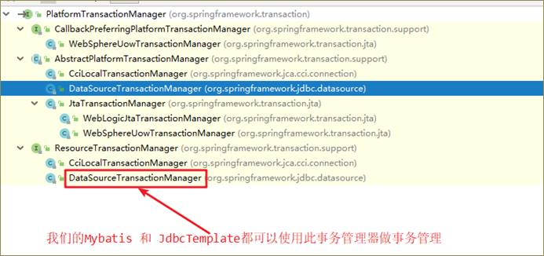

PlatformTransactionManager这是Spring进行事务管理的一个根接口,我们要使用它的实现类做事务管理器（增强的事务处理的功能）

我们需要知道的是:mybatis和jdbcTemplate都可以使用它的一个子类(DataSourceTransactionManager)做事务管理

* **DataSourceTransactionManager** ：对mybatis和jdbcTemplate操作做事务控制
* JpaTransactionManager：对JPA操作数据库进行数据库（jpa，hibernate）

### 1.2.2.   TransactionDefinition

TransactionDefinition这个API是用来做事务定义的

* 面向配置（事务隔离级别，传播行为，是否只读事务，超时时间）

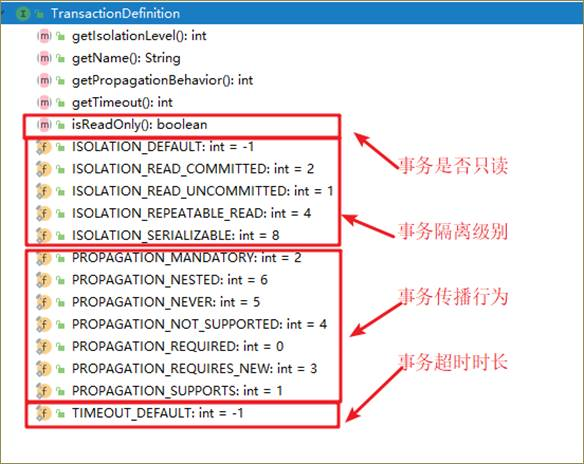

#### 1.2.2.1.  隔离级别(*)

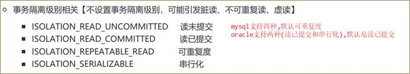

* Spring中配置事务，支持所有的4中隔离级别（不配置）
* 默认值：自动选择当前数据库合适的配置项

#### 1.2.2.2.  传播行为（理解）

事务传播行为指的就是当一个业务方法【被】另一个业务方法调用时，应该如何进行事务控制 

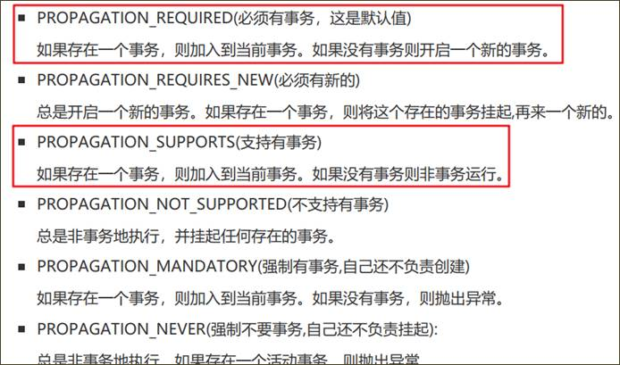

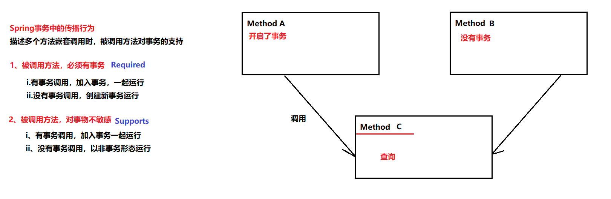

#### 1.2.2.3.  是否只读事务

只读事务(增 删 改不能使用,只能查询使用)： 只能用于查询

Read Only ： **true** | false

换句话说, 只读事务只能用于查询方法

#### 1.2.2.4.  超时时长

事务超时时间, 此属性需要底层数据库的支持

它的默认值是-1, 代表不限制

超时时间：使用默认值

#### 1.2.2.5 配置项总结

超时时长：默认值

隔离级别：使用默认值（底层数据库支持的隔离级别）

**增删改操作：**

​	Read Only（是否只读）：false

​    传播行为：required

**查询操作**

​	Read Only（是否只读）：true

​    传播行为：supports

# 2 声明式事务（重点）

## 2.1. 思路

目标对象 [业务类]    service

增强   [事务管理器]  DataSourceTransactionManager

事务配置： [事务隔离级别  事务传播行为  事务是否只读  事务超时时长]

## 2.2. xml版(重点)

基于XML的方式完成声明式事务配置：

* 配置事务管理器交给Spring容器管理（切面类）
* 配置事务通知
* 配置事务的AOP

```xml
<?xml version="1.0" encoding="UTF-8"?>
<beans xmlns="http://www.springframework.org/schema/beans"
       xmlns:xsi="http://www.w3.org/2001/XMLSchema-instance"
       xmlns:context="http://www.springframework.org/schema/context"
       xmlns:aop="http://www.springframework.org/schema/aop"
       xmlns:tx="http://www.springframework.org/schema/tx"
       xsi:schemaLocation="http://www.springframework.org/schema/beans
             http://www.springframework.org/schema/beans/spring-beans.xsd
             http://www.springframework.org/schema/context
             http://www.springframework.org/schema/context/spring-context.xsd
             http://www.springframework.org/schema/aop
             http://www.springframework.org/schema/aop/spring-aop.xsd
             http://www.springframework.org/schema/tx
             http://www.springframework.org/schema/tx/spring-tx.xsd">
    <!--包扫描-->
    <context:component-scan base-package="cn.itcast"></context:component-scan>

    <!--自定义的java对象：注解-->

    <!--第三方jar包中的对象：xml-->
    <bean id="jdbcTemplate" class="org.springframework.jdbc.core.JdbcTemplate">
        <property name="dataSource" ref="dataSource"></property>
    </bean>

    <bean id="dataSource" class="com.alibaba.druid.pool.DruidDataSource">
        <property name="username" value="root"></property>
        <property name="password" value="root"></property>
        <property name="driverClassName" value="com.mysql.jdbc.Driver"></property>
        <property name="url" value="jdbc:mysql:///heima23"></property>
    </bean>


    <!--配置Spring中的事务-->

    <!--1、事务管理器交给容器管理-->
    <bean id="transactionManager" class="org.springframework.jdbc.datasource.DataSourceTransactionManager">
        <property name="dataSource" ref="dataSource"></property>
    </bean>

    <!--
        2、配置事务通知
            * 配置service层中所有类中所有方法，对事务的要求（支持）
    -->
    <tx:advice id="txAdvice" transaction-manager="transactionManager">
        <tx:attributes>
            <!--
                指定方法对事务的要求
                    name: 方法名称
                        支持通配符 *
                    isolation：事务的隔离级别
                    timeout：超时时间
                    propagation：传播行为  （REQUIRED）
                    read-only:是否只读事务  （false）
            -->
            <tx:method name="save*" propagation="REQUIRED" read-only="false"></tx:method>
            <tx:method name="update*"></tx:method>
            <tx:method name="delete*"></tx:method>
            <tx:method name="find*" propagation="SUPPORTS" read-only="true"></tx:method>
            <tx:method name="*"></tx:method>
        </tx:attributes>
    </tx:advice>

    <!--3、配置事务的AOP-->
    <aop:config>
        <!--切入点-->
        <aop:pointcut id="pt" expression="execution(* cn.itcast.service.impl.*.*(..))"/>
        <!--配置事务通知-->
        <aop:advisor advice-ref="txAdvice" pointcut-ref="pt"></aop:advisor>
    </aop:config>

</beans>
```

## 2.3. 注解结合XML(重点)

注解：

* IOC注解：自定义对象通过注解创建对象和依赖注入
* 声明式事务注解：替换xml中的事务通知和事务AOP配置
  * <font color="red">在XML配置文件中，需要开启事务注解的支持 ： 事务注解驱动</font>
  * <font color="red">在XML配置文件中，创建事务管理器交给容器管理</font>
  * <font color="red">在需要事务的类或者方法上，使用@Transactional注解配置事务</font>

### 2.3.1.   复制工程

### 2.3.2.   删除xml中的tx:advice和aop:config

### 2.3.3.   添加一个事务注解驱动

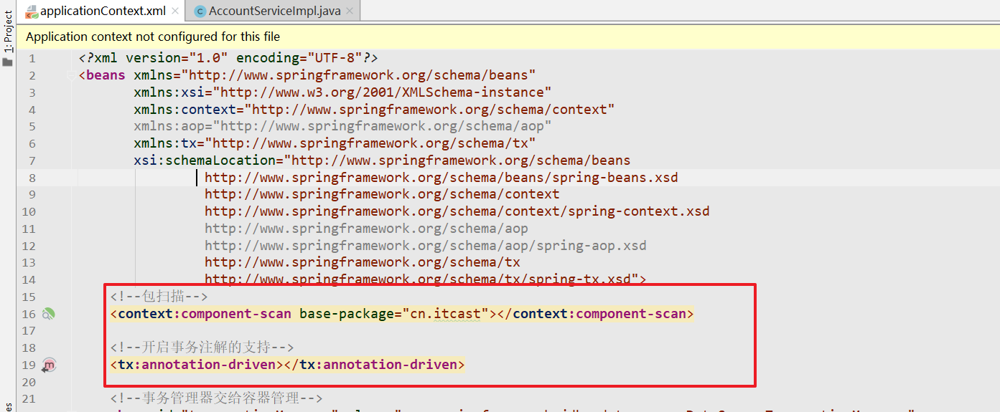

### 2.3.4.   在方法生添加声明式事务的注解

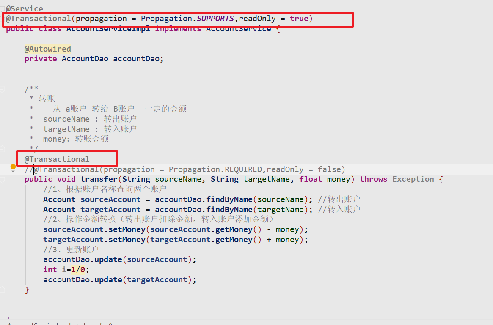

## 2.4. 纯注解版(了解)

* 通过配置类，替换原有的XML配置文件

* 包扫描

* 事务注解驱动

* 第三方的相关对象，创建并交给容器管理


 ```java
package cn.itcast.config;

import com.alibaba.druid.pool.DruidDataSource;
import org.springframework.context.annotation.Bean;
import org.springframework.context.annotation.ComponentScan;
import org.springframework.context.annotation.Configuration;
import org.springframework.jdbc.core.JdbcTemplate;
import org.springframework.jdbc.datasource.DataSourceTransactionManager;
import org.springframework.transaction.PlatformTransactionManager;
import org.springframework.transaction.annotation.EnableTransactionManagement;

import javax.sql.DataSource;

/**
 * 1、声明配置类
 *  @Configuration
 * 2、开启包扫描
 *  @ComponentScan(basePackages = "cn.itcast")
 * 3、开启注解事务支持
 *  @EnableTransactionManagement
 * 4、通过@Bean创建第三方jar包中的对象，交给容器
 *  a.配置到方法上，此方法需要返回值
 *  b.spring容器启动的时候，自动执行方法，获取返回值
 *  c.将返回值存入Spring容器中
 *  d.spring方法可以接受参数，spring会自动的根据类型从容器中获取数据，调用方法
 */
@Configuration
@ComponentScan(basePackages = "cn.itcast")
@EnableTransactionManagement
public class SpringConfig {

    /**
     * 创建datasource
     */
    @Bean
    public DataSource getDataSource() {
        DruidDataSource dataSource = new DruidDataSource();
        dataSource.setUsername("root");
        dataSource.setPassword("root");
        dataSource.setUrl("jdbc:mysql:///heima23");
        dataSource.setDriverClassName("com.mysql.jdbc.Driver");
        return dataSource;
    }


    /**
     * 创建jdbctemplate
     *  1、从容器中获取datasource
     *  2、调用方法
     */
    @Bean
    public JdbcTemplate getJdbcTemplate(DataSource dataSource) {
        JdbcTemplate jdbcTemplate = new JdbcTemplate();
        jdbcTemplate.setDataSource(dataSource);
        return jdbcTemplate;
    }

    /**
     * 创建事务管理器
     */
    @Bean
    public PlatformTransactionManager getManager(DataSource dataSource) {
        DataSourceTransactionManager manager = new DataSourceTransactionManager();
        manager.setDataSource(dataSource);
        return manager;
    }
}

 ```

# 3 SpringMVC

## 3.1. MVC模式(了解)

mvc ： 是一种用于设计创建web应用表现层的模式。使用它可以将业务逻辑，数据，页面显示代码分离出来

Model（模式）：数据模型（封装对象）

View（试图）：用于展示数据（html，jsp）

Controller（控制器）：用于程序业务逻辑处理

​	1、封装请求：model

​    2、调用service

​    3、响应跳转视图

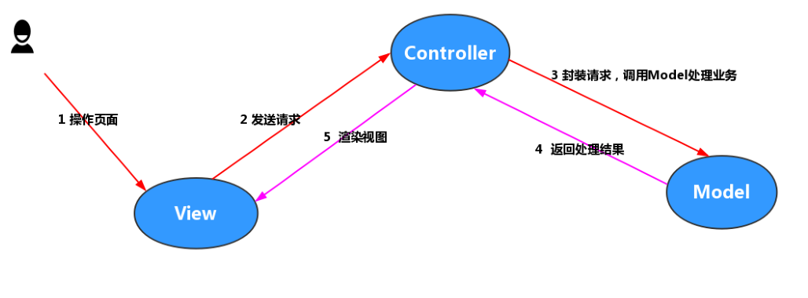

## 3.2. SpringMVC介绍(理解)

SpringMVC是Spring产品对MVC模式的一种具体实现, 它可以通过一套注解，让一个简单的Java类成为控制器，而无须实现任何接口。

SpringMVC中和Spring一样，也存在容器的概念（支持spring的注解）

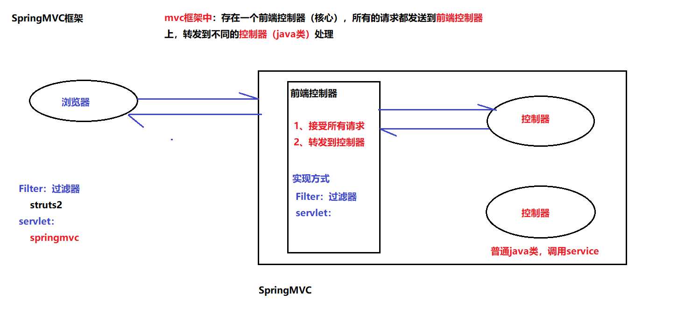

# 4 SpringMVC入门案例(重点)

开发一个请求页面, 向后台发送一个请求, 后台需要在控制台打印一句话, 然后跳转到一个新的页面

## 4.1. 创建一个Project

略，使用Spring工程即可

## 4.2. 创建一个新的Model 加入坐标

```xml
  <dependencies>
    <!--springmvc-->
    <dependency>
      <groupId>org.springframework</groupId>
      <artifactId>spring-webmvc</artifactId>
      <version>5.1.6.RELEASE</version>
    </dependency>
    <!--servlet-->
    <dependency>
      <groupId>javax.servlet</groupId>
      <artifactId>javax.servlet-api</artifactId>
      <version>3.1.0</version>
      <scope>provided</scope>
    </dependency>
    <!--jsp-->
    <dependency>
      <groupId>javax.servlet</groupId>
      <artifactId>jsp-api</artifactId>
      <version>2.0</version>
      <scope>provided</scope>
    </dependency>
    <!--文件上传的包-->
    <dependency>
      <groupId>commons-fileupload</groupId>
      <artifactId>commons-fileupload</artifactId>
      <version>1.4</version>
    </dependency>
  </dependencies>


```

## 4.3. 补全目录结构

JBLJavaToWeb: 将普通的maven工程，转化为web工程，自动补全补录结构。（安装完成：重启IDEA）

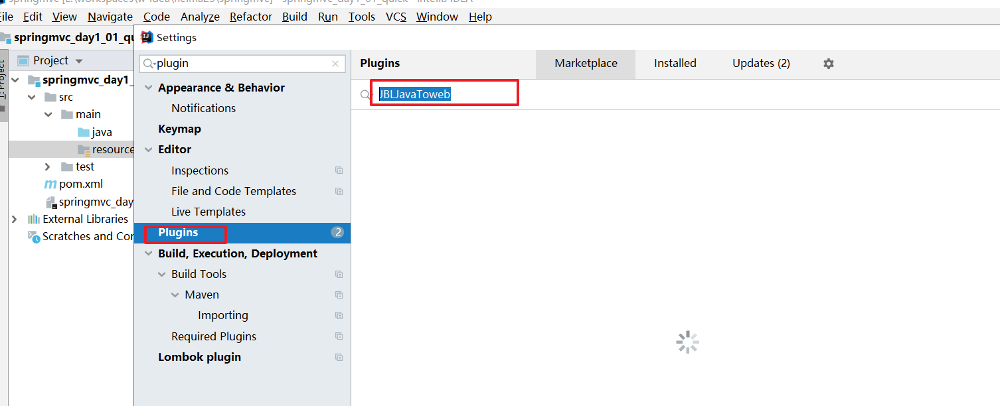

**转化工程**

定义到需要转化的java工程上：右键 --> JBLJavaToWeb -->刷新工程

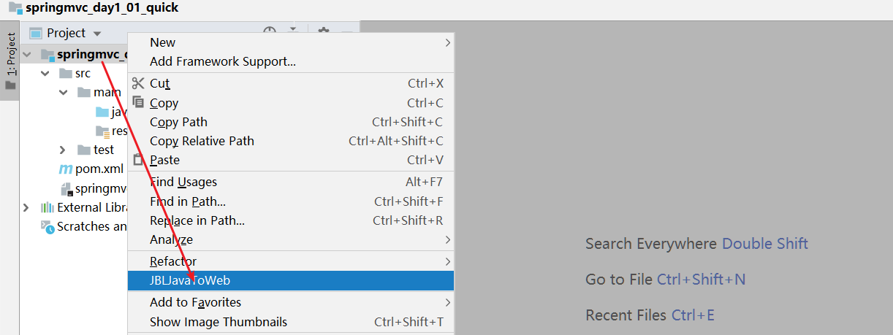

## 4.4. <font color='red'>加入SpringMVC的配置文件</font>


```xml
<?xml version="1.0" encoding="UTF-8"?>
<beans xmlns="http://www.springframework.org/schema/beans"
       xmlns:mvc="http://www.springframework.org/schema/mvc"
       xmlns:xsi="http://www.w3.org/2001/XMLSchema-instance"
       xmlns:aop="http://www.springframework.org/schema/aop"
       xmlns:context="http://www.springframework.org/schema/context"
       xsi:schemaLocation="http://www.springframework.org/schema/beans
        https://www.springframework.org/schema/beans/spring-beans.xsd
        http://www.springframework.org/schema/mvc
        https://www.springframework.org/schema/mvc/spring-mvc.xsd
		http://www.springframework.org/schema/aop
        https://www.springframework.org/schema/aop/spring-aop.xsd
        http://www.springframework.org/schema/context
        https://www.springframework.org/schema/context/spring-context.xsd">

    <!--1、包扫描-->
    <context:component-scan base-package="cn.itcast"></context:component-scan>


    <!--3、配置SpringMVC的注解驱动-->
    <mvc:annotation-driven></mvc:annotation-driven>

</beans>
```

## 4.5.<font color='red'> 加入web的配置文件</font>


```xml
<?xml version="1.0" encoding="UTF-8"?>
<web-app xmlns:xsi="http://www.w3.org/2001/XMLSchema-instance"
	xmlns="http://java.sun.com/xml/ns/javaee"
	xsi:schemaLocation="http://java.sun.com/xml/ns/javaee http://java.sun.com/xml/ns/javaee/web-app_2_5.xsd"
	version="2.5">

	<!--
		配置前端控制器
			DispatcherServlet
	-->
	<servlet>
		<servlet-name>mvc</servlet-name>
		<servlet-class>org.springframework.web.servlet.DispatcherServlet</servlet-class>
		<!--自动加载Springmvc的配置文件-->
		<init-param>
			<param-name>contextConfigLocation</param-name>
			<param-value>classpath:springmvc.xml</param-value>
		</init-param>
	</servlet>


	<servlet-mapping>
		<servlet-name>mvc</servlet-name>
		<!--
			处理所有请求
			不处理.jsp为后缀的请求
		-->
		<url-pattern>/</url-pattern>
	</servlet-mapping>
</web-app>
```

## 4.6. 开启请求页面

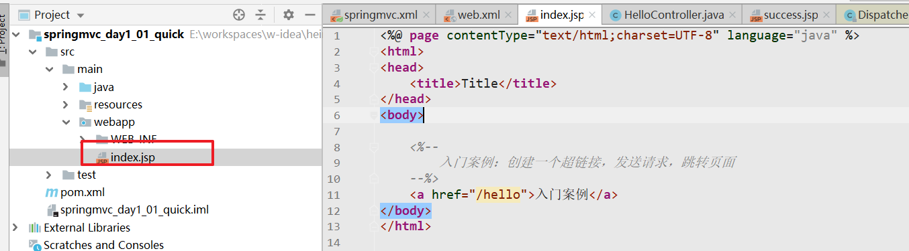

## 4.7. <font color='red'> 开发控制器</font>

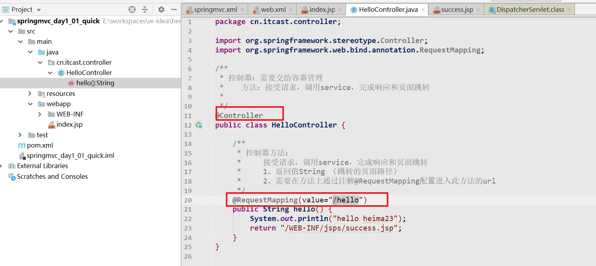

## 4.8. 开发响应页面

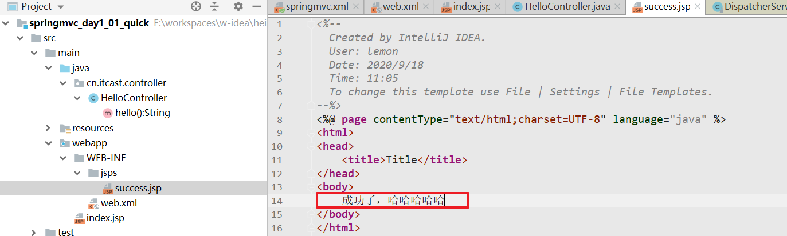

## 4.9. 部署测试

略

# 5 SpringMVC原理

## 5.1. 工作流程

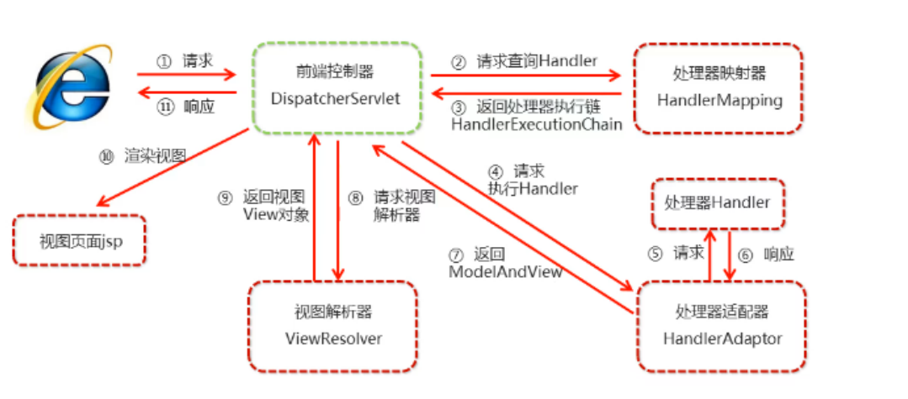

1. 用户通过浏览器发送请求至DispatcherServlet
2. DispatcherServlet收到请求调用HandlerMapping
3. HandlerMapping找到具体的处理器链返回给DispatcherServlet
4. DispatcherServlet会根据返回的处理器链调用HandlerAdapter
5. HandlerAdapter经过适配调用具体的Handler（controller）
6. Controller执行完成返回一个执行结果
7. HandlerAdapter将Handler的结果ModelAndView对象返回给DispatcherServlet
8. DispatcherServlet将ModelAndView对象传给ViewReslover
9. ViewReslover解析后得到具体View，并返回给DispatcherServlet
10. DispatcherServlet根据View进行视图渲染（即将模型数据填充至视图中）
11. DispatcherServlet会将渲染后的视图响应给浏览器

## 5.2. SpringMVC的四大组件

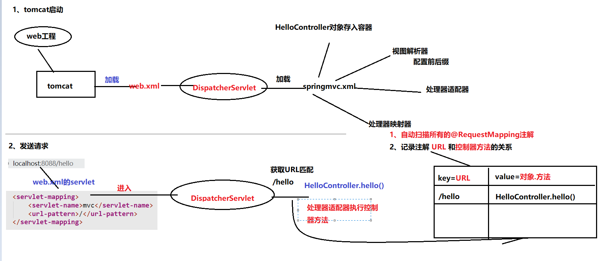

**前端控制器**：DispatcherServlet

SpringMVC的核心组件（DispathcherServlet），协调所有组件的运行

**处理器映射器** HandlerMapping

根据URL请求去寻找对应的处理方法( Controller中的方法)

**处理器适配器** HandlerAdapter

真正的去调用处理方法（执行Controller中的方法）

**视图解析器**  ViewReslover

将逻辑视图翻译成物理视图

物理视图：jsp页面的完整路径


### 配置

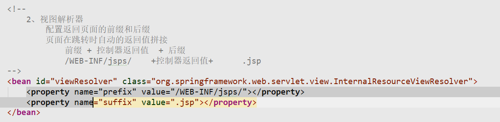

### java代码

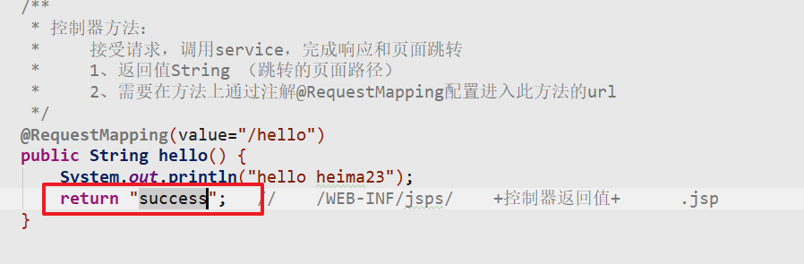

# 6 RequestMapping

RequestMapping用于建立请求URL和处理方法之间的对应关系, 也可以通过它的属性对请求做出各种限制.

* value（path）： 用于限制请求URL(和path作用一样)

* method：用于限制请求类型

* params：用于限制请求参数的条件（了解中的了解）

此注解可以标注在方法上,也可以标注在类上,标注在类上代表类中的所有方法都可以共用一段URL

## 6.1. 限制请求路径(value path)

value 和 path属性是一模一样的，都是配置当前方法的请求路径

### 6.1.1.   页面

和之前一模一样

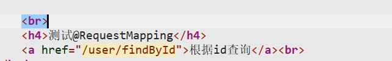

### 6.1.2.   后台

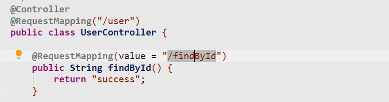

## 6.2. 限制请求类型(method)

method ：配置当前请求的请求类型（RequestMethod.post，RequestMethod.get，RequestMethod.delete，RequestMethod.put）

### 6.2.1.   页面


### 6.2.2.   后台

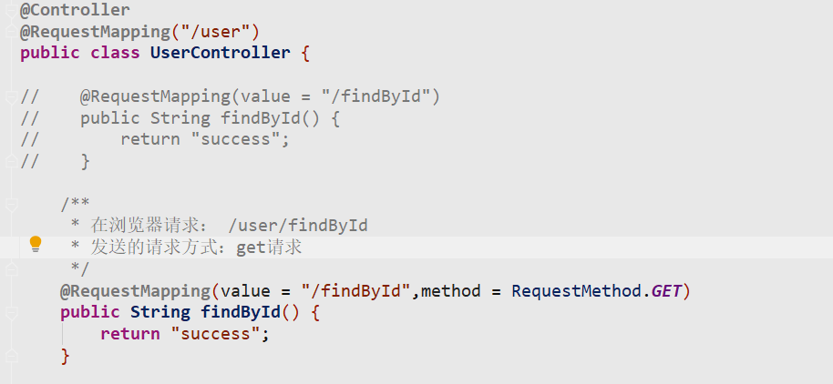

## 6.3. 限制请求参数(params)

params：配置此方法比如携带的请求参数。如果没有指定参数，抛出异常

### 6.3.1.   页面


### 6.3.2.   后台

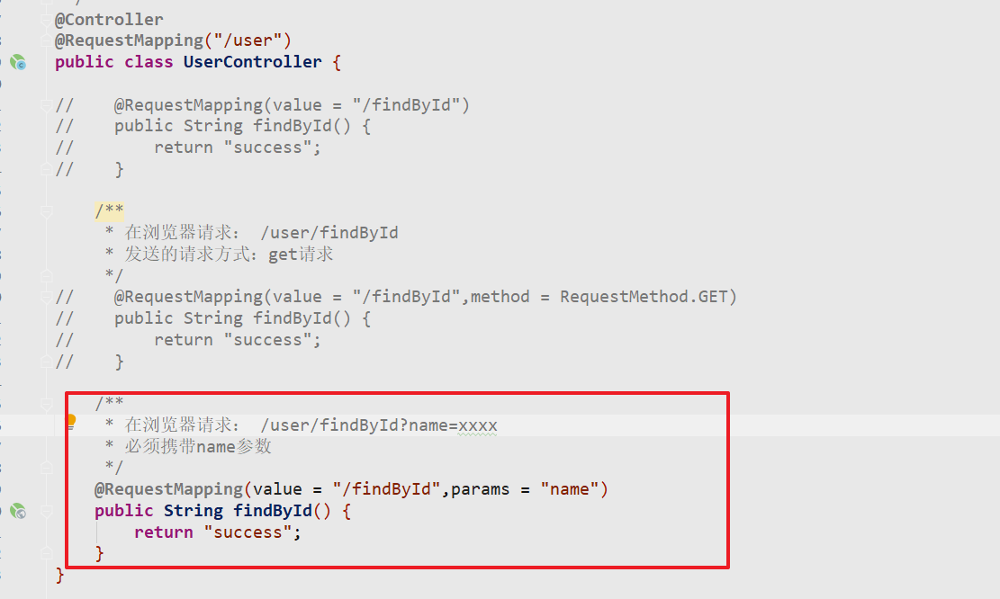

# <font color="red">7 接收请求参数(重点)</font>

在SpringMVC中可以使用多种类型来接收前端传入的参数

## 7.1. 简单类型(常用)

(8 基本类型\8 基本类型的包装类型\1 字符串)

使用方式：

<font color="red">只需要保证前端传递的参数名称跟方法的形参名称一致就好</font>

### 7.1.1.   页面

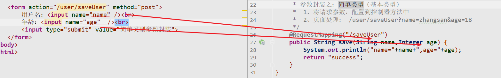

### 7.1.2.   后台

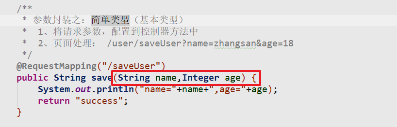

## 7.2. 对象(pojo)类型(常用)

使用方式：

<font color="red">只需要保证前端传递的参数名称跟pojo的属性名称（set方法）一致就好</font>

### 7.2.1.   页面

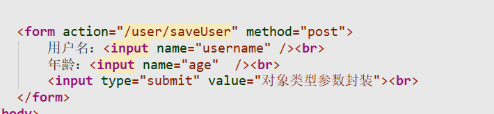

### 7.2.2.   封装一个实体

```java
package cn.itcast.domain;

public class User {

    private String username;

    private Integer age;

    public String getUsername() {
        return username;
    }

    public void setUsername(String username) {
        this.username = username;
    }

    public Integer getAge() {
        return age;
    }

    public void setAge(Integer age) {
        this.age = age;
    }

    @Override
    public String toString() {
        return "User{" +
                "username='" + username + '\'' +
                ", age=" + age +
                '}';
    }
}

```

### 7.2.3.   后台

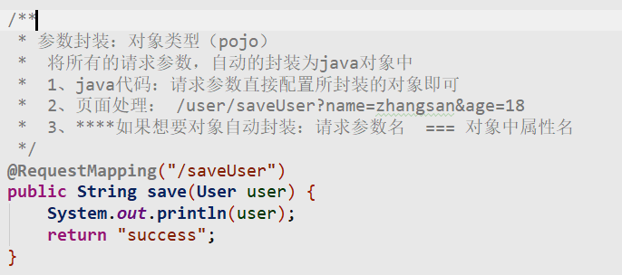

## 7.3. 数组类型

使用方式：

<font color="red">只需要保证前端传递的参数名称跟方法中的数组形参名称一致就好</font>

同名参数传递

### 7.3.1.   页面

```html
<a href="/user/delete?id=1&id=2&id=3">数组封装</a><br>
```

### 7.3.2.   后台

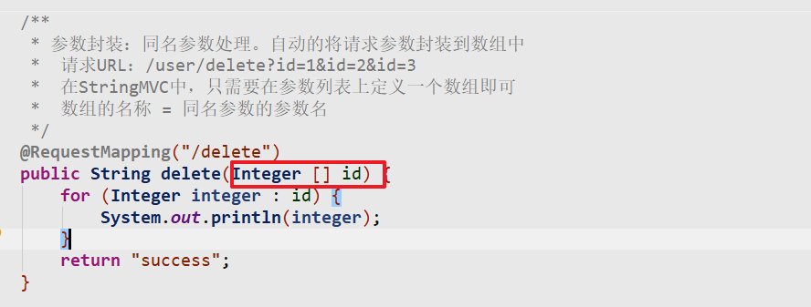

## 7.4. 集合类型(了解)

将前端传入的数据自动的封装成集合，需要将集合包装到一个对象中才行。

获取集合参数时，要将集合参数包装到一个实体中才可以

### 7.4.1.   页面

```html
   <h4>测试参数封装之集合</h4>

    <%--
        语法：
            集合属性名[索引].属性
                accounts[0] == Account对象
                accounts[0].name
                accounts[0].money
    --%>
    <form action="/user/account" method="post">
        1号账户名：<input name="accounts[0].name" /><br>
        1号账户金额：<input name="accounts[0].money" /><br>
        2号账户名：<input name="accounts[1].name" /><br>
        2号账户金额：<input name="accounts[1].money" /><br>
        <input type="submit" value="测试参数封装之List"><br>
    </form>


    <%--
    语法：
        集合属性名['key'].属性
    map
       one --- account1
       two ---- account2
--%>
    <form action="/user/account" method="post">
        key为one的账户名：<input name="maps['one'].name" /><br>
        key为one的账户金额：<input name="maps['one'].money" /><br>
        key为two的账户名：<input name="maps['two'].name" /><br>
        key为two的账户金额：<input name="maps['two'].money" /><br>
        <input type="submit" value="测试参数封装之Map"><br>
    </form>
```

### 7.4.2.   封装一个Vo对象

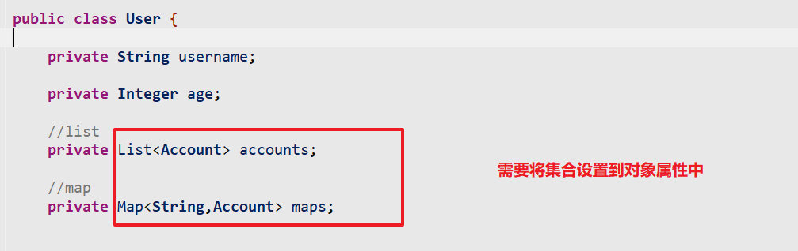

### 7.4.3.   后台

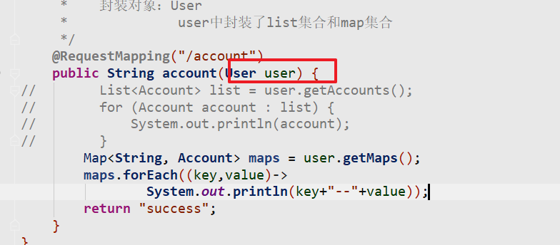

## 7.5. 日期类型

在springmvc中内置了一系列的类型转化器，自动的将请求参数的String类型转化为某种格式（Integer）

对于一些常见的类型, SpringMVC是内置了类型转换器的, 但是对于一些格式比较灵活的参数(日期 时间),SpringMVC无法完成类型转换.

SpringMVC对日期： yyyy/MM/dd。

这时候就必须自定义类型转换器

### 7.5.1.   页面

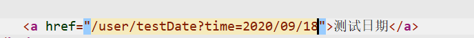

### 7.5.2.   自定义时间类型转换器(面试)

**1 自定义一个类型转换器,实现类型转换的方法**

```java
package cn.itcast.converter;

import org.springframework.core.convert.converter.Converter;

import java.text.SimpleDateFormat;
import java.util.Date;

public class StringToDateConverter implements Converter<String, Date> {

    /**
     * 日期转化
     *   参数：source请求参数
     *          yyyy-MM-dd
     *   返回值：处理之后的日期
     */
    public Date convert(String source) {
        Date date = null;
        try {
            date = new SimpleDateFormat("yyyy-MM-dd").parse(source);
        }catch (Exception e) {
            e.printStackTrace();
        }
        return date;
    }
}
```

**2 将自定义的类型转换注册到SpringMvc的转换服务中,然后再将服务注册到SpringMVC的注解驱动**

```xml
    <!--将自定义的类型转化器加入Springmvc的转化器集合中-->
    <bean id="conversionService" class="org.springframework.context.support.ConversionServiceFactoryBean">
        <property name="converters">
            <set>
                <bean class="cn.itcast.converter.StringToDateConverter"></bean>
            </set>
        </property>
    </bean>

    <!--3、
        配置springmvc的注解驱动
            内置了处理器映射器和处理器适配器
    -->
    <!--注册到springmvc驱动中-->
    <mvc:annotation-driven conversion-service="conversionService"></mvc:annotation-driven>
```

### 7.5.3.   后台

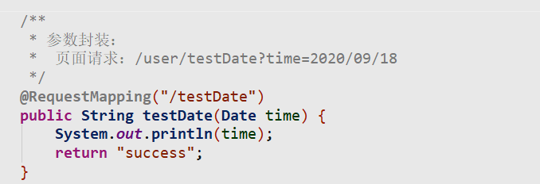

## 7.6. 中文乱码

SpringMVC在使用post提交请求时,对于中文参数是有乱码问题的, 针对这种情况它提供了一个中文乱码过滤器,我们只需要进行配置一下就可以了.

在`web.xml`配置SpringMVC中中文乱码过滤器

```xml
	<!--在web.xml中配置过滤器，设置编码即可 CharacterEncodingFilter-->
	<filter>
		<filter-name>characterEncodingFilter</filter-name>
		<filter-class>org.springframework.web.filter.CharacterEncodingFilter</filter-class>
		<init-param>
			<param-name>encoding</param-name>
			<param-value>utf-8</param-value>
		</init-param>
	</filter>
	
	<filter-mapping>
		<filter-name>characterEncodingFilter</filter-name>
		<url-pattern>/*</url-pattern>
	</filter-mapping>
```
