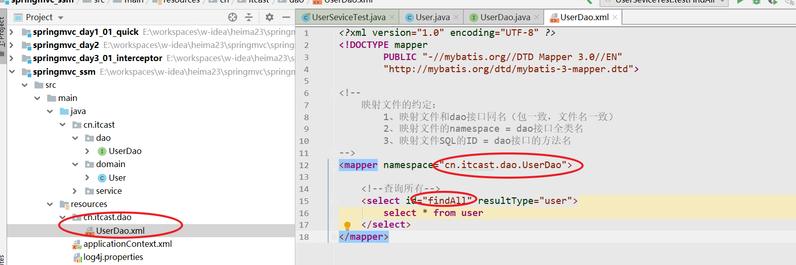

回顾：

* 请求数据处理
  * 文件上传
  * @ReuqestParam
* 页面跳转（请求转发和重定向）
* 请求跳转参数响应（request，model，ModelAndView）
* springmvc处理ajax请求 （@RequestBody，@ReponseBody）
* RestFul风格（针对同一个URL，根据不同的请求方式，完成不一样的业务处理）
  * get（查询），delete（删除），post（保存），put（修改）
  * @PathVariable ：获取地址参数
* 统一异常处理

# 1 拦截器(重点)

## 1.1. 什么是拦截器

拦截器是SpringMVC提供的一种技术, 它的功能似于过滤器Filter，它会在进入controller之前,离开controller之后以及页面渲染完毕之后进行拦截.


## 1.2. 自定义拦截器(入门)

### 1.2.1.   定义拦截器

**重点: 自定义一个类实现HandlerInterceptor接口**

```java
package cn.itcast.interceptors;


import org.springframework.web.servlet.HandlerInterceptor;
import org.springframework.web.servlet.ModelAndView;

import javax.servlet.http.HttpServletRequest;
import javax.servlet.http.HttpServletResponse;

/**
 * 自定义拦截器
 *  实现HnadlerInterceptor接口
 *  实现其中的三个方法（三个拦截点）
 */
public class MyInterceptor01 implements HandlerInterceptor {


    /**
     * 进入controller方法之前执行的内容（对请求拦截处理）
     * 返回值 boolean
     *  true   ： 放行（继续向后执行，进入到controller）
     *  false  ： 拦截过滤
     */
    public boolean preHandle(HttpServletRequest request, HttpServletResponse response, Object handler) throws Exception {
        System.out.println("执行MyInterceptor01的preHandle方法");
        return true;
    }


    /**
     * 执行了controller方法之后，执行的内容（对象响应进行拦截处理）
     */
    public void postHandle(HttpServletRequest request, HttpServletResponse response, Object handler, ModelAndView modelAndView) throws Exception {
        System.out.println("执行MyInterceptor01的postHandle方法");
    }


    /**
     * 页面渲染完成之后，执行（不用）
     */
    public void afterCompletion(HttpServletRequest request, HttpServletResponse response, Object handler, Exception ex) throws Exception {
        System.out.println("执行MyInterceptor01的afterCompletion方法");
    }
}
```

### 1.2.2.   配置拦截器

在SpringMVC的配置文件中，添加拦截器配置（配置拦截器对应需要拦截的URL和方法规则）

```xml
    <!--配置SpringMVC的拦截器-->
    <mvc:interceptors>
        <!--配置具体的拦截器和拦截器的拦截规则-->
        <mvc:interceptor>
            <!--
                mapping : 配置拦截规则
                /** 表示拦截所有
                请求  /hello/demo1
            -->
            <mvc:mapping path="/**"/>
            <!--
                exclude-mapping： 配置不拦截的规则
            -->
            <mvc:exclude-mapping path="/hello/demo2"/>
            <!--创建对象：在当前拦截器中有效-->
            <bean class="cn.itcast.interceptors.MyInterceptor01"></bean>
        </mvc:interceptor>
    </mvc:interceptors>

```

## 1.3. 自定义拦截器链

开发中拦截器可以单独使用，也可以同时使用多个拦截器形成一条拦截器链。

开发步骤和单个拦截器是一样的，只不过注册的时候注册多个，注意这里注册的顺序就代表拦截器执行的顺序。

### 1.3.1.   开发拦截器

从第一个拦截器Copy一份作为第二个拦截器

```java

/**
 * 自定义拦截器
 *  实现HnadlerInterceptor接口
 *  实现其中的三个方法（三个拦截点）
 */
public class MyInterceptor02 implements HandlerInterceptor {


    /**
     * 进入controller方法之前执行的内容（对请求拦截处理）
     * 返回值 boolean
     *  true   ： 放行（继续向后执行，进入到controller）
     *  false  ： 拦截过滤
     */
    public boolean preHandle(HttpServletRequest request, HttpServletResponse response, Object handler) throws Exception {
        System.out.println("执行MyInterceptor02的preHandle方法");
        return true;
    }


    /**
     * 执行了controller方法之后，执行的内容（对象响应进行拦截处理）
     */
    public void postHandle(HttpServletRequest request, HttpServletResponse response, Object handler, ModelAndView modelAndView) throws Exception {
        System.out.println("执行MyInterceptor02的postHandle方法");
    }


    /**
     * 页面渲染完成之后，执行（不用）
     */
    public void afterCompletion(HttpServletRequest request, HttpServletResponse response, Object handler, Exception ex) throws Exception {
        System.out.println("执行MyInterceptor02的afterCompletion方法");
    }
}

```

### 1.3.2.   配置拦截器

```xml
    <!--配置SpringMVC的拦截器-->
    <mvc:interceptors>
        <!--配置具体的拦截器和拦截器的拦截规则-->
        <mvc:interceptor>
            <mvc:mapping path="/**"/>
            <mvc:exclude-mapping path="/hello/demo2"/>
            <bean class="cn.itcast.interceptors.MyInterceptor01"></bean>
        </mvc:interceptor>

        <!--配置具体的拦截器和拦截器的拦截规则-->
        <mvc:interceptor>
            <mvc:mapping path="/**"/>
            <mvc:exclude-mapping path="/hello/demo2"/>
            <bean class="cn.itcast.interceptors.MyInterceptor02"></bean>
        </mvc:interceptor>
    </mvc:interceptors>
```

多个拦截器链的执行顺序和配置顺序有关

## 1.4. 拦截器和过滤器的区别(面试)

过滤器是Servlet 规范中的一部分，任何java web工程都可以使用。

拦截器是SpringMVC框架的，只有使用了SpringMVC框架的工程才能用。

过滤器在url-pattern中配置了/*之后，可以对所有要访问的资源拦截。

拦截器只会拦截访问的控制器方法，如果访问的是jsp,js,html,css,image等,它是不拦截的。

# 2 登录检查拦截器（重点）

**需求：**

* 用户访问查询所有请求
  * 用于已登录可以访问，没有登录不能访问

* 如果用户已经登录,即可成功访问

* 如果用户没有登录,不允许访问,返回登录页面login.jsp重新登录

## 2.1 搭建环境

从之前的案例中copy一份代码，作为登录检查拦截器的学习环境

## 2.2 查询所有功能实现

### 2.2.1 Controller代码


### 2.2.2 页面


## 2.3 登录功能实现


### 2.3.1 Controller代码


### 2.3.2 页面

```html
<%--
  Created by IntelliJ IDEA.
  User: lemon
  Date: 2020/7/28
  Time: 10:30
  To change this template use File | Settings | File Templates.
--%>
<%@ page contentType="text/html;charset=UTF-8" language="java" %>
<html>
<head>
    <title>用户登录</title>
</head>
<body>
    <h3>欢迎登录传智播客</h3>

    <%--
        /login
            name=admin
            password=admin
    --%>
    <form action="${pageContext.request.contextPath}/login" method="post">
        用户名：<input type="text" name="name"><br>
        密码：<input type="text" name="password"><br>
        <input type="submit" value="登录"><br>
    </form>
</body>
</html>
```

## 2.4 登录检查拦截器

当用户登录成功之后，才能够访问对应的资源。

拦截器：只需要实现preHandler方法对请求处理即可

* 用户已登录：正常访问
  * 如果session存在登录数据
  * 返回true

* 用户未登录：跳转到登录页面重新登录
  * 如果session没有登录数据
  * 返回false

### 2.4.1 自定义拦截器

```java
package cn.itcast.interceptors;

import org.springframework.web.servlet.HandlerInterceptor;

import javax.servlet.http.HttpServletRequest;
import javax.servlet.http.HttpServletResponse;
import javax.servlet.http.HttpSession;

/**
 * 登录检查拦截器
 */
public class LoginInterceptor implements HandlerInterceptor {

    /**
     *  进入到controller方法之前的拦截点（登录检查）
     *  需求：
     *      当用户已登录，执行后续请求（放行）
     *      当用户未登录，不执行后续请求（重定向到登录页面）
     *  返回值：
     *      true：放行
     *      false：拦截处理
     */
    public boolean preHandle(HttpServletRequest request, HttpServletResponse response, Object handler) throws Exception {
        HttpSession session = request.getSession();
        Object user = session.getAttribute("user"); //获取登录用户
        //1、判断用户是否登录
        if(user != null) {
            //1.1 如果以登录放行
            return true;
        }else {
            //1.2 未登录，(重定向到登录页面)拦截
            response.sendRedirect(request.getContextPath() + "/login.jsp");
            return false;
        }
    }
}
```

### 2.4.2 配置

```xml
    <!--配置登录检查拦截器-->
    <mvc:interceptors>
        <mvc:interceptor>
            <!--对所有的请求都会拦截，对于登录动作-->
            <mvc:mapping path="/**"/>
            <!--放行登录-->
            <mvc:exclude-mapping path="/login"/>
            <bean class="cn.itcast.interceptors.LoginInterceptor"></bean>
        </mvc:interceptor>
    </mvc:interceptors>
```

## 2.5 测试

略

## 2.6 拦截器总结

**1、拦截器的使用方式**

* 自定义一个拦截器（实现接口HandlerInterceptor，按照需要重写三个方法（preHandler））
* 在springMVC中配置拦截器处理的URL

**2、面试题（拦截器和过滤器的区别）**

* 拦截器是mvc的内部拦截机制，filter是web的规范
* 拦截点不同：mvc的拦截器可控（只会拦截方法），filter一旦配置拦截所有（包含静态资源）

**3、面试题（springmvc拦截器的执行顺序）**

# 3 SSM整合(练习)

## 3.1 整合的意义

借助Spring框架，完成对象的创建和依赖注入。通过Spring的声明式事务完成Service层的事务控制

## 3.2 整合的步骤

整合步骤（初学者）：

* 保证mybatis独立运行
  * 搭建mybatis运行环境
* 保证springIOC独立运行
  * 搭建springIOC运行环境
* 整合mybatis和spring
  * mybatis对象交给spring管理
  * 事务处理
* 保证Springmvc独立运行
  * 搭建Springmvc运行环境
* 整合SSM

# 4 搭建Mybatis运行环境

## 4.1 案例和数据库

使用用户表作为SSM学习案例，在今日资料中已经准备好。将用户表及数据导入到mysql数据库中即可

```sql
CREATE TABLE `user` (
  `id` int(11) NOT NULL auto_increment,
  `password` varchar(32) NOT NULL COMMENT '密码',
  `username` varchar(32) NOT NULL COMMENT '用户名称',
  `birthday` datetime default NULL COMMENT '生日',
  `sex` char(1) default NULL COMMENT '性别',
  `address` varchar(256) default NULL COMMENT '地址',
  PRIMARY KEY  (`id`)
) ENGINE=InnoDB DEFAULT CHARSET=utf8;

/*Data for the table `user` */

insert  into `user`(`id`,`username`,`password`,`birthday`,`sex`,`address`) values (41,'老王','111111','2018-02-27 17:47:08','男','北京'),(42,'小二王','111111','2018-03-02 15:09:37','女','北京金燕龙'),(43,'小三王','111111','2018-03-04 11:34:34','女','北京金燕龙'),(45,'传智播客','111111','2018-03-04 12:04:06','男','北京金燕龙'),(46,'老王','111111','2018-03-07 17:37:26','男','北京'),(48,'小马宝莉','111111','2018-03-08 11:44:00','女','北京修正');

```

## 4.2 创建工程


```xml
    <dependencies>

        <!--mybatis相关的坐标-->
        <dependency>
            <groupId>mysql</groupId>
            <artifactId>mysql-connector-java</artifactId>
            <version>5.1.6</version>
        </dependency>
        <dependency>
            <groupId>org.mybatis</groupId>
            <artifactId>mybatis</artifactId>
            <version>3.5.1</version>
        </dependency>
        <dependency>
            <groupId>log4j</groupId>
            <artifactId>log4j</artifactId>
            <version>1.2.17</version>
        </dependency>
        <dependency>
            <groupId>junit</groupId>
            <artifactId>junit</artifactId>
            <version>4.12</version>
        </dependency>


        <!--Spring相关坐标-->
        <dependency>
            <groupId>com.alibaba</groupId>
            <artifactId>druid</artifactId>
            <version>1.1.15</version>
        </dependency>
        <dependency>
            <groupId>org.springframework</groupId>
            <artifactId>spring-context</artifactId>
            <version>5.1.6.RELEASE</version>
        </dependency>
        <dependency>
            <groupId>org.springframework</groupId>
            <artifactId>spring-jdbc</artifactId>
            <version>5.1.6.RELEASE</version>
        </dependency>
        <dependency>
            <groupId>org.aspectj</groupId>
            <artifactId>aspectjweaver</artifactId>
            <version>1.8.7</version>
        </dependency>
        <dependency>
            <groupId>org.springframework</groupId>
            <artifactId>spring-test</artifactId>
            <version>5.1.6.RELEASE</version>
        </dependency>

        <!--springMVC相关坐标-->
        <dependency>
            <groupId>org.springframework</groupId>
            <artifactId>spring-webmvc</artifactId>
            <version>5.1.6.RELEASE</version>
        </dependency>
        <dependency>
            <groupId>javax.servlet</groupId>
            <artifactId>javax.servlet-api</artifactId>
            <version>3.1.0</version>
            <scope>provided</scope>
        </dependency>
        <dependency>
            <groupId>javax.servlet</groupId>
            <artifactId>jsp-api</artifactId>
            <version>2.0</version>
            <scope>provided</scope>
        </dependency>
        <dependency>
            <groupId>jstl</groupId>
            <artifactId>jstl</artifactId>
            <version>1.2</version>
        </dependency>

        <!--mybatis对接Spring的整合包-->
        <dependency>
            <groupId>org.mybatis</groupId>
            <artifactId>mybatis-spring</artifactId>
            <version>2.0.1</version>
        </dependency>
    </dependencies>
```

## 4.3 创建实体类

```java
package cn.itcast.domain;

import lombok.Data;

import java.util.Date;

@Data
public class User {

    private Integer id;
    private String password;
    private String username;
    private Date birthday;
    private String sex;
    private String address;
}
```

## 4.4 创建Dao接口

```java
package cn.itcast.dao;

import cn.itcast.domain.User;

import java.util.List;

public interface UserDao {

    /**
     * 查询所有
     */
    List<User> findAll();
}
```

## 4.5 创建Dao的映射文件



## 4.6 创建Mybatis的核心配置文件


```xml
<?xml version="1.0" encoding="UTF-8" ?>
<!DOCTYPE configuration
        PUBLIC "-//mybatis.org//DTD Config 3.0//EN"
        "http://mybatis.org/dtd/mybatis-3-config.dtd">
<configuration>

    <!--别名-->
    <typeAliases>
        <package name="cn.itcast.domain"/>
    </typeAliases>

    <!--
        环境配置：数据源
    -->
    <environments default="env">
        <environment id="env">
            <transactionManager type="JDBC"></transactionManager>
            <dataSource type="POOLED">
                <property name="driver" value="com.mysql.jdbc.Driver"/>
                <property name="url" value="jdbc:mysql:///heima23"/>
                <property name="username" value="root"/>
                <property name="password" value="root"/>
            </dataSource>
        </environment>
    </environments>

    <!--映射文件-->
    <mappers>
        <package name="cn.itcast.dao"/>
    </mappers>
    
</configuration>
```

## 4.7 测试

````java
package cn.itcast.test;

import cn.itcast.dao.UserDao;
import cn.itcast.domain.User;
import org.apache.ibatis.io.Resources;
import org.apache.ibatis.session.SqlSession;
import org.apache.ibatis.session.SqlSessionFactory;
import org.apache.ibatis.session.SqlSessionFactoryBuilder;

import java.io.IOException;
import java.io.InputStream;
import java.util.List;

public class MybatisTest {

    public static void main(String[] args) throws IOException {
        //1、加载mybatis的核心配置文件
        InputStream is = Resources.getResourceAsStream("mybatis-config.xml");
        //2、创建SqlSessionFactoryBuilder
        SqlSessionFactoryBuilder builder = new SqlSessionFactoryBuilder();
        //3、创建SqlSessionFactory
        SqlSessionFactory sessionFactory = builder.build(is);
        //4、创建SqlSession
        SqlSession sqlSession = sessionFactory.openSession();
        //5、创建Dao接口的动态代理对象
        UserDao userDao = sqlSession.getMapper(UserDao.class);//dao接口
        //6、测试dao接口方法
        List<User> list = userDao.findAll();
        for (User user : list) {
            System.out.println(user);
        }
        //7、释放资源
        sqlSession.close();
    }
}

````

# 5 搭建Spring运行环境

Spring运行环境：IOC环境（将对象存入Spring容器，从容器中获取对象）

使用XML + 注解注解的形式配置

* 在spring配置文件中：开启注解支持（包扫描）

* 自定义的java对象 （注解）
* 在spring配置文件中：第三方jar包中的java对象（XML）

## 5.1 创建service接口

```java
package cn.itcast.service;

import java.util.List;

public interface UserService {

    //查询所有
    List findAll();
}
```

## 5.2 创建Service接口实现类


## 5.3 Spring配置


```xml
<?xml version="1.0" encoding="UTF-8"?>
<beans xmlns="http://www.springframework.org/schema/beans"
       xmlns:xsi="http://www.w3.org/2001/XMLSchema-instance"
       xmlns:context="http://www.springframework.org/schema/context"
       xmlns:aop="http://www.springframework.org/schema/aop"
       xmlns:tx="http://www.springframework.org/schema/tx"
       xsi:schemaLocation="http://www.springframework.org/schema/beans
			    http://www.springframework.org/schema/beans/spring-beans.xsd
			    http://www.springframework.org/schema/context
			    http://www.springframework.org/schema/context/spring-context.xsd
			    http://www.springframework.org/schema/aop
			    http://www.springframework.org/schema/aop/spring-aop.xsd
			    http://www.springframework.org/schema/tx
			    http://www.springframework.org/schema/tx/spring-tx.xsd">

    <!--配置方式： xml + 注解-->

    <!--包扫描-->
    <context:component-scan base-package="cn.itcast.service"></context:component-scan>

</beans>
```

## 5.4 测试

```java
package cn.itcast.test;

import cn.itcast.service.UserService;
import org.junit.Test;
import org.junit.runner.RunWith;
import org.springframework.beans.factory.annotation.Autowired;
import org.springframework.test.context.ContextConfiguration;
import org.springframework.test.context.junit4.SpringJUnit4ClassRunner;

@RunWith(SpringJUnit4ClassRunner.class)
@ContextConfiguration(locations = "classpath:applicationContext.xml")
public class SpringTest {

    @Autowired
    private UserService userService;

    @Test
    public void testFindAll() {
        userService.findAll();
    }
}

```

# 5 整合Mybatis与Spring

## 5.1 整合的思路

将mybatis中用到的核心对象，交给spring容器管理。在service配置事务管理

**SqlSessionFactory，dao接口的动态代理对象**

mybatis和Spring正式需要导入整合包

```xml
<!--mybatis对接Spring的整合包-->
<dependency>
    <groupId>org.mybatis</groupId>
    <artifactId>mybatis-spring</artifactId>
    <version>2.0.1</version>
</dependency>
```

## 5.2 在Spring配置文件中配置整合

* Spring管理mybatis的核心对象（SqlSessionFactory）
  * 替换mybatis的核心配置文件
  * 数据源，SqlsessionFactory，映射文件
* 事务配置
  * 事务管理器
  * xml + 注解（@Transactional）

```xml
<?xml version="1.0" encoding="UTF-8"?>
<beans xmlns="http://www.springframework.org/schema/beans"
       xmlns:xsi="http://www.w3.org/2001/XMLSchema-instance"
       xmlns:context="http://www.springframework.org/schema/context"
       xmlns:aop="http://www.springframework.org/schema/aop"
       xmlns:tx="http://www.springframework.org/schema/tx"
       xsi:schemaLocation="http://www.springframework.org/schema/beans
			    http://www.springframework.org/schema/beans/spring-beans.xsd
			    http://www.springframework.org/schema/context
			    http://www.springframework.org/schema/context/spring-context.xsd
			    http://www.springframework.org/schema/aop
			    http://www.springframework.org/schema/aop/spring-aop.xsd
			    http://www.springframework.org/schema/tx
			    http://www.springframework.org/schema/tx/spring-tx.xsd">
    <!--开启包扫描-->
    <context:component-scan base-package="cn.itcast.service"></context:component-scan>


    <!--1、spring管理mybatis的核心对象-->

    <!--datasource-->
    <bean id="dataSource" class="com.alibaba.druid.pool.DruidDataSource">
        <property name="username" value="root"></property>
        <property name="password" value="root"></property>
        <property name="url" value="jdbc:mysql:///heima23"></property>
        <property name="driverClassName" value="com.mysql.jdbc.Driver"></property>
    </bean>

    <!--sqlSessionfactory-->
    <bean id="sqlSessionfactory" class="org.mybatis.spring.SqlSessionFactoryBean">
        <property name="dataSource" ref="dataSource"></property>
        <property name="typeAliasesPackage" value="cn.itcast.domain"></property>
    </bean>


    <!--
        spring自动的对执行包下的dao接口创建动态代理对象，存入容器
            mapperScannerConfigurer：
               1、spring容器启动的时候，加载执行包下的所有接口和映射文件
               2、调用session的方法获取dao接口的动态代理对象
               3、将对象存入容器
    -->
    <bean id="mapperScannerConfigurer" class="org.mybatis.spring.mapper.MapperScannerConfigurer">
        <!--dao接口所在的包-->
        <property name="basePackage" value="cn.itcast.dao"></property>
    </bean>


    <!--2、配置声明式事务（xml）-->
    <!-- i.事务管理器交给容器管理-->
    <bean id="transactionManager" class="org.springframework.jdbc.datasource.DataSourceTransactionManager">
        <property name="dataSource" ref="dataSource"></property>
    </bean>

    <!--ii.配置事务通知-->
    <tx:advice id="txAdvice">
        <tx:attributes>
            <tx:method name="save*" propagation="REQUIRED" read-only="false"/>
            <tx:method name="update*"/>
            <tx:method name="delete*"/>
            <tx:method name="find*" propagation="SUPPORTS" read-only="true"/>
            <tx:method name="*"></tx:method>
        </tx:attributes>
    </tx:advice>

    <!--iii.配置事务的AOP-->
    <aop:config>
        <aop:pointcut id="pt" expression="execution(* cn.itcast.service.impl.*.*(..))"/>
        <aop:advisor advice-ref="txAdvice" pointcut-ref="pt"></aop:advisor>
    </aop:config>


</beans>
```

## 5.3 service中注入dao的依赖

```java
package cn.itcast.service.impl;

import cn.itcast.dao.UserDao;
import cn.itcast.service.UserService;
import org.springframework.beans.factory.annotation.Autowired;
import org.springframework.stereotype.Service;

import java.util.List;

@Service
public class UserServiceImpl implements UserService {


    @Autowired
    private UserDao userDao;

    public List findAll() {
        return userDao.findAll();
    }
}
```

# 6 搭建SpringMVC运行环境

* 测试：进行页面跳转即可

## 6.1 转化工程

## 6.2 配置SpringMVC的配置文件

```xml
<?xml version="1.0" encoding="UTF-8"?>
<beans xmlns="http://www.springframework.org/schema/beans"
       xmlns:mvc="http://www.springframework.org/schema/mvc"
       xmlns:xsi="http://www.w3.org/2001/XMLSchema-instance"
       xmlns:aop="http://www.springframework.org/schema/aop"
       xmlns:context="http://www.springframework.org/schema/context"
       xsi:schemaLocation="http://www.springframework.org/schema/beans
        https://www.springframework.org/schema/beans/spring-beans.xsd
        http://www.springframework.org/schema/mvc
        https://www.springframework.org/schema/mvc/spring-mvc.xsd
		http://www.springframework.org/schema/aop
        https://www.springframework.org/schema/aop/spring-aop.xsd
        http://www.springframework.org/schema/context
        https://www.springframework.org/schema/context/spring-context.xsd">

    <!--SpringMVC的配置文件-->

    <!--1.controller的包扫描-->
    <context:component-scan base-package="cn.itcast.controller"></context:component-scan>

    <!--2.视图解析器-->
    <bean id="viewResolver" class="org.springframework.web.servlet.view.InternalResourceViewResolver">
        <property name="prefix" value="/WEB-INF/jsp/"></property>
        <property name="suffix" value=".jsp"></property>
    </bean>

    <!--3.mvc的驱动-->
    <mvc:annotation-driven></mvc:annotation-driven>

    <!--4.释放静态资源-->
    <mvc:default-servlet-handler></mvc:default-servlet-handler>


</beans>
```

## 6.3 配置web.xml的配置文件

```xml
<?xml version="1.0" encoding="UTF-8"?>
<web-app xmlns:xsi="http://www.w3.org/2001/XMLSchema-instance"
	xmlns="http://java.sun.com/xml/ns/javaee"
	xsi:schemaLocation="http://java.sun.com/xml/ns/javaee http://java.sun.com/xml/ns/javaee/web-app_2_5.xsd"
	version="2.5">

	<!--前端控制器dispatcherServlet-->
	<servlet>
		<servlet-name>mvc</servlet-name>
		<servlet-class>org.springframework.web.servlet.DispatcherServlet</servlet-class>
		<init-param>
			<param-name>contextConfigLocation</param-name>
			<param-value>classpath:springmvc.xml</param-value>
		</init-param>
	</servlet>
	<servlet-mapping>
		<servlet-name>mvc</servlet-name>
		<url-pattern>/</url-pattern>
	</servlet-mapping>

	<!--中文乱码的过滤器 CharacterEncodingFilter-->
	<filter>
		<filter-name>characterEncodingFilter</filter-name>
		<filter-class>org.springframework.web.filter.CharacterEncodingFilter</filter-class>
		<init-param>
			<param-name>encoding</param-name>
			<param-value>utf-8</param-value>
		</init-param>
	</filter>
	<filter-mapping>
		<filter-name>characterEncodingFilter</filter-name>
		<url-pattern>/*</url-pattern>
	</filter-mapping>


</web-app>
```

## 6.4 创建控制器UserController


## 6.5 页面


# 7 整合SSM

整合的主要目的：将Spring容器的对象，和SpringMVC容器中的对象整合到一起。

## 7.1 父子容器


子容器可以访问父容器中的对象（注入）

## 7.2 配置Spring容器监听器

工程中存在两个容器（Spring容器，SpringMVC容器）

在`web.xml`中通过listener的形式配置Spring容器监听器。监听tomcat启动，当tomcat启动成功之后，自动的创建Spring容器，创建对象并依赖注入

```xml
<!--创建Spring容器的监听器,tomcat启动成功之后，加载指定的Spring配置文件-->
<listener>
   <listener-class>org.springframework.web.context.ContextLoaderListener</listener-class>
</listener>
<!--指定Spring加载的配置文件-->
<context-param>
   <param-name>contextConfigLocation</param-name>
   <param-value>classpath:applicationContext.xml</param-value>
</context-param>
```

## 7.3 通过MVC创建所有

```xml
<!--前端控制器dispatcherServlet-->
<servlet>
    <servlet-name>mvc</servlet-name>
    <servlet-class>org.springframework.web.servlet.DispatcherServlet</servlet-class>
    <init-param>
        <param-name>contextConfigLocation</param-name>
        <param-value>classpath:springmvc.xml,classpath:applicationContext.xml</param-value>
    </init-param>
</servlet>
```


