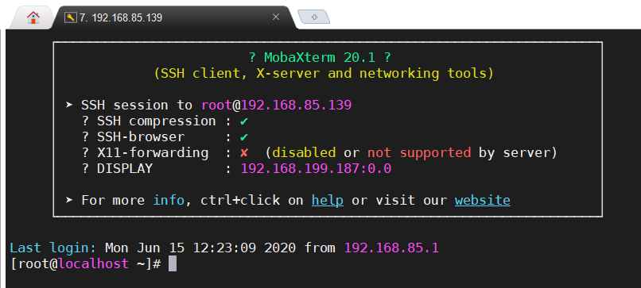
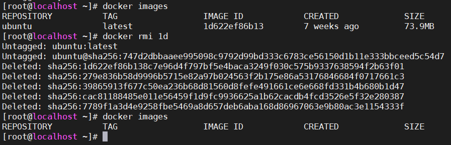
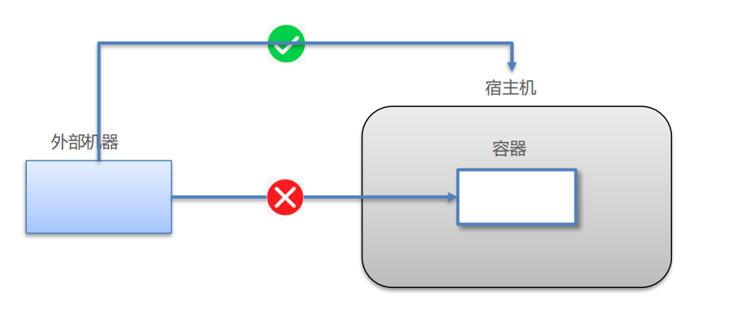

# Docker 概述  

我们写的代码会接触到好几个环境：开发环境、测试环境以及生产环境等等。多种环境去部署同一份代码，由于环境原因往往会出现**软件跨环境迁移的问题**（也就是**“水土”不服**）


针对这种问题如何解决？我们可以将工程及此工程依赖的所有软件打包到一个容器中统一部署


## 1.1 docker概念


* Docker 是一个开源的应用容器引擎
* 诞生于 2013 年初，基于 Go 语言实现， dotCloud 公司出品（后改名为Docker Inc）
* Docker 可以让开发者打包他们的应用以及依赖包到一个轻量级、可移植的容器中，然后发布到任何流行的 Linux 机器上。
* 容器是完全使用沙箱机制，相互隔离
* 容器性能开销极低。
* Docker 从 17.03 版本之后分为 CE（Community Edition: 社区版） 和 EE（Enterprise Edition: 企业版）


## 1.2 安装Docker

​		Docker在主流的操作系统和云平台上都可以使用，推荐使用Linux操作系统来运行Docker，因为Linux系统对Docker的支持是原生的，使用体验最好。企业中大多使用CentOS系统，建议安装CentOS7及以上版本。

### 1.2.1 在 VMware Workstation 中安装 CentOS7  

在Windows下安装VMware Workstation，如果是Win10系统，推荐使用15.5以上版本，下载地址：

```markd
链接：https://pan.baidu.com/s/1AfGGkGZy7OzSUj41gP_lpQ 
提取码：hvsj
```

可以自己安装CentOS7镜像，下载地址：

```markdown
链接：https://pan.baidu.com/s/1BqZs2G55ijpMtSLVAxXfgQ 
提取码：5i03 
```

也可以直接使用安装好的镜像文件：

```markdown
链接：https://pan.baidu.com/s/1_E7TrPRnQ94aJspcQaMQwA 
提取码：5ymt
```

导入镜像文件步骤：

1. 将下载的压缩包解压到系统中

2. 在VMware Workstation 中选择 文件--打开  找到解压目录中的docker.vmx 文件，再点击打开

   

3. 这样就能导入镜像，点击开启此虚拟机就可以进入到CentOS系统中

   

4. 用户名/密码都是`root`

5. 输入`ip addr`查看IP地址

   

6.  使用SSH工具连接到虚拟机中，这里推荐使用MobaXterm，下载地址：

   ```markdown
   链接：https://pan.baidu.com/s/1b1y0-qmUUkNtOSe96TR6-Q 
   提取码：1uct
   ```

   打开MobaXterm，新建SSH连接

   

   

   编辑用户：

   

   输入用户名root 和 密码 root 登录（首次登录需要使用密码）

   

   登录成功：

   

   

### 1.2.2 CentOS中安装Docker

```shell
# step 1: 安装必要的一些系统工具
sudo yum install -y yum-utils device-mapper-persistent-data lvm2
# Step 2: 添加软件源信息
sudo yum-config-manager --add-repo http://mirrors.aliyun.com/docker-ce/linux/centos/docker-ce.repo
# Step 3: 更新并安装 Docker-CE
sudo yum makecache fast
sudo yum -y install docker-ce
# Step 4: 开启Docker服务
sudo service docker start
# 查看docker状态
service docker status
# 查看docker版本
docker -v
# 停止docker服务
service docker stop
```


CentOS7默认开启了防火墙：

```shell
# 查看防火墙状态
service firewalld status
# 关闭防火墙 
service firewalld stop
# 防火墙随系统启动而自动启动，如果想设置不随系统启动
systemctl disable firewalld
```


### 1.2.3 配置国内镜像仓库

默认docker会连接到Docker Hub下载镜像，在国内访问速度比较慢，可以配置国内的镜像加速。

在阿里云注册账号，进入到控制台，找到容器镜像服务：


点击左侧镜像加速器


```shell
sudo mkdir -p /etc/docker
sudo tee /etc/docker/daemon.json <<-'EOF'
{
  "registry-mirrors": ["https://oo3555kc.mirror.aliyuncs.com"]
}
EOF
sudo systemctl daemon-reload
sudo systemctl restart docker
```

参考页面中的配置，重启docker即可。


## 1.3 核心概念

Docker架构


Docker的大部分操作都围绕着它的三大核心概念—镜像、容器和仓库而展开。

### 1.3.1 Docker镜像

​		Docker镜像类似于虚拟机镜像，可以将它理解为一个只读的模板。例如，一个镜像可以包含一个基本的操作系统环境，里面仅安装了 Apache应用程序（或用户需要的其他软件）可以把它称为一个 Apache镜像。
​		镜像是创建 Docker容器的基础。通过版本管理和增量的文件系统， Docker提供了一套十分简单的机制来创建和更新现有的镜像，用户甚至可以从网上下载一个已经做好的应用镜像，并直接使用。

### 1.3.2 Docker容器

​        镜像和容器的关系相当于类和对象的关系。

​		Docker容器类似于一个轻量级的沙箱， Docker利用容器来运行和隔离应用。容器是从镜像创建的应用运行实例。可以将其启动、开始、停止、删除，而这些容器都是彼此相互隔离的、互不可见的。
​		可以把容器看做是一个简易版的 Linux系统环境（包括root用户权限、进程空间、用户空间和网络空间等）以及运行在其中的应用程序打包而成的盒子。

### 1.3.3 Docker仓库

​		Docker仓库类似于代码仓库，它是 Docker集中存放镜像文件的场所。

​		根据所存储的镜像公开分享与否，仓库可以分为公开仓库（ Public）和私有仓库（ Private）两种形式。目前，最大的公开仓库是官方提供的 Docker Hub，其中存放了数量庞大的镜注册服务器像供用户下载。国内不少云服务提供商（如时速云、阿里云等）也提供了仓库的本地源，可以供稳定的国内访问。
​		当然，用户如果不希望公开分享自己的镜像文件， Docker也支持用户在本地网络内创建一个只能自己访问的私有仓库。当用户创建了自己的镜像之后就可以使用push命令将它上传到指定的公有或者私有仓库。这样用户下次在另外一台机器上使用该镜像时，只需要将其从仓库上pull下来就可以了。

# Docker 命令

## 2.1 进程相关命令

```shell
#启动docker服务:
systemctl start docker 
service docker start
#停止docker服务:
systemctl stop docker 
service docker stop
#重启docker服务:
systemctl restart docker
service docker restart
#查看docker服务状态:
systemctl status docker 
service docker status
#设置开机启动docker服务:
systemctl enable docker
```


## 2.2 镜像相关命令

### 2.2.1 查看本地镜像

```shell
docker images
```


镜像说明：

* REPOSITORY：镜像所在的仓库名称
* TAG：镜像标签，相当于版本
* IMAGE ID：镜像 ID
* CREATED：镜像的创建日期（不是获取该镜像的日期）
* SIZE：镜像大小  

### 2.2.2 搜索镜像

```shell
docker search 镜像名称
```

比如想要查找ubuntu，可以使用如下搜索

```shell
docker search ubuntu
```

结果会有很多


也可以在Docker Hub上搜索https://hub.docker.com/


比如搜索mysql


点击第一个镜像


### 2.2.3 获取镜像

格式

```shell
docker pull 镜像名称(NAME)：镜像标签(TAG)
```

如果不指定TAG，会默认选择最新的（latest)，比如下载上面的ubuntu

```shell
docker pull ubuntu
```


下载后再使用`docker images`查看


下载centos镜像

```shell
docker pull centos
docker pull centos:centos7
```


### 2.2.4 删除镜像

```shell
docker rmi 镜像名称:标签(镜像ID或部分ID)
```

示例：

```shell
docker rmi ubuntu:latest
```



## 2.3 容器相关命令

### 2.3.1 创建容器(了解)

格式

```shell
docker create 参数 镜像名称：标签
```

常用的参数如下：

* -d 是否在后台运行，以守护线程方式运行，默认为false
* -i 以交互式方式运行,保持标准输入打开，默认为false,一般与-t搭配使用
* -t 是否分配一个伪终端，默认为false,一般与-i搭配使用
* -p 指定如何映射到本地主机端口  -p xxx:yyy  xxx为宿主机端口  yyy为容器内部端口
* --name 指定容器的别名，启动多个时容器别名不能重复
* -e 使用参数

示例：

```shell
docker create -it  ubuntu
```


### 2.3.2 查看所有容器

查看所有已创建的容器

```shell
docker ps -a
```


### 2.3.3 启动容器

```shell
docker start 容器名称或容器ID（部分ID）
```


### 2.3.4 查看正在运行容器

```shell
docker ps
```


### 2.3.5 新建并启动容器

```shell
docker run 参数 镜像名称:Tag
```

等价于先执行`docker create`命令，再执行`docker start`命令

并且如果没有这个镜像,会先下载镜像

示例：

```shell
docker run -it --name=mylinux ubuntu
```

会启动一个ubuntu，可以输入命令`exit`退出。

以守护线程方式运行：

```shell
docker run -d ubuntu
```

### 2.3.6 进入容器

```shell
docker exec 参数 容器名称或容器ID 执行命令
```

主要参数：

* -i 打开标准输入接受用户输入命令
* -t 分配伪终端

示例：

```shell
# 进入到容器中，并启动一个bash
docker exec -it 9b /bin/bash
```

同样输入`exit`退出容器。

### 2.3.7 终止容器

```shell
docker stop 容器名称或容器ID
```

示例：

```shell
docker stop mylinux
```


### 2.3.8 删除容器

```shell
docker rm 容器名称或容器ID
```

示例：

```shell
docker rm mylinux
```

### 2.3.9 查看容器信息(了解)

```shell
docker inspect 容器名称或容器ID
```


# 应用部署

## 3.1 数据卷(了解)

### 3.1.1 数据卷概念

思考：

• Docker 容器删除后，在容器中产生的数据也会随之销毁 

• Docker 容器和外部机器可以直接交换文件吗？ 

• 容器之间想要进行数据交互？



**数据卷**

* 数据卷是宿主机中的一个目录或文件
* 当容器目录和数据卷目录绑定后，对方的修改会立即同步
* 一个数据卷可以被多个容器同时挂载
* 一个容器也可以挂载多个数据卷


**数据卷的作用**

• 容器数据持久化 

• **外部机器和容器间接通信** 

• 容器之间数据交换 


### 3.1.2 配置数据卷

**创建启动容器时，使用 –v 参数 设置数据卷**

~~~shell
docker run ... –v 宿主机目录(文件):容器内目录(文件) ...
~~~

**注意事项：** 

1. 目录必须是绝对路径 
2. 一个容器可以挂载多个数据卷
3. 一个数据卷也可以被多个容器挂载
4. 如果容器中出现无法写入的情况,需要设置目录权限`chmod 777 目录名`


示例:

```shell
# 在宿主机中创建目录
mkdir -p /opt/test
# 进入目录
cd /opt/test
# 在目录中添加文件,可以写入任意内容
vi 1.txt
# 启动centos容器
docker run -it -v /opt/test/:/opt/test/ centos:centos7
```

启动后在容器中可以看到test目录和1.txt,在宿主机中修改1.txt也会同步到容器中.


## 3.2 Tomcat

可以在Docker Hub中搜索tomcat，找到对应的tomcat版本和JDK版本


```shell
# 下载镜像
docker pull tomcat
# 创建tomcat目录
mkdir -p /opt/docker/tomcat/ROOT
cd /opt/docker/tomcat/ROOT
# 创建index.html文件
vim index.html
# 写入简单内容
<html>
	<h1>Hello Tomcat in Docker!</h1>
</html>

```

启动容器

```shell
docker run -d -p 8080:8080 -v /opt/docker/tomcat:/usr/local/tomcat/webapps tomcat 
```

参数说明:

* **-p 8080:8080：**将容器的8080端口映射到主机的8080端口,格式 XXX:YYY,前面的X指的是宿主机的端口,后面的Y指的是容器中的端口
* **-v /opt/docker/tomcat:/usr/local/tomcat/webapps**将主机中/opt/docker/tomcat目录挂载到容器的webapps

用浏览器打开8080端口


进入容器查看

```shell
docker exec -it 67 /bin/bash
# 进入tomcat目录
cd /usr/local/tomcat/webapps
```

可以发现宿主机中的文件已经加载到容器中了:


## 3.3 Nginx

```shell
docker run -d -p 80:80 nginx
```

使用浏览器访问虚拟机地址


## 3.4 Redis

```shell
docker run -d -p 6379:6379 redis
```

可以使用Redis客户端工具连接


连接成功可以看到服务器信息


测试命令：


## :reminder_ribbon:经验分享

### 1.启动redis报错

> 启动命令

```shell
docker run -d -p 6379:6379 redis
```

### 2.出现的问题

启动后报如下错误：


### 3.问题的分析

> 从错误信息来看是端口已经被占用了，可能是之前已经运行了redis


###  4.问题解决办法

> 解决方案

检查端口占用情况

```shell
netstat -nlp|grep 6379
```

如果没有找到netstat命令,可以安装

```shell
yum -y install net-tools
```


可以看到已经有一个docker容器了


查看运行的docker容器

```shell
docker ps
```


## 3.5 MySQL

企业中用得最多的是MySQL 5.7 版本

```shell
# MYSQL_ROOT_PASSWORD是设置默认登录用户名和密码都是root
docker run -d -p 3306:3306 -e MYSQL_ROOT_PASSWORD=root centos/mysql-57-centos7
```

通过客户端连接


部署数据卷

```shell
# 添加目录
mkdir /opt/mysql/data
# 添加权限
chomod -R /opt/mysql/data
# 启动应用
docker run -d -p 3306:3306 -v /opt/mysql/data/:/var/lib/mysql/data/ -e MYSQL_ROOT_PASSWORD=root centos/mysql-57-centos7
```


# 制作镜像  

## 4.1 镜像原理(了解)

思考：

1. Docker 镜像本质是什么？
   是一个分层文件系统

2. Docker 中一个centos镜像为什么只有200MB，而一个centos操作系统的iso文件要几个G ?

   Centos的iso镜像文件包含bootfs和rootfs，而docker的centos镜像复用操作系统的bootfs，只有rootfs和其他镜像层

3. Docker 中一个tomcat镜像为什么有600MB，而一个tomcat安装包只有10多MB? 

   由于docker中镜像是分层的，tomcat虽然只有10多MB，但他需要依赖于父镜像和基础镜像，所有整个对外暴露的tomcat镜像大小600多MB


**镜像原理**


## 4.2 基于已有容器创建

```shell
docker commit [OPTIONS] 容器名称或ID [镜像名称[:TAG]]
```

Options:
  -a, --author string    作者信息
  -c, --change list      使用Dockerfile创建
  -m, --message string   提交信息
  -p, --pause            提交时暂停容器运行

使用上面的MySQL容器创建镜像：

```shell
docker commit 7c mysqltest:1.0
```

查看镜像：


启动容器：

```shell
docker run -d -p 3306:3306  mysqltest:1.0
```

## 4.3 使用Dockerfile创建镜像

Dockerfile是一个文件，内容由一行行命令语句组成，主要分为四个部分：基础镜像信息、维护者信息、镜像操作指令和容器启动时执行指令。


### 4.3.1 指令说明

| 指令       | 说明                                                         |
| ---------- | ------------------------------------------------------------ |
| FROM       | 指定所创建镜像的基础镜像                                     |
| MAINTAINER | 维护者信息                                                   |
| RUN        | 运行命令                                                     |
| CMD        | 启动容器时默认执行命令                                       |
| LABEL      | 标签信息                                                     |
| EXPOSE     | 声明镜像内服务所监听的端口                                   |
| ENV        | 环境变量                                                     |
| ADD        | 复制指<src>定路径下的内容到容器中的<dest>路径下，<src>可以为URL，也可以是文件路径，如果为tar文件，会自动解压 |
| COPY       | 复制宿主机的<src>定路径下的内容到容器中的<dest>路径下        |
| USER       | 运行容器时的用户名                                           |
| WORKDIR    | 配置工作目录                                                 |
| ARG        | 指定镜像内使用的参数                                         |

### 4.3.2 构建应用

需求: 构建一个Web应用,通过docker来运行.

步骤: 

```markdown
1. 使用SpringBoot搭建应用
2. 将应用打包成jar包
3. 将jar包上传到Linux服务器
4. 构建dockerfile文件
```


快速构建一个Spring Boot web应用，提供一个REST接口

```java
@RestController
public class HelloController {
    @GetMapping("/hello")
    public String hello(){
        return "Hello Docker!";
    }
}
```

打包后上传到虚拟机`/opt/app`目录


### 4.3.3 创建Dockerfile文件

```shell
vi Dockerfile
```

编辑内容如下：

```shell
# Spring Boot 运行需要依赖java
FROM java:8
# 作者
MAINTAINER itheima
# 复制jar包到容器中
COPY docker-demo-0.0.1-SNAPSHOT.jar docker-demo-0.0.1-SNAPSHOT.jar
# 运行命令
CMD java -jar docker-demo-0.0.1-SNAPSHOT.jar
```

### 4.3.4 创建镜像

编写完成Dockerfile后，可以通过以下命令来创建镜像：

```shell
docker build [OPTIONS]
```

主要参数如下：

* -f 指定Dockerfile路径，默认为当前目录
* -t 指定生成镜像的标签信息

示例：

```shell
# 最后的.表示当前目录
docker build -t mywebapp:1.0 .
```

构建过程：


查看镜像


启动镜像

```shell
docker run -d -p 8080:8080 mywebapp:1.0
```

打开浏览器访问


# 服务编排  

​	Docker compose 是一个用于定义和运行多个 Docker 容器的编排工具。可以一条命令启动多个容器。

## 5.1 安装Compose

官方文档：https://docs.docker.com/compose/install/

查看系统环境变量

```shell
echo $PATH
```


```shell
# 下载Docker Compose
sudo curl -L "https://github.com/docker/compose/releases/download/1.26.0/docker-compose-$(uname -s)-$(uname -m)" -o /usr/local/bin/docker-compose
# 设置权限
sudo chmod +x /usr/local/bin/docker-compose
# 查看版本
docker-compose --version
```

需求: 使用上面的webapp,webapp需要连接redis

步骤:

```markdown
1. 修改代码,引入redis依赖
2. 配置redis地址
3. 添加一个新的接口,访问redis
4. 重新打包上传到宿主机
5. 重新构建镜像
6. 创建一个docker-compose.yml配置文件
7. 通过docker-compose 命令运行
```


## 5.2 创建Docker镜像

修改上面的工程，加入redis依赖

```xml
<dependency>
    <groupId>org.springframework.boot</groupId>
    <artifactId>spring-boot-starter-data-redis</artifactId>
</dependency>
```

配置文件添加redis地址

```properties
spring.redis.host=192.168.85.139
```

添加REST接口

```java
@RestController
public class HelloController {
    @GetMapping("/hello")
    public String hello(){
        return "Hello Docker!";
    }

    @Autowired
    StringRedisTemplate redisTemplate;
    @GetMapping("/redis")
    public String redis(){
        redisTemplate.opsForValue().set("name","tom");
        String name = redisTemplate.opsForValue().get("name");
        return name;
    }
}
```

修改Dockerfile

```shell
# Spring Boot 运行需要依赖java
FROM java:8
# 作者
MAINTAINER mcm
# 复制jar包到容器中
COPY docker-demo-0.0.1-SNAPSHOT.jar docker-demo-0.0.1-SNAPSHOT.jar
# 运行命令
CMD java -jar docker-demo-0.0.1-SNAPSHOT.jar
```

打包后按上面的Dockerfile创建方式重新构建镜像

```shell
docker build -t mywebapp:2.0 .
```

很快就能构建完成


## 5.3 编辑docker-compose.yml 文件

```shell
# 编辑docker-compose.yml 
vi docker-compose.yml 
```

内容如下：

```yml
version: '3'
services:
  web:
    image: mywebapp:2.0
    ports:
      - "8080:8080"
  redis:
    image: "redis"
    ports:
      - "6379:6379"
```

这里定义了两个服务，一个是web应用，一个是redis

## 5.4 使用Compose启动

docker-compose 命令：

```shell
docker-compose [-f <arg>...] [options] [COMMAND] [ARGS...]
```

构建并启动示例：

```shell
# 自动完成构建镜像、创建服务、启动服务 -d 表示后台运行
docker-compose up -d
```


停止服务

```shell
docker-compose stop
```


打开浏览器访问页面：


# 私有仓库  

## 6.1 安装Docker Registry

```shell
# 下载镜像
docker pull registry
# 启动容器
docker run -d -p 5000:5000 --restart always --name=registry registry
```

## 6.2 上传镜像

给要上传到私服的镜像打上标签：

```shell
docker tag 镜像名称 私服IP:5000/镜像名称
```

示例：

```shell
docker tag redis 127.0.0.1:5000/redis
```


上传镜像到私服：

```shell
docker push 127.0.0.1:5000/redis
```


## 6.3 下载镜像

可以先将本地的镜像删除

```shell
docker rmi 127.0.0.1:5000/redis
```

这里可以看到我们删除的只是tag，redis的原始镜像还在


接下来从私服拉取镜像

```shell
docker pull 127.0.0.1:5000/redisl
```


# 总结

容器就是将软件打包成标准化单元，以用于开发、交付和部署。

* 容器镜像是轻量的、可执行的独立软件包 ，包含软件运行所需的所有内容：代码、运行时环境、系统工具、系统库和设置。
* 容器化软件在任何环境中都能够始终如一地运行。
* 容器赋予了软件独立性，使其免受外在环境差异的影响，从而有助于减少团队间在相同基础设施上运行不同软件时的冲突。


**docker与虚拟机比较**


相同：

* 容器和虚拟机具有相似的资源隔离和分配优势

不同：

* 容器虚拟化的是操作系统，虚拟机虚拟化的是硬件。

* 传统虚拟机可以运行不同的操作系统，容器只能运行同一类型操作系统

|              | Docker   | 虚拟机  |
| ------------ | -------- | ------- |
| 启动速度     | 秒级     | 分钟级  |
| 硬盘使用     | 一般为MB | 一般为G |
| CPU/内存消耗 | 少       | 多      |
| 支持数量     | 上百个   | 十几个  |
| 可视化管理   | 不成熟   | 成熟    |
