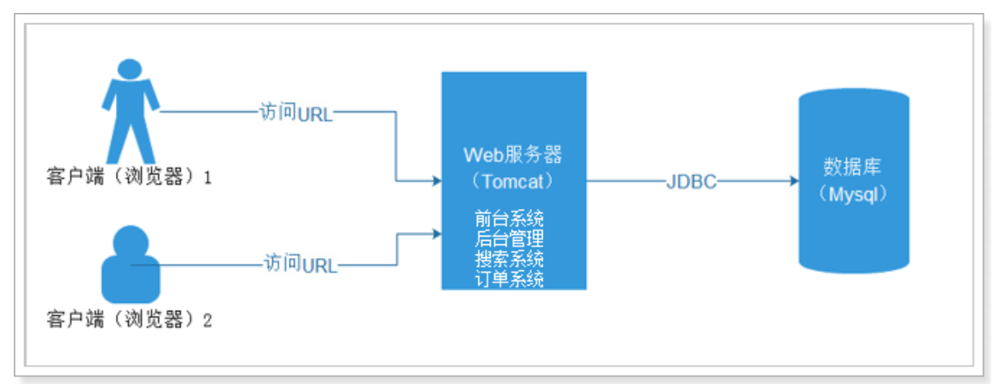
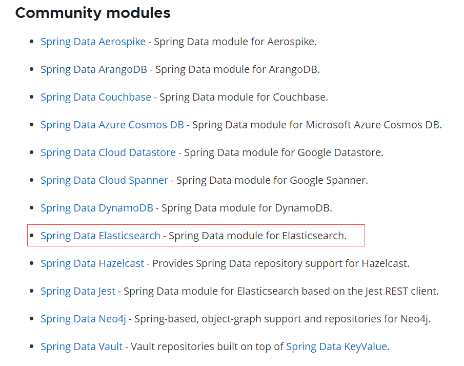
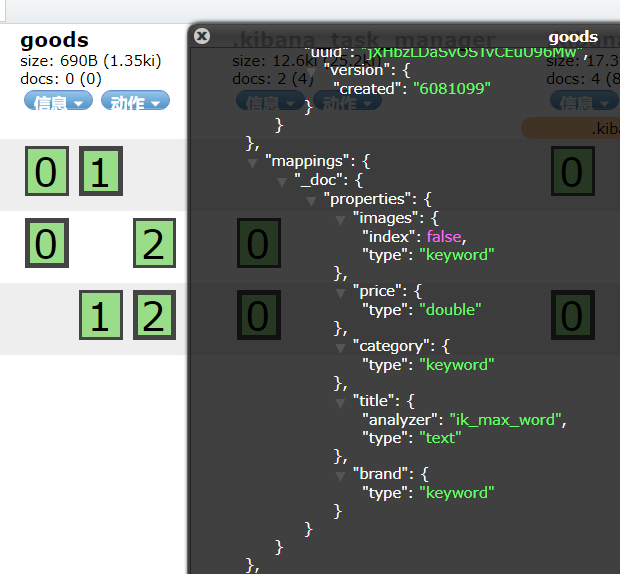

# 学习目标

* 了解集群和分布式的概念
* 了解部署elasticsearch集群
* 学习HighLevelRestClient操作ES
* 掌握SpringDataElasticsearch操作ES  

# 1 集群和分布式  

集群和分布式的概念有联系也有区别，我们一起来看。  

## 1.1 单点式服务的问题  

如图所示，是我们之前项目使用的架构方式，单点服务架构。整个服务使一个完整的项目，部署在一台
tomcat，使用一个mysql数据库：  


所有的请求，都由这一台服务器处理，存在很大风险：  

```markdown
A：并发处理能力有限。因为单服务器的性能有限制。所以单台Tomcat的最大连接数有限制，
B：容错率低，一旦服务器故障，整个服务就无法访问了。
	eBay于 1999年6月停机22小时的事故，中断了约230万的拍卖，使eBay的股票下降了9.2个百分点。
C：单台服务器计算能力低，无法完成复杂的海量数据计算。
```

如何解决这样的问题呢？那就需要使用计算机集群了。  

## 1.2 集群  

来看下维基百科对集群的介绍：  


集群是一组计算机高度紧密协作，完成计算工作。其中的每个计算机称为一个节点。根据这些计算机的协作方式不同或者目的不同，我们将集群分成三类：

* 高可用集群
* 负载均衡集群
* 科学计算集群（分布式处理）

上述几种集群方式并非必须独立使用，我们在系统架构时经常会组合使用。  

### 1.2.1 高可用集群  

High availability Cluster高可用群集，简称HAC。其设计思想是为了避免出现单点故障问题，在故障时
可以快速恢复，快速继续提供服务。  


如图所示，集群中两台计算机node01和node02，两者共享资源，处理业务也基本一致，互为主从。当node01工作时，node02就处于待命状态。所有业务在Node01上运行，若发生故障服务和资源会转移到Node02上。
这种架构保证了服务的高可用，但是闲置的节点是对资源的一种浪费。  

### 1.2.2 负载均衡集群  

Load Balancing负载均衡，集群中的每一台计算机都来完成相同业务，不分主次。当用户请求到达时，
通过某种算法，让请求均衡的分发到集群中的每个节点，充分利用每个节点的资源。如图所示：  


因为每个节点业务相同，如果某个节点出现故障，只需要把请求分发到其它节点即可。  

### 1.2.3 科学计算集群  

因为硬件设备的限制，单台计算机的处理性能是有上限的，如果计算需要的资源超过了单台计算机的能力，该怎么办呢？此时就可以使用科学计算集群。
我们把复杂任务拆分成一个个小的子任务，然后分配到集群中的不同节点上完成，最后再把计算结果汇总。这样大量低廉的PC机互联起来，组成一个"超级计算机"以解决复杂的计算任务。  


这样的方式也称为分布式运算或者分布式集群，集群中的每个节点完成不同任务。  

## 1.3 分布式web应用  

上述计算机协作的集群方式任何领域都可以使用，在web开发中也是如此，不过有一些细节的不同。我
们以一个电商网站为例，看看几种架构方式：  

### 1.3.1 单体应用  

所有业务在一个系统中完成：  



出现的问题：

* 系统庞大，功能耦合，难以维护
* 并发能力差，容易出现单点故障
* 无法针对不同功能进行优化  

### 1.3.2 分布式架构  

按照上面的分布式集群概念，集群中的每个节点完成不同业务。在web开发中也是如此，我们把完整系
统进行拆分，形成独立系统，然后部署到不同的tomcat节点，不同节点通过网络通信，相互协作。  


这样就将复杂系统细分，但是却带来了另一个问题，就是单个节点故障会导致整个系统不完整。  

### 1.3.3 高可用分布式集群架构  

为了解决上面所述的单点故障问题，我们可以为分布式系统中的每个节点都部署负载均衡节点，即：每
个业务系统都有一个负载均衡的小集群。  


# 2 Elasticsearch集群  

在之前的课程中，我们都是使用单点的elasticsearch，接下来我们会学习如何搭建Elasticsearch的集群。  

## 2.1 单点的问题  

单点的elasticsearch存在哪些可能出现的问题呢？

* 单台机器存储容量有限
* 单服务器容易出现单点故障，无法实现高可用
* 单服务的并发处理能力有限

所以，为了应对这些问题，我们需要对elasticsearch搭建集群  

## 2.2 集群的结构  

那么，到底该如何搭建集群呢？  

### 2.2.1 数据分片  

首先，我们面临的第一个问题就是数据量太大，单点存储量有限的问题。  

我们可以把数据拆分成多份，每一份存储到不同机器节点（node），从而实现减少每个节点数据量的目的。这就是数据的分布式存储，也叫做： 数据分片（Shard） 。  


### 2.2.2 数据备份  

数据分片解决了海量数据存储的问题，但是如果出现单点故障，那么分片数据就不再完整，这又该如何解决呢？  

没错，就像大家为了备份手机数据，会额外存储一份到移动硬盘一样。我们可以给每个分片数据进行备
份，存储到其它节点，防止数据丢失，这就是数据备份，也叫 数据副本（replica） 。  

数据备份可以保证高可用，但是每个分片备份一份，所需要的节点数量就会翻一倍，成本实在是太高了！
为了在高可用和成本间寻求平衡，我们可以这样做：

* 首先对数据分片，存储到不同节点
* 然后对每个分片进行备份，放到对方节点，完成互相备份

这样可以大大减少所需要的服务节点数量，如图，我们以3分片，每个分片备份一份为例：  


在这个集群中，如果出现单节点故障，并不会导致数据缺失，所以保证了集群的高可用，同时也减少了
节点中数据存储量。并且因为是多个节点存储数据，因此用户请求也会分发到不同服务器，并发能力也
得到了一定的提升。  

## 2.3 搭建集群  

集群需要多台机器，我们这里用一台机器来模拟，因此我们需要在一台机器中部署多个elasticsearch
节点，每个elasticsearch的端口都必须不一样。
我们计划集群名称为：my-elastic，部署3个elasticsearch节点，分别是：

* node-1：http端口9201，TCP端口9301,TCP端口是集群中节点相互通讯使用的端口
* node-2：http端口9202，TCP端口9302
* node-3：http端口9203，TCP端口9303  

### 2.3.1 Windows中搭建集群

在Windows下启动多个节点可以不用改配置,直接删除Data目录复制后启动多个就行.

复制`elasticsearch-6.2.4`目录 到`elasticsearch-6.2.4-node1`


进入到`elasticsearch-6.2.4-node1`，将其中的data目录先删除


修改config/elasticsearch.yml

```shell
# 集群名称
cluster.name: my-application
# 当前节点名称
node.name: node-1
# HTTP端口
http.port: 9201
# TCP通讯端口
transport.tcp.port: 9301
# 集群广播
discovery.zen.ping.unicast.hosts: ["localhost:9301", "localhost:9302","localhost:9303"]
# 主节点选取需要的节点数 一般需要超过半数的节点认可  3/2+1=2
discovery.zen.minimum_master_nodes: 2
```

将`elasticsearch-6.2.4-node1`复制到`elasticsearch-6.2.4-node2`，`elasticsearch-6.2.4-node3`

分别修改node2和node3中的配置文件

node2:

```shell
node.name: node-2
http.port: 9202
transport.tcp.port: 9302
```

node3:

```shell
node.name: node-3
http.port: 9203
transport.tcp.port: 9303
```

分别启动3台节点

```shell
bin/elasitsearch.bat
```

通过es-head查看


通过kibana连接，需要配置kibana.yml

```shell
elasticsearch.url: "http://localhost:9201"
```


### 2.3.2 CentOS中搭建ES集群

```shell
# 下载elasticsearch-6.8.10.tar.gz到/opt/soft 目录
# 解压
tar xzf elasticsearch-6.8.10.tar.gz
cd elasticsearch-6.8.10
# 复制分词器
cp -r /usr/share/elasticsearch/plugins/ik/ /opt/soft/elasticsearch-6.8.10/plugins/
# 创建ES数据和日志存储目录
mkdir -p /opt/elastic/data/node1 && mkdir -p /opt/elastic/logs/node1
# 修改config中的配置文件
vi config/elasticsearch.yml
# 集群的名称
cluster.name: my-cluster
#当前节点名称
node.name: node-1
#数据的存放路径
path.data: /opt/elastic/data/node2/
#日志的存放路径
path.logs: /opt/elastic/logs/node2/
network.host: 192.168.85.135
# http协议的对外端口
http.port: 9201
# TCP协议对外端口
transport.tcp.port: 9301
#三个节点相互发现
discovery.zen.ping.unicast.hosts: ["192.168.85.135:9301", "192.168.85.135:9302", "192.168.85.135:9303"]
# 声明大于几个的投票主节点有效，请设置为（nodes / 2） + 1
discovery.zen.minimum_master_nodes: 2

# 将elasticsearch-6.8.10目录复制两份
cp -r elasticsearch-6.8.10 elasticsearch-6.8.10-node2
cp -r elasticsearch-6.8.10 elasticsearch-6.8.10-node3

# 修改node2目录中的配置文件
vim elasticsearch-6.8.10-node2/config/elasticsearch.yml
node.name: node-2
path.data: /opt/elastic/data/node2/
path.logs: /opt/elastic/logs/node2/
network.host: 192.168.85.135
http.port: 9202
transport.tcp.port: 9302
discovery.zen.ping.unicast.hosts: ["192.168.85.135:9301", "192.168.85.135:9302", "192.168.85.135:9303"]
discovery.zen.minimum_master_nodes: 2
# 修改node2目录中的配置文件
node.name: node-3
path.data: /opt/elastic/data/node3/
path.logs: /opt/elastic/logs/node3/
network.host: 192.168.85.135
http.port: 9203
transport.tcp.port: 9303
discovery.zen.ping.unicast.hosts: ["192.168.85.135:9301", "192.168.85.135:9302"，"192.168.85.135:9303" ]
discovery.zen.minimum_master_nodes: 2
# 设置系统参数
vim /etc/security/limits.conf
elastic soft    nofile  65536
elastic hard    nofile  65536
# ES为了安全，默认不允许使用root用户启动，需要添加用户
groupadd elastic
useradd elastic -g elastic -p elastic
# 修改相应目录的权限
chown -R elastic:elastic /opt/soft/elasticsearch-6.8.10
chown -R elastic:elastic /opt/soft/elasticsearch-6.8.10-node2
chown -R elastic:elastic /opt/soft/elasticsearch-6.8.10-node3
chown -R elastic:elastic /opt/elastic
# 开启防火墙
firewall-cmd --zone=public --add-port=9201/tcp --permanent
firewall-cmd --zone=public --add-port=9202/tcp --permanent
firewall-cmd --zone=public --add-port=9203/tcp --permanent
firewall-cmd --zone=public --add-port=9301/tcp --permanent
firewall-cmd --zone=public --add-port=9302/tcp --permanent
firewall-cmd --zone=public --add-port=9303/tcp --permanent
firewall-cmd --reload 
# 切换到新用户
su elastic
# 启动3个节点
bin/elasticsearch
# 如果想要在后台启动，可以使用如下命令
bin/elasticsearch -d
# 通过JPS命令查看运行PID
jps
# 创建集群启动脚本
echo "/opt/soft/elasticsearch-6.8.10/bin/elasticsearch -d" >> startCluster.sh
echo "/opt/soft/elasticsearch-6.8.10-node2/bin/elasticsearch -d" >> startCluster.sh
echo "/opt/soft/elasticsearch-6.8.10-node3/bin/elasticsearch -d" >> startCluster.sh
# 修改脚本执行权限
chmod 777 startCluster.sh
# 使用脚本启动集群
./startCluster.sh
```

通过Head查看状态


修改kibana，连接到集群

```shell
vi /etc/kibana/kibana.yml
elasticsearch.hosts: ["http://192.168.85.135:9201","http://192.168.85.135:9202","http://192.168.85.135:9203"]
# 重新启动kibana
bin/kibana
```


## 2.4 测试集群中创建索引库  


搭建集群以后就要创建索引库了，那么问题来了，当我们创建一个索引库后，数据会保存到哪个服务节
点上呢？如果我们对索引库分片，那么每个片会在哪个节点呢？  

创建索引库：

```http
PUT heima
{
  "settings": {
    "number_of_shards": 3,
    "number_of_replicas": 1
  }
}
```

这里有两个配置：

* number_of_shards：分片数量，这里设置为3
* number_of_replicas：副本数量，这里设置为1，每个分片一个备份，一个原始数据，共2份。  

通过chrome浏览器的head查看，我们可以查看到分片的存储结构：  


可以看到，heima这个索引库，有三个分片，分别是0、1、2，每个分片有1个副本，共6份。

* node-1上保存了2号分片和1号分片的副本
* node-2上保存了1号分片和0号分片的副本
* node-3上保存了0号分片和2号分片的副本  

# 3 Elasticsearch客户端  

## 3.1 客户端介绍  

在elasticsearch官网中提供了各种语言的客户端：  

https://www.elastic.co/guide/en/elasticsearch/client/index.html


选择Java REST Client

选择 Java High Level Rest Client 版本，这里有使用的API


## 3.2 客户端工程搭建

创建工程es-high-level-demo，添加pom依赖

```xml
<parent>
    <groupId>org.springframework.boot</groupId>
    <artifactId>spring-boot-starter-parent</artifactId>
    <version>2.1.3.RELEASE</version>
    <relativePath/> <!-- lookup parent from repository -->
</parent>
<properties>
    <java.version>1.8</java.version>
</properties>
<dependencies>
    <dependency>
        <groupId>org.springframework.boot</groupId>
        <artifactId>spring-boot-starter</artifactId>
    </dependency>
    <dependency>
        <groupId>org.projectlombok</groupId>
        <artifactId>lombok</artifactId>
        <optional>true</optional>
    </dependency>
    <dependency>
        <groupId>org.elasticsearch.client</groupId>
        <artifactId>elasticsearch-rest-high-level-client</artifactId>
        <version>6.2.4</version>
    </dependency>
    <dependency>
        <groupId>org.elasticsearch</groupId>
        <artifactId>elasticsearch</artifactId>
        <version>6.2.4</version>
    </dependency>
    <dependency>
        <groupId>org.elasticsearch.client</groupId>
        <artifactId>elasticsearch-rest-client</artifactId>
        <version>6.2.4</version>
    </dependency>
    <dependency>
        <groupId>com.alibaba</groupId>
        <artifactId>fastjson</artifactId>
        <version>1.2.70</version>
    </dependency>
    <dependency>
        <groupId>org.springframework.boot</groupId>
        <artifactId>spring-boot-starter-test</artifactId>
        <scope>test</scope>
    </dependency>
</dependencies>
<build>
    <plugins>
        <plugin>
            <groupId>org.springframework.boot</groupId>
            <artifactId>spring-boot-maven-plugin</artifactId>
        </plugin>
    </plugins>
</build>
```

添加启动类

```java
@SpringBootApplication
public class EsDemoApplication {

    public static void main(String[] args) {
        SpringApplication.run(EsDemoApplication.class, args);
    }

}
```

添加配置文件application.yml

## 3.3 索引库及映射  

创建索引库的同时，我们也会创建type及其映射关系，但是这些操作不建议使用java客户端完成，原因如下：

* 索引库和映射往往是初始化时完成，不需要频繁操作，不如提前配置好

* 官方提供的创建索引库及映射API非常繁琐，需要通过字符串拼接json结构：  

  ```http
  request.mapping(
          "{\n" +
          "  \"properties\": {\n" +
          "    \"message\": {\n" +
          "      \"type\": \"text\"\n" +
          "    }\n" +
          "  }\n" +
          "}", 
          XContentType.JSON);
  ```

  

因此，这些操作建议还是使用Rest风格API去实现。
我们接下来以这样一个商品数据为例来创建索引库：  

新增实体类：

```java
import lombok.AllArgsConstructor;
import lombok.Data;
import lombok.NoArgsConstructor;

@Data
@NoArgsConstructor
@AllArgsConstructor
public class Item {
    private Long id;
    private String title; //标题
    private String category;// 分类
    private String brand; // 品牌
    private Double price; // 价格
    private String images; // 图片地址
}
```

分析一下数据结构：

* id：可以认为是主键，将来判断数据是否重复的标示，不分词，可以使用keyword类型
* title：搜索字段，需要分词，可以用text类型
* category：商品分类，这个是整体，不分词，可以使用keyword类型
* brand：品牌，与分类类似，不分词，可以使用keyword类型
* price：价格，这个是double类型
* images：图片，用来展示的字段，不搜索，index为false，不分词，可以使用keyword类型  

我们可以编写这样的映射配置：  

```http
PUT /item
{
  "settings": {
    "number_of_shards": 3,
    "number_of_replicas": 1
  },
  "mappings": {
    "_doc": {
      "properties": {
        "id": {
          "type": "keyword"
        },
        "title": {
          "type": "text",
          "analyzer": "ik_max_word"
        },
        "category": {
          "type": "keyword"
        },
        "brand": {
          "type": "keyword"
        },
        "images": {
          "type": "keyword",
          "index": false
        },
        "price": {
          "type": "double"
        }
      }
    }
  }
}
```

查看添加结果


## 3.4 文档操作  

### 3.4.1 初始化客户端  

完成任何操作都需要通过HighLevelRestClient客户端  

```java
@RunWith(SpringRunner.class)
@SpringBootTest
class EsDemoApplicationTests {

    RestHighLevelClient client;

    @Before
    void init() {
        client = new RestHighLevelClient(RestClient.builder(
                new HttpHost("192.168.85.135",9201,"http"),
                new HttpHost("192.168.85.135",9202,"http"),
                new HttpHost("192.168.85.135",9203,"http")
        ));
    }
    @After
    void close() throws IOException {
        client.close();
    }

}
```

### 3.4.2 新增文档

文档：https://www.elastic.co/guide/en/elasticsearch/client/java-rest/6.8/java-rest-high-document-index.html

示例：

```java
// 新增文档
@Test
void add() throws IOException {
    // 准备文档
    Item item = new Item(1L, "小米手机9", "手机",
            "小米", 3499.00, "http://image.leyou.com/13123.jpg");
    // 将对象转换为Json
    String json = JSON.toJSONString(item);
    // 创建索引请求 参数为： 索引库名   类型名  文档ID
    IndexRequest request = new IndexRequest("item", "_doc", item.getId().toString());
    // 将Json格式的数据放入到请求中
    request.source(json, XContentType.JSON);
    // 发送请求
    IndexResponse response = client.index(request);
    // 打印结果
    System.out.println("结果为：" + response);
}
```


响应：

```markdown
response = IndexResponse[index=item,type=docs,id=1,version=1,result=created,seqNo=0,primaryTerm=1,shards={"total":2,"successful":2,"failed":0}]
```

### 3.4.3 查看文档

示例：

```java
// 根据ID获取文档
@Test
void get() throws IOException {
    // 创建get请求对象 参数为： 索引库名   类型名  文档ID
    GetRequest request = new GetRequest("item","_doc","1");
    // 发送请求
    GetResponse response = client.get(request);
    // 解析结果 结果为Json
    String source = response.getSourceAsString();
    // 将Json数据转换为对象 参数为： Json字符串  类的字节码
    Item item = JSON.parseObject(source, Item.class);
    // 打印结果
    System.out.println(item);
}
```

### 3.4.4 更新文档

示例：

```java
// 根据ID更新文档
@Test
void update() throws IOException{
    // 准备文档
    Item item = new Item(1L, "小米手机9", "手机",
            "小米", 3699.00, "http://image.leyou.com/13123.jpg");
    // 将对象转换为Json
    String json = JSON.toJSONString(item);
    // 创建Update请求对象 参数为： 索引库名   类型名  文档ID
    UpdateRequest request = new UpdateRequest("item","_doc","1");
    // 将Json格式的数据放入到请求中
    request.doc(json,XContentType.JSON);
    // 发送请求
    UpdateResponse response = client.update(request);
    // 打印结果
    System.out.println("结果为：" + response);
}
```

### 3.4.5 删除文档

示例：

```java
// 根据ID删除文档
@Test
void delete() throws IOException {
    // 创建Delete请求对象 参数为： 索引库名   类型名  文档ID
    DeleteRequest request = new DeleteRequest("item","_doc","1");
    // 发送请求
    DeleteResponse response = client.delete(request);
    // 打印结果
    System.out.println("结果为：" + response);
}
```

### 3.4.6 批量新增  

示例:

```java
    // 批量插入
    @Test
    void bulkInsert() throws IOException {
        // 准备文档数据：
        List<Item> list = new ArrayList<>();
        list.add(new Item(1L, "小米手机7", "手机", "小米", 3299.00,
                "http://image.leyou.com/13123.jpg"));
        list.add(new Item(2L, "坚果手机R1", "手机", "锤子", 3699.00,
                "http://image.leyou.com/13123.jpg"));
        list.add(new Item(3L, "华为META10", "手机", "华为", 4499.00,
                "http://image.leyou.com/13123.jpg"));
        list.add(new Item(4L, "小米Mix2S", "手机", "小米", 4299.00,
                "http://image.leyou.com/13123.jpg"));
        list.add(new Item(5L, "荣耀V10", "手机", "华为", 2799.00,
                "http://image.leyou.com/13123.jpg"));
        // 创建批量新增请求
        BulkRequest request = new BulkRequest();
        // 遍历集合
        for (Item item : list) {
            // 将索引请求添加到批量请求对象中
            request.add(new IndexRequest("item", "_doc", item.getId().toString())
                    .source(JSON.toJSONString(item), XContentType.JSON));
        }
        // 发送请求
        BulkResponse response = client.bulk(request);
        // 打印结果
        System.out.println("结果为：" + response);
    }
```

## 3.5 文档搜索

### 3.5.1 查询所有match_all  

示例：

```java
    /**
     * 查询文档
     *
     * @throws IOException
     */
    @Test
    public void searchDoc() throws IOException {
        // 创建查询请求对象 指定查询的索引名称
        SearchRequest request = new SearchRequest("item");
        // 指定查询的源
        SearchSourceBuilder sourceBuilder = new SearchSourceBuilder();
        // 构建查询条件
        QueryBuilder query = QueryBuilders.matchAllQuery(); // 查询的是所有的文档

        // 添加查询条件
        sourceBuilder.query(query);

        // 添加查询源
        request.source(sourceBuilder);
        // 发送请求
        SearchResponse response = client.search(request);
        // 分析响应结果
        // 返回命中的数据对象
        SearchHits searchHits = response.getHits();
        // 获取命中的文档个数
        long totalHits = searchHits.totalHits;
        System.out.println("命中的文档个数为: " + totalHits);
        // 获取命中的数据
        SearchHit[] hits = searchHits.getHits();
        // 遍历数组
        for (SearchHit hit : hits) {
            String sourceAsString = hit.getSourceAsString();
            // 转换成对象
            Item item = JSON.parseObject(sourceAsString, Item.class);
            System.out.println(item);
        }
    }
```

​		上面的代码中，搜索条件是通过 sourceBuilder.query(QueryBuilders.matchAllQuery())来添加的。这个 query() 方法接受的参数是： QueryBuilder 接口类型。  

​		这个接口提供了很多实现类，分别对应我们在之前中学习的不同类型的查询，例如：term查询、match查询、range查询、boolean查询等  

​		因此，我们如果要使用各种不同查询，其实仅仅是传递给 sourceBuilder.query() 方法的参数不同而已。而这些实现类不需要我们去 new ，官方提供了 QueryBuilders 工厂帮我们构建各种实现类  


### 3.5.2 关键字搜索match  

其实搜索类型的变化，仅仅是利用QueryBuilders构建的查询对象不同而已，其他代码基本一致：  

```java
// 使用match查询,参数为 1 查询的字段 2 查询的关键字
// QueryBuilder query = QueryBuilders.matchQuery("title","小米");
QueryBuilder query = QueryBuilders.matchQuery("title","小米手机");
```

### 3.5.3 关键字完全匹配term

```java
// 使用term查询,参数为 1 查询的字段 2 查询的关键字
// QueryBuilder query = QueryBuilders.termQuery("title","小米");
QueryBuilder query = QueryBuilders.termQuery("title","小米手机");
```


### 3.5.4 范围查询range  

支持下面的范围关键字：  

| 方法             | 说明     |
| ---------------- | -------- |
| gt(Object from)  | 大于     |
| gte(Object from) | 大于等于 |
| lt(Object from)  | 小于     |
| lte(Object from) | 小于等于 |

示例：  

```java
// 使用rangeQuery查询,参数为 查询的字段
QueryBuilder query = QueryBuilders.rangeQuery("price").gte(2000).lt(4000);  // 参数为： 查询的字段 后面是链式的调用
```

响应：

```markd
item = Item(id=2, title=坚果手机R1, category=手机, brand=锤子, price=3699.0, images=http://image.leyou.com/13123.jpg)
item = Item(id=5, title=荣耀V10, category=手机, brand=华为, price=2799.0, images=http://image.leyou.com/13123.jpg)
item = Item(id=1, title=小米手机7, category=手机, brand=小米, price=3299.0, images=http://image.leyou.com/13123.jpg)
```

### 3.5.5 source过滤  

默认情况下，索引库中所有数据都会返回，如果我们想只返回部分字段，可以通过fetchSource来控制。 

示例： 

```java
    /**
     * 查询文档
     *
     * @throws IOException
     */
    @Test
    public void searchDoc() throws IOException {
        // 创建查询请求对象 指定查询的索引名称
        SearchRequest request = new SearchRequest("item");
        // 指定查询的源
        SearchSourceBuilder sourceBuilder = new SearchSourceBuilder();
        // 构建查询条件
        // QueryBuilder query = QueryBuilders.matchAllQuery(); // 查询的是所有的文档

        // 使用match查询,参数为 1 查询的字段 2 查询的关键字
        // QueryBuilder query = QueryBuilders.matchQuery("title","小米");
        // QueryBuilder query = QueryBuilders.matchQuery("title","小米手机");

        // 使用term查询,参数为 1 查询的字段 2 查询的关键字
        // QueryBuilder query = QueryBuilders.termQuery("title","小米");
        // QueryBuilder query = QueryBuilders.termQuery("title","小米手机");

        // 使用rangeQuery查询,参数为 1 查询的字段
        QueryBuilder query = QueryBuilders.rangeQuery("price").gte(3000).lte(4000);

        // 添加查询条件
        sourceBuilder.query(query);

        // 添加过滤
        String[] includes = {"id", "title", "price"};
        String[] excludes = {};
        sourceBuilder.fetchSource(includes, excludes);

        // 添加查询源
        request.source(sourceBuilder);
        // 发送请求
        SearchResponse response = client.search(request);
        // 分析响应结果
        // 返回命中的数据对象
        SearchHits searchHits = response.getHits();
        // 获取命中的文档个数
        long totalHits = searchHits.totalHits;
        System.out.println("命中的文档个数为: " + totalHits);
        // 获取命中的数据
        SearchHit[] hits = searchHits.getHits();
        // 遍历数组
        for (SearchHit hit : hits) {
            String sourceAsString = hit.getSourceAsString();
            // 转换成对象
            Item item = JSON.parseObject(sourceAsString, Item.class);
            System.out.println(item);
        }
    }
```

### 3.5.6 排序  

示例：

```java
// 排序
searchSourceBuilder.sort("price", SortOrder.DESC);
// 搜索
SearchResponse response = client.search(request, RequestOptions.DEFAULT);
```

### 3.5.7 分页  

示例：

```java
// 分页
int current = 1;
int size = 2;
int start = (current - 1) * size;
searchSourceBuilder.from(start);
searchSourceBuilder.size(size);
// 搜索
SearchResponse response = client.search(request, RequestOptions.DEFAULT);
```

### 3.5.8 高亮  

示例：

```java
    @Test
    void testHighlight() throws IOException{
        // 创建搜索对象
        SearchRequest request = new SearchRequest();
        // 查询构建工具
        SearchSourceBuilder sourceBuilder = new SearchSourceBuilder();
        // 添加查询条件，通过QueryBuilders获取各种查询
        sourceBuilder.query(QueryBuilders.matchQuery("title", "小米手机"));
        // 高亮
        HighlightBuilder highlightBuilder = new HighlightBuilder()
                .field("title")
                .preTags("<em style='color:red'>")
                .postTags("</em>");
        sourceBuilder.highlighter(highlightBuilder);
        request.source(sourceBuilder);
        // 获取结果
        SearchResponse response = client.search(request, RequestOptions.DEFAULT);
        SearchHits hits = response.getHits();
        SearchHit[] hitList = hits.getHits();
        for (SearchHit hit : hitList) {
            // 获取高亮结果
            Map<String, HighlightField> fields = hit.getHighlightFields();
            // 取出标题
            HighlightField titleField = fields.get("title");
            // 拼接为字符串
            Text[] fragments = titleField.fragments();
            String title = fragments[0].string();
            // 获取其它字段
            Item item = JSON.parseObject(hit.getSourceAsString(), Item.class);
            // 覆盖title
            item.setTitle(title);
            System.out.println(item);
        }
    }
```

关键代码：

* 查询条件中添加高亮字段：  
  * new HighlightBuilder() ：创建高亮构建器  
  * .field("title") ：指定高亮字段  
  * .preTags("") 和 .postTags("") ：指定高亮的前置和后置标签  
* 解析高亮结果：  
  * hit.getHighlightFields(); 获取高亮结果

### 3.5.9 聚合  

再来试试聚合，我们这里以brand字段来聚合，看看有哪些品牌，每个品牌有多少数量。
聚合关键是弄清楚这几点：

* 聚合的字段是什么
* 聚合的类型是什么
* 给聚合起个名  

与查询类似，聚合条件通过 sourceBuilder.aggregation() 方法来设置，而参数是一个接口：
AggregationBuilder ，这个接口也有大量的实现类，代表不同的聚合种类。

同样，我们也不需要自己去new，官方提供了一个工厂帮我们创建实例：  


示例：

```java
    @Test
    void testAgg() throws IOException{
        // 创建搜索对象
        SearchRequest request = new SearchRequest();
        // 查询构建工具
        SearchSourceBuilder sourceBuilder = new SearchSourceBuilder();
        // 添加查询条件，通过QueryBuilders获取各种查询
        sourceBuilder.query(QueryBuilders.matchAllQuery());
        // 添加排序
        sourceBuilder.sort("price", SortOrder.ASC);
        // 配置size为0，因为不需要数据，只要聚合结果
        sourceBuilder.size(0);
        // 添加聚合
        sourceBuilder.aggregation(AggregationBuilders.terms("brandAgg").field("brand"));
        request.source(sourceBuilder);
        // 获取结果
        SearchResponse response = client.search(request, RequestOptions.DEFAULT);
        // 获取聚合结果
        Aggregations aggregations = response.getAggregations();
        // 获取某个聚合
        Terms terms = aggregations.get("brandAgg");
        // 获取桶
        for (Terms.Bucket bucket : terms.getBuckets()) {
            // 获取key，这里是品牌名称
            System.out.println("品牌 : " + bucket.getKeyAsString());
            // 获取docCount，就是数量
            System.out.println("count: " + bucket.getDocCount());
        }
    }
```

响应：

```markdown
品牌 : 华为
count: 2
品牌 : 小米
count: 2
品牌 : 锤子
count: 1
```

还可以在聚合中添加子聚合

示例：

```java
    @Test
    void testAgg() throws IOException {
        // 创建搜索对象
        SearchRequest request = new SearchRequest();
        // 查询构建工具
        SearchSourceBuilder sourceBuilder = new SearchSourceBuilder();
        // 添加查询条件，通过QueryBuilders获取各种查询
        sourceBuilder.query(QueryBuilders.matchAllQuery());
        // 添加排序
        sourceBuilder.sort("price", SortOrder.ASC);
        // 配置size为0，因为不需要数据，只要聚合结果
        sourceBuilder.size(0);
        // 在brand上使用聚合
        TermsAggregationBuilder termsAggregation = AggregationBuilders.terms("brandAgg").field("brand");
        // 添加子聚合
        termsAggregation.subAggregation(AggregationBuilders.avg("avgPrice").field("price"));
        sourceBuilder.aggregation(termsAggregation);
        request.source(sourceBuilder);
        // 获取结果
        SearchResponse response = client.search(request, RequestOptions.DEFAULT);
        // 获取聚合结果
        Aggregations aggregations = response.getAggregations();
        // 获取某个聚合
        Terms terms = aggregations.get("brandAgg");
        // 获取桶
        for (Terms.Bucket bucket : terms.getBuckets()) {
            // 获取key，这里是品牌名称
            System.out.println("品牌 : " + bucket.getKeyAsString());
            // 获取docCount，就是数量
            System.out.println("count: " + bucket.getDocCount());
            // 获取子聚合
            Avg avgPrice = bucket.getAggregations().get("avgPrice");
            System.out.println("均价：" + avgPrice.getValue());
        }
    }
```


响应：

```markdown
品牌 : 华为
count: 2
均价：3649.0
品牌 : 小米
count: 2
均价：3799.0
品牌 : 锤子
count: 1
均价：3699.0
```


# 4 SpringDataElasticsearch  

接下来我们学习Spring提供的elasticsearch组件：Spring Data Elasticsearch  

## 4.1 SpringDataElasticsearch简介

SpringDataElasticsearch（以后简称SDE）是Spring Data项目下的一个子模块。  

查看 Spring Data的官网：https://spring.io/projects/spring-data


Spring Data 的使命是给各种数据访问提供统一的编程接口，不管是关系型数据库（如MySQL），还是
非关系数据库（如Redis），或者类似Elasticsearch这样的索引数据库。从而简化开发人员的代码，提
高开发效率。
包含很多不同数据操作的模块：  




Spring Data Elasticsearch的页面：https://spring.io/projects/spring-data-elasticsearch


特征：

* 支持Spring的基于 @Configuration 的Java配置方式，或者XML配置方式
* 提供了用于操作ES的便捷工具类 ElasticsearchTemplate 。包括实现文档到POJO之间的自动智能映射。
* 利用Spring的数据转换服务实现的功能丰富的对象映射
* 基于注解的元数据映射方式，而且可扩展以支持更多不同的数据格式
* 根据持久层接口自动生成对应实现方法，无需人工编写基本操作代码（类似mybatis，根据接口自动得到实现）。当然，也支持人工定制查询  

版本关系：


这里需要注意，如果使用Spring Boot 2.3.X版本，Spring Data Elasticsearch 使用的是4.0.X，在4版本后很多API与ElasticSearch 6.X兼容性不是很好，所以要将Spring Boot的版本控制在2.1.X-2.2.X。

## 4.2 配置SpringDataElasticsearch  

官方文档：https://docs.spring.io/spring-data/elasticsearch/docs/3.0.1.RELEASE/reference/html/#reference

集成步骤：

1. 新建工程，添加依赖

   ```xml
   <parent>
       <groupId>org.springframework.boot</groupId>
       <artifactId>spring-boot-starter-parent</artifactId>
       <version>2.1.3.RELEASE</version>
       <relativePath/> <!-- lookup parent from repository -->
   </parent>
   <properties>
       <java.version>1.8</java.version>
   </properties>
   <dependencies>
       <dependency>
           <groupId>org.springframework.boot</groupId>
           <artifactId>spring-boot-starter-data-elasticsearch</artifactId>
       </dependency>
   
       <dependency>
           <groupId>org.projectlombok</groupId>
           <artifactId>lombok</artifactId>
           <optional>true</optional>
       </dependency>
       <dependency>
           <groupId>org.springframework.boot</groupId>
           <artifactId>spring-boot-starter-test</artifactId>
           <scope>test</scope>
       </dependency>
       <dependency>
           <groupId>com.alibaba</groupId>
           <artifactId>fastjson</artifactId>
           <version>1.2.70</version>
       </dependency>
   </dependencies>	
   ```

   

2. 配置文件中添加ES地址，需要注意的是，SpringDataElasticsearch  已经帮我们配置好了各种SDE配置，并且注册了一个ElasticsearchTemplate供我们使用。  ElasticsearchTemplate  底层使用的不是Elasticsearch提供的RestHighLevelClient，而是TransportClient，并不采用Http协议通信，而是访问elasticsearch对外开放的tcp端口，所以这里设置的端口是：9300 ，而不是9200

   ```yaml
   spring:
     data:
       elasticsearch:
         # ES 集群名称
         cluster-name: my-application
         # 这里使用的是TransportClient 连接的是TCP端口
         cluster-nodes: localhost:9300
   ```

3. 添加启动类

   ```java
   @SpringBootApplication
   public class EsDemoApplication {
   
       public static void main(String[] args) {
           SpringApplication.run(EsDemoApplication.class, args);
       }
   
   }
   ```

   

   

## 4.3 索引库操作

### 4.3.1 创建索引库

添加测试类，这里需要注意SpringBoot 2.1.X的测试类上需要添加`@RunWith(SpringRunner.class)`，注入`ElasticsearchTemplate`

```java
@RunWith(SpringRunner.class)
@SpringBootTest
public class EsDemoApplicationTests {
    @Autowired
	private ElasticsearchTemplate template;
}    
```

准备一个新的实体类  

```java
import lombok.AllArgsConstructor;
import lombok.Data;
import lombok.NoArgsConstructor;

@Data
@NoArgsConstructor
@AllArgsConstructor
public class Goods {
    private Long id;
    private String title; //标题
    private String category;// 分类
    private String brand; // 品牌
    private Double price; // 价格
    private String images; // 图片地址
}
```

创建索引库

```java
    /**
     * 创建索引
     */
    @Test
    void testCreateIndex(){
        boolean b = template.createIndex(Goods.class);
        System.out.println("结果为："+b);
    }
```

直接运行会报错，如下所示：


需要在实体上设置如下：

```java
@Data
@NoArgsConstructor
@AllArgsConstructor
@Document(indexName = "goods",type = "_doc",shards = 3, replicas = 1)
public class Goods {
    private Long id;
    private String title; //标题
    private String category;// 分类
    private String brand; // 品牌
    private Double price; // 价格
    private String images; // 图片地址
}
```

再次运行测试，可以成功创建索引，看一下索引信息


这里的mappings为空，再次更新实体

```java
@Data
@NoArgsConstructor
@AllArgsConstructor
@Document(indexName = "goods",type = "_doc",shards = 3, replicas = 1)
public class Goods {
    @Id
    private Long id;
    @Field(type = FieldType.Text, analyzer = "ik_max_word")
    private String title; //标题
    @Field(type = FieldType.Keyword)
    private String category;// 分类
    @Field(type = FieldType.Keyword)
    private String brand; // 品牌
    @Field(type = FieldType.Double)
    private Double price; // 价格
    @Field(type = FieldType.Keyword, index = false)
    private String images; // 图片地址
}
```

几个用到的注解：

* @Document：声明索引库配置
  * indexName：索引库名称
  * shards：分片数量，默认5
  * replicas：副本数量，默认1
* @Id：声明实体类的id
* @Field：声明字段属性
  * type：字段的数据类型
  * analyzer：指定分词器类型
  * index：是否创建索引  

### 4.3.2 创建映射  

刚才的注解已经把映射关系也配置上了，所以创建映射只需要这样：  

```java
/**
 * 创建类型映射
 */
@Test
public void testCreateMapping() {
    boolean b = template.putMapping(Goods.class);
    System.out.println("结果为：" + b);
}
```

查看索引信息



## 4.4 文档操作

可以使用`ElasticsearchTemplate`操作

新增文档

```java
@Test
public void add(){
    Goods goods = new Goods(1L,"小米手机10Pro","手机","小米",5999.00,"/images/123.jpg");
    IndexQuery query = new IndexQuery();
    query.setObject(goods);
    String index = template.index(query);
    System.out.println(index);
}
```

也可以使用ElasticsearchRepository来操作,使用更加的方便.


### 4.4.1ElasticsearchRepository

`ElasticsearchRepository`封装了基本的CRUD方法，可以通过继承`ElasticsearchRepository`来使用：

```java
public interface GoodsRepository extends ElasticsearchRepository<Goods,Long> {
}
```

`ElasticsearchRepository<T, ID>`中的T对应类型，ID对应主键类型。

### 4.4.2 新增文档

新增单个文档

```java
// 保存文档
@Test
public void testSave() {
    Goods item = new Goods(6L, "小米手机10Pro", " 手机",
            "小米", 4699.00, "http://image.leyou.com/13123.jpg");
    goodsRepository.save(item);
}
```

批量新增

```java
@Test
// 批量保存文档
public void addDocuments() {
    // 准备文档数据：
    List<Goods> list = new ArrayList<>();
    list.add(new Goods(1L, "小米手机7", "手机", "小米", 3299.00, "/13123.jpg"));
    list.add(new Goods(2L, "坚果手机R1", "手机", "锤子", 3699.00, "/13123.jpg"));
    list.add(new Goods(3L, "华为META10", "手机", "华为", 4499.00, "/13123.jpg"));
    list.add(new Goods(4L, "小米Mix2S", "手机", "小米", 4299.00, "/13123.jpg"));
    list.add(new Goods(5L, "荣耀V10", "手机", "华为", 2799.00, "/13123.jpg"));
    // 添加索引数据
    goodsRepository.saveAll(list);
}
```

### 4.4.3 查看文档

根据id查询

```java
// 根据id查询
@Test
public void testQueryById(){
    Optional<Goods> goodsOptional = goodsRepository.findById(3L);
    System.out.println(goodsOptional.orElse(null));
}
```

### 4.4.4 更新文档

```java
// 更新文档
@Test
public void testUpdate() {
    Goods item = new Goods(6L, "小米手机10Pro", " 手机",
            "小米", 4699.00, "http://image.leyou.com/13123.jpg");
    goodsRepository.save(item);
}
```

### 4.4.5 删除文档

根据id删除

```java
// 删除文档
@Test
public void testDelete(){
    goodsRepository.deleteById(6L);
}
```

### 4.4.6 查询所有

```java
// 查询所有
@Test
public void testQueryAll(){
    Iterable<Goods> list = goodsRepository.findAll();
    list.forEach(System.out::println);
}
```

### 4.4.7 自定义查询

GoodsRepository提供的查询方法有限，但是它却提供了非常强大的自定义查询功能：
只要遵循SpringData提供的语法，我们可以任意定义方法声明：  

```java
public interface GoodsRepository extends ElasticsearchRepository<Goods, Long> {
    /**
     * 根据价格区间查询
     * @param from 开始价格
     * @param to 结束价格
     * @return 符合条件的goods
     */
    List<Goods> findByPriceBetween(double from, double to);
    List<Goods> findByTitle(String title);
    List<Goods> findByBrand(String brand);
}
```

使用实例：

```java
// 范围查询
@Test
public void testConditionSearch(){
    List<Goods> list = goodsRepository.findByPriceBetween(3000, 4000);
    list.forEach(System.out::println);
}
@Test
public void testTitle(){
    // List<Goods> goods = goodsRepository.findByBrand("米");
    List<Goods> goods = goodsRepository.findByBrand("小米");
    goods.forEach(System.out::println);
}
```


支持的一些语法示例：  

| Keyword               | Sample                               | Elasticsearch Query String                                   |
| :-------------------- | :----------------------------------- | :----------------------------------------------------------- |
| `And`                 | `findByNameAndPrice`                 | `{"bool" : {"must" : [ {"field" : {"name" : "?"}}, {"field" : {"price" : "?"}} ]}}` |
| `Or`                  | `findByNameOrPrice`                  | `{"bool" : {"should" : [ {"field" : {"name" : "?"}}, {"field" : {"price" : "?"}} ]}}` |
| `Is`                  | `findByName`                         | `{"bool" : {"must" : {"field" : {"name" : "?"}}}}`           |
| `Not`                 | `findByNameNot`                      | `{"bool" : {"must_not" : {"field" : {"name" : "?"}}}}`       |
| `Between`             | `findByPriceBetween`                 | `{"bool" : {"must" : {"range" : {"price" : {"from" : ?,"to" : ?,"include_lower" : true,"include_upper" : true}}}}}` |
| `LessThanEqual`       | `findByPriceLessThan`                | `{"bool" : {"must" : {"range" : {"price" : {"from" : null,"to" : ?,"include_lower" : true,"include_upper" : true}}}}}` |
| `GreaterThanEqual`    | `findByPriceGreaterThan`             | `{"bool" : {"must" : {"range" : {"price" : {"from" : ?,"to" : null,"include_lower" : true,"include_upper" : true}}}}}` |
| `Before`              | `findByPriceBefore`                  | `{"bool" : {"must" : {"range" : {"price" : {"from" : null,"to" : ?,"include_lower" : true,"include_upper" : true}}}}}` |
| `After`               | `findByPriceAfter`                   | `{"bool" : {"must" : {"range" : {"price" : {"from" : ?,"to" : null,"include_lower" : true,"include_upper" : true}}}}}` |
| `Like`                | `findByNameLike`                     | `{"bool" : {"must" : {"field" : {"name" : {"query" : "?*","analyze_wildcard" : true}}}}}` |
| `StartingWith`        | `findByNameStartingWith`             | `{"bool" : {"must" : {"field" : {"name" : {"query" : "?*","analyze_wildcard" : true}}}}}` |
| `EndingWith`          | `findByNameEndingWith`               | `{"bool" : {"must" : {"field" : {"name" : {"query" : "*?","analyze_wildcard" : true}}}}}` |
| `Contains/Containing` | `findByNameContaining`               | `{"bool" : {"must" : {"field" : {"name" : {"query" : "**?**","analyze_wildcard" : true}}}}}` |
| `In`                  | `findByNameIn(Collectionnames)`      | `{"bool" : {"must" : {"bool" : {"should" : [ {"field" : {"name" : "?"}}, {"field" : {"name" : "?"}} ]}}}}` |
| `NotIn`               | `findByNameNotIn(Collectionnames)`   | `{"bool" : {"must_not" : {"bool" : {"should" : {"field" : {"name" : "?"}}}}}}` |
| `Near`                | `findByStoreNear`                    | `Not Supported Yet !`                                        |
| `True`                | `findByAvailableTrue`                | `{"bool" : {"must" : {"field" : {"available" : true}}}}`     |
| `False`               | `findByAvailableFalse`               | `{"bool" : {"must" : {"field" : {"available" : false}}}}`    |
| `OrderBy`             | `findByAvailableTrueOrderByNameDesc` | `{"sort" : [{ "name" : {"order" : "desc"} }],"bool" : {"must" : {"field" : {"available" : true}}}}` |


### 4.4.8 条件查询


```java
@Test
public void testSearch(){
    // QueryBuilder query = QueryBuilders.matchAllQuery();
    QueryBuilder query = QueryBuilders.matchQuery("title","小米");
    Iterable<Goods> goods = goodsRepository.search(query);
    goods.forEach(System.out::println);
}
```

### 4.4.9 分页查询

```java
@Test
public void testPage(){
    QueryBuilder query = QueryBuilders.matchAllQuery();
    // 设置分页 page是从0开始
    PageRequest pageable = PageRequest.of(0, 2, Sort.by(Sort.Direction.DESC, "price"));
    Page<Goods> goodsPage = goodsRepository.search(query, pageable);
    System.out.println("总数：" + goodsPage.getTotalElements());
    List<Goods> goods = goodsPage.getContent();
    goods.forEach(System.out::println);
}
```


## 4.5 原生查询

如果觉得上述接口依然不符合你的需求，SDE也支持原生查询，这个时候还是使用ElasticsearchTemplate，
而查询条件的构建是通过一个名为 NativeSearchQueryBuilder 的类来完成的，不过这个类的底层还是使用的原生API中的 QueryBuilders 、 AggregationBuilders 、 HighlightBuilders 等工具。  

### 4.5.1 高亮

要支持高亮，必须自定义结果处理器来实现  

```java
public class GoodsSearchResultMapperImpl implements SearchResultMapper {
    @Override
    public <T> AggregatedPage<T> mapResults(SearchResponse response, Class<T> clazz, Pageable pageable) {
        long totalHits = response.getHits().getTotalHits(); //获取命中的总数
        Aggregations aggregations = response.getAggregations(); //获取聚合
        String scrollId = response.getScrollId();   // 返回时需要用到的参数
        float maxScore = response.getHits().getMaxScore();  // 返回时需要用到的参数
        // 处理高亮结果
        SearchHit[] hits = response.getHits().getHits();
        List<T> content = new ArrayList<>();
        for (SearchHit hit : hits) {
            // 获取源数据
            String sourceAsString = hit.getSourceAsString();
            // 将Json转换成对象
            T t = JSON.parseObject(sourceAsString, clazz);
            // 获取高亮属性
            Map<String, HighlightField> highlightFields = hit.getHighlightFields();
            HighlightField highlightField = highlightFields.get("title");
            Text[] fragments = highlightField.fragments();
            if (fragments != null && fragments.length > 0) {
                // 带有样式的title
                String title = fragments[0].string();
                Goods item = (Goods) t;
                // 替换title
                item.setTitle(title);
            }
            content.add(t);
        }
        return new AggregatedPageImpl<T>(content, pageable, totalHits, aggregations, scrollId, maxScore);
    }
}
```

查询时需要传入自定义结果处理器

```java
	/**
     * 查询结果高亮处理
     */
    @Test
    void testHighlight() {
        // 构建查询条件
        QueryBuilder queryBuilder = QueryBuilders.matchQuery("title", "小米");
        // 定义高亮条件
        HighlightBuilder.Field field = new HighlightBuilder.Field("title")
                .preTags("<em style='color:red'>")
                .postTags("</em>");
        // 构建查询条件并设置高亮
        SearchQuery query = new NativeSearchQueryBuilder()
                .withQuery(queryBuilder)
                .withHighlightFields(field)
                .build();
        AggregatedPage<Goods> aggregatedPage = template.queryForPage(query, Goods.class, new GoodsSearchResultMapperImpl());
        List<Goods> goods = aggregatedPage.getContent();
        goods.forEach(System.out::println);
    }
```

查看结果：


### 4.5.2 聚合

示例：

```java
    /**
     * 聚合
     */
    @Test
    void testAgg() {
        // 针对品牌字段做分组
        AbstractAggregationBuilder agg = AggregationBuilders.terms("brandAgg").field("brand");
        // 添加子聚合来实现平均值的计算
        agg.subAggregation(AggregationBuilders.avg("priceAvg").field("price"));
        SearchQuery query = new NativeSearchQueryBuilder()
                .withQuery(QueryBuilders.matchAllQuery())
                .addAggregation(agg)
                .build();
        AggregatedPage<Goods> aggregatedPage = template.queryForPage(query, Goods.class);
        // 获取到品牌的聚合
        Terms brandAgg = (Terms) aggregatedPage.getAggregation("brandAgg");
        for (Terms.Bucket bucket : brandAgg.getBuckets()) {
            System.out.println("品牌：" + bucket.getKeyAsString());
            System.out.println("数量：" + bucket.getDocCount());
            Avg priceAvg = bucket.getAggregations().get("priceAvg");
            System.out.println("均价：" + priceAvg.getValue());
        }
    }
```

结果：

