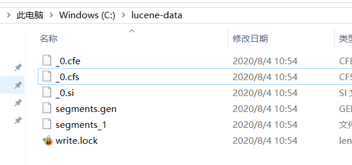
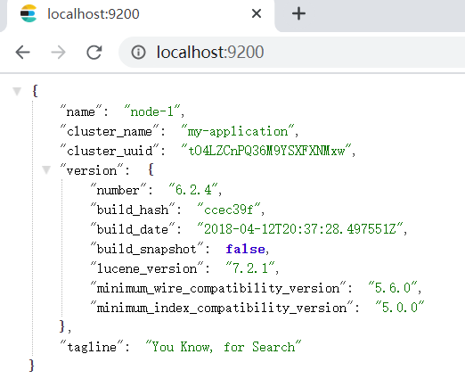
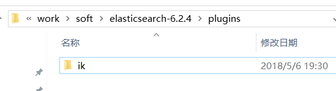
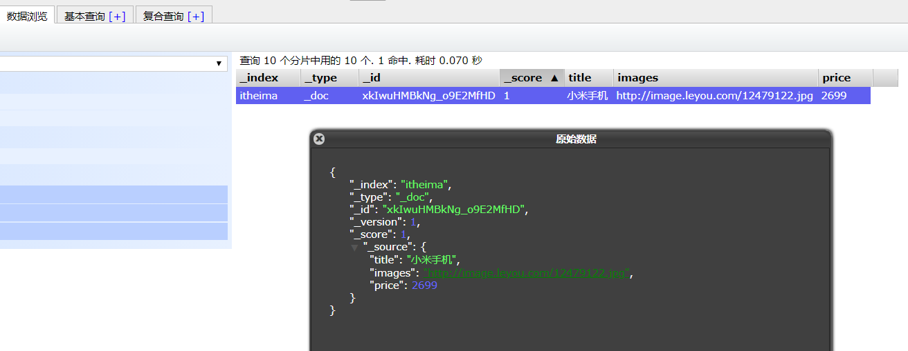
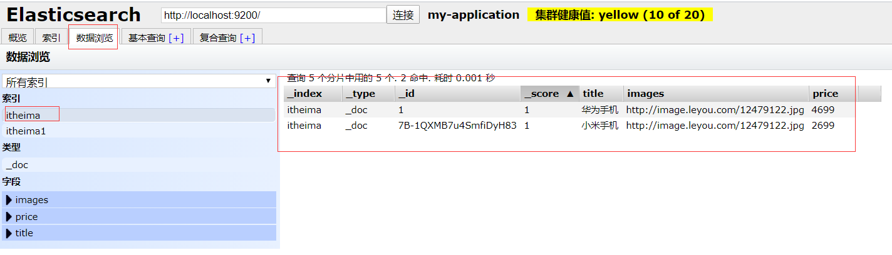
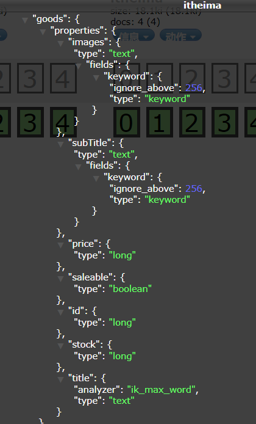
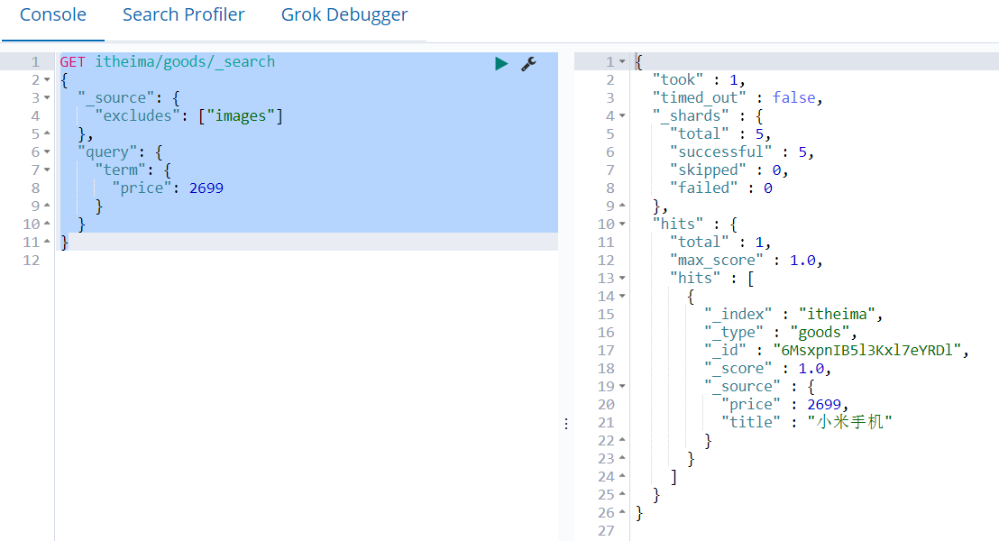

# **学习目标** 

* 理解什么是全文检索  
* 理解lucene的应用场景  
* 掌握lucene中的几个概念  
* 独立安装Elasticsearch  
* 会使用Kibana操作Elasticsearch  

# 1 什么是全文检索  

## 1.1 数据分类  

​	我们生活中的数据总体分为两种：结构化数据和非结构化数据。

* 结构化数据：指具有固定格式或有限长度的数据，如数据库，元数据等。
* 非结构化数据：指不定长或无固定格式的数据，如邮件，word 文档等磁盘上的文件  

## 1.2 结构化数据搜索  

​	常见的结构化数据也就是数据库中的数据。在数据库中搜索很容易实现，通常都是使用结构化查询语言 SQL（Structured Query Language） 语句进行查询，而且能很快的得到查询结果。 为什么数据库搜索很容易？ 因为数据库中的数据存储是有规律的，有行有列而且数据格式是固定的、数据长度都是有限的。  

## 1.3 非结构化数据查询方法  

* 顺序扫描法(Serial Scanning) 所谓顺序扫描，比如要找内容包含某一个字符串的文件，就是一个文档一个文档的看，对于每一个文档，从头看到尾，如果此文档包含此字符串，则此文档为我们要找的文件，接着看下一个文件，直到扫描完所有的文件。如利用 windows 的搜索也可以搜索文件内容，只是相当慢。  
* 全文检索(Full-text Search) 将非结构化数据中的一部分信息提取出来，重新组织，使其变得有一定结构，然后对此有一定结构的数据进行搜索，从而达到搜索相对较快的目的。这部分从非结构化数据中提取出的然后重新组织的信息，我们称之**索引**。 例如：字典。字典的拼音表和部首检字表就相当于字典的索引，对每一个字的解释是非结构化的，如果字典没有拼音表和部首检字表，在茫茫辞海中找一个字只能顺序扫描。然而字的某 些信息可以提取出来进行结构化处理，比如读音，就比较结构化，分声母和韵母，分别只有几种 可以一一列举，于是将读音拿出来按一定的顺序排列，每一项读音都指向此字的详细解释的页数。 我们搜索时按结构化的拼音搜到读音，然后按其指向的页数，便可找到我们的非结构化数据—— 也即对字的解释。 这种先建立索引，再对索引进行搜索的过程就叫全文检索(Full-text Search) 。 虽然创建索引的过程也是非常耗时的，但是索引一旦创建就可以多次使用，全文检索主要处理的是查询，所以耗时间创建索引是值得的。  

## 1.4 如何实现全文检索

​	可以使用 Lucene 实现全文检索。Lucene 是 apache 下的一个开放源代码的全文检索引擎工具包。提供了完整的查询引擎和索引引擎，部分文本分析引擎。Lucene 的目的是为软件开发人员提供一个简单易用的工具包，以方便的在目标系统中实现全文检索的功能。  

## 1.5 全文检索的应用场景  

​	对于数据量大、数据结构不固定的数据可采用全文检索方式搜索，比如百度、Google 等搜索引擎、视频网站内搜索、电商网站站内搜索等。 

   比如使用关系型数据库MySQL,一张表数据量达到千万级别,这个时候要进行like查询,数据基本查不动.

# 2 Lucene  

官网：https://lucene.apache.org/


## 2.1 核心概念

Lucene中有如下几个核心的概念：

* 文档（document)：索引与搜索的主要数据载体，它包含一个或多个字段，存放将要写入索引的或将从索引搜索出来的数据。
* 字段（ field）:文档的一个片段，它包括字段的名称和字段的内容两个部分。
* 词条（term）:搜索时的一个单位，代表了文本中的一个词。


Lucene中索引和MySQL对比关系：

| Lucene          | MySQL          |
| --------------- | -------------- |
| 索引库          | 表             |
| 文档（document) | 表中的一行记录 |
| 字段（Field)    | 表中的列       |

可以简理解Lucene中的文档为一个Json对象.


## 2.2 索引和搜索流程图  


1、绿色表示索引过程，对要搜索的原始内容进行索引构建一个索引库，索引过程包括：
确定原始内容即要搜索的内容-->采集文档-->创建文档-->分析文档-->索引文档
2、红色表示搜索过程，从索引库中搜索内容，搜索过程包括：
用户通过搜索界面-->创建查询-->执行搜索-->从索引库搜索-->渲染搜索结果  

## 2.3 创建索引  

​		Lucene将写入索引的所有信息组织为**倒排索引**（ inverted index）的结构形式。倒排索引是一种将词条映射到文档的数据结构，它与传统的关系数据库的工作方式不同。你可以认为倒排索引是面向词条的而不是面向文档的。我们来看看简单的倒排索引是什么样的。


**倒排索引**：将各个文档中的内容，进行分词，形成词条。然后记录词条和数据的唯一标识（id）的对应关系，形成的产物。  


使用案例:

​		以一个招聘网站的搜索为例，在网站上输入关键字搜索显示的内容不是直接从关系型数据库中来的，而是从索引库中获取的，网站的索引数据需要提前创建的。以下是创建的过程：
​		第一步：获得原始文档：就是从mysql数据库中通过sql语句查询需要创建索引的数据
​		第二步：创建文档对象，把查询的内容构建成lucene能识别的Document对象，文档对象可以理解为一个Json或者map，有属性和属性值， 文档中包括一个一个的字段（Field），这个字段对应就是表中的列,每个文档都有一个唯一的编号id.
​		第三步：分析文档， 经过对原始文档进行提取单词、将字母转为小写、去除标点符号、去除停用词等过程，生成最终的词条term

​		第四步：创建索引，对所有文档分析得出的词条与文档ID对应关系存入索引库中。

​		

## 2.4 查询索引  

​		查询索引也是搜索的过程。搜索就是用户输入关键字，从索引库（index）中进行搜索的过程。根据关键
字搜索索引库，根据索引找到对应的文档
​		第一步：创建用户接口：用户输入关键字的地方  


​		第二步：创建查询,指定查询的关键字
​		第三步：执行查询,从结构化的索引库中去搜索
​		第四步：渲染结果 （结果内容显示到页面上 关键字需要高亮）  本质是添加了CSS样式


## 2.4 代码实践

需求: 从数据库获取数据,然后分词后保存到索引库中,最后通过关键字来进行查询

流程：


步骤：

```markdown
1. 使用SpringBoot集成SSM
	1.1 添加依赖
	1.2 添加启动类
	1.3 添加配置文件
	1.4 集成通用mapper，添加entity\mapper\service
	1.5 添加测试用例，从数据库获取jobinfo数据
2. 根据查询出来的数据创建索引
3. 从索引库中查询数据
```


### 2.4.1 建库建表

将资料中的sql导入到数据库中

### 2.4.2 创建工程

1. 创建SpringBoot工程lucene-demo，添加pom依赖

   ```xml
   <parent>
       <groupId>org.springframework.boot</groupId>
       <artifactId>spring-boot-starter-parent</artifactId>
       <version>2.1.3.RELEASE</version>
   </parent>
   <properties>
       <java.version>1.8</java.version>
       <skipTests>true</skipTests>
   </properties>
   <dependencies>
       <dependency>
           <groupId>org.projectlombok</groupId>
           <artifactId>lombok</artifactId>
           <optional>true</optional>
       </dependency>
       <dependency>
           <groupId>mysql</groupId>
           <artifactId>mysql-connector-java</artifactId>
           <version>5.1.47</version>
       </dependency>
       <!-- 通用mapper -->
       <dependency>
           <groupId>tk.mybatis</groupId>
           <artifactId>mapper-spring-boot-starter</artifactId>
           <version>2.1.5</version>
       </dependency>
       <dependency>
           <groupId>org.springframework.boot</groupId>
           <artifactId>spring-boot-starter-test</artifactId>
           <scope>test</scope>
       </dependency>
       <!-- https://mvnrepository.com/artifact/org.apache.lucene/lucene-core -->
       <dependency>
           <groupId>org.apache.lucene</groupId>
           <artifactId>lucene-core</artifactId>
           <version>4.10.3</version>
       </dependency>
       <!-- https://mvnrepository.com/artifact/org.apache.lucene/lucene-analyzers-common -->
       <dependency>
           <groupId>org.apache.lucene</groupId>
           <artifactId>lucene-analyzers-common</artifactId>
           <version>4.10.3</version>
       </dependency>
   </dependencies>
   ```
   
   
   
2. 添加启动类

   ```java
   @SpringBootApplication
   public class LuceneDemoApplication {
   
       public static void main(String[] args) {
           SpringApplication.run(LuceneDemoApplication.class, args);
       }
   
   }
   ```

   

3. 添加配置文件

   ```yaml
   spring:
     datasource:
       driver-class-name: com.mysql.jdbc.Driver
       url: jdbc:mysql://192.168.85.135:3306/es_test?characterEncoding=utf-8&useUnicode=true&useSSL=false
       username: root
       password: root
   logging:
     level:
       # 设置包的日志级别
       com.itheima: debug
   
   ```
   
   
   
4. 集成Mybatis，添加实体、mapper、service、包扫描配置

   实体：

   ```java
   @Data
   @Table(name = "job_info")
   public class JobInfo  {
   
   
       /**
        * 主键 id
        */
       @Id // 指定主键
       private Long id;
   
       /**
        * 公司名称
        */
       private String companyName;
   
       /**
        * 公司联系方式
        */
       private String companyAddr;
   
       /**
        * 公司信息
        */
       private String companyInfo;
   
       /**
        * 职位名称
        */
       private String jobName;
   
       /**
        * 工作地点
        */
       private String jobAddr;
   
       /**
        * 职位信息
        */
       private String jobInfo;
   
       /**
        * 薪资范围，最小
        */
       private Integer salaryMin;
   
       /**
        * 薪资范围，最大
        */
       private Integer salaryMax;
   
       /**
        * 招聘信息详情页
        */
       private String url;
   
       /**
        * 职位最近发布时间
        */
       private String time;
   }
   ```


mapper:

```java

import tk.mybatis.mapper.common.BaseMapper;

public interface JobInfoMapper extends BaseMapper<JobInfo> {
}
```


service:

   ```java
@Service
public class JobInfoService {

    @Autowired  // 注入jobInfoMapper
    private JobInfoMapper jobInfoMapper;

    /**
        * 返回公司信息列表
        * @return
        */
    public List<JobInfo> list(){
        List<JobInfo> jobInfos = jobInfoMapper.selectAll();
        return jobInfos;
    }
}
   ```

   

   配置包扫描

   ```java
import tk.mybatis.spring.annotation.MapperScan;

@SpringBootApplication
@MapperScan("com.itheima.lucenedemo.mapper")
public class LuceneApplication {
    public static void main(String[] args) {
        SpringApplication.run(LuceneApplication.class, args);
    }
}
   ```

   

5. 添加测试用类

   ```java
   @RunWith(SpringRunner.class)
   @SpringBootTest
   public class LuceneApplicationTests {
   
       @Autowired
       private JobInfoService jobInfoService;
       
       @Test
       public void testSelectAll(){
           List<JobInfo> list = jobInfoService.list();
           for (int i = 0; i < list.size(); i++) {
               System.out.println(list.get(i));
           }
       }
   }
   ```

### 2.4.3 创建索引

```java
    // 创建索引
    @Test
    public void testCreateIndex() throws IOException {
        // 1. 指定索引文件存放的路径
        File file = new File("C:\\lucene-data");
        // 2. 使用Lucene的API打开路径
        Directory directory = FSDirectory.open(file);
        // 3. 创建索引对象
        // 使用默认的分词器 会将中文拆分成一个一个的字
        Analyzer analyzer = new StandardAnalyzer();
        // 索引配置 第一个参数为配置的版本 第二个参数为分词器
        IndexWriterConfig config = new IndexWriterConfig(Version.LATEST,analyzer);
        // 创建索引对象 第一个参数为Directory 第二个参数为索引配置
        IndexWriter indexWriter = new IndexWriter(directory,config);
        // 4. 获取原始文档
        List<JobInfo> list = jobInfoService.list();
        for (JobInfo jobInfo : list) {
            // 5. 根据原始文档构建Lucene能够识别的文档document
            Document document = new Document();
            // LongField(IndexableField) 构造参数  第一个为字段的名称，第二个为字段的值，第三个为是否需要将数据存储到索引库中
            document.add(new LongField("id",jobInfo.getId(), Field.Store.YES));
            // TextField 表明这个字段会被分词
            document.add(new TextField("companyName", jobInfo.getCompanyName(), Field.Store.YES));
            document.add(new TextField("companyAddr", jobInfo.getCompanyAddr(), Field.Store.YES));
            document.add(new TextField("jobName", jobInfo.getJobName(), Field.Store.YES));
            document.add(new TextField("jobAddr", jobInfo.getJobAddr(), Field.Store.YES));
            document.add(new IntField("salaryMin", jobInfo.getSalaryMin(), Field.Store.YES));
            document.add(new IntField("salaryMax", jobInfo.getSalaryMax(), Field.Store.YES));
            // StringField 不需要分词
            document.add(new StringField("url", jobInfo.getUrl(), Field.Store.YES));
            // 6. 将文档存入到索引库中
            indexWriter.addDocument(document);
        }
        // 关闭索引操作，释放连接
        indexWriter.close();
    }
```

创建完索引后可以在本地目录中看到生成了很多文件：



### 2.4.4 查询索引

```java
    // 查询索引
    @Test
    public void testQueryIndex() throws IOException {
        // 1. 指定索引文件存放的路径
        File file = new File("C:\\lucene-data");
        // 2. 使用Lucene的API打开路径
        Directory directory = FSDirectory.open(file);
        // 3. 构建索引读取对象
        IndexReader indexReader = DirectoryReader.open(directory);
        // 4. 构建索引查询对象
        IndexSearcher indexSearcher = new IndexSearcher(indexReader);
        // 5. 添加查询条件，这里根据公司的名称来查询
        // Term的构造参数 第一个为字段名称  第二个为查询的关键字
        // Query query = new TermQuery(new Term("companyName", "北京"));
        Query query = new TermQuery(new Term("companyName", "京"));
        // 6. 使用条件查询 第一个参数为查询条件 第二个参数为返回的条数
        TopDocs topDocs = indexSearcher.search(query, 100);
        // 7. 分析结果
        int totalHits = topDocs.totalHits;  // 查询命中的总数
        System.out.println("符合条件的文档总数为：" + totalHits);
        ScoreDoc[] scoreDocs = topDocs.scoreDocs;   // 查询结果
        for (ScoreDoc scoreDoc : scoreDocs) {
            int docId = scoreDoc.doc;  // 返回文档的ID
            // 根据id获取文档
            Document doc = indexSearcher.doc(docId);
            System.out.println("id: " + document.get("id"));
            System.out.println("companyName: "+document.get("companyName"));
            System.out.println("companyAddr: "+document.get("companyAddr"));
            System.out.println("salaryMin: "+document.get("salaryMin"));
            System.out.println("salaryMax: "+document.get("salaryMax"));
            System.out.println("===================================================");
        }
    }
```


查看结果发现没有数据，如果把查询的关键字“北京”那里改为“北”或“京”就可以，原因是因为中文会一个字一个字的分词，显然是不合适的，所以我们需要使用可以合理分词的分词器，其中最有名的是`IKAnalyzer`分词器 


### 2.4.5 中文分词器

中文分词器有很多,其中最为著名的是IK分词器

使用步骤：

1. 添加pom依赖

   ```xml
   <dependency>
       <groupId>com.janeluo</groupId>
       <artifactId>ikanalyzer</artifactId>
       <version>2012_u6</version>
   </dependency>
   ```

2. 创建索引时使用IKanalyzer  

   ```java
   // 3. 创建索引对象
   // Analyzer analyzer = new StandardAnalyzer(); // 标准分词器
   Analyzer analyzer = new IKAnalyzer();   // 中文IK分词器
   IndexWriterConfig config = new IndexWriterConfig(Version.LATEST, analyzer);
   IndexWriter indexWriter = new IndexWriter(directory, config);
   // 删除之前的索引
   indexWriter.deleteAll();
   ```

   把原来的索引数据删除，再重新生成索引文件，再使用关键字“北京”就可以查询到结果了  

   

3. IK分词器的扩展词和停用词

   查询公司名称

   ```java
   Query query = new TermQuery(new Term("companyName","慧点"));
   ```

   可以发现没有记录，原因是''慧''和''点''被拆成了两个词，如果需要识别“慧点"，需要自己配置扩展词字典

   将资料中的文件复制到resources中

   

   在resources中添加文件`ext.dic`，在文件中添加”慧点“，重新建立索引再查询就有了。

   
   
   可以在控制台看到加载了自定义的扩展词典和停用词典
   
   
   
   如果把“慧点”加入到停止词字典中，那么就查询不到了，即时在扩展词中有“慧点"，也查询不到，这里是停用词优先。
   
   注：测试过程中如果遇到扩展词和停用词不起作用，重启IDEA。

# 3 ElasticSearch 介绍和安装

## 3.1 简介

Elastic官网：https://www.elastic.co/cn/  

Elastic有一条完整的产品线：Elasticsearch、Kibana、Logstash等，前面说的三个就是大家常说的ELK技术栈。  

ELK常用框架：


## 3.2 ElasticSearch

Elasticsearch官网：https://www.elastic.co/cn/products/elasticsearch  


下载页面默认是最新版本，可以在下面的地址找到历史版本：


### Windows中安装

解压资料中的`elasticsearch-6.2.4.zip`

进入到解压后的目录，新建一个`data`目录用于存在ES的数据，目录结构如下


在config中有配置文件`elasticsearch.yml`，在这里可以修改ES的配置：

```shell
# 集群名称
cluster.name: my-application
# 当前节点名称
node.name: node-1
# 数据存放路径，默认是在ES安装目录下的data
#path.data: /path/to/data
# 日志存放路径，默认是在ES安装目录下的logs
#path.logs: /path/to/logs
# 绑定地址 默认是本机 localhost ,如果需要允许其他机器访问，可以设置为本机IP或者 0.0.0.0
#network.host: 192.168.0.1
# ES的HTTP连接地址
#http.port: 9200
```

修改完后在bin目录中双击运行`elasticsearch.bat`即可启动。

访问http://localhost:9200/ 可以看到节点信息：



### CentOS中安装

**在 VMware Workstation 中安装 CentOS7**  

在Windows下安装VMware Workstation，如果是Win10系统，推荐使用15.5以上版本

可以自己安装CentOS镜像，下载地址：

https://pan.baidu.com/s/1BqZs2G55ijpMtSLVAxXfgQ 提取码：5i03 

也可以使用VMX文件加载，下载地址：

https://pan.baidu.com/s/1xJElEks0w3XF_RBhF-mAdw 提取码：rzyo 

下载ES目录:


在VMware workstation中选择文件-打开，选择es.vmx文件


开启虚拟机


开启后输入用户名秘密，都是`root`

```shell
# 查看IP地址
ip addr
```


下载对应的操作系统和版本：https://www.elastic.co/cn/downloads/elasticsearch

默认下载最新版本，如果想下载之前的版本，可以打开：

https://www.elastic.co/cn/downloads/past-releases#elasticsearch


在CentOS中安装：

```shell
# 下载rpm包
wget https://artifacts.elastic.co/downloads/elasticsearch/elasticsearch-6.8.10.rpm
# 下载校验包
wget https://artifacts.elastic.co/downloads/elasticsearch/elasticsearch-6.8.10.rpm.sha512
# 安装校验工具
yum install perl-Digest-SHA
# 校验结果输出OK 
shasum -a 512 -c elasticsearch-6.8.10.rpm.sha512 
# 直接从软件包中复制安装包到/opt/soft目录
# 解压jdk   jdk路径为/opt/soft/jdk1.8.0_231/
tar xzf jdk-8u231-linux-x64.tar.gz
# 设置JAVA_HOME
vim /etc/profile
# 在最末尾添加
export JAVA_HOME=/opt/soft/jdk1.8.0_231
export PATH=$PATH:$JAVA_HOME/bin
# 刷新配置
source /etc/profile
# 验证Java版本
java -version
# 安装rpm包
rpm --install elasticsearch-6.8.10.rpm
# 编辑elasticsearch配置
vim /etc/sysconfig/elasticsearch
JAVA_HOME=/opt/soft/jdk1.8.0_231/
# 删除rpm包
rpm -e elasticsearch-6.8.10
# 开启服务
sudo systemctl daemon-reload
sudo systemctl enable elasticsearch.service
sudo systemctl start elasticsearch.service
# 查看是否安装完成
curl http://localhost:9200
```


```shell
# 配置elasticsearch 服务 自动启动
 sudo systemctl daemon-reload
 sudo systemctl enable elasticsearch.service
### 启动 elasticsearch 服务
 sudo systemctl start elasticsearch.service
# 查看服务状态
service elasticsearch status
# 启动服务
service elasticsearch start
# 配置文件保存到 /etc/elasticsearch
```


从这里看到RPM默认的安装位置和配置文件位置：


```shell
# 编辑配置文件
vim /etc/elasticsearch/elasticsearch.yml
# 绑定IP地址
network.host: 0.0.0.0
# 重启服务
service elasticsearch restart
# 查看服务状态
service elasticsearch status
```


如果在外部访问，需要开启防火墙端口：

```shell
firewall-cmd --zone=public --add-port=9200/tcp --permanent
firewall-cmd --reload 

# 或者关闭防火墙
service firewalld stop
# 防火墙服务默认设置在系统重启时自动开启，可以通过以下设置将自动开启关闭
systemctl disable firewalld
```

这样就可以通过浏览器查看信息：http://192.168.85.135:9200


### 安装Head插件

下载地址：https://github.com/mobz/elasticsearch-head

```shell
# 下载源码
git clone git://github.com/mobz/elasticsearch-head.git
# 将目录中的es-head.crx 修改为es-head.zip，然后解压
```

打开Chrome，选择更多工具---扩展程序

开启开发者模式


选择刚才的解压目录


加载成功如下


点击右侧按钮，输入地址，点击连接，可以看到ES信息：


点击复合查询，测试如下请求：

```http
POST _analyze
{
	"text": "我是中国人"
}
```

可以看到中文被拆成了单个字符


### 安装ik分词器  

下载地址：https://github.com/medcl/elasticsearch-analysis-ik/releases

下载与ES对应的版本


将下载的文件解压到ES的插件目录中

**Windows**

在`elasticsearch-6.2.4\plugins`中新建`ik`文件夹，复制`elasticsearch-analysis-ik-6.2.4.zip`到`ik`文件夹中，然后解压，注意，不要复制或解压到ik目录外，将解压出的·elasticsearch目录下的所有文件剪切到ik目录中，重新启动ES，可以看到分词插件被加载了：


强调: es插件目录中一个目录就是一个插件




**CentOS**

```shell
# 在ES安装目录中找到插件目录，并新建ik目录
cd /usr/share/elasticsearch/plugins/ && mkdir ik
# 安装zip解压
yum install -y unzip
# 这里要注意，不要直接解压到plugins目录，要解压到ik目录中
cd ik
# 复制ik分词器到目录中，并解压
unzip elasticsearch-analysis-ik-6.8.10.zip
# 重启ES
service elasticsearch restart
```

在Head中测试如下命令：

```http
POST _analyze
{
  "analyzer": "ik_max_word",
  "text": "我是中国人"
}
```

结果如下：


## 3.3 Kibana


### 下载

下载地址：https://www.elastic.co/guide/en/kibana/current/install.html

版本选择与上面一样

### Windows中安装

解压`kibana-6.2.4-windows-x86_64.zip`

编辑config目录中的配置文件`kibana.yml`

```shell
# Web界面访问地址
#server.port: 5601
# 配置ES地址
#elasticsearch.url: "http://localhost:9200"
```

双击运行bin目录中的`kibana.bat`即可启动


打开浏览器：http://localhost:5601/ 


### CentOS中安装

```shell
wget https://artifacts.elastic.co/downloads/kibana/kibana-6.8.10-x86_64.rpm
wget https://artifacts.elastic.co/downloads/kibana/kibana-6.8.10-x86_64.rpm.sha512
shasum -a 512 -c kibana-6.8.10-x86_64.rpm.sha512
sudo rpm --install kibana-6.8.10-x86_64.rpm
# kibana 的配置文件在 /etc/kibana/
vim /etc/kibana/kibana.yml
server.host: "0.0.0.0"
# 指定ElasticSearch的地址 如果安装ElasticSearch的时候绑定的是具体的IP地址，下面就不能使用localhost，需要使用具体的IP地址
elasticsearch.hosts: ["http://localhost:9200"]
# 找到kibana的安装目录 /usr/share/kibana/
cd /usr/share/kibana/
# 开启防火墙端口
firewall-cmd --zone=public --add-port=5601/tcp --permanent
firewall-cmd --reload 
# 启动kibana
bin/kibana
# 后台启动kibana
nohup bin/kibana >> kibana.log 2>&1 &
# 查看应用运行情况
ps -ef|grep kibana
# 还可以安装net-tool 工具
yum install -y net-tools
# 查看端口运行情况
netstat -nlp|grep 5601
```

启动成功：


打开浏览器：http://192.168.85.135:5601/ 


### 测试

在kibana左侧做到Dev Tools，输入请求命令

```http
POST _analyze
{
  "analyzer": "ik_max_word",
  "text": "我是中国人"
}
```


请求

```http
POST _analyze
{
  "text": "我是中国人",
  "analyzer": "ik_smart"
}
```


# 4 REST API

Elasticsearch提供了Rest风格的API，即Http请求接口，而且也提供了各种语言的客户端API  

文档地址：https://www.elastic.co/guide/en/elasticsearch/reference/current/getting-started.html  

中文文档：https://www.elastic.co/guide/cn/elasticsearch/guide/current/index.html


## 4.1 操作索引库

### 基本概念  

Elasticsearch也是基于Lucene的全文检索库，本质也是存储数据，很多概念与MySQL类似的。  

对比关系：  

```markdown
索引库（indices）---------------------------------Database 数据库
类型（type）----------------------------------Table 数据表
文档（Document）---------------------------------Row 行
字段（Field）--------------------------------Columns 列
映射配置（mappings）-------------------------------每个列的约束（类型、长度）
```

详细说明：  

|         概念          | 说明                                                         |
| :-------------------: | ------------------------------------------------------------ |
|   索引库 （indices)   | indices是index的复数，代表许多的索引                         |
|     类型（type）      | 类型是模拟mysql中的table概念，一个索引库下可以有不同类型的索引，类似 数据库中的表概念。数据库表中有表结构，也就是表中每个字段的约束信息； 索引库的类型中对应表结构的叫做 映射(mapping) ，用来定义每个字段的约 束。 |
|   文档 （document）   | 存入索引库原始的数据。比如每一条商品信息，就是一个文档       |
|     字段（field）     | 文档中的属性                                                 |
| 映射配置 （mappings） | 字段的数据类型、属性、是否索引、是否存储等特性               |

### 创建索引库  

> 语法

创建索引的请求格式：

* 请求方式：PUT

* 请求路径：索引库名

* 请求参数：json格式

  ```json
  {
      "settings": {
      "属性名": "属性值"
      }
  }
  ```

  settings：就是索引库设置，其中可以定义索引库的各种属性，目前我们可以不设置。  

在kibana的控制台，可以对http请求进行简化，示例：  

```http
PUT itheima
```


### 查看索引库

> 语法

```http
GET 索引库名  
```

调用示例：

```http
GET itheima
```


可以通过es-head查看索引：


### 删除索引库

> 语法

```http
DELETE 索引库名
```

调用示例：

```http
DELETE itheima
```


再次查看itheima:


## 4.2 操作类型及映射  

​		有了索引库 ，等于有了数据库中的 database 。接下来就需要索引库中的 类型 了，也就是数据库中的
表 。创建数据库表需要设置字段约束，索引库也一样，在创建索引库的类型时，需要知道这个类型下
有哪些字段，每个字段有哪些约束信息，这就叫做 字段映射(mapping)
字段的约束我们在学习Lucene中我们都见到过，包括但不限于：

* 数据类型
* 是否要存储
* 是否要索引
* 是否分词
* 分词器是什么

我们一起来看下创建的语法  

### 创建字段映射  

> 语法  

```http
PUT 索引库名/_mapping/类型名称 
{
  "properties": {
    "字段名": {
      "type": "类型",
      "index": true,
      "store": true,
      "analyzer": "分词器"
    }
  }
}
```

类型名称：就是前面将的type的概念，类似于数据库中的表 字段名：任意填写，

在ES5.X版本中一个索引库中可以添加多个类型，相当于mysql中一个数据库添加多个表

在ES6.X版本中就不能通过REST请求在一个索引库中添加多个类型，但是从ES5.X升级到ES6.X的多个类型依旧可用

但是在ES7版本后，一个索引库只能有一个类型，为了兼容ES7，这里的类型最好设置为`_doc`，可以参考：

https://www.elastic.co/guide/en/elasticsearch/reference/7.7/removal-of-types.html#_schedule_for_removal_of_mapping_types


下面指定许多属性，例如：

* type：类型，可以是text、long、short、date、integer、object等
* index：是否索引，默认为true
* store：是否存储，默认为false
* analyzer：分词器，这里的 ik_max_word 即使用ik分词器  

请求示例：

```http
PUT itheima
```

创建映射：

```http
PUT itheima/_mapping/_doc
{
  "properties": {
    "title":{
      "type": "text",
      "analyzer": "ik_max_word"
    },
    "images":{
      "type": "keyword",
      "index": false
    },
    "price":{
      "type": "float"
    }
  }
}
```

响应结果：  

```http
{
  "acknowledged" : true
}
```


上述案例中，就给itheima这个索引库添加了一个名为 _doc的类型，并且在类型中设置了3个字段：

* title：商品标题
* images：商品图片
* price：商品价格

并且给这些字段设置了一些属性，至于这些属性对应的含义，我们在后续会详细介绍。  


### 查看映射关系  

> 语法：  

查看某个索引库中的所有类型的映射  

```http
GET /索引库名/_mapping
```

如果要查看某个类型映射，可以再路径后面跟上类型名称  

```http
GET /索引库名/_mapping/映射名
```

请求示例：

```http
GET itheima/_mapping
```

响应：

```http
{
  "itheima" : {
    "mappings" : {
      "_doc" : {
        "properties" : {
          "images" : {
            "type" : "keyword",
            "index" : false
          },
          "price" : {
            "type" : "float"
          },
          "title" : {
            "type" : "text",
            "analyzer" : "ik_max_word"
          }
        }
      }
    }
  }
}
```

查看具体类型

```http
GET itheima/_mapping/_doc
```

### 映射属性详解  

**type**

Elasticsearch中支持的数据类型非常丰富：  

https://www.elastic.co/guide/en/elasticsearch/reference/6.2/mapping-types.html


我们说几个关键的：

* String类型，又分两种：

  * text：可分词，不可参与聚合
  * keyword：不可分词，数据会作为完整字段进行匹配，可以参与聚合

* Numerical：数值类型，分两类

  * 基本数据类型：long、interger、short、byte、double、float、half_float
  * 浮点数的高精度类型：scaled_float
    需要指定一个精度因子，比如10或100。elasticsearch会把真实值乘以这个因子后存
    储，取出时再还原。

* Date：日期类型
  elasticsearch可以对日期格式化为字符串存储，但是建议我们存储为毫秒值，存储为long，节省
  空间。

* Array：数组类型
  进行匹配时，任意一个元素满足，都认为满足
  排序时，如果升序则用数组中的最小值来排序，如果降序则用数组中的最大值来排序

* Object：对象

  ```json
  {
    "name": "Jack",
    "age": 21,
    "girl": {
      "name": "Rose",
      "age": 21
    }
  }
  ```

  如果存储到索引库的是对象类型，例如上面的girl，会把girl编程两个字段：girl.name和girl.age  

**index**  

index影响字段的索引情况。

* true：字段会被索引，则可以用来进行搜索过滤。默认值就是true
* false：字段不会被索引，不能用来搜索

index的默认值就是true，也就是说你不进行任何配置，所有字段都会被索引。
但是有些字段是我们不希望被索引的，比如商品的图片信息，就需要手动设置index为false。  

**store**  

是否将数据进行额外存储。
在学习lucene时，我们知道如果一个字段的store设置为false，那么在文档列表中就不会有这个字段的
值，用户的搜索结果中不会显示出来。
但是在Elasticsearch中，即便store设置为false，也可以搜索到结果。
原因是Elasticsearch在创建文档索引时，会将文档中的原始数据备份，保存到一个叫做 _source 的属性
中。而且我们可以通过过滤 _source 来选择哪些要显示，哪些不显示。
而如果设置store为true，就会在 _source 以外额外存储一份数据，多余，因此一般我们都会将store设
置为false，事实上，store的默认值就是false。  

**boost**  

权重，新增数据时，可以指定该数据的权重，权重越高，得分越高，排名越靠前。  

其它属性：https://www.elastic.co/guide/en/elasticsearch/reference/6.2/mapping-params.html

## :reminder_ribbon:经验分享

### 1.往ES6同一个索引库中插入多个类型会报错

> 在ES6中新建一个索引库，先添加一个映射，再添加一个映射会报错

> REST API 调用代码如下

```java
PUT itheima
PUT itheima/_mapping/table1
{
  "properties": {
    "title":{
      "type": "text"
    },
    "images":{
      "type": "keyword",
      "index": false
    },
    "price":{
      "type": "float"
    }
  }
}
PUT itheima/_mapping/table2
{
  "properties": {
    "title1":{
      "type": "text"
    },
    "images1":{
      "type": "keyword",
      "index": false
    },
    "price1":{
      "type": "float"
    }
  }
}
```

### 2.出现的问题


### 3.问题的分析

> 在ES5.X版本中是可以在同一个索引库下添加多个映射类型的，每个映射类型相当于索引库来说就类似于MySQL中的数据库和表
>
> 从ES6.X开始不允许在同一个索引中添加多个映射类型
>
> 从ES5.X升级到ES6.X的多个映射类型会被保留
>
> 但是通过API来创建的话就只允许一个映射类型
>
> 在ES7.X版本中映射就被废弃了，如果想在ES6升级到ES7还兼容的话，映射类型可以设置为固定的`_doc`

> 

###  4.问题解决办法

> 在一个索引库中只添加一种映射类型，如果之后有升级ES到7.X版本的话，建议这个类型为`_doc`，请求代码如下

```http
PUT itheima
PUT itheima/_mapping/_doc
{
  "properties": {
    "title":{
      "type": "text"
    },
    "images":{
      "type": "keyword",
      "index": false
    },
    "price":{
      "type": "float"
    }
  }
}
```


## 4.3 创建索引库和类型  

​		刚才的案例中我们是把创建索引库和类型分开来做，其实也可以在创建索引库的同时，直接制定索引库中的类型，基本语法：  

```http
put 索引库名
{
  "settings": {
    "索引库属性名": "索引库属性值"
  },
  "mappings": {
    "类型名": {
      "properties": {
        "字段名": {
          "映射属性名": "映射属性值"
        }
      }
    }
  }
}
```

请求示例：

```http
PUT itheima1
{
  "settings": {},
  "mappings": {
    "_doc": {
      "properties": {
        "title": {
          "type": "text",
          "analyzer": "ik_max_word"
        }
      }
    }
  }
}
```

响应：

```http
{
  "acknowledged": true,
  "shards_acknowledged": true,
  "index": "itheima1"
}
```

## 4.4 操作文档

文档，即索引库中某个类型下的数据，会根据规则创建索引，将来用来搜索。可以类比做数据库中的每一行数据。  

### 新增文档

通过POST请求，可以向一个已经存在的索引库中添加文档数据。  

> 语法

```http
POST /索引库名/类型名
{
  "key": "value"
}
```

> 示例

```http
POST itheima/_doc
{
  "title": "小米手机",
  "images": "http://image.leyou.com/12479122.jpg",
  "price": 2699
}
```

> 响应

```http
{
  "_index" : "itheima",
  "_type" : "_doc",
  "_id" : "6MsxpnIB5l3Kxl7eYRDl",
  "_version" : 1,
  "result" : "created",
  "_shards" : {
    "total" : 2,
    "successful" : 1,
    "failed" : 0
  },
  "_seq_no" : 0,
  "_primary_term" : 1
}
```


可以在es-head查看到文档


切换到数据浏览



### 查看文档

> 语法

```http
GET 索引库名/类型名/编号
```

> 示例

```http
GET itheima/_doc/hKgK-HIBmDYBoFyJBhnh
```

> 响应
>

```http
{
  "_index" : "itheima",
  "_type" : "_doc",
  "_id" : "hKgK-HIBmDYBoFyJBhnh",
  "_version" : 1,
  "_seq_no" : 0,
  "_primary_term" : 1,
  "found" : true,
  "_source" : {
    "title" : "小米手机",
    "images" : "http://image.leyou.com/12479122.jpg",
    "price" : 2699
  }
}
```


### 新增文档并自定义id  

> 语法

```http
POST /索引库名/类型/id值
{
	"key": "value"
}
```

> 示例

```http
POST itheima/_doc/1
{
  "title": "华为手机",
  "images": "http://image.leyou.com/12479122.jpg",
  "price": 4699
}
```

> 响应
>

```http
{
  "_index" : "itheima",
  "_type" : "_doc",
  "_id" : "1",
  "_version" : 1,
  "result" : "created",
  "_shards" : {
    "total" : 2,
    "successful" : 1,
    "failed" : 0
  },
  "_seq_no" : 0,
  "_primary_term" : 1
}
```

可以在Head插件中查看数据：



### 更新数据  

> 语法

```http
PUT 索引库名/类型名/_id
{
	"key":"value"
}
```

如果`_id`存在就使用Json内容更新文档，如果不存在则新增文档

> 示例

```http
PUT itheima/_doc/1
{
  "title": "华为手机",
  "images": "http://image.leyou.com/12479122.jpg",
  "price": 4799
}
```


如果`_id`不存在会新增文档：

```http
PUT itheima/_doc/2
{
  "title": "苹果手机",
  "images": "http://image.leyou.com/12479122.jpg",
  "price": 10999
}
```


### 删除数据  

> 语法

```http
DELETE 索引库名/类型名/_id
```

> 示例

```http
DELETE itheima/_doc/2
```

> 响应

```http
{
  "_index" : "itheima",
  "_type" : "_doc",
  "_id" : "2",
  "_version" : 2,
  "result" : "deleted",
  "_shards" : {
    "total" : 2,
    "successful" : 1,
    "failed" : 0
  },
  "_seq_no" : 1,
  "_primary_term" : 1
}
```


### 智能判断  

​		刚刚我们在新增数据时，添加的字段都是提前在类型中定义过的，如果我们添加的字段并没有提前定义过，能够成功吗？
​		事实上Elasticsearch非常智能，不需要给索引库设置任何mapping映射，它也可以根据输入的数据来判断类型，动态添加数据映射。  

> 示例

```http
POST itheima/_doc/3
{
  "title": "超大米手机",
  "images": "http://image.leyou.com/12479122.jpg",
  "price": 3299,
  "stock": 200,
  "saleable": true,
  "subTitle": "哈哈"
}
```

我们额外添加了stock库存，saleable是否上架，subtitle副标题、3个字段。  

可以看到结果是成功添加了


查看索引信息



stock、saleable、subTitle都被成功映射了。  

subTitle是String类型数据，ES无法智能判断，它就会存入两种映射类型。例如：

* subTitle：text类型
* subTitle.keyword：keyword类型  


默认的动态字段映射：

https://www.elastic.co/guide/en/elasticsearch/reference/6.8/dynamic-field-mapping.html

| **JSON 类型**         | **Elasticsearch 类型**                                       |
| --------------------- | ------------------------------------------------------------ |
| `null`                | 不添加                                                       |
| `true` or `false`     | [`boolean`](https://www.elastic.co/guide/en/elasticsearch/reference/6.8/boolean.html) |
| floating point number | [`float`](https://www.elastic.co/guide/en/elasticsearch/reference/6.8/number.html) |
| integer               | [`long`](https://www.elastic.co/guide/en/elasticsearch/reference/6.8/number.html) |
| object                | [`object`](https://www.elastic.co/guide/en/elasticsearch/reference/6.8/object.html) |
| array                 | 取决于存入数组的第一个非空元素类型                           |
| string                | [`text`](https://www.elastic.co/guide/en/elasticsearch/reference/6.8/text.html) , 附带一个  [`keyword`](https://www.elastic.co/guide/en/elasticsearch/reference/6.8/keyword.html) 子域 |

这种智能映射，底层原理是动态模板映射，如果我们想修改这种智能映射的规则，其实只要修改动态模板即可！  

### 动态映射模板  

https://www.elastic.co/guide/en/elasticsearch/reference/6.2/dynamic-templates.html

> 语法

```json
"dynamic_templates": [
    {
      "my_template_name": { 
        ...  match conditions ... 
        "mapping": { ... } 
      }
    },
    ...
  ]
```

说明：

* my_template_name：自定义模板名称 

* match conditions：匹配条件，凡是符合条件的未定义字段，都会按照这个规则来映射  

* mapping：映射规则，匹配成功后的映射规则  

> 示例

可以把所有未映射的string类型数据自动映射为keyword类型：  

```http
PUT itheima2
{
  "mappings": {
    "_doc": {
      "properties": {
        "title": {
          "type": "text",
          "analyzer": "ik_max_word"
        }
      },
      "dynamic_templates": [
        {
          "strings": {
            "match_mapping_type": "string",
            "mapping": {
              "type": "keyword"
            }
          }
        }
      ]
    }
  }
}
```

在这个案例中，我们把做了两个映射配置：

* title字段：统一映射为text类型，并制定分词器
* 其它字段：只要是string类型，统一都处理为keyword类型。

这样，未知的string类型数据就不会被映射为text和keyword并存，而是统一以keyword来处理！
新增一个文档：  

```http
POST itheima2/_doc/3
{
  "title": "超大米手机",
  "images": "http://image.leyou.com/12479122.jpg",
  "price": 3299,
  "stock": 200,
  "saleable": true,
  "subTitle": "哈哈"
}
```

查看mapping：

```http
GET itheima2/_mapping
```

响应：

```http
{
  "itheima2": {
    "mappings": {
      "_doc": {
        "dynamic_templates": [
          {
            "strings": {
              "match_mapping_type": "string",
              "mapping": {
                "type": "keyword"
              }
            }
          }
        ],
        "properties": {
          "images": {
            "type": "keyword"
          },
          "price": {
            "type": "long"
          },
          "saleable": {
            "type": "boolean"
          },
          "stock": {
            "type": "long"
          },
          "subTitle": {
            "type": "keyword"
          },
          "title": {
            "type": "text",
            "analyzer": "ik_max_word"
          }
        }
      }
    }
  }
}
```


可以看到images被映射成了keyword，而非之前的text和keyword并存，说明我们的动态模板生效了！  

## 4.5 查询

### 基本查询  

> 语法  

```http
GET /索引库名/_search
{
  "query": {
    "查询类型": {
      "查询条件": "查询条件值"
    }
  }
}
```

这里的query代表一个查询对象，里面可以有不同的查询属性  

查询类型：  match_all ， match ， term ， range 等等  

查询条件：查询条件会根据类型的不同，写法也有差异，后面详细讲解  

#### 查询所有（match_all)  

> 示例

```http
GET itheima/_search
{
  "query": {
    "match_all": {}
  }
}
```

query ：代表查询对象
match_all ：代表查询所有  


* took：查询花费时间，单位是毫秒

* time_out：是否超时

* _shards：分片信息

* hits：搜索结果总览对象

  * total：搜索到的总条数

  * max_score：所有结果中文档得分的最高分
  * hits：搜索结果的文档对象数组，每个元素是一条搜索到的文档信息
    * _index：索引库
    * _type：文档类型
    * _id：文档id
    * _score：文档得分
    * _source：文档的源数据  

#### 匹配查询（match）  

我们先加入一条数据，便于测试：  

```http
POST itheima/_doc
{
  "title": "小米电视4A",
  "images": "http://image.leyou.com/12479122.jpg",
  "price": 3899
}
```

match 类型查询，会把查询条件进行分词，然后进行查询,多个词条之间默认是or的关系 

 查询

```http
GET itheima/_doc/_search
{
  "query": {
    "match": {
      "title": "小米电视"
    }
  }
}
```

结果


默认使用`match`是将关键字进行分词后通过`or`来进行查询

如果需要精确查找，可以使用`and`操作

查询

```http
GET itheima/_doc/_search
{
  "query": {
    "match": {
      "title": {
        "query": "小米电视",
        "operator": "and"
      }
    }
  }
}
```

结果


match查询title字段会进行分词，然后通过分词查询

请求：

```http
get itheima/_search
{
  "query":{
    "match": {
      "title": "小米手机"
    }
  }
}
```

响应：


#### 词条匹配(term)  

term 查询被用于精确值 匹配，这些精确值可能是数字、时间、布尔或者那些未分词的字符串  

一般是在`keyword`上进行查询

请求

```http
GET itheima/_doc/_search
{
  "query": {
    "term": {
      "price": 3899
    }
  }
}
```

结果


使用`term`需要注意，如果查询的字段是`String`类型，在索引库中可能是`text`或者`keyword`，如果是`text`类型，会将查询的内容进行分词，所以下面这个查询是查询不到结果的：

```http
GET itheima/_doc/_search
{
  "query": {
    "term": {
      "title": "小米电视4A"
    }
  }
}
```


解决方案是使用`match`

```http
GET itheima/_doc/_search
{
  "query": {
    "match": {
      "title": {
        "query": "小米电视4A",
        "operator": "and"
      }
    }
  }
}
```

新增一个索引

```http
PUT itheima3
{
  "mappings": {
    "_doc": {
      "properties": {
        "title": {
          "type": "text",
          "analyzer": "ik_max_word"
        }
      },
      "dynamic_templates": [
        {
          "strings": {
            "match_mapping_type": "string",
            "mapping": {
              "type": "keyword"
            }
          }
        }
      ]
    }
  }
}
```

添加文档

```http
POST itheima3/_doc
{
  "title": "小米手机",
  "images": "http://image.leyou.com/12479122.jpg",
  "price": 2699
}
```

使用`term`查询

```http
GET itheima3/_doc/_search
{
  "query": {
    "term": {
      "images": "http://image.leyou.com/12479122.jpg"
    }
  }
}
```


#### 布尔组合（bool)  

bool 把各种其它查询通过 must （与）、 must_not （非）、 should （或）的方式进行组合  

查询

```http
GET itheima/_doc/_search
{
  "query": {
    "bool": {
      "must": {
        "match": {
          "title": "小米"
        }
      },
      "must_not": {
        "match": {
          "title": "电视"
        }
      }
    }
  }
}
```

结果


请求：

```http
GET itheima/_doc/_search
{
  "query": {
    "bool": {
      "should": [
        {
          "match": {
            "title": "小米"
          }
        },
        {
          "match": {
            "title": "华为"
          }
        }
      ]
    }
  }
}
```

响应：


#### 范围查询(range)  

range 查询找出那些落在指定区间内的数字或者时间  

`range` 可以使用一下参数:

| 操作符                    | 说明     |
| ------------------------- | -------- |
| `gte`                     | 大于等于 |
| `gt`                      | 大于     |
| `lte` less than and euqal | 小于等于 |
| `lt`                      | 小于     |

示例：

```http
GET itheima/_doc/_search
{
  "query": {
    "range": {
      "price": {
        "gte": 1000,
        "lt": 2800
      }
    }
  }
}

```

结果


#### 模糊查询(fuzzy)  

fuzzy 查询是 term 查询的模糊等价。它允许用户搜索词条与实际词条的拼写出现偏差，但是偏差的
编辑距离不得超过2：  

场景：你是不是想要查询XXX


示例

```http
GET itheima/_doc/_search
{
  "query": {
    "fuzzy": {
      "title": "电视3"
    }
  }
}
```


### 结果过滤  

默认情况下，elasticsearch在搜索的结果中，会把文档中保存在 _source 的所有字段都返回。
如果我们只想获取其中的部分字段，我们可以添加 _source 的过滤  

#### 直接指定字段  

示例：  

```http
GET itheima/_doc/_search
{
  "_source": [
    "title",
    "price"
  ],
  "query": {
    "term": {
      "price": 2699
    }
  }
}
```

结果


#### 指定includes和excludes  

includes：来指定想要显示的字段
excludes：来指定不想要显示的字段  

示例：  

```http
GET itheima/_doc/_search
{
  "_source": {
    "includes": [
      "title",
      "price"
    ]
  },
  "query": {
    "term": {
      "price": 2699
    }
  }
}
```

结果是一样的，再来看使用`excludes`

```http
GET itheima/_doc/_search
{
  "_source": {
    "excludes": ["images"]
  },
  "query": {
    "term": {
      "price": 2699
    }
  }
}
```



### 过滤器(filter)  

> 条件查询中进行过滤  

所有的查询都会影响到文档的评分及排名。

先看一个示例：

```http
GET itheima/_doc/_search
{
  "query": {
    "bool": {
      "must": {
        "match": {
          "title": "小米"
        }
      }
    }
  }
}
```

结果：


添加价格条件：

```http
GET itheima/_doc/_search
{
  "query": {
    "bool": {
      "must": [
        {
          "match": {
            "title": "小米"
          }
        },
        {
          "range": {
            "price": {
              "gte": 2000,
              "lte": 3800
            }
          }
        }
      ]
    }
  }
}
```

查看结果，可以看到评分变化了：


如果我们需要在查询结果中进行过滤，并且不希望过滤条件影响评分，那么就不要把过滤条件作为查询条件来用。而是使用 filter 方式：  

```http
GET itheima/_doc/_search
{
  "query": {
    "bool": {
      "must": {
        "match": {
          "title": "小米"
        }
      },
      "filter": {
        "range": {
          "price": {
            "gt": 2000,
            "lt": 3800
          }
        }
      }
    }
  }
}
```

结果可以看到，评分并没有变化，说明过滤器不影响评分：


> 无查询条件，直接过滤  

如果一次查询只有过滤，没有查询条件，不希望进行评分，我们可以使用 constant_score 取代只有filter 语句的 bool 查询。在性能上是完全相同的，但对于提高查询简洁性和清晰度有很大帮助。  

```http
GET itheima/_doc/_search
{
  "query": {
    "constant_score": {
      "filter": {
        "range": {
          "price": {
            "gt": 2000,
            "lt": 4000
          }
        }
      }
    }
  }
}
```

### 排序  

#### 单字段排序  

sort 可以让我们按照不同的字段进行排序，并且通过 order 指定排序的方式  

```http
GET itheima/_doc/_search
{
  "query": {
    "match": {
      "title": "手机"
    }
  },
  "sort": [
    {
      "price": {
        "order": "desc"
      }
    }
  ]
}
```


#### 多字段排序  

根据title进行查询，结果首先按照评分排序，然后按照价格排序：  

再添加一个文档：

```http
POST itheima/_doc
{
  "title": "坚果手机",
  "images": "http://image.leyou.com/12479122.jpg",
  "price": 2699
}
```

查询：

```http
GET itheima/_doc/_search
{
  "query": {
    "match": {
      "title": "手机"
    }
  },
  "sort": [
    {
      "_score":{
        "order":"desc"
      }
    },
    {
      "price": {
        "order": "desc"
      }
    }
  ]
}
```

### 分页  

指定两个值：  

from：开始位置，从0开始
size：每页大小  

```http
GET itheima/_doc/_search
{
  "query": {
    "match_all": {}
  },
  "sort": [
    {
      "price": {
        "order": "asc"
      }
    }
  ],
  "from": 3,
  "size": 3
}
```

### 高亮  

高亮原理：

* 服务端搜索数据，得到搜索结果
* 把搜索结果中，搜索关键字都加上约定好的标签
* 前端页面提前写好标签的CSS样式，即可高亮  

示例：

```http
GET itheima/_doc/_search
{
  "query": {
    "match": {
      "title": "手机"
    }
  },
  "highlight": {
    "pre_tags": "<em>",
    "post_tags": "</em>",
    "fields": {
      "title": {}
    }
  }
}
```

结果


## 4.6 聚合aggregations  

聚合可以让我们极其方便的实现对数据的统计、分析。例如：

* 什么品牌的手机最受欢迎？
* 这些手机的平均价格、最高价格、最低价格？
* 这些手机每月的销售情况如何？  

实现这些统计功能的比数据库的sql要方便的多，而且查询速度非常快，可以实现近实时搜索效果。  

### 基本概念  

Elasticsearch中的聚合，包含多种类型，最常用的两种，一个叫 **桶** ，一个叫 **度量** ：  

> 桶（bucket） 类似于 group by  

桶的作用，是按照某种方式对数据进行分组，每一组数据在ES中称为一个 桶 ，

例如我们根据国籍对人划分，可以得到 中国桶 、 英国桶 ， 日本桶

或者我们按照年龄段对人进行划分：0~10,10~20,20~30,30~40等。
Elasticsearch中提供的划分桶的方式有很多：

* Date Histogram Aggregation：根据日期阶梯分组，例如给定阶梯为周，会自动每周分为一组
* Histogram Aggregation：根据数值阶梯分组，与日期类似，需要知道分组的间隔（interval）
* Terms Aggregation：根据词条内容分组，词条内容完全匹配的为一组
* Range Aggregation：数值和日期的范围分组，指定开始和结束，然后按段分组  

综上所述，我们发现bucket aggregations 只负责对数据进行分组，并不进行计算，因此往往bucket中
往往会嵌套另一种聚合：metrics aggregations即度量  

> 度量（metrics） 相当于聚合的结果  

分组完成以后，我们一般会对组中的数据进行聚合运算，例如求平均值、最大、最小、求和等，这些在
ES中称为 度量
比较常用的一些度量聚合方式：

* Avg Aggregation：求平均值
* Max Aggregation：求最大值
* Min Aggregation：求最小值
* Percentiles Aggregation：求百分比
* Sum Aggregation：求和
* Stats Aggregation：同时返回avg、max、min、sum、count等
* Top hits Aggregation：求前几
* Value Count Aggregation：求总数  

为了测试聚合，我们先批量导入一些数据
创建索引：  

```http
PUT car
{
  "mappings": {
    "orders": {
      "properties": {
        "color": {
          "type": "keyword"
        },
        "make": {
          "type": "keyword"
        }
      }
    }
  }
}
```

注意：在ES中，需要进行聚合、排序、过滤的字段其处理方式比较特殊，因此不能被分词，必须使用
keyword 或 数值类型 。这里我们将color和make这两个文字类型的**字段设置为keyword类型，这个类型**
**不会被分词，将来就可以参与聚合,字段如果是text类型,会进行分词,不能用于聚合**
导入数据  

```http
POST car/orders/_bulk
{"index":{}}
{"price":10000,"color":"红","make":"本田","sold":"2014-10-28"}
{"index":{}}
{"price":20000,"color":"红","make":"本田","sold":"2014-11-05"}
{"index":{}}
{"price":30000,"color":"绿","make":"福特","sold":"2014-05-18"}
{"index":{}}
{"price":15000,"color":"蓝","make":"丰田","sold":"2014-07-02"}
{"index":{}}
{"price":12000,"color":"绿","make":"丰田","sold":"2014-08-19"}
{"index":{}}
{"price":20000,"color":"红","make":"本田","sold":"2014-11-05"}
{"index":{}}
{"price":80000,"color":"红","make":"宝马","sold":"2014-01-01"}
{"index":{}}
{"price":25000,"color":"蓝","make":"福特","sold":"2014-02-12"}
```

### 聚合为桶  

首先，我们按照 汽车的颜色 color来 划分 桶 ，按照颜色分桶，最好是使用TermAggregation类型，按
照颜色的名称来分桶。  

示例：

```http
GET /car/_search
{
  "size": 0,
  "aggs": {
    "popular_colors": {
      "terms": {
        "field": "color"
      }
    }
  }
}
```

size： 查询条数，这里设置为0，因为我们不关心搜索到的数据，只关心聚合结果，提高效率
aggs：声明这是一个聚合查询，是aggregations的缩写
popular_colors：给这次聚合起一个名字，可任意指定。
terms：聚合的类型，这里选择terms，是根据词条内容（这里是颜色）划分
field：划分桶时依赖的字段  

响应：


hits：查询结果为空，因为我们设置了size为0
aggregations：聚合的结果
popular_colors：我们定义的聚合名称
buckets：查找到的桶，每个不同的color字段值都会形成一个桶
key：这个桶对应的color字段的值
doc_count：这个桶中的文档数量
通过聚合的结果我们发现，目前红色的小车比较畅销！  

### 桶内度量  

​		前面的例子告诉我们每个桶里面的文档数量，这很有用。 但通常，我们的应用需要提供更复杂的文档度
量。 例如，每种颜色汽车的平均价格是多少？
​		因此，我们需要告诉Elasticsearch 使用哪个字段 ， 使用何种度量方式 进行运算，这些信息要嵌套在 桶
内， 度量 的运算会基于 桶 内的文档进行  

现在，我们为刚刚的聚合结果添加 求价格平均值的度量：  

```http
GET /car/_search
{
  "size": 0,
  "aggs": {
    "popular_colors": {
      "terms": {
        "field": "color"
      },
      "aggs": {
        "avg_price": {
          "avg": {
            "field": "price"
          }
        }
      }
    }
  }
}
```

aggs：我们在上一个aggs(popular_colors)中添加新的aggs。可见度量也是一个聚合
avg_price：聚合的名称
avg：度量的类型，这里是求平均值
field：度量运算的字段  

响应：


可以看到每个桶中都有自己的 avg_price 字段，这是度量聚合的结果 。