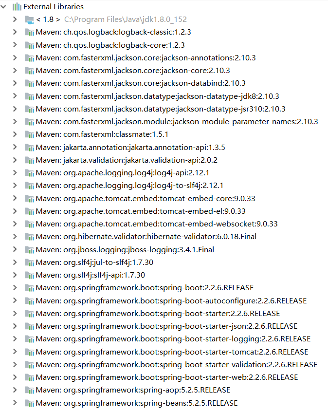
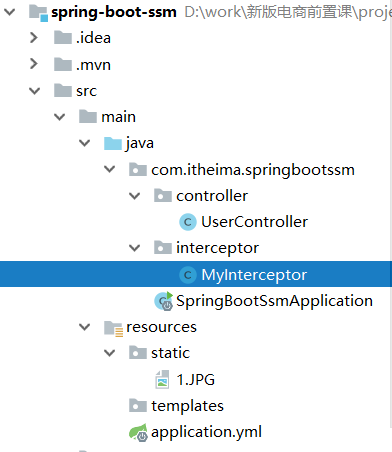

# 学习目标

* 了解Spring Boot的好处
* 掌握Spring Boot加载配置文件的方式
* 掌握Spring Boot 的基本使用
* 掌握Spring Boot整合SSM框架

# Spring Boot  简介

主要了解以下3个问题：

- 什么是Spring Boot
- 为什么要学习Spring Boot
- Spring Boot的特点  

## 1.1 什么是Spring Boot

Spring Boot 是在Spring框架基础上创建的一个全新框架。

[Spring官网](https://spring.io/projects)

SpringBoot是Spring项目中的一个子工程，与我们所熟知的Spring-framework 同属于Spring的产品:  


我们可以看到下面的一段介绍：  

> Takes an opinionated view of building production-ready Spring applications. Spring Boot
> favors convention over configuration and is designed to get you up and running as quickly
> as possible.  

翻译一下：  

> 用一些固定的方式来构建生产级别的Spring应用。 Spring Boot 推崇约定大于配置的方式以便于你能够尽可能快速的启动并运行程序。  

其实人们把Spring Boot 称为搭建程序的脚手架 。其最主要作用就是帮我们快速的构建庞大的Spring项目，并且尽可能的减少一切xml配置，做到开箱即用，迅速上手，让我们关注与业务而非配置。  

## 1.2 为什么要学习Spring Boot  

需求: 开发一个Web项目,给前端页面返回一个字符串"Hello Spring!"

传统Spring框架的痛点：

- 复杂的配置  

  项目各种配置其实是开发时的损耗， 因为在思考 Spring 特性配置和解决业务问题之间需要进行思维切换，所以写配置挤占了写应用程序逻辑的时间。  

  回顾一下传统Spring MVC 应用的开发流程：

  1. 新建Web工程，将spring-framework的jar包复制到工程中
  2. 添加web.xml文件，配置DispatcherServlet
  
  ```xml
  <web-app>
      <listener>
          <listener-class>org.springframework.web.context.ContextLoaderListener</listener-class>
      </listener>
      <context-param>
          <param-name>contextConfigLocation</param-name>
          <param-value>/WEB-INF/app-context.xml</param-value>
      </context-param>
      <servlet>
          <servlet-name>app</servlet-name>
          <servlet-class>org.springframework.web.servlet.DispatcherServlet</servlet-class>
          <init-param>
              <param-name>contextConfigLocation</param-name>
              <param-value></param-value>
          </init-param>
          <load-on-startup>1</load-on-startup>
      </servlet>
      <servlet-mapping>
          <servlet-name>app</servlet-name>
          <url-pattern>/app/*</url-pattern>
      </servlet-mapping>
  </web-app>
  ```
  
  3. 配置Spring MVC，配置包扫描、注解处理映射器、注解处理适配器、拦截器、视图解析器、控制器等等

  ```xml
  <?xml version="1.0" encoding="UTF-8"?>
  <beans xmlns="http://www.springframework.org/schema/beans"
      xmlns:mvc="http://www.springframework.org/schema/mvc"
    xmlns:xsi="http://www.w3.org/2001/XMLSchema-instance"
      xsi:schemaLocation="
          http://www.springframework.org/schema/beans
          https://www.springframework.org/schema/beans/spring-beans.xsd
          http://www.springframework.org/schema/mvc
          https://www.springframework.org/schema/mvc/spring-mvc.xsd">
  
      <mvc:annotation-driven conversion-service="conversionService"/>
  
      <bean id="conversionService" class="org.springframework.format.support.FormattingConversionServiceFactoryBean">
          <property name="converters">
              <set>
                  <bean class="org.example.MyConverter"/>
              </set>
          </property>
          <property name="formatters">
              <set>
                  <bean class="org.example.MyFormatter"/>
                  <bean class="org.example.MyAnnotationFormatterFactory"/>
              </set>
          </property>
          <property name="formatterRegistrars">
              <set>
                  <bean class="org.example.MyFormatterRegistrar"/>
              </set>
          </property>
      </bean>
      
      <mvc:interceptors>
      <bean class="org.springframework.web.servlet.i18n.LocaleChangeInterceptor"/>
      <mvc:interceptor>
          <mvc:mapping path="/**"/>
          <mvc:exclude-mapping path="/admin/**"/>
          <bean class="org.springframework.web.servlet.theme.ThemeChangeInterceptor"/>
      </mvc:interceptor>
      <mvc:interceptor>
          <mvc:mapping path="/secure/*"/>
          <bean class="org.example.SecurityInterceptor"/>
      </mvc:interceptor>
  </mvc:interceptors>
  
  </beans>
  ```
  
  4. 编写业务代码，业务中用到的Bean也需要配置在XML文件中，久而久之，配置文件变得既复杂又臃肿，严重影响问题排查和项目部署上线的速度。
  
- 混乱的依赖管理  

  项目的依赖管理也是件吃力不讨好的事情。决定项目里要用哪些库就已经够让人头痛的了，你还要知道这些库的哪个版本和其他库不会有冲突，这难题实在太棘手。并且，依赖管理也是一种损耗，添加依赖不是写应用程序代码。一旦选错了依赖的版本，随之而来的不兼容问题毫无疑问会是生产力杀手。  
  
  
  
- 项目部署时需要考虑依赖组件的JDK版本与tomcat版本兼容问题。

而Spring Boot让这一切成为过去！  

> Spring Boot 简化了基于Spring的应用开发，只需要“run”就能创建一个独立的、生产级别的Spring应用。 Spring Boot为Spring平台及第三方库提供开箱即用的设置（提供默认设置，存放默认配置的包就是启动器starter），这样我们就可以简单的开始。多数Spring Boot应用只需要很少的Spring配置。  

Spring Boot 内置了tomcat，无需再单独配置tomcat。

我们可以使用Spring Boot创建Java应用，并使用`java –jar `启动它，就能得到一个生产级别的web工程。  

## 1.3 Spring Boot的特点  

Spring Boot 设计的目的是简化Spring 应用的搭建和开发过程，它不但具有Spring的所有优秀特性，而且具有如下显著的特点：

- 为Spring 开发提供更加简单的使用和快速开发的技巧
- 具有开箱即用的默认配置功能，能根据项目依赖自动配置
- 具有功能更加强大的服务体系，包括嵌入式服务、安全、性能指标，健康检查等
- 绝对没有代码生成，可以不再需要 XML 配置，即可让应用更加轻巧和灵活 

Spring Boot 对于一些第三方技术的使用，提供了非常完美的整合，使用简单。

# 快速入门  

接下来，我们就来利用Spring Boot搭建一个web工程，体会一下Spring Boot的魅力所在！  

## 2.1 使用Maven创建项目(重点)

步骤：

```markdown
1. 搭建工程
2. 添加pom依赖, 父工程依赖,JDK配置,功能依赖
3. 添加启动类
4. 添加Controller实现业务逻辑
```


### 2.1.1 新建工程


1. 选择类型

   

   

   

2. 输入GroupId和ArtifactId

   

3. 指定项目名称和存放路径

   

4. 配置完成

   
   
5. 选择自动导入包

   
   
   
   
   

### 2.1.2 添加依赖

​		看到这里很多同学会有疑惑，前面说传统开发的问题之一就是依赖管理混乱，怎么这里我们还需要管理依赖呢？难道Spring Boot不帮我们管理吗？
​		别着急，现在我们的项目与Spring Boot还没有什么关联。 Spring Boot提供了一个名为`spring-boot-starter-parent`的工程，里面已经对各种常用依赖（并非全部）的版本进行了管理，我们的项目需要以这个项目为父工程，这样我们就不用操心依赖的版本问题了，需要什么依赖，直接引入即可！  

1. 添加父工程坐标  

   ```xml
   <parent>
       <groupId>org.springframework.boot</groupId>
       <artifactId>spring-boot-starter-parent</artifactId>
       <version>2.1.3.RELEASE</version>
   </parent>
   ```
   
2. 设置JDK版本

   ```xml
   <properties>
       <java.version>1.8</java.version>
   </properties>
   ```

3. 添加web**启动器**  

   为了让Spring Boot帮我们完成各种自动配置，我们必须引入Spring Boot提供的自动配置依赖模块，这些“开箱即用”的依赖模块都约定以`spring-boot-starter-`作为命名的前缀，我们称这些模块为 `启动器` 。
   

因为是web项目，这里引入web启动器：  

```xml
<dependencies>
    <dependency>
        <groupId>org.springframework.boot</groupId>
        <artifactId>spring-boot-starter-web</artifactId>
    </dependency>
</dependencies>
```

添加完成后可以看到项目中出现了大量的依赖：



这些依赖的版本号在哪定义呢？


查看依赖：


在这里有大量的版本配置


可以搜索相关组件的版本，比如搜索jedis


在下面可以找到相关的配置


注意这里是放在`dependencyManagement`节点中，只是做了一个定义，并不是真正的引用了，还需要在自己工程的pom文件中的`dependencies`节点中添加才会启用。


注1：如果遇到包下载慢的问题，可以配置Maven的国内镜像加速：

```xml
  <mirrors>
	<mirror>
		<id>aliyunmaven</id>
		<name>aliyun maven</name>
		<url>https://maven.aliyun.com/repository/public/</url>
		<mirrorOf>*</mirrorOf>
	</mirror>
  </mirrors>
```

注2：遇到包没下载成功，IDEA又不再下载的情况，可以看一下对应仓库里是否有`.lastUpdated`文件，将这些文件删除，再重新下载即可

windows系统

```shell
cd %userprofile%\.m2\repository
for /r %i in (*.lastUpdated) do del %i
```

linux系统

```shell
find /app/maven/localRepository -name "*.lastUpdated" -exec grep -q "Could not transfer" {} \; -print -exec rm {} \;
```

### 2.1.3 添加启动类

Spring Boot项目通过main函数即可启动，我们需要创建一个启动类：  


然后编写main函数：  

```java
import org.springframework.boot.SpringApplication;
import org.springframework.boot.autoconfigure.SpringBootApplication;

@SpringBootApplication
public class DemoApplication {
    public static void main(String[] args) {
        SpringApplication.run(DemoApplication.class,args);
    }
}
```

可以点击图中的三角启动：


## 2.2 添加Controller实现业务功能

添加Controller，这里需要注意，controller包和启动类在同一个包中


项目结构如下：


```java
@RestController  // 相当于@Controller + @ResponseBody
@RequestMapping("/hello")   // 定义服务的地址
public class HelloController {

    @GetMapping // @RequestMapping(method = RequestMethod.GET)
    public String hello() {
        return "Hello Spring Boot!" + System.currentTimeMillis();   // 加上当前时间的目的是为了刷新页面看到更改
    }
}
```

运行项目


启动后可以在控制台看到如下信息：


打开浏览器访问：http://localhost:8080/hello


总结搭建Spring Boot项目的步骤：

```markdown
1. 新建工程
2. 添加依赖
3. 添加启动类
4. 编写业务代码 一般使用@RestController给前端返回数据
```

## 2.3 使用Spring Initializr 创建项目

1. 新建项目

   

2. 选择类型，需要连接到 [Spring Initializr](https://start.spring.io/)下载模板，也可以使用阿里的加速网站https://start.aliyun.com/

   

3. 添加项目信息

   

4. 选择版本和组件

   

5. 输入项目名称

   

6. 开启自动导入

   

7. 加载完成

   

   完整的 pom:

   ```xml
   <?xml version="1.0" encoding="UTF-8"?>
   <project xmlns="http://maven.apache.org/POM/4.0.0" xmlns:xsi="http://www.w3.org/2001/XMLSchema-instance"
            xsi:schemaLocation="http://maven.apache.org/POM/4.0.0 https://maven.apache.org/xsd/maven-4.0.0.xsd">
       <modelVersion>4.0.0</modelVersion>
       <parent>
           <groupId>org.springframework.boot</groupId>
           <artifactId>spring-boot-starter-parent</artifactId>
           <version>2.1.16.RELEASE</version>
           <relativePath/> <!-- lookup parent from repository -->
       </parent>
       <groupId>com.itheima</groupId>
       <artifactId>spring-boot-demo2</artifactId>
       <version>0.0.1-SNAPSHOT</version>
       <name>spring-boot-demo2</name>
       <description>Demo project for Spring Boot</description>
   
       <properties>
           <java.version>1.8</java.version>
       </properties>
   
       <dependencies>
           <dependency>
               <groupId>org.springframework.boot</groupId>
               <artifactId>spring-boot-starter-web</artifactId>
           </dependency>
   
           <dependency>
               <groupId>org.springframework.boot</groupId>
               <artifactId>spring-boot-starter-test</artifactId>
               <scope>test</scope>
           </dependency>
       </dependencies>
   
       <build>
           <plugins>
               <plugin>
                   <groupId>org.springframework.boot</groupId>
                   <artifactId>spring-boot-maven-plugin</artifactId>
               </plugin>
           </plugins>
       </build>
   
   </project>
   
   ```
   
   

# Java加载配置

在入门案例中，我们没有任何的配置，就可以实现一个SpringMVC的项目了，快速、高效！
但是有同学会有疑问，如果没有任何的xml，那么我们如果要配置一个Bean该怎么办？  

## 3.1 回顾历史  

事实上，在Spring3.0开始， Spring官方就已经开始推荐使用Java注解配置来代替传统的xml配置了，我们不
妨来回顾一下Spring的历史：

- Spring1.0时代
  在此时因为jdk1.5刚刚出来，注解开发并未盛行，因此一切Spring配置都是xml格式，想象一下所
  有的bean都用xml配置，细思极恐啊，心疼那个时候的程序员2秒
- Spring2.0时代
  Spring引入了注解开发，但是因为并不完善，因此并未完全替代xml，此时的程序员往往是把xml
  与注解进行结合，貌似我们之前都是这种方式。
- Spring3.0及以后
  3.0以后Spring的注解已经非常完善了，因此Spring推荐大家使用完全的Java注解配置来代替以前的
  xml，不过似乎在国内并未推广盛行。然后当Spring Boot来临，人们才慢慢认识到Java配置的优
  雅。

有句古话说的好：拥抱变化，拥抱未来。所以我们也应该顺应时代潮流，做时尚的弄潮儿，一起来学习
下Java注解配置的玩法 。

## 3.2 Spring纯注解基本知识  

Java配置主要靠Java类和一些注解，比较常用的注解有：

* @Configuration：声明一个类作为配置类，代替xml文件
* @Bean： 声明在方法上，将方法的返回值加入Bean容器，代替 `<bean>`标签
* @Value：属性注入,替代xml中的属性注入
* @PropertySource：指定外部属性配置文件  

> 需求：定义一个简单的User类，定义配置文件， User对象中的属性值从配置文件中获取
>


添加lombok依赖：

> 快速查看依赖版本：

Spring Boot 官方地址：https://start.spring.io/


将网站的的依赖复制到项目的pom文件中：

```xml
<dependencies>
    <dependency>
        <groupId>org.springframework.boot</groupId>
        <artifactId>spring-boot-starter-web</artifactId>
    </dependency>
    <dependency>
        <groupId>org.projectlombok</groupId>
        <artifactId>lombok</artifactId>
        <optional>true</optional>
    </dependency>
</dependencies>
```


阿里云加速地址：https://start.aliyun.com/bootstrap.html


User类如下：  

```java
@Data
public class User {
    /**
     * 用户名
     */
    private String username;
    /**
     * 密码
     */
    private String password;
    /**
     * 年龄
     */
    private Integer age;
}
```


## 3.3 @Value方式(重点)

在resources下创建一个user.properties文件，里面的内容如下：  

```properties
user.username=zhangsan
user.password=123456
user.age=18
```

可以在controller中直接读取配置文件中的用户信息

```java
@RestController
@RequestMapping("/hello")
@PropertySource("classpath:user.properties")
public class HelloController {
    // 使用属性赋值  @Value("${属性}")
    @Value("${user.username}")
    private String username;
    @Value("${user.password}")
    private String password;
    @Value("${user.age}")
    private Integer age;

    @GetMapping("/user")
    public User getUser(){
        User user = new User();
        user.setUsername(username);
        user.setPassword(password);
        user.setAge(age);
        return user;
    }
}
```

打开浏览器访问 http://localhost:8080/hello/user


为了方便使用也可以将读取配置放到一个单独的配置类中

创建一个配置类，并使用@Configuration声明是一个配置类，在配置类中创建User对象  


```java
/**
 * 用户配置类,用于读取用户的配置信息
 */
@Configuration // 声明当前类为一个配置类，Spring 加载时会自动加载配置类
@PropertySource(value = "classpath:user.properties")    // 指定配置文件的位置在当前项目的资源目录
public class UserConfig {

    @Value("${user.username}")  // @Value使用属性注入
    private String username;
    @Value("${user.password}")
    private String password;
    @Value("${user.age}")
    private Integer age;

    // 定义一个Bean,相当于new 一个User对象，将这个对象交给Spring 容器管理
    @Bean
    public User getUser(){
        // 创建对象
        User user = new User();
        // 属性赋值
        user.setUsername(username);
        user.setPassword(password);
        user.setAge(age);
        // 返回对象
        return user;
    }
}
```

第三步：测试
在HelloController中添加一个方法，验证User中是否有值  

```java
@RestController  // 相当于@Controller + @ResponseBody
@RequestMapping("/hello")
public class HelloController {

    // 定义服务的地址
    @GetMapping // @RequestMapping(method = RequestMethod.GET)
    public String hello() {
        return "Hello Spring Boot!" + System.currentTimeMillis();   // 加上当前时间的目的是为了刷新页面看到更改
    }

    @Autowired  // 自动注入
    private User user;

    @GetMapping("/user")
    public User getUser(){
        return user;
    }
}
```

打开浏览器：http://localhost:8080/hello/user 也能成功看到用户信息。

## 3.4 Environment获取数据方式  

Spring中的Environment用来表示整个应用运行时的环境，可以使用Environment获取整个运行环境中
的配置信息：方法是： environment.getProperty（配置文件中的key） ,返回的一律都是字符串，可以
根据需要转换。  

```java
import com.itheima.springbootdemo.domain.User;
import org.springframework.beans.factory.annotation.Autowired;
import org.springframework.context.annotation.Bean;
import org.springframework.context.annotation.Configuration;
import org.springframework.context.annotation.PropertySource;
import org.springframework.core.env.Environment;

@Configuration  // 声明这个类是一个配置类
@PropertySource(value = "classpath:user.properties") //加载配置文件
public class UserConfig {
    @Autowired
    private Environment environment;
    @Bean   //创建User对象，交给spring容器 User对象中的值从配置文件中获取
    public User getUser() {
        User user = new User();
        user.setUsername(environment.getProperty("user.username"));
        user.setPassword(environment.getProperty("user.password"));
        user.setAge(Integer.parseInt(environment.getProperty("user.age")));
        return user;
    }
}
```

## 3.5 @ConfigurationProperties方式 (重点)

Spring Boot约定的、非常简洁的配置方式
首先约定，配置信息需要写在一个`application.properties`的文件中
第一步：在resources中创建一个`application.properties`文件，文件内容如下(和`user.properties`中的内
容一样)：  

```properties
user.username=zhangsan
user.password=123456
user.age=18
```

第二步：修改配置类如下：  

```java
@Configuration  // 声明这个类是一个配置类
public class UserConfig {

    @Bean   //创建User对象，交给spring容器 User对象中的值从配置文件中获取
    @ConfigurationProperties(prefix = "user")   //前缀
    public User getUser() {
        User user = new User();
        return user;
    }
}
```

如果出现乱码问题，需要设置IDEA

> File -> Settings -> Editor -> File Encodings

将Properties Files (*.properties)下的Default encoding for properties files设置为UTF-8，将Transparent native-to-ascii conversion前的勾选上


配置完成后,一定要 **重新重新重新** 新建一个`application.properties`，还需要注意尽量不要在配置文件中使用中文。

## 3.6 Spring Boot支持的配置文件(重点)  

配置文件除了可以使用`application.properties`类型，还可以使用后缀名为： `.yml`或者`.yaml`的类型，也
就是： `application.yml`或者`application.yaml `

yml和yaml基本格式是一样的：  

```yaml
user:
  username: zhangsan
  password: 123456
  age: 20
```


可以在配置文件中定义一个数组或集合  

在User类中添加4个属性：

```java
@Data
public class User {
    private String username;
    private String password;
    private Integer age;

    private List<String> girlNames; //字符串集合
    private String[] boyNames;  //数组
    private List<User> userList;    // 对象集合
    private Map<String,String> stuMap;  // map
}
```

在`application.yml`或`application.yaml`中添加如下配置  

```yaml
user:
  username: tom
  password: 123456
  age: 18
  girlNames:
    - xiaoli
    - xiaomei
  boyNames:
    - xiaoming
    - xiaolei
  userList:
    - username: xiaofei
      password: 123
      age: 19
    - username: xiaoqiang
      password: 456
      age: 100
  stuMap:
    name1: xiaojie
    name2: xiaoqi
```


**优先级**：

在项目中其实只出现一种配置文件就可以了，但是如果真的有properties、 yaml、 yml三种配置文件时，那它们被加载的优先级是：
properties > yml > yaml  优先级高的配置生效

如果**相同**的配置在这三个配置文件中都配置了，那么以properties 中的为主

在企业中只使用其中的一种来配置，千万不要同时存在

推荐使用**yml**

## 3.7 Spring Boot 默认配置

Spring Boot Web项目启动时，默认在8080端口启动：


Spring Boot 封装了大量的默认配置：https://docs.spring.io/spring-boot/docs/2.2.7.RELEASE/reference/html/appendix-application-properties.html#common-application-properties

https://docs.spring.io/spring-boot/docs/2.1.3.RELEASE/reference/html/common-application-properties.html


如果想要修改tomcat的端口，可以在配置文件（application.properties或者application.yml）中修改：

```yaml
server:
  port: 8080
```

在配置文件中配置的内容会覆盖默认的配置。


这些配置也可以在元数据中查看：


比如查看tomcat的端口：


# Spring Boot 实践

## 4.1 准备数据库

数据库脚本文件在资料目录中 `springboot_db.sql`

## 4.2 新建项目

搭建Spring Boot 应用常规步骤：

```markdown
1. 新建工程，添加依赖
2. 添加启动类
3. 添加配置文件
```

新建项目spring-boot-ssm


添加依赖

```xml
<parent>
    <groupId>org.springframework.boot</groupId>
    <artifactId>spring-boot-starter-parent</artifactId>
    <version>2.1.3.RELEASE</version>
    <relativePath/> <!-- lookup parent from repository -->
</parent>
<properties>
    <java.version>1.8</java.version>
</properties>
<dependencies>
    <dependency>
        <groupId>org.springframework.boot</groupId>
        <artifactId>spring-boot-starter-web</artifactId>
    </dependency>
    <dependency>
        <groupId>org.projectlombok</groupId>
        <artifactId>lombok</artifactId>
        <optional>true</optional>
    </dependency>
</dependencies>
```

添加配置文件application.yml

```yaml
server:
  port: 8080
spring:
  application:
    name: user-service
```

添加启动类


```java
import org.springframework.boot.SpringApplication;
import org.springframework.boot.autoconfigure.SpringBootApplication;

@SpringBootApplication
public class SSMApplication {
    public static void main(String[] args) {
        SpringApplication.run(SSMApplication.class, args);
    }
}
```

## 4.3 Spring MVC 配置

### 4.3.1 日志配置

日志级别分为FATAL、ERROR、WARN、INFO、DEBUG、ALL或者自定义的级别。Log4j建议只使用四个级别，优先级从高到低分别是 ERROR、WARN、INFO、DEBUG。

通过在这里定义的级别，可以控制到应用程序中相应级别的日志信息的开关。比如定义了INFO级别， 则应用程序中所有DEBUG级别的日志信息将不被打印出来。 

企业生产环境,一般是设置为info级别

开发和测试的时候设置为debug级别

日志级别控制：

```yaml
logging:
  level:
    com.itheima: debug  # 表示所有的级别的日志都能输出
#    com.itheima: info  # 表示info级别以上的才能输出
    org.springframework.web: debug
```

其中：

- logging.level：是固定写法，说明下面是日志级别配置，日志相关其它配置也可以使用。
- com.itheima和org.springframework是指定包名，后面的配置仅对这个包有效。
- debug：日志的级别 常用的级别有4个  debug  info  warn  error

添加controller

```java
@RestController
@RequestMapping("/user")
@Slf4j
public class UserController {

    @GetMapping
    public String get() {
        log.debug("调用了get方法");
        return "您查询到了一个用户. " + System.currentTimeMillis();
    }
}
```

浏览器访问http://localhost:8080/user


可以在控制台看到日志输出


### 4.3.2 端口配置

可以设置web访问端口

```java
# 映射端口
server:
 port: 8080
```

### 4.3.3 静态资源

默认的静态资源路径为：

- classpath:/META-INF/resources/
- classpath:/resources/
- classpath:/static/
- classpath:/public

只要静态资源放在这些目录中任何一个，SpringMVC都会帮我们处理。

我们习惯会把静态资源放在`classpath:/static/`目录下。我们创建目录，并且添加一些静态资源：


打开浏览器访问：http://localhost:8080/1.jpg


### 4.3.4 拦截器

拦截器也是我们经常需要使用的，在SpringBoot中该如何配置呢？

在官方文档中有说明：https://docs.spring.io/spring-boot/docs/2.1.3.RELEASE/reference/html/boot-features-developing-web-applications.html#boot-features-spring-mvc-auto-configuration


翻译：

> 如果你想要保持Spring Boot 的一些默认MVC特征，同时又想自定义一些MVC配置（包括：拦截器，格式化器, 视图控制器、消息转换器 等等），你应该让一个类实现`WebMvcConfigurer`，并且添加`@Configuration`注解，但是**千万不要**加`@EnableWebMvc`注解。如果你想要自定义`HandlerMapping`、`HandlerAdapter`、`ExceptionResolver`等组件，你可以创建一个`WebMvcRegistrationsAdapter`实例 来提供以上组件。
>
> 如果你想要完全自定义SpringMVC，不保留SpringBoot提供的一切特征，你可以自己定义类并且添加`@Configuration`注解和`@EnableWebMvc`注解

首先我们定义一个拦截器，需要实现`HandlerInterceptor`接口


```java
@Slf4j
public class MyInterceptor implements HandlerInterceptor {
    @Override
    public boolean preHandle(HttpServletRequest request, HttpServletResponse response, Object handler) throws Exception {
        log.debug("preHandle方法执行...");
        return true;
    }

    @Override
    public void postHandle(HttpServletRequest request, HttpServletResponse response, Object handler, ModelAndView modelAndView) throws Exception {
        log.debug("postHandle方法执行...");
    }

    @Override
    public void afterCompletion(HttpServletRequest request, HttpServletResponse response, Object handler, Exception ex) throws Exception {
        log.debug("afterCompletion方法执行...");
    }
}
```


项目结构：




添加配置类，注册拦截器


```java
@Configuration
public class MyWebConfig implements WebMvcConfigurer {
    /**
     * 重写接口中的addInterceptors方法，添加自定义拦截器
     * @param registry
     */
    @Override
    public void addInterceptors(InterceptorRegistry registry) {
        // 通过registry来注册拦截器，通过addPathPatterns来添加拦截路径
        registry.addInterceptor(new MyInterceptor())
                .addPathPatterns("/user/**")
                .excludePathPatterns("/user/login");  // 这个地址的不拦截
    }
}
```


添加login方法

```java
@RestController
@RequestMapping("/user")
@Slf4j
public class UserController {

    @GetMapping
    public String get() {
        log.debug("调用了get方法:" + System.currentTimeMillis());
        return "您查询到了一个用户." + System.currentTimeMillis();
    }

    @GetMapping("/login")
    public String login() {
        return "success";
    }
}
```


启动应用并访问页面

可以看到日志


## 4.4 整合jdbc和事务

spring中的jdbc连接和事务是配置中的重要一环，在SpringBoot中该如何处理呢？

答案是不需要处理，我们只要找到SpringBoot提供的启动器即可：

```xml
<dependency>
    <groupId>org.springframework.boot</groupId>
    <artifactId>spring-boot-starter-jdbc</artifactId>
</dependency>
```

当然，不要忘了数据库驱动，SpringBoot并不知道我们用的什么数据库，这里我们选择MySQL：

```xml
<dependency>
    <groupId>mysql</groupId>
    <artifactId>mysql-connector-java</artifactId>
    <version>5.1.47</version>
</dependency>
```

添加用户实体类


```java
import lombok.Data;
import java.util.Date;

@Data
public class User {
    // id
    private Long id;
    // 用户名
    private String userName;
    // 密码
    private String password;
    // 姓名
    private String name;
    // 年龄
    private Integer age;
    // 性别，1男性，2女性
    private Integer sex;
    // 出生日期
    private Date birthday;
    // 创建时间
    private Date created;
    // 更新时间
    private Date updated;
    // 备注
    private String note;
}
```

添加用户服务类


至于事务，SpringBoot中通过注解来控制。就是我们熟知的`@Transactional`

```java
@Service
public class UserService {

    public User findById(Long id){
        // 开始查询
        return new User();
    }

    // 方法中的多个操作要么全部成功,要么失败回滚,需要加上事务
    @Transactional
    public void deleteById(Long id) {
        // 关联查询,判断是否可以删除
        // 将关联记录删除,可能有多个操作
        System.out.println("删除了id为:" + id + "的用户.");
    }
}
```

## 4.5 整合连接池

其实，在刚才引入jdbc启动器的时候，SpringBoot已经自动帮我们引入了一个连接池：


HikariCP应该是目前速度最快的连接池了，我们看看它与c3p0的对比：


- 一个 *Connection Cycle* 定义为简单的 `DataSource.getConnection()`/`Connection.close()`.
- 一个 *Statement Cycle* 定义为简单的 `Connection.prepareStatement()`, `Statement.execute()`, `Statement.close()`.

因为`spring-boot-starter-jdbc`默认已经集成了HikariCP，所以只需要指定连接参数即可：

```yaml
spring:
  datasource:
    driver-class-name: com.mysql.jdbc.Driver
    url: jdbc:mysql://192.168.85.135:3306/springboot_db?characterEncoding=utf-8&useUnicode=true&useSSL=false
    username: root
    password: root
```


## 4.6 整合Mybatis(重点)

SpringBoot官方并没有提供Mybatis的启动器，不过Mybatis[官网](https://github.com/mybatis/spring-boot-starter)自己实现了

集成步骤：

```markdown
1. 在pom中添加mybatis的依赖
2. 配置文件中添加数据库地址和mybatis自定义配置
3. 编写实体类
4. 编写mapper接口
5. 编写mapper.xml
6. 编写service
7. 配置mapper包扫描
8. 添加Controller编写业务代码
```


1. 在pom.xml文件中引入相关依赖

   ```xml
   <dependency>
       <groupId>org.mybatis.spring.boot</groupId>
       <artifactId>mybatis-spring-boot-starter</artifactId>
       <version>2.1.3</version>
   </dependency>
   ```
   
2. 添加数据库配置

   ```yaml
   server:
     port: 8080
   spring:
     application:
       # 应用的名称
       name: user-service
     datasource:
       # 指定MySQL驱动
       driver-class-name: com.mysql.jdbc.Driver
       # MySQL连接地址  如果是本地安装 将192.168.85.135 替换成localhost
       url: jdbc:mysql://192.168.85.135:3306/springboot_db?characterEncoding=utf-8&useUnicode=true&useSSL=false
       # 数据库用户名
       username: root
       # 数据库密码
       password: root
     jackson:
       # 返回Json类型的数据时时间的显示方式
       date-format: yyyy-MM-dd HH:mm:ss
       # 时区 中国的时区是第8个时区
       time-zone: GMT+8
   ```

3. mybatis 自定义配置

   ```yaml
   mybatis:
     # MyBaits 别名包扫描路径，通过该属性可以给包中的类注册别名，注册后在 Mapper 对应的 XML 文件中可以直接使用类名，而不用使用全限定的类名(即 XML 中调用的时候不用包含包名)
     type-aliases-package: com.itheima.springbootssm.entity
     # mapper.xml文件位置,如果没有映射文件，请注释掉
     mapper-locations: classpath:mappers/**.xml
     configuration:
       # 输出sql语句
       log-impl: org.apache.ibatis.logging.stdout.StdOutImpl
       # 开启自动驼峰命名规则（camel case）映射，即从经典数据库列名 A_COLUMN（下划线命名） 到经典 Java 属性名 aColumn（驼峰命名） 的类似映射
       map-underscore-to-camel-case: true
   ```

   

4. 添加mapper包，创建UserMapper 接口

   

   ```java
   public interface UserMapper {
       User findById(Long id);
   }
   ```

   

5. 添加mapper配置文件 UserMapper.xml，位置如下

   

   

   ```xml
   <?xml version="1.0" encoding="UTF-8" ?>
   <!DOCTYPE mapper PUBLIC "-//mybatis.org//DTD Mapper 3.0//EN" "http://mybatis.org/dtd/mybatis-3-mapper.dtd" >
   <mapper namespace="com.itheima.springbootssm.mapper.UserMapper">
       <!--注意包名不要错了-->
       <select id="findById" parameterType="long" resultType="user">
           select * from tb_user where id=#{id}
       </select>
   </mapper>
   ```

   

   

6. 配置mapper接口扫描

   有两种实现方式：

   > 方式一

   我们需要给每一个Mapper接口添加`@Mapper`注解，由Spring来扫描这些注解，完成Mapper的动态代理。

   ```java
   @Mapper
   public interface UserMapper {
   }
   ```

   > 方式二

   在启动类上添加扫描包注解(**推荐**)：

   ```java
   @SpringBootApplication
   @MapperScan("com.itheima.springbootssm.mapper")
   public class Application {
       public static void main(String[] args) {
           // 启动代码
           SpringApplication.run(Application.class, args);
       }
   }
   ```

   这种方式的好处是，不用给每一个Mapper都添加注解。

   以下代码示例中，我们将采用@MapperScan扫描方式进行。

7. ​	修改`UserService`

   ```java
   @Service
   public class UserService {
   
       @Autowired
       private UserMapper userMapper;
   
       public User findById(Long id){
           // 开始查询
           return userMapper.findById(id);
       }
   
       @Transactional
       public void deleteById(Long id){
           // 开始删除
           System.out.println("删除了： " + id);
       }
   }
   ```

8.  修改controller

   ```java
   @RestController
   @RequestMapping("/user")
   @Slf4j
   public class UserController {
   
       @Autowired
       private UserService userService;
   
       @GetMapping("/{id}")
       public User findById(@PathVariable Long id){
           return userService.findById(id);
       }
   }
   ```

9. 测试

   浏览器访问http://localhost:8080/user/1

   

   

   

## 4.8 通用mapper(重点)


步骤:

```markdown
1. 引入通用mapper依赖
2. 删除之前的mybatis依赖和配置
3. 编写mapper接口,继承自basemapper
4. 配置mapper包扫描,使用的是通用mapper的@MapperScan
5. 实体类上需要添加相关的注解@Table和@Id
```


https://mybatis.io/

https://github.com/abel533/Mapper

https://gitee.com/free/Mapper/wikis/Home

**注意：先把mybatis相关的配置文件删除、把引导类上mapperScan注解删除、把mybatis的启动器删除**


通用Mapper的作者也为自己的插件编写了启动器，我们直接引入即可：

```xml
<!-- 通用mapper -->
<dependency>
    <groupId>tk.mybatis</groupId>
    <artifactId>mapper-spring-boot-starter</artifactId>
    <version>2.1.5</version>
</dependency>
```

**注意**：一旦引入了通用Mapper的启动器，会覆盖Mybatis官方启动器的功能，因此需要移除对官方Mybatis启动器的依赖。

无需任何配置就可以使用了。

如果有特殊需要，可以到通用mapper官网查看：https://github.com/abel533/Mapper


另外，我们需要把启动类上的@MapperScan注解修改为通用mapper中自带的：


修改mapper接口

```java
public interface UserMapper extends BaseMapper<User> {
    
}
```

在实体类上添加注解`@Table`，主键上添加`@Id`

```java
@Data
@Table(name = "tb_user")
public class User {
    // id
    @Id
    private Long id;
    // 用户名
    private String userName;
    // 密码
    private String password;
    // 姓名
    private String name;
    // 年龄
    private Integer age;
    // 性别，1男性，2女性
    private Integer sex;
    // 出生日期
    private Date birthday;
    // 创建时间
    private Date created;
    // 更新时间
    private Date updated;
    // 备注
    private String note;
}
```


修改UserService

```java
@Service
public class UserService {

    @Autowired
    private UserMapper userMapper;

    public User findById(Long id){
        // 根据主键查询
        return userMapper.selectByPrimaryKey(id);
    }
}
```


打开页面测试：http://localhost:8080/user/1


# 经验值

##  6.1🎗原理分析经验分享

分析springboot项目中传递依赖的默认版本号和默认加载的配置文件

### 1.已知代码

一个maven项目中添加如下配置

```xml
<parent>
    <groupId>org.springframework.boot</groupId>
    <artifactId>spring-boot-starter-parent</artifactId>
    <version>2.1.3.RELEASE</version>
</parent>

<dependencies>
     <dependency>
            <groupId>org.springframework.boot</groupId>
            <artifactId>spring-boot-starter-web</artifactId>
        </dependency>
    <dependency>
        <groupId>mysql</groupId>
        <artifactId>mysql-connector-java</artifactId>
    </dependency>
     <dependency>
            <groupId>org.projectlombok</groupId>
            <artifactId>lombok</artifactId>
     </dependency>
</dependencies>
```

### 2.问题分析

如上添加依赖时没有写依赖的版本号，但是看项目的Dependencies时，发现每个依赖都是有版本号的：


项目main方法启动后，默认使用Tomcat的端口号是8080，这些依赖的版本号在哪里定义了？8080这个端口号又是在哪里定义的？接下来我们追踪一下源码。

### 3.源码分析

1、关于依赖版本号的源码分析

分析spring-boot-starter-parent

按住Ctrl点击当前项目pom.xml中的spring-boot-starter-parent，可以看到了spring-boot-starter-parent的pom.xml。

发现它还有一个parent

```xml
<parent>
        <groupId>org.springframework.boot</groupId>
        <artifactId>spring-boot-dependencies</artifactId>
        <version>2.1.3.RELEASE</version>
        <relativePath>../../spring-boot-dependencies</relativePath>
</parent>
```

按住Ctrl继续点击spring-boot-dependencies 会发现这个parent有一个<properties>标签

```xml
<properties>
        <activemq.version>5.15.8</activemq.version>
        <antlr2.version>2.7.7</antlr2.version>
        <appengine-sdk.version>1.9.71</appengine-sdk.version>
        <artemis.version>2.6.4</artemis.version>
        <aspectj.version>1.9.2</aspectj.version>
        <assertj.version>3.11.1</assertj.version>
        <atomikos.version>4.0.6</atomikos.version>
        <bitronix.version>2.1.4</bitronix.version>
        <build-helper-maven-plugin.version>3.0.0</build-helper-maven-plugin.version>
        <byte-buddy.version>1.9.10</byte-buddy.version>
        <caffeine.version>2.6.2</caffeine.version>
    .......这里省略了很多
</properties>>  
```


此标签里有很多的<xxx.version>，便是maven的版本控制，当我们给与spring-boot-starter-parent版本后，它会给相关的坐标锁定版本。而spring的缺点就是因为版本不一致导致jar包冲突，SpringBoot直接给我们锁定了相关jar包的版本，也就避免的这个问题。

而spring-boot-dependencies.xml文件中还有一个<dependencyManagement>

```xml
<dependencyManagement>
        <dependencies>
            <dependency>
                <groupId>org.springframework.boot</groupId>
                <artifactId>spring-boot</artifactId>
                <version>2.1.3.RELEASE</version>
......这里也省略了很多
```


里面包含autoconfigure，devtools...等依赖的管理

而build标签中包含如下

```xml
<includes>
    <include>/application*.yml</include>
    <include>/application.yaml</include>
    <include>**/application.properties</include>
</includes>
```


表示springBoot让我们配置的文件是".yml",".yaml"和".properties",并以application开头。

所以spring-boot-starter-parent作用主要是我们的SpringBoot工程继承spring-boot-starter-parent后已经具备版本锁定等配置，而起步依赖的作用就是进行依赖的传递。


2、关于Tomcat默认端口号

配置文件就是和spring.factories在同一目录下的spring-configuration-metadata.json文件


打开文件可以看到如图：


很明显这里就是工程启动tomcat默认的端口地址


##  6.2🎗经验分享

使用通用mapper完成根据主键查询用户

### 1.已知代码

表结构：

```sql
CREATE TABLE `tb_user` (
  `id` bigint(20) NOT NULL AUTO_INCREMENT,
  `user_name` varchar(100) DEFAULT NULL COMMENT '用户名',
  `password` varchar(100) DEFAULT NULL COMMENT '密码',
  `name` varchar(100) DEFAULT NULL COMMENT '姓名',
   PRIMARY KEY (`id`)
) 
```

实体类代码：

```java
@Data
@Table(name="tb_user") //类名和表名要映射
public class User{
    private Long id;
    private String userName; 
    private String password;
    private String name;
}
```

dao代码：

```java
public interface UserMapper extends BaseMapper<User> {
}
```

service代码：

```java
@Service
public class UserService {
    @Autowired
    private UserMapper userMapper;
    public User findById(Long id) {
        return userMapper.selectByPrimaryKey(id); //根据主键查询
    }
}

```

controller代码：

```java
@Controller
@RequestMapping("/user")
public class UserController {
    @Autowired
    private UserService userService;

    @GetMapping("/{id}")
    @ResponseBody
    public User findById(Model model,@PathVariable("id") Long id){
        User user = userService.findById(id);
        return user;
    }
}

```

引导类(启动类)代码：

```java
package com.leyou;
import org.springframework.boot.SpringApplication;
import org.springframework.boot.autoconfigure.SpringBootApplication;
import tk.mybatis.spring.annotation.MapperScan;

@SpringBootApplication //固定的注解
@MapperScan("com.leyou.mapper")  //这里是通用mapper的注解
public class MyApplication{
    public static void main(String[] args) {
        SpringApplication.run(MyApplication.class, args);
    }
}

```


### 2.出现的问题

在浏览器上输入url访问时发现没有显示数据


 

### 3.问题分析

1、可以先查看一下表中是否有数据

2、如果确认有数据，看后台是否报错 ，后台发现没有报错，但是有一个这样的SQL语句： 

后台日志显示如上信息，我们是根据主键查询用户，但是sql语句是根据所有字段进行查询了

### 4.问题解答办法

出现以上问题的原因是没有给实体类确认主键，只需要告诉代码那个字段是主键即可，根据通用mapper官方文档，解决方法是在id上添加一个@Id注解即可


