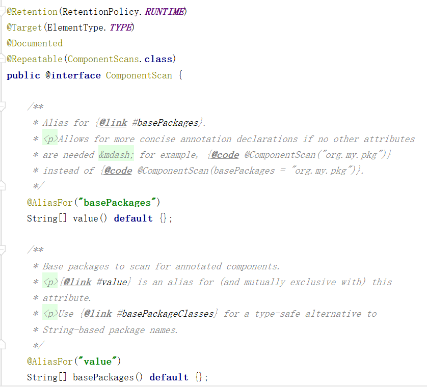

# 学习目标

* 掌握Spring Boot 整合常用的框架
* 掌握Spring Boot 自动配置原理
* 掌握自定义启动器
* 了解Spring Boot 监控
* 掌握Spring Boot 项目部署

# SpringBoot 整合Thymeleaf  

## 1.1 Thymeleaf 简介

​		Thymeleaf是什么呢？他是一个用于展示页面的模板引擎，通俗来讲，就是Java工程师用于开发html页面的，之前我们学的是jsp也可以开发页面，但是SpringBoot 推荐用thymeleaf，为什么呢？原因有2个：

* thymeleaf的运行效率比jsp高
* thymeleaf开发起来比jsp简单

基于这两点原因，我们要用thymeleaf来开发页面。虽然现在的互联网企业中的开发是前后端严格分离，作为一个纯后台开发工程师，我们在企业中开发页面的机会非常小，只需要通过接口给前端提供json数据即可，但是有一些旧的系统或者一些简单的后台管理系统还是需要在后端写页面，这时就可以使用thymeleaf进行开发。

## 1.2 快速入门

步骤：

```markdown
1. 搭建项目，添加依赖
2. 添加thymeleaf启动器依赖
3. 添加controller,因为要使用页面，就不再是@RestController
4. 添加页面
```

在之前的`spring-boot-ssm`项目中进行修改

(1) 引入thymeleaf的依赖  

```xml
<dependency>
    <groupId>org.springframework.boot</groupId>
    <artifactId>spring-boot-starter-thymeleaf</artifactId>
</dependency>
```

(2) 修改UserService ，添加查找所有用户方法

```java
@Service
public class UserService {

    @Autowired
    private UserMapper userMapper;

    public User findById(Long id){
        // 开始查询
        return userMapper.selectByPrimaryKey(id);
    }
	/**
     * 返回所有用户
     * @return
     */	
    public List<User> selectAll(){
        return userMapper.selectAll();
    }
}
```


(3) 在controller中修改@RestController改为@Controller（这样，Controller中方法返回的就不是Json字符串，而是页面了）,方法的参数添加HttpServletRequest httpServletRequest，然后就可以将从数据库获取的对象放入到request的作用域中，返回值改为String类型，返回的值为页面的名称（注意不加后缀，user就代表了user.html）  

```java
@Controller
@RequestMapping("/user")
@Slf4j  // 日志封装
public class UserController {

    @Autowired
    private UserService userService;

    /**
     * 查询用户列表并返回list页面
     * @param model
     * @return
     */
    @GetMapping
    public String list(Model model){
        List<User> users = userService.selectAll();
        model.addAttribute("userList",users);
        return "list";
    }

    /**
     * 根据用户ID查找数据并返回view页面
     * @param id
     * @param model
     * @return
     */
    @GetMapping("/{id}")    // http://localhost:8080/user/1
    public String findById(@PathVariable("id") Long id, Model model){
        User user = userService.findById(id);
        model.addAttribute("user",user);
        return "view";
    }
}
```

(4) 在resources下创建templates文件夹，将资料目录static中的文件复制到项目中


(5)访问http://localhost:8080/user/


点击其中一条进行查看


## 1.3 配置原理

为什么上面的Controller中返回的`user`会指向`user.html`页面呢？

**流程图**：


跟进源码流程(了解)：


在`org.springframework.boot.autoconfigure.EnableAutoConfiguration`中可以找到Thymeleaf的自动配置


查看`ThymeleafAutoConfiguration`源码，找到默认的模板解析器


`ThymeleafProperties`源码中有默认的配置


当我们返回`user`的时候，模板引擎会在项目的resources的templates目录中找到对应的以`.html`结尾的页面


# SpringBoot 整合Redis  

企业中使用Redis来缓存热点数据，热点数据就是查询次数特别多，Redis是一个内存型的NoSql数据库

需要启动Redis-server

## 2.1 快速入门

使用Redis步骤：

```markdown
1. pom中添加SpringDataRedis依赖
2. 添加启动类
3. 配置文件中添加Redis地址
4. 使用StringRedisTemplate操作Redis
```

1. 添加项目`spring-boot-redis-demo`，pom中添加spring boot parent 

   ```xml
   <parent>
       <groupId>org.springframework.boot</groupId>
       <artifactId>spring-boot-starter-parent</artifactId>
       <version>2.1.3.RELEASE</version>
       <relativePath/> <!-- lookup parent from repository -->
   </parent>
   <properties>
       <java.version>1.8</java.version>
   </properties>
   <dependencies>
       <dependency>
           <groupId>org.springframework.boot</groupId>
           <artifactId>spring-boot-starter-web</artifactId>
       </dependency>
       <dependency>
           <groupId>org.projectlombok</groupId>
           <artifactId>lombok</artifactId>
           <optional>true</optional>
       </dependency>
   </dependencies>
   ```

2. 添加Redis依赖

   ```xml
   <dependency>
       <groupId>org.springframework.boot</groupId>
       <artifactId>spring-boot-starter-data-redis</artifactId>
   </dependency>
   ```
   
3. 添加启动类

   ```java
   @SpringBootApplication
   public class RedisApplication {
       public static void main(String[] args) {
           SpringApplication.run(RedisApplication.class,args);
       }
   }
   ```

   

4. 添加配置文件application.yml，添加Redis地址配置

   ```yaml
   spring:
     redis:
       # 配置redis地址
       host: 192.168.85.135
       # 配置redis端口
       port: 6379
   ```

5. 添加启动类，小技巧，如果只想做整合redis的demo，那么为了简单起见，让启动类实现implements
   ApplicationRunner接口，那么在启动类启动之后，会自动帮你执行重新的run方法  

   ```java
   @SpringBootApplication
   public class RedisApplication implements ApplicationRunner {
       public static void main(String[] args) {
           SpringApplication.run(RedisApplication.class, args);
       }
   
       @Override
       public void run(ApplicationArguments args) throws Exception {
           // 在SpringBoot启动后执行该方法
           
       }
   }
   ```
   
6. 可以直接使用自动注入的stringRedisTemplate对象  ，企业中一般需要添加Redis命名前缀

   ```java
   @SpringBootApplication
      public class RedisApplication implements ApplicationRunner {
          public static void main(String[] args) {
              SpringApplication.run(RedisApplication.class, args);
          }
      
          @Autowired
          private StringRedisTemplate redisTemplate;  // redis操作模板工具
      
          @Override
          public void run(ApplicationArguments args) throws Exception {
              // 在SpringBoot启动后执行该方法
              // 操作redis
              //  定义一个key
              // 企业中redis一般由运维统一搭建的集群，多个部门共同使用
              // 需要区分redis中的key是由哪个部门、哪个项目、哪个模块来使用
              // 运维可以根据redis的数据做统计  一般情况下命名风格：   部门:项目:模块:key
              String key = "dp27:redisdemo:name";
              // 定义value
              String value = "迪丽热巴";
              // 将key:value存储到redis中
              redisTemplate.opsForValue().set(key, value);
              // 读取redis中的数据
              String result = redisTemplate.opsForValue().get(key);
              System.out.println("从redis中读取的名字为：" + result);
          }
      }
   ```

   

   


## 2.2 配置原理

为什么加载了redis的starter之后，stringRedisTemplate对象会自动被new出来，可以@Autowired了呢？  

**流程图**：


源码跟进流程(了解)：

1，这个stringRedisTemplate对象是在如下springboot内置的jar包中被自动装配的  

```xml
<dependency>
<groupId>org.springframework.boot</groupId>
<artifactId>spring-boot-autoconfigure</artifactId>
</dependency>
```

2，在这个jar包中有一个
org.springframework.boot.autoconfigure.data.redis.RedisAutoConfiguration类，


这个类中@ConditionalOnClass(RedisOperations.class)是@Configuration的开关，当系统检测到RedisOperations这个类的时候，开关才会打开@Configuration才会生效，@Bean才会生效，才会真正
的new一个StringRedisTemplate对象到spring容器中  


## 2.3 SpringBoot 单元测试

在企业中，为了测试某一个功能，经常需要对这个功能进行单元测试。

SpringBoot 集成单元测试步骤：

1. 添加依赖

   ```xml
   <dependency>
       <groupId>org.springframework.boot</groupId>
       <artifactId>spring-boot-starter-test</artifactId>
       <scope>test</scope>
   </dependency>
   ```

2. 在test/java中添加包和类

   

   测试类上添加注解：

   ```java
   @RunWith(SpringRunner.class)
   @SpringBootTest
   public class RedisTests {
       
   }
   ```

3. 将启动类中操作Redis的代码转移到测试类中，启动类中的代码删除，测试类中的方法上需要添加@Test注解

   ```java
   @RunWith(SpringRunner.class)
   @SpringBootTest
   public class RedisTests {
       @Autowired
       private StringRedisTemplate redisTemplate;
       @Test
       public void testRedis() {
           String key = "dp27:redisdemo:name";
           // 定义value
           String value = "迪丽热巴";
           // 将key:value存储到redis中
           redisTemplate.opsForValue().set(key, value);
           // 读取redis中的数据
           String result = redisTemplate.opsForValue().get(key);
           System.out.println("从redis中读取的名字为：" + result);
       }
   }
   ```

4. 点击Run开始运行

   

   可以看到测试的结果

   

   


# 自动配置原理

使用SpringBoot之后，一个整合了SpringMVC的WEB工程开发，变的无比简单，那些繁杂的配置都消失不见了，这是如何做到的？
一切魔力的开始，都是从我们的main函数来的，所以我们再次来看下启动类：  


我们发现特别的地方有两个：  

* 注解： @SpringBootApplication  
* 方法： SpringApplication.run()  

我们分别来研究这两个部分。  

## 3.1 关键注解(重点)

### 3.1.1 @Conditional

@Condition 是在Spring 4.0 增加的条件判断功能，通过这个可以功能可以实现选择性的创建 Bean 操作。

**@Conditional和@Configuration配合使用，用来配置@Configuration是否生效**  

@Conditional指定的条件成立，配置类里面的所有内容才生效；SpringBoot常用条件注解  如下：

* @ConditionalOnJava：系统的java版本是否符合要求 
* **@ConditionalOnBean**：容器中存在指定Bean； 
* **@ConditionalOnMissingBean** ：容器中不存在指定Bean； 
* @ConditionalOnExpression ：满足SpEL表达式指定 
* **@ConditionalOnClass** ：系统中有指定的类 
* @ConditionalOnMissingClass： 系统中没有指定的类 
* @ConditionalOnSingleCandidate ：容器中只有一个指定的Bean，或者这个Bean是首选Bean 
* **@ConditionalOnProperty**：系统中指定的属性是否有指定的值 
* @ConditionalOnResource ：类路径下是否存在指定资源文件 
* @ConditionalOnWebApplication ：当前是web环境 
* @ConditionalOnNotWebApplication ：当前不是web环境


来做个测试

在Redis应用中添加User类和UserConfig类

```java
@Data
public class User {
    private String username;
    private Integer age;
}
```

配置类

```java
@Configuration
@ConditionalOnProperty(value = "user.enable")
public class UserConfig {
    @Bean
    public User user(){
        User user = new User();
        user.setUsername("tom");
        user.setAge(18);
        return user;
    }
}
```

配置文件中添加如下配置：

```java
user:
  enable: true
```

添加测试用例

```java
@RunWith(SpringRunner.class)
@SpringBootTest
public class RedisTests {
    
    @Autowired
    private User user;
    @Test
    public void testUser(){
        System.out.println(user);
    }
}
```

运行测试用例可以看到结果


如果此时将配置文件中的内容注释掉


再次运行测试用例会报错，原因是User类没有被注册成为Bean


这就说明在配置文件`UserConfig`中的`@ConditionalOnProperty(value = "user.enable")`条件不满足，就不会对下面的User进行Bean的注册。

再看看`@ConditionalOnClass` 的用法

```java
@Configuration
// @ConditionalOnProperty(value = "user.enable")
// 指定类的全路径
@ConditionalOnClass(name = "org.springframework.data.redis.core.RedisOperations")
public class UserConfig {
    @Bean
    public User user(){
        User user = new User();
        user.setUsername("tom");
        user.setAge(18);
        return user;
    }
}
```

运行测试，可以正常通过

接下来将配置改下，这里随便改个不存在的名字

```java
@Configuration
// @ConditionalOnProperty(value = "user.enable")
// @ConditionalOnClass(name = "org.springframework.data.redis.core.RedisOperations")
@ConditionalOnClass(name = "org.springframework.data.redis.core.MyRedisOperations")
public class UserConfig {
    @Bean
    public User user(){
        User user = new User();
        user.setUsername("tom");
        user.setAge(18);
        return user;
    }
}
```

运行测试，同样会报异常，这里也是因为条件没有满足，不会自动注册User这个Bean。

其他的`@Conditional`功能也是类似的。

SpringBoot集成第三方中间件自动配置流程图：


使用的时候只需要引入相应的starter，starter是一个指示信号，引入这个依赖之后，相应的条件满足了，就会注册相应的Bean。

### 3.1.2 @Import

@Import的主要用法主要包括：

* 直接填class数组方式
* ImportSelector方式【重点】


给User添加一个方法

```java
@Data
public class User {
    private String username;
    private Integer age;

    public void show(){
        System.out.println("user show");
    }
}
```


@Import第一种用法

修改UserConfig，取消Bean的定义

```java
@Configuration
@Import({User.class})   // 大括号中可以添加多个类，使用逗号分隔，例如 {User.class,UserInfo.class}
public class UserConfig {

}
```

添加测试方法

```java
@RunWith(SpringRunner.class)
@SpringBootTest
public class RedisTests {
    
    @Autowired
    private User user;

    @Test
    public void testUserShow(){
        user.show();
    }
}
```

运行testUserShow


这里说明User对象已经被创建了，相当于将User注册成了Bean。

@Import第二种用法：

自定义ImportSelector：

```java
public class MyImportSelector implements ImportSelector {
    @Override
    public String[] selectImports(AnnotationMetadata importingClassMetadata) {
        // 返回的是需要加载的类名数组  注意这里需要的是类的全路径
        return new String[]{"com.itheima.redis.entity.User"};
    }
}
```

配置类修改

```java
@Configuration
@Import(MyImportSelector.class)
public class UserConfig {
}
```

测试结果是一样的，这两种方式都相当于将需要使用的类进行实例化并注册成Bean，并交给Spring 容器供其它类来使用。

## 3.2 @SpringBootApplication  

**流程图(重点)**


查看源码


这里重点的注解有3个：  

* @SpringBootConfiguration  
* @EnableAutoConfiguration  
* @ComponentScan  

### 3.2.1 @SpringBootConfiguration  

​		查看源码


​		通过这段我们可以看出，在这个注解上面，有一个 @Configuration注解。这个注解的作用就是声明当前类是一个配置类，然后Spring会自动扫描到添加了@Configuration的类，并且读取其中的配置信息。而@SpringBootConfiguration是来声明当前类是SpringBoot应用的配置类 。

### 3.2.2 @EnableAutoConfiguration  

查看源码(了解)


这里最关键的要属`@Import(AutoConfigurationImportSelector.class)`

借助`AutoConfigurationImportSelector`，`@EnableAutoConfiguration`可以帮助Spring Boot应用将所有符合条件的`@Configuration`配置都加载到当前Spring Boot创建并使用的IOC容器。

​		查看`AutoConfigurationImportSelector`源码，查看`selectImports`方法：


继续跟进


在`getCandidateConfigurations`方法中有一段提示：


跟进`loadFactoryNames`方法：


可以看到从这个位置加载配置：


找到配置文件


这里有自动配置：


总结：`@EnableAutoConfiguration`从classpath中搜寻所有`META-INF/spring.factories`配置文件，并将其中`org.springframework.boot.autoconfigure.EnableAutoConfiguration`对应的配置项通过反射实例化为对应的标注了@Configuration的JavaConfig形式的IOC容器配置类，然后汇总为一个并加载到IOC容器。


可以看到在自动配置包中内置了大量的第三方中间件的配置类：


### 3.2.3 @ComponentScan  

查看源码



查看注释


大概的意思：  

配置组件扫描的指令。提供了类似与 <context:component-scan>标签的作用  

通过basePackageClasses或者basePackages属性来指定要扫描的包。如果没有指定这些属性，
那么将从声明这个注解的类所在的包开始，扫描包及子包  

而我们的@SpringBootApplication注解声明的类就是main函数所在的启动类，因此扫描的包是该类所
在包及其子包。因此， 一般启动类会放在一个比较前的包目录中  

**@SpringBootApplication注解**：


## 3.3 SpringApplication.run()(了解)

SpringApplication的run()方法主要流程如下：

**流程图**：


1. 首先需要创建一个 Spring Application对象实例，然后调用这个创建好的SpringApplication的实例run方法。在 SpringApplica实例初始化的时候，它会提前做几件事情:

   * 根据 classpath里面是否存在某个特征类（orgspringframework.web. context. Configurable WebApplicationContext）来决定是否应该创建一个为Web应用使用的 ApplicationContext类型，还是应该创建一个标准 Standalone应用使用的 ApplicationContext类型。
   * 使用 SpringFactoriesLoader在应用的 classpath中查找并加载所有可用的 ApplicationContextInitializer
   * 使用 SpringFactoriesLoader在应用的 classpath中查找并加载所有可用的 ApplicationListener
   * 推断并设置main方法的定义类。

   


2. 执行run()方法的逻辑


创建上下文


准备上下文prepareContext


判断是否有`@Component`注解，有的话注册这个Bean，这样注解`@SpringBootConfiguration`将被调用，它不但会导入一系列自动配置的类，还会加载应用中一些自定义的类。


## 3.4 总结

Spring Boot内部集成了大量第三方服务，为我们提供了默认配置，而默认配置生效的步骤：  

* @EnableAutoConfiguration注解会去所有包下寻找 META-INF/spring.factories文件，读取其中以
  EnableAutoConfiguration为key的所有类的名称，这些类就是提前写好的自动配置类
* 这些类都声明了 @Configuration注解，并且通过 @Bean注解提前配置了我们所需要的一切实例。
* 但是，这些配置不一定生效，因为有 @Conditional注解，满足一定条件才会生效。
* 我们只需要引入了相关依赖（启动器），上面的配置需要的条件成立，自动配置生效。
* 如果我们自己配置了相关Bean，那么会覆盖默认的自动配置的Bean
* 我们还可以通过配置application.properties(yml)文件，来覆盖自动配置中的属性  

Spring Boot 能够快速开发的原因就在于内置了很多第三方组件的默认配置，使用的步骤如下：

1）使用启动器
如果不想自己配置，只需要引入启动器依赖即可，而依赖版本我们也不用操心，因为只要引入了
Spring Boot提供的stater（启动器）， 就会自动管理依赖及版本了。

2）替换默认配置
SpringBoot的配置，都会有默认属性，而这些属性可以通过修改application.properties文件来进行覆盖。

# 自己开发Starter  

启动器一般都是以`spring-boot-starter-`开头，这种方式一般都是Spring 官方的命名方式。

其他企业开发的启动器命名方式类似于：`XXX-boot-starter`

需求：我们模仿StringRedisTemplate来开发一个自己的HelloTemplate  

先观察redis启动器，这个启动器就是一个空壳子，里面没有代码


在pom中查看具体的redis的实现类包


具体的功能实现在这个包中


Redis的自动配置在autoconfig包中已经有了配置。

开发步骤：

```markdown
1. 创建starter项目  命名为 hello-spring-boot-starter
2. 创建实际的业务功能项目hello-spring-boot-autoconfigure
3. 添加SpringBoot依赖
4. 定义HelloTemplate，实现一个方法
5. 定义自动配置类，在配置类中将HelloTemplate定义为一个Bean
6. 添加META-INF/spring.factories，在这个文件中添加自动配置的Key和Value
7. 在其它工程中添加Stater项目,注入模板就可以使用
```

## 4.1 创建starter项目

先开发一个hello-spring-boot-starter项目，这个项目只是个空壳子，主要用于管理依赖

将鼠标位置放到下面：


## 4.2 创建自动配置项目

因为Spring Boot自带的autoconfigure中没有我们要开发的HelloTemplate的自动装配,所以我们要自己开发一个hello-spring-boot-autoconfigure-demo 项目  


添加基本的springboot依赖（因为要用@Bean等注解）：  

```xml
<parent>
    <groupId>org.springframework.boot</groupId>
    <artifactId>spring-boot-starter-parent</artifactId>
    <version>2.1.3.RELEASE</version>
    <relativePath/> <!-- lookup parent from repository -->
</parent>
<dependencies>
    <dependency>
        <groupId>org.springframework.boot</groupId>
        <artifactId>spring-boot-starter</artifactId>
    </dependency>
</dependencies>
```


添加工具类HelloTemplate工具类(里面实现一个简单的方法)  


```java
public class HelloTemplate {
    public String sayHello(){
        return "hello.";
    }
}
```

添加配置类HelloAutoConfiguration, 此类中创建一个HelloTemplate的对象并声明为一个Bean，这样我们就可以
在任意位置使用@Autowired自动注入了  

```java
@Configuration
public class HelloAutoConfiguration {

    @Bean   //实例化HelloTemplate，交给Spring IOC 容器管理
    public HelloTemplate helloTemplate(){
        return new HelloTemplate();
    }
}
```


 在autoconfigure项目中在resources下创建META-INF目录，在META-INF目录下创建spring.factories文件，在spring.factories中编辑要扫描的配置类（HelloAutoConfiguration），这样spring就会扫描到HelloAutoConfiguration了 

```properties
#第一行固定写法 #第二行这个是我们写的配置类的类名全路径 这样spring就能扫描到了
# Auto Configure
org.springframework.boot.autoconfigure.EnableAutoConfiguration=\
com.itheima.hellospringbootdemo.util.HelloAutoConfiguration
```


在hello-spring-boot-starter项目的pom文件中添加刚开发的hello-spring-boot-autoconfigure的依赖 

```xml
<dependencies>
    <dependency>
        <groupId>com.itheima</groupId>
        <artifactId>hello-spring-boot-autoconfigure-demo</artifactId>
        <version>1.0-SNAPSHOT</version>
    </dependency>
</dependencies>
```

## 4.3 使用自定义启动器

在任何一个springboot项目中，要使用我们开发的HelloTemplate，只需要添加我们开发的hello-spring-boot-starter的依赖，就可以使用HelloTemplate对象了  

```xml
<dependency>
    <groupId>com.itheima</groupId>
    <artifactId>hello-spring-boot-starter</artifactId>
    <version>1.0-SNAPSHOT</version>
</dependency>
```

```java
@SpringBootApplication
public class RedisApplication implements ApplicationRunner {
    public static void main(String[] args) {
        SpringApplication.run(RedisApplication.class,args);
    }
    
	// 注入自定义模板工具
    @Autowired
    private HelloTemplate helloTemplate;

    @Override
    public void run(ApplicationArguments args) throws Exception {
        System.out.println(helloTemplate.sayHello());
    }
}
```

启动项目后可以看到输出：


# SpringBoot监控（了解）

## 4.1 Actuator监控

SpringBoot自带监控功能Actuator，可以帮助实现对程序内部运行情况监控，比如监控状况、Bean加载情况、配置属性、日志信息等。

在ssm项目导入依赖坐标

```xml
<dependency>
    <groupId>org.springframework.boot</groupId>
    <artifactId>spring-boot-starter-actuator</artifactId>
</dependency>
```

访问http://localhost:8080/actuator


http://localhost:8080/actuator/health 这里显示应用的健康状态


如果想看更详细的health信息，在配置文件中添加以下代码

```yaml
management:
  endpoint:
    health:
      show-details: always
```

重启项目后再访问


如果想看更多的信息，在配置文件中添加以下代码

```yaml
management:
  endpoint:
    health:
      show-details: always
  endpoints:
    web:
      exposure:
        include: "*"
```

重启再访问 http://localhost:8080/actuator ，发现多了很多东西

重点关注3个

 http://localhost:8080/actuator/beans 

 http://localhost:8080/actuator/env 

 http://localhost:8080/actuator/mappings 

具体详细的解释：

| **路径**        | **描述**                                                     |
| --------------- | ------------------------------------------------------------ |
| /**beans**      | **描述应用程序上下文里全部的Bean，以及它们的关系**           |
| **/env**        | **获取全部环境属性**                                         |
| /env/{name}     | 根据名称获取特定的环境属性值                                 |
| /health         | 报告应用程序的健康指标，这些值由HealthIndicator的实现类提供  |
| /info           | 获取应用程序的定制信息，这些信息由info打头的属性提供         |
| **/mappings**   | **描述全部的URI路径，以及它们和控制器(包含Actuator端点)的映射关系** |
| /metrics        | 报告各种应用程序度量信息，比如内存用量和HTTP请求计数         |
| /metrics/{name} | 报告指定名称的应用程序度量值                                 |
| /trace          | 提供基本的HTTP请求跟踪信息(时间戳、HTTP头等)                 |

## 4.2 Spring Boot Admin（第三方提供的）

actuator的监控内容够详细，但是阅读性比较差，所以可以使用Spring Boot Admin提供一个可视化的界面查阅信息，Spring Boot Admin是一个开源社区项目，用于管理和监控SpringBoot应用程序。 https://github.com/codecentric/spring-boot-admin

Spring Boot Admin 有两个角色，客户端(Client)和服务端(Server)。

应用程序作为Spring Boot Admin Client向为Spring Boot Admin Server注册

Spring Boot Admin Server 的界面将Boot Admin ClientActuatorEndpoint

**开发步骤如下**：

admin-server：

①创建 admin-server 模块

②导入依赖坐标 admin-starter-server

③在引导类上启用监控功能@EnableAdminServer

admin-client： 自己创建的项目就是所谓的client端

①创建 admin-client 模块

②导入依赖坐标 admin-starter-client

③配置相关信息：server地址等

④启动server和client服务，访问server

第一步：创建admin-server端

1、创建项目

在IDEA中新建一个模块spring-boot-admin-server，注意此时鼠标选择的位置


选择File


选择位置，注意把中间的路径删除，否则会创建到之前的项目中


删除后的位置


2、导入依赖

```xml
<parent>
    <groupId>org.springframework.boot</groupId>
    <artifactId>spring-boot-starter-parent</artifactId>
    <version>2.1.3.RELEASE</version>
</parent>

<dependencies>
    <dependency>
        <groupId>org.springframework.boot</groupId>
        <artifactId>spring-boot-starter-web</artifactId>
    </dependency>
    <dependency>
        <groupId>de.codecentric</groupId>
        <artifactId>spring-boot-admin-starter-server</artifactId>
        <version>2.1.3</version>
    </dependency>
</dependencies>
```

3、创建引导类

```java
@SpringBootApplication
@EnableAdminServer  // 开启监控服务端
public class AdminApplication {
    public static void main(String[] args) {
        SpringApplication.run(AdminApplication.class, args);
    }
}
```


4、配置端口

```yaml
server:
  port: 8888
```

5、启动应用，打开http://localhost:8888/#/about


第二步：把spring-boot-ssm项目作为client端

1、在spring-boot-ssm项目中添加依赖

```xml
<dependency>
    <groupId>de.codecentric</groupId>
    <artifactId>spring-boot-admin-starter-client</artifactId>
    <version>2.1.3</version>
</dependency>
```


2、发布到server端,在application.yml中添加

```yaml
spring:
  boot:
    admin:
      client:
        url: http://localhost:8888
```

第三步：两个项目启动 （先启动server）

访问http://localhost:8888/#/applications


这里会显示应用的详细信息


# 部署SpringBoot项目  

## 5.1 项目打包

在SpringBoot项目中，我们都是通过将项目打成jar包，然后直接运行（因为内置了tomcat）  

(1) 准备一个开发完的SpringBoot项目,因为是SpringBoot项目，所以一定要有启动类  

(2) 在准备打包的项目中的pom文件中，添加如下内容  

```xml
<build>
    <!--finalName 可以不写，写了就是要打包的项目的名称 -->
    <finalName>demo</finalName>
    <plugins>
        <plugin>
            <groupId>org.springframework.boot</groupId>
            <artifactId>spring-boot-maven-plugin</artifactId>
        </plugin>
    </plugins>
</build>
```

(3) 找到idea右侧的maven区域，找到你想打包的项目，点击clean，清除缓存，如图  


​	如果点击test，会将在test/java下所有的测试用例都跑一边，所有测试用例都通过后才会执行后面的流程，这里的流程都是下一步会包含上一步。

如果在打包时不想运行测试用例，可以在pom中添加如下设置：

```xml
<properties>
    <java.version>1.8</java.version>
    <!--打包时跳过测试用例-->
    <skipTests>true</skipTests>
</properties>
```

或者在IDEA中配置如下:


直接点击package，会出现如下错误：


(4) 然后再clean的下面有个package, 双击可以打包，这里需要注意，如果项目有自定义的依赖，需要将依赖包执行install操作，安装到本地仓库


接下来进行打包操作：


(5) 在idea左侧项目处，如图target下，找到你刚打的jar包  


(6) 打开目录


(7) 在地址栏上输入cmd，打开命令窗口  


(8) 在命令行中输入`java -jar demo.jar`，回车即可启动应用


## 5.2 Spring Boot多环境配置切换  

一般在一个项目中，总是会有好多个环境。
比如：开发环境 -> 测试环境 -> 预发布环境 -> 生产环境。
每个环境上的配置文件总是不一样的，甚至开发环境中每个开发者的环境可能也会有一点不同，配置读取可是一个让人有点伤脑筋的问题。

在Spring Boot中，多环境配置的文件名需要满足 application-{profile}.yml 或者 application-{profile}.properties的格式，其中{profile}对应环境，比如：

* application-dev.yml：开发环境
* application-test.yml：测试环境
* application-prod.yml：生产环境

新建配置文件

```markdown
1. application.yml
2. application-dev.yml
3. application-test.yml
4. application-prod.yml
分别设置server.port
```


可以在`application.yml`中直接配置环境：

```yaml
spring:
  profiles:
    active: dev
```

在IDEA中指定配置生效：


确定后弹出Run Dashboard：


进入到Dashboard:


可以在启动时添加参数来指定使用哪个配置：

```shell
# 使用测试环境配置文件
java -jar xxx.jar --spring.profiles.active=test
```


## 5.3 Spring Boot 配置加载顺序

根据Spring Boot的文档,配置使用的优先级从高到低的顺序，具体如下所示：  

```markdown
1. 命令行参数。
2. 通过 System.getProperties() 获取的 Java 系统参数。
3. 操作系统环境变量。
4. 从 java:comp/env 得到的 JNDI 属性。
5. 通过 RandomValuePropertySource 生成的“random.*”属性。
6. 应用 Jar 文件之外的属性文件(application-{profile}.properties/yml)。
7. 应用 Jar 文件内部的属性文件(application-{profile}.properties/yml)。
6. 应用 Jar 文件之外的属性文件(application.properties/yml)。
7. 应用 Jar 文件内部的属性文件(application.properties/yml)。
8. 在应用配置 Java 类（包含“@Configuration”注解的 Java 类）中通过“@PropertySource”注解声明的属性文件。
9. 通过“SpringApplication.setDefaultProperties”声明的默认属性。
```

这意味着，如果Spring Boot在优先级更高的位置找到了相同的配置，那么它就会无视低级的配置。如果不同的配置是可以同时生效的。
例如：  

```shell
java -jar xxx.jar --spring.config.location=/path/application.properties
```

将`aliyun-demo`配置文件`application-dev.yml`复制到打好的包同级目录，修改端口为9000

```yaml
server:
  port: 9000
```

再次运行

```shell
java -jar xxx.jar 
```

查看结果：

