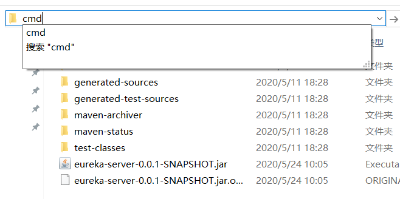

# 学习目标

* 掌握RestTemplate的使用
* 知道什么是SpringCloud
* 掌握搭建Eureka注册中心
* 了解Ribbon的负载均衡
* 理解Hystrix的熔断原理  

# 系统架构演变

​	随着互联网的发展，网站应用的规模不断扩大。需求的激增，带来的是技术上的压力。系统架构也因此也不断的演进、升级、迭代。从单一应用，到垂直拆分，到分布式服务，到SOA，以及现在火热的微服务架构，还有Google带领下来势汹涌的Service Mesh。我们到底是该乘坐微服务的船只驶向远方，还是偏安一隅得过且过？
​	其实生活不止眼前的苟且，还有诗和远方。所以我们今天就回顾历史，看一看系统架构演变的历程；把握现在，学习现在最火的技术架构；展望未来，争取成为一名优秀的Java工程师。  

## 1.1 集中式架构  

​	当网站流量很小时，只需一个应用，将所有功能都部署在一起，以减少部署节点和成本。此时，用于简化增删改查工作量的数据访问框架(ORM)是影响项目开发的关键。  


存在的问题：

* 代码耦合，开发维护困难
* 无法针对不同模块进行针对性优化
* 无法水平扩展
* 单点容错率低，并发能力差  

## 1.2 垂直拆分  

水平拆分: 根据算法对同一个表进行拆分,数据库有一张表有1000W条数据,拆成10张表,根据ID%10来进行拆分.

当访问量逐渐增大，单一应用无法满足需求，此时为了应对更高的并发和业务需求，我们根据业务功能
对系统进行拆分：  


优点：

* 系统拆分实现了流量分担，解决了并发问题
* 可以针对不同模块进行优化
* 方便水平扩展，负载均衡，容错率提高  

缺点：

* 系统间相互独立，会有很多重复开发工作，影响开发效率  

## 1.3 分布式服务  

当垂直应用越来越多，应用之间交互不可避免，将核心业务抽取出来，作为独立的服务，逐渐形成稳定
的服务中心，使前端应用能更快速的响应多变的市场需求。此时，用于提高业务复用及整合的分布式调
用是关键。  


优点：

* 将基础服务进行了抽取，系统间相互调用，提高了代码复用和开发效率  

缺点：

* 系统间耦合度变高，调用关系错综复杂，难以维护  

## 1.4 服务治理架构（SOA）  

SOA ：面向服务的架构
当服务越来越多，容量的评估，小服务资源的浪费等问题逐渐显现，此时需增加一个调度中心基于访问压力实时管理集群容量，提高集群利用率。此时，用于提高机器利用率的资源调度和治理中心(SOA)是关键  


以前出现了什么问题？

* 服务越来越多，需要管理每个服务的地址
* 调用关系错综复杂，难以理清依赖关系
* 服务过多，服务状态难以管理，无法根据服务情况动态管理

服务治理要做什么？

* 服务注册中心，实现服务自动注册和发现，无需人为记录服务地址
* 服务自动订阅，服务列表自动推送，服务调用透明化，无需关心依赖关系
* 动态监控服务状态监控报告，人为控制服务状态

缺点：

* 服务间会有依赖关系，一旦某个环节出错会影响较大
* 服务关系复杂，运维、测试部署困难，不符合DevOps思想  

## 1.5 微服务  

前面说的SOA，英文翻译过来是面向服务。微服务，似乎也是服务，都是对系统进行拆分，微服务可以认为是SOA的子集。因此两者非常容易混淆，但其实有一些差别：
微服务的特点：

* 单一职责：微服务中每一个服务都对应唯一的业务能力，做到单一职责
* 微：微服务的服务拆分粒度很小，例如一个用户管理就可以作为一个服务。每个服务虽小，但“五脏俱全”。
* 面向服务：面向服务是说每个服务都要对外暴露Rest风格服务HTTP接口API。并不关心服务的技术实现，做到与平台和语言无关，也不限定用什么技术实现，只要提供Rest的HTTP接口即可。
* 自治：自治是说服务间互相独立，互不干扰
  * 团队独立：每个服务都是一个独立的开发团队，人数不能过多。
  * 技术独立：因为是面向服务，提供Rest接口，使用什么技术没有别人干涉
  * 前后端分离：采用前后端分离开发，提供统一Rest接口，后端不用再为PC、移动段开发不同接口
  * 数据库分离：每个服务都使用自己的数据源
  * 部署独立，服务间虽然有调用，但要做到服务重启不影响其它服务。有利于持续集成和持续交付。每个服务都是独立的组件，可复用，可替换，降低耦合，易维护  


微服务结构图：  


# 服务调用方式

## 2.1 RPC和HTTP  

无论是微服务还是SOA，都面临着服务间的远程调用。那么服务间的远程调用方式有哪些呢？
常见的远程调用方式有以下2种：

* RPC： Remote Produce Call远程过程调用，类似的还有RMI（remote method invoke）。自定义数据格式，基于原生TCP通信，速度快，效率高。早期的webservice，现在热门的dubbo，都是RPC的典型代表。
* Http： http其实是一种网络传输协议，基于TCP，规定了数据传输的格式。 现在客户端浏览器与服务端通信基本都是采用Http协议，也可以用来进行远程服务调用。缺点是消息封装臃肿，优势是对服务的提供和调用方没有任何技术限定，自由灵活，更符合微服务理念。现在热门的Rest风格，就可以通过http协议来实现。

如果你们公司全部采用Java技术栈，那么使用Dubbo作为微服务架构是一个不错的选择。
相反，如果公司的技术栈多样化，而且你更青睐Spring家族，那么SpringCloud搭建微服务是不二之选。在我们的项目中，我们会选择SpringCloud套件，因此我们会使用Http方式来实现服务间调用。  

## 2.2 Http客户端工具  

既然微服务选择了Http，那么我们就需要考虑自己来实现对请求和响应的处理。不过开源世界已经有很
多的http客户端工具，能够帮助我们做这些事情，例如：

* HttpClient
* OKHttp
* URLConnection  

# RestTemplate

RestTempalte是Spring Boot封装好的Http客户端工具。


步骤：

```markdown
1. 添加服务提供者，提供Rest HTTP接口
2. 添加服务调用者，通过RestTemplate访问服务提供者的接口
3. 服务提供者和调用者都放到一个父工程中
```


## 3.1 搭建父工程

为了方便项目管理，这里把服务提供者和服务调用者放到同一个工程中

新建父工程srping-cloud-parent-demo，


父工程不需要写代码，可以将src目录删除

添加Spring Boot依赖

```xml
<parent>
    <groupId>org.springframework.boot</groupId>
    <artifactId>spring-boot-starter-parent</artifactId>
    <version>2.1.3.RELEASE</version>
    <relativePath/> <!-- lookup parent from repository -->
</parent>
<properties>
    <java.version>1.8</java.version>
</properties>
<dependencies>
    <dependency>
        <groupId>org.springframework.boot</groupId>
        <artifactId>spring-boot-starter</artifactId>
    </dependency>
    <dependency>
        <groupId>org.projectlombok</groupId>
        <artifactId>lombok</artifactId>
        <optional>true</optional>
    </dependency>
	<dependency>
        <groupId>org.springframework.boot</groupId>
        <artifactId>spring-boot-starter-test</artifactId>
        <scope>test</scope>
    </dependency>
</dependencies>
```


## 3.2 搭建服务提供者

项目结构如下：


开发步骤：

1. 添加子模块user-service，添加web依赖

   

   

   ```xml
   <dependencies>
       <dependency>
           <groupId>org.springframework.boot</groupId>
           <artifactId>spring-boot-starter-web</artifactId>
       </dependency>
   </dependencies>
   ```

2. 添加配置文件application.yml

   ```yaml
   server:
     port: 8001
   spring:
     application:
       # 当前应用的服务名称（也叫服务ID）
       name: user-service
     jackson:
       time-zone: GMT+8
   ```

3. 添加启动类

   ```java
   import org.springframework.boot.SpringApplication;
   import org.springframework.boot.autoconfigure.SpringBootApplication;
   
   @SpringBootApplication
   public class UserApplication {
       public static void main(String[] args) {
           SpringApplication.run(UserApplication.class, args);
       }
   }
   ```

   小技巧：每次写启动类都是固定格式，可以自定义快速启动类模板：

   

   ```java
   import org.springframework.boot.SpringApplication;
   import org.springframework.boot.autoconfigure.SpringBootApplication;
   
   @SpringBootApplication
   public class $ClassName$ {
       public static void main(String[] args) {
           SpringApplication.run($ClassName$.class,args);
       }
   }
   ```

   编辑模板变量：

   

   

4. 添加实体

   ```java
   import lombok.AllArgsConstructor;
   import lombok.Data;
   import lombok.NoArgsConstructor;
   import java.util.Date;
   
   @Data
   @NoArgsConstructor
   @AllArgsConstructor
   public class User {
       private Long id;
       private String name;
       private Integer age;
       private Date updateTime;
   }
   ```

   

5. 编写Controller

   ```java
   @RestController
   @RequestMapping("/user")
   public class UserController {
   
       /**
        * 根据用户ID获取用户
        * 接口地址: http://localhost:8001/user/1
        * @param id
        * @return
        */
       @GetMapping("/{id}")
       public User getById(@PathVariable("id") Long id){
           User user = new User(1L,"tom",18,new Date());
           return user;
       }
   }
   ```
   
6. 启动项目,打开http://localhost:8001/user/1

   

   


## 3.3 搭建服务消费者

1. 添加子模块service-consumer，添加web依赖

   ```xml
   <dependencies>
       <dependency>
           <groupId>org.springframework.boot</groupId>
           <artifactId>spring-boot-starter-web</artifactId>
       </dependency>
   </dependencies>
   ```

2. 添加配置文件

   ```yaml
   server:
     port: 9001
   spring:
     application:
       # 当前应用的服务名称（也叫服务ID）
       name: service-consumer
     jackson:
       time-zone: GMT+8
   ```

3. 添加启动类

   ```java
   @SpringBootApplication
   public class ConsumerApplication {
       public static void main(String[] args) {
           SpringApplication.run(ConsumerApplication.class, args);
       }
   
       @Bean   // 将RestTemplate注册成为一个Bean
       public RestTemplate restTemplate(){
           return new RestTemplate();
       }
   }
   ```
   
4. 添加实体

   ```java
   @Data
   @NoArgsConstructor
   @AllArgsConstructor
   public class User {
       private Long id;
       private String name;
       private Integer age;
       private Date updateTime;
   }
   ```
   
   
   
5. 编写Controller

   ```java
   @RestController
   @RequestMapping("/consumer")
   public class ConsumerController {
   
       @Autowired  // 注入RestTemplate模板工具
       private RestTemplate restTemplate;
   
       @GetMapping("/user/{id}")
       public User getUserById(@PathVariable("id") Long id) {
           // 通过远程调用user-service提供的HTTP接口
           String url = "http://localhost:8001/user/" + id;
           // 第一个参数是接口调用地址  第二个参数是返回的类型
           User user = restTemplate.getForObject(url, User.class);
           return user;
       }
   }
   ```
   
6. 访问http://localhost:9001/consumer/user/1

   


## 3.4 微服务调用问题

 user-service：对外提供接口服务

 service-consumer: 通过`RestTemplate`访问 http://locahost:8001/  调用接口服务

存在问题：

* 在consumer中，我们把url地址硬编码到了代码中，不方便后期维护  
* consumer需要记忆user-service的地址，如果出现变更，可能得不到通知，地址将失效  
* consumer不清楚user-service的状态，服务宕机也不知道  
* user-service只有1台服务，不具备高可用性  
* 即便user-service形成集群， consumer还需自己实现负载均衡  

其实上面说的问题，概括一下就是分布式服务必然要面临的问题：

* 服务管理
  * 如何自动注册和发现服务
  * 如何实现服务状态监管
  * 如何实现服务动态路由
* 服务如何实现负载均衡
* 服务如何解决容灾问题
* 服务如何实现统一配置

以上的问题，我们都将在Spring Cloud中得到解决。  

# Spring Cloud

## 4.1 简介

Spring Cloud是一个基于 Spring Boot实现的微服务架构开发工具。它为微服务架构中涉及的配置管理、服务治理、断路器、智能路由、微代理、控制总线、全局锁、决策竞选、分布式会话和集群状态管理等操作提供了一种简单的开发方式。
 Spring Cloud包含了多个子项目（针对分布式系统中涉及的多个不同开源产品，还可能会新增），如下所述。

* Spring Cloud Config:配置管理工具，支持使用Git存储配置内容，可以使用它实现应用配置的外部化存储，并支持客户端配置信息刷新、加密/解密配置内容等。

* Spring Cloud Netflix:核心组件，对多个 Netflix OSS开源套件进行整合
  * Eureka:服务治理组件，包含服务注册中心、服务注册与发现机制的实现。
  * Ribbon:客户端负载均衡的服务调用组件。
  *  Hystrix:容错管理组件，实现断路器模式，帮助服务依赖中出现的延迟和为故障提供强大的容错能力。
  *  Feign:基于 Ribbon和 Hystrix的声明式服务调用组件。
  * Zuul: 网关组件，提供智能路由、访问过滤等功能。
*  Spring Cloud Bus: 事件、消息总线，用于传播集群中的状态变化或事件，以触发后续的处理，比如用来动态刷新配置等。

官网：https://spring.io/projects/spring-cloud

## 4.2 版本说明

Spring Cloud不像 Spring社区其他一些项目那样相对独立，它是一个拥有诸多子项目的大型综合项目，可以说是对微服务架构解决方案的综合套件组合，其包含的各个子项目也都独立进行着内容更新与迭代，各自都维护着自己的发布版本号。因此每一个Spring Cloud的版本都会包含多个不同版本的子项目，为了管理每个版本的子项目清单，避免 Spring Cloud的版本号与其子项目的版本号相混淆，没有采用版本号的方式，而是通过命名的方式。

这些版本的名字采用了伦敦地铁站的名字，根据字母表的顺序来对应版本时间顺序，比如最早的 Release版本为 Angel，第二个 Release版本为 Brixton

当一个版本的 Spring Cloud项目的发布内容积累到临界点或者一个严重bug解决可用后，就会发布一个“service releases”版本，简称SRX版本，其中X是一个递增的数字，所以 Brixton.SR5就是 Brixton的第5个 Release版本

| Spring Cloud Version | Spring Boot Version |
| :------------------- | :------------------ |
| Hoxton               | 2.2.x               |
| Greenwich            | 2.1.x               |
| Finchley             | 2.0.x               |
| Edgware              | 1.5.x               |
| Dalston              | 1.5.x               |

# 服务治理Eureka

## 5.1 认识Eureka  

首先我们来解决第一问题，服务的管理。  

> 问题分析  

在刚才的案例中， user-service对外提供服务，需要对外暴露自己的地址。而consumer（调用者）需要
记录服务提供者的地址。将来地址出现变更，还需要及时更新。这在服务较少的时候并不觉得有什么，
但是在现在日益复杂的互联网环境，一个项目肯定会拆分出十几，甚至数十个微服务。此时如果还人为
管理地址，不仅开发困难，将来测试、发布上线都会非常麻烦。  

> 解决方案-网约车  

这就好比是 网约车出现以前，人们出门叫车只能叫出租车。一些私家车想做出租却没有资格，被称为黑
车。而很多人想要约车，但是无奈出租车太少，不方便。私家车很多却不敢拦，而且满大街的车，谁知
道哪个才是愿意载人的。一个想要，一个愿意给，就是缺少引子，缺乏管理啊。
此时滴滴这样的网约车平台出现了，所有想载客的私家车全部到滴滴注册，记录你的车型（服务类
型），身份信息（联系方式）。这样提供服务的私家车，在滴滴那里都能找到，一目了然。
此时要叫车的人，只需要打开APP，输入你的目的地，选择车型（服务类型），滴滴自动安排一个符合
需求的车到你面前，为你服务，完美！  

> Eureka能做什么？  

Eureka就好比是滴滴，负责管理、记录服务提供者的信息。服务调用者无需自己寻找服务，而是把自己
的需求告诉Eureka，然后Eureka会把符合你需求的服务告诉你。
同时，服务提供方与Eureka之间通过 “心跳” 机制进行监控，当某个服务提供方出现问题， Eureka自然
会把它从服务列表中剔除。
这就实现了服务的自动注册、发现、状态监控。  

## 5.2 基本架构

> 架构图：  


> 基本概念

* Eureka-Server：就是服务注册中心（可以是一个集群），对外暴露自己的地址。
* 提供者：启动后向Eureka注册自己信息（地址，服务名称等），并且定期进行服务续约
* 消费者：服务调用方，会定期去Eureka拉取服务列表，然后使用负载均衡算法选出一个服务进行调用。
* 心跳(续约)：提供者定期通过http方式向Eureka刷新自己的状态  

## 5.3 快速入门

步骤：

```markdown
0. 在父工程中添加SpringCloud的版本依赖管理
1. 搭建注册中心
	a. 新建工程，添加Eureka server依赖
	b. 配置注册中心服务地址
	c. 添加启动类
2. 服务提供者到注册中心注册
	a. 添加Eureka client 依赖
	b. 配置文件中添加注册中心地址
	c. 在启动类上添加服务发现注解
3. 服务调用者到注册中心注册
	a. 添加Eureka client 依赖
	b. 配置文件中添加注册中心地址
	c. 在启动类上添加服务发现注解
	d. 采用服务的方式调用服务提供者的接口
```


### 5.3.1 搭建服务注册中心

1. 在父工程pom.xml中添加Spring Cloud的依赖管理

```xml
<properties>
    <spring-cloud.version>Greenwich.SR1</spring-cloud.version>
</properties>
<dependencyManagement>
    <dependencies>
        <dependency>
            <groupId>org.springframework.cloud</groupId>
            <artifactId>spring-cloud-dependencies</artifactId>
            <version>${spring-cloud.version}</version>
            <type>pom</type>
            <scope>import</scope>
        </dependency>
    </dependencies>
</dependencyManagement>
```


2. 创建一个Spring Boot工程，命名为eureka-server，并在pom.xml中添加eureka依赖

   

```xml
<dependencies>
    <dependency>
        <groupId>org.springframework.cloud</groupId>
        <artifactId>spring-cloud-starter-netflix-eureka-server</artifactId>
    </dependency>
</dependencies>
```

3. 添加配置文件application.yml

   ```yaml
   server:
     port: 1111
   spring:
     application:
       name: eureka-server
   eureka:
     client:
       service-url:
         defaultZone: http://127.0.0.1:${server.port}/eureka
       # 注册中心的职责是维护服务实例，不需要去检索服务
       fetch-registry: false
       # 默认设置下，注册中心会将自己作为客户端来尝试注册自己，设置为false代表不向注册中心注册自己
       register-with-eureka: false
   ```

4. 添加启动类

   ```java
   @SpringBootApplication
   // 启动注册中心
   @EnableEurekaServer
   public class EurekaApplication {
       public static void main(String[] args) {
           SpringApplication.run(EurekaApplication.class,args);
       }
   }
   ```

   

启动应用并访问：http://localhost:1111 可以看到Eureka界面


### 5.3.2 服务注册  

注册服务，就是在服务上添加Eureka的客户端依赖，客户端代码会自动把服务注册到EurekaServer中。  

1. 在user-service中添加Eureka客户端依赖：  

```java
<!-- Eureka客户端 -->
<dependency>
    <groupId>org.springframework.cloud</groupId>
    <artifactId>spring-cloud-starter-netflix-eureka-client</a`rtifactId>
</dependency>
```

2. 在启动类上 通过添加 `@EnableDiscoveryClient`来开启Eureka客户端功能  

```java
@SpringBootApplication
// 开启Eureka客户端发现功能
@EnableDiscoveryClient
public class ProviderApplication {
    public static void main(String[] args) {
        SpringApplication.run(ProviderApplication.class, args);
    }
}
```

3. 配置文件中添加注册中心地址

```yaml
eureka:
  client:
    service-url:
      defaultZone: http://127.0.0.1:1111/eureka
```

这里spring.application.name属性指定应用名称，将来会作为服务的id使用。  


日志中出现`registration status: 204`表示注册成功：


此时再打开注册中心的地址：http://localhost:1111/eureka ,可以看到服务已经注册上去了


### 5.3.3 服务发现与消费

接下来我们修改service-consumer，尝试从EurekaServer获取服务。
方法与消费者类似，只需要在项目中添加EurekaClient依赖，就可以通过服务名称来获取信息了    

1. 在service-consumer中添加Eureka客户端依赖：  

```xml
<!-- Eureka客户端 -->
<dependency>
    <groupId>org.springframework.cloud</groupId>
    <artifactId>spring-cloud-starter-netflix-eureka-client</artifactId>
</dependency>
```

2. 在启动类上 通过添加 `@EnableDiscoveryClient`来开启Eureka客户端功能  

```java
@SpringBootApplication
@EnableDiscoveryClient
public class ConsumerApplication {
    public static void main(String[] args) {
        SpringApplication.run(ConsumerApplication.class, args);
    }

    @Bean
    public RestTemplate restTemplate(){
        return new RestTemplate();
    }
}
```

3. 配置文件中添加注册中心地址

```yaml
eureka:
  client:
    service-url:
      defaultZone: http://127.0.0.1:1111/eureka
```

4. 修改代码，用DiscoveryClient类的方法，根据服务名称，获取服务实例

   ```java
   /*
       动态获取服务地址:
       1. 注入DiscoveryClient
       2. 使用DiscoveryClient 获取服务列表
       3. 从服务列表中选择一个服务实例
       4. 实例中包含了调用地址及端口信息
    */
   @Autowired
   private DiscoveryClient discoveryClient;
   @GetMapping("/user/{id}")
   public User getUserById(@PathVariable("id") Long id) {
       // 使用DiscoveryClient 获取服务列表 参数为服务ID ,也就是在配置文件中定义的spring.application.name
       // spring.application.name 建议使用 -  来分隔,不要使用下划线
       List<ServiceInstance> instances = discoveryClient.getInstances("user-service");
       // 获取具体的实例
       ServiceInstance instance = instances.get(0);
       // 获取服务的地址和端口
       String host = instance.getHost();
       int port = instance.getPort();
       // 通过远程调用user-service提供的HTTP接口
       String url = "http://" + host + ":" + port + "/user/" + id;
       // 第一个参数是接口调用地址  第二个参数是返回的类型
       User user = restTemplate.getForObject(url, User.class);
       return user;
   }
   ```

5. 启动项目后，可以在注册中心页面看到有两个服务

   

6. 调用消费者的页面http://localhost:9001/consumer/user/1

   

## 5.4 Eureka详解  

接下来我们详细讲解Eureka的原理及配置。  

### 5.4.1 基础架构  

Eureka架构中的三个核心角色：

* 服务注册中心
  Eureka的服务端应用，提供服务注册和发现功能，就是刚刚我们建立的eureka-server
* 服务提供者
  提供服务的应用，可以是Spring Boot应用，也可以是其它任意技术实现，只要对外提供的是Rest
  风格服务即可。本例中就是我们实现的user-service
* 服务消费者
  消费应用从注册中心获取服务列表，从而得知每个服务方的信息，知道去哪里调用服务方。本例中
  就是我们实现的service-consumer  


### 5.4.2 高可用的Eureka Server  

Eureka Server即服务的注册中心，在刚才的案例中，我们只有一个Eureka Server，事实上
Eureka Server也可以是一个集群，形成高可用的Eureka中心。  

> 服务同步  

多个Eureka Server之间也会互相注册为服务，当服务提供者注册到Eureka Server集群中的某个节点
时，该节点会把服务的信息同步给集群中的每个节点，从而实现高可用集群。因此，无论客户端访问到
Eureka Server集群中的任意一个节点，都可以获取到完整的服务列表信息。
而作为客户端，需要把信息注册到每个Eureka中：  


如果有三个Eureka，则每一个Eureka Server都需要注册到其它几个Eureka服务中，例如：有三个分别
为1111、 1112、 1113，则：

* 1111要注册到1112和1113上
* 1112要注册到1111和1113上
* 1113要注册到1111和1112上  

> 搭建高可用的Eureka Server  

​	所谓的高可用注册中心，其实就是把Eureka Server自己也作为一个服务，注册到其它Eureka Server上，这样多个Eureka Server之间就能互相发现对方，从而形成集群。因此我们做了以下修改：
把service-url的值改成了另外一台Eureka Server的地址，而不是自己  

我们假设要搭建两台Eureka Server的集群，端口分别为： 1112和1113

1. 添加配置文件application-p1.yml

   ```yaml
   server:
     port: 1111
   spring:
     application:
       name: eureka-server
   eureka:
     client:
       # 注册中心提供服务的地址
       service-url:
         defaultZone: http://127.0.0.1:1112/eureka,http://127.0.0.1:1113/eureka
       # 从其他的注册中心检索服务
       fetch-registry: true
       # 向其他注册中心注册自己
       register-with-eureka: true
   ```
   
2. 添加配置文件application-p2.yml

   ```yaml
   server:
     port: 1112
   spring:
     application:
       name: eureka-server
   eureka:
     client:
       # 注册中心提供服务的地址
       service-url:
         defaultZone: http://127.0.0.1:1111/eureka,http://127.0.0.1:1113/eureka
       # 从其他的注册中心检索服务
       fetch-registry: true
       # 向其他注册中心注册自己
       register-with-eureka: true
   ```
   
3. 添加配置文件application-p3.yml

   ```yaml
server:
     port: 1113
spring:
     application:
    name: eureka-server
   eureka:
     client:
       # 注册中心提供服务的地址
       service-url:
         defaultZone: http://127.0.0.1:1111/eureka,http://127.0.0.1:1112/eureka
       # 从其他的注册中心检索服务
       fetch-registry: true
       # 向其他注册中心注册自己
       register-with-eureka: true
   ```
   
   
   
4. 启动三台Eureka Server

   > 在IDEA中启动

   编辑配置

    

    复制配置

      

      修改名称及Active profiles

     配置完成后会弹出RunDashboard

   

      p2，p3节点也按此配置，然后启动即可。

      

      

      在启动的过程中，可能会出现下面的错误信息

      

      原因是其他的节点还没有启动，此时去注册就会出现连接超时，这个流程是正常的。

   命令行启动

   将项目打包，需要添加打包插件

   ```xml
      <build>
          <plugins>
              <plugin>
                  <groupId>org.springframework.boot</groupId>
                  <artifactId>spring-boot-maven-plugin</artifactId>
              </plugin>
          </plugins>
      </build>
   ```

   在IDEA右侧选择Maven Projects,双击package

   

   打包后的文件会生成在target目录

   

   找到目录执行`cmd`打开命令行窗口

   

   执行以下命令：

   ```shell
   java -jar eureka-server-0.0.1-SNAPSHOT.jar --spring.profiles.active=p1
   ```

   再打开另外一个命令行窗口，执行命令：

   ```shell
   java -jar eureka-server-0.0.1-SNAPSHOT.jar --spring.profiles.active=p2
   java -jar eureka-server-0.0.1-SNAPSHOT.jar --spring.profiles.active=p3
   ```

5. 客户端注册服务到集群  

   修改user-service,因为Eureka Server不止一个，因此注册服务的时候， service-url参数需要变化：  

   ```yaml
   eureka:
     client:
       service-url:
         defaultZone: http://127.0.0.1:1111/eureka，http://127.0.0.1:1112/eureka,http://127.0.0.1:1113/eureka
   ```


### 5.4.3 服务端属性配置(了解)

> 失效剔除

有些时候，我们的服务实例并不一定会正常下线,正常下线会给注册中心发送一个HTTP请求，告诉注册中心服务下线，可能由于内存溢出、网络故障等原因使得服务不能正常工作，而服务注册中心并未收到“服务下线”的请求。为了从服务列表中将这些无法提供服务的实例剔除， Eureka Server在启动的时候会创建一个定时任务，默认每隔一段时间（默认为60秒）将当前清单中超时（默认为90秒）没有续约的服务剔除出去。

```yaml
# 剔除任务执行时间，默认为60秒
eureka:
  server:
    eviction-interval-timer-in-ms: 60000
```

服务端的默认配置可以在`EurekaServerConfigBean`中查看


服务提供者正常关闭会立刻在注册中心下线


接下来模拟服务提供者非正常关闭：


此时发现user-service还在注册中心。


> 自我保护

当我们在本地调试基于 Eureka的程序时，基本上都会碰到这样一个问题，在服务注册中心的信息面板中出现类似下面的红色警告信息:


该警告就是触发了Eureka Server的自我保护机制。之前我们介绍过，服务注册到 Eureka Server之后，会维护一个心跳连接，告诉 Eureka Server自己还活着.Eureka Server在运行期间，会统计心跳失败的比例在15分钟之内是否低于85％，如果出现低于的情况（在单机调试的时候很容易满足，实际在生产环境上通常是由于网络不稳定导致）， Eureka Server会将当前的实例注册信息保护起来让这些实例不会过期，尽可能保护这些注册信息。但是，在这段保护期间内实例若出现问题，那么客户端很容易拿到实际已经不存在的服务实例，会出现调用失败的情况，所以客户端必须要有容错机制，比如可以使用请求重试、断路器等机制。
由于本地调试很容易触发注册中心的保护机制，这会使得注册中心维护的服务实例不那么准确。所以，我们在本地进行开发的时候，可以使用 `eureka.server.enable-self-preservation＝false`参数来关闭保护机制，以确保注册中心可以将不可用的实例正确剔除。

关闭自我保护机制：

```yaml
eureka:
  client:
    # 注册中心提供服务的地址
    service-url:
      defaultZone: http://127.0.0.1:${server.port}/eureka
    # 注册中心的职责是维护服务实例，不需要去检索服务
    fetch-registry: false
    # 默认设置下，注册中心会将自己作为客户端来尝试注册自己，设置为false代表不向注册中心注册自己
    register-with-eureka: false
  server:
    # 关闭自我保护机制
    enable-self-preservation: false
```

启动后会显示自我保护机制关闭


### 5.4.4 Eureka客户端  

**服务提供者**

服务提供者要向Eureka Server注册服务，并且完成服务续约等工作。  

> 服务注册  

服务提供者在启动时，会检测配置属性中的： `eureka.client.register-with-erueka=true`参数是否
正确，事实上默认就是true。如果值确实为true，则会向Eureka Server发起一个Rest请求，并携带自己
的元数据信息， Eureka Server会把这些信息保存到一个双层Map结构中。  

```java
Map<String,Map<String,Object>>
```

* 第一层Map的Key就是服务id，一般是配置中的 `spring.application.name`属性
* 第二层Map的key是服务的实例id，一般host+ serviceId + port，例如： localhost:user-service:8001
* 值则是服务的实例对象，也就是说一个服务，可以同时启动多个不同实例，形成集群。  

user-service默认注册时使用的是主机名或者域名，如果我们想用ip进行注册，可以在user-service的
application.yml添加配置：  

```yaml
eureka:
  instance:
    # 更倾向于使用ip，而不是host名
    prefer-ip-address: true
```

如果么有使用ip，可以看到提示如下：


改成ip后：


> 服务续约

在注册完服务之后，服务提供者会维护一个心跳用来持续告诉 Eureka Server:“我还活着”，以防止 Eureka Server的剔除任务将该服务实例从服务列表中排除出去，我们称该操作为服务续约（Renew）
关于服务续约有两个重要属性，我们可以关注并根据需要来进行调整:

```yaml
eureka:
  instance:
    # 服务失效的时间，默认为90秒
    lease-expiration-duration-in-seconds: 90
    # 服务续约任务的调用间隔时间，默认为30秒
    lease-renewal-interval-in-seconds: 30
```

这个设置与注册中心服务端的失效剔除配合使用

比如Eureka-server中设置

```yaml
#  每5秒钟剔除失效的服务
eureka:
  server:
    eviction-interval-timer-in-ms: 5000
```

在user-service中设置

```yaml
eureka:
  # 当前实例的配置
  instance:
    # 服务失效的时间，默认为90秒
    lease-expiration-duration-in-seconds: 15
    # 服务续约任务的调用间隔时间，默认为30秒
    lease-renewal-interval-in-seconds: 10
```

意思是服务提供端每10秒发送一次服务续约，服务的失效时间为15秒，即如果服务端下线，15秒后eureka server将其服务剔除。

**服务消费者**

> 获取服务

启动服务消费者的时候，它会发送一个REST请求给服务注册中心，来获取上面注册的服务清单。为了性能考虑， Eureka Server会维护一份只读的服务清单来返回给客户端，同时该缓存清单会每隔30秒更新一次。
获取服务是服务消费者的基础，所以必须确保 `eureka.client.fetch-registry＝true`参数没有被修改成 false，该值默认为true。

若希望修改缓存清单的更新时间，可以通过 `eureka.client.registry-fetch-interval＝30`参数进行修改，该参数默认值为30，单位为秒。

# 负载均衡Ribbon  

Ribbon是一个客户端负载均衡工具.

在刚才的案例中，我们启动了一个user-service，然后通过DiscoveryClient来获取服务实例信息，获取ip和端口来访问。
但是实际环境中，我们往往会开启很多个user-service的集群。此时我们获取的服务列表中就会有多个，到底该访问哪一个呢？
这种情况下我们就需要编写负载均衡算法，在多个实例列表中进行选择。

## 6.1 启动两个服务实例  

在user-service中添加打包插件

```xml
    <build>
        <plugins>
            <plugin>
                <groupId>org.springframework.boot</groupId>
                <artifactId>spring-boot-maven-plugin</artifactId>
            </plugin>
        </plugins>
    </build>
```


为了方便查看哪个服务被调用了，做如下改造

```java
@RestController
@RequestMapping("/user")
public class UserController {

    @Value("${server.port}")
    private String port;

    @GetMapping("/{id}")
    public User getById(@PathVariable Long id) {
        User user = new User(id, "tom"+" from "+port, 18, new Date());
        return user;
    }
}  
```


首先我们启动两个user-service实例，一个8001，一个8002。  

在IDEA中可以通过如下配置来启动多个实例


也可以通过控制台+参数来启动

```shell
java -jar user-service-0.0.1-SNAPSHOT.jar --server.port=8001
java -jar user-service-0.0.1-SNAPSHOT.jar --server.port=8002
```

查看Eureka控制面板


手动实现负载均衡：

```java
// 定义静态变量
static Integer index = 0;

@GetMapping("user/{id}")
public User getUserById(@PathVariable long id) {
    // 通过发现客户端获取服务的列表
    // 参数是服务ID，也就是在user-service项目配置文件中定义的spring.application.name
    List<ServiceInstance> instances = discoveryClient.getInstances("user-service");
    // 获取实例的数量
    int size = instances.size();
    // 手动实现负载均衡
    // 第一次进来index = 0 ,instances.get(index) 返回第一个服务实例
    // 第二次请求 index+1 = 1 ,instances.get(index) 返回第二个服务实例
    // 第三次请求 index+1 = 2，将index对服务实例总数做取模操作index = 2mod2 = 0
    index = index + 1;
    index = index % size;
    // 获取具体的实例
    ServiceInstance instance = instances.get(index);
    // 通过实例获取访问地址
    String host = instance.getHost();
    int port = instance.getPort();
    String url = "http://"+host+":"+port+"/user/" + id;
    // 使用RestTemplate调用user-service的服务接口
    User user = restTemplate.getForObject(url, User.class);
    return user;
}
```


## 6.2 开启负载均衡  

SpringCloud 中已经帮我们集成了负载均衡组件： Ribbon  


接下来，我们就来使用Ribbon实现负载均衡。  

因为Eureka中已经集成了Ribbon，所以我们无需引入新的依赖。直接修改代码：
在RestTemplate的配置方法上添加 @LoadBalanced注解：  

```java
@Bean
@LoadBalanced
public RestTemplate restTemplate(){
    return new RestTemplate();
}
```

修改调用方式，不再手动获取ip和端口，而是直接通过服务名称调用：  

```java
@GetMapping("user/{id}")
public User getUserById(@PathVariable long id) {
    // String url = "http://localhost:8001/user/" + id;
    // String url = "http://"+host+":"+port+"/user/" + id;
    // 使用服务ID替换真实地址
    String url = "http://user-service" + "/user/" + id;
    User user = restTemplate.getForObject(url, User.class);
    return user;
}
```

访问页面，查看结果，多次刷新页面可以看到不同的返回。


## 6.3 负载均衡原理

为什么我们只输入了service名称就可以访问了呢？  

关键就在于`@LoadBalanced`注解，源码如下


找到`LoadBalancerClient`


继承自`ServiceInstanceChooser`


在`LoadBalancerClient`所在的包中可以找到自动配置类`LoadBalancerAutoConfiguration`


在该自动化配置类中，主要做了下面三件事:

* 创建了一个LoadBalancerInterceptor的Bean，用于实现对客户端发起请求时进行拦截，以实现客户端负载均衡。
* 创建了一个RestTemplateCustomizer的Ben，用于给 RestTemplate增加 LoadBalancerInterceptor拦截器。
* 维护了一个被 LoadBalanced注解修饰的 RestTemplate对象列表，并在这里进行初始化，通过调用RestTemplateCustomizer的实例来给需要客户端负载均衡的 RestTemplate增加 LoadBalancerInterceptor拦截器。

接下来，我们看看LoadBalancerInterceptor拦截器是如何将一个普通的RestTemplate变成客户端负载均衡的:


execute方法回到了LoadBalancerClient，查看实现类为`RibbonLoadBalancerClient`


继续跟进


这里的rule在上面定义，`RoundRobinRule`即为轮询的意思


查看实现


可以看到这里的算法是使用了原子类，每次对这个原子类做+1后对服务器数量取模，再通过CAS设置原子类的最新值：

```java
private AtomicInteger nextServerCyclicCounter;
public RoundRobinRule() {
    nextServerCyclicCounter = new AtomicInteger(0);
}
private int incrementAndGetModulo(int modulo) {
    for (;;) {
        int current = nextServerCyclicCounter.get();
        int next = (current + 1) % modulo;
        if (nextServerCyclicCounter.compareAndSet(current, next))
            return next;
    }
}
```

CAS(V,E,N)，V指要更新的变量，E指要更新的期望值，N指更新后的值，当且仅当V的值等于E时，才将V更新成N。如果V的值不等于E，就表示这个变量已经被其他的任务更新过了，此次更新失败，进入循环继续执行。

CAS操作保证同一时刻只有一个任务能够更新成功，其他的进入循环继续尝试执行更新。


再看一下IRule的实现有下面这些：


**负载均衡原理总结**：

```markdown
1. 在RestTemplate上添加了@LoadBalanced注解后，会使用LoadBalancerClient来配置RestTemplate
2. Spring Cloud Ribbon 的自动配置类LoadBalancerAutoConfiguration中的@ConditionalOnBean(LoadBalancerClient.class)条件成立
3. 自动配置中添加了LoadBalancerInterceptor，这个拦截器会拦截请求，通过服务ID获取服务的地址列表，然后通过负载均衡算法选出一个地址进行调用
```


## 6.4 切换负载均衡策略

Spring Cloud 可以通过如下方式对RibbonClient做个性化配置：

全局配置：

```properties
ribbon.{key}={value}
```

指定服务配置：

```properties
{服务名称}.ribbon.{key}={value}
```

这里切换为随机

```yaml
user-service:
  ribbon:
    NFLoadBalancerRuleClassName: com.netflix.loadbalancer.RandomRule
```

再次测试，发现结果变成了随机访问 。

# 服务容错Hystrix  

## 7.1 简介  

Hystrix  ,英文意思是豪猪，全身是刺，看起来就不好惹，是一种保护机制。  

Hystrix是Netflix开源的一个延迟和容错库，用于隔离访问远程服务、第三方库，防止出现级联失败  

## 7.2 雪崩问题  

微服务中，服务间调用关系错综复杂，一个请求，可能需要调用多个微服务接口才能实现，会形成非常
复杂的调用链路：  


如图，一次业务请求，需要调用A、 P、 H、 I四个服务，这四个服务又可能调用其它服务。
如果此时，某个服务出现异常：  


例如微服务I发生异常，请求阻塞，用户不会得到响应，则tomcat的这个线程不会释放，于是越来越多
的用户请求到来，越来越多的线程会阻塞：  


​	服务器支持的线程和并发数有限，请求一直阻塞，会导致服务器资源耗尽，从而导致所有其它服务都不可用，形成雪崩效应。
​	这就好比，一个汽车生产线，生产不同的汽车，需要使用不同的零件，如果某个零件因为种种原因无法使用，那么就会造成整台车无法装配，陷入等待零件的状态，直到零件到位，才能继续组装。 此时如果有很多个车型都需要这个零件，那么整个工厂都将陷入等待的状态，导致所有生产都陷入瘫痪。一个零件的波及范围不断扩大。

Hystix解决雪崩问题的手段主要包括：

* 线程隔离
* 服务熔断  

## 7.3 线程隔离

### 7.3.1 原理  

线程隔离示意图：  


解读：
Hystrix为每个依赖服务调用分配一个小的独立线程池，用户的请求将不再直接访问服务，而是通过线程池中的空闲线程来访问服务，如果线程池已满调用将被立即拒绝，否则使用线程来处理请求，可以在主线程中设置超时时间，超过这个时间如果子线程还没有执行完成任务或者子线程执行出现异常，则会进行服务降级，什么是服务降级？  

> 服务降级：优先保证核心服务，而非核心服务不可用或弱可用  
>
> 比如双11,618电商网站为了保证订单系统的可用，一般会关闭一些非核心系统，比如评论

用户的请求故障时，不会被阻塞，更不会无休止的等待或者看到系统崩溃，至少可以看到一个执行结果（例如返回友好的提示信息） 。
服务降级虽然会导致请求失败，但是不会导致阻塞，而且最多会影响这个依赖服务对应的线程池中的资源，对其它服务没有响应。

添加测试代码：

```java
@RestController
@RequestMapping("/test")
public class TestController {
    @GetMapping
    public String test() throws InterruptedException, ExecutionException {
        String result = "";
        // 新建一个线程池
        ExecutorService executorService = Executors.newSingleThreadExecutor();
        // 使用线程池创建任务
        Future<String> future = executorService.submit(new Callable<String>() {
            @Override
            public String call() throws Exception {
                // 模拟子线程执行耗时
                Thread.sleep(3000);
                return "Tom准备完成";
            }
        });
        // 主线程中可以设置最长时间等待
        Thread.sleep(1000);
        // 判断子线程是否执行完成
        if(future.isDone()){
            result = future.get();
        }else{
            // 如果没有完成，返回预先设定好的值，PlanB
            result = "等不及了，换Jerry上吧。";
        }
        return result;
    }
}
```

查看结果：


触发Hystix服务降级的情况：

* 线程池已满
* 请求超时  

### 7.3.2 快速入门  

步骤：

```markdown
1. 添加Hystrix依赖
2. 在启动类上添加注解
3. 编写降级逻辑,备用方案
```


1. 在服务消费者pom中引入依赖：  

```xml
<dependency>
    <groupId>org.springframework.cloud</groupId>
    <artifactId>spring-cloud-starter-netflix-hystrix</artifactId>
</dependency>
```

开启熔断：  

2. 在启动类上添加注解： `@EnableCircuitBreaker  `

```java
@SpringBootApplication
@EnableDiscoveryClient
@EnableCircuitBreaker
public class ConsumerApplication {
    public static void main(String[] args) {
        SpringApplication.run(ConsumerApplication.class, args);
    }

    @Bean
    @LoadBalanced
    public RestTemplate restTemplate(){
        return new RestTemplate();
    }
}
```

可以看到，我们类上的注解越来越多，在微服务中，经常会引入上面的三个注解，于是Spring就提供了
一个组合注解： @SpringCloudApplication  


因此，我们可以使用这个组合注解来代替之前的3个注解。  

```java
@SpringCloudApplication
public class ConsumerApplication {
    public static void main(String[] args) {
        SpringApplication.run(ConsumerApplication.class, args);
    }

    @Bean
    @LoadBalanced
    public RestTemplate restTemplate(){
        return new RestTemplate();
    }
}
```

3. 编写降级逻辑  

当目标服务的调用出现故障，我们希望快速失败，给用户一个友好提示。因此需要提前编写好失败时的降级处理逻辑，要使用HystixCommond来完成：  

```java
@GetMapping("user/{id}")
// 定义熔断注解，指定降级处理方法
@HystrixCommand(fallbackMethod = "getUserByIdFallback")
public User getUserById(@PathVariable long id) {
    // 使用服务ID替换真实地址
    String url = "http://user-service" + "/user/" + id;
    User user = restTemplate.getForObject(url, User.class);
    return user;
}
/**
 * 降级逻辑处理方法，方法参数、返回类型与原始方法一致
 * @param id
 * @return
 */
private User getUserByIdFallback(long id) {
    User user = new User(1L,"我是备份",18,new Date());
    return user;
}
```


要注意，因为熔断的降级逻辑方法必须跟正常逻辑方法保证： 相同的参数列表和返回值声明。  

说明：

* @HystrixCommand(fallbackMethod = "getUserByIdFallback")：用来声明一个降级逻辑的方法


4. 测试：
   当user-service正常提供服务时，访问与以前一致。

   http://localhost:9010/consumer

   

   但是当我们将user-service停机时，会发现页面返回了降级处理信息：  

   


### 7.3.3 默认的Fallback 

我们刚才把fallback写在了某个业务方法上，如果这样的方法很多，那岂不是要写很多。所以我们可以
把Fallback配置加在类上，实现默认fallback：  默认方法返回类型必须与调用方法一致，并且不能有参数

```java
@RestController
@RequestMapping("/consumer")
@DefaultProperties(defaultFallback = "defaultFallback")
public class ConsumerController {
    @Autowired  // 注入RestTemplate
    private RestTemplate restTemplate;

    @GetMapping("user/{id}")
    // 定义熔断注解，指定降级处理方法
    // @HystrixCommand(fallbackMethod = "getUserByIdFallback")
    @HystrixCommand
    public User getUserById(@PathVariable long id) {
        // 使用服务ID替换真实地址
        String url = "http://user-service" + "/user/" + id;
        User user = restTemplate.getForObject(url, User.class);
        return user;
    }

    /**
     * 降级逻辑处理方法，方法参数、返回类型与原始方法一致
     * @param id
     * @return
     */
    private User getUserByIdFallback(long id) {
        User user = new User(1L,"我是备份",18,new Date());
        return user;
    }
    /**
     * 默认方法返回类型必须与调用方法一致，并且不能有参数
     * @return
     */
    private User defaultFallback(){
        User user = new User(1L,"我是默认备份",18,new Date());
        return user;
    }

}
```

### 7.3.4 超时设置

在之前的案例中，请求在超过1秒后都会返回错误信息，这是因为Hystix的默认超时时长为1秒，我们可以通过配置修改这个值：  

```yaml
hystrix:
  command:
    default:
      execution:
        isolation:
          thread:
            timeoutInMilliseconds: 1000
```

这个配置会作用于全局所有方法。
为了触发超时，我们可以在user-service中休眠2秒：  

```java
@GetMapping("/{id}")
public User getById(@PathVariable Long id) throws InterruptedException {
    Thread.sleep(2000);
    User user = new User(id, "tom"+" from "+port, 18, new Date());
    return user;
}
```

测试可以看到服务不可用，http://localhost:9001/consumer/user/1


将超时时间改为3秒后再试没有问题


## 7.4 服务熔断  

如果一个服务实例，访问的时候经常出现失败，就可以暂时将这个服务实例隔离，就是熔断

### 7.4.1 熔断原理  

熔断器，也叫断路器，其英文单词为： Circuit Breaker  

断路器本身是一种开关装置，用于在电路上保护线路过载，当线路中有电器发生短路时，“断路器”能够及时切断故障电路，防止发生过载、发热甚至起火等严重后果。
在分布式架构中，断路器模式的作用也是类似的，当某个服务单元发生故障（类似用电器发生短路）之后，通过断路器的故障监控（类似熔断保险丝），向调用方返回一个错误响应，而不是长时间的等待。这样就不会使得线程因调用故障服务被长时间占用不释放，避免了故障在分布式系统中的蔓延。

Hystix的熔断状态机模型：  


状态机有3个状态：

* Closed：关闭状态（断路器关闭），所有请求都正常访问。
* Open：打开状态（断路器打开），所有请求都会被降级。 Hystrix会对请求情况计数，当一定时间
  内失败请求百分比达到阈值，则触发熔断，断路器会完全打开。默认失败比例的阈值是50%，请求
  次数最少不低于20次。假设在一定时间内，即时一共19次请求都是失败的，只要没达到20次，不会打开熔断器，如果达到了20次，并且失败比例大于50%，也就是只要失败次数到达10次，就会触发熔断
* Half Open：半开状态， Open状态不是永久的，打开后会进入休眠时间（默认是5S）。随后断路
  器会自动进入半开状态。此时会释放1次请求通过，若这个请求是健康的，则会关闭断路器，否则
  继续保持打开，再次进行5秒休眠计时。  


熔断机进入Open状态的条件:

1. 在一定的统计时间内,默认是5秒
2. 请求失败的次数达到阈值,默认是20次
3. 请求失败的比例达到阈值,默认是50%


### 7.4.2 快速入门

为了能够精确控制请求的成功或失败，我们在consumer的调用业务中加入一段逻辑：  

```java
@GetMapping("user/{id}")
// 定义熔断注解，指定降级处理方法
// @HystrixCommand(fallbackMethod = "getUserByIdFallback")
@HystrixCommand
public User getUserById(@PathVariable long id) {
    if (id == 1) {
        // 模拟异常
        int i = 1 / 0;
    }
    // 使用服务ID替换真实地址
    String url = "http://user-service" + "/user/" + id;
    User user = restTemplate.getForObject(url, User.class);
    return user;
}
```

这样如果参数是id为1，一定失败，其它情况都成功。（不要忘了去掉user-service中的休眠逻辑）
我们准备两个请求窗口：

* 一个请求：http://localhost:9001/consumer/user/1，注定失败
* 一个请求：http://localhost:9001/consumer/user/2，肯定成功  


熔断器的默认触发阈值是20次请求，不好触发。休眠时间时5秒，时间太短，不易观察，为了测试方
便，我们可以通过配置修改熔断策略：  

```yaml
hystrix:
  command:
    default:
      circuitBreaker:
        requestVolumeThreshold: 10
        sleepWindowInMilliseconds: 10000
        errorThresholdPercentage: 50
```

解读：

* requestVolumeThreshold：触发熔断的最小请求次数，默认20
* sleepWindowInMilliseconds：休眠时长，默认是5000毫秒
* errorThresholdPercentage：触发熔断的失败请求最小占比，默认50%  


当我们疯狂访问id为1的请求时（超过10次），就会触发熔断。断路器会端口，一切请求都会被降级处理。
此时你访问id为2的请求，会发现返回的也是失败，而且失败时间很短，只有10毫秒左右 ，对整个服务进行了熔断。


等待5秒后，熔断器进入半开状态，会释放一个请求通过，如果是成功的，断路器关闭.

