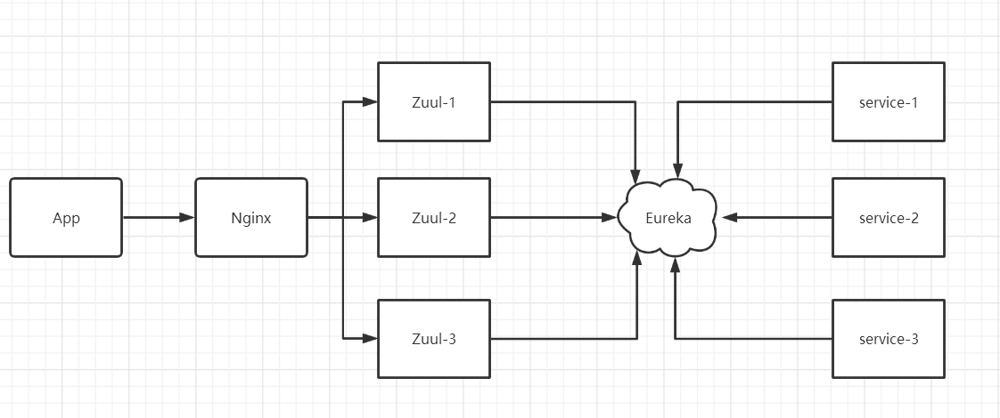
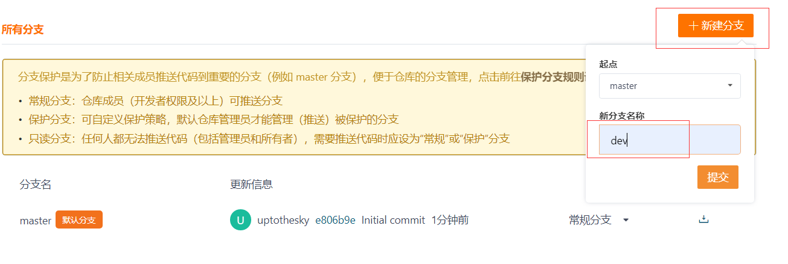
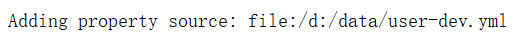
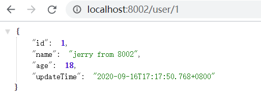

# 学习目标

* 掌握使用Feign进行远程调用
* 掌握搭建Zuul网关
* 学习编写Zuul的拦截器
* 了解config配置中心的使用

* 了解bus消息总线使用

# 声明式服务调用：Feign  

在前面的学习中，我们使用了Ribbon的负载均衡功能，大大简化了远程调用时的代码：  

```java
String url = "http://user-service/user/" + id;
User user = restTemplate.getForObject(url, User.class);
```

如果就学到这里，你可能以后需要编写类似的大量重复代码，格式基本相同，无非参数不一样。有没有更优雅的方式，来对这些代码再次优化呢？
这就是我们接下来要学的Feign的功能了。  

## 1 简介  

Feign可以把Rest的请求进行隐藏，伪装成类似Spring MVC的Controller一样。你不用再自己拼接url，拼接参数等等操作，一切都交给Feign去做。  

## 2 快速入门 (重点)

步骤：

```markdown
1. 添加openfeign依赖
2. 在启动类上添加feign的注解
3. 自定义feignClient接口
4. 通过feignClient调用接口
```


1. 在服务消费者导入依赖  

```xml
<dependency>
    <groupId>org.springframework.cloud</groupId>
    <artifactId>spring-cloud-starter-openfeign</artifactId>
</dependency>
```

2. 在启动类上添加`@EnableFeignClients`注解

```java
@SpringCloudApplication
@EnableFeignClients
public class ConsumerApplication {
    public static void main(String[] args) {
        SpringApplication.run(ConsumerApplication.class, args);
    }
}
```

Feign中已经自动集成了Ribbon负载均衡，因此不需要自己定义`RestTemplate`了  ，可以注释所有使用`RestTemplate`的地方

3. 编写Feign客户端

   
   
   ```java
   @FeignClient(value = "user-service")    // 添加FeignClient，指定服务ID
   public interface UserClient {
       @GetMapping("/user/{id}")
       User getById(@PathVariable("id") Long id);
   }
   ```
   
   * 首先这是一个接口，Feign会通过动态代理，帮我们生成实现类。这点跟mybatis的mapper很像
  * @FeignClient ，声明这是一个Feign客户端，同时通过 value 属性指定服务名称
   * 接口中的定义方法，完全采用SpringMVC的注解，Feign会根据注解帮我们生成URL，并访问获取
     结果  

4. 改造controller中的调用逻辑，使用HelloClient访问：  

   ```java
   @Autowired  // 注入UserClient
   private UserClient userClient;
   @GetMapping("user/{id}")
   public User getUserById(@PathVariable long id) {
       User user = userClient.getById(id);
       return user;
   }
   ```
   
5. 测试

   访问http://localhost:9001/consumer/user/2,可以看到成功返回数据

   

   


## 3 Feign中的负载均衡  

Feign中本身已经集成了Ribbon依赖和自动配置：  

Fegin内置的ribbon默认设置了请求超时时长，默认是1000ms。

因为ribbon内部有重试机制，一旦超时，会自动重新发起请求

> 测试

然后修改代码加入日志和超时：

```java
@RestController
@RequestMapping("/user")
@Slf4j
public class UserController {

    @Value("${server.port}")
    private String port;

    @GetMapping("/{id}")
    public User getById(@PathVariable("id") Long id) throws InterruptedException {
        log.info(port + " 所在服务调用了getById...");
        Thread.sleep(2000);
        User user = new User(id, "tom" + " from " + port, 18, new Date());
        return user;
    }
}
```

先在8001端口开启一个user-service

通过消费者访问


此时可以在user-service的控制台看到调用了两次接口


取消超时设置,在8002端口再启动另外一个user-service

```java
@GetMapping("/{id}")
public User getById(@PathVariable("id") Long id) throws InterruptedException {
    log.info(port + " 所在服务调用了getById...");
    // Thread.sleep(2000);
    User user = new User(id, "tom" + " from " + port, 18, new Date());
    return user;
}
```


在消费者服务中取消随机的算法，使用默认的轮询算法


通过service-consumer访问，观察控制台日志，可以发现，在调用8001超时后会在8002重试一次。

多次刷新,可以看到每次的结果都是从8002拿到的数据


Ribbon的配置可以在`CommonClientConfigKey`中找到

我们可以通过配置来修改：  

> 全局配置  使用ribbon.<key>=<value>

```yaml
ribbon:
  ReadTimeout: 2500 # 数据通信超时时长 默认为1000
  ConnectTimeout: 500 # 连接超时时长 默认为1000
  OkToRetryOnAllOperations: false # 是否对所有的异常请求(连接异常和请求异常)都重试 默认为false
  MaxAutoRetriesNextServer: 1 # 重试多少次服务（实例）默认为1
  MaxAutoRetries: 0 # 当前服务实例的重试次数 默认为0
```

> 指定服务配置 <client>.ribbon.<key> = <value>

另外，Hystix的超时时间，应该比重试的总时间要大 ，否则Hystrix命令超时后，该命令直接熔断，重试机制就没有任何意义了。

## 4 Hystrix支持(了解)  

Feign默认也有对Hystix的集成，只不过，默认情况下是关闭的。我们需要通过下面的参数来开启：  

```yaml
feign:
  hystrix:
    enabled: true
```

但是，Feign中的Fallback配置不像Hystrix中那样简单了。  

先将之前定义的Hystrix命令都注释。

1. 首先，我们要定义一个类，实现刚才编写的UserClient，作为fallback的处理类  

   ```java
   @Service
   public class UserClientFallback implements UserClient {
       @Override
       public User getById(Long id) {
           return new User(1L, "我是备份-feign", 18, new Date());
       }
   }
   ```
   
2. 然后在HelloClient中，指定刚才编写的实现类  

   ```java
   @FeignClient(value = "user-service",fallback = UserClientFallback.class)    // 添加FeignClient，指定服务ID
   public interface UserClient {
       @GetMapping("/user/{id}")
       User getById(@PathVariable("id") Long id);
   }
   ```
   
3. 测试验证

   

## 5 请求压缩(了解)  

Spring Cloud Feign 支持对请求和响应进行GZIP压缩，以减少通信过程中的性能损耗。通过下面的参数即可开启请求与响应的压缩功能：  

```yaml
feign:
  compression:
    request:
      enabled: true
    response:
      enabled: true
```

也可以对请求的数据类型，以及触发压缩的大小下限进行设置，只有超过这个大小的请求才会对其进行压缩：  

```yaml
feign:
  compression:
    request:
      enabled: true
      mime-types: text/xml,application/xml,application/json
      min-request-size: 2048
```

## 6 日志级别(了解)

前面讲过，通过`logging.level.xx=debug`来设置日志级别。然而这个对Fegin客户端而言不会产生效果。因为`@FeignClient`注解修改的客户端在被代理时，都会创建一个新的Fegin.Logger实例。我们需要额外指定这个日志的级别才可以。

1）设置com.itheima包下的日志级别都为debug

```yaml
logging:
  level: 
    com.itheima: debug
```

2）编写配置类，定义日志级别

```java
@Configuration
public class FeignConfig {
    @Bean
    Logger.Level level(){
        return Logger.Level.FULL;
    }
}
```

这里指定的Level级别是FULL，Feign支持4种级别：


- NONE：不记录任何日志信息，这是默认值。
- BASIC：仅记录请求的方法，URL以及响应状态码和执行时间
- HEADERS：在BASIC的基础上，额外记录了请求和响应的头信息
- FULL：记录所有请求和响应的明细，包括头信息、请求体、元数据。


3）在FeignClient中指定配置类：（可以省略）

```java
@FeignClient(value = "user-service", fallback = UserClientFallback.class, configuration = FeignConfig.class)
// 添加FeignClient，指定服务ID
public interface UserClient {
    @GetMapping("/user/{id}")
    User getById(@PathVariable("id") Long id);
}
```

4）重启项目，即可看到每次访问的日志：


# 网关：Zuul

## 1 简介

大多数情况下，为了保证对外服务的安全性，微服务接口，需要有一定的权限校验机制，比如对用户登录状态的校验等。由于使用了微服务架构的理念，我们将原本处于一个应用中的多个模块拆成了多个应用，但是这些应用提供的接口都需要这些校验逻辑，我们不得不在这些应用中都实现这样一套校验逻辑。随着微服务规模的扩大，这些校验逻辑的冗余变得越来越多，突然有一天我们发现这套校验逻辑有个BUG需要修复，或者需要对其做一些扩展和优化，此时我们就不得不去每个应用里修改这些逻辑，而这样的修改不仅会引起开发人员的抱怨，更会加重测试人员的负担。所以，我们也需要一套机制能够很好地解决微服务架构中，对于微服务接口访问时各前置校验的冗余问题。
为了解决上面这些常见的问题，API网关的概念应运而生。所有的外部客户端访问都需要经过它来进行调度和过滤。它除了要实现请求路由、负载均衡、校验过滤等功能之外，还需要更多能力，比如与服务治理框架的结合、请求转发时的熔断机制、服务的聚合等一系列高级功能。

Spring Cloud Zuul通过与 Spring Cloud Eureka进行整合，将自身注册为Eureka服务治理下的应用，同时从Eureka中获得了所有其他微服务的实例信息。这样的设计非常巧妙地将服务治理体系中维护的实例信息利用起来，使得将维护服务实例的工作交给了服务治理框架自动完成，不再需要人工介入。

对于类似签名校验、登录校验在微服务架构中的冗余问题。在API网关服务上进行统一调用来对微服务接口做前置过滤，以实现对微服务接口的拦截和校验。 Spring Cloud Zuul提供了一套过滤器机制，它可以很好地支持这样的任务。开发者可以通过使用Zuul来创建各种校验过滤器，然后指定哪些规则的请求需要执行校验逻辑，只有通过校验的才会被路由到具体的微服务接口，不然就返回错误提示。通过这样的改造，各个业务层的微服务应用就不再需要非业务性质的校验逻辑了，这使得我们的微服务应用可以更专注于业务逻辑的开发，同时微服务的自动化测试也变得更容易实现。


网关的两大功能:

* 过滤
* 路由

## 2 Zuul加入后的架构  


不管是来自于客户端（PC或移动端）的请求，还是服务内部调用。一切对服务的请求都会经过
Zuul这个网关，然后再由网关来实现 鉴权、动态路由等等操作。Zuul就是我们服务的统一入口。  

## 3 快速入门  

步骤：

```markdown
1. 新建网关工程，添加zuul依赖
2. 添加启动类，启动类上添加网关代理注解
3. 添加网关配置文件，配置路由
4. 通过网关进行访问
```


### 3.1 构建网关(重点)

1. 新建工程，命名为api-gateway，添加Zuul依赖

```xml
<dependencies>
    <dependency>
        <groupId>org.springframework.cloud</groupId>
        <artifactId>spring-cloud-starter-netflix-zuul</artifactId>
    </dependency>
</dependencies>
```

2. 编写启动类  ,通过 @EnableZuulProxy 注解开启Zuul的功能  

```java
@SpringBootApplication
// 开启网关服务功能
@EnableZuulProxy
public class Application {
    public static void main(String[] args) {
        SpringApplication.run(Application.class, args);
    }
}
```

3. 编写配置  

```yaml
server:
  port: 8888
spring:
  application:
    name: api-gateway
```

4. 编写路由规则  

> 传统路由方式：

```yaml
# 传统路由配置
zuul:
  routes:
    # 自定义服务
    user-api:
      # 指定服务的路径 ? 匹配单个字符 /user-api/a  * 匹配多个字符 /user-api/abc  ** 匹配多个字符且支持多级目录 /user-api/a/b/c
      path: /user-api/**
      # 指定具体服务的地址
      url: http://localhost:8001/
```

将符合 path 规则的一切请求，都代理到 url 参数指定的地址
本例中，我们将 /user-api/** 开头的请求，代理到http://localhost:8001

启动网关，访问http://localhost:8888/user-api/user/2


> 面向服务的路由  

在刚才的路由规则中，我们把路径对应的服务地址写死了！如果同一服务有多个实例的话，这样做显然
就不合理了。
我们应该根据服务的名称，去Eureka注册中心查找 服务对应的所有实例列表，然后进行动态路由才对！

添加Eureka客户端依赖  

```xml
<dependency>
    <groupId>org.springframework.cloud</groupId>
    <artifactId>spring-cloud-starter-netflix-eureka-client</artifactId>
</dependency>
```

  开启Eureka客户端发现功能  

```java
@SpringBootApplication
// 开启网关服务功能
@EnableZuulProxy
@EnableDiscoveryClient
public class Application {
    public static void main(String[] args) {
        SpringApplication.run(Application.class, args);
    }
}
```

添加注册中心配置

```yaml
eureka:
  client:
    service-url:
      defaultZone: http://127.0.0.1:1111/eureka
```

修改映射配置，通过服务名称获取  

```yaml
# 面向服务路由
zuul:
  routes:
    user-api:  # 自定义服务
      path: /user-api/** # 请求路径
      serviceId: user-service #  服务ID
```

> 简化的路由配置  

在刚才的配置中，我们的规则是这样的：

* zuul.routes.<route>.path=/xxx/** ： 来指定映射路径。 <route> 是自定义的路由名
* zuul.routes.<route>.serviceId=user-service ：来指定服务名。

而大多数情况下，我们的 <route> 路由名称往往和 服务名会写成一样的。因此Zuul就提供了一种简化
的配置语法： zuul.routes.<serviceId>=<path>
比方说上面我们关于user-service的配置可以简化为一条：  

```yaml
zuul:
  routes:
    user-service: /user-service/** # 这里是映射路径
```

访问地址：http://localhost:8888/user-service/user/2


> 默认的路由规则  

在使用Zuul的过程中，上面讲述的规则已经大大的简化了配置项。但是当服务较多时，配置也是比较繁琐的。因此Zuul就指定了默认的路由规则：

* 默认情况下，一切服务的映射路径就是服务名本身。

例如服务名为： user-service ，则默认的映射路径就是： /user-service/**

可以将路由配置都注释,测试结果与上面一致

> 路由前缀  

为了方便全局地为路由规则增加前缀信息，Zuul提供了zuul. prefix参数来进行设置。比如，希望为网关上的路由规则都增加/api前缀，那么我们可以在配置文件中增加配置:zuul. prefix＝/api。另外，对于代理前缀会默认从路径中移除，我们可以通过设置zuul. stripPrefix=false来关闭该移除代理前缀的动作，也可以通过zuul. routes.＜route＞. strip-prefix＝true来对指定路由关闭移除代理前缀的动作。

配置示例：

```yaml
# 添加前缀
zuul:
  routes:
    user-service: /user-service/**
  prefix: /api
```

通过 zuul.prefix=/api 来指定了路由的前缀，这样在发起请求时，路径就要以/api开头。
路径 /api/user-service/** 将会被代理到 /user-service/**

访问:http://localhost:8888/api/user-service/user/2


## 4 过滤器  

Zuul作为网关的其中一个重要功能，就是实现请求的鉴权。而这个动作我们往往是通过Zuul提供的过滤器来实现的。  

### 4.1 ZuulFilter  

ZuulFilter是过滤器的顶级父类。在这里我们看一下其中定义的4个最重要的方法：  

```java
public abstract class ZuulFilter implements IZuulFilter, Comparable<ZuulFilter> {
    abstract public String filterType();
    abstract public int filterOrder();
    boolean shouldFilter();
    Object run() throws ZuulException;
}    
```

`filterType `：返回字符串，代表过滤器的类型。包含以下4种：

* `pre` ：请求在被路由之前执行
* `route` ：在路由请求时调用
* `post` ：在`routing`和`errror`过滤器之后调用
* `error` ：处理请求时发生错误调用

`filterOrder` ：通过返回的int值来定义过滤器的执行顺序，数字越小优先级越高。
`shouldFilter` ：返回一个Boolean值，判断该过滤器是否需要执行。返回true执行，返回false不
执行。
`run` ：过滤器的具体业务逻辑。  

### 4.2 过滤器执行生命周期

这张是Zuul官网提供的请求生命周期图，清晰的表现了一次请求在各个过滤器的执行顺序。  


* 正常流程：
  * 请求到达首先会经过pre类型过滤器，而后到达routing类型，进行路由，请求就到达真正的服务提供者，执行请求，返回结果后，会到达post过滤器。而后返回响应。
* 异常流程：
  * 整个过程中，pre或者routing过滤器出现异常，都会直接进入error过滤器，再error处理完毕后，会将请求交给POST过滤器，最后返回给用户。
  * 如果是error过滤器自己出现异常，最终也会进入POST过滤器，而后返回。
  * 如果是POST过滤器出现异常，会跳转到error过滤器，但是与pre和routing不同的时，请求不会再到达POST过滤器了。  

### 4.3 使用场景  

场景非常多：

* 请求鉴权：一般放在pre类型，如果发现没有访问权限，直接就拦截了
* 异常处理：一般会在error类型和post类型过滤器中结合来处理。
* 服务调用时长统计：pre和post结合使用。  

## 5 自定义过滤器 (重点)

接下来我们来自定义一个过滤器，模拟一个登录的校验。

需求：如果请求中有access-token参数，则认为请求有效，放行。如果没有这个参数,进行拦截  

### 5.1 定义过滤器类  

```java
@Service
public class LoginFilter extends ZuulFilter {
    /**
     * filterType: 过滤器类型
     * pre：前置过滤，在网关转发请求到后端微服务之前
     * route: 在网关路由的过程中执行过滤，可以动态改变路由规则
     * post: 在请求转发到后端微服务返回响应之后再执行过滤，比如在响应内容中处理敏感数据
     * error: 请求出现异常执行过滤
     * @return
     */
    @Override
    public String filterType() {
        return FilterConstants.PRE_TYPE;
    }

    /**
     * 过滤器的执行顺序
     * 数值越小，优先级越高
     * @return
     */
    @Override
    public int filterOrder() {
        return 0;
    }

    /**
     * 是否对请求进行过滤
     * 如果是返回true，表示需要过滤
     * 返回false，就不需要过滤
     * @return
     */
    @Override
    public boolean shouldFilter() {
        // 假设场景，比如get请求，不执行过滤，post请求需要执行过滤
        // 比如设置黑白名单，白名单中的IP不需要过滤等等
        return true;
    }

    /**
     * 过滤器执行的逻辑
     * 当上面的shouldFilter返回true时，就进入到这里的逻辑
     * @return
     * @throws ZuulException
     */
    @Override
    public Object run() throws ZuulException {
        // 判断请求的参数中是否包含access_token，有的话就放行，没有的话返回给前端未授权状态
        // 获取当前的请求上下文
        RequestContext currentContext = RequestContext.getCurrentContext();
        // 获取当前的请求对象
        HttpServletRequest request = currentContext.getRequest();
        // 获取请求参数
        String access_token = request.getParameter("access_token");
        // 判断token是否为空
        if(StringUtils.isEmpty(access_token)){
            // 过滤请求，不再向后端微服务转发请求
            currentContext.setSendZuulResponse(false);
            // 返回未授权信息
            currentContext.setResponseStatusCode(HttpStatus.UNAUTHORIZED.value());
        }
        return null;
    }
}
```

### 5.2 测试  

将路由设置称为默认路由并删除路由前缀

没有token参数时，访问失败  


添加token参数后：  


### 5.3 负载均衡和熔断  

Zuul中默认就已经集成了Ribbon负载均衡和Hystrix熔断机制。但是所有的超时策略都是走的默认值，比
如熔断超时时间只有1S，很容易就触发了。因此建议我们手动进行配置：  

```yaml
ribbon:
  ReadTimeout: 2000 # 数据通信超时时长
  ConnectTimeout: 500 # 连接超时时长
  OkToRetryOnAllOperations: false # 是否对所有的请求方式都重试
  MaxAutoRetriesNextServer: 1 # 重试多少次服务
  MaxAutoRetries: 0 # 当前服务器的重试次数
hystrix:
  command:
    default:
      circuitBreaker:
        requestVolumeThreshold: 10
        sleepWindowInMilliseconds: 10000
        errorThresholdPercentage: 50
      execution:
        isolation:
          thread:
            timeoutInMilliseconds: 3000
```

### 5.4 Zuul的高可用  

启动多个Zuul服务，自动注册到Eureka，形成集群。如果是服务内部访问，你访问Zuul，自动负载均衡，没问题。
但是，Zuul更多是外部访问，PC端、移动端等。他们无法通过Eureka进行负载均衡，那么该怎么办？
此时，我们会使用其它的服务网关，来对Zuul进行代理。比如：Nginx  



# 配置中心Config(了解)


问题:

1. 配置集中管理
2. 更新配置在不需要重启应用的情况下生效

## 1 Spring Cloud Config简介  

​		在分布式系统中，由于服务数量巨多，为了方便服务配置文件统一管理，实时更新，所以需要分布式配置中心组件。在Spring Cloud中，有分布式配置中心组件Spring Cloud Config ，它支持配置服务放在配置服务的内存中（即本地），也支持放在远程Git仓库中。在Spring Cloud Config 组件中，分两个角色，一是Config Server，二是Config Client。
​		Config Server是一个可横向扩展、集中式的配置服务器，它用于集中管理应用程序各个环境下的配置，默认使用Git存储配置文件内容，也可以使用SVN存储，或者是本地文件存储。
​		Config Client是Config Server的客户端，用于操作存储在Config Server中的配置内容。微服务在启动时会请求Config Server获取配置文件的内容，请求到后再启动客户端微服务。


## 2 配置服务端  

### 2.1 将配置文件提交到码云  

​		在企业内部可以搭建自己的Git管理平台，比如GitLab。

​		使用GitHub时，国内的用户经常遇到的问题是访问速度太慢，有时候还会出现无法连接的情况。如果我们希望体验Git飞一般的速度，可以使用国内的Git托管服务——码云（gitee.com）。
​		和GitHub相比，码云也提供免费的Git仓库。此外，还集成了代码质量检测、项目演示等功能。对于团队协作开发，码云还提供了项目管理、代码托管、文档管理的服务。  

步骤：  

（1）浏览器打开gitee.com，注册用户 ，注册后登陆码云管理控制台  


（2）创建仓库spring-cloud-config(点击右上角的加号 ，下拉菜单选择创建项目)  


（3）上传配置文件，将hello-service工程的application.yml改名为hello-dev.yml后上传  


可以通过拖拽的方式将文件上传上去  


将文件拖动到窗口中,添加说明


提交后可以看到文件


点击文件进去，可以在页面编辑


**文件命名规则**：
{application}-{profile}.yml或{application}-{profile}.properties
application为应用名称， profile指的开发环境（用于区分开发环境，测试环境、生产环境等）  

可以在这里复制git地址 


管理分支：





### 2.2 构建配置中心

步骤：

```markdown
1. 新建工程，添加config-server依赖
2. 添加启动类，添加配置中心注解
3. 添加配置文件，指定git的访问路径
4. 测试配置中心是否可用
```


创建Spring Boot工程，命名为config-server，添加pom依赖

```xml
<dependencies>
    <dependency>
        <groupId>org.springframework.cloud</groupId>
        <artifactId>spring-cloud-config-server</artifactId>
    </dependency>
</dependencies>
```

添加启动类

```java
@SpringBootApplication
// 开启配置服务
@EnableConfigServer
public class ConfigApplication {
    public static void main(String[] args) {
        SpringApplication.run(ConfigApplication.class, args);
    }
}
```

添加配置文件

```yaml
server:
  port: 8080
spring:
  application:
    name: config-server
  cloud:
    config:
      server:
        git:
          # 配置git仓库地址
          uri: https://gitee.com/uptothesky/spring-cloud-config.git
```

打开浏览器测试：

http://localhost:8080/master/user-dev.yml

或者 http://localhost:8080/user-dev.yml  默认为master分支,可以省略


## 3 配置客户端

步骤:

```markdown
1. 添加配置客户端依赖
2. 添加一个bootstrap.yml配置文件,代替application.yml
3. 在bootstrap.yml中指定配置中心服务端的地址
```


在客户端user-service添加依赖

```xml
<dependency>
    <groupId>org.springframework.cloud</groupId>
    <artifactId>spring-cloud-starter-config</artifactId>
</dependency>
```

使用`bootstrap.yml`替换`application.yml`

`bootstrap.yml`（`bootstrap.properties`）用来程序引导时执行，应用于更加早期配置信息读取，如配置`application.yml`中使用到的参数等
`application.yml`（`application.properties`) 应用程序特有配置信息，可以用来配置后续各个模块中需使用的公共参数等。
`bootstrap.yml` 先于 `application.yml` 加载

可以通过设置 `spring.cloud.bootstrap.enabled=false` 来禁用 bootstrap 。  

将原有的appliction.yml备份


```yaml
spring:
  cloud:
    config:
      # 配置中心地址
      uri: http://localhost:8080
      # 指定配置的name，跟git上的配置文件最前面部分{application}匹配
      name: user
      # 指定环境，对应git上的{profile}部分
      profile: dev
      # 对应git上的分支
      label: master
```

启动项目，可以看到项目在8001端口启动，并且可以看到配置客户端从配置服务端下载最新的配置：


在配置中心的控制台可以看到下载了配置文件：


在Git上将8001改成8002


提交后再次启动项目，可以看到服务在8002端口启动。


## 4 多分支管理

**文件命名规则**：
{application}-{profile}.yml或{application}-{profile}.properties
application为应用名称 profile指的开发环境（用于区分开发环境，测试环境、生产环境等）  

在Git上新建分支


编辑dev分支的user-dev.yml


打开地址:http://localhost:8080/dev/user-dev.yml 可以进行验证


修改hello-service的bootstrap.yml

```yaml
spring:
  cloud:
    config:
      # 配置中心地址
      uri: http://localhost:8080
      # 指定配置的name，跟git上的配置文件最前面部分（application）匹配
      name: user
      # 指定环境，对应git上的profile部分
      profile: dev
      # 对应git上的分支
      label: dev
```

重启hello-service,可以看到应用在8003端口启动


可以在配置中心的日志中看到配置文件会被下载到一个临时目录中


这样即使连接Git失败了，客户端也能从临时目录中读取到配置，可以手动指定下载目录

```yaml
server:
  port: 8080
spring:
  application:
    name: config-server
  cloud:
    config:
      server:
        git:
          # 配置git仓库地址
          uri: https://gitee.com/uptothesky/spring-cloud-config.git
          # 指定配置文件下载路径
          basedir: d:/data
```

可以看到最新的配置文件下载：




打开下载目录


## 5 动态刷新配置

需求：从配置文件中读取姓名，通过RestController返回给前端


在Git上的user-service.yml中添加配置

```yaml
user:
  name: tom
```

修改HelloController

```java
// 注入user.name
@Value("${user.name}")
private String username;
@GetMapping("/{id}")
public User getById(@PathVariable("id") Long id) throws InterruptedException {
    log.info(port + " 所在服务调用了getById...");
    // Thread.sleep(2000);
    User user = new User(id, username + " from " + port, 18, new Date());
    return user;
}
```

访问：http://localhost:8003/user/1


如果想要实现user.name动态刷新，步骤如下：

```markdown
1. 添加actuator依赖,可以暴露SpringBoot原生的端点
2. 开启refresh端点
3. 在需要动态更新的类上添加@RefreshScope
4. 更新git配置
5. 调用refresh提供的rest接口刷新配置
6. 可以在不停止服务的情况下刷新配置
```

在user-service的pom中添加依赖

```xml
<dependency>
    <groupId>org.springframework.boot</groupId>
    <artifactId>spring-boot-starter-actuator</artifactId>
</dependency>
```

开启refresh端点

```yaml
management:
  endpoints:
    web:
      exposure:
        # 开启刷新端点
        include: refresh
```

在UserController上添加@RefreshScope

```java
@RestController
@RequestMapping("/user")
@Slf4j
@RefreshScope
public class UserController {

    @Value("${server.port}")
    private String port;

    // 注入user.name
    @Value("${user.name}")
    private String username;

    @GetMapping("/{id}")
    public User getById(@PathVariable("id") Long id) throws InterruptedException {
        log.info(port + " 所在服务调用了getById...");
        // Thread.sleep(2000);
        User user = new User(id, username + " from " + port, 18, new Date());
        return user;
    }
}
```

启动hello-service，从控制台可以看到暴露出了一个端点


访问http://localhost:8003/actuator


启动项目，访问http://localhost:8003/user/1


在git上修改name属性

```yaml
user:
  name: jerry
```

重新访问http://localhost:8003/user/1，可以看到此时属性没有变化

使用POST方法调用http://localhost:8003/actuator/refresh，可以看到修改了属性


再次访问http://localhost:8003/user/1，可以看到此时属性变化了。


# 消息总线Bus(了解)

## 1 Spring Cloud Bus简介  

上面我们更新码云中的配置文件，客户端工程不会使用更新后的配置，需要手动调用接口来更新，如果有多个客户端使用同一个配置文件，需要调用多个客户端的更新接口， 那我们如果想在不重启微服务的情况下更新配置如何来实现呢? 我们使用Spring Cloud Bus来实现配置的自动更新。


将端口定义在user-service的bootstrap.yml中

```yaml
spring:
  cloud:
    config:
      # 配置中心地址
      uri: http://localhost:8080
      # 指定配置的name，跟git上的配置文件最前面部分（application）匹配
      name: hello
      # 指定环境，对应git上的profile部分
      profile: dev
      # 对应git上的分支
      label: dev
server:
  port: 8001
```

将git中user-dev.yml中的端口去掉,分别在8001和8002启动应用

此时访问http://localhost:8001/user/1


http://localhost:8002/user/1


修改git中的user.name

```yaml
user:
  name: tom-v2
```

调用8001的刷新端口


访问http://localhost:8001/user/1


访问http://localhost:8002/user/1



此时发现8002的属性并没有刷新，需要调用8002的刷新端口才可以。

## 2 快速入门

步骤：

```markdown
1. 添加amqp(高级消息队列协议)依赖和actuator依赖,AMQP支持RabbitMQ和kafka
2. 启动RabbitMQ
3. 配置文件中设置RabbitMQ地址
4. 启动多个服务实例
5. 修改git上的配置
6. 调用任意一个实例的刷新接口，暴露bus-refresh
7. 测试所有的实例是否正确刷新
```


在hello-service的pom中添加依赖

```xml
<dependency>
    <groupId>org.springframework.cloud</groupId>
    <artifactId>spring-cloud-starter-bus-amqp</artifactId>
</dependency>
```

配置文件中添加RabbitMQ地址，这个配置在Git上修改，为了方便多个端口启动，将Git配置文件中的`server.port` 移动到 `bootstrap.yml` 中

```yaml
spring:
  application:
    # 当前应用的服务名称（也叫服务ID）
    name: user-service
  jackson:
    time-zone: GMT+8
  rabbitmq:
    host: 192.168.85.135
    port: 5672
eureka:
  client:
    service-url:
      defaultZone: http://127.0.0.1:1111/eureka
user:
  name: tom-v2
management:
  endpoints:
    web:
      exposure:
        # 开启刷新端点 如果开启bus-refresh有问题，可以开启所有端点 include: "*"
        include: bus-refresh
        
```


可以在RabbitMQ管理界面中看到有两个连接


再看一下交换机Exchanges，这里多了一个`springCloudBus`的交换机，这个交换机绑定了两个队列


先访问两个端口的服务：

http://localhost:8001/user/1

http://localhost:8002/user/1

此时返回的都是tom-v2


修改Git中配置的name为tom-v3


调用接口：http://localhost:8001/actuator/bus-refresh


可以在RabbitMQ管理界面上看到消息的发送


再次调用两个端口的服务，发现两个user-service都已经更新了.

# SpringCloud经验值

## :reminder_ribbon:经验分享

修改gitee上的配置文件后，借助消息总线SpringCloudBus执行一个post请求，使客户端工程能及时接受新的配置信息

### 1、已知配置文件

配置中心配置文件application.yml内容如下

```yaml
spring:
  application:
    # 在SpringCloud中 就是服务ID
    name: user-service
eureka:
  client:
    service-url:
      defaultZone: http://127.0.0.1:1111/eureka
user:
  name: tom
rabbitmq:
    host: 192.168.85.135
    management:
      endpoints:
        web:
          exposure:
            # 开启刷新端点
            include: "*"
```

### 2、出现的问题

 修改gitee上内容后post方式执行这个请求http://127.0.0.1:8001/actuator/bus-refresh 发现客户端配置文件没有生效 

### 3、问题分析

1、首先确认gitee上的内容是否成功

2、如果成功查看后台是否报错

3、检查配置文件是否书写有误，因为使用yml这种配置文件很容易写错，重点关注配置文件的内容

### 4、问题解答办法

yml的格式会影响到代码的识别，会导致读取配置文件失败，

解决方式是调整配置中心的配置文件内容，修改后的内容如下

```yaml
spring:
  rabbitmq:
    host: 192.168.85.135
  application:
    # 在SpringCloud中 就是服务ID
    name: user-service
eureka:
  client:
    service-url:
      defaultZone: http://127.0.0.1:1111/eureka
user:
  name: tom
management:
  endpoints:
    web:
      exposure:
        # 开启刷新端点
        include: "*"
```


