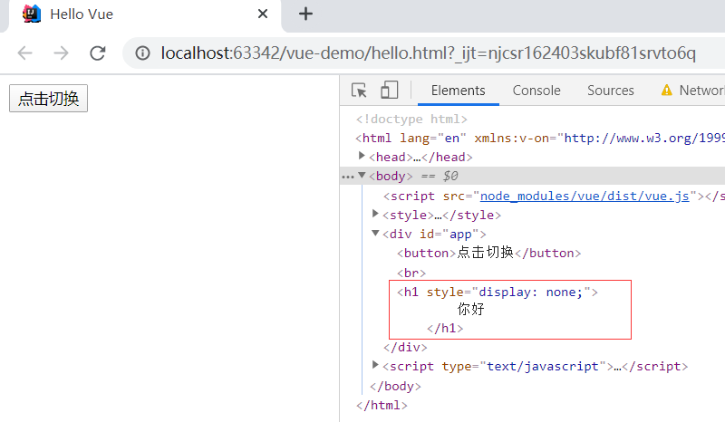
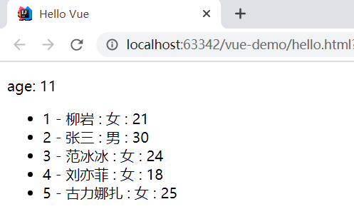
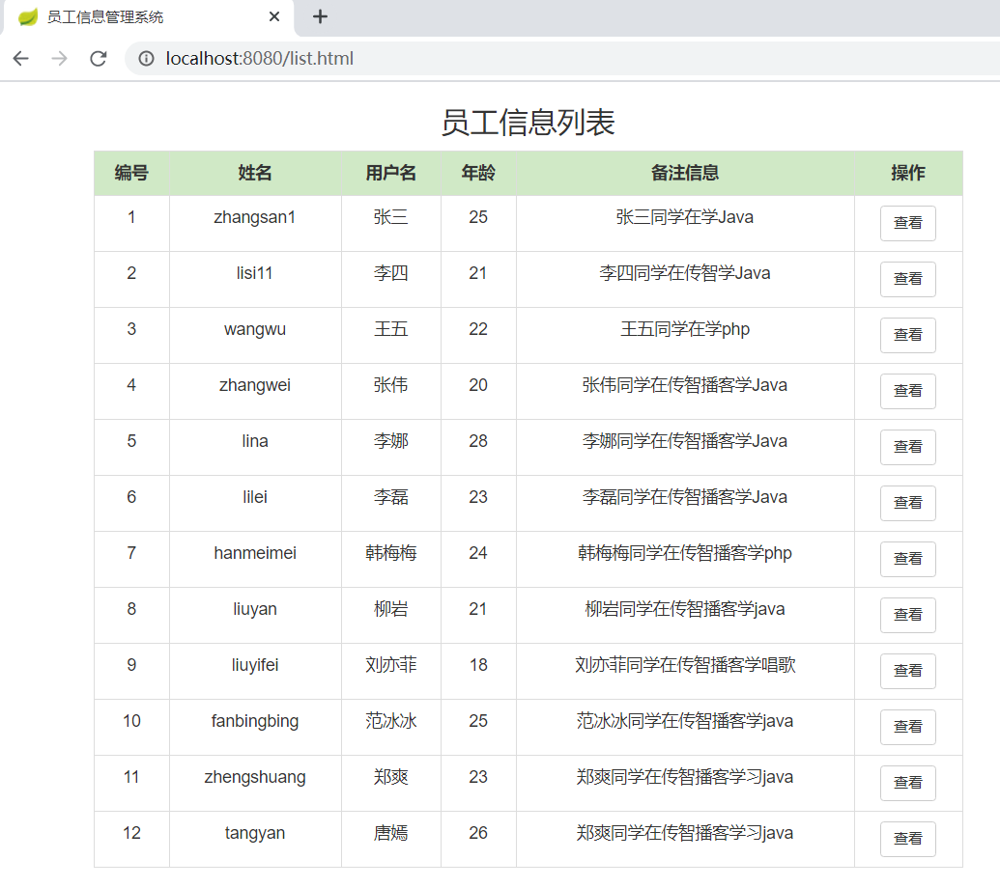

# 前端技术的发展

## 1 从静态走向动态

​		早期的HTML作为静态文件，即使只有部分内容是需要变动的，那么有多少种变动的可能性，就需要准备多少份文档，这对开发者来说是非常不友好的，并且无法与用户进行交互。

​		CGI（Common Gateway Interface）的出现改善了这一情况。CGI作为服务器拓展功能，可以从数据库或者文件系统获取数据，再将数据渲染为HTML文档后，返回至客户端，从而实现了网页的动态生成。

​		CGI出现的最大意义就是给当时刚起步的Web提供了一个发展方向。在这之后，PHP、JSP、ASP等各种服务端语言层出不穷，不仅弥补了CGI的缺陷，而且在性能上愈加高效，在开发上愈加简捷。这些语言的出现和广泛应用，使得Web技术飞速发展，前端网页从此从静态走向动态。这个时代被称为Web1.0时代。

## 2 从后端走向前端

​		在Web1.0时代，前后端是如何协作的呢？由于网页是在服务端使用动态脚本语言和模板引擎渲染出来的，所以一般由前端先写模板，写好后交付给后端套用，之后再由前后端联调，以确认模板套用无误。
​		在这种开发环境下，前后端耦合密切，项目开发需要很高的沟通成本。

​		 Ajax （Asynchronous JavaScript And XML，异步JavaScript和XML） 通过XMLHttpRequest对象，可以在不重载页面的情况下与Web服务器交换数据，再加上 JavaScript的 document对象，开发者们可以很轻松地实现页面局部内容刷新。

​		得益于Ajax的发展，前后端分离的趋势日渐明显，前端不再需要依赖后台环境生存，所有服务器数据都可以通过异步交互来获取。

​		随着 Google V8引擎问世、PC和移动端设备性能提高、ES6和H5日趋成熟，浏览器端的计算能力和功能性似乎愈加过剩，开发者们开始将越来越多的业务逻辑代码迁移到前端，前端路由的概念也逐渐清晰。

​		路由这个概念首先出现在后台。传统Web网页间的跳转，需要开发者先在后台设置页面的路由规则，之后服务器根据用户的请求检索路由规则列表，并返回相应的页面。而前端路由则是在浏览器端配置路由规则，通过侦听浏览器地址的变化，异步加载和更新页面内容。

​		可以这么说，Ajax实现了无刷新的数据交互，前端路由则实现了无刷新的页面跳转，Ajax将 Web Page发展成 Web App，而前端路由则给了 Web App更多的可能，如SPA（Single Page Application，单页面应用）。现在，很多Web项目采用这样的架构，后台只负责数据的存取和组装，而前端则负责业务逻辑层和视图层的全部工作。这一路走来，项目重心已从后端转移到了前端。

​		 Angular、 React、Vue等知名的前端框架都有前端路由的概念。

## 3 从前端走向全端

​		Node.js诞生，Javascript开始占据服务端编程语言的一席之地。前端工程师可以以很低的成本用Node.js和MongoDB搭建一个后台。

## 4 从MVC到MVVM

**模型-视图-控制器（Model-View-Controller,MVC）**

* Model指业务模型，用于计算、校验、处理和提供数据，不直接与用户交互
* View 视图层是用户能够看到并进行交互的客户端界面
* Controller 负责收集用户输入的数据，向相关模型请求数据并返回响应的视图


**MVVM**

​		在MVVM之前，前端开发人员从后端获取需要的数据模型，然后要通过DOM操作Model渲染到View中。而后当用户操作视图，我们还需要通过DOM获取View中的数据，然后同步到Model中。
​		而MVVM中的VM要做的事情就是把DOM操作完全封装起来，通过数据绑定，可以将View和ViewModel关联在一起：

* 只要ViewModel发生了改变，View上自然就会表现出来。
* 当用户修改了View，ViewModel中的数据也会跟着改变。

​		开发人员不用再关心ViewModel和View之间是如何互相影响的，可以从繁琐的DOM操作中解放出来，把关注点放在如何操作ViewModel上。  

​		Vue.js 就是一套轻量级的MVVM框架。

# Vue简介

​		Vue 是一套用于构建用户界面的渐进式框架。与其它大型框架不同的是，Vue 的核心库只关注视图层，不仅易于上手，还便于与第三方库或既有项目整合。同时，Vue 也完全有能力支持采用SPA设计和组合其他Vue生态的系统。

> 前端框架三巨头：Vue.js、React.js、AngularJS。vue.js以期轻量易用著称，vue.js和React.js发展速度最快。  

官网：https://cn.vuejs.org/

# Node和NPM

## 1 安装NodeJs

NPM是Node提供的模块管理工具，可以非常方便的下载安装很多前端框架，包括JQuery、AngularJS、VueJs等。为了后面学习方便，我们先安装Node及NPM工具。  

可以在Node的官网下载Node客户端，自带NPM。Node官网：http://nodejs.cn/


下载Node后安装，安装完成后可以在控制台查看版本信息

```shell
# 查看node版本
node -v
# 查看npm版本
npm -v
```

## 2 配置镜像

npm默认的仓库地址是在国外网站，速度较慢，建议大家设置到淘宝镜像。但是切换镜像是比较麻烦的。推荐一款切换镜像的工具：nrm

我们首先安装nrm，这里`-g`代表全局安装

```
npm install nrm -g
```

然后通过`nrm ls`命令查看npm的仓库列表,带*的就是当前选中的镜像仓库：

 

通过`nrm use taobao`来指定要使用的镜像源：


然后通过`nrm test npm `来测试速度：

 

测试淘宝请输入：

```
nrm test taobao
```

注意：

- 安装完成请一定要重启下电脑！！！
- 安装完成请一定要重启下电脑！！！
- 安装完成请一定要重启下电脑！！！


或者，直接配置仓库：

```
npm config set registry http://registry.npm.taobao.org/
```


# 快速入门

## 1 搭建工程

选择 Static Web


输入名称


## 2 引入Vue

### 2.1 直接用 `<script>` 引入

下载Vue

开发版本：https://cn.vuejs.org/js/vue.js

生产版本：https://cn.vuejs.org/js/vue.min.js

也可以使用CDN服务

对于制作原型或学习，你可以这样使用最新版本：

```javascript
<script src="https://cdn.jsdelivr.net/npm/vue/dist/vue.js"></script>
```

对于生产环境，我们推荐链接到一个明确的版本号和构建文件，以避免新版本造成的不可预期的破坏：

```javascript
<script src="https://cdn.jsdelivr.net/npm/vue@2.6.11"></script>
```

### 2.2 使用NPM

在IDEA的Terminal中输入

```shell
npm init -y
```

通过npm工具来初始化vue项目的开发环境，此时会在项目中生成一个`package.json`文件


安装Vue，输入命令

```shell
npm install vue --save
```

会在项目中发现一个node_modules目录，并且在下面有一个vue目录，并且此时json文件会发生变化


## 3 Vue使用

可以在IDEA中下载插件


新增HTML


编写代码如下：

```html
<!DOCTYPE html>
<html lang="en">
<head>
    <meta charset="UTF-8">
    <title>Hello Vue</title>
</head>
<body>
<div id="app">
    <h1>{{name}}，你好。</h1>
</div>
<script src="node_modules/vue/dist/vue.js"></script>
<script type="text/javascript">
    var vm = new Vue({
        el: '#app',
        data: {name: "Tom"}
    })
</script>
</body>
</html>
```

这里的`vue.js`可以直接从左侧目录中拖动过来


代码说明：

* 首先通过 new Vue()来创建Vue实例vm
* 然后构造函数接收一个对象，对象中有一些属性：  
  * el：是element的缩写，通过id选中要渲染的页面元素，本例中是一个div  
  * data：数据，数据是一个对象，里面的属性可以渲染到视图中  
    * name：这里指定了一个name属性  
* 页面中的 h1 元素中，通过{{name}}的方式，来渲染刚刚定义的name属性。  

在IDEA中点击浏览器图标可以打开页面


可以看到页面显示


按`F12`打开浏览器的控制台，在控制台中输入

```html
vm.name='Jerry'
```

回车后可以看到页面显示已经变更：


# Vue实例  

## 1 创建Vue实例  

每个 Vue 应用都是通过用 Vue 函数创建一个新的 Vue 实例开始的：  

```javascript
var vm = new Vue({
	// 选项
})
```

在构造函数中传入一个对象，并且在对象中声明各种Vue需要的数据和方法，包括：

* el
* data
* methods
* ...

接下来我们一 一介绍。  

## 2 模板或元素  

每个Vue实例都需要关联一段Html模板，Vue会基于此模板进行视图渲染。
我们可以通过el属性来指定。
例如一段html模板：  

```html
<div id="app">
</div>
```

然后创建Vue实例，关联这个div  

```javascript
var vm = new Vue({
	el:"#app"
})
```

这样，Vue就可以基于id为 app 的div元素作为模板进行渲染了。

在这个div范围以外的部分是无法使用vue特性的。  

## 3 数据  

​		当Vue实例被创建时，它会尝试获取在data中定义的所有属性，用于视图的渲染，并且监视data中的属性变化，当data发生改变，所有相关的视图都将重新渲染，这就是“响应式“系统。  

html:

```html
<div id="app">
    <h1>{{name}}，你好。</h1>
    <input type="text" v-model="name">
</div>
```

js:

```javascript
var vm = new Vue({
        el: '#app',
        data: {name: "Tom"}
    })
```

修改文本框中的值会更新上面的提示，也会更新vm中的值


## 4 方法  

Vue实例中除了可以定义data属性，也可以定义方法，并且在Vue的作用范围内使用。  

```html
<div id="app">
    <h1>{{name}}，你好。</h1>
    <input type="text" v-model="name">
    <button v-on:click='add'>点我</button>
</div>
<script src="node_modules/vue/dist/vue.js"></script>
<script type="text/javascript">
    var vm = new Vue({
        el: '#app',
        data: {name: "Tom"},
        methods: {
            add: function () {
                // 将字符串输出到控制台
                console.log("hello")
            }
        }
    })
</script>
```


## 5 生命周期  

​		每个 Vue 实例在被创建时都要经过一系列的初始化过程 ：创建实例，装载模板，渲染模板等等。Vue为
生命周期中的每个状态都设置了钩子函数（监听函数）。每当Vue实例处于不同的生命周期时，对应的函数就会被触发调用。  

### 5.1 生命周期图示


### 5.2 钩子函数  

例如：created代表在vue实例创建后；
我们可以在Vue中定义一个created函数，代表这个时期的构造函数：  

```html
<div id="app">
    <h1>{{name}}，你好。</h1>
    <input type="text" v-model="name">
    <button v-on:click='add'>点我</button>
</div>
<script src="node_modules/vue/dist/vue.js"></script>
<script type="text/javascript">
    var vm = new Vue({
        el: '#app',
        data: {name: "Tom"},
        methods: {
            add: function () {
                console.log("hello")
            }
        },
        created: function () {
            console.log('hello vue!')
        }
    })
</script>
```

可以在控制台查看


### 5.3 this  

我们可以看下在vue内部的this变量是谁，我们在created的时候，打印this  

```javascript
var vm = new Vue({
    el: '#app',
    data: {name: "Tom"},
    methods: {
        add: function () {
            // `this` 指向 vm 实例
            console.log("hello" + this.name)
        }
    },
    created: function () {
        console.log('hello ')
    }
})
```

查看控制台


# Vue语法

## 1 插值绑定

### 1.1 插值表达式  

格式：  

```html
{{表达式}}
```

说明：

* 该表达式支持JS语法，可以调用js内置函数（必须有返回值）,如:new Date()
* 表达式必须有返回结果。例如 1 + 1，没有结果的表达式不允许使用，如：var a = 1 + 1;
* 可以直接获取Vue实例中定义的数据或函数  

示例：  

```html
<div id="app">{{name}}-{{age}}-{{add(3,2)}}</div>
<script type="text/javascript">
    var app = new Vue({
        el: "#app",
        data: {
            name: "Jack",
            age: 18
        },
        methods:{
            add: function (a,b) {
                return a+b;
            }
        }
    })
</script>
```


### 1.2 v-text和v-html  

使用v-text和v-html指令来替代 {{}}
说明：

* v-text：将数据输出到元素内部，如果输出的数据有HTML代码，会作为普通文本输出
* v-html：将数据输出到元素内部，如果输出的数据有HTML代码，会被渲染  

示例：  

```html
<div id="app">
    <label>v-text</label>:<span v-text="hello"></span> <br/>
    <label>v-html</label>:<span v-html="hello"></span>
</div>
<script type="text/javascript">
    var vm = new Vue({
        el:"#app",
        data:{
            hello: "<h1>大家好，我是张三</h1>"
        }
    })
</script>
```


## 2 属性绑定

### 2.1 指令v-bind

DOM节点的属性基本都可以使用v-bind进行绑定

示例：

```html
<style>
    .style-italic {
        font-style: italic;
    }
</style>
<div id="app">
    <p v-bind:class="className" v-bind:title="title">点击有奖</p>
</div>
<script type="text/javascript">
    var vm = new Vue({
        el: "#app",
        data: {
            className: 'style-italic',
            title: '不要点击'
        }
    })
</script>
```

v-bind也可以省略不写

```html
<div id="app">
    <p :class="className" v-bind:title="title">点击有奖</p>
</div>
```


### 2.2 class和style绑定

可以通过字符串、数组和对象三种方式动态绑定，示例如下：

```html
<style>
    .color-gray {
        color: gray;
    }

    .size-18 {
        font-size: 18px;
    }

    .style-italic {
        font-style: italic;
    }
</style>
<div id="app">
    <p :class="class1">字符串绑定</p>
    <p :class="class2">数组绑定</p>
    <p :class="class3">对象绑定</p>
</div>
<script type="text/javascript">
    var vm = new Vue({
        el: "#app",
        data: {
            class1: 'style-italic',
            class2: ['color-gray', 'size-18'],
            class3: {
                'color-gray': true,
                'size-18': true,
                'style-italic': true
            }
        }
    })
</script>
```

## 3 事件绑定

### 3.1 指令v-on

v-on指令用于给页面元素绑定事件。  

语法：  

```html
v-on:事件名="js片段或函数名"
```

简写语法：  

```html
@事件名="js片段或函数名"
```

示例：  

```html
<div id="app">
    <!--事件中直接写js片段-->
    <button @click="num++">增加</button><br/>
    <!--事件指定一个回调函数，必须是Vue实例中定义的函数-->
    <button @click="decrement">减少</button><br/>
    <h1>num: {{num}}</h1>
</div>
<script type="text/javascript">
    var app = new Vue({
        el:"#app",
        data:{
            num:1
        },
        methods:{
            decrement(){
                this.num--;
            }
        }
    })
</script>
```

### 3.2 事件修饰符		

​		在事件处理程序中调用 event.preventDefault() (阻止节点默认行为)或 event.stopPropagation() （阻止事件冒泡）是非常常见的需求。尽管我们可以在方法中轻松实现这点，但更好的方式是：方法只有纯粹的数据逻辑，而不是去处理DOM 事件细节。
​		为了解决这个问题，Vue.js 为 v-on 提供了事件修饰符。修饰符是由点开头的指令后缀来表示的。

* .stop ：阻止事件冒泡
* .prevent ：阻止默认事件发生
* .capture ：使用事件捕获模式
* .self ：只有元素自身触发事件才执行。（冒泡或捕获的都不执行）
* .once ：只执行一次  

示例：

```html
<div id="app">
    <button @click.once="add">点赞</button><br/>
    <h1>num: {{num}}</h1>
</div>
<script type="text/javascript">
    var app = new Vue({
        el:"#app",
        data:{
            num:1
        },
        methods:{
            add(){
                this.num++;
            }
        }
    })
</script>
```

这里设置点赞按钮只能点击一次，再次点击没有不会新增num。

## 4 双向绑定

### 4.1 指令v-model

可以用 `v-model` 指令在表单元素上创建双向数据绑定。支持的元素如下：

* `input`
* `text `
* `textarea `
* `checkbox `
* `radio `
* `select `

示例：

```html
<div id="app">
    <input id="cb1" type="checkbox" v-model="language" value="Java" /><label for="cb1">Java</label><br/>
    <input id="cb2" type="checkbox" v-model="language" value="PHP" /><label for="cb2">PHP</label><br/>
    <input id="cb3" type="checkbox" v-model="language" value="Swift" /><label for="cb3">Swift</label><br/>
    <h1>
        你选择了：{{language.join(',')}}
    </h1>
</div>
<script type="text/javascript">
    var vm = new Vue({
        el:"#app",
        data:{
            language: []
        }
    })
</script>
```

## 5 条件渲染

### 5.1 指令v-if

**v-if**，顾名思义，条件判断。当得到结果为true时，所在的元素才会被渲染。  

示例：

```html
<div id="app">
    <!--事件中直接写js片段-->
    <button v-on:click="show = !show">点击切换</button>
    <br/>
    <h1 v-if="show">
        你好
    </h1>
</div>
<script type="text/javascript">
    var vm = new Vue({
        el: "#app",
        data: {
            show: true
        }
    })
</script>
```

**v-else-if和v-else** ，配合v-if 使用

```html
<div id="app">
    <select v-model="selected">
        <option disabled value="">请选择</option>
        <option>Java</option>
        <option>Python</option>
        <option>PHP</option>
    </select>
    <h2 v-if="selected == 'Java'">明智的选择</h2>
    <h2 v-else-if="selected == 'Python'">不错的选择</h2>
    <h2 v-else="selected == 'PHP'">老掉牙的选择</h2>
</div>
<script type="text/javascript">
    var vm = new Vue({
        el: "#app",
        data: {
            selected: 'Java'
        }
    })
</script>
```

### 5.2 v-show

带有 v-show 的元素始终会被渲染并保留在 DOM 中，v-show 只是简单地切换元素的 CSS 属性 display 。  

```html
<div id="app">
    <!--事件中直接写js片段-->
    <button v-on:click="show = !show">点击切换</button>
    <br/>
    <h1 v-show="show">
        你好
    </h1>
</div>
<script type="text/javascript">
    var vm = new Vue({
        el: "#app",
        data: {
            show: true
        }
    })
</script>
```




## 6 列表渲染

### 指令v-for

遍历数据渲染页面是非常常用的需求，Vue中通过v-for指令来实现。 

语法：

```html
v-for=item in items
v-for=item of items
```

* items：要遍历的数组，需要在vue的data中定义好。
* item：迭代得到的数组元素的别名  

示例：

```html
<script src="node_modules/vue/dist/vue.js"></script>
<div id="app">
    <ul>
        <li v-for="user in users">
            {{user.name}} : {{user.gender}} : {{user.age}}
        </li>
    </ul>
</div>

<script type="text/javascript">
    var vm = new Vue({
        el: "#app",
        data: {
            users: [
                {name: '柳岩', gender: '女', age: 21},
                {name: '张三', gender: '男', age: 30},
                {name: '范冰冰', gender: '女', age: 24},
                {name: '刘亦菲', gender: '女', age: 18},
                {name: '古力娜扎', gender: '女', age: 25}
            ]
        }
    })
</script>
```

也可以使用数组下标

> 语法

```html
v-for="(item,index) in items"
```

* items：要迭代的数组
* item：迭代得到的数组元素别名
* index：迭代到的当前元素索引，从0开始。  

示例：

```html
<div id="app">
    <ul>
        <li v-for="(user,index) in users">
            {{index}} - {{user.name}} : {{user.gender}} : {{user.age}}
        </li>
    </ul>
</div>
```

v-for除了可以迭代数组，也可以迭代对象。

> 语法

```html
v-for="value in object"
v-for="(value,key) in object"
v-for="(value,key,index) in object"
```

示例：

```html
<div id="app">
    <ul>
        <li v-for="(value,key,index) in user">
            {{index}} - {{key}} : {{value}}
        </li>
    </ul>
</div>
<script src="node_modules/vue/dist/vue.js"></script>
<script type="text/javascript">
    var vm = new Vue({
        el: "#app",
        data: {
            user:{name:'柳岩', gender:'女', age: 21}
        }
    })
</script>
```


## :reminder_ribbon:经验分享

### 1.Vue显示结果不正确

> 代码如下

```html
<div id="app">
    <p>age: {{age++}}</p>
    <ul>
        <li v-for="(user,index) in users">
            {{index++}} - {{user.name}} : {{user.gender}} : {{user.age}}
        </li>
    </ul>
</div>
<script src="node_modules/vue/dist/vue.js"></script>
<script type="text/javascript">
    var vm = new Vue({
        el: "#app",
        data: {
            age: 10,
            users: [
                {name: '柳岩', gender: '女', age: 21},
                {name: '张三', gender: '男', age: 30},
                {name: '范冰冰', gender: '女', age: 24},
                {name: '刘亦菲', gender: '女', age: 18},
                {name: '古力娜扎', gender: '女', age: 25}
            ]
        }
    })
</script>
```

这里想显示年龄为数据中的年龄+1

下面的列表想要显示序号从1开始

### 2.出现的问题

结果不正确：


在控制台中报错：


### 3.问题的分析

> 在插值绑定中不能使用++操作符


###  4.问题解决办法

> 解决方案

将++改为+1

```html
<div id="app">
    <p>age: {{age+1}}</p>
    <ul>
        <li v-for="(user,index) in users">
            {{index+1}} - {{user.name}} : {{user.gender}} : {{user.age}}
        </li>
    </ul>
</div>
<script src="node_modules/vue/dist/vue.js"></script>
<script type="text/javascript">
    var vm = new Vue({
        el: "#app",
        data: {
            age: 10,
            users: [
                {name: '柳岩', gender: '女', age: 21},
                {name: '张三', gender: '男', age: 30},
                {name: '范冰冰', gender: '女', age: 24},
                {name: '刘亦菲', gender: '女', age: 18},
                {name: '古力娜扎', gender: '女', age: 25}
            ]
        }
    })
</script>
```

结果如下：



## 7 计算属性  

在插值表达式中使用js表达式是非常方便的，而且也经常被用到。
但是如果表达式的内容很长，就会显得不够优雅，而且后期维护起来也不方便，例如下面的场景，我们
有一个日期的数据，但是是毫秒值：  

```html
data:{
	birthday:1529032123201 // 毫秒值
}
```

我们在页面渲染，希望得到yyyy-MM-dd的样式：  

```html
<h1>您的生日是：{{
new Date(birthday).getFullYear() + '-'+ new Date(birthday).getMonth()+ '-' +
new Date(birthday).getDay()
}}
</h1>
```

虽然能得到结果，但是非常麻烦。
Vue中提供了计算属性，来替代复杂的表达式：  

```html
<div id="app">
    <h1>您的生日是：{{birth}} </h1>
</div>
<script src="node_modules/vue/dist/vue.js"></script>
<script type="text/javascript">
    var vm = new Vue({
        el: "#app",
        data: {
            birthday: 1429032123201 // 毫秒值
        },
        computed: {
            birth() {// 计算属性本质是一个方法，但是必须返回结果
                var d = new Date(this.birthday);
                return d.getFullYear() + "-" + d.getMonth() + "-" + d.getDay();
            }
        }
    })
</script>
```

## 8 侦听属性

watch可以让我们监控一个值的变化。从而做出相应的反应。  

示例：

```html
<div id="app">
    <input type="text" v-model="message">
</div>
<script type="text/javascript">
    var vm = new Vue({
        el: "#app",
        data: {
            message: ""
        },
        watch: {
            message(newVal, oldVal) {
                console.log(newVal, oldVal);
            }
        }
    })
</script>
```

如果监控的是一个对象，需要进行深度监控，才能监控到对象中属性的变化，例如：  

```html
<div id="app">
    姓名：<input type="text" v-model="person.name"> <br>
    年龄：<input type="text" v-model="person.age">
    <button
            @click="person.age++">+
    </button>
    <br>
    <h1>
        {{person.name}}今年{{person.age}}岁了。
    </h1>
</div>
<script src="node_modules/vue/dist/vue.js"></script>
<script type="text/javascript">
    var vm = new Vue({
        el: "#app",
        data: {
            person: {
                name: "Jack",
                age: 21
            }
        },
        watch: {
            person: {
                deep: true, // 开启深度监控，可以监控到对象中属性变化
                handler(val) { // 定义监控到以后的处理方法
                    console.log(val.name + ": " + val.age);
                }
            }
        }
    })
</script>
```

# 组件化  

​		在大型应用开发的时候，页面可以划分成很多部分。往往不同的页面，也会有相同的部分。例如可能会
有相同的头部导航。
​		但是如果每个页面都独自开发，这无疑增加了我们开发的成本。所以我们会把页面的不同部分拆分成独
立的组件，然后在不同页面就可以共享这些组件，避免重复开发。  

## 1 定义全局组件  

我们通过Vue的component方法来定义一个全局组件。  

```html
<div id="app">
    <!--使用定义好的全局组件-->
    <counter></counter>
</div>
<script src="node_modules/vue/dist/vue.js"></script>
<script type="text/javascript">
    // 定义全局组件，两个参数：1，组件名称。2，组件参数
    Vue.component("counter", {
        template: '<button v-on:click="count++">你点了我 {{ count }} 次，我记住了. </button>',
        data() {
            return {
                count: 0
            }
        }
    })
    var vm = new Vue({
        el: "#app"
    })
</script>
```

* 组件其实也是一个Vue实例，因此它在定义时也会接收：data、methods、生命周期函数等
* 不同的是组件不会与页面的元素绑定，否则就无法复用了，因此没有el属性。
* 组件渲染需要html模板，所以增加了template属性，值就是HTML模板
* 全局组件定义完毕，任何vue实例都可以直接在HTML中通过组件名称来使用组件了。
* data的定义方式比较特殊，必须是一个函数。  

## 2 组件的复用  

定义好的组件，可以任意复用多次：  

```html
<div id="app">
    <!--使用定义好的全局组件-->
    <counter></counter>
    <counter></counter>
    <counter></counter>
</div>
```


会发现每个组件互不干扰，都有自己的count值。怎么实现的？  

组件的data属性必须是函数！  

当我们定义这个 <counter> 组件时，它的data 并不是像这样直接提供一个对象：  

```html
data: {
	count: 0
}
```

取而代之的是，一个组件的 data 选项必须是一个函数，因此每个实例可以维护一份被返回对象的独立的拷贝：  

```javascript
data: function () {
    return {
    	count: 0
    }
}
```

如果 Vue 没有这条规则，点击一个按钮就会影响到其它所有实例！  

# Spring Boot + Vue 项目案例

## 集成SSM框架

打开资料中的原始工程

启动后访问http://localhost:8080/user/1 可以获取单个用户的信息


访问 http://localhost:8080/user 可以获取用户列表


## 列表页面

列表页面的静态数据需要修改为动态数据


html修改如下

```html
<tr v-for="user in users">
    <td>{{user.id}}</td>
    <td>{{user.userName}}</td>
    <td>{{user.name}}</td>
    <td>{{user.age}}</td>
    <td>{{user.note}}</td>
    <td><a class="btn btn-default btn-sm" :href="'view.html?id='+user.id" >查看</a></td>
</tr>
```

在下面是script中添加

```javascript
<script>
    var vm = new Vue({
        el: "#myApp",
        data:{
            users: []
        },
        methods:{
            findAll: function () {
                // 调用后台接口返回用户列表
                axios.get("/user").then(function (result) {
                    // 将返回数据列表赋值给users
                    vm.users=result.data;
                })
            }
        },
        created: function () {
            // 调用查询用户列表方法
            this.findAll();
        }
    })
</script>
```

完成后打开浏览器:http://localhost:8080/list.html



## 详情页面

同样需要修改静态数据为动态数据


修改HTML如下

```html
    <div class="form-group">
        <label>姓名：</label>
        <span>{{user.name}}</span>
    </div>

    <div class="form-group">
        <label>用户名：</label>
        <span>{{user.userName}}</span>
    </div>

    <div class="form-group">
        <label>年龄：</label>
        <span>{{user.age}}</span>
    </div>
    <div class="form-group">
        <label>性别：</label>
         <span v-if="user.sex==0">女</span>
         <span v-if="user.sex==1">男</span>
    </div>

    <div class="form-group">
        <label>备注：</label>
        <span>{{user.note}}</span>
    </div>
```


修改script如下

```javascript
<script>
    var vm = new Vue({
        el: "#myApp",
        data: {
            user: {}
        },
        methods:{
            findById: function () {
                // 获取url上的id值
                var id = location.search.split("=")[1];
                axios.get("/user/"+id).then(function(res){
                    vm.user = res.data;
                })
            }
        },
        created: function () {
            this.findById();
        }
    })
</script>
```


在列表页面点击查看进入到详情页面


