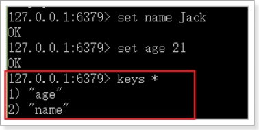
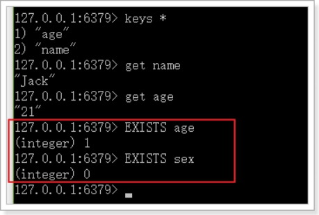
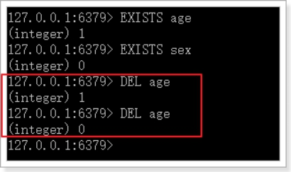
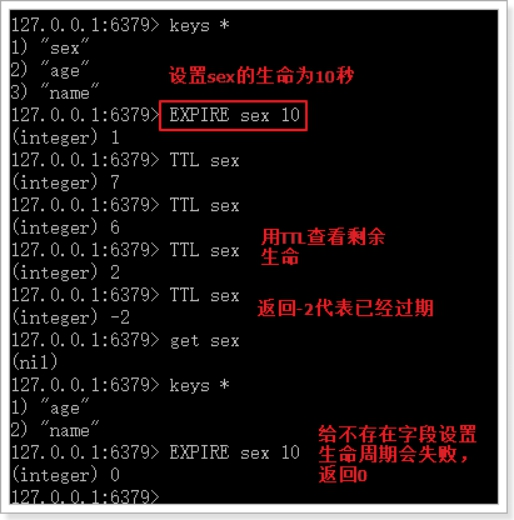
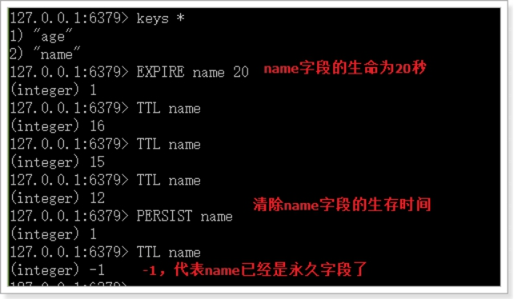
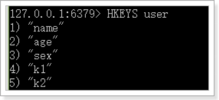
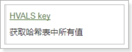
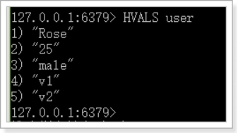
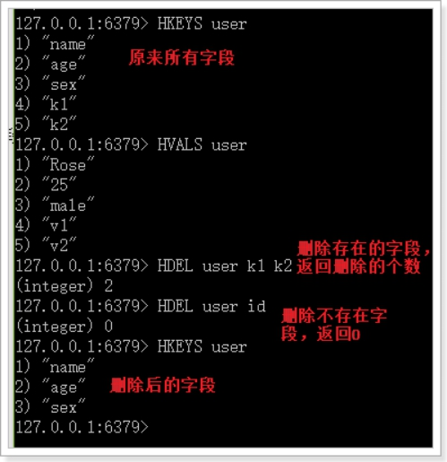

# 学习目标

- 使用RocketMQ实现数据同步
- 会使用SpringDataRedis
- 实现阿里短信SDK发送短信
- 创建用户中心微服务

# 1.实现数据同步

上次学习中，我们已经完成了对MQ的基本学习和认识。接下来，我们就改造项目，实现搜索服务、商品静态页的数据同步。

### 重点：了解数据同步的需求。独立实现数据同步

## 1.1.思路分析

> 发送方：商品微服务

- 什么时候发？

  当商品服务对商品进行新增和上下架的时候，需要发送一条消息，通知其它服务。

- 发送什么内容？

  对商品的增删改时其它服务可能需要新的商品数据，但是如果消息内容中包含全部商品信息，数据量太大，而且并不是每个服务都需要全部的信息。因此我们**只发送商品id**，其它服务可以根据id查询自己需要的信息。

> 接收方：搜索微服务、静态页微服务

- 接收消息后如何处理？
  - 搜索微服务：
    - 上架：添加新的数据到索引库
    - 下架：删除索引库数据
  - 静态页微服务：
    - 上架：创建新的静态页
    - 下架：删除原来的静态页

    

在`ly-common`中编写一个常量类，记录将来会用到的Topic名称、Tags名称

```java
package com.leyou.common.constants;


public abstract class RocketMQConstants {

    public static final class TOPIC {
        /**
         * 商品服务
         */
        public static final String ITEM_TOPIC_NAME = "ly-item-topic";
        /**
         * 短信服务
         */
        public static final String SMS_TOPIC_NAME = "ly-sms-topic";
        /**
         * 秒杀服务
         */
        public static final String SECKILL_TOPIC_NAME = "ly-seckill-topic";
        /**
         * 订单
         */
        public static final String ORDER_TOPIC_NAME = "ly-order-topic";
    }

    public static final class TAGS {
        /**
         * 商品上架的TAGS
         */
        public static final String ITEM_UP_TAGS = "item-up";
        /**
         * 商品下架的TAGS
         */
        public static final String ITEM_DOWN_TAGS = "item-down";
        /**
         * 发送短信验证码TAGS
         */
        public static final String VERIFY_CODE_TAGS = "sms-verify-code";
        /**
         * 秒杀开始TAGS
         */
        public static final String SECKILL_BEGIN_TAGS = "seckill-begin";
        /**
         * 秒杀业务创建订单TAGS
         */
        public static final String SECKILL_ORDER_TAGS = "seckill.order";
        /**
         * 秒杀业务创建订单TAGS
         */
        public static final String ORDER_OVERTIME_TAGS = "order.overtime";
    }
    public static final class CONSUMER{
        /**
         * 短信发送 的消费者
         */
        public static final String SMS_VERIFY_CODE_CONSUMER = "SMS_VERIFY_CODE_CONSUMER";
        /**
         * 秒杀 订单创建
         */
        public static final String SECKILL_ORDER_CONSUMER = "SECKILL_ORDER_CONSUMER";
        /**
         * 秒杀开始
         */
        public static final String SECKILL_BEGIN_CONSUMER = "SECKILL_BEGIN_CONSUMER";
        /**
         * 秒杀 订单创建
         */
        public static final String ORDER_OVERTIME_CONSUMER = "ORDER_OVERTIME_CONSUMER";
        /**
         * 静态页商品上架
         */
        public static final String ITEM_PAGE_UP_CONSUMER = "ITEM_PAGE_UP_CONSUMER";
        /**
         * 静态页商品下架
         */
        public static final String ITEM_PAGE_DOWN_CONSUMER = "ITEM_PAGE_DOWN_CONSUMER";
        /**
         * 搜索商品上架
         */
        public static final String  ITEM_SEARCH_UP_CONSUMER = "ITEM_SEARCH_UP_CONSUMER";
        /**
         * 搜索商品下架
         */
        public static final String ITEM_SEARCH_DOWN_CONSUMER = "ITEM_SEARCH_DOWN_CONSUMER";

    }
}

```


## 1.2.发送消息

我们先在商品微服务`ly-item-service`中实现发送消息。

### 1.2.1.引入依赖

```xml
<dependency>
    <groupId>org.apache.rocketmq</groupId>
    <artifactId>rocketmq-spring-boot-starter</artifactId>
    <version>2.0.2</version>
</dependency>
```

### 1.2.2.配置文件

我们在application.yml中添加一些有关RocketMQ的配置：

```yaml
rocketmq:
  name-server: 127.0.0.1:9876
  producer:
    group: ${spring.application.name}
```

### 1.2.3.改造GoodsService

改造GoodsService中的商品上下架功能，发送消息

```java
import static com.leyou.common.constants.RocketMQConstants.TAGS.ITEM_UP_KEY;
import static com.leyou.common.constants.RocketMQConstants.TOPIC.ITEM_TOPIC_NAME;

@Autowired
private RocketMQTemplate rocketMQTemplate;

@Transactional
public void updateSaleable(Long id, Boolean saleable) {
    TbSpu tbSpu = new TbSpu();
    tbSpu.setId(spuId);
    tbSpu.setSaleable(saleable);
    boolean bSpuUpdate = spuService.updateById(tbSpu);
    if(!bSpuUpdate){
        throw new LyException(ExceptionEnum.UPDATE_OPERATION_FAIL);
    }
    UpdateWrapper<TbSku> updateWrapper = new UpdateWrapper<>();
    updateWrapper.lambda().set(TbSku::getEnable,saleable).eq(TbSku::getSpuId,spuId);
    boolean bSkuUpdate = skuService.update(updateWrapper);
    if(!bSkuUpdate){
        throw new LyException(ExceptionEnum.UPDATE_OPERATION_FAIL);
    }

    //发送 消息 ,消息内容是spuid
        String tag = saleable ? ITEM_UP_TAGS : ITEM_UP_TAGS;
        rocketMQTemplate.convertAndSend(ITEM_TOPIC_NAME+":"+tag,spuId);
}
```

## 1.3.搜索服务接收消息

搜索服务接收到消息后要做的事情：

- 上架：添加新的数据到索引库
- 下架：删除索引库数据

我们需要两个不同队列，监听不同类型消息。

### 1.3.1.引入依赖

```xml
<dependency>
    <groupId>org.apache.rocketmq</groupId>
    <artifactId>rocketmq-spring-boot-starter</artifactId>
    <version>2.0.2</version>
</dependency>
```


### 1.3.2.添加配置

```yaml
rocketmq:
  name-server: 127.0.0.1:9876
```

### 1.3.3.编写监听器

  

商品上架监听消息代码：

```java
package com.leyou.search.listener;

import com.leyou.common.constants.RocketMQConstants;
import com.leyou.search.service.SearchService;
import lombok.extern.slf4j.Slf4j;
import org.apache.rocketmq.spring.annotation.RocketMQMessageListener;
import org.apache.rocketmq.spring.core.RocketMQListener;
import org.springframework.beans.factory.annotation.Autowired;
import org.springframework.stereotype.Component;

import static com.leyou.common.constants.RocketMQConstants.TAGS.ITEM_UP_KEY;
import static com.leyou.common.constants.RocketMQConstants.TOPIC.ITEM_TOPIC_NAME;

/**
 * 商品上架消费
 */
@Slf4j
@Component
@RocketMQMessageListener(topic = ITEM_TOPIC_NAME,
                        selectorExpression = ITEM_UP_KEY,
                        consumerGroup = "ITEM_SEARCH_UP")
public class ItemUpListener implements RocketMQListener<Long> {

    @Autowired
    private SearchService searchService;
    @Override
    public void onMessage(Long spuId) {
        log.info("[搜索服务]- (商品上架) -接收消息，spuId={}", spuId);
        searchService.createIndex(spuId);
    }
}

```

商品下架监听消息代码：

```java
package com.leyou.search.listener;

import com.leyou.common.constants.RocketMQConstants;
import com.leyou.search.repository.GoodsRepository;
import com.leyou.search.service.SearchService;
import lombok.extern.slf4j.Slf4j;
import org.apache.rocketmq.spring.annotation.RocketMQMessageListener;
import org.apache.rocketmq.spring.core.RocketMQListener;
import org.springframework.beans.factory.annotation.Autowired;
import org.springframework.stereotype.Component;

import static com.leyou.common.constants.RocketMQConstants.TAGS.ITEM_DOWN_KEY;
import static com.leyou.common.constants.RocketMQConstants.TOPIC.ITEM_TOPIC_NAME;

/**
 * 商品下架消息
 */
@Slf4j
@Component
@RocketMQMessageListener(topic = ITEM_TOPIC_NAME,
                        selectorExpression = ITEM_DOWN_KEY,
                        consumerGroup = "ITEM_SEARCH_DOWN")
public class ItemDownListener implements RocketMQListener<Long> {
    @Autowired
    private SearchService searchService;

    @Override
    public void onMessage(Long spuId) {
        log.info("[搜索服务]- (商品下架) -接收消息，spuId={}", spuId);
        searchService.removeIndex(spuId);
    }
}

```


### 1.3.4.编写创建和删除索引方法

这里因为要创建和删除索引，我们需要在SearchService中拓展两个方法，创建和删除索引：

```java
public void createIndex(Long id){
    // 查询spu
    SpuDTO spu = itemClient.querySpuById(id);
    // 构建成goods对象 
    Goods goods = buildGoods(spu);
    // 保存数据到索引库
    goodsRepository.save(goods);
}

public void deleteById(Long id) {
    goodsRepository.deleteById(id);
}
```

创建索引的方法可以从之前导入数据的测试类中拷贝和改造。


## 1.4.静态页服务接收消息

商品静态页服务接收到消息后的处理：

- 上架：创建新的静态页
- 下架：删除原来的静态页

与前面搜索服务类似，也需要两个队列来处理。

### 1.4.1.引入依赖

```xml
<dependency>
    <groupId>org.apache.rocketmq</groupId>
    <artifactId>rocketmq-spring-boot-starter</artifactId>
    <version>2.0.2</version>
</dependency>
```

### 1.4.2.添加配置

```yaml
rocketmq:
  name-server: 127.0.0.1:9876
```

### 1.4.3.编写监听器

 

上架消息监听代码：

```java
package com.leyou.page.listener;

import com.leyou.page.service.PageService;
import lombok.extern.slf4j.Slf4j;
import org.apache.rocketmq.spring.annotation.RocketMQMessageListener;
import org.apache.rocketmq.spring.core.RocketMQListener;
import org.springframework.beans.factory.annotation.Autowired;
import org.springframework.stereotype.Component;

import static com.leyou.common.constants.RocketMQConstants.TAGS.ITEM_UP_KEY;
import static com.leyou.common.constants.RocketMQConstants.TOPIC.ITEM_TOPIC_NAME;

@Slf4j
@Component
@RocketMQMessageListener(topic = ITEM_TOPIC_NAME,
        selectorExpression = ITEM_UP_KEY,
        consumerGroup = "ITEM_PAGE_UP_CONSUMER")
public class ItemUpListener implements RocketMQListener<Long> {

    @Autowired
    private PageService pageService;

    @Override
    public void onMessage(Long spuId) {
        log.info("[静态页服务]- (商品上架) -接收消息，spuId={}", spuId);
        //商品上架消息
        pageService.createHtml(spuId);
    }
}

```

下架消息监听代码：

```java
package com.leyou.page.listener;

import com.leyou.page.service.PageService;
import lombok.extern.slf4j.Slf4j;
import org.apache.rocketmq.spring.annotation.RocketMQMessageListener;
import org.apache.rocketmq.spring.core.RocketMQListener;
import org.springframework.beans.factory.annotation.Autowired;
import org.springframework.stereotype.Component;

import static com.leyou.common.constants.RocketMQConstants.TAGS.ITEM_DOWN_KEY;
import static com.leyou.common.constants.RocketMQConstants.TOPIC.ITEM_TOPIC_NAME;

@Slf4j
@Component
@RocketMQMessageListener(topic = ITEM_TOPIC_NAME,
        selectorExpression = ITEM_DOWN_KEY,
        consumerGroup = "ITEM_PAGE_DOWN_CONSUMER")
public class ItemDownListener implements RocketMQListener<Long> {

    @Autowired
    private PageService pageService;

    @Override
    public void onMessage(Long spuId) {

        log.info("[静态页服务]- (商品下架) -接收消息，spuId={}", spuId);
        pageService.deleteHtml(spuId);
    }
}

```

### 1.4.4.添加删除页面方法

```java
public void deleteItemHtml(Long id) {
    File file = new File(itemDir, id + ".html");
    if(file.exists()){
        if (!file.delete()) {
            log.error("【静态页服务】静态页删除失败，商品id：{}", id);
            throw new LyException(ExceptionEnum.FILE_WRITER_ERROR);
        }
    }
}
```


## 1.5.测试

### 查看数据

我们搜索下手机：


商品详情页：


### 修改商品

然后在管理后台修改商品：

我们修改以下内容：

标题改成6.1

 


商品详情加点文字：

 

价格改为3999

 

### 再次查看数据

搜索页：

详情页：


详情内容：


完美！

# 2.Redis回顾

完成了商品的详情展示，下一步自然是购物了。不过购物之前要完成用户的注册和登录等业务，我们需要使用到Redis技术，一起来回顾下。

### 重点：熟悉redis的数据结构，了解redis的命令分组，了解redis的持久化能够使用SpringDataRedis操作redis

## 2.1.NoSql

Redis是目前非常流行的一款NoSql数据库。

> 什么是NoSql？


常见的NoSql产品：


## 2.2.Redis的介绍和安装

### 2.2.1.简介

> Redis的网址：

[官网](http://redis.io/)：速度很慢，几乎进去不去啊。

[中文网站](http://www.redis.cn/)：有部分翻译的官方文档，英文差的同学的福音


> 历史：


> 特性：

 

### 2.2.2.Redis与Memcache

Redis和Memcache是目前非常流行的两种NoSql数据库，读可以用于服务端缓存。两者有怎样的差异呢？

- 从实现来看：
  - redis：单线程-多路复用  NIO
  - Memcache：多线程
- 从存储方式来看：
  - redis：支持数据持久化和主从备份，数据更安全
  - Memcache：数据存于内存，没有持久化功能 

- 从功能来看：
  - redis：除了基本的k-v 结构外，支持多种其它复杂结构、事务等高级功能
  - Memcache：只支持基本k-v 结构
- 从可用性看：
  - redis：支持主从备份、数据分片（插槽）、哨兵监控
  - memcache：没有分片功能，需要从客户端支持,  算法  ：一致性hash 

可以看出，Redis相比Memcache功能更加强大，支持的数据结构也比较丰富，已经不仅仅是一个缓存服务。而Memcache的功能相对单一。

一些面试问题：Redis缓存击穿问题、缓存雪崩问题。

### 2.2.3.安装

参考课前资料中的：《redis安装配置.md》

 


## 2.3.Redis指令

通过`help`命令可以让我们查看到Redis的指令帮助信息：


在`help`后面跟上`空格`，然后按`tab`键，会看到Redis对命令分组的组名：

 

主要包含：

- @generic：通用指令
- @string：字符串类型指令
- @list：队列结构指令
- @set：set结构指令
- @sorted_set：可排序的set结构指令
- @hash：hash结构指令

其中除了@generic以为的，对应了Redis中常用的5种数据类型：

- String：等同于java中的，`Map<String,String>`
- list：等同于java中的`Map<String,List<String>>`
- set：等同于java中的`Map<String,Set<String>>`
- sort_set：可排序的set
- hash：等同于java中的：`Map<String,Map<String,String>>`

可见，Redis中存储数据结构都是类似java的map类型。Redis不同数据类型，只是`'map'`的值的类型不同。


### 2.3.1.通用指令

> keys

获取符合规则的键名列表。

- 语法：keys pattern

	 示例：keys *	(查询所有的键)

	

这里的pattern其实是正则表达式，所以语法基本是类似的

> exists

判断一个键是否存在，如果存在返回整数1，否则返回0

- 语法：EXISTS key

- 示例：

	

> del

DEL：删除key，可以删除一个或多个key，返回值是删除的key的个数。

- 语法：DEL key [key … ]

- 示例：

	

> expire

- 语法：

  ```
  EXPIRE key seconds
  ```

- 作用：设置key的过期时间，超过时间后，将会自动删除该key。

- 返回值：
  -  如果成功设置过期时间，返回1。
  - 如果key不存在或者不能设置过期时间，返回0

>  TTL

TTL：查看一个key的过期时间

- 语法：`TTL key`

- 返回值：
  - 返回剩余的过期时间
  -  -1：永不过期
  -  -2：已过期或不存在

- 示例：

 

> persist

- 语法：

  ```
  persist key
  ```

- 作用：

  移除给定key的生存时间，将这个 key 从带生存时间 key 转换成一个不带生存时间、永不过期的 key 。

- 返回值：
  - 当生存时间移除成功时，返回 1 .
  - 如果 key 不存在或 key 没有设置生存时间，返回 0 .

-  示例：

 

### 2.3.2.字符串指令

字符串结构，其实是Redis中最基础的K-V结构。其键和值都是字符串。类似Java的Map<String,String>


常用指令：

| 语法 | 说明 |
| ---- | ------------------------------------------------------------ |
| [SET key value](http://www.runoob.com/redis/strings-set.html) | 设置指定 key 的值 |
| [GET key](http://www.runoob.com/redis/strings-get.html) | 获取指定 key 的值。 |
| [GETRANGE key start end](http://www.runoob.com/redis/strings-getrange.html)  | 返回 key 中字符串值的子字符 |
| [INCR key](http://www.runoob.com/redis/strings-incr.html) |  将 key 中储存的数字值增一。 |
| [INCRBY key increment](http://www.runoob.com/redis/strings-incrby.html) |  将 key 所储存的值加上给定的增量值（increment） 。 |
| [DECR key](http://www.runoob.com/redis/strings-decr.html)  | 将 key 中储存的数字值减一。 |
| [DECRBY key decrement](http://www.runoob.com/redis/strings-decrby.html) |  key 所储存的值减去给定的减量值（decrement） 。 |
| [APPEND key value](http://www.runoob.com/redis/strings-append.html) |  如果 key 已经存在并且是一个字符串， APPEND 命令将 value 追加到 key 原来的值的末尾。 |
| [STRLEN key](http://www.runoob.com/redis/strings-strlen.html) |  返回 key 所储存的字符串值的长度。 |
| [MGET key1  key2 ...](http://www.runoob.com/redis/strings-mget.html) |  获取所有(一个或多个)给定 key 的值。 |
| [MSET key value key value ...](http://www.runoob.com/redis/strings-mset.html) |  同时设置一个或多个 key-value 对。 |

### 2.3.3.hash结构命令

Redis的Hash结构类似于Java中的Map<String,Map<String,Stgring>>，键是字符串，值是另一个映射。结构如图：


这里我们称键为key，字段名为  hKey， 字段值为 hValue


 常用指令：

> **HSET、HSETNX和HGET（添加、获取）**

HSET

- 介绍：
  -  
  - Redis Hset 命令用于为哈希表中的字段赋值 。
  - 如果哈希表不存在，一个新的哈希表被创建并进行 HSET 操作。
  -  如果字段已经存在于哈希表中，旧值将被覆盖。

- 返回值：
  - 如果字段是哈希表中的一个新建字段，并且值设置成功，返回 1 。
  -  如果哈希表中域字段已经存在且旧值已被新值覆盖，返回 0

- 示例：

 

 

>  HGET

- 介绍：

 

	Hget 命令用于返回哈希表中指定字段的值。 

- 返回值：返回给定字段的值。如果给定的字段或 key 不存在时，返回 nil

- 示例：

 

> HGETALL

- 介绍：

 

- 返回值：

指定key 的所有字段的名及值。返回值里，紧跟每个字段名(field name)之后是字段的值(value)，所以返回值的长度是哈希表大小的两倍

- 示例：

	 

> HKEYS

- 介绍

 

- 示例：

	 

 

>  HVALS

 

- 注意：这个命令不是HVALUES，而是HVALS，是value 的缩写：val

- 示例：

	 

>  **HDEL（删除）**

Hdel 命令用于删除哈希表 key 中的一个或多个指定字段，不存在的字段将被忽略。

 

- 语法：

	HDEL key field1 [field2 ... ]

- 返回值：

  被成功删除字段的数量，不包括被忽略的字段

- 示例：

	 


## 2.4.Redis的持久化

Redis有两种持久化方案：RDB和AOF

### 2.4.1.RDB

> 触发条件

RDB是Redis的默认持久化方案，当满足一定的条件时，Redis会自动将内存中的数据全部持久化到硬盘。

条件在redis.conf文件中配置，格式如下：

```
save (time) (count)
```

当满足在time（单位是秒）时间内，至少进行了count次修改后，触发条件，进行RDB快照。

例如，默认的配置如下：


> 基本原理

RDB的流程是这样的：

- Redis使用fork函数来复制一份当前进程（父进程）的副本（子进程）
- 父进程继续接收并处理请求，子进程开始把内存中的数据写入硬盘中的临时文件
- 子进程写完后，会使用临时文件代替旧的RDB文件


### 2.4.2.AOF

> 基本原理

AOF方式默认是关闭的，需要修改配置来开启：

```
appendonly yes # 把默认的no改成yes
```

AOF持久化的策略是，把每一条服务端接收到的写命令都记录下来，每隔一定时间后，写入硬盘的AOF文件中，当服务器重启后，重新执行这些命令，即可恢复数据。


AOF文件写入的频率是可以配置的：


> AOF文件重写

当记录命令过多，必然会出现对同一个key的多次写操作，此时只需要记录最后一条即可，前面的记录都毫无意义了。因此，当满足一定条件时，Redis会对AOF文件进行重写，移除对同一个key的多次操作命令，保留最后一条。默认的触发条件：


主从

## 2.5.SpringDataRedis

之前，我们使用Redis都是采用的Jedis客户端，不过既然我们使用了SpringBoot，为什么不使用Spring对Redis封装的套件呢？

### 5.2.2.Spring Data Redis

官网：<http://projects.spring.io/spring-data-redis/>

                                    

Spring Data Redis，是Spring Data 家族的一部分。 对Jedis客户端进行了封装，与spring进行了整合。可以非常方便的来实现redis的配置和操作。 

### 5.2.3.RedisTemplate基本操作

与以往学习的套件类似，Spring Data 为 Redis 提供了一个工具类：RedisTemplate。里面封装了对于Redis的五种数据结构的各种操作，包括：

- redisTemplate.opsForValue() ：操作字符串
- redisTemplate.opsForHash() ：操作hash
- redisTemplate.opsForList()：操作list
- redisTemplate.opsForSet()：操作set
- redisTemplate.opsForZSet()：操作zset

例如我们对字符串操作比较熟悉的有：get、set等命令，这些方法都在 opsForValue()返回的对象中有：


其它一些通用命令，如del，可以通过redisTemplate.xx()来直接调用。

 


### 5.2.4.StringRedisTemplate

RedisTemplate在创建时，可以指定其泛型类型：

- K：代表key 的数据类型
- V: 代表value的数据类型

注意：这里的类型不是Redis中存储的数据类型，而是Java中的数据类型，RedisTemplate会自动将Java类型转为Redis支持的数据类型：字符串、字节、二二进制等等。


不过RedisTemplate默认会采用JDK自带的序列化（Serialize）来对对象进行转换。生成的数据十分庞大，因此一般我们都会指定key和value为String类型，这样就由我们自己把对象序列化为json字符串来存储即可。


因为大部分情况下，我们都会使用key和value都为String的RedisTemplate，因此Spring就默认提供了这样一个实现：

 

### 5.2.5.测试

我们新建一个测试项目，然后在项目中引入Redis启动器：

```xml
<dependency>
    <groupId>org.springframework.boot</groupId>
    <artifactId>spring-boot-starter-data-redis</artifactId>
</dependency>
```

然后在配置文件中指定Redis地址：

```yaml
spring:
  redis:
    host: 192.168.56.101
```

然后就可以直接注入`StringRedisTemplate`对象了：

```java
@RunWith(SpringRunner.class)
@SpringBootTest(classes = LyUserService.class)
public class RedisTest {

    @Autowired
    private StringRedisTemplate redisTemplate;

    @Test
    public void testRedis() {
        // 存储数据
        this.redisTemplate.opsForValue().set("key1", "value1");
        // 获取数据
        String val = this.redisTemplate.opsForValue().get("key1");
        System.out.println("val = " + val);
    }

    @Test
    public void testRedis2() {
        // 存储数据，并指定剩余生命时间,5小时
        this.redisTemplate.opsForValue().set("key2", "value2",
                5, TimeUnit.HOURS);
    }

    @Test
    public void testHash(){
        BoundHashOperations<String, Object, Object> hashOps =
                this.redisTemplate.boundHashOps("user");
        // 操作hash数据
        hashOps.put("name", "jack");
        hashOps.put("age", "21");

        // 获取单个数据
        Object name = hashOps.get("name");
        System.out.println("name = " + name);

        // 获取所有数据
        Map<Object, Object> map = hashOps.entries();
        for (Map.Entry<Object, Object> me : map.entrySet()) {
            System.out.println(me.getKey() + " : " + me.getValue());
        }
    }
}
```


## 🎗经验分享-redis连接出错

1.SpringBoot项目快速整合Redis

> pom文件添加坐标

```xml
<dependency>
    <groupId>org.springframework.boot</groupId>
    <artifactId>spring-boot-starter-data-redis</artifactId>
</dependency>
```

> yml文件redis配置

```properties
spring:
  redis:
    host: 192.168.56.101
    port: 6379
```

> 代码如下

```java
@RunWith(SpringRunner.class)
@SpringBootTest
public class RedisTest {

    @Autowired
    private StringRedisTemplate redisTemplate;

    @Test
    public void testRedis() {
        // 存储数据
        this.redisTemplate.opsForValue().set("key1", "value1");
        // 获取数据
        String val = this.redisTemplate.opsForValue().get("key1");
        System.out.println("val = " + val);
    }
}
```


### 2.出现的问题

执行代码时，控制台出现错误


### 3.问题的分析

> 老师上课时使用的是当天资料中的坐标，yml文件，还有测试类，如果使用的是虚拟机中的redis或者远程连接其他人电脑的Redis，会出现如上错误，有什么区别呢？我们仔细看上面错误原因，已经说的很明白了

> 要认真阅读控制台返回的错误信息，找到关键提示Unable to connect to Redis，本次问题是因为不能连接到Redis服务器会导致以上错误


### 4.问题解决办法

不能正确连接Redis，原因有很多，此处的问题，可以按照以下三个思路逐次排查错误

> 问题解决思路一：首先确定是否已将Redis服务器运行

> 问题解决思路二：其次要确定yml配置的ip地址和端口号是否正确

> 问题解决思路三：因为redis的配置可能有问题，需要修改redis.conf文件，将bind localhost或者bind 127.0.0.1这一行注释掉，或者改成bind 0.0.0.0，这样就允许远程主机访问。
> bind localhost ：只能本机访问,局域网内计算机不能访问。
> bind 局域网指定IP：只能局域网内指定的IP的机器访问。


# 3.短信服务

## 3.1.Demo

注册页面上有短信发送的按钮，当用户点击发送短信，我们需要生成验证码，发送给用户。我们将使用阿里提供的阿里大于来实现短信发送。

参考课前资料的《阿里短信.md》学习demo入门


## 3.2.创建短信微服务

因为系统中不止注册一个地方需要短信发送，因此我们将短信发送抽取为微服务：`ly-sms`，凡是需要的地方都可以使用。

另外，因为短信发送API调用时长的不确定性，为了提高程序的响应速度，短信发送我们都将采用异步发送方式，即：

- 短信服务监听MQ消息，收到消息后发送短信。
- 其它服务要发送短信时，通过MQ通知短信微服务。

### 3.2.1.创建module


### 3.2.2.pom.xml引入依赖

```xml
<?xml version="1.0" encoding="UTF-8"?>
<project xmlns="http://maven.apache.org/POM/4.0.0"
         xmlns:xsi="http://www.w3.org/2001/XMLSchema-instance"
         xsi:schemaLocation="http://maven.apache.org/POM/4.0.0 http://maven.apache.org/xsd/maven-4.0.0.xsd">
    <parent>
        <artifactId>leyou</artifactId>
        <groupId>com.leyou</groupId>
        <version>1.0-SNAPSHOT</version>
    </parent>
    <modelVersion>4.0.0</modelVersion>

    <artifactId>ly-sms</artifactId>

    <dependencies>
        <dependency>
            <groupId>org.springframework.boot</groupId>
            <artifactId>spring-boot-starter-web</artifactId>
        </dependency>
        <dependency>
            <groupId>org.springframework.boot</groupId>
            <artifactId>spring-boot-starter-test</artifactId>
            <scope>test</scope>
        </dependency>
        <dependency>
            <groupId>com.aliyun</groupId>
            <artifactId>aliyun-java-sdk-core</artifactId>
            <version>4.1.1</version>
        </dependency>
        <dependency>
            <groupId>org.apache.rocketmq</groupId>
            <artifactId>rocketmq-spring-boot-starter</artifactId>
            <version>2.0.2</version>
        </dependency>
        <dependency>
            <groupId>com.leyou</groupId>
            <artifactId>ly-common</artifactId>
            <version>1.0-SNAPSHOT</version>
        </dependency>
    </dependencies>
    <build>
        <plugins>
            <plugin>
                <groupId>org.springframework.boot</groupId>
                <artifactId>spring-boot-maven-plugin</artifactId>
            </plugin>
        </plugins>
    </build>
</project>
```


### 3.2.3.编写启动类

```java
@SpringBootApplication
public class LySmsApplication {
    public static void main(String[] args) {
        SpringApplication.run(LySmsApplication.class, args);
    }
}
```


### 3.2.4.编写application.yml

```yaml
server:
  port: 8086
spring:
  application:
    name: sms-service
rocketmq:
  name-server: 127.0.0.1:9876
  producer:   #用于测试
    group: ${spring.application.name}   #生产者组
    send-message-timeout: 20000         #超时时间
```

## 3.3.编写短信工具类

### 3.3.1.属性抽取

我们首先把一些常量抽取到application.yml中：

```yaml
ly:
  sms:
    accessKeyId: LTAI4GECXLNqMYLULWMAWm4U
    accessKeySecret: IgT4T7uyd5lLl4Xtg2oYLKGb6YuI52
    signName: 顺义leyou项目 # 签名名称
    verifyCodeTemplate: SMS_169636334 # 模板名称
    domain: dysmsapi.aliyuncs.com # 域名
    action: SendSMS # API类型，发送短信
    version: 2017-05-25 # API版本，固定值
    regionID: cn-hangzhou # 区域id
```

然后注入到属性类中：

```java
package com.leyou.sms.config;

import lombok.Data;
import org.springframework.boot.context.properties.ConfigurationProperties;

@Data
@ConfigurationProperties(prefix = "ly.sms")
public class SmsProperties {
    /**
     * 账号
     */
    String accessKeyID;
    /**
     * 密钥
     */
    String accessKeySecret;
    /**
     * 短信签名
     */
    String signName;
    /**
     * 短信模板
     */
    String verifyCodeTemplate;
    /**
     * 发送短信请求的域名
     */
    String domain;
    /**
     * API版本
     */
    String version;
    /**
     * API类型
     */
    String action;
    /**
     * 区域
     */
    String regionID;
}
```


### 3.3.2.阿里客户端

首先，把发请求需要的客户端注册到Spring容器：

```java
package com.leyou.sms.config;

import com.aliyuncs.DefaultAcsClient;
import com.aliyuncs.IAcsClient;
import com.aliyuncs.profile.DefaultProfile;
import org.springframework.boot.context.properties.EnableConfigurationProperties;
import org.springframework.context.annotation.Bean;
import org.springframework.context.annotation.Configuration;


@Configuration
@EnableConfigurationProperties(SmsProperties.class)
public class SmsConfiguration {

    @Bean
    public IAcsClient acsClient(SmsProperties prop){
        DefaultProfile profile = DefaultProfile.getProfile(
                prop.getRegionID(), prop.getAccessKeyID(), prop.getAccessKeySecret());
        return new DefaultAcsClient(profile);
    }
}
```


### 3.3.2.工具类

我们把阿里提供的demo进行简化和抽取，封装一个工具类：

```java
package com.leyou.sms.utils;

import com.aliyuncs.CommonRequest;
import com.aliyuncs.CommonResponse;
import com.aliyuncs.IAcsClient;
import com.aliyuncs.exceptions.ClientException;
import com.aliyuncs.exceptions.ServerException;
import com.aliyuncs.http.MethodType;
import com.aliyuncs.http.ProtocolType;
import com.leyou.common.enums.ExceptionEnum;
import com.leyou.common.exceptions.LyException;
import com.leyou.common.utils.JsonUtils;
import com.leyou.sms.config.SmsProperties;
import lombok.extern.slf4j.Slf4j;
import org.apache.commons.lang3.StringUtils;
import org.springframework.stereotype.Component;

import java.util.Map;

import static com.leyou.sms.constants.SmsConstants.*;


@Slf4j
@Component
public class SmsHelper {

    private IAcsClient client;

    private SmsProperties prop;

    public SmsHelper(IAcsClient client, SmsProperties prop) {
        this.client = client;
        this.prop = prop;
    }

    public void sendMessage(String phone, String signName, String template, String param) {
        CommonRequest request = new CommonRequest();
        request.setProtocol(ProtocolType.HTTPS);
        request.setMethod(MethodType.POST);
        request.setDomain(prop.getDomain());
        request.setVersion(prop.getVersion());
        request.setAction(prop.getAction());
        request.putQueryParameter(SMS_PARAM_KEY_PHONE, phone);
        request.putQueryParameter(SMS_PARAM_KEY_SIGN_NAME, signName);
        request.putQueryParameter(SMS_PARAM_KEY_TEMPLATE_CODE, template);
        request.putQueryParameter(SMS_PARAM_KEY_TEMPLATE_PARAM, param);

        try {
            CommonResponse response = client.getCommonResponse(request);
            if(response.getHttpStatus() >= 300){
                log.error("【SMS服务】发送短信失败。响应信息：{}", response.getData());
            }
            // 获取响应体
            Map<String, String> resp = JsonUtils.toMap(response.getData(), String.class, String.class);
            // 判断是否是成功
            if(!StringUtils.equals(OK, resp.get(SMS_RESPONSE_KEY_CODE))){
                // 不成功，
                log.error("【SMS服务】发送短信失败，原因{}", resp.get(SMS_RESPONSE_KEY_MESSAGE));
                throw new LyException(ExceptionEnum.SEND_MESSAGE_ERROR);
            }
            log.info("【SMS服务】发送短信成功，手机号：{}, 响应：{}", phone, response.getData());
        } catch (ServerException e) {
            log.error("【SMS服务】发送短信失败，服务端异常。", e);
        } catch (ClientException e) {
            log.error("【SMS服务】发送短信失败，客户端异常。", e);
        }
    }
}
```


这里把阿里SDK中会用到的一些参数KEY，响应KEY都定义成了常量：

```java
package  com.leyou.sms.constants;
public final class SmsConstants {
    /**
     * 请求参数
     */
    public static final String SMS_PARAM_KEY_PHONE = "PhoneNumbers";
    public static final String SMS_PARAM_KEY_SIGN_NAME = "SignName";
    public static final String SMS_PARAM_KEY_TEMPLATE_CODE = "TemplateCode";
    public static final String SMS_PARAM_KEY_TEMPLATE_PARAM= "TemplateParam";

    /**
     * 响应结果
     */
    public static final String SMS_RESPONSE_KEY_CODE = "Code";
    public static final String SMS_RESPONSE_KEY_MESSAGE = "Message";

    /**
     * 状态
     */
    public static final String OK = "OK";
}
```

如图：

 


## 3.4.编写消息监听器

接下来，编写消息监听器，当接收到消息后，我们发送短信。

```java
package com.leyou.sms.listener;

import com.leyou.common.Exception.LyException;
import com.leyou.common.constants.RocketMQConstants;
import com.leyou.common.utils.JsonUtils;
import com.leyou.sms.config.SmsProperties;
import com.leyou.sms.utils.SmsHelper;
import org.apache.commons.lang3.StringUtils;
import org.apache.rocketmq.spring.annotation.RocketMQMessageListener;
import org.apache.rocketmq.spring.core.RocketMQListener;
import org.springframework.beans.factory.annotation.Autowired;
import org.springframework.boot.context.properties.EnableConfigurationProperties;
import org.springframework.stereotype.Component;
import org.springframework.util.CollectionUtils;

import java.util.Map;

import static com.leyou.common.constants.RocketMQConstants.CONSUMER.SMS_VERIFY_CODE_CONSUMER;
import static com.leyou.common.constants.RocketMQConstants.TAGS.VERIFY_CODE_TAGS;
import static com.leyou.common.constants.RocketMQConstants.TOPIC.SMS_TOPIC_NAME;

/**
 * 监听消息 ，发送短信
 */
@Component
@RocketMQMessageListener(topic = SMS_TOPIC_NAME,
        selectorExpression = VERIFY_CODE_TAGS,
        consumerGroup = SMS_VERIFY_CODE_CONSUMER)
public class SendMessageListener implements RocketMQListener<String> {

    @Autowired
    private SmsHelper smsHelper;
    @Autowired
    private SmsProperties prop;

    @Override
    public void onMessage(String message) {
        if (StringUtils.isBlank(message)) {
            return;
        }
        Map<String, String> msg = JsonUtils.toMap(message, String.class, String.class);
        String phone = msg.remove("phone");
        if (StringUtils.isBlank(phone)) {
            return;
        }
        String sendMsg = JsonUtils.toString(msg);
        try {
            smsHelper.sendMessage(phone, prop.getSignName(), prop.getVerifyCodeTemplate(), sendMsg);
        } catch (LyException e) {

        }
    }
}

```


注意，消息体是一个Map，里面有两个属性：

- phone：电话号码
- code：短信验证码


## 3.5.单元测试

编写一个测试类，尝试发送一条短信消息：

```java
package com.leyou.sms.test;

import org.apache.rocketmq.spring.core.RocketMQTemplate;
import org.junit.Test;
import org.junit.runner.RunWith;
import org.springframework.beans.factory.annotation.Autowired;
import org.springframework.boot.test.context.SpringBootTest;
import org.springframework.test.context.junit4.SpringRunner;

import java.util.HashMap;
import java.util.Map;

import static com.leyou.common.constants.RocketMQConstants.TAGS.VERIFY_CODE_KEY;
import static com.leyou.common.constants.RocketMQConstants.TOPIC.SMS_TOPIC_NAME;

@RunWith(SpringRunner.class)
@SpringBootTest
public class SmsTest {

    @Autowired
    private RocketMQTemplate rocketMQTemplate;

    @Test
    public void testSendMessage() throws InterruptedException {
        Map<String,String> map = new HashMap<>();
        map.put("phone", "测试用的手机号");
        map.put("code", "123321");
        rocketMQTemplate.convertAndSend(SMS_TOPIC_NAME+":"+VERIFY_CODE_KEY,map);
    }
}
```

# 4.创建用户中心

用户搜索到自己心仪的商品，接下来就要去购买，但是购买必须先登录。所以接下来我们编写用户中心，实现用户的登录和注册功能。

用户中心的提供的服务：

- 用户的注册
- 用户登录
- 用户个人信息管理
- 用户地址管理
- 用户收藏管理
- 用户成就

这里我们暂时先实现基本的：`注册和登录`功能，其它功能大家可以自行补充完整。

因为用户中心的服务其它微服务也会调用，因此这里我们做聚合：

- ly-user：父工程，包含3个子工程：
  - ly-user-interface：接口
  - ly-user-pojo:实体
  - ly-user-service：业务和服务

## 4.1.创建父module

创建


位置：

 

## 4.1.创建ly-user-pojo

项目坐标：

 

保存的位置：


pom：

```xml
<?xml version="1.0" encoding="UTF-8"?>
<project xmlns="http://maven.apache.org/POM/4.0.0"
         xmlns:xsi="http://www.w3.org/2001/XMLSchema-instance"
         xsi:schemaLocation="http://maven.apache.org/POM/4.0.0 http://maven.apache.org/xsd/maven-4.0.0.xsd">
    <parent>
        <artifactId>ly-user</artifactId>
        <groupId>com.leyou</groupId>
        <version>1.0-SNAPSHOT</version>
    </parent>
    <modelVersion>4.0.0</modelVersion>

    <artifactId>ly-user-pojo</artifactId>

    <dependencies>
        <dependency>
            <groupId>com.fasterxml.jackson.core</groupId>
            <artifactId>jackson-databind</artifactId>
            <version>2.9.8</version>
        </dependency>
    </dependencies>
</project>
```


## 4.2.创建ly-user-interface

创建module：


位置：

 

 

pom：

```xml
<?xml version="1.0" encoding="UTF-8"?>
<project xmlns="http://maven.apache.org/POM/4.0.0"
         xmlns:xsi="http://www.w3.org/2001/XMLSchema-instance"
         xsi:schemaLocation="http://maven.apache.org/POM/4.0.0 http://maven.apache.org/xsd/maven-4.0.0.xsd">
    <parent>
        <artifactId>ly-user</artifactId>
        <groupId>com.leyou</groupId>
        <version>1.0-SNAPSHOT</version>
    </parent>
    <modelVersion>4.0.0</modelVersion>

    <artifactId>ly-user-interface</artifactId>

    <dependencies>
        <dependency>
            <groupId>com.leyou</groupId>
            <artifactId>ly-user-pojo</artifactId>
            <version>1.0-SNAPSHOT</version>
        </dependency>
    </dependencies>
</project>
```


## 4.3.创建ly-user-service

创建module

 

 

pom

```xml
<?xml version="1.0" encoding="UTF-8"?>
<project xmlns="http://maven.apache.org/POM/4.0.0"
         xmlns:xsi="http://www.w3.org/2001/XMLSchema-instance"
         xsi:schemaLocation="http://maven.apache.org/POM/4.0.0 http://maven.apache.org/xsd/maven-4.0.0.xsd">
    <parent>
        <artifactId>ly-user</artifactId>
        <groupId>com.leyou</groupId>
        <version>1.0-SNAPSHOT</version>
    </parent>
    <modelVersion>4.0.0</modelVersion>

    <artifactId>ly-user-service</artifactId>

    <dependencies>
        <!--web启动器-->
        <dependency>
            <groupId>org.springframework.boot</groupId>
            <artifactId>spring-boot-starter-web</artifactId>
        </dependency>
        <!--eureka客户端-->
        <dependency>
            <groupId>org.springframework.cloud</groupId>
            <artifactId>spring-cloud-starter-netflix-eureka-client</artifactId>
        </dependency>
        <!--mybatisPlus-->
        <dependency>
            <groupId>com.baomidou</groupId>
            <artifactId>mybatis-plus-boot-starter</artifactId>
        </dependency>
        <!-- mysql驱动 -->
        <dependency>
            <groupId>mysql</groupId>
            <artifactId>mysql-connector-java</artifactId>
        </dependency>
        <dependency>
            <groupId>com.leyou</groupId>
            <artifactId>ly-user-pojo</artifactId>
            <version>1.0-SNAPSHOT</version>
        </dependency>
        <dependency>
            <groupId>com.leyou</groupId>
            <artifactId>ly-common</artifactId>
            <version>1.0-SNAPSHOT</version>
        </dependency>
    </dependencies>
    <build>
        <plugins>
            <plugin>
                <groupId>org.springframework.boot</groupId>
                <artifactId>spring-boot-maven-plugin</artifactId>
            </plugin>
        </plugins>
    </build>
</project>
```


启动类

```java
@SpringBootApplication
@EnableDiscoveryClient
@MapperScan("com.leyou.user.mapper")
public class LyUserApplication {
    public static void main(String[] args) {
        SpringApplication.run(LyUserApplication.class,args);
    }
}
```

MyBatisPlus分页配置

```java
package com.leyou.user.config;

import com.baomidou.mybatisplus.extension.plugins.PaginationInterceptor;
import com.baomidou.mybatisplus.extension.plugins.PerformanceInterceptor;
import org.springframework.context.annotation.Bean;
import org.springframework.context.annotation.Configuration;

@Configuration
public class MyBatisPlusConfig {
    /***
     * plus 的性能优化
     * @return
     */
    @Bean
    public PerformanceInterceptor performanceInterceptor() {
        PerformanceInterceptor performanceInterceptor = new PerformanceInterceptor();
        /*<!-- SQL 执行性能分析，开发环境使用，线上不推荐。 maxTime 指的是 sql 最大执行时长 -->*/
        performanceInterceptor.setMaxTime(1000);
        /*<!--SQL是否格式化 默认false-->*/
        performanceInterceptor.setFormat(true);
        return performanceInterceptor;
    }

    /**
     * @Description : mybatis-plus分页插件
     */
    @Bean
    public PaginationInterceptor paginationInterceptor() {
        return new PaginationInterceptor();
    }
}
```


配置：

```yaml
server:
  port: 8085
spring:
  application:
    name: user-service
  datasource:
      driver-class-name: com.mysql.jdbc.Driver
      url: jdbc:mysql:///leyou?characterEncoding=UTF-8
      username: root
      password: 123456
#myBatis-plus
mybatis-plus:
  configuration:
    log-impl: org.apache.ibatis.logging.stdout.StdOutImpl #输出sql日志
  mapper-locations: classpath*:mapper/**Mapper.xml
eureka:
  client:
    service-url:
      defaultZone: http://127.0.0.1:10086/eureka
    registry-fetch-interval-seconds: 10
  instance:
    ip-address: 127.0.0.1
    prefer-ip-address: true
logging:
  level:
    com.leyou: debug
```

父工程ly-user的pom：

```xml
<?xml version="1.0" encoding="UTF-8"?>
<project xmlns="http://maven.apache.org/POM/4.0.0"
         xmlns:xsi="http://www.w3.org/2001/XMLSchema-instance"
         xsi:schemaLocation="http://maven.apache.org/POM/4.0.0 http://maven.apache.org/xsd/maven-4.0.0.xsd">
    <parent>
        <artifactId>leyou</artifactId>
        <groupId>com.leyou</groupId>
        <version>1.0-SNAPSHOT</version>
    </parent>
    <modelVersion>4.0.0</modelVersion>

    <artifactId>ly-user</artifactId>
    <packaging>pom</packaging>
    <modules>
        <module>ly-user-pojo</module>
        <module>ly-user-interface</module>
        <module>ly-user-service</module>
    </modules>
</project>
```


## 4.4.添加网关路由

我们修改`ly-api-gateway`，添加路由规则，对`ly-user-service`进行路由:

 

# 5.用户中心表

## 5.1.数据结构

```mysql
CREATE TABLE `tb_user` (
  `id` bigint(20) NOT NULL AUTO_INCREMENT,
  `username` varchar(32) NOT NULL COMMENT '用户名',
  `password` varchar(60) NOT NULL COMMENT '密码，加密存储',
  `phone` varchar(11) DEFAULT NULL COMMENT '注册手机号',
  `create_time` timestamp NULL DEFAULT CURRENT_TIMESTAMP COMMENT '创建时间',
  `update_time` timestamp NULL DEFAULT CURRENT_TIMESTAMP ON UPDATE CURRENT_TIMESTAMP COMMENT '更新时间',
  PRIMARY KEY (`id`),
  UNIQUE KEY `username` (`username`) USING BTREE,
  UNIQUE KEY `phone` (`phone`)
) ENGINE=InnoDB AUTO_INCREMENT=30 DEFAULT CHARSET=utf8 COMMENT='用户表';
```

数据结构比较简单，因为根据用户名查询的频率较高，所以我们给用户名创建了索引

## 5.2.实体类

```java
/**
 * <p>
 * 用户表
 * </p>
 */
@Data
@EqualsAndHashCode(callSuper = false)
@Accessors(chain = true)
public class TbUser extends Model<TbUser> {

private static final long serialVersionUID=1L;

    @TableId(value = "id", type = IdType.AUTO)
    private Long id;

    /**
     * 用户名
     */
    private String username;

    /**
     * 密码，加密存储
     */
    private String password;

    /**
     * 注册手机号
     */
    private String phone;

    /**
     * 创建时间
     */
    private Date createTime;

    /**
     * 更新时间
     */
    private Date updateTime;


    @Override
    protected Serializable pkVal() {
        return this.id;
    }

}

```


